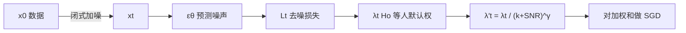

# P2 Weighting：按感知重要性给噪声档加权，而不是把每一步的去噪损失一视同仁

<!-- release-date: 2022-04-01 -->

**本文依据**：`Perception Prioritized Training of Diffusion Models`，arXiv 2204.00227v1（2022-04-01），14 页 letter。作者 Jooyoung Choi、Jungbeom Lee、Chaehun Shin、Sungwon Kim（Data Science and AI Laboratory, Seoul National University）；Hyunwoo Kim（LG AI Research）；通讯作者 Sungroh Yoon（SNU，另署 AIIS、ASRI、INMC、ISRC 与 Interdisciplinary Program in AI）。盘上 PDF 封面无页眉 arXiv 戳、无会议录用行；通讯邮箱 `sryoon@snu.ac.kr`（PDF p. 1）。官方 arXiv：`https://arxiv.org/abs/2204.00227`。首发日取原件首次公开日，即 arXiv v1 提交日 2022-04-01。文中所有数字都标了 PDF 页码；标「外部补充」的段落不来自本文。本文只读这一份 PDF，不把后作里的 Latent Diffusion 写进来，也不重写 DDPM / ADM 本身。

## 一句话

扩散模型的训练目标是各噪声档去噪分数匹配损失的加权和。Ho 等人把经验加权目标变成了事实标准，但没人说清「模型在每一档噪声上学什么」，也没人系统改过这套权。这篇论文先用感知距离和随机重建把扩散步分成粗结构、内容、清扫三档，再提出感知优先加权（perception prioritized weighting，下文简称 P2 加权）：在 Ho 等人的 $\lambda_t$ 上再除以 $(k+\mathrm{SNR}(t))^\gamma$，把几乎看不见的细节档压下去，把内容档抬上来。同一套 ADM 轻量骨干上，换权就在多种数据集、架构变体和采样器上抬 FID / KID；CelebA-HQ 与 Oxford Flowers 上他们报了当时最优 FID（PDF p. 1、p. 6–7）。

它解决的不是「再发明一种扩散架构」，而是训练目标怎么加权：高质量样本，能不能靠改损失权重、不靠更大网络、更长采样链、分类器引导或级联模型。

## 一、矛盾：标准加权能出图，却没人知道它为什么好、是不是最优

2021 年前后，扩散模型已经能画出接近 GAN 的高保真图，尤其是有分类器引导或级联模型的条件设定（PDF p. 1）。无条件、单模型、以及 FFHQ、MetFaces 这类高分辨率人脸集，仍有明显空间（PDF p. 1）。

训练侧的默认做法更窄。模型在各噪声档上学去噪分数匹配，目标是各档损失的加权和。Ho 等人观察到：经验加权比简单求和更利于样本质量；这套加权目标随后成了事实标准（PDF p. 1）。作者写得很直：为什么它好、它是否对样本质量最优，当时仍未知；据他们所知，还没有人为了更好样本质量去系统改加权方案（PDF p. 1）。

改权难在两处（PDF p. 1）：

1. 噪声档有上千种，穷举网格搜不了。
2. 不清楚模型在每一档上学什么，因此不知道该优先哪一档。

本文的因果链因此很短：先查每一档学什么，再按感知重要性改权，最后用实验证明「只改权」就能跨数据、跨架构、跨采样器生效。

图 5 是 256×256 上 FFHQ、CelebA-HQ、MetFaces、AFHQ-Dogs、Oxford Flowers、CUB Bird 的生成样例（PDF p. 6）。实现仓库写在第 3.4 节脚注：`https://github.com/jychoi118/P2-weighting`（PDF p. 5）。

把训练目标画成一条能跟住的流水线（机制示意，根据 PDF p. 4–5 式 7–8 重画，不是实测时间轴）：

权只改训练。前向过程、网络、采样器都可以原样继承。

## 二、背景：VLB 均匀权、Ho 等人简化权、以及 SNR

### 前向与反向

扩散模型把复杂数据分布变成标准正态，再学把噪声还原成数据（PDF p. 2）。前向按预定尺度 $0<\beta_1,\ldots,\beta_T<1$ 逐步加高斯噪声（PDF p. 2 式 1）。任意 $t$ 可闭式抽样（PDF p. 2 式 2）：

$$
x_t=\sqrt{\alpha_t}\,x_0+\sqrt{1-\alpha_t}\,\epsilon
$$

其中 $\epsilon\sim\mathcal{N}(0,I)$，$\alpha_t:=\prod_{s=1}^{t}(1-\beta_s)$。$x_0$、$x_t$ 与 $\epsilon$ 同维。为了 $p(x_T)\approx\mathcal{N}(0,I)$ 且过程可逆，$\beta_t$ 要小、$\alpha_T$ 要接近 0。Ho 等人与 Dhariwal 等人用线性日程；Nichol 等人用余弦日程，使 $\alpha_t$ 像余弦（PDF p. 2）。

反向从 $x_T\sim\mathcal{N}(0,I)$ 出发，用噪声预测器 $\epsilon_\theta$ 迭代减噪（PDF p. 2 式 3）。Ho 等人取 $\sigma_t^2=\beta_t$。

Kingma 等人把噪声日程写成信噪比（signal-to-noise ratio，SNR）。带噪 $x_t$ 的 SNR 是式 2 均值平方与方差之比（PDF p. 2 式 4）：

$$
\mathrm{SNR}(t)=\alpha_t/(1-\alpha_t)
$$

因而 $\alpha_t=1-1/(1+\mathrm{SNR}(t))$。$\mathrm{SNR}(t)$ 对 $t$ 单调下降（PDF p. 2）。

### 训练目标：均匀 VLB 对简化加权

扩散模型是一类变分自编码器：编码器是固定扩散，解码器是可学去噪。变分下界（VLB）是各档去噪分数匹配损失之和 $L_{\mathrm{vlb}}=\sum_t L_t$，各档权均匀（PDF p. 2）。$L_t$ 是两个高斯的 KL，可写成预测噪声的加权平方误差（PDF p. 2 式 5）：

$$
L_t=\mathbb{E}_{x_0,\epsilon}\Bigl[\frac{\beta_t}{(1-\beta_t)(1-\alpha_t)}\,\|\epsilon-\epsilon_\theta(x_t,t)\|^2\Bigr]
$$

人话：网络 $\epsilon_\theta$ 在给定 $t$ 时预测加进 $x_t$ 的噪声。

Ho 等人经验上发现简化目标更利于样本质量（PDF p. 2 式 6）：

$$
L_{\mathrm{simple}}=\sum_t\mathbb{E}_{x_0,\epsilon}\bigl[\|\epsilon-\epsilon_\theta(x_t,t)\|^2\bigr]
$$

相对 VLB，这相当于 $L_{\mathrm{simple}}=\sum_t\lambda_t L_t$，权为 $\lambda_t=(1-\beta_t)(1-\alpha_t)/\beta_t$。连续时间下可写成 SNR 的函数（PDF p. 2 式 7）：

$$
\lambda_t=-1/\mathrm{log\textrm{-}SNR}'(t)=-\mathrm{SNR}(t)/\mathrm{SNR}'(t)
$$

附录 A.2 给出从离散 $\lambda_t$ 到 $T\to\infty$ 近似的推导（PDF p. 11）。

方差方面，Ho 等人固定 $\sigma_t$；Nichol 等人用混合目标 $L_{\mathrm{hybrid}}=L_{\mathrm{simple}}+c L_{\mathrm{vlb}}$，$c=10^{-3}$，学 $\sigma_t$ 以便少步采样仍保质量（PDF p. 2–3）。本文继承混合目标做高效采样，只改 $L_{\mathrm{simple}}$ 的权（PDF p. 3）。

### 评测口径

定量用 FID 与 KID。FID 接近人眼观感，是生成质量的默认指标；KID 常用于小数据集（PDF p. 3）。两者对预处理敏感，作者用「实现正确」的库（PDF p. 3）。分数在生成样本与**全部训练集**之间计算。终报用 50k 样本，消融用 10k，跟随 ADM；分别记 FID-50k 与 FID-10k（PDF p. 3）。

## 三、每一档噪声上学什么：粗结构、内容、清扫

### 旧问题

扩散模型的输出是噪声，不含内容。VAE / GAN 直接出图，读者能看见学了什么；扩散模型则很难从噪声预测读出「视觉概念是怎么学来的」（PDF p. 3）。作者因此先问：训练时每一步到底学了什么信息？

### 查前向过程：用 LPIPS 看内容何时消失

取两张不同干净图 $x_0$、$x'_0$，再取三张带噪图：$x_t^A,x_t^B\sim q(x_t\mid x_0)$，$x'_t\sim q(x_t\mid x'_0)$。图 1 左用 LPIPS 量两种距离：同源两份噪声（蓝）、异源一份噪声（橙）；距离画成 SNR 的函数，对 CelebA-HQ 上 200 组随机三元组取平均（PDF p. 3）。

大 SNR（扩散早期、噪声几乎看不见）：$x_t$ 仍保留 $x_0$ 的大量内容。同源两份感知上接近，异源两份差得开。模型不必理解整体语义就能恢复信号——邻域干净像素已经够用——因此这一档主要学人眼几乎看不见的细节（PDF p. 3）。

小 SNR（扩散晚期、噪声大到内容认不出）：两种距离都收敛到常数。带噪图缺少可识别内容，恢复必须靠先验。作者主张：这一档才逼模型学感知上可识别的内容（PDF p. 3）。

图 1 左的关键观察：感知上可识别的内容，在 SNR 量级大约 $10^{-2}$ 到 $10^{0}$ 之间被去掉（PDF p. 3）。

### 查已训模型：随机重建

给定 $x_0$，先扩散到 $x_t$，再用学到的反向链重建 $\hat x_0$（PDF p. 4 图 2 左）。$t$ 小时重建应极像输入；$t$ 大时应只共享粗属性。

图 2 右：最右列是输入，底栏是 $x_t$ 的 SNR。第 1、2 列只共享粗属性（如全局颜色结构）；第 3、4 列共享感知上可判别的内容；第 5 列几乎与输入相同，说明大 SNR 上学的是感知上不可辨的细节（PDF p. 4）。

据此他们假设，并按 SNR 把噪声档分成三组（PDF p. 4）：

| 阶段 | SNR 范围（论文写法） | 模型学什么 |
|---|---|---|
| 粗结构（coarse） | $0$–$10^{-2}$ | 全局颜色结构一类粗特征 |
| 内容（content） | $10^{-2}$–$10^{0}$ | 感知上丰富、可判别的内容 |
| 清扫（clean-up） | $10^{0}$–$10^{4}$ | 去掉剩余噪声、学不可见细节 |

附录图 B 把图 1 的感知距离曲线复现到 CelebA-HQ、LSUN-Church、CUB，以及 $256^2$ 与 $64^2$；图 C 把图 2 量化成 FFHQ 上 200 张随机图的 LPIPS–SNR 曲线。作者说 3.1 节的观察在这些数据与分辨率上成立（PDF p. 11）。

## 四、P2 加权：压清扫档，抬内容和粗结构

### 新设计

清扫档浪费容量去学看不见的细节。P2 给清扫档最小权，从而相对抬高其余档，并特别强调内容档（PDF p. 4）。权写成（PDF p. 4 式 8）：

$$
\lambda'_t=\frac{\lambda_t}{(k+\mathrm{SNR}(t))^\gamma}
$$

$\lambda_t$ 是 Ho 等人的标准权（式 7）。$\gamma$ 控制把「学不可见细节」压下去的力度。$k$ 防止极小 SNR 时权爆炸，并决定权曲线有多尖。作者强调：可能的设计很多，但最简单的这一档（P2）已经超过 $\lambda_t$。接到现有扩散模型上，只需把 $\sum_t\lambda_t L_t$ 换成 $\sum_t\lambda'_t L_t$（PDF p. 4）。

$\gamma=0$ 时 $\lambda'_t$ 退回 $\lambda_t$。后文把 $\lambda_t$ 叫 baseline（PDF p. 4）。

### 为什么这套权有效

先前工作经验上认为 $\sum_t\lambda_t L_t$ 比均匀 VLB 更利于样本质量，因为后者训练时不施加归纳偏置（PDF p. 4–5）。图 3 把 $\lambda'_t$ 与 $\lambda_t$ 画在线性日程和余弦日程上：两套权都最关注内容档、最少关注清扫档。baseline 的成功，与「内容档的 pretext 才学感知内容」一致（PDF p. 5）。

作者仍认为 baseline 对不可见细节给了不该有的关注，妨碍学感知内容。P2 进一步压清扫档，相对抬粗结构档和内容档。图 3 画的是归一化权，便于看相对变化（PDF p. 5）。图 4 是 FFHQ 上训练过程的 FID-10k：$\gamma=1$ 的 P2 在线性、余弦两种日程上全程优于 baseline；样本用 250 步生成；横轴是模型见过的图像数（PDF p. 5）。

图 4 还有一个副作用观察：余弦日程的 FID 比线性差一大截，尽管 P2 仍能改善它。式 5 说明权与噪声日程相关。图 3 上，余弦日程分给内容档的权比线性更小。作者提醒：设计权与设计噪声日程相关但不等价，因为日程同时改权和 MSE 项（PDF p. 5）。

总结：P2 的归纳偏置是抬粗结构与内容、压清扫（PDF p. 5）。

### 实现选择

$k=1$，因为 $1/(1+\mathrm{SNR}(t))=1-\alpha_t$，部署简单（PDF p. 5）。$\gamma$ 取 $0.5$ 或 $1$。他们经验上看到 $\gamma>2$ 会在样本里出现噪声伪影，因为清扫档权几乎为零（PDF p. 5）。全部实验 $T=1000$。实现叠在 ADM 上，取其架构与高效采样，但全程用更轻的 ADM 变体（PDF p. 5）。

## 五、实验：跨数据、跨架构、跨采样器

### 对 baseline：表 1

在 FFHQ、AFHQ-dog、MetFaces、CUB 上分别训 baseline 与 P2。数据量大约 70k、50k、1k、12k。图像按 ADM 的预处理缩放到 256×256 并中心裁剪（PDF p. 6）。表 1 的 FID-50k / KID-50k（KID 乘 $10^3$）（PDF p. 6）：

| 数据集 | 采样步 | FID Base | FID Ours | KID Base | KID Ours |
|---|---:|---:|---:|---:|---:|
| FFHQ | 1000 | 7.86 | 6.92 | 3.85 | 3.46 |
| FFHQ | 500 | 8.41 | 6.97 | 4.48 | 3.56 |
| CUB | 1000 | 9.60 | 6.95 | 3.49 | 2.38 |
| CUB | 250 | 10.26 | 6.32 | 4.06 | 1.93 |
| AFHQ-D | 1000 | 12.47 | 11.55 | 4.79 | 4.10 |
| AFHQ-D | 250 | 12.95 | 11.66 | 5.25 | 4.20 |
| Flowers | 250 | 20.01 | 17.29 | 16.8 | 14.8 |
| MetFaces | 250 | 44.34 | 36.80 | 22.1 | 17.6 |

作者的判断：权带来的归纳偏置与数据集无关。MetFaces 只有约 1k 张，差距尤其大；他们假设：数据少时，把容量浪费在不可见细节上特别有害（PDF p. 6）。

定性上，baseline 容易出现颜色偏移：FFHQ 上出现在训练早期，MetFaces 上甚至到收敛仍在（PDF p. 6 图 6）。他们假设 baseline 没学好全局颜色方案（PDF p. 6）。

### 对先前文献：表 2

全部 256×256。CelebA-HQ 与 Oxford Flowers 上他们报当时最优 FID；训练仍是 $T=1000$，但更少采样步已经够用（Flower 250 步、CelebA-HQ 500 步）。FFHQ 上多数模型被超过，例外是专门为 FFHQ 设计架构的 StyleGAN2。作者认为 P2 把扩散模型拉近了当时最优，再扩架构、加采样步还会更好（PDF p. 6）。表 2 摘录（PDF p. 7；FFHQ 数字转引自 [11, 32, 38]，Flower 转引自 [16]，CelebA-HQ 转引自 [45]）：

| 数据集 | 方法 | 类型 | FID↓ |
|---|---|---|---:|
| FFHQ | StyleGAN2 | GAN | 3.73 |
| FFHQ | VQGAN | GAN+AR | 9.6 |
| FFHQ | Baseline（500 步） | Diff | 8.41 |
| FFHQ | P2（500 步） | Diff | 6.97 |
| FFHQ | P2（1000 步） | Diff | 6.92 |
| Oxford Flower | MSG-GAN | GAN | 19.60 |
| Oxford Flower | Baseline（250 步） | Diff | 20.01 |
| Oxford Flower | P2（250 步） | Diff | 17.29 |
| CelebA-HQ | VQGAN | GAN+AR | 10.70 |
| CelebA-HQ | LSGM | VAE+Diff | 7.22 |
| CelebA-HQ | P2（500 步） | Diff | 6.91 |

除 GAN 外，他们报优于所列方法（PDF p. 7）。注意：表 2 的 GAN 行里出现 `CVPR’20` 等字样，那是对比方法的出处，不是本 PDF 声称本文录用 CVPR。

### 架构变体：表 3

默认模型公平对比之后，他们改配置：用 Ho 等人残差块替换 BigGAN 残差块、去掉 16×16 自注意力、用两块 BigGAN 残差、默认模型学习率改为 $2.5\times 10^{-5}$。默认是单块 BigGAN 残差、学习率 $2\times 10^{-5}$。250 步采样。表 3 的 FID-10k（PDF p. 7）：

| 变体 | 含义 | Base | Ours（差值） |
|---|---|---:|---:|
| (a) | 默认 | 46.80 | 41.93（−4.87） |
| (b) | 无 BigGAN 块 | 47.62 | 47.37（−0.25） |
| (c) | 自注意力只在 8×8 瓶颈 | 49.56 | 43.09（−6.47） |
| (d) | 两块残差 | 45.45 | 42.06（−3.39） |
| (e) | 学习率 $2.5\times 10^{-5}$ | 46.34 | 39.51（−6.83） |

去掉自注意力时（c）提升尤其大，作者解读为 P2 在鼓励学全局依赖（PDF p. 7）。

### 采样步与采样日程：图 7、表 4

按惯例 $T=1000$ 训练。高分辨率图在当时一块现代 GPU 上生成要超过 10 分钟（PDF p. 7）。Nichol 等人的采样策略能在减步后保质量；≤50 步时 DDIM 有效（PDF p. 7）。

图 7：FFHQ 上 FID 对采样步数；采样跟 Nichol 等人以及 DDIM。P2 在各步数上都优于 baseline，并且常用大约一半步数就能超过 baseline 的成绩（PDF p. 7–8）。

表 4 扫采样日程（把扩散过程三等分，整数序列表示各段步数；`130-60-60` 表示靠近 $t=0$ 用更多步）。FID-10k / KID-10k（PDF p. 8）：

| 方法 | 日程 | FID-10k | KID-10k |
|---|---|---:|---:|
| Base | 250 uniform | 10.88 | 5.91 |
| Base | 130-60-60 | 10.62 | 5.14 |
| Base | 60-130-60 | 12.23 | 7.54 |
| Base | 500 uniform | 9.74 | 4.48 |
| Ours | 250 uniform | 8.92 | 4.24 |

改采样日程只能略微改善，到不了 P2 的幅度。作者的解释：P2 改的是训练，所有步的预测都受益；改采样日程只动推理分配（PDF p. 8）。

## 六、相关工作里他们怎么给自己定位

扩散模型与基于分数的模型可用不同噪声日程的 SDE 统一书写。作者注明：分数模型的噪声日程不同，P2 的 $\gamma$、$k$ 可能要另调，因为日程与权相关（式 5）（PDF p. 8）。近期高质量样本常依赖重架构、很长训练与采样、分类器引导或级联；P2 只改目标，不要求这些（PDF p. 8）。语音扩散也被一笔带过（PDF p. 8）。

他们强调扩散相对似然模型样本更好、相对 GAN 训练更稳、预训练后容易接到翻译与编辑且能一对多，而 GAN 方法常一对一（PDF p. 8）。这些是背景主张，不是本文新实验。

另一条线改目标是为了似然：往往牺牲样本质量、训练不稳，要靠重要性采样或复杂参数化。似然盯细尺度细节，妨碍全局一致性。LSGM 因此对似然训练和 FID 训练用不同权。P2 的归纳偏置对着感知内容，要的是更好样本加稳定训练（PDF p. 8）。

## 七、限制、实现细节、社会影响

扩散模型仍要多步。DDIM 至少约 25 次前向，难进实时；仍快于逐步出像素的自回归。4.3 节显示大约一半步数就能得到更好 FID。他们把动态规划优化采样日程、或把 DDIM 蒸成单步，列为更快采样的未来方向（PDF p. 11）。结论里也说：更精致的权可能进一步提升，留作未来工作（PDF p. 8）。

高保真生成可被用于欺骗。他们指向 deepfake 检测与水印，并认为查扩散样本里的不可见频域伪影可能有用（PDF p. 11）。这是讨论，不是本文实验。

实现（PDF p. 11）：$\epsilon_\theta$ 是 U-Net 风格，输入 3 通道、输出 6 通道（噪声加方差）。继承 ADM：大通道、BigGAN 残差、多分辨率注意力、每头固定通道的多头注意力；时间步经 AdaGN 变成 GN 的尺度与偏置。为效率：更少基通道、更少残差块、自注意力只在单一分辨率 16×16。默认约 94M 参数；他们对比近期工作常用大于 500M、每分辨率 2 或 4 块，自己只用 1 块以加速训练与推理。有限数据用 dropout。EMA 0.9999、32-bit、AdamW。

表 A 超参（PDF p. 12）：一律 $T=1000$、线性 $\beta_t$、通道 128、每头 64 通道。FFHQ / CelebA-HQ：94M、BigGAN 块、$\gamma=0.5$、dropout 0、学习率 $2\times 10^{-5}$、见过图像 18M 与 4.4M。AFHQ-D：$\gamma=1.0$、dropout 0.1、2.4M 张。CUB / Flowers / MetFaces：$\gamma=1.0$、dropout 0.1、图像数 4.8M、4.4M、1.6M。表 3(b)(c)(d) 分别 81M / 90M / 132M，消融只见 0.8M 张。FFHQ 与 CelebA-HQ 取 $\gamma=0.5$，因为这两集上 FID 略好于 $\gamma=1.0$（PDF p. 11）。

资助包括 IITP / SNU AI 研究生院、LG AI Research、Samsung SDS、现代起亚–SNU 联盟与 BK21 FOUR（PDF p. 8）。

## 八、可迁移启发

1. **先回答「每一档噪声在学什么」，再改权。** 上千档不能网格搜；用感知距离和随机重建把连续 SNR 切成少数阶段，比盲调 $\lambda_t$ 便宜。
2. **标准简化目标已经偏向内容档，但清扫档仍然过重。** 若样本颜色漂、小数据 FID 差，优先怀疑容量被细节档吃掉，而不是先加层。
3. **权与噪声日程相关但不是同一旋钮。** 换余弦日程会改内容档的相对权；只改权或只改日程，效果不可互换。
4. **$\gamma$ 有上限。** 压清扫太狠（文中 $\gamma>2$）会出噪声伪影。$k=1$ 是因为 $1/(1+\mathrm{SNR})=1-\alpha_t$，实现零成本。
5. **改训练权，比改采样日程更划算。** 表 4 里扫三等分步数只换到零点几 FID；P2 的 250 步已经低于 baseline 的 500 步均匀采样。
6. **轻骨干上只改目标，也能把扩散拉近 GAN。** 默认 94M、单块残差；不要把「扩散要很大」当成前提。

## 关键词回看

- **去噪分数匹配**：各噪声档上学「从带噪图恢复干净图」，损失是预测噪声与真噪声的距离。
- **VLB 均匀权 / $L_{\mathrm{simple}}$**：前者各档权相同；后者丢掉式 5 里的系数，等价于 Ho 等人的 $\lambda_t$。
- **SNR**：$\alpha_t/(1-\alpha_t)$，单调下降，用来对齐不同噪声日程。
- **粗结构 / 内容 / 清扫**：按 SNR 把扩散步分成学全局颜色、学可判别内容、学不可见细节三档。
- **P2 加权**：$\lambda'_t=\lambda_t/(k+\mathrm{SNR}(t))^\gamma$，压清扫、抬内容。

## 参考资料

- 原件 PDF：`readings/_src/图像、视频与 3D 生成/P2-Weighting.pdf`
- 官方 arXiv：https://arxiv.org/abs/2204.00227
- 作者代码（PDF p. 5）：https://github.com/jychoi118/P2-weighting
