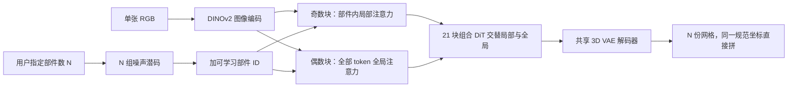

# PartCrafter：组合潜扩散一次从单张 RGB 出可拆部件网格，不再先分割再重建

<!-- release-date: 2025-06-05 -->

**本文依据**：`PartCrafter: Structured 3D Mesh Generation via Compositional Latent Diffusion Transformers`，arXiv:2506.05573v1 [cs.CV]（2025-06-05），20 页 letter。作者 Yuchen Lin^{1,3}*、Chenguo Lin^{1}*（共同一作，Peking University / Carnegie Mellon University）、Panwang Pan^{2}†（项目负责人，ByteDance）、Honglei Yan^{2}、Yiqiang Feng^{2}（ByteDance）、Yadong Mu^{1}（Peking University）、Katerina Fragkiadaki^{3}（Carnegie Mellon University）。项目页 `https://wgsxm.github.io/projects/partcrafter`。盘上 PDF 页眉写明 arXiv:2506.05573v1 [cs.CV] 5 Jun 2025。封面页脚写 **Preprint. Under review.** 官方 abs：`https://arxiv.org/abs/2506.05573`，v1 提交日 **2025-06-05**。封面与全文抽取均未印会议名。文中数字都标 PDF 页码。本文只读这一份 PDF。

## 一句话

单张 RGB 要变成**可拆开的 3D 网格**，难处不在「整坨形状能不能长出来」，而在**部件语义与几何要分开、还要能对上图里看不见的那一面**（PDF p. 1）。当时主流两条路都不稳：整物体潜扩散一次出一块实心网格，贴纹理、做动画、做物理仿真都不好下手；先 2D/3D 分割再逐块重建，分割错了后面全歪，挡着的部件根本切不出来（PDF p. 1–3）。PartCrafter 的做法是：继承已经训好的整物体网格扩散 Transformer（底座是 TripoSG），把潜空间扩成**多组解耦的部件 token**，再用**局部–全局层次注意力**在去噪过程里同时看部件内部和部件之间；用户只给一张图和部件个数 $N$，一次并行去噪出 $N$ 份网格，顶点都在同一份全局规范坐标里，拼起来不用再对齐（PDF p. 1、p. 3）。为了有部件级监督，作者从 Objaverse、ShapeNet、ABO 的 GLTF 元数据里挖出部件标注，而不是像前人那样压成单网格（PDF p. 2、p. 5）。物体和场景都能走同一套架构；作者声称这是第一份从单张图一次生成部件级 3D 网格、且不依赖预分割输入的结构化生成模型（PDF p. 1、p. 6）。

它解决的不是「再做一个更强的整物体 3D 生成器」，而是：**部件结构能不能写进生成过程本身，而不是事后切。**

## 一、矛盾：整物体先验已经很强，结构化输出还在两阶段拼

感知里物体和部件是可组合的积木：可以单独理解、重组、复用。当代网络大多不会形成这种可操作的符号式实体（PDF p. 2）。3D 生成这边，扩散已经能从噪声或图像出整物体网格，但停在物体级，贴纹理、动画、物理仿真、场景编辑都受限制（PDF p. 2）。

补救办法是两阶段：先把图切成语义部件，再对每一块做 3D 重建。作者点名的问题有三：分割误差会传下去；额外分割模型算力贵；难放大（PDF p. 2）。场景侧最近的 MIDI 也是先分割再提示物体级 3D 扩散；**图里看不见的部件切不出来**，这是所有「先分割再重建」的共同缺口（PDF p. 3）。

因此需要一条统一的组合生成架构：**条件只是一张图，同时去噪多个 3D 部件**，物体和多物体场景都能走，不吃预分割输入（PDF p. 1）。

上图是机制示意，根据 PDF 图 2（p. 4）与第 3 节重画，不是实测时间轴。输出表示是网格：第 $i$ 个部件 $p_i=\{V_i,F_i\}$，顶点落在同一份 $[-1,1]^3$ 里（PDF p. 3）。

四条贡献按原文（PDF p. 2）：

- 结构化 3D 生成：显式部件绑定，从图提示出语义部件，组成物体或场景，不要分割输入。
- 组合 DiT：结构化潜空间、带身份的部件–全局注意力、共享解码器。
- 从现有 3D 资产整理出带部件标注的新数据集。
- 物体与多物体场景上都报当时最好的一组结构化生成结果，并用消融钉住各组件。

## 二、相关工作：网格扩散已经会整物体，缺的是「生成时就分开」

**3D 物体生成**。体素、点云、SDF、NeRF、3DGS 都做过。本文盯网格，因为和内容生产管线兼容（PDF p. 3）。网格有两条线：自回归出显式网格结构；潜扩散。后一条在大规模数据上容量大、效果强。PartCrafter 站在后一条上，但前人把物体当整体，忽略数据集里本来就有、艺术家也常用的部件分解（PDF p. 3）。

**部件级物体生成**。一类是把现成部件平移旋转装回去；更接近本文的一类是生成部件几何和结构。表示用过点云、体素、隐式场、参数化图元，受数据规模或表示能力卡住（PDF p. 3）。为了吃 2D 预训练，Part123、PartGen 用多视图扩散加 2D 分割，出带部件标签的 NeRF / NeuS。同期 HoloPart 先把 3D 网格切成部件，再用预训练 3D DiT 把粗部件修细。这些都绑死分割质量，难放大。本文声称可以**一枪出结构化部件物体，不要 2D 也不要 3D 分割**（PDF p. 3）。

**场景生成**。常见做法是先抽布局、图、分割来建模物体关系，再生成或检索物体。最接近的是 MIDI：分割输入图，再用区域去提示物体级 3D 扩散。MIDI 要求组件在图里可见。PartCrafter 受 MIDI 启发，但去掉额外分割模型，图里看不见的部件也能出；作者据此说**显式分割不是结构化 3D 场景生成的必要前提**（PDF p. 3）。

MIDI 与 HoloPart 在文中是基线与对照；这篇自己的主张是组合潜空间加层次注意力。

## 三、底座：整物体已经是 VAE 潜码 + 整流 + 图像交叉注意力

第 3.1 节把底座写成 TripoSG（PDF p. 4）：

1. Transformer 结构的 VAE，表示跟 3DShape2VecSet：形状压成一组潜向量。
2. 解码器用有向距离场（Signed Distance Function，SDF），几何更锐、少走样。
3. 整流（rectified flow）在 VAE 潜码上从噪声走到数据。
4. 条件是单张图的 DINOv2 特征，每个 Transformer 块用交叉注意力灌进去。
5. 训练数据约 **200 万**高质量形状，从 Objaverse 与 ShapeNet 经四段管线：质量打分、滤噪声、修网格、转成水密、SDF 能吃的格式（PDF p. 4）。

设计动机是一个观察：这类整物体潜扩散**开箱就能自编码 3D 部件**，不必像整物体网格那样先把输入归一化到规范空间中心。所以编码器、解码器、去噪 Transformer 都从整物体网格预训练权重初始化，再改造成多实体架构（PDF p. 2、p. 4）。

## 四、设计：多组解耦 token + 局部–全局注意力 + 共享解码

给定提示图 $c$ 和用户指定的部件数 $N$，模型生成结构化资产 $O=\{p_i\}_{i=1}^{N}$，可以是可拆物体，也可以是由物体部件组成的场景（PDF p. 3）。推理时所有部件网格同时生成、同时解码。

### 组合潜空间：一组 token 管一块空间，多组就管多个部件

整物体潜扩散里，预训练 3D VAE 的每个 token **隐式对应规范 3D 空间里的一块区域**（PDF p. 4）。PartCrafter 把这份潜空间扩成多组，每组管一个部件。部件 $p_i$ 写成 $K$ 个 token

$$
z^i=\{z^i_j\}_{j=1}^{K}\in\mathbb{R}^{K\times C}.
$$

为了区分部件，给第 $i$ 组加上可学习身份嵌入 $e_i\in\mathbb{R}^{C}$，随机初始化、训练时更新。部件顺序本身没有固定排列，训练时打乱顺序，保住置换不变。全局资产 token 就是把各组拼起来：$Z=\{z^i\}_{i=1}^{N}\in\mathbb{R}^{NK\times C}$（PDF p. 4）。

人话：以前一份潜码描述整只杯子；现在一组 token 写杯身、另一组写把手，再用 ID 告诉网络「这两组不是同一个人」。

### 局部–全局去噪：先把部件内部看清，再让部件互相看见

信息要在组内和组间流动。局部注意力只在 $z^i$ 内部做，保住部件内部结构；全局注意力在整份 $Z$ 上做，建跨部件交互（PDF p. 4–5）。注意力图写成（PDF p. 5 式 1）

$$
A^{\mathrm{local}}_i=\mathrm{softmax}\Bigl(\frac{z^i(z^i)^\top}{\sqrt{C}}\Bigr)\in\mathbb{R}^{K\times K},\qquad
A^{\mathrm{global}}=\mathrm{softmax}\Bigl(\frac{ZZ^\top}{\sqrt{C}}\Bigr)\in\mathbb{R}^{NK\times NK}.
$$

DiT 仍带长跳连，和 TripoSG 一样，只是把原来的注意力换成这套部件–全局机制。DINOv2 特征同时灌进两级：局部和全局都做交叉注意力。双重条件的意图是：整体构图对上输入图，每个部件自己也有语义（PDF p. 5）。消融在第七节。

共享解码器把每一组潜码映成一份连贯网格（PDF p. 2）。因为顶点已经在同一规范坐标，装配不需要额外变换（PDF p. 3）。

### 训练目标：整流，全部件共用同一个噪声水平

整流把高斯噪声沿直线拉到数据。物体潜码 $Z_0=\{z^i\}_{i=1}^{N}$，噪声水平 $t$，

$$
Z_t=tZ_0+(1-t)\epsilon,\qquad \epsilon\sim\mathcal{N}(0,I).
$$

网络预测速度项 $\epsilon-Z_0$，损失是（PDF p. 5 式 2）

$$
\mathcal{L}_{\mathrm{flow}}=\mathbb{E}_{Z,\epsilon,t}\bigl\lVert(\epsilon-Z_0)-v_\theta(Z_t,t,c)\bigr\rVert^2.
$$

**全部件共用同一个 $t$**，轨迹才一致（PDF p. 5）。

## 五、数据与实现：从 GLTF 里挖部件，课程式微调以免忘掉整物体

前人把 Objaverse 一类资产压成单网格做整物体生成。作者看见许多资产的 GLTF 元数据里本来就有部件——艺术家模块化建模留下的，比如剪刀两片刃（PDF p. 2、p. 5）。图 3：Objaverse 的一个子集里，超过一半物体带显式部件标注（PDF p. 5）。

整理结果（PDF p. 5）：合并 Objaverse、ShapeNet、ABO 等，得到 **130,000** 个 3D 物体，其中 **100,000** 含多个部件；再按纹理质量、部件数、部件级平均 IoU 过滤，得到约 **50,000** 个带部件标签的物体、**300,000** 个独立部件。场景用现成的 3D-Front。

附录把过滤写死（PDF p. 15）：Objaverse 用 LGM 提供的高质量子集；去掉无纹理物体；部件数少于 **16**；最大 IoU 小于 **0.1**。另加 **30,000** 个整物体做正则。3D-Front 用 MIDI 处理过的版本。作者声明将以 CC-BY 4.0 发布这份数据。

实现（PDF p. 6）：改 TripoSG 的 **21** 个 DiT 块，奇偶交替换注意力——偶数块全局、奇数块局部，走长跳连那套。**8** 张 H20，batch **256**，全量微调预训练 TripoSG。课程：

1. 底座：部件物体数据上最多 **8** 个部件，学习率 $1\times 10^{-4}$，**5K** 步。
2. 可拆物体：再微调到最多 **16** 个部件。
3. 场景：底座迁到 3D-Front，最多 **8** 个物体。后两段都是 **5K** 步、学习率降到 $5\times 10^{-5}$。

训练里混 **30%** 整物体做正则。作者说这套课程能避免损失尖峰和灾难性遗忘。全程约 **2** 天。每部件 **512** 个 token。测试集约 **2K** 条（PDF p. 6）。

## 六、实验：物体表上全面更好，遮挡场景才把「不必分割」钉死

实验要答四件事（PDF p. 6）：相对先分割再重建，部件重建好不好；看不见的部件能不能出；部件个数变了会怎样；局部–全局设计各自贡献多少。

**基线。** 作者认为这是第一份从单图生成部件级 3D 物体网格的工作。Part123、PartGen 出的是神经场，和网格不好直接比。物体级用同期 HoloPart：先 TripoSG 从图出网格，再 HoloPart 切并修部件；为公平，TripoSG 的 token 数对齐成 $N\times 512$。场景级用 MIDI，评测时给 MIDI **真值分割 mask**，PartCrafter 不要任何分割（PDF p. 6）。

**指标。** 生成部件和真值没有对应关系，所以把部件拼成一张网格再算。全局保真：L2 Chamfer Distance（CD）和阈值 **0.1** 的 F-Score。部件几何独立性：规范空间体素化成 $64\times 64\times 64$，算生成部件之间的平均 IoU，越低越少重叠。最优是部件不相交、拼起来又像真值。时间报测试集里 **4** 个部件的物体或场景在一张 H20 上的平均耗时（PDF p. 6）。

### 物体：比 HoloPart 快两个数量级，整物体指标也超过对齐 token 的底座

表 1（PDF p. 7）：

| 方法 | Objaverse CD / F-Score / IoU | ShapeNet CD / F-Score / IoU | ABO CD / F-Score / IoU | 时间 |
|---|---|---|---|---|
| 数据集（仅 IoU） | — / — / 0.0796 | — / — / 0.1827 | — / — / 0.0137 | — |
| TripoSG | 0.3104 / 0.5940 / — | 0.3751 / 0.5050 / — | 0.2017 / 0.7096 / — | — |
| TripoSG*（token 对齐） | 0.1821 / 0.7115 / — | 0.3301 / 0.5589 / — | 0.1503 / 0.7723 / — | — |
| HoloPart | 0.1916 / 0.6916 / 0.0443 | 0.3511 / 0.5498 / 0.1107 | 0.1338 / 0.8093 / 0.0449 | 18 min |
| Ours | **0.1726 / 0.7472 / 0.0359** | **0.3205 / 0.5668 / 0.0293** | **0.1047 / 0.8617 / 0.0243** | **34 s** |

HoloPart 要把生成网格再切一遍，生成网格又不如艺术家网格干净，分割吃亏，还要约 **18** 分钟；本文约 **34** 秒（PDF p. 6–7）。作者强调：即使 token 数对齐，物体级指标仍超过底座 TripoSG，说明局部–全局注意力改善了物体级表示，结构理解反过来抬升生成（PDF p. 6–7）。ShapeNet 上整体偏弱，作者归因于底座在 ShapeNet 上本来就差（PDF p. 7）。图 4 用来展示能推断条件图里看不见的部件（PDF p. 7–8）。

### 场景：MIDI 拿真值 mask 仍在保真上落后；一遮挡差距拉开

表 2（PDF p. 7）：

| 方法 | 3D-Front CD / F-Score / IoU | 遮挡子集 CD / F-Score / IoU | 时间 |
|---|---|---|---|
| MIDI | 0.1602 / 0.7931 / **0.0013** | 0.2591 / 0.6618 / **0.0020** | 80 s |
| Ours | **0.1491 / 0.8148** / 0.0034 | **0.1508 / 0.7800** / 0.0035 | **34 s** |

MIDI 在 IoU 上略好，作者归因于流水线用了真值 2D mask（PDF p. 7）。遮挡子集上 MIDI 的 CD 从 0.1602 升到 0.2591、F-Score 从 0.7931 掉到 0.6618；本文几乎不掉（0.1491→0.1508，0.8148→0.7800）。这是「不必分割」最硬的一条证据：真值 mask 切不全的物体，两阶段过不去，组合去噪还能出（PDF p. 7）。

## 七、消融：没有局部会塌，没有 ID 会混，交替注意力换独立性

表 3 全在 Objaverse 上，设定与底座一致：最多 8 部件、每部件 512 token、5K 步、$1\times 10^{-4}$、batch 256（PDF p. 7–9）。带齐部件 ID、局部自注意力、全局自注意力、两级交叉注意力、中间放全局时，CD **0.1711**、F-Score **0.7374**、IoU **0.0814**，作为对照行反复出现。

- **去掉部件 ID**：CD 0.3143、F-Score 0.4978、IoU 0.1401，作者说分不清部件，模型塌了（PDF p. 8–9）。
- **去掉局部注意力**（全局还在）：CD 0.4632、F-Score 0.2327，作者说完全生成不出有意义的网格（PDF p. 7、p. 9）。
- **去掉全局注意力**：还能出网格，但没有部件分解、几何重叠大，IoU **0.1602**（PDF p. 7、p. 9）。
- **交叉注意力只开一边**：只开局部交叉，保真更好、独立性变差（CD 0.1744、IoU 0.0869）；只开全局交叉，独立性略好、保真变差（CD 0.1847、IoU 0.0824）。两边都开才取得对照行那组数（PDF p. 8–9）。
- **21 块里局部/全局大致各半**，全局放中间、放两端、还是交替。交替：CD 0.1781、F-Score 0.7212、IoU **0.0518**；放两端 IoU 更好（0.0336）但 CD 升到 0.1901；放中间保真最好、IoU 最差。作者选交替，作为局部指标和全局指标的折中（PDF p. 8–9）。实现节写的「偶数全局、奇数局部」就是这套交替（PDF p. 6）。表 3 最后一行 Ours 与交替行数字相同。

图 6：同一张图，部件数从 1 到 8 都能出合理分解，粒度可变（PDF p. 9）。

## 八、纹理、限制、没写什么

纹理不在主模型里。附录用现成 Hunyuan3D-2 给已生成的部件物体贴纹理；该模型在整物体上训，作者说用在部件物体上仍可。因为知道每个顶点属于哪一块，可以改 UV，把纹理派到对应部件。相对把形状和纹理当整物体一起出，作者认为能减少部件之间串色，结构也更像真实可拆物体；下游他们点到仿真迁移和机器人训练（PDF p. 15，图 7）。这是附录定性，没有贴纹理后的 CD 表。

限制写得很短：部件级数据只有 **50K**，相对整物体生成常用的百万级很小；未来应把更高质量数据上的 DiT 训练放大（PDF p. 9）。更广影响只提大规模训练的环境代价，没有安全评测。

论文没写、不要补的：没有推理步数、CFG 尺度、单卡显存；没有把 $N$ 从用户指定改成模型自动决定的公式；没有开源仓库的 commit（只声明代码与训练数据将发布，附录写 MIT / CC-BY 4.0，PDF p. 1、p. 15）；没有会议录用信息。

## 九、可迁移的几条，以及读完留下的判断

1. **先问结构是不是生成目标。** 若下游要拆件、贴不同材质、做关节，整物体网格再切，会把分割误差和遮挡一起吃进去。把「一组 token 对应一块空间」扩成多组，比在输出端加一个分割头更对症。
2. **预训练整物体权重可以当部件编码器来用。** 前提是不要强行把部件网格居中到规范空间——这篇的观察是：隐式占位的 token 已经带空间，居中反而丢掉相对位置。
3. **局部和全局不要抢同一层。** 消融显示：没有局部会塌，没有全局会粘成一块。奇偶交替、两级都灌图像条件，是在保真和互不重叠之间折中，不是装饰。
4. **身份嵌入不是小品。** 去掉 ID 比去掉全局更致命。多实体并行去噪时，若没有置换不变的身份信号，注意力会把实体搅在一起。
5. **课程和正则是为了别忘掉底座。** 30% 整物体、先 8 部件再 16、场景另迁，针对的是「部件数据比预训练小两个数量级」。数据上不去，架构再组合也会欠拟合。
6. **评测要同时看拼起来像不像、拆开后叠不叠。** 只报 CD 会鼓励部件互相侵入；只报 IoU 会鼓励碎成不相交的薄片。遮挡子集把两阶段方法的真实失败模式暴露出来，比在干净 mask 上再卷 0.01 的 CD 有用。

被实验托住的：单图、无分割输入的一次多部件网格；物体三套数据上相对 HoloPart 的保真、独立性和时间；3D-Front 及遮挡子集上相对 MIDI（真值 mask）的保真；局部注意力、部件 ID、两级交叉注意力的必要性。只是作者观察的：看不见的部件、可变 $N$、纹理附录，主要靠图。公开缺口：50K 部件数据相对百万级整物体仍小，放大路径只写了一句。

## 关键词回看

- **组合潜空间（compositional latent space）**：每个 3D 部件独占一组解耦 token，不再共用一份整物体潜码。
- **部件身份嵌入（part identity embedding）**：加在该组 token 上的可学习向量，训练时打乱部件顺序以保持置换不变。
- **局部–全局注意力（local-global / hierarchical attention）**：组内自注意力保细节，全部 token 上的自注意力保布局；图像条件对两级都做交叉注意力。
- **整流（rectified flow）**：沿直线从噪声走到数据，预测速度；全部件共用同一个时间 $t$。
- **先分割再重建**：MIDI、HoloPart 一类流水线；本文用来对照的旧路，不是本文方法。
