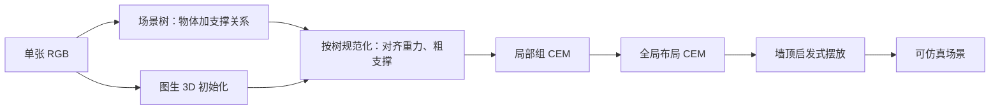

# REST3D：单张图先建重力支撑场景树，再按树做物理约束优化，把漂浮和穿透收成可仿真场景

<!-- release-date: 2026-05-28 -->

**本文依据**：`REST3D: Reconstructing Physically Stable 3D Scenes from a Single Image`，arXiv:2605.30338v1 [cs.CV]（2026-05-28），24 页 letter。作者 Xiaoxuan Ma、Jiashun Wang、Nicolás Ugrinovic、Yehonathan Litman、Kris Kitani，Carnegie Mellon University。项目页 `https://shirleymaxx.github.io/REST3D/`。盘上 PDF 页眉写明 arXiv:2605.30338v1 [cs.CV] 28 May 2026。官方 abs：`https://arxiv.org/abs/2605.30338`，v1 提交日 **2026-05-28**。封面与全文抽取均未印会议名。文中数字都标 PDF 页码。本文只读这一份 PDF。

## 一句话

单张 RGB 要变成仿真器里能站住的数字资产，难处不在「每件东西看起来像」，而在**只看到一个视角，却要同时保住外观，以及重力下谁撑谁、谁不该穿进谁**（PDF p. 1–2）。当时两条旧路都不稳：单图重建（Gen3DSR、SceneGen、SAM3D 一类）几何看着过得去，导入仿真器却漂、穿、塌；条件场景生成或检索拼装（DigitalCousins、全 agent 生成）物理上更像样，但先验太强，布局对不上这张图（PDF p. 1–2）。REST3D 的做法是：先用 agent 式物理理解从重力–支撑视角长出一棵场景树，再用图生 3D 初始化，按树做规范化和分治优化，最后用仿真器信号把穿透和失稳压下去，同时用布局能量把结果钉在输入图附近（PDF p. 1–2、p. 4）。合成 Replica、真实 ScanNet++、自建随意图，以及 VR 人手交互，都按 PDF 写成同一条链：视觉一致加物理可仿真（PDF p. 1、p. 6–8、p. 17–20）。

它解决的不是「再做一个更强的单物体 3D 生成器」，而是：**物理结构能不能先写成树，再当约束去改位姿，而不是事后靠仿真器自己摔。**

## 一、矛盾：看着对和站得住，现有方法只能占一头

作者把需求钉在沉浸交互、内容制作和游戏：随手一张图要变成仿真就绪资产（PDF p. 1）。多视图或视频还能补几何；单图观测少，但图里仍有物体、外观，以及接触关系（PDF p. 1）。

现有单图重建常给出几何说得通、物理说不通的结果：该搁在支撑面上的物体漂着，该挨着的物体互相穿，导入仿真器就塌（PDF p. 1–2，图 1）。DigitalCousins 一类检索拼装想靠现成资产换物理合理性，库覆盖不够就对不上图里那件东西（PDF p. 2）。条件场景生成能做出物理上像样的布局，但靠学来的场景先验，排布合理却不准，复现不了观测（PDF p. 2）。

一句话：要么看起来对、物理不行；要么物理行、对不上图（PDF p. 2）。REST3D 把两头接到同一框架里：物理场景理解给出结构先验，物理约束优化改位姿（PDF p. 2，图 2）。作者还写，相对当时标杆 SAM3D，稳定性有 **83 个百分点** 的提升（PDF p. 2）；表 1 里 Replica 上 SAM3D† 稳定率 8.3%、本文 95.8%，ScanNet++ 上 4.6% 对 93.6%，Custom 上 16.0% 对 95.5%（PDF p. 6）。83 是引言里的概括，分数据集数字以表 1 为准。

上图是机制示意，根据 PDF 图 2（p. 4）与第 3 节重画，不是实测时间轴。仿真器 Isaac Gym 出现在第三阶段，不是第一阶段的分割工具（PDF p. 4–5）。

三条贡献按原文（PDF p. 2）：

- agent 式物理理解：推断物体物理状态和关系，场景树当结构先验。
- 在树引导下做初始化、对齐，再用物理约束优化改物理违规，同时保住与输入图的视觉一致。
- 合成与真实数据上物理稳定性和重建质量当时最好，并能做稳定仿真和沉浸交互。

## 二、相关工作：重建盯外观，生成盯像样，单图要对上观测

**3D 场景重建**。RGB-D、点云、多视图已经能做准，但要专门传感或密视角（PDF p. 2）。单图更实用：早期体素占用限在预定义类；后来 Gen3DSR、SceneGen 用基础模型先验，相关工作里点名图生 3D 如 TREELIS（原文拼写，引用 Xiang 等结构化 3D 潜码，PDF p. 2）。SAM3D 提高单件质量，作者认为它主要盯单件而不是整场（PDF p. 2）。LLM / VLM 进来后有推理加检索；DigitalCousins 仍被资产库卡住（PDF p. 2）。作者的判断：这些工作主要做视觉重建，场景级物理合理性被放过（PDF p. 2）。

**3D 场景生成**。文本生成、桌面场景、agent 管线都能做出物理像样的结果；有的先把文本变成中间图再 3D，形式上有点像重建（PDF p. 2–3）。作者认为全 agent 生成难控，接到真实重建上会对不齐（PDF p. 3）。单图重建更紧：必须和观测一致（PDF p. 3）。本文因此用 agent 辅助，但不把生成整段交给 agent；任务拆成可定义的子问题（PDF p. 3）。

## 三、问题形式：一张图进，世界系网格加布局出，要能进仿真器

给定单张 RGB $I$，目标是物理上说得通的 3D 场景 $S$：物体网格，加上世界系布局，准备进物理仿真（PDF p. 3）。框架三阶段（PDF p. 3–4，图 2）：

1. 场景树构建（第 3.1 节）：层次树 $T$，编码物体物理状态和空间关系。
2. 场景初始化与规范化（第 3.2 节）：图生 3D 得到 $S_{\mathrm{raw}}$，再按树规范化成 $S_{\mathrm{cano}}$。
3. 物理约束优化（第 3.3 节）：仿真器信号改位姿，物理一致，同时保住视觉一致。

## 四、场景树：开集列物体、agent 分割、再从重力看谁撑谁

任意图自动重建，第一阶段拆成三步，各用专门的物理理解 agent（PDF p. 3）。

**开集物体表**。场景分析器用 VLM（正文写 Gemini）出结构化开集列表 $O=\{O_i\}$。不要只写「植物」这种粗类，要带消歧属性，例如「餐桌上的植物」（PDF p. 3）。附录还要求相似物体用位置或颜色分开，并人手把地板加进列表当地面参考；完整提示放在他们的 GitHub，PDF 正文没有贴出仓库 URL（PDF p. 14）。

**agent 式实例分割**。描述 $O_i$ 可以直接喂 SAM3，遮挡和真实场景复杂度下会不准。于是做成分割 agent $A_{\mathrm{seg}}$ 加核验 agent $A_{\mathrm{ver}}$：$A_{\mathrm{seg}}$ 把 $O_i$ 改成更细的 SAM3 提示出候选 mask，叠到原图上给 $A_{\mathrm{ver}}$ 判是否对上目标描述；不对就改提示再来。核验通过，或判定物体不在场，循环停（PDF p. 3）。附录把上限写成 **10** 轮（PDF p. 14–15）。得到 mask 集 $M=\{M_i\}$，每张 mask 绑一条唯一描述（PDF p. 3）。

**空间推理建树**。树 $T$ 的四个规范支撑根是地面、墙、天花板、地面–墙（PDF p. 3）。VLM 看叠了 mask 的物体对 $(M_i,M_j)$，从重力视角判支撑父节点和关系类型。正文例子是 on、hanging、attached to；附录还写了 inside，以及物体可动还是固定（PDF p. 3、p. 14–15）。餐桌 on 地面，盆栽 on 餐桌；散热器同时碰地面和墙，父节点用地面–墙（PDF p. 3）。悬挂、附着主要给墙挂或顶挂：窗帘挂杆、画贴墙、吊灯贴顶（PDF p. 15）。墙、顶为父的物体不进局部和全局优化，优化完其余物体后再启发式摆放，仿真时固定（PDF p. 15）。

树给后面初始化和优化当结构先验（PDF p. 3）。

## 五、初始化：SAM3D 出网格和粗位姿，再按树对齐重力、把孩子落到支撑面

有 $T$ 和 $M$ 之后，用图生 3D（正文用 SAM3D）从各 mask 重建网格，并用它估的旋转、平移、尺度在世界系拼出 $S_{\mathrm{raw}}$（PDF p. 3）。$S_{\mathrm{raw}}$ 常常物理不一致：全局朝向歪，件与件碰撞；图 2 里桌子漂、植物穿进桌面（PDF p. 3–4）。直接进仿真器会失稳（PDF p. 4）。

规范化两步（PDF p. 4）：

1. **改全局朝向**。重建场景的「上」常和重力对不齐。用树，从地面支撑物体和大件家具锚点估主导竖直方向 $Y'$，整场转到与世界 $Y$ 轴对齐（与重力相反）。
2. **按层次支撑粗对齐**。遍历树，按父子关系沿竖直方向把孩子挪到支撑面上，消竖直穿透。

得到更像样的 $S_{\mathrm{cano}}$。残余交叉仍可能让仿真失稳，所以还要第三阶段（PDF p. 4）。作者强调管线对模型不敏感，可以换更强的 VLM 或图生 3D（PDF p. 4）。

## 六、优化：按树分治，局部 CEM 再全局 CEM，能量四项一起管稳、穿、漂、走样

从 $S_{\mathrm{cano}}$ 出发，改物体位姿，使场景在仿真下稳，又尽量贴住 $S_{\mathrm{cano}}$（PDF p. 4）。物理信号来自 Isaac Gym。分治：后序遍历把场景切成局部组，组内优化，再对整场做全局优化（PDF p. 4–5）。

### 局部组

每个至少有一个孩子的非根节点 $g$ 和它的直接孩子组成一组。后序保证当节点出现在父组里时，它自己的组已经优化完。没有孩子的节点不当局部组，留给全局（PDF p. 4）。

组里 $N_g$ 个孩子，每个 6 自由度位姿。初始布局 $P_{\mathrm{cano}}=\{(R_i^{\mathrm{cano}},t_i^{\mathrm{cano}})\}$。要找一小套位姿调整，既稳又不太改布局。写成对调整量的分布优化，最小化物理能量 $E$（PDF p. 4–5）。

优化器用交叉熵方法（Cross-Entropy Method，CEM）：对调整维持对角高斯 $\mathcal{N}(\mu_t,\Sigma_t)$，$\mu_t\in\mathbb{R}^{N_g\times 6}$。第 $t$ 轮抽 $K$ 个样本

$$
\Delta P_t^{(k)}\sim\mathcal{N}(\mu_t,\Sigma_t),\quad k=1,\ldots,K,
$$

加到 $P_{\mathrm{cano}}$ 上得到候选，全部进 Isaac Gym 仿真，算 $E$。取能量最低的前 $\lceil\rho K\rceil$ 个当精英集 $E_t$，用矩匹配更新均值和方差。跑 $T$ 轮后取全程最低能量的候选当该组最终布局 $P^\star$（PDF p. 5）。附录算法 2 把同一套写成子程序（PDF p. 14–15）。

### 能量

候选放进仿真器前向仿真后，

$$
E=\lambda_{\mathrm{stab}}E_{\mathrm{stab}}+\lambda_{\mathrm{vel}}E_{\mathrm{vel}}+\lambda_{\mathrm{pen}}E_{\mathrm{pen}}+\lambda_{\mathrm{layout}}E_{\mathrm{layout}}.
$$

四项含义（PDF p. 5）：

- $E_{\mathrm{stab}}$：仿真 $L$ 步后，平移差加旋转测地距离，量「放下去之后漂了多少」。
- $E_{\mathrm{vel}}$：中间步 $\tau$ 的线速度之和，当失稳早信号；速度大说明还在撞、还没稳住。
- $E_{\mathrm{pen}}$：放置时用 GJK 数凸包相交，再加 $L$ 步沉降后的相交。
- $E_{\mathrm{layout}}$：沉降后相对 $S_{\mathrm{cano}}$ 的位置差加旋转距离，权重 $\lambda_{\mathrm{pos}}$。防止为了稳把物体撒得太开。

### 全局

各组优化完，把父节点是地面或地面–墙的物体，连同已优化组（每组当刚体）做成更高一层图，再用同一套 CEM 和同一能量，迭代次数相同。候选里组内孩子位姿由更新后的根位姿与局部 $P^\star$ 复合（PDF p. 5）。最后启发式处理墙、顶父节点物体：无碰撞且尽量贴布局，得到最终 $S$（PDF p. 5）。

墙顶摆放细节在附录：先按 $S_{\mathrm{cano}}$ 原位放；若与已优化场景相交，用已沉降物体轴对齐包围盒拟合后、左、右三面墙（平面网格），把墙/顶物体派到最近拟合面，沿法向平移直到不相交（PDF p. 15）。

## 七、实验设定：四个单图基线，三套数据，物理指标和几何指标分开报

基线：DigitalCousins、Gen3DSR、SceneGen、SAM3D。都用公开代码和预训练。SAM3D 本是单物体，作者把第一阶段接上去做场景级 $S_{\mathrm{raw}}$，表里标 SAM3D†（PDF p. 5–6）。DigitalCousins 每场检索三个候选，定量对三个平均，可视化用第一个（PDF p. 15）。

数据：合成 Replica、真实 ScanNet++（会议室、教室、办公室等），再加自建 Custom（卧室、客厅，甚至卡通），测随意单图（PDF p. 6）。附录数量：Replica **3** 场，ScanNet++ **12** 场，Custom **25** 张网图和前作图，含真实、合成渲染、卡通、World Labs Marble 的高斯渲染；每场物体 **4–30** 件（PDF p. 15）。

失败率：给不出任何有效场景的比例。物理：碰撞率、稳定率、放置到沉降的位置漂移、峰值线速度和角速度。Replica 与 ScanNet++ 有真值网格，再报 Chamfer Distance、F-score@0.05、B-IoU；评前 ICP 对齐。Custom 无真值网格，几何列为空（PDF p. 6）。附录定义：碰撞用 trimesh 查网格相交；物体相对平移超过 **0.1 m** 或旋转超过 **0.1 rad**（$L=60$ 步后）算不稳；线/角速度报所有物体平均峰值；B-IoU 是轴对齐 3D 框交并比（PDF p. 15）。

实现：第一阶段 VLM 都是 Gemini 3 Flash；分割 agent 调 SAM3；图生 3D 用 SAM3D；第三阶段 Isaac Gym，重力尽量按真实，例如 $-9.8\,\mathrm{m/s}^2$（PDF p. 6–7）。CEM：局部和全局各两轮 episode，每轮 $T=15$，每步 $K=2048$，精英比 $\rho=0.025$，仿真 $L=60$。系数 $\lambda_{\mathrm{stab}}=\lambda_{\mathrm{vel}}=\lambda_{\mathrm{layout}}=1$，$\lambda_{\mathrm{pen}}=0.5$，$\lambda_{\mathrm{pos}}=6$（PDF p. 7）。附录：初始高斯均值 0，平移标准差 $(0.05,0.005,0.05)\,\mathrm{m}$，旋转 $(0.005,0.05,0.005)\,\mathrm{rad}$，水平位移和俯仰搜索更大；PhysX GPU，接触偏置 0.01 m，最大穿透速度 5 m/s，时间步 $1/60\,\mathrm{s}$、2 个子步，地面摩擦 1.0、恢复 0；V-HACD 体素分辨率 $10^5$，近凸家具最多 8 个凸包、植物窗帘等 32、其余 16；线/角阻尼 0.3；速度能量在 $\tau=15$ 测（PDF p. 15–16）。

## 八、主结果：物理大幅抬，几何略让给 SAM3D†，因为要把穿透拉开

表 1（PDF p. 6）：

| 数据 | 方法 | 失败率↓ | 碰撞率↓ | 稳定率↑ | 位置漂移 (m)↓ | 线速度 (m/s)↓ | 角速度 (rad/s)↓ | CD↓ | F-Score↑ | B-IoU↑ |
|---|---|---|---|---|---|---|---|---|---|---|
| Replica | DigitalCousins | 0.0 | 37.0 | 47.2 | 0.336 | 1.281 | 1.103 | 0.073 | 0.650 | 0.14 |
| Replica | Gen3DSR | 0.0 | 61.9 | 25.0 | 0.721 | 3.837 | 1.255 | 0.118 | 0.526 | 0.10 |
| Replica | SceneGen | 0.0 | 76.7 | 11.1 | 1.126 | 3.962 | 8.626 | 0.062 | 0.637 | 0.12 |
| Replica | SAM3D† | 0.0 | 66.7 | 8.3 | 1.116 | 1.385 | 5.787 | 0.004 | 0.954 | 0.43 |
| Replica | Ours | 0.0 | 0.0 | 95.8 | 0.094 | 0.152 | 0.557 | 0.007 | 0.919 | 0.37 |
| ScanNet++ | DigitalCousins | 33.3 | 20.4 | 45.4 | 0.481 | 1.825 | 2.452 | 0.087 | 0.539 | 0.07 |
| ScanNet++ | Gen3DSR | 66.7 | 77.9 | 1.7 | 3.654 | 7.966 | 12.339 | 0.078 | 0.546 | 0.04 |
| ScanNet++ | SceneGen | 50.0 | 80.9 | 5.3 | 10.035 | 29.771 | 27.762 | 0.052 | 0.635 | 0.12 |
| ScanNet++ | SAM3D† | 0.0 | 39.1 | 4.6 | 0.948 | 2.096 | 8.121 | 0.015 | 0.816 | 0.19 |
| ScanNet++ | Ours | 0.0 | 5.9 | 93.6 | 0.080 | 0.159 | 1.039 | 0.019 | 0.807 | 0.20 |
| Custom | DigitalCousins | 48.0 | 25.0 | 50.2 | 0.911 | 2.196 | 2.158 | — | — | — |
| Custom | Gen3DSR | 40.0 | 68.2 | 7.2 | 2.756 | 6.493 | 9.009 | — | — | — |
| Custom | SceneGen | 16.0 | 78.4 | 2.9 | 15.626 | 27.475 | 29.499 | — | — | — |
| Custom | SAM3D† | 0.0 | 45.4 | 16.0 | 1.189 | 1.929 | 11.801 | — | — | — |
| Custom | Ours | 0.0 | 1.2 | 95.5 | 0.017 | 0.140 | 0.468 | — | — | — |

ScanNet++ 和 Custom 上 DigitalCousins 近一半给不出有效重建；SAM3D† 和本文失败率都是 0，作者归因于自动场景分析和图生 3D 先验。基线物理仍差：SceneGen 漂移可超过 10 m（PDF p. 7）。几何上 SAM3D† 略好：优化要把互穿物体分开，相对初始重建有小偏差，CD 略升。作者据此说 CD 不算物体级物理是否合法，SAM3D 可以几何分更高却严重互穿（PDF p. 7）。附录图 9 给典型例：SAM3D† 对真值 CD 0.004、F 0.977、B-IoU 0.717，本文 0.007、0.892、0.592，椅子漂、穿，本文把椅子从桌边拉开、落到地上（PDF p. 16）。

定性：图 3、6、7 把仿真画成初始、20 步、40 步、终态。本文全程稳；DigitalCousins 能保住墙挂，但检索布局错（椅子放到桌上）；SceneGen 布局不准；Gen3DSR 把大块板状物误成冰箱；SAM3D† 单件保真高，整场朝向错、互穿，也推不出墙挂，海报会掉（PDF p. 7–8）。Custom 上 DigitalCousins 常无有效结果（PDF p. 9）。图 7 上半 ScanNet++，下半 VIGA（PDF p. 10）。附录再比全 agent 生成 SAGE：能仿真，但难控、模板感，对不上真实观测（PDF p. 16，图 10）。Marble 高斯渲染、卡通和合成图上，若干基线直接失败，本文仍稳（PDF p. 17、p. 23–24）。

## 九、消融：规范化不够，只做全局会炸，能量少任何一项都掉

消融在三套数据上平均；几何只在 Replica 和 ScanNet++（Custom 无真值）（PDF p. 7）。

表 2（PDF p. 7）：

| 设定 | 失败率↓ | 碰撞率↓ | 稳定率↑ | 位置漂移↓ | 线速度↓ | 角速度↓ |
|---|---|---|---|---|---|---|
| SAM3D†（$S_{\mathrm{raw}}$） | 0.0 | 45.1 | 12.0 | 1.111 | 1.939 | 10.246 |
| 规范化 $S_{\mathrm{cano}}$ | 0.0 | 26.3 | 45.8 | 0.767 | 1.227 | 9.724 |
| 仅全局 | 10.0 | 4.3 | 89.4 | 0.116 | 0.281 | 1.903 |
| 全文 $S$ | 0.0 | 2.7 | 94.9 | 0.072 | 0.138 | 0.880 |

规范化明显减大漂移，仍不够；图 4 显示 $S_{\mathrm{cano}}$ 仿真到最后仍塌（PDF p. 7–8）。去掉树引导的局部组、所有物体一次全局优化，约 10% 给不出有效结果，因为物体多时联合优化难稳；失败场被排除后再算指标，作者说这可能偏乐观，仍低于全文（PDF p. 8）。

表 3 能量项（PDF p. 8）：

| 设定 | 失败率↓ | 碰撞率↓ | 稳定率↑ | 位置漂移↓ | 线速度↓ | 角速度↓ | CD↓ | F-Score↑ |
|---|---|---|---|---|---|---|---|---|
| 无 $E_{\mathrm{stab}}$ | 5.0 | 4.4 | 90.8 | 0.136 | 0.260 | 1.423 | 0.018 | 0.820 |
| 无 $E_{\mathrm{vel}}$ | 0.0 | 5.5 | 92.8 | 0.109 | 0.168 | 0.798 | 0.017 | 0.823 |
| 无 $E_{\mathrm{pen}}$ | 0.0 | 9.6 | 92.2 | 0.103 | 0.179 | 1.320 | 0.016 | 0.828 |
| 无 $E_{\mathrm{layout}}$ | 0.0 | 2.2 | 91.8 | 0.075 | 0.144 | 0.778 | 0.024 | 0.726 |
| 全文 | 0.0 | 2.7 | 94.9 | 0.072 | 0.138 | 0.880 | 0.017 | 0.824 |

去掉稳定项约 5% 找不到稳解。去掉穿透项几何最好、物理变差：初始重建常互穿，没有碰撞惩罚就更贴原位。去掉布局项会把重交叉物体拉开换稳定，布局偏离更大（PDF p. 8）。

表 5：把树接到仿真里，SAM3D† 稳定率 12.0→36.6，规范化场 45.8→70.6，碰撞率不变，说明墙顶物体不是唯一失稳源，互穿几何还在；全文优化后稳定率 94.9（PDF p. 17）。表 6：$\rho$ 太小精英不够多样，太大选择不够尖；$0.025$ 稳 94.9，漂移 0.072；$\rho=0.5$ 稳 83.0（PDF p. 19）。

耗时与 API（NVIDIA TITAN RTX，表 4，PDF p. 17）：DigitalCousins 32.5 min/场、$1.25$；Gen3DSR 39.3 min；SceneGen 27.1 min；SAM3D† 10.6 min、$0.22$（与本文第一阶段相同）；本文合计 25.8 min、$0.47$（Gemini 3 Flash）。分阶段：Stage 1 10.6 min / $0.22$，Stage 2 4.8 min / $0.25$，Stage 3 10.4 min、无 API。DigitalCousins 与本文的时间含 API 等待。

## 十、VR：重建场景进 Isaac Gym，头显 30 FPS 用手抓

作者做了一套 VR 交互：头显实时操作虚拟物体，30 FPS；手部运动映射到 Isaac Gym 里的灵巧手，画面送回 Meta Quest Pro（PDF p. 8，图 5）。附录：双手 Inspire Hand；腕用 PD 力–力矩，位置增益 200 N/m、力钳 35 N，姿态增益 10 Nm/rad、力矩钳 5 Nm；手指用 AnyTeleop 一类 IK 重定向。两指连杆距物体 0.12 m 内开软抓弹簧，刚度 60 N/m、阻尼 8 N·s/m（PDF p. 18–20）。VR 仿真时间步 $1/30\,\mathrm{s}$、4 子步；物与手摩擦 2.0，PhysX 相乘后有效接触摩擦约 4.0；滚动/扭转摩擦 0.1；墙挂接触/静止偏置 0.01 / 0.005 m，动态物体 0.005 / 0.001 m；阻尼 8 和 3；V-HACD 体素 $10^6$、最多 32 凸包（PDF p. 19–20）。质量按场景树语义分三档：重（沙发桌床柜等）夹到 $[60,200]$ kg，中（椅凳灯电视等）$[3,7]$ kg，轻（杯书花瓶遥控等）$[2.5,4]$ kg；惯量随质量比例缩放（PDF p. 20）。

## 十一、限制：VLM 会漏检，只做刚体，优化里墙不是支撑约束

结论重申：casual 图变成仿真就绪资产，物理理解加物理约束 refinement，不只盯视觉像样（PDF p. 8）。限制两条在正文：依赖 VLM 稳健性，难例会失败；目前盯刚体，不显式建模可变形或非刚体（PDF p. 8）。

附录图 13：开集检测漏掉墙挂搁板，重建会偏离输入；优化又不显式建墙，靠墙的物体（窗边长凳上两个枕头）会被挪到地面换更低能量。即便如此，作者仍说物理上明显好过前作（PDF p. 19–20）。后续方向：非刚体和关节物体；把墙和支撑面写进优化，既稳又少改全局布局（PDF p. 20）。致谢点名 Yuxuan Kuang、Yufei Wang、Maxwell Jones（PDF p. 8）。提示词全文指向 GitHub，PDF 未印仓库地址（PDF p. 14–15）。

## 十二、可迁移启发

- **先写结构先验，再优化连续位姿。** 漂和穿不是只靠更强图生 3D 能消的。树把「谁撑谁」变成离散约束，CEM 只在 6 自由度上搜小调整。自己的重建管线若仿真必塌，值得先问关系有没有显式表示。
- **几何指标会偏袒互穿。** ICP 后的 CD / F-score 可以在椅子穿进桌子时更高。仿真就绪任务要把碰撞、漂移、速度和稳定率单列，不要只用点云距离做验收。
- **分治是物体变多时的稳定性开关。** 只做全局约 10% 不收敛。后序局部组再刚体化全局，是场景图上很通用的「先稳子树再拼整场」。
- **能量要同时罚不稳和罚走样。** 去掉穿透几何更好、物理更差；去掉布局会为了稳把物体撑开。多目标仿真优化里，缺布局项等于允许换场景。
- **agent 辅助不等于全 agent 生成。** 分割–核验循环和树推理用 VLM，几何仍走 SAM3D，物理走仿真器。要对上输入图时，把生成整段交给 agent 会失控。
- **可直接复用的超参和不可复用的硬件。** $\rho=0.025$、$K=2048$、$L=60$、重力 $-9.8$ 可以当起点；TITAN RTX 上 25.8 min/场、Gemini 费用是他们的实测，换 VLM 和图生 3D 会变。VR 质量分档是启发式，不是学出来的动力学。

## 十三、关键词回看

**场景树 $T$**：四个根（地面、墙、天花板、地面–墙）上的支撑层次，边类型主要是 on / hanging / attached（附录还有 inside）。**$S_{\mathrm{raw}}$ / $S_{\mathrm{cano}}$ / $S$**：SAM3D 拼场、按树规范化、CEM 后的终场。**CEM**：对位姿增量维持高斯，仿真打分，精英矩匹配。**$E_{\mathrm{stab}},E_{\mathrm{vel}},E_{\mathrm{pen}},E_{\mathrm{layout}}$**：漂、早速度、凸包相交、相对规范化布局的偏离。**SAM3D†**：第一阶段 mask 接到 SAM3D 做场景级对照，不是官方 SAM3D 原设定。

## 参考资料

- 原论文 PDF：`readings/_src/图像、视频与 3D 生成/REST3D.pdf`
- 官方 abs：`https://arxiv.org/abs/2605.30338`
- 项目页：`https://shirleymaxx.github.io/REST3D/`
