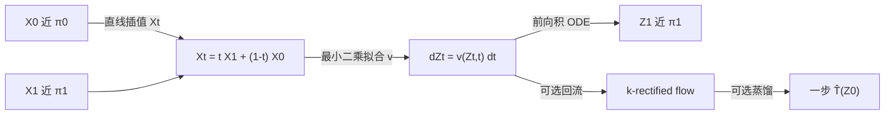

# Rectified Flow：让 π0 与 π1 尽量走直线，再整流成可少步积分的 ODE

<!-- release-date: 2022-09-07 -->

**本文依据**：`Flow Straight and Fast: Learning to Generate and Transfer Data with Rectified Flow`，arXiv 2209.03003v1（2022-09-07），41 页 letter。作者 Xingchao Liu*、Chengyue Gong*（并列一作）、Qiang Liu，University of Texas at Austin。盘上 PDF 页眉写明 arXiv:2209.03003v1 [cs.LG] 7 Sep 2022。官方 arXiv：https://arxiv.org/abs/2209.03003。首发日取原件首次公开日，即 arXiv v1 提交日 2022-09-07，不回写成后续修订。文中所有数字都标了 PDF 页码；标「外部补充」的段落不来自本文。本文只解读这一份 v1，不把后作 Flow Matching 或 Stable Diffusion 3 写成这篇论文的内容。

## 一句话

给定两个经验分布 $\pi_0$ 和 $\pi_1$ 的样本，整流流（rectified flow）学一条常微分方程（ordinary differential equation，ODE），让粒子尽量沿着连接两端点的直线走。做法是无约束非线性最小二乘：在直线插值点上，让网络预测的速度去贴 $X_1-X_0$。直线最短，而且匀速直线可以一步欧拉精确积完，不必时间离散。把任意耦合「整流」一次，凸运输代价不会升；再递归回流（reflow），路径越来越直，推理时粗网格也够用。生成、图像翻译、域适应用同一套算法。作者报告：CIFAR-10 上蒸馏后的 2-rectified flow 单步欧拉 FID 4.85、recall 0.51；完全用 RK45 积 1-rectified flow 则 FID 2.58、recall 0.57（PDF p. 1、p. 4、p. 24）。

它解决的不是「再发明一种扩散」，而是 2021–2022 年连续时间模型已经能画好图、却必须反复调用昂贵漂移网络的那块：**路径为什么一定要弯、步数为什么一定要多**。作者的判断是：弯是因为插值曲线选弯了，或者把 ODE 当成 SDE 的副产品来推；把插值钉成匀速直线，再整流掉交叉，少步甚至一步就可以。

## 一、矛盾：运输映射已经能训，推理却还在慢慢积

2022 年前后，生成模型和域迁移都可以写成同一句话：给 $X_0\sim\pi_0$、$X_1\sim\pi_1$ 的经验样本，找一个运输映射 $T$，使得 $Z_1=T(Z_0)\sim\pi_1$。$(Z_0,Z_1)$ 叫耦合，也叫运输计划（PDF p. 2）。

传统做法把 $T$ 直接参数化成网络。GAN 走极小极大，数值不稳、会塌模式，工程配方很难搬家。最大似然对复杂模型往往算不出，于是 VAE 要变分近似，归一化流和自回归要为了似然牺牲表达力（PDF p. 2）。

后来把映射藏进连续时间：神经 ODE 的流，或 SDE 的扩散。漂移用网络表示，推理时用数值求解器去积。分数模型和去噪扩散（文中合称 denoising diffusion）证明：不必 GAN、也不必传统近似推断，就能训出当时超过 GAN 的图像模型。学到的 SDE 还可以用概率流 ODE 或 DDIM 改成确定性 ODE，加快一点（PDF p. 2）。

连续时间的代价也很硬：出一张图要反复调用漂移网络。去噪扩散的设计空间还大、超参多，经验与理论都还不透（PDF p. 2）。和一步 GAN/VAE 比，慢是结构性的，不是求解器没调好。

整流流要做的事因此很具体（PDF p. 3）：

1. 用尽量直的 ODE 把 $\pi_0$ 运到 $\pi_1$，统一生成和域迁移。
2. 训练只是可扩展的无约束最小二乘，不引入 GAN 的不稳、MLE 的不可算、扩散的细超参。
3. 整流在所有凸代价上同时不升运输成本；回流让路径更直，粗离散误差更小。完美直线时，一步欧拉就是精确模拟。
4. 整套是纯 ODE，概念比 SDE 路线更简单，推理也更快。

图 1 把这件事画死：上两行是噪声 $\to$ 猫头，下两行是人脸 $\leftrightarrow$ 猫头。1-rectified flow 用很少欧拉步（例如 $\ge 2$）已经像样；从它回流得到的 2-rectified flow 轨迹接近直线，**单步欧拉**也出得去（PDF p. 3 图 1）。读的时候不要把后作的「流匹配」滤镜套上来。这篇钉死的是：**直线插值 + 最小二乘整流 + 可选回流与蒸馏**。

把流水线画成人能跟住的图（机制示意，根据 PDF p. 4 图 2 与 p. 6 算法 1 重画，不是实测时间轴）：

训练时随机抽 $t\sim\mathrm{Uniform}([0,1])$，在 $X_t$ 上回归 $X_1-X_0$，不必逐步积分。采样才积 ODE。回流用上一轮积出来的 $(Z_0,Z_1)$ 当新数据再训。蒸馏只在最后，用来把已经很直的耦合压成一步网络。

## 二、直线插值为什么还不能当生成器

给定一对 $(X_0,X_1)$，最省事的连法是直线（PDF p. 4 式 1 附近）：

$$
X_t = t X_1 + (1-t) X_0,\qquad t\in[0,1].
$$

它满足 $\mathrm{d}X_t=(X_1-X_0)\,\mathrm{d}t$。问题是这条 ODE **非因果**：更新 $X_t$ 必须已经看见终点 $X_1$。实际问题里 $\pi_0$ 和 $\pi_1$ 通常没有成对标注，典型耦合就是独立乘积 $\pi_0\times\pi_1$。多条直线还会在中间交叉（PDF p. 4 图 2a）。交叉一旦发生，同一位置同一时刻会有两个方向，良定义 ODE 不允许这种事：解必须存在且唯一，不同轨迹在 $t\in[0,1)$ 不能在同一点沿不同方向穿过（PDF p. 5）。

所以直线插值是「路」，不是「交通」。整流流要做的，是在这些路上重新接线，让粒子近视、无记忆、不交叉地走，同时尽量保持原来的质量流动。拟合目标就是非线性最小二乘（PDF p. 4 式 1）：

$$
\min_v \int_0^1 \mathbb{E}\bigl\|(X_1-X_0)-v(X_t,t)\bigr\|^2\,\mathrm{d}t,\qquad X_t=tX_1+(1-t)X_0.
$$

人话：在每个时刻、每个插值点上，让网络输出的速度去贴「从 $X_0$ 指向 $X_1$ 的向量」。用任意现成随机优化器、用经验样本即可，不必额外参数，规模上和普通监督回归一样（PDF p. 1、p. 4）。

精确最小在条件期望处取到（PDF p. 6 式 2）：

$$
v^X(x,t)=\mathbb{E}[X_1-X_0\mid X_t=x].
$$

也就是：所有穿过位置 $x$、时刻 $t$ 的直线方向，取平均。整流流是

$$
\mathrm{d}Z_t=v(Z_t,t)\,\mathrm{d}t,
$$

从 $Z_0\sim\pi_0$ 积到 $t=1$。反向同样容易：从 $\tilde X_0\sim\pi_1$ 积 $\mathrm{d}\tilde X_t=-v(\tilde X_t,t)\,\mathrm{d}t$，再令 $X_t=\tilde X_{1-t}$。目标对调 $X_0\leftrightarrow X_1$ 并翻转 $v$ 的符号后等价，所以前向和反向被同一套训练同等对待（PDF p. 5）。算法 1 把训练、采样、可选回流、可选蒸馏写在一页里（PDF p. 6）。

**旧问题到这里钉死了：直线最短、可精确模拟，但交叉且非因果；整流就是把直线交通改造成可仿真的 ODE，同时尽量不改沿途的边缘质量。**

## 三、整流改了什么、没改什么

### 边缘保持，联合分布被因果化

定理 3.3：若过程可整流（速度局部有界且积分方程解唯一），则 $\mathrm{Law}(Z_t)=\mathrm{Law}(X_t)$ 对每个 $t$ 成立。因此 $(Z_0,Z_1)$ 是 $\pi_0$ 与 $\pi_1$ 的合法耦合（PDF p. 6、p. 13）。直觉是无穷小体积里进出的期望质量，在 $X_t$ 和 $Z_t$ 两边一样，所以边缘密度走同一条连续性方程。整条轨迹的联合分布一般不同：$X_t$ 非因果、非马尔可夫，$(X_0,X_1)$ 可以是随机配对；$Z_t$ 把它因果化、马尔可夫化、去随机化，只保住各时刻边缘（PDF p. 6）。

定义 3.2 把「可整流」写成：从 $Z_0=X_0$ 出发，

$$
Z_t=Z_0+\int_0^t v^X(Z_s,s)\,\mathrm{d}s
$$

存在且唯一（PDF p. 13 式 9）。证明走测试函数：$\frac{\mathrm{d}}{\mathrm{d}t}\mathbb{E}[h(X_t)]=\mathbb{E}[\nabla h(X_t)^\top v^X(X_t,t)]$，即边缘在分布意义下满足连续性方程 $\dot\pi_t+\nabla\cdot(v_t^X\pi_t)=0$；$Z_t$ 用同一速度场、同一初值，解唯一则边缘相同（PDF p. 13）。

### 所有凸运输代价同时不升

定理 3.5：对任意凸 $c:\mathbb{R}^d\to\mathbb{R}$，

$$
\mathbb{E}[c(Z_1-Z_0)]\le\mathbb{E}[c(X_1-X_0)]
$$

（PDF p. 6、p. 13）。典型例子是 $c(\cdot)=\|\cdot\|^\alpha$，$\alpha\ge 1$。这是帕累托下降：不瞄准某一个 $c$，对所有凸代价一起不升。和「先选定 $c$ 再求最优耦合」的最优运输算法不是同一件事。因此递归整流 **不保证** 到达任意给定 $c$ 的最优耦合；一维例外，不动点与同时最小化所有非负凸代价的单调耦合重合（PDF p. 6、p. 15–16）。

$\|\cdot\|$ 的图证：整流轨迹是直线的重新接线，三角形不等式给出长度不增；一般凸 $c$ 用两次 Jensen（PDF p. 7、p. 14）。证明链是：把 $Z_1-Z_0$ 写成速度积分 $\to$ Jensen $\to$ 边缘相同把 $Z$ 换成 $X$ $\to$ 速度是条件期望再 Jensen $\to$ 全期望还原成 $\mathbb{E}[c(X_1-X_0)]$。

若插值仍是直线但速度非匀速（$\beta_t=1-\alpha_t$，$\dot\alpha_t\ge 0$），对凸且 $m$-齐次（$m\in(0,1]$）的 $c$，不等式仍成立（PDF p. 14）。

**可迁移启发**：不必先解一个很难的高维最优运输，也能得到「比独立配对更省、而且是确定性 ODE 耦合」的计划。运输代价和下游任务指标也不总对齐，正文后文会再强调这一点（PDF p. 22）。

### 速度场何时良定义

若 $X_0\mid X_1=x_1$ 有条件密度 $\rho$，最优速度可写成对 $X_1$ 的期望，权重是 $\eta_t$（PDF p. 8 式 4）。$\rho$ 处处正且连续时，$v^X$ 在 $\mathbb{R}^d\times[0,1)$ 上有定义且连续；再加 $\log\eta_t$ 对 $z$ 连续可微，可写 $\nabla_z v^X$。在 $[0,a]$（$a<1$）上一致 Lipschitz 则解唯一。若没有条件密度，速度可能未定义或不连续。简单修法：给 $X_0$ 加独立高斯 $\xi$，用 $\tilde X_0=X_0+\xi$ 再整流，得到随机映射 $T(X_0+\xi)$（PDF p. 8）。

低维可用 Nadaraya–Watson 型核估计（PDF p. 9 式 5），带宽 $h\to 0^+$ 时在 $X_t$ 能到达的点上收敛到条件期望。玩具实验用最近邻近似期望，默认 $h=1$、$m=100$，对 $m$ 和 $h$ 不敏感（PDF p. 22）。高维必须用光滑函数逼近，否则精确算出 $v^X$ 只会过拟合、原样吐回 $\pi_1$ 的有限点（PDF p. 8–9）。增强网络平滑（加大 $L_2$ 正则）在玩具上也能额外把流拉直（PDF p. 23 图 7）。

## 四、回流：把「更直」做成可递归的算子

记 $Z=\mathrm{RectFlow}((X_0,X_1))$，$(Z_0,Z_1)=\mathrm{Rectify}((X_0,X_1))$。递归

$$
Z^{k+1}=\mathrm{RectFlow}((Z_0^k,Z_1^k)),\qquad (Z_0^0,Z_1^0)=(X_0,X_1)
$$

得到 $k$-rectified flow（PDF p. 5）。回流不只降运输代价，还拉直路径。

「直」在文中指匀速直线：几乎必然 $Z_t=tZ_1+(1-t)Z_0$，或沿每条轨迹 $v(Z_t,t)=Z_1-Z_0$ 为常数（PDF p. 7）。这种流一步欧拉

$$
Z_1=Z_0+v(Z_0,0)
$$

就是精确 $Z_1$，等价于一步模型。直线插值 $X$ 按这个定义也直，但它不是因果流，没有两端的神谕就积不了。要让因果 ODE 变直，速度必须满足无粘 Burgers 方程 $\partial_t v+(\partial_z v)v=0$（PDF p. 7）。

直度用（PDF p. 7 式 3）

$$
S(Z)=\int_0^1 \mathbb{E}\bigl\|(Z_1-Z_0)-\dot Z_t\bigr\|^2\,\mathrm{d}t
$$

衡量。$S=0$ 是精确直。定理 3.7：前 $K$ 轮里最小的 $S(Z^k)$ 不超过 $\mathbb{E}[\|X_1-X_0\|^2]/K$（PDF p. 8）。更完整的说法是 $S$ 与交叉量 $V$ 的和按 $O(1/K)$ 往下走（PDF p. 15）。图 3 用玩具把 1、2、3 次回流画出来：轨迹变直，相对 $L_2$ 运输代价下降（PDF p. 7）。

不要回流太多次：对 $v^X$ 的估计误差会累积（PDF p. 8）。图 1 显示 **一轮回流已经接近直线，单步欧拉就够看**（PDF p. 3、p. 8）。

定理 3.6 把「直耦合」钉成几条等价陈述：存在严格凸 $c$ 使运输代价相等；是 $\mathrm{Rectify}$ 的不动点；整流流与直线插值重合；插值路径不交叉，即（PDF p. 14 式 12）

$$
V((X_0,X_1))=\int_0^1\mathbb{E}\bigl\|X_1-X_0-\mathbb{E}[X_1-X_0\mid X_t]\bigr\|^2\,\mathrm{d}t=0.
$$

$V=0$ 表示穿过每个 $X_t$ 的直线方向几乎必然唯一。

**可迁移启发**：少步采样不必先上高阶求解器。先把路径拉直，欧拉这种最笨的积分器也会变准。代价是回流要再仿真再训一轮。

### 蒸馏不是下一轮整流

得到 $k$-rectified flow 之后，可以把 $(Z_0^k,Z_1^k)$ 蒸馏进网络 $\hat T$，直接预测 $Z_1^k$。流已经接近直线时，蒸馏便宜。若取 $\hat T(z_0)=z_0+v(z_0,0)$，损失就是式 1 在 $t=0$ 的那一项（PDF p. 8）。

整流产出 **另一个** 更省、更直的耦合；蒸馏试图 **忠实逼近** 当前耦合。所以蒸馏只放最后，给一步推理做微调，不要和回流混成同一步（PDF p. 6 算法 1、p. 8）。

附录算法 2–4 把训练、采样、回流写成伪代码：损失是 `(Model(t*x1+(1-t)*x0, t) - (x1-x0)).pow(2).mean()`（PDF p. 37）。

## 五、非线性推广：概率流 ODE 和 DDIM 落在哪

把 $X_t$ 换成任意连接 $X_0$ 与 $X_1$ 的时间可微曲线，令 $v^X(z,t)=\mathbb{E}[\dot X_t\mid X_t=z]$（原文在该处把条件写成 $X_t=t$，按上下文应是位置变量）。估计（PDF p. 9 式 6）

$$
\min_v\int_0^1 \mathbb{E}\bigl[w_t\|v(X_t,t)-\dot X_t\|^2\bigr]\,\mathrm{d}t.
$$

默认 $w_t=1$。直线插值时 $\dot X_t=X_1-X_0$，回到式 1。定理 3.3 的边缘保持仍在，所以仍是合法耦合。但路径不直时，**不再保证**凸运输代价下降，回流也 **不再** 拉直（PDF p. 9）。

一类简单插值是 $X_t=\alpha_t X_1+\beta_t X_0$，边界 $\alpha_1=\beta_0=1$、$\alpha_0=\beta_1=0$。$\beta_t=1-\alpha_t$ 时路径仍直，只是速度不匀，相当于把规范直线做时间重参数化。$\beta_t\neq 1-\alpha_t$ 时一般不是直线（PDF p. 9–10）。

命题 3.11：Song 等人的概率流 ODE 各变体，都可以看成式 6 在 $X_t=\alpha_t X_1+\beta_t\xi$、$\xi\sim\mathcal{N}(0,I)$ 时的实例；他们给的 $\alpha_t,\beta_t$ 往往不满足 $t=0$ 的边界，于是 $X_0\neq\xi$，只能靠 $\alpha_0 X_1\ll\beta_0\xi$ 把 $\pi_0$ 近似成 $\mathcal{N}(0,\beta_0^2 I)$（PDF p. 10、p. 18）。从整流流框架看，没有理由把 $\xi$ 钉死成高斯，也没有理由不设 $\alpha_0=0$、$\beta_0=1$（PDF p. 10）。

VP / sub-VP 共用（PDF p. 10 式 7）

$$
\alpha_t=\exp\bigl(-\tfrac14 a(1-t)^2-\tfrac12 b(1-t)\bigr),\quad a=19.9,\; b=0.1,
$$

$\beta_t$ 分别是 $\sqrt{1-\alpha_t^2}$ 与 $1-\alpha_t^2$（PDF p. 11 式 8）。两条问题（PDF p. 11）：

1. **路径不直**。$\beta_t$ 的选法让轨迹弯曲，回流拉不直。要直应取 $\beta_t=1-\alpha_t$。
2. **速度不匀**。指数 $\alpha_t$ 来自 OU 过程那套 SDE 推导。图 5、图 6 显示早期（大约 $t$ 不到 $0.5$）几乎不动，更新挤在后半段。大步长时吃亏。把 VP 的 $\alpha_t$ 改成 $t$，连续时间轨迹形状可保留，更新变匀（PDF p. 11）。

VE ODE：$\alpha_t=1$，$\beta_t=\sigma_{\min}\sqrt{r^{2(1-t)}-1}$，默认 $\sigma_{\min}=0.01$，$r$ 使 $\sigma_{\max}=r\sigma_{\min}$ 大到覆盖训练点对的最大欧氏距离。于是 $\pi_0\approx\mathcal{N}(0,\sigma_{\max}^2 I)$，方差远大于数据，玩具图 4、图 5 画不进去。$\dot X_t$ 方向跟 $\xi$ 一致，路径其实是直的，但 $\beta_t$ 仍造成速度不匀（PDF p. 12）。

图 4：线性整流流一轮回流已近直；VP / sub-VP 弯，回流也直不了（PDF p. 10）。图 5：整流流一步欧拉走到 $\pi_1$ 的均值，两步就能铺开；VP / sub-VP 弯且前慢后快（PDF p. 11）。

作者收成几条（PDF p. 12）：学 ODE 不必先学 SDE；路径由任意光滑插值指定；$\pi_0$ 可与插值解耦、任意选。规范选择就是匀速直线。

第 3.5 节把去噪扩散损失（式 15）和概率流损失（式 18）写出来，并证明在式 16 的 $\alpha,\beta$ 关系下，$\tilde Y_t=\dot X_t$，于是式 18 就是非线性整流流（PDF p. 17–18）。这是「后作滤镜」的反面：不是整流流在模仿 DDIM，而是 DDIM/PF-ODE 落在更弯、边界还不齐的那个特例里。

## 六、和一步模型、MLE ODE、最优运输怎么分家

**一步模型。** GAN 质量好但不稳；VAE 与离散归一化流为了似然加结构约束。回流加蒸馏是另一条通向一步模型的路，避开极小极大和似然不可算（PDF p. 18）。

**MLE 神经 ODE。** Chen 等人最大化终点 $Z_1$ 与 $\pi_1$ 的匹配。瞬时变量替换让似然比离散流好算，但每步训练仍要反复仿真，反传过时间容易梯度消失/爆炸。更根本的是：MLE 只管终点边缘，能实现同一 $Z_1$ 分布的 ODE 有无穷多条，路径由初始化与优化器隐式决定。有人用运输代价正则去偏爱短路径（PDF p. 19）。整流流的做法相反：事先用插值 $X_t$ 把「路」钉死。网络作为生成模型是过参数化的——$v$ 是万能逼近、$\pi_0$ 绝对连续时，任意固定插值都能逼近任何终点分布——所以可以把路选成测地直线（PDF p. 19）。

**扩散噪声还要不要。** 作者认为去噪扩散真正可迁移的，是稳定、可扩展的优化式训练，不是噪声本身。目标若是学 ODE，不必动 SDE 工具。ODE 相对 SDE：概念和数值更简单；正反向一样容易（SDE 时间反转更重）；确定性耦合适合当隐空间（DDPM 与 Song 等人的 SDE 给出的 $(Z_0,Z_1)$ 太随机，文中写其对隐表示无用）；训练难度不应比同边缘 SDE 更难，Song 等人的式 15 与式 18 只差线性重参数；边缘表示力上 ODE 够用，因为 SDE 都能转成同边缘 ODE；流形数据上 ODE 漂移更易落在光滑低维流形，SDE 要仔细退火噪声。SDE 更适合高噪声金融数据，或物理上真有扩散的分子模拟，以及需要更丰富时间相关结构的场合（PDF p. 21）。

**直耦合不是 $c$-最优。** 定理 3.8：对某个严格凸 $c$ 最优的可整流耦合一定直；直是必要不充分。一维：直 $\Leftrightarrow$ 确定性单调，且（若存在）唯一、同时对所有使最优值有限的凸代价最优（引理 3.9、定理 3.10，PDF p. 16）。$d\ge 2$ 时不同 $c$ 一般不共享最优耦合，整流也不看特定 $c$。Khrulkov 等人猜想 VP ODE/DDIM 给出二次最优耦合，已被后续工作否定；即便直耦合也不保证最优，何况 VP 设计上就不走直线（PDF p. 16–17）。另文 [42] 把 $v$ 限制成梯度场 $v=\nabla f$ 时，二次最优可作为 $\mathrm{Rectify}$ 不动点——去掉速度里造成次优运输的旋转分量（PDF p. 17）。从少步推理看，所有直耦合同样好，因为都能一步欧拉（PDF p. 22）。

高维最优耦合计算本身就难，运输代价也不精确等于学习指标（PDF p. 22）。玩具上相对 $L_2$ 运输代价只在低维有用；高维里即使 $v^X$ 是随机网络，这个量也容易恒为零，这正是误导「DDIM 是 $L_2$ 最优运输」的那种假象（PDF p. 23）。

## 七、实验：玩具、CIFAR-10、高分辨率、翻译、域适应

默认欧拉常步长 $1/N$，即 $\hat Z_{t+1/N}=\hat Z_t+v(\hat Z_t,t)/N$。对照用 SciPy 的 RK45，容差与 Song 等人 [73] 相同（PDF p. 22）。

### 玩具

图 2–5、图 7 用核估计或两层 64 隐单元 MLP。神经网络拟合不如分段直线插值完美；加大 $L_2$ 惩罚有助于拉直（PDF p. 23）。

### CIFAR-10 无条件生成

$\pi_0=\mathcal{N}(0,I)$，$\pi_1$ 为数据。实现改自 [73] 开源码，漂移用 DDPM++ 的 U-Net。表 1(a) 与图 8 和同一架构的 (sub-)VP ODE 比；表 1(b) 列其他架构文献数，仅供参照（PDF p. 23–24）。

附录配方（PDF p. 37）：分辨率 $32\times 32$；EMA 系数 $0.999999$；Adam，学习率 $2\times 10^{-4}$，dropout $0.15$。回流先造 400 万对 $(z_0,z_1)$，再把 $i$-rectified 微调 30 万步得到下一轮。少步蒸馏时 $t$ 改从 $\{0,1/k,\ldots,(k-1)/k\}$ 抽；**$k=1$ 时 $L_2$ 换成 LPIPS**，因为经验上更好。

表 1(a) 关键数字（PDF p. 24；括号内为蒸馏）：

| 方法 | NFE | IS | FID | Recall |
|---|---|---|---|---|
| 1-Rectified Flow（+蒸馏）欧拉 $N=1$ | 1 | 1.13（9.08） | 378（6.18） | 0.0（0.45） |
| 2-Rectified Flow（+蒸馏）$N=1$ | 1 | 8.08（9.01） | 12.21（4.85） | 0.34（0.50） |
| 3-Rectified Flow（+蒸馏）$N=1$ | 1 | 8.47（8.79） | 8.15（5.21） | 0.41（0.51） |
| VP ODE（+蒸馏）$N=1$ | 1 | 1.20（8.73） | 451（16.23） | 0.0（0.29） |
| sub-VP ODE（+蒸馏）$N=1$ | 1 | 1.21（8.80） | 451（14.32） | 0.0（0.35） |
| 1-Rectified Flow RK45 | 127 | 9.60 | 2.58 | 0.57 |
| 2-Rectified Flow RK45 | 110 | 9.24 | 3.36 | 0.54 |
| 3-Rectified Flow RK45 | 104 | 9.01 | 3.96 | 0.53 |
| VP ODE RK45 | 140 | 9.37 | 3.93 | 0.51 |
| sub-VP ODE RK45 | 146 | 9.46 | 3.16 | 0.55 |
| VP SDE 欧拉 | 2000 | 9.58 | 2.55 | 0.58 |
| sub-VP SDE 欧拉 | 2000 | 9.56 | 2.61 | 0.58 |

作者声称：在一步快速扩散/流模型里，FID 4.85 与 recall 0.51 是当时最好之一（PDF p. 4）。完全积分时 1-rectified 的 FID 2.58、recall 0.57 是表 1(a) 里 ODE 最好；recall 0.57 也明显高于同类 U-Net 上的 GAN（PDF p. 23–25）。蒸馏 2-rectified 的 FID 4.85 好过表 1(b) 里 U-Net 一步生成当时最好的 TDPM 8.91。2/3-rectified 蒸馏后的 recall 0.50/0.51 高于 StyleGAN2+ADA 的 0.49。GAN 那边用了 ADA 等专门技巧，整流流是原味实现；作者认为加增广或再跟 GAN 结合还有空间（PDF p. 25）。

注意回流对 **完全积分 FID** 并不单调变好：1→2→3 的 RK45 FID 是 2.58→3.36→3.96。换来的是直度和少步质量。图 9 显示 CIFAR-10 上回流降低直度指标（PDF p. 25）。图 10 在 AFHQ Cat 上画外推 $\hat z_1^t=z_t+(1-t)v(z_t,t)$：若轨迹直，同一条路上 $\hat z_1^t$ 不应随 $t$ 变。2-rectified 几乎与 $t$ 无关；1-rectified 虽不直，大约 $t\approx 0.1$ 外推已可认；sub-VP 大约要 $t\approx 0.6$（PDF p. 25–26）。图 19 是 CIFAR-10 上同一随机种子的对照（PDF p. 40）。

图 16：1-rectified 用 1–3 步还糊；一轮整流后 2-rectified 的 1–3 步已经清晰。VE/VP/sub-VP 对照画在同一图（PDF p. 38）。

### 高分辨率与隐空间

图 11：1-rectified 在 $256\times 256$ 的 LSUN Bedroom、LSUN Church、CelebA HQ、AFHQ Cat 上出样例（PDF p. 26）。图 12：把两只猫上下拼成不自然图 $z_1$，反向积到 $z_0$，再把 $z_0$ 往 $\pi_0=\mathcal{N}(0,I)$ 的高密度区推（确定性 $z_0'=\alpha z_0$，$\alpha\in(0,1)$，或朗之万 $z_0'=\alpha z_0+\sqrt{1-\alpha^2}\xi$），正向积出更像真图的变体（PDF p. 27）。图 17–18：隐空间线性插值；$\alpha<1$ 过平滑，$\alpha>1$ 变噪；蒸馏一步模型的隐空间与原流差别不大；$N=1$ 时 2-rectified 仍能插值，1-rectified 不能（PDF p. 39）。图 20：反向一步得到有意义隐码，是拉直的直接后果（PDF p. 40）。

### 无配对图像翻译

CycleGAN 要对抗损失加循环一致。整流流训练是普通优化，循环一致由 ODE 可逆自动满足（PDF p. 25）。目标往往不是把 $X_0$ 严格运成 $\pi_1$ 的样本，而是迁风格、保主体。于是不用像素 $L_2$，而在风格特征 $h$ 上拟合（PDF p. 27 式 20）：

$$
\min_v\int_0^1\mathbb{E}\bigl\|\nabla h(X_t)^\top(X_1-X_0-v(X_t,t))\bigr\|_2^2\,\mathrm{d}t.
$$

$h$ 取区分两域的分类器隐表示，从 ImageNet 预训练（EfficientNet [77]）微调。$\nabla h$ 当显著性，让损失盯会改风格的坐标（PDF p. 27）。

数据：AFHQ、MetFace、CelebA-HQ。各集随机 80% 训练、其余测试；测试图初始化已训流。图像缩到 $512\times 512$。AFHQ 约 15,000 张 $512\times 512$，猫/狗/野生各 5,000；MetFace 1,336 张 $1024\times 1024$；CelebA-HQ 30,000 张 $1024\times 1024$（PDF p. 27、p. 38）。优化：AdamW，$\beta=(0.9,0.999)$，权重衰减 $0.1$，dropout $0.1$，batch 4，1,000 epoch，EMA $0.9999$；学习率在 $\{5\times 10^{-4},2\times 10^{-4},5\times 10^{-5},2\times 10^{-5},5\times 10^{-6}\}$ 网格搜，取训练损失最低（PDF p. 38）。

图 13：$N=100$ 的猫 $\leftrightarrow$ 野生、MetFace $\leftrightarrow$ CelebA。图 14：1/2-rectified 在 $N=100$ 与 $N=1$。一轮回流后单步欧拉已经可用（PDF p. 28）。图 21 更多 $N=100$ 轨迹（PDF p. 41）。

### 域适应

把新域 $\pi_0$ 运到训练域 $\pi_1$。DomainNet：六域、345 类；Office-Home：四域、65 类。先把训练/测试映到预训练分类器最后隐层，在隐空间建整流流。架构仍是 DDPM++；推理 100 步均匀离散。指标：迁过去的测试样本在源域分类器上的准确率（PDF p. 28–29）。AdamW，batch 16，5 万迭代，学习率 $10^{-4}$，权重衰减 $0.1$，OneCycle（PDF p. 38）。

表 2（PDF p. 29）：Office-Home 上 Ours $69.2\pm 0.5$，高于 CORAL 的 $68.7\pm 0.3$；DomainNet 上 Ours $41.4\pm 0.1$，与 CORAL $41.5\pm 0.2$ 持平量级，好于或持平文中其余基线（ERM、IRM、ARM、Mixup、MLDG）。作者写 1-rectified 在两套数据上达到或并列当时最好，并稳定好于其余方法（PDF p. 29）。图 15 画跨域轨迹（PDF p. 29）。

## 八、限制、没写清的，以及不要读成后作

论文自己点出的边界：

- 回流次数不是越多越好，估计误差会堆（PDF p. 8）。CIFAR 上完全积分 FID 随回流变差，说明「更直」和「RK45 全积分质量」不是同一指标。
- 非线性推广保住边缘，但丢掉凸代价下降和拉直（PDF p. 9）。
- 高维最优运输不是本文算法的目标；直不等于给定 $c$ 最优（PDF p. 16–17、p. 22）。
- 图像翻译改了损失（式 20），不再声称忠实运输到 $\pi_1$（PDF p. 27）。
- 域适应在分类器隐空间做，不是像素空间（PDF p. 28）。
- 1-rectified 不蒸馏时，CIFAR 单步欧拉 FID 378、recall 0，几乎不能用；少步能力主要来自回流和蒸馏（PDF p. 24）。
- 没有把整流流接到视频、音频或文本实验上；相关工作只作为扩散的应用背景出现（PDF p. 20）。
- 代码级配方分散在附录：CIFAR 的 400 万对回流数据、30 万微调步、一步蒸馏改 LPIPS，翻译的学习率网格，域适应的 50k 迭代。主文表 1 没有列出墙钟或总训练算力。

身份边界：封面与页眉都是 arXiv:2209.03003v1，2022-09-07，41 页。不要把后来的 Flow Matching、Rectified Flow 后续理论，或 Stable Diffusion 3 的采样器写进「本文证明」。那些若出现，只能标外部补充。本文不展开。

## 九、可迁移启发

1. **先选路，再学开车。** 生成 ODE 过参数化，终点分布不唯一决定路径。把插值钉成匀速直线，训练退化成回归，推理退化成少步积分。
2. **交叉是非因果的几何原因。** 条件期望把交叉处的方向平均掉，等于在交点重新接线。这比「再加扩散噪声把粒子抖开」更直接。
3. **凸代价帕累托下降是整流的免费性质，不是最优运输求解器。** 不要拿 FID 去证明自己找到了 W2 映射。
4. **少步优先拉直，再蒸馏。** 蒸馏忠实逼近当前耦合；回流改耦合。顺序反了会把弯的路径蒸进一步网络。
5. **生成和迁移可以是同一个最小二乘。** 换 $\pi_0$ 即可；翻译若要保身份，把损失投影到风格特征梯度上。
6. **SDE 不是学 ODE 的前提。** VP/sub-VP 的弯路径和不匀速度，很多是 OU 推导的遗产，不是 ODE 必须的。
7. **反向 ODE 送隐空间。** 确定性、低运输代价的耦合才能拿来插值、拼接、往先验高密度区推。

## 十、关键词回看

- **运输映射问题**：找 $T$ 把 $\pi_0$ 的点运成 $\pi_1$ 的点。
- **耦合 / 运输计划**：联合分布边缘分别是 $\pi_0$、$\pi_1$。
- **整流流**：拟合直线（或一般曲线）方向的因果 ODE。
- **整流**：任意耦合 $\to$ 确定性、凸代价不升的新耦合。
- **回流**：用上一轮端点对再训，拉直路径。
- **直度 $S$ 与交叉量 $V$**：少步误差的几何指标。
- **蒸馏**：最后把端点关系压成一步网络，不等于再整流。
- **非线性整流流**：一般插值；PF-ODE/DDIM 是其弯的特例。

## 参考资料

- 原件：Xingchao Liu, Chengyue Gong, Qiang Liu. *Flow Straight and Fast: Learning to Generate and Transfer Data with Rectified Flow*. arXiv:2209.03003v1, 2022-09-07。https://arxiv.org/abs/2209.03003
- 盘上 PDF：`readings/_src/图像、视频与 3D 生成/Rectified-Flow.pdf`（41 页 letter）
