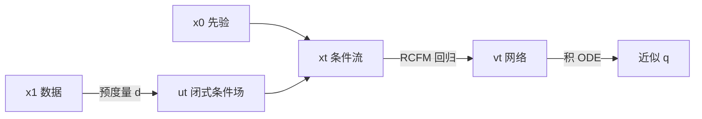

# Flow Matching on General Geometries：用预度量给出闭式目标场，把 CNF 训到一般流形

<!-- release-date: 2023-02-07 -->

**本文依据**：`Flow Matching on General Geometries`，arXiv 2302.03660v3（2024-02-26），24 页 letter。作者 Ricky T. Q. Chen（FAIR, Meta）、Yaron Lipman（FAIR, Meta and Weizmann Institute of Science）。封面页眉写明 **Published as a conference paper at ICLR 2024**，页眉另有 arXiv:2302.03660v3 [cs.LG] 26 Feb 2024。官方 arXiv：https://arxiv.org/abs/2302.03660。v1 提交日 **2023-02-07**，盘上这份是 v3。首发日取原件首次公开日，即 arXiv v1 提交日 2023-02-07，不回写成 v3 日期。方法名在摘要里叫 **Riemannian Flow Matching（RFM）**，不是论文标题。文中所有数字都标了 PDF 页码；标「外部补充」的段落不来自本文。本文只解读这一份 ICLR 2024 录用稿，不把欧氏空间上的 Flow Matching（Lipman et al., 2023 / arXiv 2210.02747）写成这篇论文的内容。

## 一句话

欧氏空间里，流匹配已经能无仿真地训连续归一化流（Continuous Normalizing Flow，CNF）。数据一旦落在球面、环面、双曲空间、三角网格或带边界的迷宫上，旧办法要么训练时还要仿真随机游走，要么用热核/散度近似，梯度有偏，高维也撑不住。这篇论文把流匹配搬到完备连通光滑黎曼流形 $\mathcal{M}$ 上：网络仍回归一条把先验 $p$ 推到数据 $q$ 的向量场，但比较切向量时用黎曼度量 $g$。边缘目标场积不出来，于是同样改成 **黎曼条件流匹配（Riemannian Conditional Flow Matching，RCFM）**：每个数据点 $x_1$ 各自一条条件流。关键观察是，条件向量场可以由一个很弱的 **预度量（premetric）** $d(x,y)$ 闭式写出来；测地距离是特例，欧氏直线也是特例。简单几何（测地线有闭式）上训练完全无仿真；一般几何上只正向积一条不含网络的 ODE，不必反传求解器、不必估散度。作者报告：地球科学球面数据上，测地 RFM 的测试负对数似然（negative log-likelihood，NLL）在火山 $-7.93\pm1.67$、火灾 $-1.86\pm0.11$，相对对照方法有明显改进；蛋白质 7 维环面上 $-5.20\pm0.067$（PDF p. 7 表 2、p. 8 表 3）。三角网格与迷宫上，用双调和距离也能训出沿边界不穿墙的 CNF（PDF p. 1、p. 9）。

它解决的不是「再发明一种流匹配」，而是 2020–2022 年流形生成已经能写 CNF、却没有可扩展无偏目标的那块：**简单几何上为什么还要仿真加噪，一般网格上为什么测地线算不起、边界上还会退化**。作者的判断是：监督从边缘密度改成 per-example 条件向量场之后，只要预度量满足非负、正定、梯度非退化，目标场就有闭式；测地线能闭式就算测地，算不起就换成谱距离。

## 一、矛盾：流形上的 CNF 表达力够，训练目标不够

2023 年前后，欧氏空间的生成模型已经能拟合高维分布。数据一旦住在非欧流形上，三件事同时卡死（PDF p. 1）：

1. 高维扩不上去（例如 Rozen et al., 2021 的 Moser Flow）。
2. 即便是超球面这种「简单几何」，训练时仍要仿真或迭代采样（Mathieu & Nickel, 2020；De Bortoli et al., 2022）。
3. 目标本身难写：最大似然要积 ODE；去噪分数匹配在流形上没有闭式条件分数。

连续时间模型本来有一条出路：CNF 直接在流形上流动，不必先把流形同胚到欧氏空间。同胚路线（Gemici et al., 2016 等）在拓扑上不等价时会出理论与数值问题（PDF p. 6）。CNF 绕开了这件事，但早期流形 CNF 仍靠最大似然，训练要仿真（PDF p. 6）。后来的无仿真流形 CNF（Rozen et al., 2021；Ben-Hamu et al., 2022）高维差，也接不到一般几何。黎曼扩散则把欧氏 SDE 硬搬过来：流形上的 Ornstein–Uhlenbeck 没有闭式解，加噪必须几何随机游走；条件分数要用特征展开或 Varadhan 热核近似，梯度有偏；隐式分数匹配又要算大网络的黎曼散度，Hutchinson 估计方差随维数变差（PDF p. 7）。

所以这篇要做的事很具体（PDF p. 1–2）：

1. 给出 RFM：在切空间上用 $g$ 回归目标向量场，训练时不算似然。
2. 用条件路径把不可算的边缘场拆开；RCFM 与 RFM 只差一个与参数无关的常数（附录 A，PDF p. 14–15）。
3. 用预度量闭式写出条件场；测地距离对应常速测地线，欧氏范数退回 Lipman et al. (2023) 的直线场。
4. 简单几何上 $\exp/\log$ 闭式，完全无仿真；一般几何用谱距离（双调和、扩散），一次预处理特征函数，在线算距离是 $O(k)$。
5. 在真实非欧数据上对标或超过当时方法，并第一次在高曲率三角网格和带边界迷宫上把连续时间深度生成模型训通。

图 1 把预度量画死：简单流形上测地线可精确算，训练无仿真；一般流形上测地线贵、边界还会退化，改用谱距离（例如双调和），一次预处理后就能在线算（PDF p. 1 图 1）。表 1 把对照钉在三列上：简单几何是否无仿真、目标场是否闭式、训练是否不要散度。RFM 三列都是对；Ben-Hamu et al. (2022) 无仿真但要散度；De Bortoli 的 DSM 要仿真且分数近似；ISM 与 Huang et al. (2022) 要散度（PDF p. 2 表 1）。作者还写：他们是这些工作里唯一认真做一般几何的（PDF p. 2）。

把流水线画成人能跟住的图（机制示意，根据 PDF p. 3 算法 1 与 p. 4 式 13 重画，不是实测时间轴）：

训练时抽 $t\sim U[0,1]$、$x_1\sim q$、$x_0\sim p$。简单几何用 $\exp_{x_1}(\kappa(t)\log_{x_1}(x_0))$ 直接得到 $x_t$；一般几何正向积 $u_t(\cdot|x_1)$，不反传。损失是切空间上的 $\|v_t(x_t)-\dot x_t\|_g^2$。采样才从先验积到 $t=1$。似然是评测，走黎曼瞬时变量替换，训练不算。

代码仓在脚注：https://github.com/facebookresearch/riemannian-fm（PDF p. 8）。

## 二、流形上的密度路径与 CNF

本文的基本域是完备、连通、光滑黎曼流形 $(\mathcal{M},g)$。$x$ 处切空间写 $T_x\mathcal{M}$，内积 $\langle u,v\rangle_g$。时变光滑向量场 $u_t$ 把每个点送到自己的切空间；$\mathrm{div}_g$ 是对空间变量的黎曼散度；积分用体积元 $\mathrm{dvol}_x$（PDF p. 2）。

概率密度是非负连续函数且积分为 1。概率路径 $p_t$ 是概率空间里的一条曲线，当作训练监督。流由 ODE 定义（PDF p. 2 式 1）：

$$
\frac{\mathrm{d}}{\mathrm{d}t}\psi_t(x)=u_t(\psi_t(x)),\qquad \psi_0(x)=x.
$$

终态微分同胚 $\Psi=\psi_1$。若 $\psi_t$ 把 $p_0=p$ 推进成 $p_t$，就说 $u_t$ 从 $p$ 生成这条路径。对数密度的瞬时变量替换是（PDF p. 2 式 2）：

$$
\log p_t(x)=\log p(\psi_t^{-1}(x))-\int_0^t \mathrm{div}_g(u_t)(x_s)\,\mathrm{d}s.
$$

人话：流形上密度怎么变，仍然由「流进流出」决定，只是散度换成黎曼的。Chen et al. (2018) 用网络参数化 $u_t$，得到 CNF。流形变体已经有了，但训练要么仿真，要么无仿真却扩不动、接不到一般几何（PDF p. 3）。

任务陈述（PDF p. 3）：给定 $x_1\sim q$ 的样本，学参数映射 $\Phi:\mathcal{M}\to\mathcal{M}$，把简单先验 $p$ 推到 $q$。

**旧问题到这里钉死了：CNF 已经能在流形上流动；缺的是一条不仿真（至少在简单几何上）、目标闭式、训练不算散度的回归。**

## 三、边缘流匹配算不出，条件流匹配只差一个常数

RFM 让参数向量场 $v_t(x)\in T_x\mathcal{M}$ 去贴一条事先指定、能把 $p$ 生成到 $q$ 的目标场 $u_t$。切向量用 $g$ 比较（PDF p. 3 式 3）：

$$
\mathcal{L}_{\mathrm{RFM}}(\theta)=\mathbb{E}_{t,p_t(x)}\|v_t(x)-u_t(x)\|_g^2,
$$

$t\sim U[0,1]$。直接写 $u_t$ 不可算。做法与欧氏流匹配相同：先给每个 $x_1$ 一条条件路径，满足 $p_0(\cdot|x_1)=p$、$p_1(\cdot|x_1)\approx\delta_{x_1}$，再对 $q$ 边缘化得到 $p_t$ 和 $u_t$（PDF p. 3 式 4–7）。把边缘 $u_t$ 塞进式 3 仍然积不出来。关键命题是：只要条件场真的生成条件路径，条件损失

$$
\mathcal{L}_{\mathrm{RCFM}}(\theta)=\mathbb{E}_{t,q(x_1),p_t(x|x_1)}\|v_t(x)-u_t(x|x_1)\|_g^2
$$

与 RFM 只差不依赖 $\theta$ 的常数（PDF p. 3 式 8；证明在附录 A，PDF p. 14–15）。用条件流 $x_t=\psi_t(x_0|x_1)$ 重参数化，得到算法真正优化的式子（PDF p. 4 式 10）：

$$
\mathcal{L}_{\mathrm{RCFM}}(\theta)=\mathbb{E}_{t,q(x_1),p(x_0)}\|v_t(x_t)-\dot x_t\|_g^2.
$$

RCFM 只要三件事：网络输出落在切平面、损失用对的 $\|\cdot\|_g$、条件流在 $t=1$ 把所有质量收到 $x_1$。算法 1：简单几何 $x_t=\exp_{x_1}(\kappa(t)\log_{x_1}(x_0))$；一般几何 `solve_ODE([0,t], x0, ut)`（PDF p. 4）。附录 D 的算法 3 把 $\exp/\log$ 的基点写成 $x_0$，与正文算法 1 的 $x_1$ 基点写法不同；测地线上两者描述同一条常速测地，本文以正文算法 1 为准（PDF p. 4、p. 17）。

## 四、预度量：不必先设计整条流

在一般流形上直接构造满足 $\psi_1(x|x_1)=x_1$ 的流很烦。作者改设计预度量 $d:\mathcal{M}\times\mathcal{M}\to\mathbb{R}$，三条公理（PDF p. 4）：

1. 非负：$d(x,y)\ge 0$。
2. 正定：$d(x,y)=0$ 当且仅当 $x=y$。
3. 非退化：$\nabla d(x,y)\ne 0$ 当且仅当 $x\ne y$（梯度对第一个变量）。

再给一个单调可微日程 $\kappa(t)$，$\kappa(0)=1$、$\kappa(1)=0$，要求流把预度量按日程缩小（PDF p. 4 式 12）：

$$
d(\psi_t(x_0|x_1),x_1)=\kappa(t)\,d(x_0,x_1).
$$

$t=1$ 时 $d(\cdot,x_1)=0$ 的唯一解是 $x_1$，式 11 自动成立。定理 3.1：实现这条收缩的向量场是（PDF p. 4 式 13）

$$
u_t(x|x_1)=\frac{\mathrm{d}\log\kappa(t)}{\mathrm{d}t}\,d(x,x_1)\,\frac{\nabla d(x,x_1)}{\|\nabla d(x,x_1)\|_g^2},
$$

并且在所有满足式 12 的条件场里，它的范数最小——没有浪费在「不减小 $d$」的正交方向上（PDF p. 5；完整证明附录 B，PDF p. 15）。正文把前半段用标量 $a(t)=d(x_t,x_1)$ 对时间求导直接算出来。

本文取 $\kappa(t)=1-t$，预度量线性降到零。代入后 RCFM 写成（PDF p. 5 式 14；排版把 $v_t$ 与后一项的差写在黎曼范数里）

$$
\mathcal{L}_{\mathrm{RCFM}}(\theta)=\mathbb{E}_{t,q,p}\Bigl\|v_t(x_t)+d(x_0,x_1)\frac{\nabla d(x_t,x_1)}{\|\nabla d(x_t,x_1)\|_g^2}\Bigr\|_g^2.
$$

一般流形上求 $x_t$ 仍要仿真，但不对 $x_t$ 反传。简单几何若取测地距离，连仿真都可以省。

**旧问题到这里钉死了：条件流不必手写；预度量三条公理够用，目标场闭式，而且是最小范数。**

## 五、测地距离：简单几何上的无仿真特例

自然预度量是测地距离 $d_g$。命题 3.2：取 $d=d_g$ 且 $\kappa(t)=1-t$ 时，$x_t$ 是连接 $x_0$ 与 $x_1$ 的常速测地线（PDF p. 5；证明附录 C 用 McCann (2001) 的 $\nabla d_g^2=-2\log$ 以及 $\|\nabla d_g\|_g=1$，曲线长度恰好等于 $d_g(x_0,x_1)$，PDF p. 16）。

简单流形定义为测地线有闭式的流形：欧氏空间、超球面、双曲空间、高维环面、某些矩阵李群。测地线用指数与对数映射写（PDF p. 5 式 15）

$$
x_t=\exp_{x_1}(\kappa(t)\log_{x_1}(x_0)).
$$

塞进式 10，训练目标完全可扩展。附录表 5 列出实验用到的 $\exp$、$\log$、$\langle\cdot,\cdot\rangle_g$ 以及似然要用的 $\log|g(x)|$（PDF p. 21）。

欧氏特例：$d(x,y)=\|x-y\|_2$，$\kappa=1-t$，条件场退化成 Lipman et al. (2023) 的 $u_t(x|x_1)=(x_1-x)/(1-t)$，损失变成 $\mathbb{E}\|v_t(x_t)+x_0-x_1\|_2^2$，与先前欧氏流匹配、整流流一致（PDF p. 5）。这是「RFM 包住欧氏 FM」的那一句话，不是把 2210.02747 重写一遍。

## 六、谱距离：一般几何上测地线算不起时的替换

任意点对的测地线在一般几何上算不起。作者改用 **近似谱距离**：一次预处理，之后任意点对都能快算。相对测地，谱距离对拓扑噪声更稳、更光滑、更全局（Lipman et al., 2010）；代价是它不给出最短路径，$x_t$ 必须仿真 $u_t$（PDF p. 5–6）。

设 $\Delta_g\phi_i=\lambda_i\phi_i$ 为 Laplace–Beltrami 特征对。谱距离（PDF p. 6 式 16）

$$
d_w(x,y)^2=\sum_{i=1}^\infty w(\lambda_i)\,(\phi_i(x)-\phi_i(y))^2,
$$

$w$ 单调下降。两个常用实例：扩散距离 $w(\lambda)=\exp(-2\tau\lambda)$（要调 $\tau$）；双调和距离 $w(\lambda)=\lambda^{-2}$（PDF p. 6）。实践截断到最小的 $k$ 个特征值。有限 $k$ 只要还能把几乎每对点分开，预度量公理仍满足，训练过程无偏（PDF p. 6；附录 G.1）。带边界时用 Neumann 条件求特征函数，条件场不指向流形外（PDF p. 6、p. 20 第四节条件）。图 3 在一般流形上画等值线：测地线在线贵且全局不光滑；双调和光滑；扩散距离对 $\tau$ 敏感（PDF p. 6 图 3）。Bunny 网格上训练用 $k=200$ 个特征函数（PDF p. 9）；迷宫用 $k=30$（PDF p. 9）。

附录 G.1 把这件事和黎曼分数模型的热核近似对比。热核截断 $k\to\infty$ 才对；图 10 在二维球面上显示，靠近数据的小 $t$ 即使用数百个特征函数，条件分数相对误差仍大到「期望下第一位有效数字都不对」（PDF p. 19）。图 11 的双调和预度量在 $k=3$（大约流形维数）就已经满足正定与几乎处处非退化（对径点除外）（PDF p. 19）。这是「近似谱距离当预度量够用、近似热核当分数不够用」的实验证据，不是口头对比。

带边界再加第四条：边界点处 $\langle\nabla d(x,y),n(x)\rangle_g\le 0$，$n$ 指向内部，于是 $\langle u_t,n\rangle_g\ge 0$，粒子不流出（PDF p. 20）。Neumann 特征函数的法向导数为零，谱距离自动满足。

**旧问题到这里钉死了：一般几何不必在线求测地；谱距离一次预处理，$O(k)$ 在线，有限截断不给训练目标加偏。**

## 七、和黎曼扩散、欧氏流匹配各差在哪

第四节把相关工作收成三条线（PDF p. 6–8）。

流形深度生成：切空间流在拓扑不等价时有理论与数值问题；流形 CNF 早期靠最大似然仿真；无仿真变体高维差、接不到一般几何。

黎曼扩散：欧氏仿真免费的那部分在流形上没了。几何随机游走要调总时长 $T$，有限时间到不了平稳先验（PDF p. 17 图 7 注）。DSM 的条件分数近似有偏；ISM 要散度，Hutchinson 方差随维数变差，非欧更差。SDE 反时间过程还要额外构造；ODE 正反都良定义（PDF p. 7）。RFM：简单几何无仿真、条件场精确、训练不算散度；一般几何只需预度量，不必满足度量全部公理，有限截断的谱距离也行（PDF p. 7）。

欧氏流匹配：RFM 建在「回归生成向量场、走 ODE 不走 SDE」这一支上。Lipman et al. (2023) 包住并拓宽扩散用过的概率路径；Albergo & Vanden-Eijnden (2023) 的插值物相当于本文条件流，本文额外写出边缘 $p_t$ 与 $u_t$；Liu et al. (2023) 的回流让轨迹更直；Neklyudov et al. (2022) 在 $u_t$ 是梯度场时给隐式目标（PDF p. 8）。这些是同期引用，不是本文贡献。

附录 D 把扩散训练（算法 2）和 RFM（算法 3）并排：红字标出训练期序列仿真、有偏分数、随机散度（PDF p. 17）。时间方向两边相反（扩散常从数据加噪到 $T$，本文 $t=0$ 是先验）。

## 八、实验：球面、环面、网格、迷宫，附录里还有双曲与 SPD

实验设置见附录 H。单卡 NVIDIA V100 32GB。尽量对齐前人配方，但他们的精确划分未公开，作者自己随机划 80% / 10% / 10%，种子 0–4 共五次。验证集 NLL 早停，再用该检查点算测试 NLL。向量场是把时间拼进输入的 MLP，一般 512 隐单元、6–12 层，Swish 带可学参数。Adam 学习率 $10^{-4}$，权重 EMA 衰减 0.999（PDF p. 20）。向量场在环境空间参数化再投影到切空间，并用 $g(x)^{-1/2}$ 抵消度量对范数的拉伸，避免为每个流形单独设计初始化（PDF p. 21 式 26–28）。似然用瞬时变量替换联立 ODE；嵌入欧氏的流形上黎曼散度等于环境散度；一般度量再加 $\frac12 v^\top\nabla_E\log\det g$（PDF p. 21–22 式 29–33）。球面 NLL 用 dopri5，容差 $10^{-7}$；高维扁环与 SPD 容差 $10^{-5}$。一般网格：训练 300 步欧拉每步投影，评测 1000 步；为避免式 13 除零，积到 $t=1-\varepsilon$，$\varepsilon=10^{-5}$，把先验收到 $x_1$ 附近的非退化分布，作用类似欧氏 FM 的 $\sigma_{\min}$（PDF p. 22）。

### 地球与气候：二维球面

数据来自 NOAA / 洪水观测 / EOSDIS，由 Mathieu & Nickel (2020) 汇总，点在二维球面上。测地线闭式，用式 15。表 2 测试 NLL，五次标准差（PDF p. 7）：

| 方法 | Volcano | Earthquake | Flood | Fire |
|---|---|---|---|---|
| 数据集大小（train+val+test） | 827 | 6120 | 4875 | 12809 |
| Riemannian CNF | $-6.05\pm0.61$ | $0.14\pm0.23$ | $1.11\pm0.19$ | $-0.80\pm0.54$ |
| Moser Flow | $-4.21\pm0.17$ | $-0.16\pm0.06$ | $0.57\pm0.10$ | $-1.28\pm0.05$ |
| CNF Matching | $-2.38\pm0.17$ | $-0.38\pm0.01$ | $0.25\pm0.02$ | $-1.40\pm0.02$ |
| Riemannian Score-Based | $-4.92\pm0.25$ | $-0.19\pm0.07$ | $0.48\pm0.17$ | $-1.33\pm0.06$ |
| Riemannian Diffusion Model | $-6.61\pm0.96$ | $-0.40\pm0.05$ | $0.43\pm0.07$ | $-1.38\pm0.05$ |
| RFM + 测地 | $-7.93\pm1.67$ | $-0.28\pm0.08$ | $0.42\pm0.05$ | $-1.86\pm0.11$ |

作者写：火山与火灾高度集中、要高保真，相对前人有可观改进；地震上 CNF Matching 的 $-0.38$ 优于 RFM 的 $-0.28$，洪水上 CNF Matching 的 $0.25$ 也更好。图 8 画训练模型密度（PDF p. 8、p. 18）。图 8 的图注在附录写成「蛋白 Ramachandran」，与火山/地震/洪水/火灾子图标题不一致，按子图标题理解地球数据可视化（PDF p. 18）。

### 蛋白与 RNA：扁环面

Huang et al. (2022) 汇总的扭转角，2D 与 7D 环面。作者用 **扁环面**，等距于前人用的一维球面乘积，密度可直接比（PDF p. 8）。表 3（PDF p. 8）：

| 方法 | General 2D | Glycine 2D | Proline 2D | Pre-Pro 2D | RNA 7D |
|---|---|---|---|---|---|
| 数据集大小 | 138208 | 13283 | 7634 | 6910 | 9478 |
| Mixture of Power Spherical | $1.15\pm0.002$ | $2.08\pm0.009$ | $0.27\pm0.008$ | $1.34\pm0.019$ | $4.08\pm0.368$ |
| Riemannian Diffusion Model | $1.04\pm0.012$ | $1.97\pm0.012$ | $0.12\pm0.011$ | $1.24\pm0.004$ | $-3.70\pm0.592$ |
| RFM + 测地 | $1.01\pm0.025$ | $1.90\pm0.055$ | $0.15\pm0.027$ | $1.18\pm0.055$ | $-5.20\pm0.067$ |

作者强调 7D RNA 上增益最大。Proline 上扩散模型 $0.12$ 优于 RFM $0.15$。图 9 是蛋白 Ramachandran 与对数似然（PDF p. 18）。

### 高维环面：不靠近似所以不掉

设定对齐 De Bortoli et al. (2022)：包络高斯，均值均匀抽，尺度 $0.2$。MLP 3×512，$50000$ 次，batch $512$，在 $20000$ 个新样本上报告每维对数似然（bits）（PDF p. 20–21）。对照 Moser Flow 与 ISM 分数模型。图 5：RFM 随维数几乎不掉；ISM 要随机散度，高维方差大。横轴 $N$ 从 $10^0$ 到 $10^2$ 量级（PDF p. 9 图 5）。正文没有把各维精确数字制成表。

### 三角网格：Bunny 与 Spot

测地在线太贵：每步训练要数百次点对距离；快速近似 $O(n\log n)$，精确 $O(n^2\log n)$，$n$ 是边数。谱距离预处理后 $O(k)$，$k\ll n$（PDF p. 9）。网格：Stanford Bunny（Turk & Levoy, 1994；实验降到 $5000$ 个三角形）与 Spot the Cow（Crane et al., 2013 开源网格）（PDF p. 9、p. 21）。目标分布仿 Rozen et al. (2021)：在 3 倍上采样网格上算第 $k$ 个特征函数，过零阈值，按特征函数与三角形面积加权抽样，再映回工作网格，使每个三角形上的分布非均匀。网格坐标归一到 $(-1,1)$。图 4：上行构造目标用的特征函数，下行双调和训练得到的密度与样本；先验均匀。训练用 $k=200$（PDF p. 9）。

表 4 测试 NLL（PDF p. 9）。扩散距离必须仔细调 $\tau$；双调和开箱即用、更光滑。抽取的数字：Bunny 上扩散 $\tau=1/4$ 在 $k=10/50/100$ 为 $1.16\pm0.02$、$1.48\pm0.01$、$1.53\pm0.01$；双调和 $1.06\pm0.05$、$1.55\pm0.01$、$1.49\pm0.01$。Spot 上扩散 $0.87\pm0.07$、$0.95\pm0.16$、$1.08\pm0.05$；双调和 $1.02\pm0.06$、$1.08\pm0.05$、$1.29\pm0.05$。NLL 并非单调随 $k$ 变好：$k$ 标的是 **构造目标分布用的特征函数编号**，分布更碎，任务更难，不是谱距离截断长度。

### 带边界迷宫

随机迷宫，三角网格。每个格子 $8\times8$ 正方形、每格两三角形；连通用 $2\times8$ 或 $8\times2$ 连接，墙则不连，形成边界。BFS 随机结构，坐标归一到 $(0,1)$（PDF p. 21）。先验是迷宫中央高斯，目标是角落混合密度。双调和，$k=30$。学到的是 **一条** 向量场，把全部质量从源运到目标且路径不交叉。图 6：青源、黄目标；样本轨迹贴边不穿墙、能到不同模态（PDF p. 9）。

### 附录 J：双曲与 SPD

正文因篇幅把这两项放到附录（PDF p. 8）。二维 Poincaré 圆盘：图 12 从一点出发的测地、学到的 CNF 沿测地运输、样本不流出圆盘（PDF p. 23）。SPD 矩阵用 Moakher & Batchelor (2006) 度量。数据是 BCI 竞赛 EEG 协方差（Blankertz / Brunner / Leeb；预处理依 Barachant et al., 2013）。表 6 三次标准差（PDF p. 24）：

| 测地 | 范数 | BCI-IV-2b 6×6（21D）NLL / Valid | BCI-IV-2a 25×25（325D） | BCI-IV-1 59×59（1770D） |
|---|---|---|---|---|
| 欧氏 | 欧氏 | $-61.58\pm0.26$ / $100\%$ | $-276.07\pm0.66$ / $81.23\pm5.12\%$ | N/A / $0\%$ |
| 黎曼 | 欧氏 | $-61.64\pm0.22$ / $100\%$ | $-277.06\pm0.87$ / $91.47\pm5.91\%$ | N/A / $0\%$ |
| 欧氏 | 黎曼 | $-52.22\pm9.67$ / $100\%$ | $-267.42\pm5.87$ / $100\%$ | $-1167.63\pm40.53$ / $100\%$ |
| 黎曼 | 黎曼 | $-61.76\pm0.24$ / $100\%$ | $-271.54\pm1.17$ / $100\%$ | $-1209.88\pm53.55$ / $100\%$ |

图 13：SPD 看成凸锥；黎曼测地靠近边界时垂直于边界，不离开流形；欧氏测地无视几何（PDF p. 24）。理论上限上范数不改变最优 $v_t=u_t$；网络容量有限时，度量张量在接近奇异处趋于无穷，黎曼范数决定优化盯哪片区域。大 SPD 上不用黎曼范数，仿真会离开流形（Valid 掉到 0）。

### 运行时间（附录 I）

Tesla V100，batch 64，完整训练环，只改 $x_t$ 的求法（PDF p. 23）：

- 扁环面仿真 ODE/SDE（200 步）：$6.36$ iter/s。
- 扁环面无仿真：$104.04$ iter/s。
- Bunny 网格仿真（200 步）：$0.422$ iter/s。

相对简单几何上的迭代仿真，无仿真大约 **17 倍**（把梯度下降也算进环里）。网格更贵，因为每步投影实现得很朴素。

## 九、限制、未公开的，以及不要读过头

附录 E（PDF p. 18）：一般流形上 $x_t$ 仍要仿真，串行可能慢，作者希望以后有更并行或无仿真的构造。谱距离要特征求解器，复杂流形可能贵；神经特征函数（Pfau et al., 2018；Deng et al., 2022）只是可能性。预度量公理弱，特征不必解到完美。

正文没有报告：ImageNet 级欧氏图像（那是 2210.02747 的事）、墙钟、参数量、各数据集精确层数（只写 6–12）、图 5 各维的精确 bits。表 4 的 NLL 没有「越大越好」的解读，它随目标特征函数编号变难。地震与洪水、Proline 上并非全面第一。图 8 图注与子图标题冲突，以子图为准。算法 1 与附录算法 3 的 $\exp$ 基点写法不一致，以正文为准。

结论（PDF p. 9）：简单几何上完全无仿真、无逼近误差；一般几何给出基准问题，第一次在闭流形与带边界流形上把训练做成可处理。

## 十、可迁移启发

1. **先问几何有没有闭式测地。** 有：$\exp/\log$ 直接插值，训练应无仿真。没有：不要硬算测地，换预度量。
2. **目标场用预度量写，不要用有偏分数。** 正定 + 非退化比「像不像真距离」重要。有限谱截断可以无偏；有限热核截断当分数会偏。
3. **训练损失里的范数是归纳偏置。** SPD / 双曲上 $\|\cdot\|_g$ 决定网络盯奇异边界还是内部；容量有限时，「理论上最优解一样」救不了仿真出界。
4. **一般几何的仿真对象应是不含网络的条件场。** 不反传求解器、不算散度，比最大似然 CNF 和 ISM 轻。
5. **边界用 Neumann 谱距离，让场不指向外。** 迷宫实验说明：约束可以写进流形，不必事后投影惩罚。
6. **评测似然与训练回归分开。** 训练只贴 $\dot x_t$；NLL 用瞬时变量替换，容差与是否每步投影写进附录 H。

这些原则不依赖 ICLR 2024 的具体 NLL：在自己的流形数据上，先画清「简单 / 一般 / 有没有边界」，再决定 $\exp$ 还是双调和。

## 十一、关键词回看

**RFM / RCFM**：黎曼流匹配与条件版；切空间回归，RCFM 与 RFM 差一个与 $\theta$ 无关的常数。**预度量**：比度量弱的 $d$，用来闭式写 $u_t$。**日程 $\kappa(t)$**：本文取 $1-t$。**简单几何**：测地闭式，训练无仿真。**谱距离 / 双调和 / 扩散距离**：一般几何的 $d$；双调和少调参。**Neumann 边界**：特征函数法向导数为零，场不流出。**扁环面**：蛋白实验的表示，等距于球面乘积。

## 参考资料

- 原件：`readings/_src/图像、视频与 3D 生成/Riemannian-Flow-Matching.pdf`（盘上 v3，24 页）。
- 官方摘要：https://arxiv.org/abs/2302.03660 。
- 作者代码：https://github.com/facebookresearch/riemannian-fm （PDF p. 8 脚注）。
- 前作欧氏流匹配不在本文范围内，见库内 `readings/图像、视频与 3D 生成/Flow-Matching.md`。
