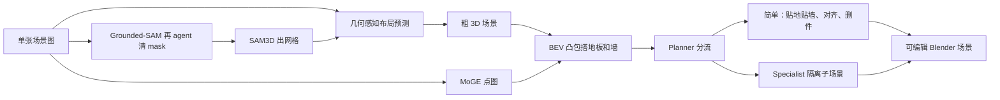

# SceneConductor：单张图先立几何脚手架，再让 planner 把改场景拆成简单编辑和局部 specialist

<!-- release-date: 2026-06-07 -->

**本文依据**：`SceneConductor: 3D Scene Generation from a Single Image with Multi-Agent Orchestration`，arXiv:2606.08402v3 [cs.CV]（2026-06-16），13 页 letter。作者 Jeonghwan Kim^{1}、Yushi Lan^{2}、Yongwei Chen^{1}、Hieu Trung Nguyen^{3}、Chuanyu Pan^{3}、Xingang Pan^{1}。^{1} Nanyang Technological University，^{2} University of Oxford，^{3} Meshy AI。项目页 `https://jhkim0759.github.io/projects/SceneConductor`。盘上 PDF 页眉写明 arXiv:2606.08402v3 [cs.CV] 16 Jun 2026。官方 abs：`https://arxiv.org/abs/2606.08402`，v1 提交日 **2026-06-07**。封面印 **Preprint.**，封面与全文抽取均未印会议名。文中数字都标 PDF 页码。本文只读这一份 PDF。

## 一句话

单张图要变成可编辑的完整 3D 室内场景，难处不在「每件东西单独长什么样」，而在**要从一张糊的视角同时猜物体几何、相对摆放、支撑关系，以及地板、墙、材质和光**（PDF p. 1）。当时三条旧路都不稳：联合布局加网格的扩散把许多因素缠在一次生成里，物体一多内存就炸；物体中心管线把件拆开再拼，布局头却多在合成或窄域室内数据上训，野外图一歪就塌；文本驱动的 LLM 拼场景跟得上常识，跟不上这张图里具体谁挡谁、墙什么颜色（PDF p. 1–2）。SceneConductor 把流程钉成三阶段：**场景初始化、环境搭建、多智能体精修**。初始化用 Grounded-SAM 出 mask、agent 清实例边界、SAM3D 出网格，再用几何感知布局预测器给出粗场景；环境阶段拿这份初始化加点图（point map）搭支撑面、房间边界、材质和光照；精修阶段由 **planner** 看结构与视觉不一致，简单问题自己下确定性操作，复杂局部交给 **specialist** 在隔离子场景里改完再并回全局（PDF p. 1–2、p. 4–5）。布局预测器不学受限 3D 库上的场景分布，而是用分割 mask 和点图抽出的**稀疏几何先验**做监督，因此能在分割级数据上训、往真实图上泛（PDF p. 1、p. 5）。

它解决的不是「再做一个更强的单物体 3D 生成器」，而是：**单视图歧义该不该继续让少数 agent 对着整场反复聊，布局该不该继续绑在要场景级标注的生成器上。**

## 一、矛盾：联合生成扩不了，物体拼装泛不了，整场 agent 改不准

作者把用途钉在 AR/VR、机器人和数字内容：单物体生成已经能从图像或文本出高质量资产，完整场景却要同时推断物体几何、空间布局、件与件关系，以及房间级环境（PDF p. 2）。

现有工作被切成三族（PDF p. 1–3）：

- **联合布局加网格**。扩散一次出多件和布局，全局结构还行，但每件单独表示让显存和算力随物体数涨，杂乱真实场景难扛（PDF p. 1–2）。
- **物体中心再组装**。件各自生成再靠布局、场景图、深度或点图对齐、优化去拼。可扩展性好了，质量却绑在布局或位姿模块上；这些模块多在合成或类别有限、房间规范的室内数据上训，野外视角和物体组合就掉（PDF p. 2）。
- **Agent 规划**。多数吃文本、靠语言模型先验，跟不上图上的物体组成、空间排列和房间外观。图像条件的多 agent（如 VIGA 的生成器加评估器）视觉接地好一点，但角色粗、每次都对着整场改，多轮全上下文既贵又难做局部修正（PDF p. 2）。

因此要一条新范式：不要从零让 agent 编整场，先给一份**图接地的强初始化**；不要少数万能角色，按阶段把任务拆给只看见自己那一块上下文的专家（PDF p. 2）。三条贡献按原文（PDF p. 2）：

- 三阶段多智能体编排：初始化、环境搭建、多智能体精修；每个 agent 有专门角色和结构化指南。
- 几何感知布局预测器：用分割 mask 和点图来的稀疏几何先验，从真实图像学空间，不要场景级布局标注。
- 在基准集和真实图上，几何精度和感知质量相对已有方法持续更好。

上图是机制示意，根据 PDF 图 1（p. 3）与第 3 节重画，不是实测时间轴。图 1(c) 把简单编辑写成贴地贴墙贴天花、对齐尺度旋转、删除物体；复杂路标 Isolated Editing 后乘 $N$ 个 specialist 再 Update（PDF p. 3）。

## 二、相关工作：感知给的是观察，生成给的是单件，agent 给的是整场聊天

**3D 感知**。传统 SfM 靠迭代优化；后来前馈方法能从稀疏或单目观察重建，但输出是几何观察，不是可编辑网格场景（PDF p. 2）。

**单件资产**。前馈重建和扩散网格都很快，靠大规模 3D 资产库。它们停在单件，不管布局和件间关系（PDF p. 2）。

**组合生成**。MIDI、PartCrafter、SceneGen 一类在统一过程里建多实例或部件。作者的判断：维持部件级表示再加全局或跨部件注意力，物体一多就贵，杂乱真实场景难扩（PDF p. 3）。

**物体中心管线**。SAM3D 从单图联合重建几何、纹理和布局。其余先抽 mask 或提案，再生成单件，最后用布局预测、场景图、深度或点图对齐、优化去拼。解耦减轻了联合生成的扩展负担，最终质量仍看布局头，而布局头常在合成或窄域数据上训（PDF p. 3）。本文切口是：**物体重建和几何感知布局拆开**，不要场景级标注也能图接地地扩（PDF p. 3）。

**Agent**。LayoutGPT、Holodeck、SceneWeaver、Edit-As-Act、VIGA 能规划、检索、调工具、在 Blender 里改。文本派跟不住参考图约束；VIGA 用生成器加评估器在执行和验证之间迭代，SceneWeaver 反复调工具，Edit-As-Act 用语义动作减工具参数歧义。作者仍说：粗粒度多功能角色对着整场改，局部修正精度不够（PDF p. 3）。

## 三、场景初始化：agent 只在 mask 上动手，网格和布局交给专用模型

方法自称 hybrid orchestration：专门 agent 加上现成模型和本文新模块，减轻单视图重建的歧义。三阶段顺序做，每阶段加几何一致性和视觉真实感，同时跟输入图对齐（PDF p. 4，图 1）。布局预测器单独放在 3.4 节，给后面精修一份可泛化的初布局（PDF p. 4）。

初始化里 agent **选择性介入**，不是从头编几何（PDF p. 4）：

1. Grounded-SAM 出分割。实例边界常冗余、碎、不一致。
2. 一个 agent 用成对重叠、类别一致、空间相容来清：同标签且高度重叠的抑制或合并，同物体碎 mask 合并，盖住多件的切开。目标是每张 mask 对应一件实物（PDF p. 4，图 1(a)）。
3. 用 SAM3D 从清过的 mask 重建网格；作者写它对遮挡和局部可见较稳。agent 判定相同的物体只重建一次再复制，避免重复生成（PDF p. 4）。
4. 全局结构交给几何感知布局预测器（PDF p. 4）。

人话：agent 在这一步的活是「谁是一件、谁该并、谁该拆」，不是「这张椅子六自由度怎么摆」。

## 四、环境搭建：点图投到 BEV 凸包，只要脚手架不要完整房间

有了初场景和预测点图，这一阶段补房间边界、表面外观和光照，当作后面精修的全局空间锚（PDF p. 4）。核心是 **scene-aware floor-plan**：在鸟瞰（BEV）里同时用输入图和点图，减轻透视歧义。从点图抽出有效 3D 点，投到水平面再算凸包，得到粗舞台多边形，近似可见足迹并定义初始环境边界（PDF p. 4，图 1(b)）。

agent 把舞台多边形和物体初摆放合在一起，推断简化舞台：地板或支撑面，外加围墙。作者写明：**不是要恢复完整房间几何**，只是轻量脚手架，把物体关在有效范围内、强制与地板的支撑关系，挡住漂浮和穿墙（PDF p. 4）。再从图里读主色和外观设墙材质，配光源做说得通的照明（PDF p. 4）。

## 五、多智能体精修：planner 分流，简单操作一次下完，复杂交互关进子场景

精修先从输入图和当前场景抽出结构化信息。一个 agent 读图和分割，恢复物体属性和关系组；另一个解析当前 3D 场景的空间配置和遮挡。planner 吃输入图和渲染图，决定总体策略，把每个问题路由到简单或复杂操作（PDF p. 4，图 1(c)）。

**简单操作**。planner 吐一份确定性操作清单，覆盖三类：强制物理支撑、同类物体对齐尺度和朝向、纠正说不通的位姿或不规则尺度。因为 agent 指定的是**目标物体和操作类型**而不是显式数值，不需要迭代精修（PDF p. 4–5）。图 1 还把贴地贴墙贴天花、对齐尺度旋转、删除物体写进简单编辑列表（PDF p. 3）。

**复杂操作**。件与件缠得很紧时，走隔离精修：planner 把相互依赖的物体收成子场景，指定一件锚当参考。为这一组另建一份场景，单个 specialist 按 planner 给的指南多轮改。每轮 specialist 看新渲染和分割，更新子场景配置。空间关系仍迭代，但范围局部，物体数少，开销下来。改完的子场景并回全局（PDF p. 5）。

和 VIGA 那种生成器加评估器对着整场聊最多 **30** 轮不同：本文先有强初始化，精修再拆成直接编辑和隔离编辑，图 4 第四列可见修漂浮、把物体贴墙（PDF p. 8）。

## 六、几何感知布局：回归 $R,T,S,F$，用单侧 Chamfer 吃分割级数据

给定初始网格和 mask，布局预测器直接从这些输入回归布局，而不是生成式建模，因此能在无标注数据集上训（PDF p. 5，图 2）。

输入图、mask、点图编成条件特征。每件网格体素化成低分辨率格子（原文举例 $16^{3}$），再经结构化 3D 潜码嵌入成紧凑 latent（PDF p. 5，引用 [36]）。可学习 token 过带全局注意力的 Transformer，捕获件间交互。物体 token 预测每件旋转、平移、尺度；地板旋转 $F$ 对所有地板旋转 token 取平均（PDF p. 5）。

对物体 $i$，位姿 token 在地板对齐的规范场景里预测 $(R_i,T_i,S_i)$：地是 $XZ$ 平面，竖直轴是 $Y$。$R_i$ 是绕竖直轴的偏航。全局地板旋转 $F$ 全体共享，把规范地板坐标系映到相机系。网格顶点 $x_k$ 到相机系（PDF p. 5 式 1）：

$$
\hat{x}_k = F\bigl(R_i(S_i \odot x_k)+T_i\bigr).
$$

$\odot$ 是逐元素缩放。这一拆把全局地板对齐和每件位姿分开：$F$ 管地板在相机里怎么转，$(R_i,T_i,S_i)$ 管每件在规范地板场景里怎么摆。物体旋转被限制在地面上、 $F$ 共享，相对独立 6DoF 少了自由度，高度有一致含义，物体朝向和全局对齐解耦，布局更稳（PDF p. 5）。

为了不绑在有限 3D 标注上，再加 **点图监督的几何损失**，从而能吃大规模 2D 分割集（PDF p. 5）。$M_i=\{x_k\}$ 是从物体 $i$ 网格采的点，$P_i$ 是点图里属于该件的子集。经式 1 得到 $\hat{M}_i$。点图稀疏、只看见物体一侧，所以用 $P_i$ 到 $\hat{M}_i$ 的**单侧 Chamfer**，再加包围盒对齐（PDF p. 6 式 2）。$\lambda=0.1$ 压低包围盒项，因为遮挡下从局部观察推的盒子不一定可靠；深度只监督近端 $z_{\min}$，因为点图只抓住可见面（PDF p. 6）。

## 七、实现：布局头在 3D-FUTURE、ScanNet、COCO 上训，编排吃 Qwen3.5-27B

布局预测器训练数据：3D-FUTURE、ScanNet、COCO。ScanNet 用物体对齐出伪标签；COCO 过滤后**只用几何监督**。ScanNet 是 $z$-up 地板且有相机外参，可用相机旋转抽出真值地板旋转（PDF p. 6）。

框架是 skill-based agent：可调用函数由 agent 编排，灵感来自代码生成 agent。图像理解用 **Qwen3.5-27B**，物体生成用 SAM3D，点图用 **MoGE**。精修组件都在 Blender 和 Python 里跑，直接出可编辑的 Blender 场景。更细的数据构造、训练协议和实现设定作者写在补充材料，本 PDF 13 页正文没有展开（PDF p. 6）。

## 八、实验：布局头在 3D-FUTURE / ScanNet / MIT-Indoor 上比基线，全流程 20 张图比 VIGA

布局预测对照 SceneGen、3D-Fixer、SAM3D。定量用 3D-FUTURE 测试集和 ScanNet 验证集（伪标签来自 MetaScenes）。ScanNet 侧重物体组成较复杂的场景，并用 Grounded-SAM 把 mask 修得比数据集自带的更好。MIT-Indoor-67 测多样场景类型的视觉质量，因无物体标注也用 Grounded-SAM 抽 mask（PDF p. 6–7）。有布局标注时用 Chamfer Distance（CD）、F-score、包围盒 IoU（IoU-B）。视觉一致性用 **Qwen3.5-2B** 打 realism、functionality、layout consistency、image alignment，再加 CLIP；表 1 的 VLM 是这些分数在**单张渲染**上的平均（PDF p. 7）。

表 1（PDF p. 6）：

| 数据集 | 方法 | CD ↓ | F-Score ↑ | IoU-B ↑ | VLM ↑ | CLIP-S ↑ |
|---|---|---:|---:|---:|---:|---:|
| 3D-FUTURE | 3D-Fixer | 0.0378 | 0.8133 | 0.4165 | 6.2297 | 0.7738 |
| 3D-FUTURE | SceneGen | 0.0137 | 0.8603 | 0.4426 | 8.2208 | 0.8029 |
| 3D-FUTURE | SAM3D | 0.0117 | 0.8928 | 0.5100 | 8.3805 | 0.8046 |
| 3D-FUTURE | Ours | **0.0089** | **0.9261** | **0.5735** | **8.5140** | **0.8071** |
| ScanNet | 3D-Fixer | 0.1713 | 0.4761 | 0.1909 | 2.0773 | 0.6512 |
| ScanNet | SceneGen | 0.1915 | 0.4204 | 0.1655 | 3.3850 | 0.6724 |
| ScanNet | SAM3D | 0.1717 | 0.4544 | 0.1789 | 3.2300 | 0.6482 |
| ScanNet | Ours | **0.1511** | **0.5206** | **0.2080** | **4.7633** | **0.6734** |

作者的读法：3D-FUTURE 上几何和视觉都最好；ScanNet 上同样全面领先，但绝对 CD 仍约 **0.15**，说明真实扫描比家具库难得多（PDF p. 6–7）。

表 2，MIT-Indoor-67 全测试集视觉指标（PDF p. 6）：

| 方法 | Realism ↑ | Functionality ↑ | Layout ↑ | Image-Align ↑ | Avg. ↑ | CLIP ↑ |
|---|---:|---:|---:|---:|---:|---:|
| SceneGen | 3.0280 | 2.4703 | 2.5239 | 2.0898 | 2.5280 | 0.6138 |
| 3D-Fixer | 2.6305 | 1.9437 | 1.9725 | 1.7747 | 2.0804 | 0.5903 |
| SAM3D | 4.3283 | 4.5776 | 3.7741 | 3.3916 | 4.0179 | 0.6236 |
| Ours | **4.5665** | **4.8839** | **4.0200** | **3.6264** | **4.2742** | **0.6302** |

作者强调 layout 和 image-align 的增益，用来支撑几何感知设计（PDF p. 7）。

全流程对照 VIGA：从 MIT-Indoor-67 **随机抽 20 张**（PDF p. 7，表 3）：

| 方法 | Realism ↑ | Functionality ↑ | Layout ↑ | Image-Align ↑ | Avg. ↑ | CLIP ↑ |
|---|---:|---:|---:|---:|---:|---:|
| SAM3D | 2.050 | 1.200 | 1.250 | 2.200 | 1.675 | 0.751 |
| VIGA | 1.800 | 0.900 | 1.100 | 1.400 | 1.300 | 0.750 |
| Initialization | 2.250 | 1.450 | 1.250 | 2.100 | 1.762 | 0.717 |
| SceneConductor | **2.400** | **1.600** | **1.400** | 2.150 | **1.887** | **0.779** |

作者特意说明：这组分数整体低于表 2，因为评测提示不再用「只看物体级对应」，VLM 看整场，场景级不一致罚得更重（PDF p. 7）。全流程平均 **1.887** 高于 Initialization 的 **1.762** 和 VIGA 的 **1.300**；Image-Align 上 Initialization 是 **2.100**、全流程 **2.150**、SAM3D 反而是 **2.200**，作者没有单独解释这一格，只报整体更好（PDF p. 7）。

定性：图 3 在 3D-FUTURE 和 ScanNet 上比 SceneGen、SAM3D，作者写旋转更准、件与件对齐更好；ScanNet 相机明显倾斜时，竞品常让物体落在不一致的地平面上，本文靠训练时强制 $xz$ 平面对齐物理地板，保持平行地结构（PDF p. 7–8）。图 4 把初始化、环境、精修三阶段和 VIGA 并排，作者写比 VIGA 更贴输入、布局更真（PDF p. 8）。

## 九、消融：几何损失、地板旋转、分割数据要叠齐才在 ScanNet 上最好

表 4，ScanNet 验证集（PDF p. 9）：

| Geometry | Floor Rot. | Seg. Data | CD ↓ | F-Score ↑ | IoU-B ↑ | VLM ↑ | CLIP-S ↑ |
|---|---|---|---:|---:|---:|---:|---:|
| ✗ | ✗ | ✗ | 0.1530 | 0.4943 | 0.2036 | 4.5933 | 0.6704 |
| ✓ | ✗ | ✗ | 0.1618 | 0.4817 | 0.1903 | 4.4583 | 0.6708 |
| ✓ | ✓ | ✗ | 0.1595 | 0.4857 | 0.1950 | 4.4550 | 0.6717 |
| ✓ | ✓ | ✓ | **0.1511** | **0.5206** | **0.2080** | **4.7633** | **0.6734** |

作者自己的读法值得原样留下：只加几何损失，几何指标**没有立刻变好**（CD 从 0.1530 升到 0.1618）；只加地板旋转也不稳定抬几何，但减少旋转歧义、稳住位姿；和分割数据叠在一起才全面最好（PDF p. 9）。图 5 写：几何损失让尺度和空间范围更准；地板旋转让朝向相对地面更齐；三者齐了，尺度、平移和摆放才一起顺（PDF p. 9）。

## 十、限制：正文没写的，和作者承认会传的错

作者承认（PDF p. 9）：

- 串行调用 Qwen3.5、SAM3D、MoGE 等基础模型，推理延迟不小；前段错误会传到后段精修。
- 实验主要在室内、外观停在纹理级；室外或无界环境、更丰富的材质表示留作未来。

本 PDF 也没写：端到端墙钟时间、token 用量、Blender 操作的精确 API、布局预测器层数和训练超参（作者指向补充材料）、COCO 过滤规则、ScanNet 伪标签对齐细节、表 3 仅 20 张的方差。封面是 Preprint，没有会议录用信息。

## 十一、可迁移启发

- **先给 agent 一份图接地的初值，再让它改。** 从零编整场，多轮全上下文又贵又不准；强初始化把 planner 的活从「发明房间」收成「修不一致」。
- **简单操作不要迭代。** 贴地、对齐、删除只要目标加操作类型，数值让几何约束去填。
- **复杂交互关进子场景。** 局部 specialist 只看见相关件，比整场生成器加评估器更适合单视图歧义。
- **布局回归可以吃分割级数据。** 单侧 Chamfer 加点图，不必等场景级 6DoF 标注；共享地板旋转 $F$、物体只留偏航，是把单视图自由度主动砍掉。
- **脚手架不是完整重建。** BEV 凸包只要支撑和边界，完整房间几何可以以后再补。

## 十二、关键词回看

- **多智能体编排（multi-agent orchestration）**：三阶段流水线，每个 agent 只拿自己子任务需要的上下文。
- **Planner / specialist**：planner 分流并直接做简单编辑；specialist 在隔离子场景里多轮修局部。
- **几何感知布局预测器**：回归 $R,T,S,F$，用 mask 加稀疏点图先验，不要场景级布局标注。
- **点图（point map）**：MoGE 给出的几何观察，既喂布局损失，也喂 BEV 凸包。
- **单侧 Chamfer**：只从可见点图点拉向变换后的网格，承认单视图只看见一侧。
