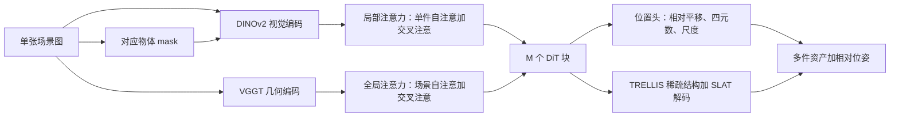

# SceneGen：单张场景图加物体 mask，一次前馈同时出几何、纹理和相对位姿

<!-- release-date: 2025-08-21 -->

**本文依据**：`SceneGen: Single-Image 3D Scene Generation in One Feedforward Pass`，arXiv:2508.15769v2 [cs.CV]（2025-12-09），17 页 letter。作者 Yanxu Meng\*、Haoning Wu\*（共同一作）、Ya Zhang、Weidi Xie，School of Artificial Intelligence, Shanghai Jiao Tong University。项目页 `https://mengmouxu.github.io/SceneGen`。盘上 PDF 页眉写明 arXiv:2508.15769v2 [cs.CV] 9 Dec 2025。官方 abs：`https://arxiv.org/abs/2508.15769`，v1 提交日 **2025-08-21**。封面与全文抽取均未印会议名。文中数字都标 PDF 页码。本文只读这一份 PDF。

## 一句话

单张室内场景图要变成可摆的多件 3D 资产，难处不在「每件东西单独长什么样」，而在**只看到一个视角，却要同时猜几何、纹理，以及物体之间怎么撑、怎么挡、怎么挨着**（PDF p. 1–2）。当时两条旧路都不稳：从 CAD 库检索再组装，库永远盖不住这张图里那件「刚好对上」的模型；先单件生成再靠 VLM 或优化去摆，流程长、误差叠，还贵（PDF p. 2）。最近 MIDI、PartCrafter 已经能从单图出多件或部件，但作者认为保真度不够、空间关系也不准，而且它们绑在规范空间表示上（PDF p. 2–3）。SceneGen 的做法是：输入一张场景图加对应物体 mask，**一次前馈同时出多件带几何、纹理和相对位姿的资产**；视觉编码器 DINOv2 与几何编码器 VGGT 抽出物体级和场景级特征，特征聚合模块用局部注意力修单件、全局注意力让件与件互相看见，再加一个位置头显式预测相对平移、四元数旋转和尺度（PDF p. 1、p. 3–4）。只在单图上训过，多图输入时架构仍能吃，几何甚至更好（PDF p. 1、p. 5）。四件带纹理的场景在单卡 A100 上大约 **2 分钟**（PDF p. 2、p. 7）。

它解决的不是「再做一个更强的单物体 3D 生成器」，而是：**空间关系能不能写进一次前馈，而不是事后检索或优化。**

## 一、矛盾：单物体先验已经很强，场景还在检索或两阶段拼

作者把需求钉在 VR/AR 和具身智能：场景不是一件资产，而是多件资产要同时有可信几何、纹理和空间关系（PDF p. 2）。这件事拆成两块能力：

1. **资产生成**：从有限的文字或图像线索，长出说得通的拓扑。
2. **空间布置**：支撑、遮挡、接触等物理上说得通的相对关系（PDF p. 2）。

现有工作被切成两类（PDF p. 2，图 2）：

- **检索式**。LLM 先规划布局，再从现成库里捞模型拼场景。路直，但灵活度被库覆盖卡住。
- **两阶段**。先合成单件 3D，再用 VLM 或优化去改结构、改摆放。更灵活，但迭代优化慢，误差会叠。

最接近的是 PartCrafter 和 MIDI：单图出部件或多件资产。作者点名的缺口是合成保真度有限、资产之间空间关系不准（PDF p. 2）。相关工作里又补了一刀：MIDI、PartCrafter 依赖规范空间表示，重建保真度被牺牲（PDF p. 3）。

因此需要一条新范式：从**一张场景图**，在**一次前馈**里同时生成多件资产的几何、纹理和空间位置，不要逐场景优化（PDF p. 2）。作者声称，就他们所知，SceneGen 是第一份能这样做的 3D 场景生成模型（PDF p. 2）。

上图是机制示意，根据 PDF 图 1–3（p. 1、p. 3–4）与第 3 节重画，不是实测时间轴。预处理图里出现的 VLM、Florence-2、深度模型是对照方法的流水线，不是 SceneGen 训练时必须跑的模块（PDF p. 3 图 2）。

四条贡献按原文（PDF p. 1）：

- SceneGen：场景图加物体 mask 进，一次同时出多件带几何和纹理的 3D 资产，不要额外优化，也不要检索。
- 特征聚合：在特征抽取里把视觉、几何编码器给出的局部和全局场景信息合在一起。
- 位置头：一次前馈里同时出 3D 资产和相对空间位置。
- 多图可扩展：只在单图上训，给多张图时生成反而更好。

## 二、相关工作：感知已经能前馈，生成还停在单件或事后摆

**3D 视觉感知**。传统 SfM 靠重优化。后来前馈方法把几何先验从大规模数据里蒸出来，不必显式 3D 归纳偏置：DUSt3R 开这条路，VGGT 做成更极简、也更强的范式（PDF p. 2）。SceneGen 后面把 VGGT 直接当几何编码器，原因就在这里。

**3D 资产合成**。扩散把 2D 生成的成功搬到 3D：点云、体素、SDF、3DGS、NeRF 都做过。后来用 VAE 压几何或纹理，再走网格–纹理混合管线。TRELLIS 用结构化潜码做可放大、高保真的单件生成（PDF p. 2）。作者的判断很硬：这些方法**停在单件**，本质上不会建模复杂的多资产场景（PDF p. 2）。

**3D 场景生成**。文本侧多用 LLM 规划布局再检索。图像侧靠分割、场景图、深度 / 点云对齐来帮多件生成和摆放。优化派用 VLM 做后处理，慢。MIDI 和 PartCrafter 走单图条件，但规范空间表示伤保真（PDF p. 3）。SceneGen 的切口是：**同时吃物体级和场景级特征**，一次前馈出几何、纹理和相对位置（PDF p. 3）。

## 三、问题形式：相对查询件的 8 维位姿，查询件钉死在原点

SceneGen 写成 $G_{\mathrm{Scene}}$：一张含 $N$ 个物体的场景图 $I_{\mathrm{Scene}}$，加上 mask $\{m_i\}_{i=1}^{N}$，一次出每件的结构与纹理 $\{S^i\}$ 和相对位置 $\{P^i\}$（PDF p. 3）：

$$
\{(S^i,P^i)\}_{i=1}^{N}=G_{\mathrm{Scene}}\bigl(I_{\mathrm{Scene}},\{m_i\}_{i=1}^{N}\bigr).
$$

位置相对预先选定的**查询资产**。每件 $P^i=[t^i,q^i,s^i]\in\mathbb{R}^8$：$t^i\in\mathbb{R}^3$ 平移，$q^i\in\mathbb{R}^4$ 旋转四元数，$s^i\in\mathbb{R}^1$ 尺度。默认 $i=1$ 是查询件，钉死（PDF p. 3）

$$
t_{\mathrm{query}}=[0,0,0],\quad q_{\mathrm{query}}=[1,0,0,0],\quad s_{\mathrm{query}}=1.
$$

人话：不把整间屋子绝对坐标学一遍，而是选一件当尺子，其余件只学相对它怎么挪、怎么转、怎么缩放。训练时还会轮流把每件当查询件，免得尺子选偏（PDF p. 5）。

## 四、底座：TRELLIS 的稀疏结构加结构化潜码，DINOv2 看外观，VGGT 看几何

附录 A 把三块先验写清楚（PDF p. 13）。

**TRELLIS**。一件资产 $O$ 编成统一表示 $z=\{(z_i,p_i)\}_{i=1}^{L}$：$p_i$ 是与表面相交的活跃体素在 $D$ 分辨率网格上的位置索引，$z_i\in\mathbb{R}^{C}$ 是挂在该体素上的局部潜特征。生成是两级整流流：稀疏结构生成器 $G^{S}$ 先出稀疏体素结构 $\{p_i\}$（几何先验）；结构化潜码生成器 $G^{L}$ 再在 $\{p_i\}$ 条件下出外观特征 $\{z_i\}$。目标都是条件流匹配（PDF p. 13）。SceneGen 兼容这两级解码器，潜特征先后变成几何和纹理（PDF p. 13）。

**VGGT**。大规模 3D 标注上训过的纯前馈网络，单视图或多视图 RGB 进，聚合器出场景几何特征。全局自注意和局部自注意两路特征，再用轻量 DPT 解成深度图、点图和轨迹，用来证明这些特征里确实有场景几何（PDF p. 13）。SceneGen 只用聚合器当 $\Phi_{G}$，不把 DPT 头接到生成损失上。

**DINOv2** 当视觉编码器 $\Phi_{V}$（PDF p. 3）。局部注意力块和前馈网络从 TRELLIS 预训练权重初始化；TRELLIS 本身是流匹配模型，从带噪稀疏结构潜码合成 3D（PDF p. 4）。

## 五、设计：特征抽取四路拼接，局部修单件，全局让全场互相看见，位置头出 8 维

框架三阶段（PDF p. 3）：特征抽取、特征聚合、输出。

### 特征抽取：每件四路，沿序列拼成场景上下文

对每个物体及其 mask $m_i$，抽四路（PDF p. 3）：

1. 物体自己的视觉特征 $F_i^{V}=\Phi_{V}(I^{\mathrm{scene}}\otimes m_i)$，$\otimes$ 是逐像素相乘。
2. mask 的视觉特征 $F_i^{\mathrm{mask}}=\Phi_{V}(m_i)$。
3. 整图全局视觉 $F_{\mathrm{global}}^{V}=\Phi_{V}(I^{\mathrm{scene}})$。
4. 整图全局几何 $F_{\mathrm{global}}^{\mathrm{geo}}=\Phi_{G}(I^{\mathrm{scene}})$。

再沿序列长度拼成该件的场景上下文（PDF p. 3）

$$
F_i^{\mathrm{scene}}=[F_i^{V};F_i^{\mathrm{mask}};F_{\mathrm{global}}^{V};F_{\mathrm{global}}^{\mathrm{geo}}].
$$

人话：局部告诉模型「这件长什么样、在图上哪一块」；mask 通路把形状轮廓单独送进去；全局视觉给整间屋子的外观；VGGT 给 3D 几何上下文。后面消融会显示，四路拿掉任何一路都会掉点（PDF p. 8）。

### 特征聚合：$M$ 个 DiT 块，每块局部 + 全局 + FFN

聚合模块让多件同时生成。每块含局部注意力、全局注意力和前馈（PDF p. 3–4）。$N$ 件的稀疏结构潜码 $\{x_i\}_{i=1}^{N}$，$x_i\in\mathbb{R}^{T\times C}$。

**局部注意力**修单件细节：资产级自注意（AS）再交叉注意（AC）去吃该件视觉特征 $F_i^{V}$（PDF p. 4）

$$
x_i^{\mathrm{AS}}=\mathrm{Attention}(x_i,x_i,x_i),\qquad
x_i^{\mathrm{AC}}=\mathrm{Attention}(x_i^{\mathrm{AS}},F_i^{V},F_i^{V}).
$$

图 3 说明预训练局部注意力先修每件纹理（PDF p. 4）。

**全局注意力**建件与件的依赖。先给每件一个可学习位置 token $p_i$ 和四个 register token $r_i$，拼成 $\hat{x}_i=[p_i;r_i;x_i^{\mathrm{AC}}]$（做法类似 VGGT 与 registers 论文，PDF p. 4）。查询件用**独一份**位置 token 和 register；其余件共用另一套。各件 $\hat{x}_i\in\mathbb{R}^{T\times C}$ 沿序列拼成 $X\in\mathbb{R}^{(N\cdot T)\times C}$，场景级自注意（SS）

$$
\{x_i^{\mathrm{SS}}\}_{i=1}^{N}=\mathrm{Attention}(X,X,X).
$$

再场景级交叉注意（SC）去吃 $F_i^{\mathrm{scene}}$，把几何上下文灌进去（PDF p. 4）

$$
x_i^{\mathrm{SC}}=\mathrm{Attention}(x_i^{\mathrm{SS}},F_i^{\mathrm{scene}},F_i^{\mathrm{scene}}).
$$

作者说这一步既保住物体细节，又加上全局几何约束，用来对付遮挡、做几何 refinement（PDF p. 4）。

局部注意力和 FFN 从 TRELLIS 初始化；**训练时只更新全局注意力块、可学习位置 token 和位置头，其余冻结**（PDF p. 5，图 3 图例：冻结与可训参数分开画）。

### 输出：位置头解非查询件，TRELLIS 解码几何和纹理

过完 $M$ 个 DiT 块，得到更新后的位置 token $\{\hat{p}_i\}$ 和潜特征 $\{\tilde{x}_i\}$（PDF p. 4–5）。非查询件的位置 token 拼起来，送进位置头 $\Psi_{\mathrm{pos}}$：**四层自注意加一层线性**，出 8 维向量（PDF p. 5）

$$
\{\hat{P}^i\}_{i=2}^{N}=\Psi_{\mathrm{pos}}(\{\hat{p}_i\}_{i=2}^{N}),\quad \hat{P}^i=[\hat{t}_i,\hat{q}_i,\hat{s}_i].
$$

潜特征用现成稀疏结构生成器 $G^{S}$ 和结构化潜码生成器 $G^{L}$ 解码（PDF p. 5）

$$
\{\hat{S}\}_{i=1}^{N}=G^{L}\bigl(G^{S}(\{\tilde{x}_i\}_{i=1}^{N})\bigr).
$$

位置是显式头预测出来的，不是生成完再 ICP 对齐猜的。这是和 MIDI「规范空间里出几何、布局另说」的关键差别。

## 六、训练：3D-FUTURE 上只训全局块，流匹配 + 位姿 Huber + 体素碰撞

**数据**。3D-FUTURE：有照片级渲染、实例 mask 和资产标注。**12K** 训练场景、**4.8K** 测试场景，每张图一件或多件（PDF p. 5）。为了学相对关系，轮流指定每件为查询件，其余随机打乱，有效样本扩到 **30K**（PDF p. 5）。附录 B：单卡 A100 上每场景最多 $N'=7$ 件，超过就随机抽子集；按 TRELLIS 审美分，低于 **4.5** 的资产丢掉（PDF p. 13）。资产件数分布见图 6（PDF p. 14）。作者强调纹理和光照多样，用来模拟真实环境、帮泛化（PDF p. 13）。

**只训一部分**。全局注意力、位置 token、位置头可训，其余冻住，为的是训得起（PDF p. 5）。

**损失**三项加权（PDF p. 5）

$$
\mathcal{L}=\mathcal{L}_{\mathrm{cfm}}+\lambda(\mathcal{L}_{\mathrm{pos}}+\mathcal{L}_{\mathrm{coll}}).
$$

1. **条件流匹配** $\mathcal{L}_{\mathrm{cfm}}$。直线插值 $x_i(t)=(1-t)x_i^{0}+t\epsilon$，学速度场去逼近 $\epsilon-x_i^{0}$，对 $N$ 件取平均（PDF p. 5）。管资产生成。
2. **位置损失** $\mathcal{L}_{\mathrm{pos}}$。非查询件上 $\mu$ 加权 Huber。平移误差除以该样本场景尺度 $d_{\mathrm{scene}}$，避免查询件选不同时数值炸掉，也让不同查询配置更好泛化（PDF p. 5）。
3. **碰撞损失** $\mathcal{L}_{\mathrm{coll}}$。预测稀疏结构经 TRELLIS 解码器变点云，用预测位姿变到 **$64\times 64\times 64$** 体素网格 $V$，Huber 惩罚重叠表面体素占全部表面体素的比例（场景 IoU）。理想 $ \mathrm{IoU}_{\mathrm{scene}}=0$ 表示没有资产互撞（PDF p. 5）。

实现：8 张 A100，**240** epoch，AdamW，学习率 $5\times 10^{-5}$，batch **8**。$\lambda$ 在 $[0.2,1]$ 里动态衰减，衰减因子 **0.99**。Huber 阈值 $\delta_{P}=0.02$、$\delta_{C}=0.05$。每步动态采样**资产件数相同**的场景，以应付件数变化。推理 **25** 步采样，CFG $w=5.0$（PDF p. 6）。

$\mu_{t},\mu_{q},\mu_{s}$ 三个位置损失权重的具体数值，正文和附录都没写。

## 七、多图扩展：没在多视图上微调，VGGT 跨视图聚合，位姿取平均

第 3.4 节与附录 C.1 说的是同一件事（PDF p. 5、p. 13–14）。只在单图样本上训过，但抽取和条件策略灵活，推理时可以直接吃 $K$ 张同一场景的图。每张图的视觉特征仍各自过 $\Phi_{V}$；几何特征由 $\Phi_{G}$ **一次聚合所有视图**再取出第 $k$ 个视角（PDF p. 5）

$$
F_{\mathrm{geo}}^{k}=\Phi_{G}\bigl(\{I_{\mathrm{scene}}^{j}\}_{j=1}^{K}\bigr)[k].
$$

各视角分别预测相对位姿，再平均。作者说这样几何理解更好，尽管从未在多视图上显式微调（PDF p. 5）。约束：各视角的资产顺序和 mask 顺序必须一致，否则对不齐（PDF p. 14）。多视图定量集当时没有，只在 ScanNet++ 上做定性，数据集和评测留到未来（PDF p. 14）。

图 5：相对单图，多图输入几何更完整、纹理更细（PDF p. 8）。

## 八、实验：3D-FUTURE 上几何和外观都报当时最好，四件约两分钟

设定（PDF p. 6）：几何用合成表面点云，FilterReg 对齐真值（作者认为比 ICP 更快更准），再算场景级 / 物体级 Chamfer、F-Score，以及包围盒体积 IoU。外观：对齐后用 Blender 从原相机视角渲染，对照两类真值——用物体 mask 抠出的实例场景图，以及真值资产同视角渲染（不含环境光）。指标 PSNR、SSIM、LPIPS、FID、CLIP 图图相似、DINOv2 图图相似。效率报单卡 A100 上**合成单件**的时间；MIDI 带星号表示纹理靠 MV-Adapter 渲。

基线：PartCrafter、DepR、Gen3DSR、MIDI，用它们的预训练权重。除 PartCrafter 外都给物体 mask；PartCrafter 不支持 mask 控制，改送抠出的物体和资产个数。PartCrafter 与 DepR 没有纹理渲染代码，只比几何；外观只和 Gen3DSR、MIDI 比（PDF p. 6）。基准是 3D-FUTURE 测试集 **4.8K** 场景（PDF p. 6）。

表 1 关键数字（PDF p. 6；视觉两行分别是 Scene / GT-Render）：

| 方法 | CD-S↓ | CD-O↓ | F-Score-S↑ | F-Score-O↑ | IoU-B↑ | 单件时间（秒） |
|---|---:|---:|---:|---:|---:|---:|
| PartCrafter | 0.2027 | — | 40.43 | — | — | 7.2 |
| DepR | 0.0518 | 0.0862 | 63.02 | 47.66 | 0.2989 | 11.6 |
| Gen3DSR | 0.0521 | 0.0935 | 61.26 | 41.26 | 0.2978 | 179.0 |
| MIDI\* | 0.0501 | 0.0602 | 68.74 | 61.04 | 0.2493 | 42.5 |
| SceneGen | **0.0118** | **0.0138** | **90.60** | **89.73** | **0.5818** | 26.0 |

SceneGen 外观（PDF p. 6）：Scene 行 PSNR **16.76**、SSIM **0.8903**、LPIPS **0.1417**、FID **19.59**、CLIP-S **0.9152**、DINO-S **0.8322**；GT-Render 行 PSNR **17.59**、SSIM **0.8991**、LPIPS **0.1234**、FID **12.34**、CLIP-S **0.9236**、DINO-S **0.8702**。MIDI 对应 Scene 行 FID **22.75**、CLIP-S **0.8711**；GT-Render 行 FID **28.26**、CLIP-S **0.8706**。PartCrafter、DepR 的外观格为空白，原文就空着。

作者三条观察（PDF p. 6–7）：

- 几何：场景级和资产级全赢。归因于生成时同时吃局部资产特征和全局场景上下文，位置头再显式预测摆放。
- 外观：不靠外部纹理模型，两类真值对照都最好。
- 效率：PartCrafter **7.2 秒** 单件更快，但质量和可控性差。SceneGen 单件 **26.0 秒**，四件带几何和纹理 **2 分钟**内（PDF p. 2 写 approximately 2 minutes；p. 7 写 within 2 minutes；附录 C.2 写 containing 4 assets … within 2 minutes，PDF p. 16）。Gen3DSR 单件 **179.0 秒**。

补充：PartCrafter、DepR、MIDI 在 3D-FRONT 上训过，可能和测试有重叠；SceneGen 仍全面超过（PDF p. 7）。定性在 3D-FUTURE 与野外 ScanNet++：PartCrafter 常把不同资产糊成一件，且它和 DepR 只能出几何；所有基线都难准理解空间关系（PDF p. 7，图 4；附录图 8，PDF p. 16）。

附录表 3 把对齐方法本身钉住（PDF p. 14）：MIDI 用 ICP 时 CD-S **0.1697**、F-Score-S **41.64**、IoU-B **0.1232**；换 FilterReg 变成 **0.0501 / 68.74 / 0.2493**。SceneGen 用 ICP 已是 **0.0310 / 83.74 / 0.5103**，FilterReg 再落到表 1 的 **0.0118 / 90.60 / 0.5818**。两种对齐下 SceneGen 都高于 MIDI。效率数字是 **500** 次单件试验的平均（PDF p. 16）。外观协议的边界：实例 mask 图会因遮挡和预测渲染有差别；GT-Render 缺场景光照和完整纹理（PDF p. 15 图 7）。

## 九、消融：几何特征管结构，视觉特征管外观，场景自注意拿掉全场崩

表 2 逐步拿掉全局几何、全局视觉、mask 视觉，再把场景级自注意换成简单资产级自注意（PDF p. 8）。完整模型 CD-S **0.0118**、F-Score-S **90.60**、IoU-B **0.5818**。只拿掉全局几何：CD-S **0.0183**、F-Score-S **83.33**、IoU-B **0.4805**。再拿掉全局视觉：**0.0250 / 79.08 / 0.4253**。再拿掉 mask：**0.0310 / 75.20 / 0.3825**。再换成资产级自注意：**0.0764 / 54.21 / 0.1705**，Scene 行 PSNR 掉到 **13.32**、FID 升到 **27.56**（PDF p. 8）。

三条结论按原文：任何一块拿掉都掉点；几何特征主要伤结构，视觉特征再伤外观；没有场景级自注意就没有生成过程中的跨资产交互，所有指标明显下降（PDF p. 8）。

## 十、限制与未公开：室内分布、碰撞仍会发生、必须吃 mask

附录 E（PDF p. 17）：

- **只覆盖室内**。相对规范空间那批方法，纹理和泛化更好，但训练分布窄，出不了非室内。
- **碰撞和重叠**。一次前馈出多件和相对位姿，不必复杂后处理，但接触关系不是每次都对，偶尔重叠或几何不一致。作者归因于单阶段框架没有显式施加严格空间 / 物理约束——尽管训练有碰撞损失。
- **依赖分割 mask**。当前用真值 mask 或现成 SAM 2。野外灵活度受限，低质量 mask 可能不稳。

未来方向四条：更大室内外数据集；合适的多视图场景数据（定量现在没有）；显式物理先验；再加分割模块或把分割能力做进模型（PDF p. 17）。

正文没写 $M$ 具体是几块 DiT、潜码 $T$ 和通道 $C$、位置损失三个 $\mu$ 的数值、VGGT / DINOv2 哪一档权重。代码与模型声明将公开在项目页（PDF p. 1），这份 PDF 里没有仓库 commit 或权重规格。

## 十一、可迁移的几条

- **空间关系写成一个头，而不是事后优化。** 相对查询件的 8 维 $(t,q,s)$，查询件钉死，训练时轮流当查询件。多实例生成里「谁是原点」比绝对坐标好学。
- **冻住强单件生成器，只训跨实例通路。** 局部注意力和 TRELLIS 解码器冻住，只更新全局注意力、位置 token 和位置头。场景数据远小于单物体预训练时，这比全量微调更像能落地的配方。
- **几何编码器和视觉编码器分开进，再在注意力里合。** VGGT 管结构，DINOv2 管外观，消融显示两路不是装饰。
- **碰撞用体素 IoU 进损失，但作者自己承认仍会叠。** 损失能降碰撞统计，替代不了显式物理约束。
- **多视图可以是推理期的免费增益。** 几何编码器天生吃多图，视觉仍分视角，位姿平均。前提是实例顺序对齐；没有多视图训练集时不要假装已经有定量结论。

## 十二、关键词回看

- **一次前馈场景生成**：一张图加 mask，同时出多件几何、纹理和相对位姿，不要逐场景优化或检索。
- **查询资产**：相对位姿的原点；默认第一件，平移零、单位四元数、尺度 1。
- **特征聚合**：DiT 里局部注意力修单件，全局自注意加交叉注意让全场和 VGGT 几何互相看见。
- **位置头**：四层自注意加线性，解非查询件的 8 维位姿。
- **结构化潜码（SLAT）与稀疏结构（SS）**：TRELLIS 的两级解码，SceneGen 用来把潜特征变成网格几何和纹理。
- **条件流匹配**：直线路径上学速度场，监督每件资产生成。
- **体素碰撞损失**：64 立方体素上重叠表面比例的 Huber。

## 参考资料

- 本文原件：`readings/_src/图像、视频与 3D 生成/SceneGen.pdf`（arXiv:2508.15769v2）。
- 官方 abs：`https://arxiv.org/abs/2508.15769`。
- 项目页：`https://mengmouxu.github.io/SceneGen`。
