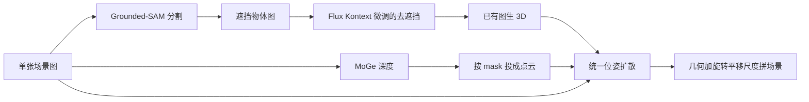

# SceneMaker：把去遮挡从 3D 物体生成里拆出来，再用全局加局部注意力估开集场景位姿

<!-- release-date: 2025-12-11 -->

**本文依据**：`SceneMaker: Open-set 3D Scene Generation with Decoupled De-occlusion and Pose Estimation Model`，arXiv:2512.10957v1 [cs.CV]（2025-12-11），15 页 letter。作者 Yukai Shi^{1,3}*（Tsinghua University，实习于 IDEA Research）、Weiyu Li^{2,4}（HKUST / LightIllusions）、Zihao Wang^{4}、Hongyang Li^{3}、Xingyu Chen^{3}、Ping Tan^{2,4}、Lei Zhang^{3}。^{1} Tsinghua University，^{2} HKUST，^{3} IDEA Research，^{4} LightIllusions。项目页 `https://idea-research.github.io/SceneMaker/`。盘上 PDF 页眉写明 arXiv:2512.10957v1 [cs.CV] 11 Dec 2025。官方 abs：`https://arxiv.org/abs/2512.10957`，v1 提交日 **2025-12-11**。封面与全文抽取均未印会议名。文中数字都标 PDF 页码。本文只读这一份 PDF。

## 一句话

单张图要变成开集 3D 场景，难处不在「每个物体单独长什么样」，而在**挡得很狠、类别又不在室内家具表里时，去遮挡先验和位姿先验都不够**（PDF p. 1–2）。场景原生方法想从稀缺场景数据一次学完去遮挡、几何、位姿，开集先验不够；物体原生方法用上了大规模 3D 物体库，几何好了，去遮挡和位姿仍绑在有限场景数据上（PDF p. 2，图 2）。SceneMaker 的做法是**按先验来源把任务拆开**：去遮挡用图像数据和自建 10K 去遮挡集训；几何交给已有开集图生 3D；位姿用统一扩散模型一次出旋转、平移、尺度，自注意力与交叉注意力都分全局和局部，再用 200K 合成开集场景把位姿模型的开集泛化拉开（PDF p. 1–2）。室内与开集测试上都报了当时最好的一组几何加位姿指标（PDF p. 1、p. 8–9）。

它解决的不是「再做一个更强的单物体 3D 生成器」，而是：**去遮挡该不该继续和 3D 生成绑在一起，位姿该不该用同一套注意力去看物体空间和场景空间。**

## 一、矛盾：开集几何已经有了，缺的是开集去遮挡和开集位姿

开集 3D 场景生成：从单张图合成任意物体、任意开域里的 3D 场景。作者点名用途是资产制作、仿真环境和决策用的 3D 感知（PDF p. 2）。场景数据集少，现有方法大多困在室内（PDF p. 2）。

大规模 3D 物体数据集把开集物体生成推快了，也有人开始把场景生成往开集推。作者仍说：**遮挡重、开集时，高质量几何和准位姿很难同时拿到**（PDF p. 2，图 10）。根因写成三列开集先验：去遮挡、物体几何、位姿估计。这三列在图像、物体、场景三类数据上的供给不一样（PDF p. 2，图 2）：

- **场景原生（黄路）**：只从场景数据学三列先验。开集供给都弱。
- **物体原生（绿路）**：用大规模 3D 物体库把几何先验补够。去遮挡和位姿仍不够。
- **本文（红路）**：去遮挡改吃图像数据；位姿改吃新采的场景数据；几何继续吃物体库。

几何和位姿若仍绑成一份联合表示，会出现小物体几何塌、位姿漂（PDF p. 2，图 10）。现成位姿方法接到场景生成上还会掉：缺尺度预测，也没有按位姿变量定制的注意力（PDF p. 2）。

因此框架按先验拆成三件事，各自在图像、3D 物体、场景数据上分开训，避免「一份数据同时拖垮几项任务」（PDF p. 2）。

上图是机制示意，根据 PDF 图 3（p. 4）与第 3.1 节重画，不是实测时间轴。图 3 里位姿 Transformer 标了 **24** 层；块内是 GSA、LSA、GCA、LCA、FFN（PDF p. 4）。

三条贡献按原文（PDF p. 3）：

- 解耦框架 SceneMaker：按数据集把开集去遮挡与位姿先验吃满。
- 去遮挡模型：用图像数据拿开集遮挡先验，再加 10K 物体图去遮挡集增强。
- 统一位姿扩散：直接预测每个物体的 6D 位姿和尺度，局部加全局注意力；再整理 200K 合成场景做开集泛化。

## 二、相关工作：检索、场景原生、物体原生，缺的是「先验从哪来」

**场景生成**按 3D 物体来源分成检索和生成（PDF p. 3）。检索从离线库捞资产，库多样性不够就难开集。生成再分成场景原生和物体原生。场景原生直接学 3D-FRONT、ScanNet 一类室内数据，域窄。物体原生用 Objaverse 一类开集物体库提高几何。其中一串方法直接在场景空间里出物体几何，场景数据有限、表示又耦合，遮挡重或物体小时会明显掉。另一串把几何和位姿拆开，开集几何好了，但位姿阶段没有场景级交互，相对位姿仍不准（PDF p. 3）。作者把缺口收成一句：去遮挡和位姿的开集先验都不够（PDF p. 3）。

**遮挡下的物体生成**。多数做成 3D 补全：从图得到残缺几何，再用 3D 生成补。最近有人把遮挡图和 mask 当补充条件。作者认为 3D 生成模型几何先验已经够，瓶颈是去遮挡先验；图像数据里的遮挡花样比 3D 数据多，却没被吃满（PDF p. 3）。

**位姿估计**。基于 CAD 的方法在预定义类上已经强；任意物体上有回归也有扩散，接到场景生成时常缺尺度。CAST3D 用点扩散补尺度，但缺物体之间的交互，也缺按不同条件空间拆开的机制（PDF p. 3）。

## 三、框架：感知、去遮挡后生成、再估位姿

给定单张场景图 $X=\{x_1,\ldots,x_n\}$，目标是一份一致场景 $Z=\{z_1,\ldots,z_n\}$（PDF p. 4）。自动化步骤按原文（PDF p. 4）：

1. Grounded-SAM 出 mask $M$，扣出遮挡物体图 $I$。
2. MoGe 出深度 $D$，按 mask 投到 3D，得点云 $C$。
3. 去遮挡扩散 $\epsilon^d_\theta(I^d_t;t,I)\to I^d$。
4. 图生 3D $\epsilon^o_\theta(O_t;t,I^d)\to O$。
5. 位姿模型 $\epsilon^p_\theta(P_t;t,X,M,I,C,O)\to P$，每个 $p_i=\{r_i,t_i,s_i\}$。
6. 几何和位姿合成 $Z=\{O,P\}$。

感知模块用的 Grounded-SAM、MoGe 是现成工具；本文贡献从去遮挡解耦和统一位姿开始。

## 四、去遮挡：从 3D 生成里拆出来，改吃图像数据

遮挡下直接做 3D，模型缺开集遮挡先验，因为 3D 数据量不够（PDF p. 4）。图像数据更大、物体更杂、遮挡花样更多，所以把去遮挡单独做成图像扩散，几何仍交给已有图生 3D（作者写采用现有方法，引用 Step1X-3D）（PDF p. 5，式 1–2）。

初始化用 **Flux Kontext**，因为它已经有开集图像编辑和自然语言理解（PDF p. 5）。编辑模型和 inpainting 理论上都能去遮挡，遮挡狠时仍差，因为训练数据里缺多样、严重的遮挡花样（PDF p. 5）。补救是再造 **10K** 物体图去遮挡集微调（PDF p. 5）。

数据管线（图 4，PDF p. 5）：GPT 写细 caption，图像生成模型出高质量目标图。考虑到遮挡图来自分割、分割又跟预定义类走，每类生成 **20** 条 caption 并尽量写细。所有类共用一份去遮挡文本模板。三种 mask 策略模拟真实遮挡（图 5，PDF p. 5）：

- 无背景的物体抠图，模拟物体挡物体。
- 直角裁切，模拟图边被切掉。
- 随机笔刷，模拟用户涂抹。

物体和整图还会随机缩放，模拟小物体和低分辨率。最终是 10K 三元组：mask 图、文本、目标图（PDF p. 5）。

评测在自建验证集：**1K** 张、超过 **500** 类（PDF p. 5）。指标是预测与真值的 PSNR、SSIM，以及预测图与类标签的 CLIP（PDF p. 5–6）。表 1（PDF p. 5）：

| 方法 | PSNR↑ | SSIM↑ | CLIP↑ |
|---|---|---|---|
| BrushNet | 11.07 | 0.6760 | 0.2659 |
| Flux Kontext | 13.91 | 0.7309 | 0.2674 |
| 本文 | 15.03 | 0.7566 | 0.2698 |

图 6 说室内和开集、尤其严重遮挡时观感更好（PDF p. 5）。这是去遮挡子任务上的数字，不是整场景。

遮挡下的 3D 物体生成再和 MIDI、Amodal3R 比。定量测试用 InstPIFu 从 3D-FRONT 渲的图，里面有大量严重遮挡物体（PDF p. 6）。表 2（PDF p. 6）：

| 方法 | CD↓ | F-Score↑ | Volume IoU↑ |
|---|---|---|---|
| MIDI | 0.0508 | 0.5533 | 0.4214 |
| Amodal3R | 0.0443 | 0.7124 | 0.5279 |
| 本文 | 0.0409 | 0.7454 | 0.5985 |

图 7 说室内和开集上几何更完整、细节更多（PDF p. 6）。作者把收益归因于**解耦**：3D 生成器不再被迫同时学去遮挡。

可迁移的一点：图像编辑模型已经见过比 3D 库更杂的遮挡，**先在 2D 把看不见的部分补完，再调用开集图生 3D**，比把遮挡问题塞进 3D 网络更对数据。代价是流水线变长，分割错了后面仍会歪。

## 五、统一位姿：尺度一起出，注意力按空间拆开

目标是根据规范空间里的物体几何 $O$，预测场景里每个物体的旋转 $R$、平移 $T$、尺度 $S$（PDF p. 6）。现有方法接到场景生成上有三处硬伤（PDF p. 6）：

1. 几何通常在规范空间生成，位姿模型常缺尺度。
2. 不按位姿变量拆开它和场景级、物体级特征的交互。
3. 开集数据不够。

本文把尺度写进预测，和旋转、平移一起估。输入是场景图 $X$、mask $M$、裁切物体图 $I$、点云 $C$、物体几何 $O$；旋转用 6D 表示（PDF p. 6）。场景先归一化到统一空间。位姿变量都能放进高斯，所以用扩散从噪声去噪到位姿，条件是上述模态（PDF p. 6，式 3）。实现是 **flow matching + DiT**（PDF p. 6）。

编码器：可训的位姿 MLP 编解码。物体几何、图像、点云分别用预训练 3D 物体 VAE、DINOv2、在 3D 重建上预训练的点编码器，**训练时冻结**。几何与位姿 token 拼接注入；图像和点云走交叉注意力（PDF p. 6）。

每个位姿变量单独编码成一个 token，每个物体是四元组：旋转、平移、尺度、几何（PDF p. 6–7，图 8）：

- **局部自注意力（LSA）**：四元组内部交互。
- **全局自注意力（GSA）**：场景里所有物体的 token 互相看，相对位姿更一致。
- **局部交叉注意力（LCA）**：旋转只看裁切物体图和归一化物体点云。作者认为旋转可以在物体规范空间独立估，场景级条件帮不上忙。
- **全局交叉注意力（GCA）**：平移和尺度看场景级点云和图像。

可迁移的一点：同一组条件不要一锅喂给所有输出头。**旋转属于物体规范空间，平移和尺度属于场景空间**，交叉注意力按这个边界拆，比「所有 token 看同一份条件」更贴任务。代价是实现更碎，消融必须证明每一块都在干活。

## 六、开集场景数据：Objaverse 子集渲 200K 场景

现有场景数据不够训开集 3D 场景生成，所以自己造（PDF p. 7）。从 Objaverse 筛：去掉透明、没有 BSDF、没有 albedo 的模型，再去掉纯色或过暗 albedo，得到约 **90k** 外观更好的模型，用来组 **200k** 场景（PDF p. 7）。

每个场景随机拼 **2–5** 个物体。Polyhaven 环境贴图当背景；物体下加带纹理的地平面，用 Perlin 噪声做表面变化。每个物体随机旋转，给位姿模块做增强（PDF p. 7）。Blender CYCLES 从 **20** 个视点渲 **512** 分辨率，相机仰角在 $[15,60]$ 度随机。同时在物体表面均匀采 **20k** 点，给物体生成模块当几何输入。图像背景再随机增强。物理上：各物体最低点落同一平面，包围盒不相交（PDF p. 7）。训练时随机 mesh 俯仰，好对齐图生 3D 的输出。整份数据 **200k** 场景、共 **800 万** 张图（PDF p. 7）。

这是作者自建的开集场景集，不是公开室内基准的别名。图 9 给样本（PDF p. 7）。

## 七、训练：先室内公平比，再混开集

旋转、平移、尺度直接 L2，三项等权（PDF p. 7）。为公平，先只在 3D-FRONT 上训：把 MIDI3D 和 InstPIFu 整理的数据按房间 ID 对齐渲染，得到 **20K** 场景，**1K** 做测试，其余训练；从头训 **25K** 步（PDF p. 7）。再把 200K 开集混进室内，另取 **1K** 开集测试；从头训 **40K** 步到收敛（PDF p. 7）。

原文没写学习率、批大小、GPU 数、墙钟。这些没公开。

## 八、实验：MIDI 测试集、更难的 3D-FRONT、自建开集

定量分三块（PDF p. 8）：

- MIDI 测试集 **1K** 场景，和一长串已有方法比。
- 从 3D-FRONT 另抽 **1K**、与训练不重叠，遮挡比 MIDI 测试集明显更重。
- 自建开集再抽 **1K**。

指标跟 MIDI、PartCrafter、CAST：场景级 CD-S、F-Score-S、包围盒 IoU-B；物体级 CD-O、F-Score-O（PDF p. 8）。

表 4，MIDI 测试集（PDF p. 9；表印在第 9 页）：

| 方法 | CD-S↓ | F-Score-S↑ | CD-O↓ | F-Score-O↑ | IoU-B↑ |
|---|---|---|---|---|---|
| PanoRecon | 0.150 | 0.4065 | 0.211 | 0.3505 | 0.240 |
| Total3D | 0.270 | 0.3290 | 0.179 | 0.3638 | 0.238 |
| InstPIFu | 0.138 | 0.3999 | 0.165 | 0.3811 | 0.299 |
| SSR | 0.140 | 0.3976 | 0.170 | 0.3779 | 0.311 |
| DiffCAD | 0.117 | 0.4358 | 0.190 | 0.3745 | 0.392 |
| Gen3DSR | 0.123 | 0.4007 | 0.157 | 0.3811 | 0.363 |
| REPARO | 0.129 | 0.4168 | 0.160 | 0.4085 | 0.339 |
| MIDI | 0.080 | 0.5019 | 0.103 | 0.5358 | 0.518 |
| SceneMaker | 0.051 | 0.5642 | 0.0963 | 0.6544 | 0.671 |

作者称整体最好（PDF p. 8–9）。

表 3，遮挡更重的室内与开集（PDF p. 8）。PartCrafter 物体级和 IoU-B 为空，原文就是空的，不补。

| 方法 | 室内 CD-S↓ | 室内 F-S↑ | 室内 CD-O↓ | 室内 F-O↑ | 室内 IoU-B↑ | 开集 CD-S↓ | 开集 F-S↑ | 开集 CD-O↓ | 开集 F-O↑ | 开集 IoU-B↑ |
|---|---|---|---|---|---|---|---|---|---|---|
| PartCrafter | 0.1846 | 0.3844 | — | — | — | 0.2171 | 0.2613 | — | — | — |
| MIDI3D | 0.1672 | 0.3420 | 0.0663 | 0.5495 | 0.3855 | 0.1425 | 0.3211 | 0.0807 | 0.5602 | 0.5079 |
| SceneMaker（无开集数据） | 0.0381 | 0.6840 | 0.0681 | 0.6160 | 0.7658 | 0.1538 | 0.4644 | 0.0847 | 0.5771 | 0.6248 |
| SceneMaker | 0.0470 | 0.6312 | 0.0885 | 0.6812 | 0.7693 | 0.0285 | 0.6125 | 0.0671 | 0.5948 | 0.7549 |

读表时要注意不等式方向：混进开集数据后，室内 CD-S 从 0.0381 升到 0.0470（变差），室内 F-Score-S 从 0.6840 降到 0.6312；开集 CD-S 从 0.1538 降到 0.0285（变好）（PDF p. 8）。作者强调的是：即使不训开集，室内定量仍最好，用来撑框架本身；开集数字则用来撑 200K 数据必要（PDF p. 9）。

图 10、13、14：合成、野外、实拍；遮挡重时相对关系更准，小物体几何不塌（PDF p. 8–9、p. 11–12）。

## 九、消融：注意力、物体个数、完整点云上界

消融用真值网格，去掉几何误差对位姿的干扰，从头训（PDF p. 9）。表 5（PDF p. 9）：

| 设置 | CD-S↓ | FS-S↑ | CD-O↓ | FS-O↑ | IoU-B↑ |
|---|---|---|---|---|---|
| SceneMaker | 0.0242 | 0.7502 | 0.0294 | 0.8121 | 0.7555 |
| 去掉 GSA | 0.0340 | 0.6610 | 0.0556 | 0.6293 | 0.7336 |
| 去掉 LSA | 0.0293 | 0.7434 | 0.0901 | 0.7142 | 0.7733 |
| 去掉 LCA | 0.0274 | 0.7368 | 0.0429 | 0.7113 | 0.7882 |
| 加完整点云 | 0.0064 | 0.9197 | 0.0124 | 0.8432 | 0.8550 |

去掉 GSA，场景级和物体级都掉，说明跨物体交互在撑相对位姿。去掉 LSA，CD-O 从 0.0294 升到 0.0901，物体几何相关指标伤得最重。去掉 LCA（旋转并进全局交叉注意力），多数指标变差，但 IoU-B 升到 0.7882，是表里第二好——作者仍写各模块都有正向贡献，IoU-B 这一格没有单独解释（PDF p. 9）。

训练场景最多五个物体，图 11 用 6 个、9 个物体的图测泛化；作者归功于 RoPE（PDF p. 9）。这是定性图，没有另给表。

去遮挡解耦带来文本可控：图 12 用提示改花盆颜色、企鹅手里拿的东西（PDF p. 9）。这是 2D 去遮挡阶段的可控，再交给图生 3D，不是直接用文本改 3D 网格。

完整点云一行是位姿上界讨论：视频或多图若把点云重建推到上限，等价于给完整点云；CD-S 从 0.0242 降到 0.0064（PDF p. 9）。作者据此说位姿模型在视频 / 多图条件下还有空间。这是「假如点云完整」的实验，不是他们已经做了视频系统。

## 十、限制：物理、控制、具身决策都还没做

框架能泛化到任意物体，但真实摆放比数据集复杂，尤其涉及力（PDF p. 10）。未来题目是物理上更合理的构造或精修，包括互穿和力交互。现有方法只能用图或简单 caption 控场景，更多控制信号和自然语言交互还要做。基于生成场景做更深理解和具身决策也仍是未解（PDF p. 10）。

没写推理时延、显存、端到端失败率。感知用 Grounded-SAM 和 MoGe，分割和深度错了会传下去，原文没有单独量化这条误差链。

## 十一、可迁移启发

1. **先验不够时，先问数据在哪一类库里，再决定模块边界。** 去遮挡先验在图像库，几何在物体库，开集位姿在场景库。硬把三件事塞进同一份场景数据，开集就会同时缺两列。
2. **几何已经够强时，遮挡问题可以先在 2D 解决。** 微调图像编辑模型，比让 3D 网络兼学「看不见的那一块」更对数据规模。
3. **位姿输出不要共用一份交叉注意力。** 旋转看规范物体，平移和尺度看场景。
4. **开集位姿要专门造场景，不能指望物体库顺便教会摆放。** 200K 合成场景混进去，开集 CD-S 大幅下降，室内场景级距离略升——域混合有代价。
5. **点云完整时位姿还能再涨一截。** 若你有多视图，优先把几何重建做满，再把同一套位姿头接上去。

## 十二、关键词回看

**开集 3D 场景生成**：单图出任意开域物体组成的 3D 场景，不限于室内家具表。

**解耦去遮挡**：不把补全看不见区域的活交给 3D 生成器，单独用图像扩散（本文是 Flux Kontext 微调）出完整物体图。

**统一位姿估计**：一次扩散出旋转、平移、尺度；自注意力分物体内部 / 物体之间，交叉注意力分物体空间 / 场景空间。

**GSA / LSA / GCA / LCA**：全局自注意力、局部自注意力、全局交叉注意力、局部交叉注意力。

**10K 去遮挡集 / 200K 开集场景集**：前者是 mask–文本–目标图三元组；后者是 Objaverse 子集加 Blender 渲的合成场景。

## 参考资料

- 原论文 PDF（盘上 `readings/_src/图像、视频与 3D 生成/SceneMaker.pdf`）
- arXiv abs：https://arxiv.org/abs/2512.10957
- 项目页：https://idea-research.github.io/SceneMaker/
