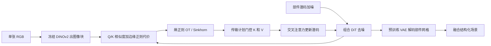

# SceneTransporter：单张图进组合 DiT，用熵正则最优传输把门控交叉注意力，把部件潜码收成开世界实例

<!-- release-date: 2026-02-26 -->

**本文依据**：`SceneTransporter: Optimal Transport-Guided Compositional Latent Diffusion for Single-Image Structured 3D Scene Generation`，Published as a conference paper at ICLR 2026（封面与全文页眉均印此句），arXiv:2602.22785v1 [cs.CV]（2026-02-26），20 页 letter。作者 Ling Wang^{1,2}*、Haoxiang Guo^{3}*、Xinzhou Wang^{2,4}* 共同一作；Fuchun Sun^{2}、Yikai Wang^{6} 通讯。其余作者 Kai Sun^{2}、Pengkun Liu^{2,5}、Hang Xiao^{2,5}、Zhong Wang^{1}、Guangyuan Fu^{1}、Eric Li^{3}、Yang Liu^{3}。^{1} Xi'an Research Institute of Hi-Tech，^{2} Tsinghua University，^{3} SkyWork AI，^{4} Tongji University，^{5} Fudan University，^{6} Beijing Normal University。项目页 `https://2019epwl.github.io/SceneTransporter/`。盘上 PDF 页眉写明 arXiv:2602.22785v1 [cs.CV] 26 Feb 2026。官方 abs：`https://arxiv.org/abs/2602.22785`，v1 提交日 **2026-02-26**。文中数字都标 PDF 页码。本文只读这一份 PDF。

## 一句话

单张图要变成**按实例拆开的 3D 场景网格**，难处不在「整场看起来像」，而在开世界里部件级生成器会把同一物体拆碎、把相邻物体糊在一起（PDF p. 1–2）。作者用去偏聚类探针看组合潜码：正确关联其实已经写在特征里，只是赋值机制没有结构约束，实例组织起不来（PDF p. 1、p. 4）。于是把结构化生成改写成**全局相关赋值**：在组合 DiT 的每一步去噪里解一个熵正则最优传输（entropic Optimal Transport，OT），传输计划门控交叉注意力，强制图像块对部件潜码的互斥一对一路由；传输的竞争性再把相似块聚成同一件，并用基于边缘的代价压住跨边界泄漏（PDF p. 1、p. 5–6）。评测写在 74 张开世界网图上：几何保真当时最高，部件交叠第二低；人评几何、布局、分割三项都最高（PDF p. 7–8）。代码与模型声明将在项目页公开（PDF p. 1）。

它解决的不是「再做一个更强的单物体 3D 生成器」，而是：**开世界实例一致性该不该继续指望部件先验自己长出来，还是该在去噪循环里用 OT 把门控写死。**

## 一、矛盾：整场壳不能用，分而治之怕遮挡，端到端部件模型出城就碎

作者把用途钉在沉浸技术和具身智能：要高质量、可扩展的 3D 场景。当时绝大多数场景生成器仍吐**一整块无结构网格**。下游要赋材质、做物理、检索摆放、细粒度编辑，需要显式的实例级物–境分离；融在一起的壳功能上等于废料（PDF p. 1）。

旧路两条都不稳（PDF p. 1–3）：

- **分而治之**。先 2D 分割，再给每块生 3D，最后拼场。模块化好，但严重依赖可见分割：遮挡物体扛不住，2D 上一点点错会放大成 3D 几何伪影；阶段误差会累积，全局一致性也保不住（PDF p. 1、p. 3）。MIDI 用多实例注意力补件间交互，仍绑在可见内容分割上，挡掉的部分重建不了（PDF p. 3）。
- **端到端组合生成**。靠带部件标注的大规模库（如 Objaverse），场景不再是一个不可分潜码，而是一组解耦 token，每组对应一个 3D 部件（PDF p. 1–2）。物体和室内场景还行，开世界几乎没人做。朴素接到大而杂的开世界，会出现两种 3D 病理（图 4，PDF p. 2）：**结构误分**（语义实例形不成互斥部件）、**几何冗余**（多个潜码抢同一块几何）。

探针给出的判断更狠：并上所有部件，整场外形往往还能看；坏的是**内部赋值**，不是「特征里没有实例信息」（PDF p. 4）。因此要显式结构约束，而不是等隐式学习自己长出组织（PDF p. 2、p. 4）。

三条贡献按原文（PDF p. 2）：

- 基于典型相关分析（Canonical Correlation Analysis，CCA）的去偏聚类探针，查部件级生成器的潜码结构；失败点在赋值机制缺结构约束。
- 把任务改写成 OT 引导的相关赋值；SceneTransporter 用熵正则 OT 施加两条约束：OT 计划门控交叉注意力做互斥一对一路由，边缘正则赋值代价做连贯成组。
- 开世界 3D 场景生成当时最好，实例级连贯和几何保真明显更好。

上图是机制示意，根据 PDF 图 3（p. 5）与第 3 节重画，不是实测时间轴。OT 只加在前半段 DiT 块上，后半段仍用标准交叉注意力修全局几何（PDF p. 7）。

## 二、相关工作：检索缺库，2D 蒸馏出整壳，注意力控制停在规则网格

**场景生成**。早期检索拼装受库覆盖和单视图对齐误差限制（PDF p. 2）。后来两条生成路：一是 2D 先验蒸馏，先出多视图、视频或全景，再用 NeRF 或 3DGS 重建；二是直接在原生 3D 潜空间做，多视图一致更好，但要大规模 3D 数据，野外泛化差。两条最后都收敛到同一限制：**输出仍是无结构的整块网格**（PDF p. 2–3）。

**结构化场景**。分而治之已见上文。端到端组合扩散把潜码子集绑到语义部件，物体级强，开世界缺场景级部件标注，于是出现误分和冗余。作者自称这是**第一次直接改预训练生成器的组合交叉注意力**来纠正这两种失败（PDF p. 3）。

**扩散里的注意力控制**。2D 图和视频里，采样时改自注意力、交叉注意力已经能控布局、纹理、多提示对齐、时序和编辑。3D 潜扩散几乎没用过：vecset 一类把形状编成无序向量集，没有规则空间网格和规范位置索引，注意力操纵难得多（PDF p. 3）。

## 三、预备：组合生成器是 VAE 加 DiT，条件来自一张图的 DINOv2

典型组合 3D 生成器两块：Transformer VAE（如 3DShape2VecSet）把网格编成潜向量、再解成几何场（如 SDF）；去噪网络在潜空间把噪声洗成干净潜码（PDF p. 3）。

去噪步 $t$，模型维持 $N$ 个部件专用 token 块 $\{z_i^{(t)}\}_{i=1}^N$，每块 $z_i^{(t)}\in\mathbb{R}^{K\times D}$。给部件 $i$ 加可学习身份嵌入 $e_i$，再拼成整段 $Z^{(t)}\in\mathbb{R}^{(NK)\times D}$（PDF p. 3–4 式 1）。条件是单张 RGB $x$，冻结 DINOv2 $\phi(x)=I\in\mathbb{R}^{L\times D_{\mathrm{img}}}$。线性投影出 $Q,K,V$，多头 softmax 交叉注意力把图像证据融进潜码，再走 DiT 块和去噪日程。推理时把干净序列拆回各 $z_i$，预训练 VAE 解成部件网格，再融整场（PDF p. 4 式 2–3）。

人话：每个部件有一摞 token，都在看同一张图的图像块。没有全局配额时，几摞 token 可以同时盯同一块屋顶，也可以把一棵树拆给好几摞。

## 四、去偏聚类探针：特征里有实例，赋值机制没有

部件级生成器带的归纳偏置是**同一物体内部件相关**（椅腿和椅背同风格）；场景合成要的是**实例级组织**，不同实体大体条件独立（PDF p. 4）。拿前者做后者，就出现图 4 的误分和冗余。有趣的是：部件并集常常仍能重建整场。于是问：能不能从这些部件潜码里把实例组织捞回来？（PDF p. 4）

探针三步（PDF p. 4，细节附录 B，p. 14）：

1. 对部件潜码集做 CCA，找出共享子空间。
2. 投影到正交补，压掉共享扰动量（地面、全局风格），留下物体特异变化。
3. 对残差 token 再聚类，得到语义更干净的组。

图 2 在 PartPacker 的组合潜空间上对比：直接聚类原始部件 token，稳定实例组起不来；聚类 CCA 去偏后的残差就能起来。对照还有一条：把 PartPacker 融完的几何再送回 VAE 编码再聚类（PDF p. 4）。作者读法：学到的特征**隐式含有**正确关联所需信息，模型却没有把关联**显式立住**，分组弱、碎、和场景上下文缠在一起（PDF p. 4）。

附录 B 写双体积设定：Tang 等（2025）给出 $Z_A,Z_B\in\mathbb{R}^{K\times D}$，堆叠后轻度白化，再 CCA。保留典型相关 $\rho_j$ 超过阈值 $\tau$ 的方向当共享子空间，去掉投影后用 $C=2$ 的高斯混合聚类；最大后验低于 $\delta$ 的 token 再派到高置信质心。分组后用冻结 VAE 解码看物体级组织（PDF p. 14 式 13–16）。$\tau$、$\delta$ 的具体数字本 PDF 没写。

可迁移的不是「先 CCA 再聚类当生成器」，而是：**生成失败时先探针内部赋值，再决定要不要加硬约束。**

## 五、熵正则 OT：配额加互斥，把路由写成一次全局优化

探针要的显式约束，作者写成每步去噪上的全局最优相关赋值。OT 正好给两条：一对一赋值保证互斥，避免特征缠在一起把物体糊掉；每个部件潜码要满足覆盖预算，鼓励聚成大块连贯区域，减轻语义碎片（PDF p. 5）。

传输计划 $A_t\in\mathbb{R}^{N\times L}$ 把 $L$ 个图像块的质量分给 $N$ 个 3D 部件的潜码（PDF p. 5 式 4）：

$$
A_t=\arg\min_{A\ge 0}\langle C_t,A\rangle+\varepsilon_t H(A)\quad\mathrm{s.t.}\quad A\mathbf{1}=\mu,\; A^\top\mathbf{1}=\nu.
$$

$C_t$ 是块与部件的不相容代价，定义在式 12。$\mu\in\Delta^N$ 是各部件预算，防止某部件饿死；$\nu=\frac{1}{L}\mathbf{1}_L$，每块贡献总质量的 $1/L$。$H(A)$ 是传输计划熵，$\varepsilon_t$ 平滑解（PDF p. 5）。附录 D.2 在双卷设定下把同一问题写成 $C\in\mathbb{R}^{2\times M}$（PDF p. 16 式 17）。

没有 OT 时，交叉注意力是局部 softmax：每个 query 自己挑 key，不管别的部件是不是已经把这块用完。OT 把「谁用哪块」提成带容量约束的一次规划。

## 六、OT 计划门控交叉注意力：计划管配额，softmax 仍管聚焦

有了 $A_t$，不替换注意力，而是**乘性门控**进来的视觉信息：计划调节每块能给每个 3D 部件多少证据，标准 softmax 仍决定每个 token 在**还允许的块**里看谁（PDF p. 5–6）。

先把 $A_t$ 按行归一成每部件的块权重 $\omega_i\in\Delta^L$，再过有界、保恒等的门（PDF p. 6 式 5）：

$$
\psi_{\lambda_t,\varepsilon_g}(w)=\varepsilon_g+(1-\varepsilon_g)w^{\lambda_t},\quad w\in[0,1],\;\lambda_t\ge 0,\;\varepsilon_g\in[0,1).
$$

$\lambda_t$ 越大，低权块的门关得越快；地板 $\varepsilon_g$ 避免某块完全饿死。$\lambda_t=0$ 时门恒为 1，机制退回标准交叉注意力（PDF p. 6）。对每个头，按 $\omega_i(j)$ 逐行缩放该部件看到的 $K_h$ 和 $V_h$（PDF p. 6 式 6）。部件 $i$ 的 query 只打这份门控记忆。$K$ 和 $V$ 一起门，被 OT 压掉的路由既贡献不了大 logit，也贡献不了大特征值，泄漏低、容量一致。再按标准多头注意力算，各部件表示拼回（PDF p. 6 式 7–8）。

图 6：门控后注意力图能把地面和房子分开，硬亲和（argmax）区域几乎不叠，解码网格边界利；标准交叉注意力图糊，几何也糊（PDF p. 8–9）。图 7：硬 OT 计划随去噪变利。作者写 $t$ 增大后计划很快稳住，大约 $t\approx 540/600$ 之后全局划分几乎不变；晚期整栋楼、家具、树已经进同一体积，只做局部微调。粗语义路由早定、后步不翻盘（PDF p. 9）。

可迁移：控制信号当**门**而不是替换注意力；并保留 $\lambda=0$ 退回原路径，消融和接入才干净。

## 七、边缘正则代价：接触带上不要让相邻物体共用一块

杂乱场景里，接触边界附近的块特征对多个部件都「像」，传输容易跨物泄漏。作者加一个弱但空间准的先验：从条件图取边缘图 $E\in[0,1]^{H\times W}$（Canny / Sobel 或学习检测器），鼓励区内亲和一致、禁止跨边扩散（PDF p. 6）。

部件原型 $\bar q_i^{(t)}$ 与块 key $k_j$ 先算余弦 $S_{i,j}$（PDF p. 6 式 9）。边缘下采样到块网格，建 4 邻域。邻块耦合（PDF p. 6 式 10）

$$
w_{j\ell}=\exp\bigl(-\gamma_{\mathrm{edge}}\max\{E_\downarrow(j),E_\downarrow(\ell)\}\bigr)
$$

在平滑区接近 1，近边缘衰减。再做一步边缘感知平滑（PDF p. 6 式 11），低边缘区内证据能传、跨边被掐。然后按块做对比归一，得到 $\tilde S_{i,j}$。OT 代价是带边距的不相似度（PDF p. 6 式 12）

$$
C_t(i,j)=\frac12\bigl(1-\tilde S_{i,j}\bigr).
$$

$\lambda_{\mathrm{edge}}=0$ 或边缘全零时，退回带对比归一的余弦代价。$\lambda_{\mathrm{edge}}>0$ **不需要语义 mask**：强边缘两侧互相支撑弱，OT 更倾向把它们派给不同部件。超参可随去噪退火：早期分得干净，后期放细节（PDF p. 7）。正文没有给出逐步退火表，实验默认值在附录表 3（PDF p. 15）。

图 5：沙发和墙角边几、木柱和围栏，加边缘正则后切开，少混部件；仍然没有实例 mask 监督（PDF p. 8–9）。

## 八、实现：架在 PartPacker 的整流 DiT 上，OT 只开前一半块

基线：PartCrafter、PartPacker、MIDI，均用官方代码和检查点（PDF p. 7）。

SceneTransporter 建在 Tang 等（2025）开源部件级生成器上：整流流（rectified-flow）DiT，**24** 个注意力块，双体积打包支持任意部件数。本文实例化双体积，组合潜码尺寸 $4096\times 2=8192$，通道宽 **64**。OT 用稳定对数域 Sinkhorn，**40** 次迭代。OT 计划门控注意力开在**前一半** DiT 块，其余块标准交叉注意力修全局几何。其余推理设定跟随 Tang 等（PDF p. 7）。

附录表 3 默认超参（PDF p. 15）：$\varepsilon_t=0.10$，$\lambda_{\mathrm{edge}}=0.8$，$\gamma_{\mathrm{edge}}=8.0$，$\lambda_t=2.5$，$\varepsilon_g=0.02$，$K_{\mathrm{OT}}=40$。

指标：几何保真用 ULIP、ULIP-2、Uni3D；ULIP-2 与 Uni3D 要彩色点云，作者给所有网格着**均匀白**再算。部件解耦：规范空间体素化成 $64^3$，各部件占用二值化，算成对 IoU，报最大 IoU 以及最大的前 20 个 IoU 的均值，越低越好（PDF p. 7）。

训练数据配方、学习率、GPU 天数、是否微调 DiT 权重，本 PDF **没有写**。能确定的是：推理时改交叉注意力路由；附录说当前设定下各方法（含基线）都在合成渲染场景上训，以便有一致的部件级标注（PDF p. 15）。代码声明将公开，盘上这篇没有仓库 URL，只有项目页（PDF p. 1）。

## 九、主实验：74 张开世界网图，几何最高，交叠第二，人评三项第一

评测集：网上收集的 **74** 张高质量开世界场景图，风格多样（PDF p. 7）。表 1（PDF p. 7）：

| 方法 | 推理要实例 mask | ULIP↑ | ULIP-2↑ | Uni3D↑ | IoUmax↓ | IoUmean↓ | 推理时间 (s) |
|---|---|---:|---:|---:|---:|---:|---:|
| MIDI | 要 | 0.1397 | 0.2763 | 0.2518 | 0.0458 | 0.1642 | 149.68 |
| PartCrafter | 不要 | 0.1177 | 0.3096 | 0.2635 | 0.0042 | 0.0539 | 157.97 |
| PartPacker | 不要 | 0.1417 | 0.3083 | 0.2887 | 0.0319 | 0.2142 | 47.41 |
| Ours | 不要 | 0.1466 | 0.3220 | 0.3021 | 0.0101 | 0.0926 | 54.99 |

作者读法：几何三项最高，交叠第二低。IoU 最低的是 PartCrafter，因为它生成时丢掉背景/地面，交叠当然小，场景完整度也差。本文比 PartPacker 稍慢（54.99 s 对 47.41 s），几何和解耦明显更好，并远快于 MIDI 与 PartCrafter（PDF p. 7）。表注写粗体最优、下划线次优（PDF p. 7）。

图 4 定性：本文出完整房子、沙发、树、灯；PartPacker 屋顶或树冠拆碎，地面特征漏进邻楼；MIDI 主要在室内资产上训，推理还要实例 mask，简单室内还行，室外布局歪、实例分不开；PartPacker 不要 mask，物体和周围分得开时还行，复杂空间布局就掉（PDF p. 7–8）。

用户研究：**30** 人，强制排序 1 到 4（最高 4 分）。三项：几何质量、布局连贯、分割合理性。表 2（PDF p. 8）：

| 方法 | Geometry↑ | Layout↑ | Segmentation↑ |
|---|---:|---:|---:|
| MIDI | 2.61 | 1.82 | 2.29 |
| PartCrafter | 2.44 | 1.63 | 2.17 |
| PartPacker | 2.81 | 2.95 | 1.97 |
| Ours | 3.09 | 3.34 | 3.22 |

附录 C.2：四法导出 `.glb`，同一光照着色的网页 3D 查看器并排，标签 A–D 随机置换；被试可旋转缩放。被试是未参与本项目的计算机视觉/图形学研究生和研究人员。每张参考图对四个场景按上述三问排序，再对图和人平均，即表 2（PDF p. 15）。

## 十、消融：门控管泄漏，边缘管接触带，一半块是性价比

表 4（PDF p. 19）。表中默认行用星号标出，下文不把星号抄进单元格。无 OT 门控那一行的几何/IoU/时间与表 1 的 PartPacker 相同，作者当基线（PDF p. 17–19）。

| 设定 | ULIP↑ | ULIP-2↑ | Uni3D↑ | IoUmax↓ | IoUmean↓ | 时间 (s) | 显存 (M) |
|---|---:|---:|---:|---:|---:|---:|---:|
| 无 OT 计划门控交叉注意力 | 0.1417 | 0.3083 | 0.2887 | 0.0319 | 0.2142 | 47.41 | 9030 |
| 无边缘正则赋值代价 | 0.1452 | 0.3164 | 0.2916 | 0.0241 | 0.1136 | 54.61 | 9068 |
| 完整模型 | 0.1466 | 0.3220 | 0.3021 | 0.0101 | 0.0926 | 54.99 | 9070 |
| $\varepsilon_t=0.08$ | 0.1460 | 0.3184 | 0.3003 | 0.0117 | 0.0914 | 55.30 | 9070 |
| $\varepsilon_t=0.10$（默认） | 0.1466 | 0.3220 | 0.3021 | 0.0101 | 0.0926 | 54.99 | 9070 |
| $\varepsilon_t=0.12$ | 0.1437 | 0.3185 | 0.2970 | 0.1239 | 0.1119 | 55.12 | 9070 |
| $\varepsilon_t=0.14$ | 0.1424 | 0.3178 | 0.2937 | 0.0159 | 0.0936 | 55.02 | 9070 |
| $\gamma_{\mathrm{edge}}=6.0$ | 0.1488 | 0.3239 | 0.3014 | 0.0243 | 0.0936 | 56.17 | 9070 |
| $\gamma_{\mathrm{edge}}=8.0$（默认） | 0.1466 | 0.3220 | 0.3021 | 0.0101 | 0.0926 | 54.99 | 9070 |
| $\gamma_{\mathrm{edge}}=10.0$ | 0.1457 | 0.3182 | 0.3029 | 0.0570 | 0.1113 | 55.17 | 9070 |
| $\gamma_{\mathrm{edge}}=12.0$ | 0.1426 | 0.3156 | 0.3003 | 0.1149 | 0.0994 | 55.89 | 9070 |
| $\lambda_{\mathrm{edge}}=0.6$ | 0.1456 | 0.3236 | 0.3003 | 0.0609 | 0.1128 | 53.59 | 9070 |
| $\lambda_{\mathrm{edge}}=0.8$（默认） | 0.1466 | 0.3220 | 0.3021 | 0.0101 | 0.0926 | 53.97 | 9070 |
| $\lambda_{\mathrm{edge}}=1.0$ | 0.1439 | 0.3204 | 0.3017 | 0.1482 | 0.0952 | 55.17 | 9070 |
| OT 开 1/3 DiT 块 | 0.1465 | 0.3170 | 0.3004 | 0.0992 | 0.1061 | 51.89 | 9070 |
| OT 开 1/2 DiT 块（默认） | 0.1466 | 0.3220 | 0.3021 | 0.0101 | 0.0926 | 54.99 | 9070 |
| OT 开全部 DiT 块 | 0.1426 | 0.3262 | 0.3022 | 0.0207 | 0.0830 | 65.24 | 9070 |

作者读法（PDF p. 17–18）：

- 去掉门控，几何掉、IoU 明显差，支持一对一容量约束路由能减泄漏和冗余几何。
- 只留门控、去掉边缘，比基线好，但 IoU 仍不如完整模型。完整模型各项最好。OT 把时间从 47.4 s 提到 55.0 s，显存几乎不动（9030 M 到 9070 M）。
- $\varepsilon_t=0.10$ 是稀疏与平滑的折中；过低过高几何和解耦都差。$\varepsilon_t=0.12$ 的 IoUmax 跳到 0.1239，按表照抄。
- $\gamma_{\mathrm{edge}}=6.0$ ULIP 最高（0.1488），但 IoUmax 升到 0.0243，边界泄漏；$\ge 10$ 过约束，各项伤。默认 8.0。
- $\lambda_{\mathrm{edge}}$ 太低（0.6）或太高（1.0）分割都差，IoUmax 陡升；默认 0.8。注意默认行在表 4(d.2) 时间是 53.97 s，与 (a.3)/(e.2) 的 54.99 s 不完全相同，以各行数字为准。
- 只开 1/3 块，几何略好、分离不够；开一半两项都明显抬，时间可接受；开全部 ULIP-2 略升（0.3262），部件指标回报递减甚至略伤（IoUmax 0.0207），延迟到 65.24 s。作者选一半块。

附录 D.2：对三个 OT 门控层记录对偶变量 $\ell_2$ 更新、传输计划 Frobenius 更新、行/列边际违反。40 次迭代设定下，对偶和计划残差在 **3–5** 次 Sinkhorn 内掉 **3–5** 个数量级后变平，边际违反很快很小且不振荡。作者据此说子问题条件好，默认 40 次够（PDF p. 16–17，图 9）。

## 十一、真实图、失败模式、LLM 写作声明

合成训练接到自然照片会掉，外观域差。作者跟 PartCrafter 的策略：测试时用图像编辑模型（文中写 GPT-5）做风格迁移，提示大意是保留全部细节、转成类 Objaverse 的 3D 渲染风。布局和物体身份保留，统计量靠近合成训练。图 8：室内外真实场景在这种纯测试预处理下分离更好、部件边界更贴图、布局更准（PDF p. 15–16）。这是测试技巧，不是训练时见过 DL3DV-10K。

失败三类（PDF p. 19–20）：

- **又密又小的重复实例**（挤在一起的船、树）共享的图像块很少，OT 会把容量分给最强响应，弱实例并进邻居，小数目可能少计；全局布局（楼、路、码头）仍对。补一条很小的残差标准交叉注意力：OT 当低频结构先验，残差捞高频细节。图 10 对比基线、纯 OT、OT+残差，残差能捞回小船并保住更干净的全局划分（PDF p. 19）。
- **几何伪影**：去噪日程太短或 token 太少时，偶发不光滑表面或漂浮件；加步数或 token 预算能缓，通常局部、不毁整场布局（PDF p. 19）。
- **分布外外观**：强 OOD 真实图（怪光、怪纹理）几何和分组会差；D.1 的渲染风迁移能明显改善，许多难真实输入仍能出说得通的结构化场景（PDF p. 20）。

附录 A：LLM 只用于改语法、清晰度、学术语气和句子重组；内容由人类作者主导，并承担全部主张责任（PDF p. 14）。致谢经费号 2025ZD1206301、NSFC 62576043、北京市自然科学基金 L233006（PDF p. 10）。

## 十二、限制与未公开

本 PDF 没有写：训练数据规模与配比、优化器与学习率、是否冻结骨干只改推理、边缘检测器具体用 Canny 还是学习器、CCA 阈值 $\tau$ 与聚类置信 $\delta$、74 张网图的公开列表、人评的统计显著性。项目页承诺代码与模型，正文没有 GitHub 地址（PDF p. 1）。定量主表是 74 张自收集网图，不是 ScanNet 一类有真值网格的重建基准；几何是 ULIP/Uni3D 这类跨模态分，解耦是自比 IoU，没有 Chamfer 对真值。PartCrafter 的 IoU 更低被作者归因于丢地面，完整度没有单独的 completeness 数字。

## 十三、可迁移启发

- **先探针再加约束。** 并集外形对、零件组织不对，优先查赋值而不是加更大的解码器。
- **互斥用全局计划，聚焦仍用局部 softmax。** 容量约束不要靠每个头自己抢。
- **门控 $K$ 和 $V$，并保留关闭门等于原模型。** 泄漏路径要同时掐 logit 和特征。
- **接触带用边缘，不要一上来要实例 mask。** 开世界分割本身就是脆点。
- **结构模块不必插满每一层。** 这里一半块够，全插又贵又可能伤部件指标。
- **合成训、真实测时，测试侧风格迁移是域差补丁，不是证明已在照片上训过。**
- **又密又小的重复件是硬 OT 的盲区**，低频计划加一点残差注意力，比把 $\varepsilon$ 调到糊更对症。

## 关键词回看

组合潜扩散、去偏聚类探针、CCA 共享子空间、结构误分、几何冗余、熵正则最优传输、Sinkhorn、OT 计划门控交叉注意力、一对一路由、边缘正则赋值代价、双体积打包、开世界实例连贯。

## 参考资料

- 原件：`readings/_src/图像、视频与 3D 生成/SceneTransporter.pdf`
- arXiv：`https://arxiv.org/abs/2602.22785`
- 项目页：`https://2019epwl.github.io/SceneTransporter/`
