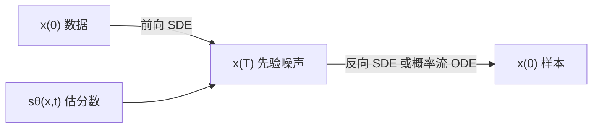

# Score-SDE：把加噪链写成连续 SDE，反向过程只依赖分数

<!-- release-date: 2020-11-26 -->

**本文依据**：`Score-Based Generative Modeling through Stochastic Differential Equations`，arXiv 2011.13456v2（2021-02-10），36 页 letter。作者 Yang Song（Stanford；脚注写明工作部分完成于 Google Brain 实习）、Jascha Sohl-Dickstein、Diederik P. Kingma、Abhishek Kumar（Google Brain）、Stefano Ermon（Stanford）、Ben Poole（Google Brain）。盘上 PDF 页眉写明 arXiv:2011.13456v2 [cs.LG] 10 Feb 2021。第 1 页印有 **Published as a conference paper at ICLR 2021**。官方 arXiv：https://arxiv.org/abs/2011.13456。首发日取原件首次公开日，即 arXiv v1 提交日 2020-11-26，不回写成 v2 日期。文中所有数字都标了 PDF 页码；标「外部补充」的段落不来自本文。

## 一句话

造噪声容易，从噪声造数据才叫生成建模。这篇论文把「往数据里慢慢加噪声」写成一条没有可学参数的前向随机微分方程（stochastic differential equation，SDE），再证明：把时间倒过来走的反向 SDE **只依赖**各时刻扰动分布的分数（score，即对数密度对数据的梯度）。分数用神经网络估出来，再扔给数值求解器，就能从先验噪声走回数据。同一套写法把当时的 SMLD 与 DDPM 收成两条不同 SDE 的离散化，并多出三类能力：预测–校正采样、与 SDE 同边缘的概率流常微分方程（可算精确似然）、以及用无条件分数去解一类反问题（类条件、补全、上色）。配合架构改动，无条件 CIFAR-10 做到 Inception Score 9.89、FID 2.20、均匀去量化下 2.99 bits/dim，并第一次从分数模型给出 1024×1024 高保真样本（PDF p. 1）。

它解决的不是「再发明一种扩散」，而是 2019–2020 年两套成功路线共用「多尺度加噪再反转」却各写各的离散链：**噪声档数有限、采样器绑死、似然只能变分上界、条件生成往往要重训**。把档数推到连续时间之后，分数变成一条贯穿训练、采样、似然和反问题的公共接口。

## 一、矛盾：两套好用的加噪模型，却没有同一条连续时间轴

2020 年前后，两类概率生成模型都走「慢慢搅坏数据、再学着搅回来」（PDF p. 1）。

**去噪分数匹配加朗之万动力学**（score matching with Langevin dynamics，SMLD；Song & Ermon, 2019）在每一档噪声上估分数，采样时从大噪声到小噪声依次跑朗之万动力学。**去噪扩散概率模型**（denoising diffusion probabilistic models，DDPM；Sohl-Dickstein et al., 2015；Ho et al., 2020）为每一步加噪学一条反向高斯，靠已知的反向函数形式把训练做可算。连续状态空间里，DDPM 的训练目标其实也在隐式算各档分数。作者因此把这两类合称 **基于分数的生成模型**（score-based generative models）（PDF p. 1）。

它们已经能画图、音频、图和形状（PDF p. 1–2）。但离散档数带来几处硬伤，正文后文会逐条拆：

1. 采样必须跟着当初那套离散规则走，换 SDE 就要手推祖先采样。
2. 有限档之间没法自然插值；想加步数只能临时插噪声尺度。
3. DDPM 报告的是 ELBO，不是精确似然。
4. 条件生成、补全、上色往往要另训模型。

作者的统一做法是：不要只用有限个噪声分布，而让扰动分布按一条扩散过程随连续时间演化。前向 SDE **不依赖数据、没有可训参数**；反向过程由 Anderson（1982）给出，只要各时刻边缘密度的分数已知。用时变网络估分数，再用数值 SDE 求解器出样本。图 1 把这件事画成：前向 SDE 数据→噪声，反向 SDE 噪声→数据，中间只插一个分数场 $\nabla_x\log p_t(x)$（PDF p. 2）。

贡献被收成三条（PDF p. 2）：

- **灵活采样与似然**：通用 SDE 求解器都能积反向 SDE。另有两类一般 SDE 用不上的特化方法：预测–校正（predictor-corrector，PC）采样器（数值求解器 + 基于分数的 MCMC，如朗之万或 HMC）；以及基于概率流常微分方程（probability flow ODE）的确定性采样。后者接上神经 ODE，可自适应步长、操作隐码、得到可唯一识别的编码，以及精确似然。
- **可控生成**：训练时没有的条件，生成时仍可往反向 SDE 里加。一个无条件分数模型就能做类条件、补全、上色等反问题，不必重训。
- **统一框架**：SMLD 与 DDPM 分别是两条 SDE 的离散化。当时文献里 DDPM 样本质量高于 SMLD；作者说换更好架构和新采样器之后，SMLD 一侧能追上——CIFAR-10 新的 Inception 9.89、FID 2.20，以及第一次从分数模型出 1024×1024。另提出一条新 SDE，在均匀去量化 CIFAR-10 上做到 2.99 bits/dim（PDF p. 2）。

读的时候不要把后作滤镜套上来。正文没有 DDIM 这个名字，也没有把「少步确定性短链」写成独立贡献；确定性路径是概率流 ODE。SMLD/NCSN 与 DDPM 只作为被封装的前作出现。

把流水线画成人能跟住的图（机制示意，根据 PDF p. 3 图 2 重画，不是实测时间轴）：

训练估 $s_\theta(x,t)\approx\nabla_x\log p_t(x)$。采样可以走随机反向 SDE，也可以走同边缘的确定性 ODE。似然只走 ODE。条件生成是在分数上再加一项 $\nabla_x\log p_t(y\mid x)$。

## 二、背景：两套离散目标其实都在匹配分数

### SMLD：多档高斯扰动 + 去噪分数匹配 + 退火朗之万

扰动核 $p_\sigma(\tilde x\mid x)=\mathcal{N}(\tilde x;x,\sigma^2 I)$，边缘 $p_\sigma(\tilde x)$ 是数据经该核搅过的分布。取一串 $\sigma_{\min}=\sigma_1<\cdots<\sigma_N=\sigma_{\max}$，通常 $\sigma_{\min}$ 小到 $p_{\sigma_{\min}}\approx p_{\mathrm{data}}$，$\sigma_{\max}$ 大到 $p_{\sigma_{\max}}\approx\mathcal{N}(0,\sigma_{\max}^2 I)$（PDF p. 2）。噪声条件分数网络（noise conditional score network，NCSN）$s_\theta(x,\sigma)$ 用加权去噪分数匹配（PDF p. 3 式 1）：

$$
\theta^*=\arg\min_\theta\sum_{i=1}^{N}\sigma_i^2\,\mathbb{E}_{p_{\mathrm{data}}(x)}\mathbb{E}_{p_{\sigma_i}(\tilde x\mid x)}\bigl\|s_\theta(\tilde x,\sigma_i)-\nabla_{\tilde x}\log p_{\sigma_i}(\tilde x\mid x)\bigr\|_2^2.
$$

数据与容量足够时，最优模型在各 $\sigma_i$ 上几乎处处匹配 $\nabla_x\log p_\sigma(x)$。采样对每一档跑 $M$ 步朗之万（PDF p. 3 式 2），从 $i=N$ 走到 $i=1$。$M\to\infty$、步长 $\to 0$ 时，在正则条件下得到 $p_{\sigma_{\min}}\approx p_{\mathrm{data}}$ 的精确样本。

### DDPM：前向马尔可夫链 + 重加权 ELBO，最优解仍是分数

取 $0<\beta_1,\ldots,\beta_N<1$，前向 $p(x_i\mid x_{i-1})=\mathcal{N}(x_i;\sqrt{1-\beta_i}\,x_{i-1},\beta_i I)$，从而 $p_{\alpha_i}(x_i\mid x_0)=\mathcal{N}(x_i;\sqrt{\alpha_i}\,x_0,(1-\alpha_i)I)$，其中 $\alpha_i:=\prod_{j=1}^{i}(1-\beta_j)$。日程使 $x_N$ 近似 $\mathcal{N}(0,I)$。反向高斯均值写成含 $s_\theta(x_i,i)$ 的形式，目标是重加权 ELBO，也就是 Ho 等人的 $L_{\mathrm{simple}}$，写成与式 1 对照的去噪分数匹配和（PDF p. 3 式 3）。采样从 $x_N\sim\mathcal{N}(0,I)$ 按祖先采样（ancestral sampling）往回走（PDF p. 3 式 4）。最优 $s_{\theta^*}(\tilde x,i)$ 匹配 $\nabla_x\log p_{\alpha_i}(x)$。两式第 $i$ 项的权重 $\sigma_i^2$ 与 $1-\alpha_i$，都与对应扰动核分数的期望平方范数成反比（PDF p. 3）。

**旧问题到这里钉死了：两边都在多尺度上匹配分数，差别主要是噪声日程和采样器，而不是「一个是分数、一个不是」**。

## 三、把有限档推成一条 Itô SDE

目标是构造连续时间过程 $\{x(t)\}_{t=0}^{T}$：$x(0)\sim p_0$（有 i.i.d. 数据），$x(T)\sim p_T$（容易抽的先验）。它是 Itô SDE 的解（PDF p. 3 式 5）：

$$
\mathrm{d}x=f(x,t)\,\mathrm{d}t+g(t)\,\mathrm{d}w.
$$

$w$ 是标准维纳过程；$f(\cdot,t)$ 是漂移，$g(\cdot)$ 是扩散系数。正文为了好讲，先假定 $g$ 是标量且不依赖 $x$；附录 A 推广到依赖状态的矩阵扩散（PDF p. 4、p. 13）。系数对状态与时间全局 Lipschitz 时，强解唯一（Øksendal, 2003）。$p_t(x)$ 记 $x(t)$ 的密度，$p_{st}(x(t)\mid x(s))$ 记转移核。

$p_T$ 通常是无结构高斯。如何设计式 5 使数据扩散到固定先验，3.4 节用 SMLD/DDPM 的连续化给出例子。

### 反向 SDE：漂移里只多一项分数

从 $x(T)\sim p_T$ 倒着走，应得到 $x(0)\sim p_0$。Anderson（1982）给出反向扩散（PDF p. 4 式 6）：

$$
\mathrm{d}x=\bigl[f(x,t)-g(t)^2\nabla_x\log p_t(x)\bigr]\,\mathrm{d}t+g(t)\,\mathrm{d}\bar w.
$$

$\bar w$ 是时间从 $T$ 流向 $0$ 时的维纳过程，$\mathrm{d}t$ 是无穷小负时间步。**各时刻分数一旦已知，反向过程就完全确定**，可以用数值方法模拟以从 $p_0$ 采样。

这是全文的因果枢纽：前向随便设计（只要能把数据搅成已知先验）；生成模型的可学部分全部压进分数网络。

### 连续去噪分数匹配

时变模型 $s_\theta(x,t)$ 用式 1、式 3 的连续化训练（PDF p. 4 式 7）：

$$
\theta^*=\arg\min_\theta\mathbb{E}_t\lambda(t)\,\mathbb{E}_{x(0)}\mathbb{E}_{x(t)\mid x(0)}\bigl\|s_\theta\bigl(x(t),t\bigr)-\nabla_{x(t)}\log p_{0t}\bigl(x(t)\mid x(0)\bigr)\bigr\|_2^2.
$$

$\lambda:[0,T]\to\mathbb{R}_{>0}$ 是正权重，$t$ 在 $[0,T]$ 上均匀抽。数据与容量足够时，$s_{\theta^*}$ 对几乎所有 $x,t$ 等于 $\nabla_x\log p_t(x)$。权重常取与 $\mathbb{E}\|\nabla\log p_{0t}(\cdot\mid x(0))\|_2^2$ 成反比，和 SMLD/DDPM 同一思路。去噪分数匹配可换成切片分数匹配或有限差分分数匹配（PDF p. 4–5）。

式 7 通常需要转移核 $p_{0t}(x(t)\mid x(0))$。$f(\cdot,t)$ 仿射时核是高斯，均值方差常有闭式（Särkkä & Solin, 2019, §5.5）。更一般的 SDE 可解 Kolmogorov 正向方程，或模拟 SDE 抽样再用切片分数匹配，从而避开 $\nabla\log p_{0t}$（PDF p. 5；附录 A 式 19）。

### 三个例子：VE、VP、sub-VP

SMLD 的 $N$ 档扰动对应马尔可夫链 $x_i=x_{i-1}+\sqrt{\sigma_i^2-\sigma_{i-1}^2}\,z_{i-1}$（$\sigma_0=0$）。$N\to\infty$ 时成为（PDF p. 5 式 9）

$$
\mathrm{d}x=\sqrt{\frac{\mathrm{d}[\sigma^2(t)]}{\mathrm{d}t}}\,\mathrm{d}w.
$$

DDPM 链 $x_i=\sqrt{1-\beta_i}\,x_{i-1}+\sqrt{\beta_i}\,z_{i-1}$ 的极限是（PDF p. 5 式 11）

$$
\mathrm{d}x=-\frac12\beta(t)x\,\mathrm{d}t+\sqrt{\beta(t)}\,\mathrm{d}w.
$$

式 9 在 $t\to\infty$ 时方差爆炸，式 11 在初值单位方差时保持方差为 1（证明在附录 B）。因此称式 9 为 **方差爆炸 SDE**（variance exploding，VE），式 11 为 **方差保持 SDE**（variance preserving，VP）（PDF p. 5）。

受 VP 启发，作者另写一条在似然上特别好的 SDE（PDF p. 5 式 12）：

$$
\mathrm{d}x=-\frac12\beta(t)x\,\mathrm{d}t+\sqrt{\beta(t)\bigl(1-e^{-2\int_0^t\beta(s)\,\mathrm{d}s}\bigr)}\,\mathrm{d}w.
$$

同一 $\beta(t)$、同一初值时，它在每一中间时刻的方差都不超过 VP（附录 B）。故称 **sub-VP SDE**。三条都是仿射漂移，扰动核高斯且闭式可算，式 7 训练便宜（PDF p. 5）。

附录 B 给出核（PDF p. 15 式 29）：VE 为 $\mathcal{N}(x(0),[\sigma^2(t)-\sigma^2(0)]I)$；VP 均值为 $x(0)e^{-\frac12\int\beta}$，方差 $I-Ie^{-\int\beta}$；sub-VP 均值同 VP，方差是 $[1-e^{-\int\beta}]^2 I$。

### 实践里的日程（附录 C）

SMLD 常用几何序列，$\sigma_{\min}=0.01$，$\sigma_{\max}$ 按 Song & Ermon（2020）的 Technique 1；图像归一化到 $[0,1]$。连续极限 $\sigma(t)=\sigma_{\min}(\sigma_{\max}/\sigma_{\min})^t$，对应式 30。$\sigma(0)=0$ 与 $\sigma(0^+)=\sigma_{\min}$ 不可微，VE 实际在 $t\in[\epsilon,1]$ 上求解，$\epsilon=10^{-5}$（PDF p. 15）。

DDPM 的 $\beta_i$ 是算术序列，极限 $\beta(t)=\bar\beta_{\min}+t(\bar\beta_{\max}-\bar\beta_{\min})$。实验取 $\bar\beta_{\min}=0.1$、$\bar\beta_{\max}=20$ 以对齐 Ho et al.（2020）。$t\to 0$ 方差消失导致数值不稳，同样限制在 $[\epsilon,1]$：采样 $\epsilon=10^{-3}$（使 $\mathrm{Var}(x(\epsilon))$ 对齐离散 $x_1$），训练与似然 $\epsilon=10^{-5}$（PDF p. 16）。图 5 显示 $N=1000$ 时离散核与连续核几乎重合。sub-VP 用同一 $\beta(t)$。经验上更小的 $\epsilon$ 利于似然；采样则要为 IS/FID 选合适 $\epsilon$，人眼观感往往差不多（PDF p. 16）。

**可迁移启发**：先选「方差爆不爆炸」，再写闭式核，最后才谈网络。VE 更像「加性噪声越加越大」，VP/sub-VP 更像「一边缩小信号一边补噪声」。似然与 FID 不必同一条 SDE 最优，后文实验会钉死这一点。

## 四、求解反向 SDE：通用求解器、预测–校正、概率流

训好 $s_\theta$ 之后，反向 SDE 交给数值方法。

### 通用求解器与反向扩散采样器

Euler–Maruyama、随机 Runge–Kutta 等任意通用求解器都可积反向 SDE（PDF p. 6）。DDPM 的祖先采样其实是反向 VP SDE 的一种特殊离散（附录 E）。为新 SDE 手推祖先规则并不轻松，于是提出 **反向扩散采样器**：按与前向相同的方式离散反向 SDE，前向离散一旦给定就能写出（PDF p. 6；附录 E 式 46）。表 1 上，它对 SMLD 与 DDPM 都略好于祖先采样；DDPM 式祖先采样也可套到 SMLD（附录 F）（PDF p. 6）。

### 预测–校正：求解器走一步，分数 MCMC 纠一步

一般 SDE 没有「当前时刻密度的分数」可用。这里有 $s_{\theta^*}\approx\nabla_x\log p_t$，因此可用朗之万或 HMC 直接从 $p_t$ 抽样，纠正数值求解器的边际误差（PDF p. 6）。每步：求解器先给出下一时刻的估计（预测器），分数 MCMC 再校正该估计的边际（校正器）。名称类比解方程的 Predictor-Corrector 延拓法。伪代码在附录 G。

PC 把 SMLD 与 DDPM 的原采样收成两端：SMLD 是恒等预测器 + 退火朗之万校正器；DDPM 是祖先采样预测器 + 恒等校正器（PDF p. 6）。

表 1 在 CIFAR-10 上比较（同一计算量指分数网络调用次数；均值±标准差来自五次采样）。阴影格计算量相同。「P1000/P2000」仅预测器 1000/2000 步，「C2000」仅校正器 2000 步，「PC1000」各 1000 步（PDF p. 6）。

VE（SMLD）一侧：祖先 P1000 的 FID 为 $4.98\pm.06$，P2000 为 $4.88\pm.06$，PC1000 为 $3.62\pm.03$；反向扩散 P1000 $4.79\pm.07$，P2000 $4.74\pm.08$，C2000 $20.43\pm.07$，PC1000 $3.60\pm.02$；概率流 P1000 $15.41\pm.15$，P2000 $10.54\pm.08$，PC1000 $3.51\pm.04$（PDF p. 6 表 1）。

VP（DDPM）一侧：祖先 P1000/P2000 均为 $3.24\pm.02$，PC1000 $3.21\pm.02$；反向扩散 P1000 $3.21\pm.02$，P2000 $3.19\pm.02$，C2000 $19.06\pm.06$，PC1000 $3.18\pm.01$；概率流 P1000 $3.59\pm.04$，P2000 $3.23\pm.03$，PC1000 $3.06\pm.03$（PDF p. 6 表 1）。

观察（PDF p. 6–7）：反向扩散总优于祖先采样；同等计算下仅校正器远差于 P2000/PC1000（要很多校正步才能追上）；对所有预测器，每步加一次校正（PC1000）虽加倍计算，但相对 P1000 总提升质量，且通常优于把预测步加倍成 P2000（SMLD/DDPM 还要在噪声档之间做临时插值）。附录图 9 在 256×256 LSUN、VE、连续目标下，PC 在相当计算下明显超过仅预测器，前提是校正步数合适。

附录 G 还写明：生成样本常带人眼难察的小噪声；Jolicoeur-Martineau et al.（2020）指出不去掉会严重伤 FID。NCSN/SMLD 过去 FID 差于 DDPM，部分原因是前者采样末没有去噪步、后者有。本文实验一律在末尾用 Tweedie 公式做一次去噪（PDF p. 23）。LSUN 实验 batch 64，CIFAR-10 训练 batch 128；生成时 CIFAR-10 batch 1024，LSUN bedroom/church 为 8。PC 与仅校正器在 CIFAR-10 上按 0.01 网格搜信噪比 $r$，最优 $r$ 见表 5；LSUN 固定 $r=0.075$。除非另说，PC 每档一次校正；仅校正器在 CIFAR-10 每档两次（PDF p. 23–24）。

P2000 需要对 1000 档训练的模型在测试时插到 2000 档。Ho 架构的正弦位置编码允许临时插值：SMLD 固定 $\sigma_{\min},\sigma_{\max}$ 加倍步数；DDPM 先把 $\beta_{\min},\beta_{\max}$ 减半再加倍步数。线性插值见表 1，取整插值见表 4，趋势仍是 PC 不差于或好于两端（PDF p. 24）。

**可迁移启发**：有分数就不该只信任积分器。预测器负责沿动力学走，校正器负责把边际拉回 $p_t$。计算预算应在两者之间切，而不是全部砸给更细的时间网格。

### 概率流 ODE：同一族边缘，换成确定性轨道

对所有扩散过程，存在确定性过程，轨迹与 SDE 共享同一族边际 $\{p_t(x)\}_{t=0}^{T}$。它满足 ODE（PDF p. 7 式 13；一般形式附录 D.1 式 17）：

$$
\mathrm{d}x=\Bigl[f(x,t)-\frac12 g(t)^2\nabla_x\log p_t(x)\Bigr]\,\mathrm{d}t.
$$

分数换成网络后，这就是神经 ODE（Chen et al., 2018）。附录 D.1 从 Fokker–Planck 改写证明：扩散项可以吸收进一个修正漂移，使 Kolmogorov 正向方程变成 Liouville 方程，即纯 ODE。

**精确似然**。瞬时变量变换公式给出 $p_0$ 的密度（附录 D.2 式 39）。散度 $\nabla\cdot\tilde f_\theta$ 用 Skilling–Hutchinson 迹估计，向量–雅可比积靠反向自动微分，成本大约等于一次 $\tilde f_\theta$ 求值；无偏，多跑几次可压误差。实验一律 `scipy.integrate.solve_ivp` 的 RK45，表 2 的 bits/dim 用 `atol=1e-5`、`rtol=1e-5`，测试集上五次平均，$\epsilon=10^{-5}$（PDF p. 18）。

表 2 在均匀去量化 CIFAR-10 上比 NLL（bits/dim）与 ODE 采样的 FID；DDPM（$L$/$L_{\mathrm{simple}}$）的 ELBO 带 *，评在离散数据上，其余比同样均匀去量化的模型（PDF p. 7 表 2）。要点（PDF p. 7）：

1. 同一份 Ho et al.（2020）的 DDPM，精确似然好于 ELBO（表中 DDPM 为 3.28 vs 带 * 的 $\le 3.70$/$\le 3.75$）。
2. 同架构改用连续式 7（DDPM cont.）似然继续降。
3. sub-VP 的似然总好于 VP。
4. DDPM++ cont.（deep, sub-VP）在 **没有极大似然训练** 的情况下，均匀去量化 CIFAR-10 做到 2.99 bits/dim。

表 2 若干锚点：DDPM 3.28 / FID 3.37；DDPM cont.（VP）3.21 / 3.69；DDPM cont.（sub-VP）3.05 / 3.56；DDPM++ cont.（VP）3.16 / 3.93；DDPM++ cont.（sub-VP）3.02 / 3.16；DDPM++ cont.（deep, VP）3.13 / 3.08；DDPM++ cont.（deep, sub-VP）**2.99 / 2.92**（PDF p. 7）。

**操作隐表示**。 正向积公式 13 把 $x(0)$ 编到 $x(T)$，反向积对应 ODE 解码。可做插值与温度缩放（图 3、附录 D.4）。

**可唯一识别的编码**。 与多数可逆模型不同：前向 SDE 式 5 无参，分数估准后概率流轨道由数据分布唯一确定（Roeder et al., 2020）。附录 D.5 用两个不同深度的 NCSN++（4 层/分辨率 vs 8 层）在 CIFAR-10 上编码，维间接近、相关高（PDF p. 7–8、p. 19）。

**自适应采样**。 固定离散的概率流预测器在配合校正器时样本有竞争力（表 1）。黑盒 ODE 求解器（Dormand & Prince, 1980）质量见表 2，并可显式用误差容限换效率。容限放大时，分数网络调用次数（NFE）可减 **90% 以上** 而不伤观感（图 3 给出 NFE=14、86、548）（PDF p. 8）。图 3 用的是按 Ho et al.（2020）设定、训在 256×256 CelebA-HQ 上的 DDPM（PDF p. 19）。

附录 D.4 的经验：无校正器时，ODE 样本 FID 通常差于 SDE 求解器；概率流对 SDE 选择敏感，VE 上、尤其高维时，比 VP 差得多（PDF p. 19）。

## 五、架构：NCSN++ / DDPM++，以及 1024×1024

4.4 节在 VE 与 VP 上探架构（细节附录 H），离散目标与 SMLD/DDPM 相同；VP 的最优架构直接迁到 sub-VP。最优 VE 架构名 **NCSN++**，CIFAR-10 上 PC 采样 FID **2.45**；最优 VP 架构名 **DDPM++**，FID **2.78**（PDF p. 8）。改连续式 7 并加深度后，表 3 记为 NCSN++ cont. 与 DDPM++ cont.。表 3 报训练过程中 **FID 最小的 checkpoint**，PC 采样；表 2 的 FID 与 NLL 报 **最后一个 checkpoint**，黑盒 ODE 采样（PDF p. 8）。VE 通常样本更好，似然更差；VP/sub-VP 相反。作者的判断：不同域和架构需要试不同 SDE（PDF p. 8）。

表 3 无条件 CIFAR-10（PDF p. 7）：NCSN 25.32 / IS $8.87\pm.12$；NCSNv2 10.87 / $8.40\pm.07$；DDPM 3.17 / $9.46\pm.11$；DDPM++ 2.78 / 9.64；DDPM++ cont.（VP）2.55 / 9.58；DDPM++ cont.（sub-VP）2.61 / 9.56；DDPM++ cont.（deep, VP）2.41 / 9.68；DDPM++ cont.（deep, sub-VP）2.41 / 9.57；NCSN++ 2.45 / 9.73；NCSN++ cont.（VE）2.38 / 9.83；**NCSN++ cont.（deep, VE）FID 2.20、IS 9.89**。条件对照：BigGAN FID 14.73 / IS 9.22；StyleGAN2-ADA 2.42 / 10.14。无条件 StyleGAN2-ADA 为 2.92 / 9.83。作者强调：最好的无条件 FID 好于当时最好的条件模型，且不需要标签（PDF p. 8）。似然最好的是 DDPM++ cont.（deep, sub-VP）的 2.99 bits/dim，据作者所知是均匀去量化 CIFAR-10 最高（PDF p. 8）。高保真 1024×1024 在 CelebA-HQ 上，见附录 H.3。

附录 H 设定：默认训 1.3M iteration，每 50k 存盘。VE 在 32×32 CIFAR-10 与 64×64 CelebA 上比，用 0.5M 之后各 checkpoint 的平均 FID；VP 只做 CIFAR-10 以省算力，用 0.25M–0.5M 的平均 FID（之后 VP 的 FID 往往变差）。FID 均在 50k 样本上用 tensorflow gan。架构搜索时 PC 离散 1000 步，预测器用反向扩散；VE 每步一次校正、$r=0.16$；VP 省掉校正（收益小、计算加倍）。优化跟随 Ho et al.（2020）。默认离散目标、batch 128。代码与权重：`https://github.com/yang-song/score_sde`（PDF 印成 `score sde`）（PDF p. 24）。

在 Ho 骨干上加的组件（PDF p. 25）：

1. 基于有限脉冲响应（FIR）的抗混叠上/下采样，实现与超参跟随 StyleGAN-2。
2. 所有跳跃连接乘 $1/\sqrt{2}$（ProgressiveGAN / StyleGAN / StyleGAN-2 用过）。
3. 残差块换成 BigGAN 型。
4. 每分辨率残差块从 2 增到 4。
5. 渐进结构：输入「input skip / residual」，输出「output skip / residual」，定义跟随 StyleGAN-2。

均衡学习率（equalized learning rates）早期有害，未再探。EMA：VE 用 0.999 优于 0.9999，VP 相反，故 VE 0.999、VP 0.9999（PDF p. 25）。

NCSN++ 的组合：FIR、缩放跳跃、BigGAN 残差、每分辨率 4 块、输入 residual、输出无渐进。该架构在 VP 的 144 种配置里排第 4；VP 最优（DDPM++）相对 NCSN++ **不用 FIR、不用渐进**（PDF p. 26）。连续时间把位置编码换成随机傅里叶特征，尺度固定 16；迭代减到 0.95M 以抑过拟合。NCSN++ 的 FID 从 2.45 到 2.38（NCSN++ cont.），再加倍每分辨率块数到 2.20（deep）（PDF p. 26）。DDPM++ cont. 在 VP 上 2.55、sub-VP 上 2.61。连续训的 VP/sub-VP 预测器改用 Euler–Maruyama，因为原 DDPM 离散在 $t\to 0$ 与连续过程方差不对齐，会严重伤 FID。深度加倍后两种 SDE 的 FID 都是 2.41；sub-VP 似然 2.99。表 2 似然一律最后 checkpoint（PDF p. 26、p. 28）。

### 1024×1024 CelebA-HQ（附录 H.3）

此前该分辨率主要是若干 GAN 与 VQ-VAE-2。batch 8，EMA 提到 0.9999，类 NCSN++、连续式 7，大约 **2.4M** iteration。PC：2000 步、反向扩散预测器、每步一次朗之万、$r=0.15$，傅里叶尺度 16；输入 input skip，输出 output skip。图 12 给出样本。作者写明并不完美（例如面部对称有可见缺陷），但说明方法能扩上去；更好架构会显著推进（PDF p. 28）。摘要与引言说的「第一次从分数模型给出 1024×1024 高保真」指的就是这一节，不是 CIFAR-10。

## 六、可控生成：条件写在反向漂移里

连续结构不仅能从 $p_0$ 采样，只要 $p_t(y\mid x(t))$ 已知，也能从 $p_0(x(0)\mid y)$ 采样。条件反向 SDE 为（PDF p. 8 式 14）

$$
\mathrm{d}x=\bigl\{f(x,t)-g(t)^2\bigl[\nabla_x\log p_t(x)+\nabla_x\log p_t(y\mid x)\bigr]\bigr\}\,\mathrm{d}t+g(t)\,\mathrm{d}\bar w.
$$

一般反问题：有了 $\nabla_x\log p_t(y\mid x(t))$ 就能解。有时可另训正向过程；否则用启发式与领域知识。附录 I.4 给了一种不必辅模型的估计。附录 I 把一般矩阵扩散写成式 48–49：$\nabla_x\log p_t(x\mid y)=\nabla_x\log p_t(x)+\nabla_x\log p(y\mid x(t))$。

三个应用（PDF p. 8–9）：

**类条件**。 $y$ 是类别时，训时变分类器 $p_t(y\mid x(t))$。前向 SDE 可闭式抽 $(x(t),y)$：先从数据集抽 $(x(0),y)$，再抽 $x(t)\sim p_{0t}(\cdot\mid x(0))$。损失是跨时间的交叉熵混合，类似式 7。图 4 左：32×32 CIFAR-10，上四行汽车、下四行马。附录 I.1：Wide-ResNet-28-10、VE 扰动、用随机傅里叶特征条件于 $\log\sigma_i$、各尺度交叉熵求和。分数模型是表 3 里无条件 NCSN++（每分辨率 4 块），PC 2000 步。图 13 还画了分类器精度随噪声尺度下降（PDF p. 29–30）。

**补全（inpainting / imputation）**。 不完整观测 $y$ 只在子集 $\Omega(y)$ 上已知，要抽 $p(x(0)\mid\Omega(y))$，可用无条件模型（附录 I.2）。VE/VP 的漂移逐元、扩散对角，未知维上的 SDE 可单独写；已知维在每步用条件高斯替换回观测（细节在附录，主文只给结论）。

**上色**。 补全的特例，只是已知维耦合（灰度是 RGB 的线性组合）。用正交线性变换解耦，在变换域做补全（附录 I.3）。图 4 右：256×256 LSUN，上两行补全、下两行上色；第一列原图，第二列掩膜/灰度，其余为样本（PDF p. 8）。

**可迁移启发**：条件不必打进训练目标。无条件分数已经是 $\nabla_x\log p_t(x)$；缺的那一项是似然对 $x$ 的梯度。能算或能估这一项，同一套求解器就能改任务。

## 七、实验怎么证明，以及作者自己划的边界

主文数字已经够把三条贡献钉住：

- **统一 + 新采样器**：表 1 显示 PC 相对纯预测/纯校正的系统性收益；SMLD 侧 FID 从约 4.8–5.0 降到约 3.5–3.6。
- **精确似然**：表 2 的 2.99 bits/dim 来自 deep sub-VP + 连续目标 + ODE，不是 ELBO。
- **样本质量**：表 3 的 IS 9.89 / FID 2.20 来自 deep VE NCSN++ 与 PC，不是 ODE 表。
- **分辨率**：1024×1024 是 CelebA-HQ 上改过的 NCSN++ + VE + 2000 步 PC，作者承认对称性缺陷。
- **反问题**：图 4 是定性展示，主文没有给补全/上色的 FID。

结论（PDF p. 9）重申：更好理解既有方法、新采样、精确似然、可识别编码、隐码操作、新的条件生成。同时划了两条未解决问题：采样仍慢于同数据集上的 GAN；分数带来的采样器族引入大量超参，需要自动选择与更系统的优劣比较。稳定学习（分数模型）与隐式模型的快采样如何结合，被写成重要方向。

致谢提到 NSF、ONR、AFOSR、TensorFlow Research Cloud，以及 Apple PhD Fellowship（PDF p. 10）。正文未写训练墙钟、GPU 卡数、CIFAR 之外的大规模定量表；1024 实验的完整结构「请看代码发布」（PDF p. 28）。

## 八、限制、未公开信息、不要读进本文的东西

报告写了、但不要放大的：

- 1024 样本「高保真」是作者用语，同页立刻写了可见缺陷。
- 表 2 与表 3 的 FID **不可横比**：checkpoint 规则与采样器都不同。
- 「记录」限定在当时设定：无条件 CIFAR-10 的 IS/FID、均匀去量化 CIFAR-10 的 bits/dim、分数模型的 1024 分辨率。StyleGAN2-ADA 的条件 IS 仍高于 9.89（表 3：10.14）。

报告没写、本文不补：

- 没有 DDIM、没有蒸馏、没有潜空间扩散（那些是后作）。
- 没有视频/3D 实验；引言仅引用他人在音频、图、形状上的分数工作。
- 没有把 NCSN++ 与 DDPM++ 的层宽、通道数、参数量写成表格（H.3 明确推到代码）。

**外部补充**（非本 PDF）：arXiv v1 提交于 2020-11-26，见 https://arxiv.org/abs/2011.13456 的提交历史；本文 `release-date` 用该日。后作（DDIM、潜扩散、一致性模型等）不在本解读范围内。

## 九、可迁移启发（收回全景）

1. **把可学部分压成一个场**。 前向过程尽量无参、可闭式；生成、似然、条件全部通过 $\nabla_x\log p_t$。换任务先问「条件分数怎么来」，而不是「要不要重训骨干」。
2. **离散方法先问它是哪条 SDE 的哪一种离散**。 祖先采样、朗之万、Euler–Maruyama、概率流，是同一反向过程的不同积分器，不是四个模型。
3. **样本质量与似然可以分家**。 VE 偏 FID，sub-VP 偏 bits/dim。目标是画质还是密度估计，先选 SDE 再堆深度。
4. **有分数就该上校正**。 同等 NFE 下，PC 往往优于只加密网格；校正步不是免费的，要切预算。
5. **要精确似然就走概率流，并接受 FID 可能变差**。 迹估计 + 黑盒 ODE 已够算 bits/dim；少 NFE 换观感可以，换 SOTA FID 不一定。
6. **末尾去噪是评测协议的一部分**。 Tweedie 一步会改 FID；和别人比必须对齐这一步。
7. **架构迁移不是对称的**。 FIR、渐进、EMA 在 VE 与 VP 上最优组合不同；「GAN 上好用的技巧」要逐项消融。

## 十、关键词回看

- **分数（score）**：$\nabla_x\log p(x)$，密度在 $x$ 处往哪边升。
- **前向 / 反向 SDE**：无参加噪；反向漂移 = 前向漂移 − $g^2$ 乘分数。
- **VE / VP / sub-VP**：方差爆炸、方差保持、方差被 VP 上界住的变体。
- **SMLD / DDPM**：VE 与 VP 的有限档离散；训练目标都是加权去噪分数匹配。
- **预测–校正（PC）**：SDE 求解器预测 + 分数 MCMC 校正。
- **概率流 ODE**：与 SDE 同边际的确定性方程；神经 ODE、精确似然、隐码。
- **NCSN++ / DDPM++**：本文为 VE / VP 搜到的 U-Net 变体；cont. 表示连续时间目标，deep 表示每分辨率块数加倍。

## 参考资料

- 本解读原件：Song et al.，arXiv:2011.13456v2，ICLR 2021，36 页。
- 官方代码（PDF p. 24）：https://github.com/yang-song/score_sde
- 文中作为前作出现、但不是本解读对象的：Song & Ermon 2019/2020（NCSN / NCSNv2）；Ho et al. 2020（DDPM）；Sohl-Dickstein et al. 2015；Anderson 1982；Chen et al. 2018（神经 ODE）。
