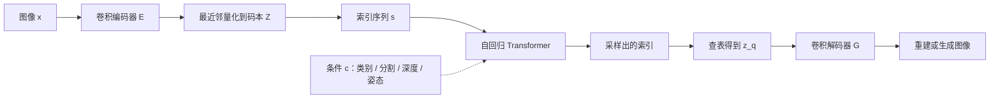

# VQ-GAN：先把图像压成可感知的码本，再让 Transformer 只学构图

<!-- release-date: 2020-12-17 -->

**本文依据**：`Taming Transformers for High-Resolution Image Synthesis`，arXiv:2012.09841v3 [cs.CV]（2021-06-23），52 页（含附录）。作者 Patrick Esser*、Robin Rombach*、Björn Ommer，Heidelberg Collaboratory for Image Processing, IWR, Heidelberg University；* 同等贡献。盘上 PDF 页眉写明 arXiv:2012.09841v3 [cs.CV] 23 Jun 2021。代码与预训练见摘要给出的 `https://git.io/JnyvK`（PDF p. 1）。首发日取 arXiv v1 提交日 **2020-12-17**，不因 v3 回写。封面与正文均未印本篇的会议录用信息；文中出现的 CVPR 均在参考文献里指他人工作，本文不补本篇会议名。文中数字都标 PDF 页码；标「外部补充」的段落不来自本文。

## 一句话

Transformer 在像素上算全局注意力，序列长度随分辨率平方涨，百万像素根本训不起。这篇论文把活拆成两段：先用带对抗与感知损失的卷积量化自编码器（文中叫 **VQGAN**）学一套上下文丰富的离散码本，把图压成短索引序列；再用自回归 Transformer 只学这些码怎么拼。于是同一套方法能做类别、分割、深度、姿态、超分等条件生成，并给出 Transformer 在百万像素语义引导上的第一批结果，以及当时自回归模型里 ImageNet 类别条件的最优成绩（PDF p. 1）。

它解决的不是「GAN 画得更像」或「重写 VQ-VAE」，而是 **把 CNN 的局部归纳偏置交给第一阶段，把长程构图交给第二阶段，让 Transformer 不必从像素重学纹理**。

## 一、矛盾：Transformer 表达力够，像素序列太长

2020 年前后 Transformer 已是语言默认架构，也开始进音频与视觉（PDF p. 1）。相对 CNN，它没有「只看邻居」的内置偏见，理论上能学任意位置之间的关系。代价写在注意力公式里（PDF p. 2 式 1）：

$$
\mathrm{Attn}(Q,K,V)=\mathrm{softmax}\!\left(\frac{QK^{\top}}{\sqrt{d_k}}\right)V
$$

$Q,K,V$ 由中间表示经三个逐位置线性层得到。自回归训练时，把 $QK^{\top}$ 对角线以下的非因果项置为 $-\infty$，最后再线性投影成下一个符号的 logits（PDF p. 2）。内积对序列里每一对位置都要算，复杂度随序列长度平方涨。图像的序列长度本身还随边长平方涨，于是分辨率一高，能量与时间一起爆（PDF p. 1–2）。

当时两条常见退路都不理想（PDF p. 2）：

- 限制注意力感受野：表达力下降，高分辨率时还等于假设远处像素独立。
- 保留全感受野但把 $n^2$ 降到约 $n\sqrt{n}$：超过 $64\times 64$ 仍然贵。

CNN 这条路则相反。卷积把交互限制在核大小内，代价随像素数线性、随核大小平方；现代网络常把核钉死成 $3\times 3$（PDF p. 2）。局部先验让计算便宜，但合成任务里堆出来的专用层（分割引导、风格、布局等）说明这个偏见经常太窄（PDF p. 2）。像素级自回归 CNN（PixelCNN 一族）能画，低分辨率上 Transformer 仍系统性更好（PDF p. 2）。

作者的判断是：**低层图像结构适合局部连通（卷积）；到了更高语义层，这个结构假设失效**。CNN 还有权值共享带来的空间不变偏见，需要整体理解时会吃亏（PDF p. 1–2）。因此不必每次从零重学「图像有局部规律」；可以把归纳偏置编码进第一阶段，同时保住 Transformer 的灵活构图（PDF p. 1）。

两阶段前作已经很多：VAE 上再套 VAE、无条件或条件流、在自编码器表示或小波系数上训 GAN 等（PDF p. 2–3）。最近的亲戚是 **VQVAE**：先学离散码，再用卷积自回归建模；VQVAE-2 加上层次码（PDF p. 3）。它们的密度估计仍是卷积，高分辨率长程关系难抓。ImageGPT 用 Transformer 直接做像素自回归，并拿浅层、小感受野的 VQVAE 把图编到最多 $192\times 192$，目的是让离散表示尽量对像素空间不变（PDF p. 3）。本文反过来：**第一阶段要尽量强、尽量吃上下文**，否则第二阶段的 Transformer 仍要浪费容量去补纹理（PDF p. 3）。

封面图 1 是一张 $1280\times 460$ 的合成样例，用来钉死目标分辨率（PDF p. 1）。

上图是机制示意，根据 PDF 图 2（p. 3）重画：离散码本是 CNN 与 Transformer 的接口；patch 判别器让第一阶段能压得更狠还不至于只剩糊 recon。

## 二、第一阶段：VQGAN，为 Transformer 准备短而「好看」的码

### 旧问题

要把图交给 Transformer，必须先变成序列。逐像素不行。需要离散码本，使 $x\in\mathbb{R}^{H\times W\times 3}$ 能写成空间上的码 $z_q\in\mathbb{R}^{h\times w\times n_z}$，等价于 $h\cdot w$ 个码本下标（PDF p. 3）。VQVAE 已经能学这套码，但像素级或浅量化之上的自回归模型压不狠：压狠了 recon 崩，纹理糊，第二阶段还得补低层统计（PDF p. 4）。

### 新设计

编码器 $E$、解码器 $G$ 都是卷积。码本 $Z=\{z_k\}_{k=1}^{K}\subset\mathbb{R}^{n_z}$。编码 $\hat{z}=E(x)$，每个空间位置把向量量化到最近码（PDF p. 4 式 2）：

$$
z_q=q(\hat{z}):=\arg\min_{z_k\in Z}\|\hat{z}_{ij}-z_k\|\in\mathbb{R}^{h\times w\times n_z}
$$

重建 $\hat{x}=G(z_q)=G(q(E(x)))$（PDF p. 4 式 3）。量化不可微，用直通估计：把解码器梯度原样拷给编码器（PDF p. 4）。VQ 损失沿用 VQVAE 形态（PDF p. 4 式 4）：

$$
\mathcal{L}_{\mathrm{VQ}}(E,G,Z)=\|x-\hat{x}\|_2+\|\mathrm{sg}[E(x)]-z_q\|_2^2+\|\mathrm{sg}[z_q]-E(x)\|_2^2
$$

第一项是重建，后两项分别是码本对齐与 commitment；$\mathrm{sg}[\cdot]$ 是停梯度。附录 A 说明：更早版本式 4 里 commitment 有权重 $\beta$，表 8 还写 $\beta=0.25$，但实现 bug 导致 $\beta$ 从未生效，所有模型实际按 $\beta=1.0$ 训，于是 v3 把 $\beta$ 从公式里删掉（PDF p. 10）。

**VQGAN** 相对原版 VQVAE 的改动是：把重建从 $L_2$ 换成感知损失，并加上 patch 判别器 $D$ 的对抗项，区分真图与重建（PDF p. 4 式 5）：

$$
\mathcal{L}_{\mathrm{GAN}}(\{E,G,Z\},D)=\log D(x)+\log(1-D(\hat{x}))
$$

最优压缩模型（PDF p. 4 式 6）：

$$
Q^*=\arg\min_{E,G,Z}\max_D\,\mathbb{E}_{x\sim p(x)}\big[\mathcal{L}_{\mathrm{VQ}}+\lambda\mathcal{L}_{\mathrm{GAN}}\big]
$$

$\lambda$ 按解码器最后一层上感知重建梯度与对抗梯度的比自适应缩放，分母加 $\delta=10^{-6}$ 防除零（PDF p. 4 式 7）。最低分辨率上再加一层注意力，让码能聚合全局上下文（PDF p. 4）。编码器/解码器骨架跟 [25] 那套残差+下/上采样，**没有 skip**；判别器是 patch 式（PDF p. 11 表 7）。$h=H/2^m$，$w=W/2^m$，$f=2^m$（PDF p. 11）。

对抗权重 $\lambda$ 在热身阶段置零。经验上热身越长 recon 越好；拇指规则是至少一整 epoch 保持 $\lambda=0$（PDF p. 11）。

### 机制、收益、边界

对抗 + 感知强迫码本抓住「人眼在乎的局部结构」，Transformer 就不必再建模低层像素统计（PDF p. 2、p. 4）。序列被显著缩短，才塞得进 GPT-2 中等规模的注意力窗口。边界：下采样次数 $m$ 不能无限加，过了数据集相关的临界值 recon 会烂，第二阶段再准也救不回来——这是附录 C 用 LPIPS 对 NLL 画出来的权衡（PDF p. 11、p. 15 图 11）。

**可迁移**：离散接口可以很薄，但「薄」不等于「浅」。若第二阶段是全局序列模型，第一阶段应主动吃上下文、用感知/对抗守住 recon，而不是为了空间不变把编码器做浅。

## 三、第二阶段：在码上自回归，而不是在像素上

有了 $E,G$，量化编码 $z_q=q(E(x))$ 等价于索引序列 $s\in\{0,\ldots,|Z|-1\}^{h\times w}$，$(z_q)_{ij}=z_{s_{ij}}$（PDF p. 4 式 8）。选定一种展开顺序后，生成就是下一个索引预测：$p(s_i\mid s_{<i})$，全序列似然 $p(s)=\prod_i p(s_i\mid s_{<i})$，目标是负对数似然（PDF p. 4 式 9）：

$$
\mathcal{L}_{\mathrm{Transformer}}=\mathbb{E}_{x\sim p(x)}[-\log p(s)]
$$

Transformer 就是 GPT-2 架构，容量主要靠层数调（PDF p. 11）。默认采样温度 $t=1.0$、top-$k$ 截断 $k=100$；码本更大时 $k$ 可更高（PDF p. 11）。默认码本大小 $|Z|=1024$，后续 Transformer 预测长度 $16\times 16$，因为这是 GPT-2 medium（307M 参数）在 12GB 显存在像素级窗口里能训的上限（PDF p. 5）。超参见附录表 7、表 8（PDF p. 5、p. 11–12）。

条件生成把用户给的 $c$（类别或另一张图）写进 $p(s\mid c)=\prod_i p(s_i\mid s_{<i},c)$（PDF p. 4 式 10）。若 $c$ 有空间尺寸，再训一个 VQGAN 得到条件索引 $r$，因为自回归，只要把 $r$ 接到 $s$ 前面，似然只在 $p(s_i\mid s_{<i},r)$ 上算。文中称之为 decoder-only，并指向文本摘要里同类策略（PDF p. 4）。语义图这类离散条件，第一阶段重建改用交叉熵（PDF p. 5）。

注意力仍限制 $h\cdot w$。可用 $m$ 把 $H\times W$ 压到 $H/2^m\times W/2^m$，但 $m$ 过大 recon 掉点。百万像素因此改成 **训练时裁成可行长度的块，采样时滑窗**（PDF p. 4–5 图 3）。前提：数据统计近似空间平稳，或有空间条件。无条件且数据对齐（人脸一类）时，可像 [42] 那样条件化图像坐标（PDF p. 5）。原则上可出任意长宽比与尺寸（PDF p. 6）。风景语义引导上，VQGAN 能训到 $m=5$，码本加条件给够上下文，才进入百万像素（PDF p. 6）。

**可迁移**：全局模型吃不起的网格，先卷积量化再序列建模；超大图用滑窗，但要承认平稳性假设，对齐数据就显式把坐标当条件，不要假装无条件滑窗万能。

## 四、实验地图：同一套方法铺开多任务

实验要同时证明两件事：潜空间里 Transformer 相对卷积密度估计仍有优势（4.1）；卷积压缩让高分辨率变得可行（4.2）。再单独拆码本质量（4.3）和与一堆生成模型的数字对照（4.4）（PDF p. 5）。

### 4.1 潜空间里 Attention 仍然赢

第一阶段一律 $m=4$。第二阶段在同一套表示上分别训 Transformer 与 PixelSNAIL（此前两阶段 SOTA 常用的卷积自回归）。容量 85M–310M，用层数对齐。PixelSNAIL 大约快一倍，因此 NLL 同时报「同等步数」和「同等墙钟」（PDF p. 5）。表 1（PDF p. 5）：

| 数据 / 参数量 | Transformer 同等步数 | Transformer 同等时间 | PixelSNAIL 同等时间 |
|---|---:|---:|---:|
| RIN / 85M | 4.78 | 4.84 | 4.96 |
| LSUN-CT / 310M | 4.63 | 4.69 | 4.89 |
| IN / 310M | 4.78 | 4.83 | 4.96 |
| D-RIN / 180M | 4.70 | 4.78 | 4.88 |
| S-FLCKR / 310M | 4.49 | 4.57 | 4.64 |

RIN 是 ImageNet 动物子集；D-RIN 用 [60] 的深度；S-FLCKR 是 Flickr 风景加 [7] 的语义布局。同等时间 Transformer 已经全面更好，同等步数差距更大。结论：两阶段设定下，Transformer 相对 PixelCNN 族的优势还在（PDF p. 5）。

### 4.2 统一的条件合成

默认仍是 $256\times 256$ 图、 $16\times 16$ 潜变量。同一套方法覆盖（PDF p. 6 图 4）：

1. **语义合成**：ADE20K、S-FLCKR、COCO-Stuff。
2. **结构到图**：RIN / IN 上的深度或边缘。
3. **姿态引导**：DeepFashion，条件远比分割/深度「语义贫瘠」，仍然能当形状条件生成。
4. **随机超分**：低分辨率当条件；ImageNet 上放大 8 倍（PDF p. 6 图 6）。
5. **类别条件**：RIN 与完整 ImageNet。

不需要为每个任务换专用模块；VQGAN 可跨任务复用，Transformer 学该任务该有的交互。附录 D 有更多图（PDF p. 6）。

高分辨率滑窗用在：无条件 LSUN-CT 与 FacesHQ；条件 D-RIN、COCO-Stuff、S-FLCKR。封面图 1、正文图 6 与附录图 29–39 是这一组（PDF p. 6）。S-FLCKR 语义引导给出 $1280\times 832$、$1024\times 416$、$1280\times 240$ 等尺寸（PDF p. 6 图 5）；滑窗条件样例边长大约 $368\times 496$ 到 $1024\times 576$（PDF p. 6 图 6）。

### 4.3 码本必须「有上下文」

固定 Transformer，只改第一阶段下采样，从而改 $f$（边长缩小倍数）。$f=1$ 复现 ImageGPT 路线：512 色的 RGB $k$-means，不是学出来的 VQGAN（PDF p. 6）。训练时始终把 Transformer 输入裁成 $16\times 16$，即原图裁 $16f\times 16f$；采样一律滑窗（PDF p. 6）。

FacesHQ = CelebA-HQ + FFHQ。图 7 显示：小 $f$ 拼不出连贯结构；$f=8$ 有整体轮廓，但半边胡子、局部视角打架；$f=16$ 才高保真（PDF p. 6–7）。相对直接在像素上的 $f=1$ 基线，采样加速在图 7 末行标到 $f=16$ 为 **280.68×**；像素基线在 Titan X 上出一张要 **7258 秒**。采样 $t=1.0$、top-$k=100$（PDF p. 7 图 7）。S-FLCKR 的同类消融在附录图 13 与 C 节（PDF p. 7）。

算力固定时，CIFAR-10 上像素 Transformer（512 色字典、跟 ImageGPT）对比 $f=2$ 的 VQGAN 潜码（$16\times 16=256$）：FID 改进 **18.63%**，出图快 **14.08×**（PDF p. 7）。

附录 C 把权衡说死：大 $f$ 让 NLL 下降（分布好建模），但 recon 误差（LPIPS）上升；人脸在 $f=16$ 之后 recon 已严重，再低的 NLL 也只能出低保真样本（PDF p. 11、p. 15 图 11）。风景对纹理没那么苛刻，$f=32$ recon 仍可接受，所以百万像素风景能用 $f=32$ 更省（PDF p. 12 图 13）。图 12 对照 DALL-E 里那种 VQVAE：$f=8$、$|Z|=8192$ 时两者都能保住全局，但 VQVAE 纹理糊、VQGAN 石材与皮毛更利落；$f=16$ 时对齐会漂（松鼠爪子），稍大码本仍看起来真实（PDF p. 12）。

### 4.4 数字对照：统一模型，不是每个任务的 FID 冠军

语义合成 $256\times 256$ 的 FID（PDF p. 7 表 2；带 * 的 SPADE 按作者协议用 [50] 在验证集上重算）：

| 数据集 | 本文 | SPADE | Pix2PixHD（+aug） | CRN |
|---|---:|---:|---:|---:|
| COCO-Stuff | 22.4 | 22.6 / 23.9* | 111.5（54.2） | 70.4 |
| ADE20K | 35.5 | 33.9 / 35.7* | 81.8（41.5） | 73.3 |

人脸 FID（PDF p. 7–8 表 3）。CelebA-HQ：Glow 69.0、NVAE 40.3、PIONEER 39.2（25.3）、NCPVAE 24.8、VAEBM 20.4、Style ALAE 19.2、DC-VAE 15.8、**本文 $k=400$ 为 10.2**、PGGAN 8.0。FFHQ：VDVAE 各温度 38.8–28.5、VQGAN+PixelSNAIL 21.9、BigGAN 12.4、**本文 $k=300$ 为 9.6**、U-Net GAN(+aug) 10.9（7.6）、StyleGAN2(+aug) 3.8（3.6）。表 2 默认 top-$k=100$；表 3 在 $k\in\{100,200,300,400,500\}$ 里取最好（PDF p. 8）。专用 GAN 常报更好 FID；本文卖点是 **跨任务统一，且还能编码/重建**，在纯对抗与似然两条线之间搭桥（PDF p. 7）。

**ImageNet 256 类别条件**是对当时自回归 SOTA VQVAE-2 的直接比较。VQGAN：$|Z|=16384$、$f=16$。还对照 BigGAN、IDDPM、DCTransformer、ADM（PDF p. 8）。作者估计自己参数约是 VQVAE-2 的 $1/10$；VQVAE-2 按 [67] 估约 **13.5B**（PDF p. 8）。表 4 在 50k 样本对训练集上算 FID/IS（PDF p. 8）：

| 设定 | 接受率 | FID | IS |
|---|---:|---:|---|
| mixed $k$，$p=1.0$ | 1.0 | 17.04 | $70.6\pm 1.8$ |
| $k=973$，$p=1.0$ | 1.0 | 29.20 | $47.3\pm 1.3$ |
| $k=250$，$p=1.0$ | 1.0 | 15.98 | $78.6\pm 1.1$ |
| $k=973$，$p=0.88$ | 1.0 | 15.78 | $74.3\pm 1.8$ |
| $k=600$，$p=1.0$ | 0.05 | 5.20 | $280.3\pm 5.5$ |
| mixed $k$，$p=1.0$ | 0.5 | 10.26 | $125.5\pm 2.4$ |
| mixed $k$，$p=1.0$ | 0.25 | 7.35 | $188.6\pm 3.3$ |
| mixed $k$，$p=1.0$ | 0.05 | 5.88 | $304.8\pm 3.6$ |
| mixed $k$，$p=1.0$ | 0.005 | 6.59 | $402.7\pm 2.9$ |
| DCTransformer | 1.0 | 36.5 | n/a |
| VQVAE-2 | 1.0 | $\sim 31$ | $\sim 45$ |
| VQVAE-2 | n/a | $\sim 10$ | $\sim 330$ |
| BigGAN | 1.0 | 7.53 | $168.6\pm 2.5$ |
| BigGAN-deep | 1.0 | 6.84 | $203.6\pm 2.6$ |
| IDDPM | 1.0 | 12.3 | n/a |
| ADM-G 无引导 | 1.0 | 10.94 | 100.98 |
| ADM-G 引导 1.0 | 1.0 | 4.59 | 186.7 |
| ADM-G 引导 10.0 | 1.0 | 9.11 | 283.92 |
| 验证集本身 | 1.0 | 1.62 | $234.0\pm 3.9$ |

「mixed $k$」指 $k\in\{100,200,250,300,350,400,500,600,800,973\}$。分类器拒绝采样跟 VQVAE-2：只留分类器分数最好的 $m/n$，接受率 $m/n$，分类器是 ResNet-101（PDF p. 8）。$k=973$ 是码本实际用到的有效大小：名义 $|Z|=16384$，真正被用的是 973 个（PDF p. 20 图 18–19）。无拒绝时已超过其他自回归（VQVAE-2、DCTransformer）；低拒绝率可超过 BigGAN 与 IDDPM；高拒绝率靠近当时扩散引导那一档（PDF p. 8）。这是摘要里「自回归模型中类别条件 ImageNet SOTA」的落点，**不是对所有生成模型的 SOTA**。

重建 FID 给出生成 FID 的上限（PDF p. 8 表 5，ImageNet）：

| 模型 | 码本空间 | $\mathrm{dim}\,Z$ 或 $|Z|$ | FID/val | FID/train |
|---|---|---:|---:|---:|
| VQVAE-2 | $64\times 64$ 与 $32\times 32$ | 512 | n/a | $\sim 10$ |
| DALL-E 的 VQVAE | $32\times 32$ | 8192 | 32.01 | 33.88 |
| VQGAN | $16\times 16$ | 1024 | 7.94 | 10.54 |
| VQGAN | $16\times 16$ | 16384 | 4.98 | 7.41 |
| VQGAN* | $32\times 32$ | 8192 | 1.49 | 3.24 |
| VQGAN | $64\times 64$ 与 $32\times 32$ | 512 | 1.45 | 2.78 |

* 用 Gumbel-Softmax，做法同 [59, 29]。VQGAN 比非对抗离散 VAE 更好，同时压得更狠：序列长度 256，对 VQVAE-2 的 $32^2+64^2=5120$，对 DALL-E 的 1024（PDF p. 9）。层次码本重建最好，但序列太长，第二阶段不实用（PDF p. 9）。

## 五、附录里正文真正依赖的数字

**A. Changelog（PDF p. 10）** v3 相对 v2：删掉未生效的 $\beta$；类别条件 ImageNet 换实现（不再用直方图代替第一个 token 的分布）；新模型 **240 万步**、batch 16 由 8 个微批累积，单卡 A100 **45.8 天**；旧模型 100 万步。FID 从「50k（18k）对 50k（18k）训练图」改为 50k 对 **全部** ImageNet 训练集约，工具 `torch-fidelity`。训练图预处理：最大中心裁切，Pillow 双线性+抗锯齿到 $256\times 256$。表 4 里除 BigGAN / BigGAN-deep 外多数对比没有可下载样本，只能抄原论文数字，不能用同一套代码重评（PDF p. 10）。表 6 旧数：IN 256、50k 上先前 19.8（拒绝后 11.2），BigGAN(-deep) 7.1（7.3）；18k 上先前 23.5，MSP 50.4。人脸旧 FID：CelebA-HQ 10.7→10.2，FFHQ 11.4→9.6（PDF p. 10）。

**B. 实现（PDF p. 10–12）** 除 c-IN (big)、COCO-Stuff、ADE20K 外，超参保证 Transformer 在 12GB 上 batch 至少 2；通常 2–4 卡、合计 48GB；硬件允许则 FP16。注意力头一律 $n_h=16$（PDF p. 12 表 8）。摘几行面试用得到的规格：c-IN (big) 48 层、**1400M**、码本 16384、序列 257、嵌入 1536、$m=4$；IN / c-IN 默认 24 层 307M、码本 1024；S-FLCKR $f=32$ 对应 $m=5$；COCO-Stuff 32 层 651M、码本 8192；ADE20K dropout 0.1（表里几乎唯一非零 dropout）；FacesHQ $f=1$ 是 $K=512$ 的固定 $k$-means（PDF p. 12）。

**D. 额外结果（PDF p. 12）** 与 ImageGPT 比补全：对方困在像素，过不了 $192\times 192$；本文补全分辨率与保真都高一档（图 27–28）。附录后半几乎是大图：S-FLCKR $f=16/32$、深度、边缘、超分、LSUN-CT、ADE20K / COCO-Stuff 对 SPADE、DeepFashion、RIN 类别条件（图 29–44）。

**E. 近邻与过拟合（PDF p. 13）** 似然模型能在训练/验证 NLL 上看过拟合。大人脸模型很容易背数据：验证 NLL 最好的 checkpoint 在 FFHQ 第 10 epoch、CelebA-HQ 第 13 epoch；训练 NLL 最好的在第 1000 epoch。按 LPIPS 找训练集约近邻：train-best 在复读训练集，val-best 出新脸。早停能防过拟合。人脸瓶颈是数据规模，容量几乎能拟合训练集。FID **看不出**这种过拟合：train-best 的 FID 是 CelebA-HQ **3.86**、FFHQ **2.68**，反而优于 val-best 的 10.2 与 9.6。作者承认：若只关心样本观感，验证 NLL 早停未必最优；也需要能区分「新的高质量样本」与「背数据」的指标。类别条件 ImageNet **没有**按验证 NLL 显示过拟合，图 46 近邻支持「新样本」（PDF p. 13）。

**F. 展开顺序（PDF p. 13–14）** 语言有天然词序，图像码没有。滑窗依赖行优先，于是在固定 VQGAN、固定初始化与算力下试六种排列：行优先（光栅）、螺旋出、Z 曲线、子采样层次、隔行反向、螺旋入（图 47）。最终 NLL：行优先 **4.767**（最好），Z 曲线 4.810，alternate 4.812，螺旋出 4.889，螺旋入 4.901，subsample **5.015**（最差）。层次化 subsample 先验没有带来好处。NLL 最差的两种更偏纹理，其余结构更可认。结论：码上的自回归 **不是排列不变**，常用行优先仍然最好（PDF p. 14）。

## 六、论文没写什么，以及不要读成后作

正文没有：训练墙钟（除附录里那次 45.8 天 A100）、数据配方细节、分布式策略、推理系统。没有把第二阶段改成扩散——那是后话。

不要把本文读成 VQ-VAE（van den Oord 等）或后来的 Latent Diffusion：VQ-VAE 是第一阶段的前作，本文加感知与对抗并换第二阶段为 Transformer；潜空间扩散不在 52 页里。

**外部补充**（不来自本 PDF）：arXiv 页面 https://arxiv.org/abs/2012.09841 记录 v1 提交于 2020-12-17，本盘文件为 v3。本 PDF 未印 CVPR 录用字样。

## 七、可迁移的几条，以及关键词回看

1. **把归纳偏置花在该花的分辨率上**。局部纹理给 CNN，长程构图给序列模型。让 Transformer 从像素重学卷积结构，是在交二次学费。
2. **第一阶段的目标是「短且感知上够用」，不是像素 MSE 最小**。感知 + 对抗 + 自适应 $\lambda$ 是为了在高压缩下守住第二阶段的质量上限（表 5）。
3. **统一条件接口可以很笨：把条件码接到序列前面**。空间条件再训一个量化器。专用模块不是第一反应。
4. **FID 会奖励背数据**。人脸实验里 train-best FID 更好但在复读。有验证似然就用它盯过拟合；没有就要另找指标。
5. **滑窗生成绑定平稳性或空间条件**。对齐人脸要显式坐标条件。光栅序不是中性实现细节，换序 NLL 会动。
6. **拒绝采样与 top-$k$ 是评测旋钮，不是架构本身**。报 SOTA 时看接受率 1.0 的那一行，再看旋钮能把数拧到哪。

关键词串一条线：**VQGAN** 是带感知与对抗的离散卷积压缩；**码本 $Z$** 是 CNN 与 Transformer 的接口；**索引序列 $s$** 才是自回归对象；**滑窗注意力** 把固定 $16\times 16$ 窗口铺到百万像素；**decoder-only 条件** 把 $r$ 接到 $s$ 前；**重建 FID** 是生成 FID 的天花板。

## 参考资料

- 原件 PDF：`readings/_src/图像、视频与 3D 生成/VQ-GAN.pdf`（盘上为 arXiv v3，52 页）
- arXiv：https://arxiv.org/abs/2012.09841
- 论文给出的代码入口：https://git.io/JnyvK
