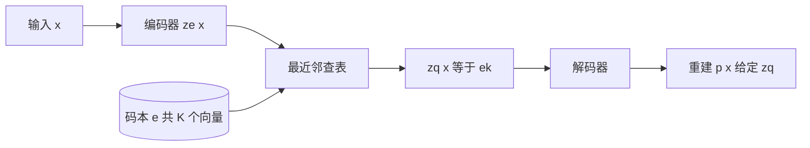

# VQ-VAE:把隐变量钉成码本上的离散点,解码器再强也不会把码丢掉

<!-- release-date: 2017-11-02 -->

**本文依据**:`Neural Discrete Representation Learning`,arXiv 1711.00937v2 [cs.LG] 30 May 2018,11 页。作者 Aaron van den Oord、Oriol Vinyals、Koray Kavukcuoglu,DeepMind。盘上 PDF 页眉写明 arXiv:1711.00937v2;第 1 页页脚印有 31st Conference on Neural Information Processing Systems (NIPS 2017), Long Beach, CA, USA。首发日取原件首次公开日,即 arXiv v1 提交日 2017-11-02,不回写为 v2 日期。文中数字均标 PDF 页码;标「外部补充」的段落不来自本文。

## 一句话

连续 VAE 的编码器吐出的是一团高斯噪声;这篇论文让编码器吐出一个最近邻查表的**离散码**,码对应码本里的一个向量,再把这个向量交给解码器。先验在训练自编码器时先固定成均匀分布,训完后再单独拟合一个自回归先验。因为后验是确定的最近邻、KL 是常数,解码器再强也没法靠「忽略隐变量、自己把像素画完」来偷懒——这就是作者说的避开 **后验崩塌(posterior collapse)**。

它解决的不是后来 VQ-GAN 那套「离散码 + 对抗画质」,也不是 PixelCNN 怎么在像素上自回归。它要证明的是:**离散隐变量的 VAE 可以在似然上追上连续对照,并且码本身能抓住跨很多像素/采样点的高层结构**。

## 一、矛盾:想要离散码,梯度却走不通

无监督表示学习当时已经能在像素、波形、视频上出好看的样本,但「学出来的表示好不好用」仍然不是主流做法。最大似然和重建误差都在像素域优化,特征到底有没有保住重要结构,取决于下游任务(PDF p. 1)。

作者的目标写得很窄:隐空间要保住数据里重要的东西,同时仍然按最大似然训(PDF p. 1)。他们引用 Variational Lossy Autoencoder 的判断:按对数似然排,最好的生成模型往往**没有隐变量、解码器极强**(例如 PixelCNN)。本文唱反调:离散、有用的隐变量仍然值得学,并在图像、语音、视频上给证据(PDF p. 1)。

为什么盯离散?语言本来就是离散符号;语音通常也写成符号序列;图像常常能用一句话概括。离散表示也更贴复杂推理、规划和预测(「要下雨我就带伞」这一类)(PDF p. 1)。问题是:深度学习里用离散隐变量一直很难。NVIL、VIMCO 要靠方差缩减或多样本目标;Concrete / Gumbel-softmax 用可退火的连续松弛,训练前期梯度方差低但有偏、后期无偏但方差高。这些方法都没把离散 VAE 的似然拉到能用高斯重参数化的连续 VAE 那一档,而且多半只在 MNIST、隐变量维数低于 8 的设定上评(PDF p. 2)。

本文用的数据集反过来:CIFAR10、ImageNet、DeepMind Lab,以及原始语音 VCTK(PDF p. 2)。

另一条相关线是图像压缩里的量化。Theis 等人用标量量化压激活;Agustsson 等人用向量量化加 **soft-to-hard** 松弛,先训自编码器,再量化,再用很小的学习率微调。作者按他们的松弛从头训,**解码器总能把连续松弛反解回去,量化实际上没有发生**(PDF p. 2–3)。所以他们不要可退火的软量化,要硬最近邻,再用直通估计把梯度抄回去。

**旧问题钉在这里:离散码自然、压缩、好给先验建模;但可微训练要么方差大,要么松弛被解码器钻空子。**

## 二、全景:编码器 → 最近邻码本 → 解码器,先验后装

标准 VAE 三件套:编码器给出 $q(z\mid x)$,先验 $p(z)$,解码器 $p(x\mid z)$。通常后验和先验是对角高斯,才能用重参数化(PDF p. 3)。

VQ-VAE 把后验和先验都改成**范畴分布**。从范畴分布里抽出的离散指标去查一张嵌入表,查出的向量才是解码器的输入(PDF p. 3)。

前向可以当成普通自编码器,中间多了一层「把连续激活钉到 $K$ 个嵌入之一」的非线性。整网参数是编码器、解码器、嵌入表 $e$ 的并集(PDF p. 3)。为了写法简单,第三节用单个 $z$;真正做语音、图像、视频时,分别抽出 **1D / 2D / 3D** 的离散特征图(PDF p. 3)。

机制示意,根据 PDF p. 3–4 图 1 与式 (1)(2) 重画,不是实验曲线。

训练时先验保持均匀、常数;训完后再在离散码上拟合自回归 $p(z)$,用祖先采样生成 $x$。图像用 PixelCNN,原始音频用 WaveNet。**先验与 VQ-VAE 联合训练被明确留作未来工作**(PDF p. 5)。

## 三、离散隐变量:后验是 one-hot 最近邻

嵌入空间 $e\in\mathbb{R}^{K\times D}$。$K$ 是离散码的类别数($K$ 元范畴),$D$ 是每个嵌入向量的维数,共 $K$ 个 $e_i\in\mathbb{R}^D$(PDF p. 3)。

输入 $x$ 过编码器得到 $z_e(x)$。离散码 $z$ 由对共享码本的最近邻查出(PDF p. 3 式 1):

$$
q(z=k\mid x)=\begin{cases}
1 & k=\arg\min_j\|z_e(x)-e_j\|_2\\
0 & \text{否则}
\end{cases}
$$

解码器输入是对应的嵌入(PDF p. 3 式 2):

$$
z_q(x)=e_k,\qquad k=\arg\min_j\|z_e(x)-e_j\|_2
$$

这被看成一个 VAE:可以对 $\log p(x)$ 写 ELBO。提议分布 $q(z=k\mid x)$ **是确定的**。再把先验取成 $z$ 上的均匀分布,则 KL 散度是常数 $\log K$(PDF p. 3)。

**机制**:连续激活被钉死成码本里离它最近的那一个点。没有 Gumbel 噪声,也没有温度。代价是量化这一步本身没有真正的梯度——下一节用直通估计补。

**收益**:KL 不再是编码器可以拿来「把后验推向先验、把信息丢掉」的那一项;训练时它甚至可以忽略(PDF p. 4)。

**边界**:后验没有随机性。ELBO 里那项 KL 常数,并不表示模型学到了数据相关的先验——数据相关的 $p(z)$ 是事后另训的。

## 四、学习:直通梯度、VQ 词典、commitment

式 (2) 没有真正梯度。做法类似直通估计:把解码器输入 $z_q(x)$ 上的梯度原样抄到编码器输出 $z_e(x)$(PDF p. 3)。也可以走量化的次梯度,作者说这个简单估计在本文的初步实验里已经够用(PDF p. 3)。

因为 $z_e$ 和 $z_q$ 同在 $D$ 维空间,重建损失对 $z_q$ 的梯度告诉编码器:输出该往哪边挪,下次前向才可能换一个码(PDF p. 4 图 1 右)。图 1 左是整网;右图画编码器输出被映到最近的 $e_2$,红色梯度 $\nabla_z L$ 推编码器改输出(PDF p. 4)。

直通的副作用:重建项 $\log p(x\mid z_q(x))$ **不会把梯度送到嵌入 $e_i$**。词典要用向量量化自己学。总损失三部分(PDF p. 4 式 3):

$$
L=\log p(x\mid z_q(x))+\bigl\|{\mathrm{sg}}[z_e(x)]-e\bigr\|_2^2+\beta\bigl\|z_e(x)-{\mathrm{sg}}[e]\bigr\|_2^2
$$

$\mathrm{sg}$ 是 stopgradient:前向当恒等,反向偏导为零,把操作数当成不更新的常数(PDF p. 4)。

三项各管谁:

1. **重建(数据项)**:优化解码器和编码器(编码器靠直通)。正文写的是 $\log p(x\mid z_q(x))$,按似然最大化理解;实现上通常等价于最小化负对数似然或像素误差,论文没另给像素损失的闭式。
2. **词典 VQ**:$\|{\mathrm{sg}}[z_e(x)]-e\|_2^2$,只更新嵌入,把 $e_i$ 拉向编码器输出。也可以按 $z_e(x)$ 的滑动平均更新词典,**本文实验没有用这一项**(PDF p. 4),细节在附录 A.1。
3. **commitment**:$\beta\|z_e(x)-{\mathrm{sg}}[e]\|_2^2$。嵌入空间无量纲,若嵌入学得比编码器慢,编码器输出可以任意胀大。commitment 逼编码器贴住某个嵌入、输出别涨(PDF p. 4)。

解码器只吃第一项;编码器吃第一项和第三项;嵌入吃第二项(PDF p. 4)。$\beta$ 从 0.1 到 2.0 结果都差不多,实验一律 $\beta=0.25$;一般还要看重建损失的尺度(PDF p. 4)。均匀先验下,ELBO 里的 KL 对编码器参数是常数,训练可忽略(PDF p. 4)。

多个离散位置时(ImageNet 用 $32\times 32$ 个码,CIFAR10 用 $8\times 8\times 10$),损失形式不变,k-means 与 commitment 对 $N$ 个位置取平均(PDF p. 4)。

完整模型的对数似然是 $\log p(x)=\log\sum_k p(x\mid z_k)p(z_k)$。解码器是用 MAP 得到的 $z=z_q(x)$ 训的,收敛后不应再给 $z\neq z_q(x)$ 分配质量,于是 $\log p(x)\approx\log p(x\mid z_q(x))p(z_q(x))$。由 Jensen 还有 $\log p(x)\ge\log p(x\mid z_q(x))p(z_q(x))$(PDF p. 4–5)。第四节会经验地评这个近似。

### 附录里的 EMA,正文实验没用

附录 A.1 把词典更新写成 k-means 的闭式:分到 $e_i$ 的那些编码器输出取平均。Minibatch 上不能直接用整批平均,改指数滑动平均(PDF p. 11 式 6–8):

$$
N_i^{(t)}=\gamma N_i^{(t-1)}+(1-\gamma)n_i,\quad
m_i^{(t)}=\gamma m_i^{(t-1)}+(1-\gamma)\sum_j z_{i,j}^{(t)},\quad
e_i^{(t)}=m_i^{(t)}/N_i^{(t)}
$$

$\gamma\in(0,1)$,实践中 $\gamma=0.99$ 好用(PDF p. 11)。再次强调:这是可选项,**第四节实验走的是式 (3) 的损失项,不是 EMA**(PDF p. 4)。

**可迁移**:三件套拆得很干净——重建走直通、词典走 VQ 或 EMA、commitment 防编码器逃跑。不要把后人都默认的 EMA 码本写成 2017 这篇的实验设定。

## 五、先验:先均匀,再自回归

离散码上的先验是范畴分布,也可以做成特征图上对其它 $z$ 的自回归。VQ-VAE 训练期间先验保持均匀。训完再拟合自回归 $p(z)$,祖先采样出码,再解码成 $x$。图像用 PixelCNN,音频用 WaveNet。联合训练先验与 VQ-VAE 可能加强结果,本文没做(PDF p. 5)。

**旧问题**:像素级自回归把容量花在局部噪声上。**新设计**:先把 $x$ 压成短的离散码,再让 PixelCNN / WaveNet 只在码上建模。**收益**:训练和采样都快,容量用来抓全局结构(PDF p. 5)。**代价**:两阶段,先验看不到编码器还在动;生成质量上限被第一阶段的码本绑死。

## 六、实验

论文没写完整的现代「训练 recipe」:没有数据增强清单、没有分布式、没有把 EMA 码本当默认。公开的是架构片段、步数、以及各模态设定。

### 6.1 连续对照:CIFAR10 似然

同一套标准 VAE 架构,改隐变量容量(连续个数、离散个数、$K$)。编码器:两层 stride 2、窗 $4\times 4$ 的卷积,再两个残差 $3\times 3$ 块(ReLU、$3\times 3$ conv、ReLU、$1\times 1$ conv),隐单元 256。解码器对称:两个残差块,再两个转置卷积。ADAM,学习率 $2\times 10^{-4}$,25 万步,batch 128。VIMCO 多样本目标用 50 个样本(PDF p. 5)。

下界(bits/dim):连续 VAE **4.51**,VQ-VAE **4.67**,VIMCO **5.14**。连续 VAE 与当时 Deep convolutional VAE 的 4.54 bits/dim 可比(PDF p. 5)。作者称这是离散隐变量里第一个能挑战连续 VAE 表现的模型:重建接近普通 VAE,表示却是符号式压缩(PDF p. 5)。

### 6.2 图像:ImageNet 压缩再 PixelCNN

像素高度冗余。实验把 $x=128\times 128\times 3$ 压到 $z=32\times 32\times 1$、$K=512$,解码器是纯反卷积 $p(x\mid z)$。按他们写的比特比:$128\times 128\times 3\times 8/(32\times 32\times 9)\approx 42.6$(PDF p. 5)。再在 $z$ 上训 PixelCNN 先验。

图 2:左原图,右 $32\times 32\times 1$、$K=512$ 的重建。维数砍得很狠,重建只略糊。作者提到可以用比像素 MSE 更「感知」的损失(例如 GAN),留作未来工作(PDF p. 5–6)——本文没有对抗训练。

$32\times 32\times 1$ 只有一个通道,PixelCNN 只需空间 mask,容量与原 PixelCNN 论文相近(PDF p. 6)。图 3 是先验采样再解码的 $128\times 128$ 样本,从左到右:kit fox、gray whale、brown bear、admiral(蝴蝶)、coral reef、alp、microwave、pickup(PDF p. 6)。

DeepMind Lab 的 $84\times 84\times 3$ 帧:重建几乎与原图相同。先验建在 $21\times 21\times 1$ 码上,解码后见图 4(PDF p. 6)。

### 6.3 两阶段与后验崩塌

在第一级 $21\times 21\times 1$ 码之上再训一个带 PixelCNN 解码器的第二级 VQ-VAE。这种「解码器已经强到能自己建模 $x$」的设定,通常会让普通 VAE **后验崩塌**(隐变量被忽略)。本文模型没有,码仍被有意义地使用(PDF p. 6)。第二级只用 **3 个** 隐变量,各 $K=512$、各自的嵌入表 $e$,相当于把整图压到 $3\times 9$ 比特,少于一个 float32,所以不可能完美重建(PDF p. 6)。

图 5:上原图,下两阶段重建。重建是在第一级的 $21\times 21$ 域里从第二级 PixelCNN 采样,再经标准 VQ-VAE 解码到 $84\times 84$。场景、纹理、房间布局、近处墙还在,但模型不存像素值本身,纹理由 PixelCNN 程序性生成(PDF p. 6–7)。

这是全文对后验崩塌最硬的实验论证:不是口头说离散码「信息必须过瓶颈」,而是把解码器换成 PixelCNN 之后码仍在干活。

### 6.4 音频与说话人转换

解码器是类似 WaveNet 的膨胀卷积。样本页:https://avdnoord.github.io/homepage/vqvae/(PDF p. 7)。

VCTK:109 个说话人。编码器 6 个 stride 2、窗 4 的卷积,隐空间比波形小 **64** 倍;一个特征图,$K=512$。解码器同时条件于离散码和说话人 one-hot(PDF p. 7)。

因为 64 倍下采样,不能逐采样点完美重建。听感与图 6:左原波形,中同一 speaker-id 重建,右换 speaker-id;三段内容相同(PDF p. 7)。重建文本内容在,波形和韵律变了——无任何语言学监督,模型学到了对低层细节不变、主要编码内容的抽象空间(PDF p. 7)。这印证引言:重要特征往往跨数据空间很多维(这里是音素级内容),而不是局部噪声。

无条件采样:更大的 460 说话人数据(参考文献 [30],即 LibriSpeech)。离散分辨率再小 **128** 倍。先验在 40960 个时间步(2.56 秒)的块上训,对应 **320** 个隐时间步(PDF p. 7)。作者对比:即便最好的语音模型如原版 WaveNet,样本也像 babbling;VQ-VAE 的样本里有清晰单词和句子片段。结论:从原始波形、完全无监督,模型学到了粗糙的音素级语言模型(PDF p. 7)。

说话人转换:从一个说话人抽出码,用另一个 speaker-id 解码。合成语音内容不变、音色换成第二人。说明嵌入跨不同嗓音仍表示同一内容,说话人信息被因子分解出去(PDF p. 7–8)。

把码与真值音素序列一对一对齐(音素**从未**用于训练)。离散空间 128 维、跑在 25 Hz(编码器下采样 640),把 128 个码值映到 41 个音素(条件最可能音素)。41 类准确率 **49.3%**;随机码本(先验最可能音素)是 **7.2%**(PDF p. 8)。脚注:编解码器可以让每个码的含义依赖前面的码(bi/tri-gram),更高级的音素映射可能更高(PDF p. 8)。

图 6 在音频节之前出现,波形三列对应原声 / 同说话人 / 换说话人(PDF p. 7)。

### 6.5 视频:动作条件、只在码上滚

仍用 DeepMind Lab。生成模型条件于给定动作序列。图 7:前 6 帧输入,随后 10 帧由 VQ-VAE 生成;上行动作全是前进,下行全是右转(PDF p. 8)。

生成**纯在隐空间** $z_t$ 上进行,不必先画出图像。全部 $z_{1:T}$ 由先验 $p(z_1,\ldots,z_T)$ 生成之后,每个 $x_t$ 再由确定性解码器映到像素。因此可以在码上想象长序列(PDF p. 8)。作者观察到:按动作条件生成时视觉质量不掉、局部几何仍对。无动作条件的模型结果类似,因篇幅未展示(PDF p. 8)。

引言里「对 RL 环境学长期结构」的承诺,实验落到 Lab 帧的动作条件生成,没有单独的 RL 回报曲线(PDF p. 2、p. 8)。

## 七、论文写了什么、没写什么

写了:VQ-VAE 定义;直通 + VQ + commitment;均匀先验 + 事后 PixelCNN/WaveNet;CIFAR10 与连续 VAE/VIMCO 的 bits/dim;ImageNet 与 Lab 的重建/采样;两阶段对抗后验崩塌;VCTK / LibriSpeech 语音、说话人转换、音素探测准确率;Lab 视频动作条件生成;附录 EMA 公式。

没写、不要补:

- 先验与自编码器联合训练的做法(明确 future work)。
- 感知损失或 GAN 解码器(明确 future work)。
- 第四节实验并未使用附录 EMA。
- 完整优化器超参表、正则、数据预处理、硬件与墙钟。
- VQ-GAN、VQ-VAE-2 的多尺度码本、Transformer 先验——那是后续工作,标外部补充才可提一句,本文不展开。

结论段的自我总结(PDF p. 8):VQ-VAE 能通过压缩离散空间建模很长程依赖,演示包括 $128\times 128$ 彩色图、动作条件视频、无条件语音片段与说话人转换;CIFAR10 似然几乎赶上连续对照;作者相信这是第一个能成功建模长程序列、并无监督学到与音素密切相关的高层语音描述子的离散隐变量模型。

## 八、可迁移

1. **把「难建模的高维观测」和「好建模的离散码」拆开。** 像素/波形自回归把容量花在局部噪声上;先 VQ 再先验,先验只负责跨很多维才稳定的结构。这不依赖后来的 Transformer,2017 年用的就是 PixelCNN 和 WaveNet。
2. **后验崩塌的一个工程解法:让 $q(z\mid x)$ 变成硬最近邻,KL 变常数。** 解码器再强,信息也必须经过那张有限码表。两阶段 PixelCNN 实验是这条原则的证据,不是口号。
3. **量化无梯度时,拆开三路更新,比死磕一种松弛更稳。** 重建走直通,词典走 VQ(或 EMA),commitment 管编码器别胀。$\beta$ 在 0.1–2.0 不敏感,给了一个可复用的默认 0.25。
4. **条件可以接在解码器上、不接在码上。** 说话人 one-hot 就是例子:码管内容,条件管风格。迁移到「同一内容、换渲染」时,先问信息该进码本还是进条件。
5. **生成可以全程在码上滚动,最后才解码。** 视频实验把这一点写死了。规划、想象、长视频,不必每一步回像素。
6. **不要把附录选项写成论文默认。** EMA 码本后来很常见;这篇的数字是式 (3) 训出来的。复现或对比时对上更新规则,否则不是同一模型。

## 九、关键词回看

- **向量量化 VQ**:用最近邻把连续向量换成码本里的一个向量。
- **码本 / 嵌入表 $e$**:$K$ 个 $D$ 维向量,离散指标的查表对象。
- **直通估计**:前向量化,反向把 $z_q$ 的梯度抄给 $z_e$。
- **commitment loss**:逼 $z_e$ 贴住选定的 $e$,防止编码器输出膨胀。
- **后验崩塌**:强解码器忽略 $z$,只靠自己建模 $x$;VQ-VAE 用确定离散瓶颈对抗它。
- **均匀先验 + 事后自回归先验**:训练时 $p(z)$ 不动;生成前再拟合 PixelCNN 或 WaveNet。

## 参考

Aaron van den Oord, Oriol Vinyals, Koray Kavukcuoglu. Neural Discrete Representation Learning. arXiv:1711.00937v2, 2018. PDF 11 页。官方 arXiv:https://arxiv.org/abs/1711.00937
