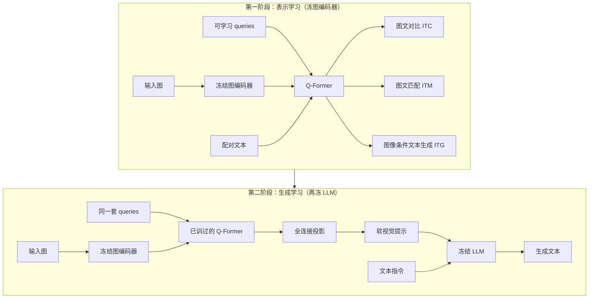

# BLIP-2：冻结图编码器和大语言模型，用轻量 Q-Former 两阶段把模态缝补上

<!-- release-date: 2023-01-30 -->

**本文依据**：`BLIP-2: Bootstrapping Language-Image Pre-training with Frozen Image Encoders and Large Language Models`，arXiv 2301.12597v3（页眉 `[cs.CV] 15 Jun 2023`），13 页。作者 Junnan Li、Dongxu Li、Silvio Savarese、Steven Hoi，Salesforce Research；封面写明代码 `https://github.com/salesforce/LAVIS/tree/main/projects/blip2`（PDF p. 1）。盘上 PDF 为 v3；首发日取 arXiv 页面 Submission history 的 `[v1] Mon, 30 Jan 2023 00:56:51 UTC`（[arxiv.org/abs/2301.12597](https://arxiv.org/abs/2301.12597) 的 Submitted on 30 Jan 2023），这是外部补充，不来自 PDF 正文。封面未写会议录用，本文不补会议名。`pdfinfo` 的 Subject 写着 `Proceedings of the International Conference on Machine Learning 2023`，封面与页眉均未出现该字样，本文不把它当录用信息。文中数字均标 PDF 页码；标「外部补充」的段落不来自本文。BLIP 只作为本 PDF 引用的前作出现，不重写 BLIP 本体。

## 一句话

端到端把大图编码器和大语言模型一起训，账单越来越贵，而且没法直接吃现成的单模态权重。BLIP-2 把两边都冻住，中间只训一个轻量的 **查询 Transformer（Querying Transformer，Q-Former）**：第一阶段对着冻结图编码器学「跟文字最相关的视觉表示」，第二阶段把这些查询输出接到冻结 LLM 上，当软视觉提示（PDF p. 1）。可训练参数大约 188M（PDF p. 3）。零样本 VQAv2 上，ViT-g + FlanT5-XXL 到 65.0（test-dev），比 Flamingo80B 的 56.3 高 8.7 个点，可训练参数少约 54 倍（PDF p. 1、p. 6 表 2）。

它解决的不是「再做一个更强的端到端图文模型」，而是另一句：**冻结单模态模型能省算力、也能保住 LLM 的生成能力，但只靠语言建模损失跨不过模态缝；必须先用信息瓶颈把视觉压成「LLM 读得懂的那一小撮」，再让 LLM 生成。**

## 一、矛盾：单模态已经很强，跨模态还在付端到端的账单

视觉–语言预训练（vision-language pre-training，VLP）这几年把模型越做越大，下游任务不断刷新（PDF p. 1）。账单也跟着涨：大多数 SOTA 仍是大规模模型、大规模数据上的端到端训练（PDF p. 1）。

图文研究夹在视觉和语言中间，两边各自已经有现成的强模型。作者的期待很直接：VLP 应该能从现成的单模态权重里「借力」，而不是每次从头合训（PDF p. 1）。冻住单模态还有两个具体理由（PDF p. 1）：

- 算力：不必再更新巨型 ViT 和巨型 LLM 的梯度；
- 灾难性遗忘：LLM 在单模态预训练里攒下的语言能力和零样本迁移，不要在合训时被冲掉。

冻住之后，真正难的是对齐。LLM 预训练时没见过图；把图像特征硬塞进去，它未必当「词」来用。当时两条代表性路线都主要靠图像条件的语言建模（PDF p. 1–2）：

- Frozen：微调图编码器，输出直接当 LLM 的软提示；
- Flamingo：在 LLM 里插入新的交叉注意力层，注入视觉，并在数十亿图文对上训这些新层。

作者的判断是：只靠图像到文本的生成损失，不够把模态缝补上（PDF p. 1）。后面整套设计都围着「冻住两端、只训中间、而且中间必须先会抽跟文字相关的视觉」转。

相关工作里，端到端 VLP 的架构已经分成双塔、融合编码器、编解码、统一 Transformer 几类；目标也收敛到图文对比、图文匹配、（掩码）语言建模（PDF p. 2）。模块化路线里，有人冻图编码器（早期目标检测器抽特征，以及 LiT 那种锁住图塔做 CLIP 式预训练），有人冻语言模型去借 LLM 的生成能力（PDF p. 2）。BLIP-2 要同时冻两边，并且覆盖问答、描述、检索，而不只做生成（PDF p. 2）。

## 二、全景：一个瓶颈，两阶段，三种下游接法

图 1（PDF p. 1）把框架画成左右两块。左侧是「从预训练图像模型借力」：冻结图编码器 → Q-Former（一排可学习 queries）→ 文本。右侧是「从预训练 LLM 借力」：同样的图编码器与 Q-Former，接到冻结 LLM，按自然语言指令写句子。读图能看清：queries 画成一串小方块夹在图编码器和 LLM 中间；右侧示例指令是 「Write a romantic message that goes along this photo.」，模型写出日落比喻。这是机制示意图，不是实测曲线。

上图根据 PDF p. 1 图 1 与 p. 3–4 第 3 节重画，是机制示意。

三个部件各管一件事：

- **冻结图编码器**：提供现成视觉表示，分辨率变了，Q-Former 仍吐固定个数的查询输出（PDF p. 2）。
- **Q-Former**：唯一大规模可训练的跨模态模块，188M 参数（含 queries）（PDF p. 3）。它是信息瓶颈：视觉特征很多，真正交给 LLM 的很少。
- **冻结 LLM**：第二阶段才接上。查询输出先线性投到 LLM 的词嵌入维度，再拼在文本前面当软提示（PDF p. 4）。

下游三种接法对应论文实验（PDF p. 6–8）：

- 指令零样本看图说话 / 零样本 VQA：两端仍冻，只靠提示；
- 描述和有标注 VQA 微调：更新 Q-Former 和图编码器，LLM 仍冻；
- 图文检索：根本不接 LLM，直接微调第一阶段模型。

## 三、Q-Former：用 32 个查询把视觉压成固定长度

### 旧问题

图编码器吐出的 token 又多又宽。论文举的例子：ViT-L/14 大约 $257 \times 1024$（PDF p. 3）。如果整段特征都灌进 LLM，对齐负担全落在语言模型上，冻住就更难。若像 Flamingo 那样改 LLM 内部，可训练部分又变大。

### 新设计

Q-Former 是两个共享自注意力层的 Transformer 子模块（PDF p. 2–3 图 2）：

1. **图像 Transformer**：和冻结图特征做交叉注意力，抽视觉；
2. **文本 Transformer**：既能当文本编码器，也能当文本解码器。

输入侧造一组可学习的 **query embeddings（查询嵌入）**。查询之间走自注意力；每隔一个 Transformer block 插入交叉注意力，去看冻结图特征（PDF p. 3）。查询还可以和文本走同一套自注意力，但交互开不开，由任务的注意力掩码决定（PDF p. 3）。

初始化：Q-Former 用 BERT$_{\mathrm{base}}$ 预训练权重；交叉注意力层随机初始化（PDF p. 3）。总共 **188M** 参数，queries 算模型参数（PDF p. 3）。实验默认 **32** 个 query，每个维度 **768**，与 Q-Former 隐层相同（PDF p. 3）。记查询输出为 $Z$，尺寸 $32 \times 768$，远小于上面那组冻结图特征（PDF p. 3）。

图 2 左侧（PDF p. 3）读图：输入图进 Image Encoder，learned queries 进 Q-Former；内部叠 Self Attention、隔块 Cross Attention、Feed Forward；三个头分别接到 Image-Text Matching、Image-Text Contrastive Learning、Image-Grounded Text Generation。右侧三张掩码示意：双向（ITM）、多模态因果（ITG）、单模态（ITC）。这是机制示意图。

### 工作机制

瓶颈和训练目标绑在一起：查询必须先抽出「对当前文本最有用」的视觉，否则三个损失都完不成（PDF p. 3）。输出个数与输入分辨率无关，后面接 LLM 时序列长度固定（PDF p. 2）。

### 收益

可训练部分比端到端 VLP 和 Flamingo 的新层小一个数量级（表 1：BLIP-2 188M vs Flamingo 10.2B 可训练，PDF p. 6）。冻结图编码器还能让每张 GPU 塞进更多样本，第一阶段用 in-batch negatives，不再用 BLIP 的 momentum queue（PDF p. 3）。

### 代价 / 边界

32 个查询是信息上限。与文本无关的视觉细节可能被丢掉；这是设计，不是疏忽。交叉注意力随机初始化，第一阶段必须把查询「教会」看图。

### 可迁移

要把冻结大模型接到另一模态，先问：中间模块是不是信息瓶颈？固定长度的查询比「把整段特征当软提示」更容易逼模型做筛选。隔块插交叉注意力、主干用 BERT 初始化，是可直接复用的工程选择。

## 四、第一阶段：冻住图，用三种掩码逼查询去「够着」文本

### 旧问题

若第一阶段就接 LLM、只做语言建模，查询没有被强制「先对齐文本」。作者后面用消融证明：少了这一阶段，第二阶段的 OPT 会随着训练崩掉（PDF p. 7 图 5）。

### 新设计

把 Q-Former 接到冻结图编码器上，用图文对做表示学习。三个目标共享输入格式和参数，差别只在 query–文本的自注意力掩码（PDF p. 3）。灵感来自 BLIP 的多目标联合优化（PDF p. 3），本文只讲本 PDF 里这三项怎么为查询服务。

**图文对比（Image-Text Contrastive Learning，ITC）**（PDF p. 3）

对齐图像侧查询输出 $Z$ 和文本侧 $[CLS]$ 的输出 $t$。$Z$ 有多个向量，先算每个查询与 $t$ 的相似度，再取最高的那个当图文相似度。掩码是 **单模态**：查询和文本互不可见，避免信息泄漏。负样本用 batch 内负例。

**图像条件文本生成（Image-grounded Text Generation，ITG）**（PDF p. 3）

Q-Former 要在给定图像时生成文本。冻结图编码器和文本 token 不能直接交互，生成所需信息必须先被查询抽出来，再经自注意力传给文本。掩码是 **多模态因果**（类似 UniLM）：查询之间可见、看不见文本；每个文本 token 能看见全部查询和它左边的文本。用新的 `[DEC]` 替换 `[CLS]` 作为解码起始（PDF p. 3）。

**图文匹配（Image-Text Matching，ITM）**（PDF p. 3）

二分类：这对图文是正还是负。掩码 **双向**：查询和文本彼此可见，于是 $Z$ 带多模态信息。每个查询输出进一个两类线性分类器，logits 对所有查询取平均，作为匹配分。难负例挖掘沿用 ALBEF / BLIP 那套（PDF p. 3）。

### 工作机制

同一套查询，三种「准看什么」：

| 目标 | 掩码 | 查询被逼做什么 |
|---|---|---|
| ITC | 单模态 | 在看不见文本的情况下，仍要有一个查询能对齐句向量 |
| ITG | 多模态因果 | 必须先把生成整句所需的视觉装进 32 个查询 |
| ITM | 双向 | 学会细粒度是否匹配 |

### 收益

第一阶段结束时，$Z$ 已经是「对文本有用的视觉摘要」，第二阶段 LLM 的负担下降（PDF p. 4）。检索实验里，即使 ITC 和 ITM 已经直接学相似度，加上 ITG 仍能抬检索（PDF p. 8 表 6）：COCO 微调后 Image→Text R@1 从 84.5 到 85.4，Text→Image R@1 从 67.2 到 68.3。

### 代价 / 边界

三个目标、三种掩码，实现比单损失重。ITG 并不直接优化检索分数，它的用处是「逼查询抽语言相关特征」（PDF p. 8）。

### 可迁移

瓶颈模块不要只接对比或只接生成。用注意力掩码控制「谁能看见谁」，比再复制一套网络便宜。batch 因冻结而变大时，in-batch negatives 往往够用，不必先上动量队列。

## 五、第二阶段：冻住 LLM，把 $Z$ 当成软视觉提示

### 旧问题

LLM 没见过图。若让它从原始视觉 token 学对齐，等于在生成目标下补一门「视觉课」，容易忘掉原来的语言课。Flamingo / Frozen 主要靠生成损失跨模态，作者认为不够（PDF p. 1）。

### 新设计

第一阶段的 Q-Former（带着冻结图编码器）再接到冻结 LLM（PDF p. 4）。一层全连接把 $Z$ 投到 LLM 词嵌入维度，投影后的查询向量 **前置** 到输入文本嵌入上，当作软视觉提示（PDF p. 4）。因为 Q-Former 已经会抽「对语言有用」的视觉，它同时丢掉无关视觉，减轻 LLM 的对齐负担，缓解灾难性遗忘（PDF p. 4）。

图 3（PDF p. 4）读图：上下两路。上路 decoder-based（如 OPT）：图 → 冻结 Image Encoder → queries → Q-Former → Fully Connected → LLM Decoder，输出整句（示例 「a cat wearing sunglasses」）。下路 encoder-decoder（如 FlanT5）：同样抽 $Z$，拼上 prefix 文本进 LLM Encoder，suffix 由 LLM Decoder 生成（示例 prefix 「a cat」、suffix 「wearing sunglasses」）。这是机制示意图。

两类 LLM、两种损失（PDF p. 4）：

- **解码器 LLM**（实验用无监督训练的 OPT 家族）：语言建模损失，冻结 LLM 在视觉条件下生成全文；
- **编解码 LLM**（实验用指令微调过的 FlanT5 家族）：前缀语言建模，文本切成前后两段，前缀与视觉表示拼进编码器，后缀当解码目标。

### 工作机制

LLM 看见的不是整张图的 token 网格，而是 32 个已经对齐过语言的向量。提示可以接在这些软提示后面，于是零样本指令生成变成「视觉提示 + 文本提示」（PDF p. 6）。

### 收益

可训练部分几乎仍是 Q-Former（加一层 FC）。指令微调过的 FlanT5 在 VQA 上明显强于无监督 OPT（PDF p. 6 表 2），说明第二阶段保住了 LLM 自己的能力，而不是把它训成另一个图文模型。

### 代价 / 边界

LLM 完全冻住，知识截止日期和偏见一并继承（PDF p. 8）。软提示长度被锁在 32。编解码器要切 prefix/suffix，解码器则是整句条件生成，实现不能混用。

### 可迁移

先训瓶颈、再冻 LLM，比「一上来就对 LLM 做视觉语言建模」更稳。接 LLM 时先认清它是 decoder 还是 encoder-decoder，损失要跟着变。投影层只负责维度，对齐主要靠前一阶段。

## 六、数据与训练 recipe：129M 张图，CapFilt，两段步数不对称

预训练数据与 BLIP 相同，共 **129M** 张图：COCO、Visual Genome、CC3M、CC12M、SBU，以及 LAION400M 中的 **115M** 张（PDF p. 4）。网上图片用 BLIP 的 **CapFilt**：每张生成 **10** 条合成描述（BLIP$_{\mathrm{large}}$ 描述模型），再与原始网页配文一起，用 CLIP ViT-L/14 的图文相似度排序，每张图保留 **top-2**，每步随机抽一条（PDF p. 4）。本文把 CapFilt 当作本 PDF 引用的数据处理步骤，不展开 BLIP 论文。

冻结图编码器试了两个（PDF p. 4）：CLIP 的 ViT-L/14，EVA-CLIP 的 ViT-g/14。都去掉最后一层，用倒数第二层，作者说略好。冻结语言：OPT 家族（解码器）、FlanT5 家族（编解码）。

步数与 batch（PDF p. 4）：

- 第一阶段 **250k** 步；第二阶段 **80k** 步；
- 第一阶段 batch：ViT-L **2320** / ViT-g **1680**；
- 第二阶段 batch：OPT **1920** / FlanT5 **1520**。

精度：冻结 ViT 和 LLM 转 FP16；FlanT5 用 BFloat16。作者说相对 32-bit 没有性能下降（PDF p. 4）。

算力例子：单机 **16** 张 A100（40G），最大组合 ViT-g + FlanT5-XXL，第一阶段不到 **6** 天，第二阶段不到 **3** 天（PDF p. 4）。

超参全模型共用（PDF p. 4）：AdamW，$\beta_1=0.9$，原文把第二个动量也写成 $\beta_1=0.98$（PDF p. 4，疑为 $\beta_2$ 笔误，此处按原文转述），weight decay **0.05**；余弦学习率，峰值 $1\times 10^{-4}$，线性 warmup **2k** 步；第二阶段最小学习率 $5\times 10^{-5}$。图像 **$224\times 224$**，随机 resize crop 与水平翻转（PDF p. 4）。

微调超参在附录表 7–9（PDF p. 12）：

- COCO 描述：5 epoch，warmup 1000，lr $1\times 10^{-5}$，batch 256，图像 364，prompt 「a photo of」，beam 5；ViT 分层衰减 FlanT5XL/OPT2.7B 为 1，OPT6.7B 为 0.95；
- VQA：5 epoch，batch 128，图像 490，prompt 「Question: {} Answer:」，分层衰减 0.95 / 0.95 / 0.9；
- 检索：5 epoch，batch 224，图像 364；ViT-L lr $5\times 10^{-6}$、AdamW $\beta=(0.9,0.98)$、分层衰减 1；ViT-g lr $1\times 10^{-5}$、$\beta=(0.9,0.999)$、分层衰减 0.95。

**可迁移**：两阶段步数不必对称——对齐视觉可以更长，接到 LLM 之后短得多。冻住后用 16-bit 是默认选项。CapFilt 这类「生成再 CLIP 过滤」能把网页配文噪声压下去，但合成器本身来自前作。

论文没写具体并行策略、通信库、以及 129M 里各子集的确切张数拆分（只给了 LAION 的 115M 和总数 129M）。

## 七、实验：零样本指令生成、VQA、描述、检索

表 1（PDF p. 6）是总览。BLIP-2 可训练 188M，开源数据（Open-sourced? ✓）。零样本：VQAv2 65.0；NoCaps CIDEr 121.6 / SPICE 15.8；Flickr TR@1 97.6 / IR@1 89.7。对照：BLIP 583M、Flickr 96.7 / 86.7；Flamingo 10.2B、VQAv2 56.3。作者的概括：零样本最高、预训练可训练参数最少（PDF p. 6）。

### 指令零样本看图说话

第二阶段保住了 LLM 跟文本提示的能力，所以可以在视觉软提示后面直接接自然语言指令（PDF p. 6）。图 4（PDF p. 5）是精选例子，模型为 ViT-g + FlanT5$_{\mathrm{XXL}}$。读图能看到几类能力（定性，不是指标）：产品卖点、长城历史、兰花科属、倒立屋子是否异常、人与鸡、做披萨的步骤与配料、新加坡鱼尾狮、泰坦尼克结局与「Leo 的角色有没有活下来」、日落情书、沙漠婚礼旁白、猫狗对话。这是挑过的成功样例。

零样本 VQA 协议（PDF p. 6）：OPT 用 `Question: {} Answer:`；FlanT5 用 `Question: {} Short answer:`。beam 宽 5，length-penalty 设为 **-1**，鼓励更短、更接近人工标注的答案。

表 2（PDF p. 6）关键数字（VQA acc.）：

| 模型 | 可训练 | 总参数 | VQAv2 val | test-dev | OK-VQA test | GQA test-dev |
|---|---|---|---|---|---|---|
| Frozen | 40M | 7.1B | 29.6 | — | 5.9 | — |
| Flamingo3B | 1.4B | 3.2B | — | 49.2 | 41.2 | — |
| Flamingo9B | 1.8B | 9.3B | — | 51.8 | 44.7 | — |
| Flamingo80B | 10.2B | 80B | — | 56.3 | 50.6 | — |
| BLIP-2 ViT-L OPT2.7B | 104M | 3.1B | 50.1 | 49.7 | 30.2 | 33.9 |
| BLIP-2 ViT-g OPT2.7B | 107M | 3.8B | 53.5 | 52.3 | 31.7 | 34.6 |
| BLIP-2 ViT-g OPT6.7B | 108M | 7.8B | 54.3 | 52.6 | 36.4 | 36.4 |
| BLIP-2 ViT-L FlanT5XL | 103M | 3.4B | 62.6 | 62.3 | 39.4 | 44.4 |
| BLIP-2 ViT-g FlanT5XL | 107M | 4.1B | 63.1 | 63.0 | 40.7 | 44.2 |
| BLIP-2 ViT-g FlanT5XXL | 108M | 12.1B | 65.2 | 65.0 | 45.9 | 44.7 |

VQAv2 和 GQA 上作者称 SOTA；VQAv2 比 Flamingo80B 高 8.7 个点、可训练参数约 54× 更少（PDF p. 6）。OK-VQA 上低于 Flamingo80B（50.6 vs 45.9）。作者的假说（不是实验证明）：OK-VQA 更偏开放世界知识，Flamingo80B 里 70B 的 Chinchilla 比 11B 的 FlanT5$_{\mathrm{XXL}}$ 知识更多（PDF p. 6）。

从表 2 抽出的可迁移观察（PDF p. 6）：更强图编码器或更强 LLM 都会抬分——ViT-g 优于 ViT-L；同家族更大更好；指令微调的 FlanT5 在 VQA 上优于无监督 OPT。作者据此说 BLIP-2 是通用方法，能跟着视觉和 NLP 社区的单模态进步一起涨。

### 第一阶段消融：没有表示学习，生成阶段过不了模态缝

图 5（PDF p. 7）两条曲线：横轴 16k–80k iterations，纵轴 zero-shot VQAv2 acc.。左图 ViT-G OPT6.7B，右图 ViT-G FlanT5-XL；实线有表示学习，虚线没有。读图：有第一阶段时两条实线从大约 40+ 爬到 50–60 一带并稳住；没有第一阶段时 OPT 曲线从低位先升后明显掉下来（作者称为灾难性遗忘），FlanT5 也大幅偏低、但掉得不像 OPT 那么崩。作者把「无第一阶段」类比为 Flamingo 的 Perceiver Resampler，只靠生成学习跨模态（PDF p. 7）。图中精确刻度有遮挡，表内数字以正文和表 2 为准；图 5 只支持「有/无第一阶段差距很大」这一结论。

### 图像描述

微调时 LLM 仍冻，更新 Q-Former 和图编码器；prompt 为 `a photo of`，语言建模损失（PDF p. 7）。在 COCO 上微调，COCO 测试 + 零样本转到 NoCaps val（PDF p. 7）。表 3（PDF p. 7；微调可训练约 1.1B）：

- ViT-g OPT2.7B：NoCaps overall CIDEr 119.7 / SPICE 15.4；COCO BLEU@4 43.7 / CIDEr 145.8
- ViT-g OPT6.7B：121.0 / 15.3；43.5 / 145.2
- ViT-g FlanT5XL：121.6 / 15.8；42.4 / 144.5

对照：BLIP overall CIDEr 113.2；SimVLM 112.2；Flamingo COCO CIDEr 138.1；OFA COCO 43.9 / 145.3。作者强调 NoCaps 上对 out-domain 图泛化更好（PDF p. 7）。全部方法微调时都优化交叉熵（PDF p. 7 表注）。

### 有标注 VQA 微调

Q-Former 和图编码器可训，LLM 仍冻；开放式答案生成损失（PDF p. 7）。问题 token 另外送进 Q-Former，经自注意力引导查询的交叉注意力去看更相关的区域（PDF p. 7）。图 7（PDF p. 13）画的就是这条：图 → 编码器 → queries+问题进 Q-Former → FC → 问题再进 LLM → 答案（示例猫戴 sunglasses）。数据跟随 BLIP：VQAv2 训练+验证，外加 Visual Genome 训练样本（PDF p. 7）。

表 4（PDF p. 7）开放生成模型：BLIP-2 ViT-g OPT6.7B 可训练 1.2B，VQAv2 test-dev **82.19** / test-std **82.30**，高于 Flamingo80B 的 82.00 / 82.10 和 OFA 的 82.00。FlanT5XL 与 OPT2.7B 约 81.6。封闭分类模型里 BEIT-3 到 84.19 / 84.03，更高，但任务形式不同（PDF p. 7）。

### 图文检索：不接 LLM

检索不需要语言生成，直接微调第一阶段模型（PDF p. 8）。COCO 上仍用 ITC、ITM、ITG；推理先按特征相似度取 $k=128$ 候选，再用成对 ITM 重排（PDF p. 8）。表 5（PDF p. 8）：

Flickr30K 零样本（1K test），BLIP-2 ViT-g 可训练 1.2B：Image→Text R@1/5/10 = 97.6 / 100.0 / 100.0；Text→Image 89.7 / 98.1 / 98.9。ViT-L（474M）为 96.9 / 100.0 / 100.0 与 88.6 / 97.6 / 98.9。COCO 微调 5K test，ViT-g：Image→Text 85.4 / 97.0 / 98.5；Text→Image 68.3 / 87.7 / 92.6。对照 BLIP Flickr 零样本 96.7 / 86.7，COCO 82.4 / 65.1。作者称零样本检索 SOTA（PDF p. 8）。

## 八、限制：上下文学习没出现，错误样例也写进了附录

作者试过给 LLM 提供 in-context 的 VQA 例子，**没有**观察到 VQA 提升（PDF p. 8）。归因于预训练每个样本只有一对图文，LLM 学不到「同一序列里多对图文如何互相参照」。Flamingo 也报告过类似观察，并使用闭源的交错图文数据 M3W（PDF p. 8）。作者说希望将来造类似数据。这是作者观察，不是「模型不能做 few-shot」的形式化证明。

看图说话会失败，原因包括：LLM 知识不准、推理路径走错、对图像新内容没有更新信息（PDF p. 8）。正文写「see Figure 7」；附录里失败样例印成 **Figure 6**（PDF p. 12），VQA 微调结构印成 **Figure 7**（PDF p. 13）。本文按页面上的图号引用。图 6 三列读图：爱因斯坦图被要求写名言，模型给出「世界是一本书……」——作者标注名言属于别人；夏季衬衫短裤问能否十二月去加拿大，模型说 casual 但不谈天气；手机图写成 iPhone 11，作者标注实为 iPhone 14。这是定性反例。

冻结还把 LLM 的风险原样带过来：攻击性语言、社会偏见、泄露隐私（PDF p. 8）。作者提到的缓解：用指令约束生成，或在过滤掉有害内容的数据上训。没有给出过滤流程或安全评测数字。

## 九、可迁移启发（回到整条因果链）

1. **先冻两端，矛盾就变成「中间怎么对齐」**。可训练参数可以掉到 1e8 量级，前提是中间模块真的是瓶颈，而不是又一个巨型融合网络。
2. **生成损失不够当唯一的跨模态目标。** 没有第一阶段，OPT 会忘语言。自己接冻结 LLM 时，先安排一个「视觉必须对文本负责」的阶段。
3. **三种掩码比三种网络便宜。** 同一套查询，靠看见/看不见切换对比、生成、匹配。
4. **软提示长度固定是特性。** 32×768 逼模型做筛选；分辨率变化时输出长度不变，对推理友好。
5. **更强的单模态可以直接换上。** 表 2 是这条原则的证据：ViT-g、更大 OPT、指令微调 FlanT5 都涨点。方法的价值在「能收割单模态进步」，不在把某一版 ViT 焊死。
6. **下游要不要 LLM，是任务决定的。** 检索只用第一阶段；描述和 VQA 冻 LLM、解冻图塔；零样本指令则两端都冻。不要默认「接了 LLM 的检查点」适合所有任务。
7. **交错多图文样本缺失，上下文学习就不会从天上掉下来。** 数据格式限制能力边界，比模型宽度更硬。

依赖 16×A100、129M 图和现成 EVA-CLIP / FlanT5 的部分，不能直接搬到小规模实验里当同样数字。

## 十、关键词回看

- **模态缝（modality gap）**：冻结 LLM 从没见过图，视觉向量和词嵌入不在同一使用方式里。
- **Q-Former / 查询向量**：32 个可学习嵌入，交叉注意冻结图特征，输出固定长度 $Z$。
- **信息瓶颈**：$32\times 768$ 对 $257\times 1024$，强迫抽取与文本相关的视觉。
- **两阶段**：表示学习（冻图）→ 生成学习（再冻 LLM）。
- **ITC / ITM / ITG**：对比、匹配、图像条件生成；靠三种自注意力掩码共用一套参数。
- **软视觉提示**：投影后的 $Z$ 前置到 LLM 输入。
- **CapFilt**：合成描述 + CLIP 排序，每图留 top-2。
- **灾难性遗忘**：此处特指无第一阶段时，OPT 在第二阶段越训越差。

## 参考资料

- 原论文 PDF：仓库 `readings/_src/多模态理解与 Omni/BLIP-2.pdf`（v3，13 页）
- arXiv abs（核 v1 日期）：[https://arxiv.org/abs/2301.12597](https://arxiv.org/abs/2301.12597)
- 封面代码：[https://github.com/salesforce/LAVIS/tree/main/projects/blip2](https://github.com/salesforce/LAVIS/tree/main/projects/blip2)
