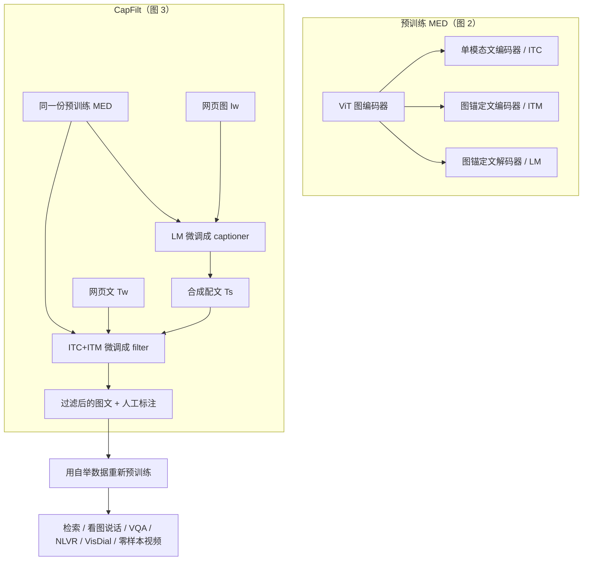

# BLIP：用「生成干净配文 + 滤掉噪声」把理解与生成接到同一套图文预训练上

<!-- release-date: 2022-01-28 -->

**本文依据**：`BLIP: Bootstrapping Language-Image Pre-training for Unified Vision-Language Understanding and Generation`，arXiv 2201.12086v2（页眉 `[cs.CV] 15 Feb 2022`），12 页。作者 Junnan Li、Dongxu Li、Caiming Xiong、Steven Hoi，Salesforce Research；封面写明代码 `https://github.com/salesforce/BLIP`（PDF p. 1）。盘上 PDF 为 v2；首发日取 arXiv 页面 Submission history 的 `[v1] Fri, 28 Jan 2022 12:49:48 UTC`（[arxiv.org/abs/2201.12086](https://arxiv.org/abs/2201.12086) 的 Submitted on 28 Jan 2022），这是外部补充，不来自 PDF 正文。封面未写会议录用，本文不补会议名。PDF 元数据 Subject 写着 `Proceedings of the International Conference on Machine Learning 2022`，与封面、页眉、arXiv 条目均不符，本文不把它当录用信息。文中数字均标 PDF 页码；标「外部补充」的段落不来自本文。

## 一句话

当时的图文预训练常卡在两头：编码器擅长检索、不好直接生成；编解码器擅长看图说话、检索又接不上。网上 alt-text 再放大，噪声仍在，监督并不干净。BLIP 用同一套 多模态混合编解码器（MED） 切三种工作模式，同时训对比、匹配和语言模型；再用 CapFilt（captioner + filter）给网页图生成合成配文、滤掉不匹配的原配文和合成配文，拿清洗后的语料重训（PDF p. 1）。14M 图上，相对同数据的 ALBEF，COCO 平均 recall@1 高 2.7%、VQA test 高 1.64%；摘要还写了看图说话 CIDEr 高 2.8%（PDF p. 1、p. 6–7）。零样本把图模型接到视频检索与视频问答上，也不另训时序模块（PDF p. 8）。

它解决的不是「再做一个更大的 CLIP」，而是另一句：统一架构要能理解也能生成；网上图文要规模，更要把噪声配文洗成可用监督。

读这篇可以按这条线走：先看 MED 三种模式如何分摊 ITC / ITM / LM，再看 CapFilt 如何用 captioner 与 filter 自举网页语料，最后用表 1–4 确认「清洗有效、多样性有效、共享策略有效」，用第 5 节看下游怎么改接线。

## 一、矛盾：任务接口不统一，数据噪声被规模盖住

Vision-language pre-training（VLP）已经把检索、看图说话、VQA 等下游抬起来了，作者指出两条硬伤（PDF p. 1）。

模型侧。 多数工作要么是编码器（CLIP、ALBEF），要么是编解码器（Cho 等人、SimVLM）。编码器不好直接接到看图说话这类生成任务；编解码器又没被成功用到图文检索上。把一切焊成单一 unified encoder-decoder（Zhou 等人）也会限制能力（PDF p. 1–2）。

数据侧。 CLIP、ALBEF、SimVLM 都在网上图文对上放大。规则过滤之后噪声仍普遍，但放大带来的精度上涨把噪声的负作用盖住了。作者明确写：网上文本对图文学习是 次优监督（PDF p. 1）。

相关工作把 CapFilt 解释成一种更适合 VLP 的知识蒸馏：captioner 用语义更丰富的合成配文把知识倒出来，filter 用「删噪声」把知识倒出来，而不是逼学生复述教师的类别分布（PDF p. 2）。数据增强那一节则强调：NLP 里用生成模型合成样本多半还在低资源纯语言任务上，他们要把合成配文做到大规模图文预训练里（PDF p. 2–3）。

贯穿全文的主轴因此是两件事叠在一起：一套参数要同时会判别配对和会写句子；网上语料要先自举清洗，再当预训练数据。

图 1（PDF p. 1）是 CapFilt 的示意，不是精度曲线。读图能看到两张网页图：左上是日落时的城市天际线，网上 alt-text 类似 「blue sky bakery in sunset park」，被标成 Filt 丢掉；右下是一块巧克力蛋糕，captioner 写出 「chocolate cake with cream frosting and chocolate sprinkles on top」，再过一遍 Filt。机制就是：网页图进 captioner 出合成句，原句和合成句都过 filter。

## 二、全景：一种 MED，三种激活，一份自举语料再训一遍

上图根据 PDF p. 2 图 2 与 p. 4 图 3 重画，是机制示意，不是实测曲线。

一次图文对：视觉 Transformer 只前向一次（更重），文本 Transformer 前向三次，分别激活三种功能算三项损失（PDF p. 3）。CapFilt 把这份 MED 在 COCO 上分别微调成 captioner 与 filter，对网页图造句、滤噪声，再把清洗数据与人工标注合并，预训练一个新模型（PDF p. 4）。

## 三、MED：三种模式，只在自注意力上分家

### 旧问题

理解任务要双向看整句、要判别配不配；生成任务要因果地写下一词。一套注意力很难同时当编码器又当解码器。完全不共享又浪费、多任务学不到公共的跨模态交互。

### 新设计

图像编码器是 ViT：切 patch、加 `[CLS]` 作全局特征。相对当时还常见的检测器区域特征，ViT 更省算力，也是 ALBEF、ViLT 那一代的做法（PDF p. 3）。

文本侧提出 multimodal mixture of Encoder-Decoder（MED），同一套权重按任务切三种功能（PDF p. 3，图 2 在 p. 2）：

1. 单模态编码器。 图、文分开编码。文编码器就是 BERT 那种：句首 `[CLS]` 汇总整句。这项只吃 ITC。
2. 图锚定的文本编码器。 每个 Transformer 块里，在自注意力和 FFN 之间插入一层 cross-attention，把视觉信息打进文本。句首加任务标记 `[Encode]`，用它的输出当图文对的多模态表示。这项吃 ITM。
3. 图锚定的文本解码器。 把上一模式里的 双向 自注意力换成 因果 自注意力。`[Decode]` 开序列，结束符收尾。这项吃 LM。

图 2 读图：三列标题分别是 ITC、ITM、LM。图编码器在左侧，颜色与三列顶部的视觉通路共用。ITM 列是 Bi Self-Att + Cross Attention + FFN；LM 列把 Bi Self-Att 换成 Causal Self-Att，Cross Attention 与 FFN 颜色与编码器相同，表示共享。文编码器输入 `[CLS] + …`，锚定编码器是 `[Encode] + …`，解码器是 `[Decode] + …`。中间示例句是 「a little girl holding a kitten next to a blue fence」。这是机制示意图。

### 工作机制：三项损失

ITC（image-text contrastive）。 激活单模态编码器，让正配对在对比空间靠近、负配对远离。实现跟 ALBEF：动量编码器出特征，动量端的软标签当目标，用来消化「负对里其实可能还有正对」这件事（PDF p. 3）。

ITM（image-text matching）。 激活图锚定编码器。线性 ITM 头做二分类：这对图文匹配还是不匹配。难负例挖掘同样跟 ALBEF：batch 里对比相似度更高的负对更可能被抽来算损失（PDF p. 3）。

LM（language modeling）。 激活图锚定解码器，自回归最大化文本似然，交叉熵加 0.1 的 label smoothing（PDF p. 3）。作者拿它对照当时 VLP 常用的 MLM：掩码填词不会教模型把视觉写成连贯配文；LM 才会。

参数共享：文编码器与文解码器 除自注意力层外全部共享（嵌入、CA、FFN）。理由写得很具体：编码/解码的差异主要由 SA 承担——编码器要双向建表示，解码器要因果预测下一词；CA 和 FFN 在两种任务里功能相近，共享既省参数又吃多任务（PDF p. 3–4）。

### 收益 / 代价 / 可迁移

表 3（PDF p. 5）在 14M、只用网页原文、不跑 CapFilt 时比共享策略：

| 共享 | 参数量 | COCO TR@1 / IR@1 | Flickr 零样本 TR@1 / IR@1 | COCO B@4 / CIDEr | NoCaps CIDEr / SPICE |
|---|---|---|---|---|---|
| 全部共享 | 224M | 77.3 / 59.5 | 93.1 / 81.0 | 37.2 / 125.9 | 100.9 / 13.1 |
| 除 CA 外共享 | 252M | 77.5 / 59.9 | 93.1 / 81.3 | 37.4 / 126.1 | 101.2 / 13.1 |
| 除 SA 外共享 | 252M | 78.4 / 60.7 | 93.9 / 82.1 | 38.0 / 127.8 | 102.2 / 13.9 |
| 不共享 | 361M | 78.3 / 60.5 | 93.6 / 81.9 | 37.8 / 127.4 | 101.8 / 13.9 |

「除 SA 外共享」比完全不共享更好，模型还从 361M 收到 252M。若把 SA 也共享，编码与解码打架，全面掉点（PDF p. 5–6）。

可迁移的是：多任务统一模型时，先问哪一层真正承担任务差异，只把那一层拆开。 这里答案是自注意力方向性，不是 cross-attention。

## 四、CapFilt：captioner 造句，filter 扔噪声，再训一个新模型

### 旧问题

人工图文对（COCO 一类）质量高、量不够。网上 alt-text 量大，常常对不上图里真正有的东西（PDF p. 3）。只靠规则过滤，噪声仍在。

### 新设计

Captioning and Filtering（CapFilt） 引入两个模块，都从同一份预训练 MED 初始化，在 COCO 上 各自 微调，过程被写成 lightweight（PDF p. 4，图 3）。

- Captioner：图锚定解码器，用 LM 微调。对每张网页图 $I_w$ 生成一句合成配文 $T_s$。
- Filter：图锚定编码器，用 ITC + ITM 微调。ITM 头判「不匹配」的文本视为噪声，从原始网页文 $T_w$ 和 合成文 $T_s$ 里一起删。
- 过滤后的网页对，加上人工标注对 $\{(I_h, T_h)\}$，组成新数据集，用来预训练 新的 MED。

图 3 读图：左列是 Model Pretraining，数据集 $D=\{I_h,T_h\}+\{I_w,T_w\}$ 训 MED；中间分两路，ITC&ITM 微调出 filter、LM 微调出 captioner；网页图过 captioner 得到 $(I_w,T_s)$，再和 $(I_w,T_w)$ 一起进 filter；右列输出过滤后的 $T_w$、$T_s$ 与人工对，箭头写 To data / To model。图注写明 captioner 与 filter 在小规模人工数据上分别微调。这是机制示意图。

### 工作机制：多样性比「更像标准答案」更值钱

合成句默认用 nucleus sampling，阈值 $p=0.9$（PDF p. 5）。对照 beam search：beam 追最高概率、句子更「安全」；nucleus 随机从累积概率超过 $p$ 的词集合里采样，句子更跳、也更吵。

表 2（PDF p. 5）14M 设定：

| 生成 | filter 报的噪声比 | COCO TR@1 / IR@1 | Flickr 零样本 TR@1 / IR@1 | COCO B@4 / CIDEr | NoCaps CIDEr |
|---|---|---|---|---|---|
| 无合成 | N.A. | 78.4 / 60.7 | 93.9 / 82.1 | 38.0 / 127.8 | 102.2 |
| Beam | 19% | 79.6 / 61.9 | 94.1 / 83.1 | 38.4 / 128.9 | 103.5 |
| Nucleus | 25% | 80.6 / 63.1 | 94.8 / 84.9 | 38.6 / 129.7 | 105.1 |

噪声比更高的 nucleus 反而全面更好。作者的假设：多样、意外的句子带来新信息；beam 的安全句在数据集里已经很常见，多出来的知识少（PDF p. 5）。

表 4（PDF p. 6）：若 CapFilt 阶段仍像预训练那样共享 captioner 与 filter，噪声比从 25% 掉到 8%，下游全面变差（COCO TR@1 80.6→79.8，NoCaps CIDEr 105.1→103.5）。作者归因 confirmation bias：共享后，captioner 造的噪声句更不容易被 filter 扔掉。

图 4（PDF p. 5）三列定性例子，绿字留下、红字丢掉。读图：日落湖面，网页句 「from bridge near my house」 被拒，合成句 「a flock of birds flying over a lake at sunset」 留下；门前盆栽，网页 「in front of a house door in Reichenfels, Austria」 留下，合成 「a potted plant sitting on top of a pile of rocks」 被拒；城堡，网页讲建造年代被拒，合成 「a large building with a lot of windows on it」 留下。附录图 6（PDF p. 12）同样绿留红扔：海滩租屋、门上标语、玻璃后的手、湖区天空、小白屋、粉岩等网页句常被扔，合成句有时对（月亮、彩色山树、带蜜蜂的小白花），有时也不对（同一句 「an outdoor walkway on a grass covered hill」 出现在两张很不像的图上仍被标绿——这是作者展示的过滤结果，不是我们额外评判）。

### 收益：不是因为训得更久，也不是接着旧权重接着训

表 1（PDF p. 5）是主消融，数字以该页印刷表为准：

14M（COCO+VG+CC+SBU，ViT-B/16）：

- 不用 C/F：COCO TR@1 78.4、IR@1 60.7；Flickr 零样本 93.9 / 82.1；COCO caption 38.0 / 127.8；NoCaps 102.2 / 13.9
- 只用 F：79.1 / 61.5，Flickr 94.1 / 82.8，caption 38.1 / 128.2
- 只用 C：79.7 / 62.0，Flickr 94.4 / 83.6，caption 38.4 / 128.9
- C 与 F 一起（都是 ViT-B）：80.6 / 63.1，Flickr 94.8 / 84.9，caption 38.6 / 129.7，NoCaps 105.1 / 14.4

129M（再加 LAION）上，C/F 一起仍抬点；用 ViT-L 的 captioner/filter 去自举、主模型仍可以是 ViT-B（表中 COCO caption CIDEr 到 133.3，NoCaps 109.6）；ViT-L 主模型再加 C/F：COCO TR@1 82.4、IR@1 65.1，NoCaps CIDEr 113.2（PDF p. 5）。

表 12（PDF p. 9）：把原始网页文复制到每 epoch 样本数与自举集相同（15.3M → 24.7M 文本），精度几乎不动甚至略掉；同样 24.7M、走 CapFilt 才到 TR@1 80.6。所以增益 不是更长训练。

表 13（PDF p. 9）：在旧预训练权重上用自举数据 continue，不比从零训新模型更好（Flickr 零样本 TR@1 94.5 vs 94.8，NoCaps CIDEr 104.5 vs 105.1）。作者把它对齐知识蒸馏常识：学生不要从教师初始化。

### 代价 / 边界 / 可迁移

CapFilt 要先有一份还能用的 MED，再在 COCO 上微调两个头，再对网页图做一遍生成和 ITM 过滤，最后 重训。计算账单是「预训练 × 接近两轮」加生成语料。确认偏差说明 captioner 与 filter 必须解耦。合成句并非总比网页句干净，filter 会丢掉部分合成句、留下部分网页句——清洗不是「生成的一定更好」。

可迁移：噪声监督不要只靠放大；可以用模型自己生成、再让另一个头按匹配度删。生成要多样性，过滤不要和生成共享到确认偏差。自举后的语料拿去训新模型，而不是在教师权重上接着蹭。

## 五、数据与训练 recipe

实现 PyTorch，预训练在 两个 16-GPU 节点 上（PDF p. 4）。图 Transformer 从 ImageNet 预训练 ViT 初始化，文 Transformer 从 BERT$_{\mathrm{base}}$ 初始化。两种 ViT：ViT-B/16、ViT-L/16。文中默认名叫 「BLIP」 的结果是 ViT-B（PDF p. 4）。

- 20 epoch；batch 2880（ViT-B）/ 2400（ViT-L）
- AdamW，weight decay 0.05
- 学习率 warmup 到 $3\times 10^{-4}$（ViT-B）/ $2\times 10^{-4}$（ViT-L），再按 0.85 线性衰减
- 预训练随机裁 224×224，微调分辨率提到 384×384（VQA 附录改为 480×480）

14M 与 ALBEF 同一批：COCO、Visual Genome、Conceptual Captions、Conceptual 12M、SBU（PDF p. 4）。另试 LAION：只下载短边大于 256 的图，得到 115M 图，文比 14M 更吵；因体积大，每个 epoch 只用 1/5（PDF p. 4 脚注）。加上原 14M 即表中的 129M。

附录表 15（PDF p. 12）：

| | COCO | VG | SBU | CC3M | CC12M | LAION |
|---|---|---|---|---|---|---|
| 图 | 113K | 100K | 860K | 3M | 10M | 115M |
| 文 | 567K | 769K | 860K | 3M | 10M | 115M |

微调超参见附录表 14（PDF p. 12）：一律 AdamW、weight decay 0.05、余弦 lr。分辨率 384，VQA 480。Retrieval：lr $1\times 10^{-5}$（ViT-L 为 $5\times 10^{-6}$），batch 256，6 epoch。Captioning：lr $1\times 10^{-5}$（ViT-L $2\times 10^{-6}$），batch 256，5 epoch。VQA：lr $2\times 10^{-5}$，256，10 epoch。NLVR$^2$：lr $3\times 10^{-5}$，256，15 epoch。VisDial：lr $2\times 10^{-5}$，batch 240，20 epoch。

论文没写墙钟时间、 autotune 细节、混合精度，也没写 nucleus 之外的解码超参（温度等）。

## 六、下游怎么接，以及和 SOTA 比什么

第 5 节按任务改接法，图 5（PDF p. 7）是机制示意。作者声明不把 SNLI-VE 放进基准，因为测试集被报过噪声（PDF p. 6 脚注）。

### 图文检索

微调用 ITC + ITM。推理跟 ALBEF：先按特征相似度取 $k$ 个候选，再按成对 ITM 重排；$k=256$（COCO）、$k=128$（Flickr30K）（PDF p. 6）。Karpathy 划分：COCO 113K / 5k / 5k，Flickr30K 29k / 1k / 1k（PDF p. 12）。

表 5（PDF p. 6）微调：14M 的 BLIP 在 COCO 上 TR@1 80.6、IR@1 63.1，相对同 14M 的 ALBEF（77.6 / 60.7）平均 recall@1 高 2.7%（PDF p. 6）。129M 的 ViT-L：COCO 82.4 / 65.1。Flickr30K 上 14M 已是 TR@1 96.6、IR@1 87.2。

表 6（PDF p. 6）零样本：COCO 微调模型直接转到 Flickr30K。14M 的 BLIP TR@1 94.8、IR@1 84.9，高于 CLIP-400M（88.0 / 68.7）、ALIGN-1.8B（88.6 / 75.7）、ALBEF-14M（94.1 / 82.8）。129M ViT-L 到 96.7 / 86.7。

### 看图说话

COCO 上用 LM 微调，再评 NoCaps val 与 COCO Karpathy test。句首加 prompt 「a picture of」，作者说略好（PDF p. 6）。推理 beam size 3，最大长度 20（PDF p. 12）。

表 7（PDF p. 7）：14M 的 BLIP，NoCaps overall CIDEr 105.1 / SPICE 14.4，COCO B@4 38.6 / CIDEr 129.7。129M 的 BLIP$_{\mathrm{CapFilt\text{-}L}}$ NoCaps overall 109.6，COCO CIDEr 133.3，与 LEMON$_{\mathrm{base}}$ 在 200M 上的 COCO CIDEr 133.3 持平量级。ViT-L 129M：NoCaps 113.2，COCO 40.4 / 136.7。LEMON 需要在 2.5M 带框数据上预训练的检测器，输入 800×1333；BLIP 无检测器，384×384。SimVLM$_{\mathrm{huge}}$ 用 1.8B 数据、更大视觉骨干，COCO CIDEr 143.3，仍高于 BLIP 的 136.7（PDF p. 7）。摘要里的 captioning +2.8% CIDEr 是相对当时对比方法的宣传句（PDF p. 1），具体对照以表 7 为准。

### VQA

不做成多答案分类，而做成 答案生成（跟 ALBEF）。图 5(a)：图编码器 + 问题进 `[Encode]+Q` 的编码器，答案解码器从 `[Decode]` 生成。LM 损失、真值答案当目标（PDF p. 7）。VQA2.0：83k / 41k / 81k 图，train+val 都训，并加入 VG 样本；推理时解码器对 3128 个候选答案排序（PDF p. 12）。

表 8（PDF p. 7）：14M 的 BLIP test-dev 77.54、test-std 77.62，相对 ALBEF 76.04，test 高 +1.64%（PDF p. 7）。129M 到 78.24 / 78.17；CapFilt-L 的 test-std 78.32。SimVLM$_{\mathrm{base}}$ 用 1.8B 数据，test-std 78.14。

### NLVR$^2$

一句话是否同时描述两张图。图 5(b)：图锚定编码器每个块里 两路 cross-attention 分别看两张图，输出合并再进 FFN；两路 CA 从同一预训练权重初始化。前 6 层 merge 用平均池化，第 6–12 层 concat 再线性投影。`[Encode]` 上接 MLP 分类（PDF p. 8）。表 8：14M 的 BLIP 在 NLVR$^2$ test-P 82.30，dev 82.67；ALBEF 因多做了一步定制预训练，test-P 83.14 仍高一点。作者观察：再加网页图对 NLVR$^2$ 帮助不大，可能是网页域和下游域差得远（PDF p. 8）。

### VisDial

判别式设定：在候选答案池里排序。图 5(c)：图与 caption 嵌入拼接，经 CA 进 dialog encoder；ITM 判断在完整对话历史与图-标题条件下答案真假（PDF p. 8）。表 9（PDF p. 8）VisDial v1.0 val：BLIP MRR 69.41、R@1 56.44、R@5 85.90、R@10 93.30、MR 3.20，高于 VD-BERT 与额外用了 VQA 数据的 VD-ViLBERT。

### 零样本接到视频

COCO 检索模型与 VQA 模型直接评 text-to-video retrieval 与 videoQA。视频：均匀抽 $n$ 帧（检索 $n=8$，QA $n=16$），帧特征拼成一条序列，丢掉全部时序（PDF p. 8）。

表 10 MSRVTT 1k：零样本 BLIP R@1 43.3、R@5 65.6、R@10 74.7、MdR 2，高于 FiT 的 18.7，也高于若干微调方法（ClipBERT 22.0、VideoCLIP 30.9）；相对这些微调模型 R@1 高 +12.4%（PDF p. 8）。表 11：零样本 MSRVTT-QA 19.2、MSVD-QA 35.2，远高于 VQA-T 的零样本 2.9 / 7.5，但仍低于 VQA-T 微调的 41.5 / 46.3（PDF p. 8）。作者说若把 ViT 换成 TimeSformer 再在视频上微调，还可以再涨；本文没有做这个实验。

## 七、作者承认的限制与未写清的东西

结论里点了三条还没做的方向：多轮自举；每张图生成多句合成配文；多个不同 captioner/filter 集成（PDF p. 9）。视频实验没有时序建模。NLVR$^2$ 吃不进更多网页图。CapFilt 依赖 COCO 这种小而干净的人工集来微调两个模块——没有这块金标，自举链路怎么走，论文没写。

未公开或本文无法从 PDF 核实的：单卡/集群的墙钟与 FLOPs；LAION 子集的精确过滤列表；nucleus 的其余解码超参；filter 的 ITM 阈值是否就是 0.5；自举后各数据源还剩多少句；GitHub 仓库在论文之后的演化。这篇材料只覆盖 MED 与 CapFilt，不讨论其后的后续工作。

CLIP 与 ALBEF 在文中只作为被引用的前作：CLIP 是编码器路线与 ITC 的代表，ALBEF 提供了 ITC 动量软标签、难负例、14M 数据配方，以及若干下游接法（PDF p. 1–4、p. 6–7）。

## 八、可迁移启发（收回全景）

1. 统一理解与生成时，先拆自注意力方向，再共享交叉注意力与 FFN。 表 3 说明「全共享」和「全不共享」都不是最优。
2. 网上图文的瓶颈常常是噪声而不是张数。 复制网页文把 epoch 拉长（表 12）几乎无用；生成+过滤才有用。
3. 合成监督要多样。 噪声比更高的 nucleus 优于更干净的 beam（表 2）。
4. 生成器与过滤器不要共享到互相包庇（表 4）。
5. 自举语料用来训新学生，而不是在教师上 continue（表 13）。
6. 下游改接法，不必为每个任务重做预训练。 检索用 ITC+ITM 重排，caption/VQA 用解码器，NLVR 复制一路 CA，视频甚至只拼帧。
7. 零样本跨模态迁移可以先极度简单。 均匀抽帧、无视时序，已经能在 MSRVTT 检索上超过一批专用微调模型；要再涨，作者指向加时序骨干，而不是先把图像预训练推倒。

## 关键词回看

MED：一份图 ViT + 一份可切换的文本 Transformer，三种模式分别跑 ITC / ITM / LM。CapFilt：COCO 上微调出的 captioner（造句）与 filter（ITM 丢不匹配），清洗网页图文后再预训练新模型。Nucleus sampling：按核概率集合随机解码，换多样性。难负例 / 动量 ITC：直接继承 ALBEF 的理解侧技巧。整篇文章的判断句仍然是：架构统一解决「检索 vs 生成」接不上；数据自举解决「网上句对不上图」。

## 参考资料

- 本文 PDF：仓库内 `readings/_src/多模态理解与 Omni/BLIP.pdf`（arXiv:2201.12086v2，12 页）
- arXiv 条目（外部补充，用于 v1 日期）：https://arxiv.org/abs/2201.12086
- 封面代码：https://github.com/salesforce/BLIP
- 文中作为前作出现的 CLIP、ALBEF，只引用本 PDF 已写的对照，不另开一篇的结论
