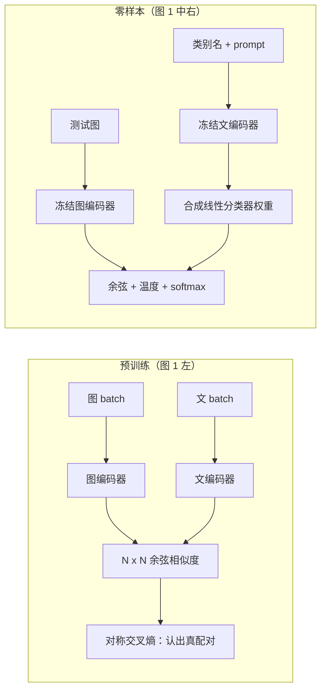

# CLIP：用「哪句文字配哪张图」把视觉模型接到开放概念上

<!-- release-date: 2021-02-26 -->

**本文依据**：`Learning Transferable Visual Models From Natural Language Supervision`，arXiv 2103.00020v1（2021-02-26），48 页。作者 Alec Radford、Jong Wook Kim 等（并列一作），OpenAI, San Francisco, CA 94110, USA；通讯 `{alec, jongwook}@openai.com`。盘上 PDF 页眉写明 arXiv:2103.00020v1 [cs.CV] 26 Feb 2021。首发日取 arXiv v1 提交日 2021-02-26（[arxiv.org/abs/2103.00020](https://arxiv.org/abs/2103.00020) 的 Submission history：`[v1] Fri, 26 Feb 2021 19:04:58 UTC`；这是外部补充，不来自 PDF 正文）。文中所有数字都标了 PDF 页码；标「外部补充」的段落不来自本文。PDF 元数据里的 Subject 写着 `Proceedings of the International Conference on Machine Learning 2020`，与封面、页眉、arXiv 条目均不符，本文不把它当录用信息。

## 一句话

视觉默认是在固定类别上做 1-of-N 分类：换一个概念就要再标一批图。CLIP 把预训练改成一个更便宜的代理任务——在一个 batch 里判断哪句文字配哪张图——在从网上收集的 4 亿图文对上从零训练（PDF p. 1）。训完之后，下游类别名被文本编码器写成线性分类器的权重，不必再看该数据集的训练样本。零样本 ImageNet 上，最好的 CLIP 到 76.2%，对齐当年 ResNet-50 的监督精度，却没用那 128 万张标注图（PDF p. 6–7）。

它解决的不是「对比学习比生成式看图说话更懂图」，而是另一句：**自然语言能监督开放视觉概念，但逐词生成太贵；把任务降成配对判别，规模才上得去，零样本接口才跟得上。**

## 一、矛盾：视觉还卡在封闭标签上，语言这边已经把任务接口打开了

NLP 这几年的故事是：用自回归、掩码这类与任务无关的目标，在网页文本上把计算、容量和数据一起放大；再把输入输出都收成「文本到文本」，下游不必换头（PDF p. 1）。GPT-3 一类系统已经能在很多任务上接近专用模型，几乎不再吃任务标注（PDF p. 1）。

视觉这边默认仍是 ImageNet 那种众包金标（PDF p. 1）。系统很强，但概念集合是焊死的：换一个视觉概念，就要再标一批图（PDF p. 1 摘要）。作者问的是：直接从网上的图文对里学，会不会也出现类似突破（PDF p. 1）。

这条路并不新。二十年前就有人用配图文档里的名词、形容词做检索（PDF p. 1）；后来有人用标题、描述、标签训 CNN，迁移效果接近 ImageNet 预训练（PDF p. 1–2）。Visual N-Grams 已经能零样本转到别的分类集，但 ImageNet 上只有 11.5%，远低于当时 SOTA 的 88.4%，也低于经典视觉方法的约 50%（PDF p. 2）。另一条更「务实」的中间路线是弱监督但类别仍窄：Instagram 上预测与 ImageNet 相关的 hashtag，或在嘈杂的 JFT-300M 上预测固定类（PDF p. 2）。Mahajan 等人把监督收成 1000 类，Kolesnikov 等人收成 18291 类；输出还是静态 softmax，没有按新描述动态出头的机制（PDF p. 2）。

规模也不在一个量级。弱监督大模型能训加速器·年、百万到十亿张图；VirTex、ICMLM、ConVIRT 这类「从自然语言学图」的工作当时还在加速器·日、一二十万张图上（PDF p. 2）。CLIP 要做的，就是把这条线拉到能跟大视觉预训练对话的规模，并认真量零样本迁移（PDF p. 2）。

贯穿全文的主轴因此很清楚：**封闭标签便宜好评、但概念集合死掉；开放文本概念集合活，但生成式目标太难、太贵。** 后面所有设计都在给「配对判别」让路。

## 二、全景：两个编码器，一个相似度矩阵，测试时用文字合成分类器

图 1（PDF p. 2）把系统画成三块。视觉读图：左栏是对比预训练——图编码器、文编码器各自出向量，batch 里构成 $N\times N$ 的点积矩阵，对角是真配对；中栏是用「A photo of a {object}.」这类模板把类别名送进文编码器；右栏是测试时把图向量和各类文本向量再做一次同样的点积。这是机制示意图，不是实测曲线。

用一句话串起来：预训练学的是「图和文在同一空间里谁该靠近」；下游分类不再训练新头，只是把类别描述编码成那一组权重。

上图根据 PDF p. 2 图 1 重画，是机制示意。

## 三、数据：现成图文集不够大，也不够像网上的自然语言

现成三条路都对不上作者想要的规模（PDF p. 3）：

- MS-COCO、Visual Genome 质量高，但大约各 10 万训练照片；
- YFCC100M 有 1 亿张，元数据又稀又乱，很多「标题」其实是 `20160716_113957.JPG` 或相机曝光参数；滤成英文自然语言标题/描述后只剩约 1500 万，和 ImageNet 一个量级；
- 对比之下，当时已有系统能在最多 35 亿 Instagram 照片上训（PDF p. 3）。

他们另造 **WIT（WebImageText）** ：从网上多种公开来源收集 **4 亿** 图文对（PDF p. 3）。为了覆盖尽量宽的视觉概念，构造时用约 **50 万** 条查询去搜图文对；查询底表是英文维基里出现不少于 100 次的词，再补高频二元组、高搜索量维基条目标题，以及尚未进表的 WordNet synset（PDF p. 3–4 脚注）。每条查询最多保留 **2 万** 对，做近似的类平衡（PDF p. 4）。作者说总词数和训 GPT-2 的 WebText 差不多（PDF p. 4）。

WIT 的原始图、原始网页、精确过滤规则论文没公开；能迁移的是原则：**评现有小图文集会低估「网上自然语言」这条路，要自己按查询覆盖去造规模。**

## 四、目标：不要逐词复述配文，只要认出「哪句配哪张」

算力账单先摆出来。Mahajan 等人的 ResNeXt101-32x48d 大约 19 GPU·年；Xie 等人的 Noisy Student EfficientNet-L2 大约 33 TPUv3 core·年——而它们只预测 1000 个 ImageNet 类（PDF p. 4）。要从开放文本里学开放视觉概念，效率必须当第一指标（PDF p. 4）。

他们先试过 VirTex 那种路：图 CNN 和文 Transformer 从零联合训练，去预测整句配文。63M 参数的 Transformer 语言模型，算力已经是 ResNet-50 图编码器的两倍，零样本认 ImageNet 类却比「预测该句 bag-of-words」的基线还慢 **3 倍**（PDF p. 3 图 2，p. 4）。图 2 视觉可读：横轴是处理过的图像数（2M 到 400M），纵轴是零样本 ImageNet 精度；三条线分别是 Transformer Language Model、Bag of Words Prediction、Bag of Words Contrastive（CLIP）；图注写对比目标相对 BoW 预测再快 **4 倍**。这是实测效率曲线。

两个生成式目标的共同点：都在逼模型复述配图文字的精确用词。网上配文千奇百怪，这件事很难（PDF p. 4）。对比表示学习里已有证据：对比目标往往比等价的预测目标学得更好，生成式图像模型要达到同样表示质量，算力能贵一个数量级以上（PDF p. 4）。于是他们把任务降成：**不要逐词，只要判断这段文字整体是否配这张图**（PDF p. 4）。从同一个 BoW 基线换成对比目标，零样本 ImageNet 效率再涨约 4 倍（PDF p. 3–4）。相对最初的 caption 基线，对比目标累计大约 **12 倍** 效率（3× 再 4×）。

给定 $N$ 对图文，CLIP 要在 $N\times N$ 种可能配对里认出真正发生的 $N$ 对（PDF p. 4）。图、文编码器把样本映到同一多模态空间，最大化真配对的余弦相似度，最小化 $N^2-N$ 个错误配对；损失是相似度上的对称交叉熵（PDF p. 4）。这个 batch 构造和目标，作者追溯到度量学习里的 multi-class N-pair、InfoNCE，以及医学影像里的 ConVIRT（PDF p. 4）。

图 3（PDF p. 5）给出类 NumPy 伪代码。视觉读图：先各自编码，线性投到嵌入空间并 L2 归一化，logits 是

$$\mathrm{logits} = I_e T_e^\top \cdot e^{t}$$

再对行、列各做一次交叉熵后取平均。$t$ 是可学习温度。这是实现示意，不是实测。

相对 ConVIRT，他们因为数据极大、过拟合不是主忧，做了简化（PDF p. 4–5）：

- 图、文编码器都从零训，不用 ImageNet 或语言模型初始化；
- 表示到对比空间只用线性投影，不用 SimCLR 那种非线性投影；作者说两边训练效率看不出差别；
- 去掉从多句里均匀抽一句的文本变换，因为很多样本本来就一句；
- 图像增强只保留 resize 后的随机正方形裁剪；
- 温度 $\tau$ 当成对数参数化的可学习标量直接优化，避免当超参调。

**收益** ：同样算力下零样本涨得更快。**代价** ：丢掉逐词生成能力，测试时不能自由「写出」未见过的句子，只能在给定候选里打分（PDF p. 19）。**可迁移** ：当监督信号噪声大、复述代价高时，先问能不能改成「认出配对」；温度放进图里学，而不是先网格搜。

## 五、模型：ResNet 加注意力池化，ViT 几乎原样；文本侧故意不对称放大

图编码器两条骨架（PDF p. 4–5）。

ResNet-50 作底，改了 ResNet-D、抗混叠 rect-2 blur pooling，并把全局平均池化换成注意力池化：一层 transformer 风格的多头 QKV，query 由全局平均池化特征来条件（PDF p. 4–5）。ViT 几乎跟 Dosovitskiy 等人原实现走，只在 patch+位置嵌入合入 Transformer 前多一层 LayerNorm，初始化略有不同（PDF p. 5）。

文本编码器是 Transformer，改动跟 GPT-2 那套一致。基线规模：约 **63M** 参数、12 层、宽 512、8 头（PDF p. 5）。文本是小写 BPE，词表 **49152**；最长序列封顶 **76**（PDF p. 5）。序列两端加 `[SOS]` / `[EOS]`，最高层在 `[EOS]` 处的激活当作句向量，LayerNorm 后再线性投到多模态空间（PDF p. 5）。文本侧用了掩码自注意力，为的是将来还能接预训练 LM 或加语言模型辅助目标，但本文没探（PDF p. 5）。

ResNet 放大时，不算力只加宽或只加深，而是宽、深、分辨率大致均分额外算力（PDF p. 5）。文本编码器只按 ResNet 宽度的增幅同比加宽，**完全不加深度**——他们发现 CLIP 对文本容量更不敏感（PDF p. 5）。

共训 5 个 ResNet、3 个 ViT（PDF p. 5）：RN50、RN101，以及约 4× / 16× / 64× ResNet-50 算力的 RN50x4、RN50x16、RN50x64；ViT-B/32、ViT-B/16、ViT-L/14。一律 **32 epoch**。Adam + 解耦 weight decay（增益和 bias 不加衰减），余弦学习率（PDF p. 5）。超参在 RN50 上训 1 epoch 用网格/随机/手调定，再启发式搬到更大模型（PDF p. 5）。可学习温度初值等价于 0.07，并裁剪使 logits 缩放不超过 100，否则会不稳（PDF p. 5）。

系统侧写得比较具体（PDF p. 5）：

- minibatch **32768**；
- 混合精度；
- 梯度检查点、半精度 Adam 统计、半精度并随机舍入的文本编码器权重，用来再省显存；
- 相似度计算分片：每张 GPU 只算自己那一块局部 batch 所需的成对相似度。

最大 ResNet RN50x64：**592** 张 V100 上 **18** 天；最大 ViT：**256** 张 V100 上 **12** 天（PDF p. 5）。ViT-L/14 还按 FixRes 思路，在 **336** 像素上再预训练 **1** 个 epoch，记作 ViT-L/14@336px；文中默认「CLIP」指这个最好的模型（PDF p. 5）。

**可迁移** ：对比损失的显存炸弹在 $N\times N$ 相似度，不在单塔；分片是规模化时的第一刀。文本塔不必和视觉塔对称放大。论文没写通信库、具体并行策略和优化器超参表。

## 六、零样本：把「配对」原封不动拿来当分类

作者把零样本说得比视觉文献里「未见类别」更宽：迁移到 **未见数据集** ，当作未见任务的代理（PDF p. 6）。不少基准其实是在测分布偏移，而不是测一个真实任务；CIFAR-10 测的是 TinyImages 那种分布，零样本在这里更像稳健性评估（PDF p. 6）。他们明确对标 Visual N-Grams 那种「用类名打分」的协议（PDF p. 6）。

机制：对每个数据集，把全部类名当作候选配文，取 CLIP 认为最可能的图文对（PDF p. 6）。图嵌入与各文本嵌入算余弦，乘温度 $\tau$，softmax 成分布。这层就是：L2 归一化输入、L2 归一化权重、无偏置、带温度的多项逻辑回归（PDF p. 6）。图编码器是视觉骨干；文编码器被看成超网络，按文本生成线性分类器权重（PDF p. 6）。按这个看法，每步预训练都在优化一个随机代理数据集：每类 1 张图、一共 32768 类、类由自然语言定义（PDF p. 6）。评测时把合成好的分类器缓存，摊到整个测试集上（PDF p. 6）。

表 1（PDF p. 7）：Visual N-Grams 在 aYahoo / ImageNet / SUN 上是 72.4 / 11.5 / 23.0；CLIP 是 98.4 / 76.2 / 58.5。最好 CLIP 的 ImageNet top-5 约 **95%**，对齐 Inception-V4（PDF p. 6）。作者立刻声明：这不是公平方法对比——数据大约 10 倍、单次前向近 100 倍、训练算力可能超过 1000 倍，架构也新一代（PDF p. 7）。更近的对照：在 Visual N-Grams 用过的 YFCC100M 上从零训 CLIP ResNet-50，大约 **1 个 V100 GPU·日** 就能追上对方报告的 ImageNet 精度（PDF p. 7）。aYahoo 上 CLIP 把错误数减了约 **95%**；SUN 上精度翻倍还多（PDF p. 7）。评测后来扩到 30 多个数据集、对照 50 多个已有系统（PDF p. 7）。

### Prompt 与集成：把「单词标签」补回网上那种句子

标准分类集往往只给数字 id，类名是事后映射；有的集甚至不带英文名，零样本直接做不了（PDF p. 7）。两个具体坑（PDF p. 7）：

1. 多义。没有上下文时，文编码器分不清 ImageNet 里「crane」是吊车还是鹤；Oxford-IIIT Pet 里的 boxer 是狗还是拳手。
2. 预训练配文很少是单个词，多半是整句。默认模板 `A photo of a {label}.` 能把分布拉近；仅这一条就给 ImageNet **+1.3%**（PDF p. 7）。

再按任务改模板：宠物写成 `A photo of a {label}, a type of pet.`；食物、飞机同理；OCR 给要认的字加引号；卫星图用 `a satellite photo of a {label}.`（PDF p. 8）。集成不在概率空间，而在嵌入空间平均多条 prompt（如 big / small），摊销后成本和单分类器一样（PDF p. 8）。ImageNet 上集成 **80** 条上下文，相对单条默认模板再 **+3.5%**；prompt 工程加集成合计约 **+5%**（PDF p. 8）。图 4（PDF p. 7）说这大约等于基线零样本方法加 **4 倍** 算力，但摊到多次预测上几乎免费。视觉读图：横轴模型 GFLOPs（6.1 到 265.9），纵轴 36 个数据集平均分，两条线相差约 5 个点。

### 和监督线性探针比：赢在「动词」和开放概念，输在专科和抽象

对照：在经典 ResNet-50 特征上拟合带正则的全监督逻辑回归（PDF p. 8）。图 5（PDF p. 8）覆盖 27 个数据集：零样本 CLIP 赢 **16 / 27**。细粒度两极分化：Stanford Cars、Food101 高出 20 个点以上（+28.9、+22.5）；Flowers102、FGVCAircraft 低 10 个点以上（PDF p. 8）。作者怀疑主要是 WIT 和 ImageNet 对每项任务的监督量不同（PDF p. 8）。一般物体分类（ImageNet、CIFAR、STL10、VOC）接近，CLIP 略好；STL10 上 CLIP **99.3%**，作者称为当时新 SOTA，且没用训练样本（PDF p. 8）。视频动作：Kinetics700 **+14.5**，UCF101 **+7.7**，推测语言对动词的监督比 ImageNet 那种名词中心更宽（PDF p. 8）。

明显弱的：卫星（EuroSAT、RESISC45）、淋巴结肿瘤（PatchCamelyon）、合成场景计数（CLEVRCounts）、交通标志（GTSRB）、到最近车辆的距离（KITTI Distance）（PDF p. 8–9）。非专家人类在计数、卫星、交通标志上仍稳健，说明零样本 CLIP 离复杂任务还远（PDF p. 9）。作者也提醒：像淋巴结分类这种人类同样没有先验的任务，用零样本而不是少样本当指标，本身是否有意义，并不清楚（PDF p. 9）。

图 6（PDF p. 9）：零样本 CLIP 对齐同一特征空间上 **4-shot** 逻辑回归的平均表现，并接近公开模型里最好的 **16-shot**（PDF p. 9）。直觉上零样本应弱于 1-shot，结果相反，因为语言能把概念「说出来」，而少样本必须从例子里反推——一张图里概念太多，假设空间太大（PDF p. 9）。把零样本权重当少样本先验（L2 拉向生成权重）并不成功：超参常选到正则极大，少样本分类器退化成零样本本身（PDF p. 9）。

图 7（PDF p. 10）用 1/2/4/8/16-shot 和全监督之间的对数线性插值，估计「多少标注/类才能追上零样本」。跨数据集从不到 1 张到 **184** 张（FER2013）；中位数 **5.4**，均值 **20.8**；ImageNet 上对齐 **16-shot**（PDF p. 10）。Flowers102 和 EuroSAT 甚至不如 1-shot（PDF p. 10）。图 8：零样本与线性探针相关系数 **0.82**（$p<10^{-6}$），多数数据集仍低 10–25 个点；只有 5 个数据集逼近全监督（差 ≤3 点），且这 5 个零样本和全监督都超过 90%（PDF p. 10）。回归斜率点估计：全监督每好 1%，零样本好 1.28%，但 95% 区间仍包含小于 1 的值（0.93–1.79）（PDF p. 10）。

图 9（PDF p. 11）：5 个 ResNet CLIP 在 36 个数据集、39 项评估上的平均误差，相对模型算力呈 log-log 线性，跨越约 **44×** 算力（PDF p. 10–11）。总趋势光滑，单项评估噪声大，作者不确定是 run 间方差还是有的任务真非单调（PDF p. 11）。

**可迁移** ：下游接口要和预训练目标同构——CLIP 预训练就是「随机类名的配对」，所以类名 prompt 几乎零成本。模板要补的是预训练配文的句式，不是文学修辞。

## 七、表示学习：线性探针故意不微调，为的是揭预训练有没有学到通用特征

作者知道微调通常强于线性分类（PDF p. 11），仍选线性探针，原因有三（PDF p. 11）：工作目标是任务/数据无关的预训练，微调会掩盖预训练没学到的东西；线性头灵活度低，开发时反馈更干净；CLIP 的零样本分类器本身也是线性的，便于对照。27 数据集 × 66 模型意味着 1782 次评估，微调超参空间太大，线性头几乎不用调（PDF p. 11）。

图 10（PDF p. 12）分两套平均。左：Kornblith 等人的 12 数据集。小 CLIP（RN50/101）强于 ImageNet-1K 上的 ResNet（BiT-S 和原版），弱于 ImageNet-21K 的 BiT-M，也弱于相近算力的 EfficientNet；但 CLIP 缩放好，最大 RN50x64 在总分和算力效率上略超当时最好的 Noisy Student EfficientNet-L2（PDF p. 11）。CLIP-ViT 大约比 CLIP-ResNet **3×** 算力更高效，和 ViT 原文「大数据上 Transformer 更省算力」定性一致（PDF p. 11）。最好整体模型是 ViT-L/14@336px，12 数据集平均比此前最好高 **2.6%**（PDF p. 11）。

右：更宽的 27 数据集。所有尺度的 CLIP 在算力效率上都超过对照系统；相对此前最好的平均分优势从 2.6% 升到 **5%**（PDF p. 12）。自监督（如 SimCLRv2）在这套更宽评测上相对 BiT-M 更好，说明任务覆盖会改「谁更通用」的结论（PDF p. 12）。

图 11（PDF p. 13）：最好 CLIP 对最好 ImageNet 模型（Noisy Student EfficientNet-L2）在 27 集上 **21 胜**。最大优势在 OCR（SST2 +23.6）、地理与场景（Country211 +22.7）、仇恨表情包、细粒度车和交通标志（Stanford Cars +15.9，GTSRB +14.7）以及视频动作（PDF p. 12–13）。ImageNet-1K 把所有交通标志收成一个类，可能鼓励表示塌掉类内细节（PDF p. 12）。EfficientNet 相对更好的是它自己训过的 ImageNet，以及 CIFAR 这种低分辨率（CLIP 几乎没有基于尺度的增强），还有 PatchCamelyon、CLEVRCounts 这种两边都还不高的任务（PDF p. 12–13）。

图 12（PDF p. 14）：在相近 ImageNet 精度下，CLIP 特征的迁移分更高，作者解读为 ImageNet 预训练对「ImageNet 任务」有过拟合（PDF p. 14）。视觉读图：横轴 ImageNet 分数，纵轴迁移分数，CLIP 点在对照云的上方。这是实测散点，不是示意。

## 八、分布偏移：零样本不能「刷」ImageNet 上的虚假相关

2015 年有模型在 ImageNet 测试集上超人类的宣布，但后续自然分布基准上精度掉得很厉害（PDF p. 13）。常见解释是：模型擅长抓训练集上成立、换分布就失效的相关（PDF p. 13）。作者警告：这些研究几乎都限 ImageNet 训练模型，不能直接推广到深度学习全体（PDF p. 13）。

对照 Taori 等人收集的 7 个自然偏移：ImageNetV2、Sketch、Youtube-BB、ImageNet-Vid、ObjectNet、ImageNet-A、ImageNet-R（PDF p. 13）。ResNet-101 在这些偏移上的错误大约是 ImageNet 验证集的 **5 倍**（PDF p. 13）。有效稳健性指：超出「ImageNet 精度预测出的偏移精度」的那部分（PDF p. 13）。

零样本模型没在目标分布上训，理论上更难吃只在该分布上成立的捷径（但仍可能吃预训练和评测共享的捷径）（PDF p. 14）。图 13（PDF p. 15）：零样本 CLIP 大幅提高有效稳健性，把 ImageNet 精度与偏移精度之间的缺口最多缩小约 **75%**（PDF p. 14）。右表（同一 ImageNet 精度的 ResNet-101 vs CLIP ViT-L/14@336px）：ImageNet 都是 76.2；ImageNetV2 64.3 vs 70.1（+5.8）；ImageNet-R 37.7 vs 88.9（+51.2）；ObjectNet 32.6 vs 72.3（+39.7）；Sketch 25.2 vs 60.2（+35.0）；ImageNet-A 2.7 vs 77.1（+74.4）（PDF p. 15）。香蕉那一行是跨数据集的定性示意。

把 CLIP 用 L2 正则逻辑回归适应 ImageNet 训练集后：ImageNet 精度 **+9.2%** 到 **85.4%**，追上 2018 年 Mahajan 等人的 SOTA，但 7 个偏移上的平均精度反而略降（PDF p. 14）。分数据集：ImageNetV2 仍升，ImageNet-R −4.7、ObjectNet −3.8、Sketch −2.8、ImageNet-A −1.9（PDF p. 14–16）。作者把这 9.2 个点称作大约三年 SOTA 的跨度，却换不成偏移上的平均提升，并公开表示对「是不是在吃虚假相关」没有自信答案（PDF p. 16）。

另一刀：7 个偏移的类别并不总与 ImageNet 的 1000 类对齐。Youtube-BB / ImageNet-Vid 是超类；Taori 等人用 ImageNet 层次做 max pooling，人有时被池化成棒球手、新郎、潜水员（PDF p. 16）。CLIP 按各数据集自己的类名现做分类器，平均有效稳健性大约再 **+5%**，主要集中在少数集；ObjectNet 也 **+2.3%**（PDF p. 16）。图 14（PDF p. 16）把「适应 ImageNet」和「按数据集改零样本」两套干预画在一起。视觉读图：适应 ImageNet 之后，点回到普通 ImageNet 模型的有效稳健性带上。

图 15（PDF p. 17）：从 0-shot 到 128-shot 再到全监督，少样本仍比普通 ImageNet 模型有效稳健性高，但随训练样本增加，优势几乎消失；同等 ImageNet 精度下，零样本仍比少样本更稳（PDF p. 16–17）。16-shot 在 ImageNet 上对齐零样本，稳健性却更差（PDF p. 17）。作者的归纳：**少用分布特定训练数据，有效稳健性高，但损失该分布上的精度** （PDF p. 16）。

**可迁移** ：若产品指标是「换个收集流程还能不能认」，不要用目标域全量标注把零样本头换掉再报唯一数字；至少留一条零样本曲线。

## 九、和人比：零样本机器已经很强，一枪少样本人和机器不是一回事

5 个人看 Oxford-IIIT Pets 测试集 **3669** 张图、**37** 类，可选「我不知道」（PDF p. 16）。零样本不许上网搜；1-shot / 2-shot 给人每类 1 或 2 张样例（PDF p. 16）。作者承认人和模型的少样本设定并不严格对应，因为人可以回头看样例图（PDF p. 16 脚注）。STL-10 上人 94%、注意力检查图 97–100%，用来建立对标注者的信任（PDF p. 17）。

表 2（PDF p. 17，按类平均精度）：零样本人 53.7（全数据）/ 57.0（多数票）；零样本 CLIP 一律 93.5；1-shot 人 75.7 / 80.3；2-shot 人 75.7 / 85.0。人从 54% 到 76% 几乎全靠一张样例，第二张边际很小；增益几乎都在人原本不确定的图上——人「知道自己不知道」（PDF p. 17）。CLIP 作为零样本策略很强，但本文的少样本（特征上线性分类）和人的少样本不是同一算法缺口（PDF p. 17）。图 16：对 CLIP 最难的品种，对人往往也难（PDF p. 18）。视觉读图：按 CLIP 正确类概率排序的品种条，人和 CLIP 的难例大致同向。

## 十、数据泄漏：重叠存在，但几乎抬不动总分

互联网预训练最坏情况是评测集整份漏进训练集（PDF p. 17）。预先对所有未来评测去重则每次新基准都要重训。他们选择：**记下重叠，并量它对精度的贡献** （PDF p. 17）。

流程（PDF p. 17–18）：对每个评测集跑重复检测（细节在附录 C）；人工看近邻、按集设阈值，得到 Overlap / Clean；污染率 = |Overlap| / |All|；主指标是 RN50x64 零样本的 All − Clean；并对 Overlap 相对 Clean 做单侧二项检验和 99.5% Clopper-Pearson 区间。

图 17（PDF p. 19）：35 个数据集里 9 个完全无检出重叠（MNIST、CLEVR、GTSRB 这类不像会按普通照片上网，或 ObjectNet、Hateful Memes 这种数据集日期在 WIT 之后）（PDF p. 18）。中位重叠 **2.2%**，平均 **3.2%**；总分很少移动超过 0.1%，只有 7 个数据集超过该阈值，Bonferroni 后仅 2 个显著（PDF p. 18）。最大检出增益 Birdsnap **0.6%**（重叠 12.1%）；最大重叠 Country211 **21.5%**（它从 YFCC100M 造，WIT 含其过滤子集），精度只 **+0.2%**——重复样本的配文常常根本不提地点（PDF p. 18）。Kinetics-700 的「重叠」很多是全黑转场，Overlap 上精度反而掉约 20%（PDF p. 18）。检测器在代理任务上近 100%，但无法在 4 亿样本上穷尽召回（PDF p. 18）。结论与此前大规模预训练去重文献一致：重叠率类似，总分几乎不动（PDF p. 18）。

## 十一、限制：零样本还不是 SOTA，真正 OOD 仍然脆，接口也不是无限灵活

作者自己收的短板（PDF p. 18–20）：

- 有训练集的数据集上，零样本 CLIP 平均只和「ResNet-50 特征 + 线性分类」这种简单监督基线打平，而该基线已远低于各任务 SOTA。要靠缩放摸到总体 SOTA，他们估计还要约 **1000×** 算力，现有硬件不可行（PDF p. 19）。
- 细粒度（车型、花种、飞机变体）、抽象系统任务（计数）、预训练里几乎不可能出现的新任务（照片里到最近车的距离）可以接近随机（PDF p. 19）。
- 自然照片分布上零样本很稳，真正 OOD 仍差。OCR：渲染文本（Rendered SST2）好，手写 MNIST 只有 **88%**，被「原始像素上的逻辑回归」这种embarrassingly simple 基线超过；近邻检索几乎找不到像 MNIST 的预训练图（PDF p. 19）。CLIP 并没有解决深度学习的脆泛化，只是赌「数据够杂就不会 OOD」——MNIST 证明这个假设好破（PDF p. 19）。
- 零样本分类器只能在给定候选里选，不能像 caption 模型那样生成新输出；他们试过的 caption 基线算力效率低得多（PDF p. 19）。建议过对比+生成联合训，或推理时在多条自然语言解释上搜索，本文没做（PDF p. 19）。
- 数据效率：补偿办法是把监督扩到数亿。若预训练见过的每张图按 1 张/秒播，**32 epoch、128 亿张** 图要 **405 年**（PDF p. 20）。
- 方法学：口口声声零样本，开发时却反复看完整验证集（往往数千例），不像真零样本；27 数据集的主结果带有与 CLIP 能力共适应的拼凑痕迹（PDF p. 20）。
- 网上未过滤图文会学到社会偏见，详见第 7 节（PDF p. 20）。
- 自然语言指定分类器本身有边界：很多复杂概念很难只用文本说清；本文也没直接优化少样本，从零样本切到特征上的少样本会出现反直觉掉点，和人类从 0-shot 到 1-shot 大涨相反（PDF p. 20）。

## 十二、更广影响：自己定义类很容易，偏见和监控用途必须单独量

CLIP 把「自己做分类器」的门槛降到几乎不用重训，能力范围要测了才知道，类似 GPT-3（PDF p. 20）。作者强调监控、检索都是双刃；OCR 可以帮扫描件检索，也可以读车牌（PDF p. 20–21）。

FairFace 上（PDF p. 21 表 3–4）：线性探针 CLIP 在种族/性别/年龄上整体高于 FairFace 自带模型和 Instagram 线性探针；零样本 CLIP 随类别波动，白人子集上种族分类只有 **58.3%**，非白人分组后种族可到 **91.3%**（PDF p. 21）。表 5：按种族交叉的性别分类，线性探针和零样本都在 95% 以上（PDF p. 21–22）。作者明确：更高的基准精度不等于更小的现实伤害（PDF p. 22）。

贬损探测：1 万张 FairFace 图，标签集在种族性别之外加入动物和犯罪相关词（PDF p. 22）。约 **4.9%** 被分进非人类类；Black 误分约 **14%**，其他种族低于 8%；0–20 岁约 14%（PDF p. 22）。男性进犯罪相关类 **16.5%**，女性 **9.8%**；0–20 岁约 18%（PDF p. 22）。表 6：犯罪相关与非人类比例按种族差一个数量级（如非人类 Black 14.4 vs East Asian 0.0）（PDF p. 22）。加上 `child` 一类后，未成年被分进犯罪/非人类的比例大幅下降（表 7：0–2 岁默认 30.3% → 2.3%）（PDF p. 22）。**类怎么设计，伤害怎么分布** 。

国会议员照片：性别分类 100%（PDF p. 23）。阈值 0.5% 时女性开始出现 nanny / housekeeper，男性 prisoner / mobster；4% 时两边都是立法者之类（PDF p. 23）。图 18（PDF p. 24）：0.5% 阈值下最性别化的标签——女性多外貌与发型，男性多 suit / tie；高地位职业词更常贴男性（PDF p. 23）。视觉读图：左右各 20 条频率条。这是探测实验，不是部署指标。

监控：VIRAT 等真实户外 CCTV，515 张、12 段视频（PDF p. 24）。粗分类（主体场景，至少 6 个自写候选）top-1 **91.8%**；加入「很接近」的干扰描述后掉到 **51.1%**，错选接近项 **40.7%**（PDF p. 24）。细粒度小物体近随机（PDF p. 24）。CelebA 野外身份：100 类 top-1 **59.2%**，1000 类 **43.3%**，2000 类 **42.2%**（ViT-L/14，表 8，PDF p. 25）。作者说这比不上生产级名人识别，值得注意的是它只靠预训练里的名字、零样本、没有任务数据（PDF p. 25）。CLIP 也不是为检测和分割设计的，常见监控任务上现成专用模型更合适；真正的风险是「没数据也能做利基监控」（PDF p. 25）。

相关工作（第 8 节，PDF p. 25–27）把 CLIP 放进：自然语言作监督的长历史、图文检索、webly supervision、视频/语音多模态、以及 UNITER 一类「多子系统密连接」的 V+L 模型。CLIP 与后者的差别被说得很干脆：图文之间只有学习到的联合空间里一次点积，不为 VQA 这类任务做密连接（PDF p. 27）。

结论（PDF p. 27）：把 NLP 那种任务无关、网页规模预训练搬到视觉，会出现类似行为；规模足够时，语言 prompt 的零样本可以和专用监督模型竞争，但仍有大改进空间。代码和权重发布在 `https://github.com/OpenAI/CLIP`（PDF p. 1）。

## 十三、可迁移的几条，以及论文没写的

1. **先降任务再扩规模** 。开放监督的瓶颈常常是目标太难，不是编码器不够花。配对判别比逐词生成便宜一个数量级以上的经验，比「必须用对比学习」这条口号更可搬。
2. **下游接口对齐预训练** 。类名 → 文向量 → 线性权重，和预训练的 $N\times N$ 配对是同一件事。换头微调会把零样本换来的稳健性吐回去。
3. **Prompt 补的是配文句式** 。`A photo of a {label}.` 不是玄学，是把单词标签拉回 WIT 里更常见的句子。
4. **评测覆盖会改排名** 。12 个偏 ImageNet 的集和 27 个含 OCR、地理、动作的集，对「谁更通用」答案不同。
5. **自己定义类是能力也是伤害接口** 。加一个 `child` 就能改贬损分布；阈值从 4% 降到 0.5% 会让刻板职业词冒出来。

论文没写、本文也不补的：WIT 的具体 URL 与去重实现、完整超参表、并行通信实现、对比与生成联合训练的结果，以及 CLIP 之后的 OpenCLIP / SigLIP 等后续工作。

## 关键词回看

- **WIT** ：按约 50 万查询、每查询最多 2 万对，从网上收集的 4 亿图文对。
- **对比语言–图像预训练（CLIP）** ：在 batch 内认出真图文对，而不是生成配文。
- **零样本分类器** ：文编码器把类名（加 prompt）编成线性分类器权重。
- **有效稳健性** ：超出「ImageNet 精度所能预测的偏移精度」的那部分。
- **类设计** ：零样本标签集怎么写，直接决定偏见和伤害怎么分布。
