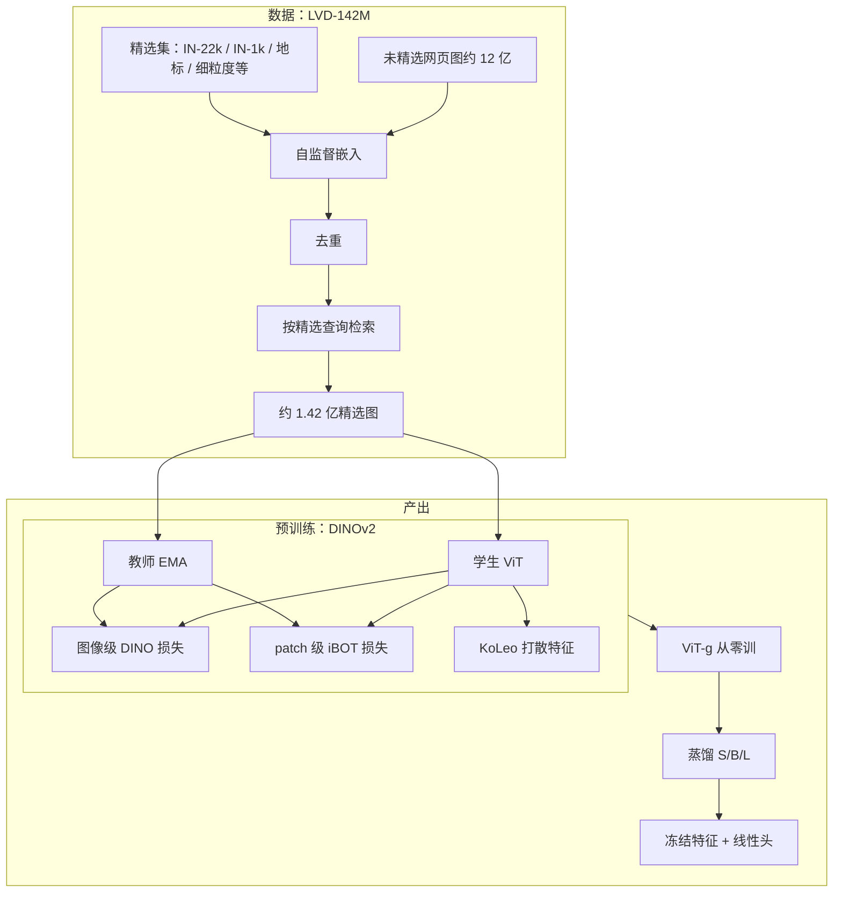

# DINOv2：用自动精选数据和规模化稳定训练，把无监督视觉特征做成可直接用的冻结骨干

<!-- release-date: 2023-04-14 -->

**本文依据**：`DINOv2: Learning Robust Visual Features without Supervision`，arXiv 2304.07193v2（页眉 `[cs.CV] 2 Feb 2024`），32 页。作者 Maxime Oquab、Timothée Darcet、Théo Moutakanni 等；封面写明 Meta AI Research / Inria，`core team` 与 `equal contribution`（PDF p. 1）。OpenReview：https://openreview.net/forum?id=a68SUt6zFt。盘上 PDF 为 v2，会刊信息为 *Transactions on Machine Learning Research*（01/2024），不当首发日。首发日取 arXiv 页面 Submission history 的 `[v1] Fri, 14 Apr 2023 15:12:19 UTC`（[arxiv.org/abs/2304.07193](https://arxiv.org/abs/2304.07193) 的 Submitted on 14 Apr 2023），这是外部补充，不来自 PDF 正文。文中数字均标 PDF 页码；标「外部补充」的段落不来自本文。DINO v1 与 iBOT 是前作，本篇贡献是数据管线与规模化训练，不把它们重写成这篇的新算法。

## 一句话

视觉想要 NLP 那种「特征拿来就用、不必微调」的基础模型。CLIP 一类文本引导预训练要图文对齐，字幕也只能近似图像里的像素信息（PDF p. 2）。纯自监督以前多在 ImageNet-1k 这种小而精的集上成功，放大到未精选网页图时特征质量会掉（PDF p. 2）。DINOv2 的主张是：**现有判别式自监督，只要数据够多样、够精选，再把训练做稳、做快，就能训出跨分布、跨任务的通用视觉特征。** 他们用自动管线造了 LVD-142M（约 1.42 亿张，PDF p. 2、p. 30 表 15 合计 142,109,386），在 ViT-g/14（约 11 亿参数，PDF p. 6）上预训练，再蒸馏出一串小模型；冻结骨干加线性头，在图像级和像素级多数基准上超过当时公开最好的通用特征 OpenCLIP（PDF p. 1）。相对同类判别式自监督实现，训练大约快 2×、显存大约只要 1/3（PDF p. 2、p. 6）。

## 一、矛盾：文本监督留不住像素；未精选放大又把特征放大砸了

NLP 已经习惯：在海量生文本上做与任务无关的预训练，下游特征「原样」用，往往比专用模型更好（PDF p. 1）。视觉这边最有希望的基础模型路线，当时多是文本引导：用标题、标签、图文对去带视觉编码器（PDF p. 1–2）。这条路有两处硬伤。

第一，**字幕只是图像的近似**。复杂的像素级信息（部件、几何、深度）不一定会从文本监督里浮出来；编码器还绑死在对齐的图文语料上，不能像语言模型那样只吃原始数据（PDF p. 2）。

第二，**只吃图像的自监督**在概念上更接近语言模型，也能同时抓住图像级和像素级信号（PDF p. 2）。DINO、iBOT 一类判别式方法在 ImageNet 上冻结特征已经很好用，但很难把模型再放大（PDF p. 4）。已有放大尝试多走未精选网页图，结果往往只能靠微调把特征救回来——缺的是对质量和多样性的控制（PDF p. 2、p. 4）。

贯穿全文的主轴因此很清楚：**不要发明第三种 pretext；要把「自动管线造多样精选数据」和「规模化时仍能稳定训练」做成同一件事。** DINO 的图像级交叉熵、iBOT 的掩码 patch 目标、SwAV 的 Sinkhorn 居中，都是拿来用的零件（PDF p. 5）；本篇新写的是数据怎么筛、训练怎么撑到十亿参数。

图 1（PDF p. 2）把冻结 patch 特征的 PCA 画成四列：鸟与飞机、象与雕像、马与素描、车与路。同列图做联合 PCA，前三个主成分分别映射到三个颜色通道；第一主成分阈值去掉背景。读图能看到：姿态、风格甚至物种变了，翅膀、躯干、车身这类部件颜色仍对齐。这是定性观察，不是精度数字。作者后来说这是涌现：模型没被训练去解析部件（PDF p. 17）。

## 二、全景：检索造数据，双目标训大模型，再蒸馏小模型

图为机制示意，根据 PDF p. 4 图 3、p. 5–7 第 4–5 节重画，不是实测曲线。

四块各管一件事：

- **数据**：不靠文本元数据；用视觉相似从网页池里把精选集「扩」出来，并做概念再平衡（PDF p. 2、p. 4）。
- **损失**：图像级对齐全局 token，patch 级对齐被掩码的局部 token，KoLeo 让特征在 batch 里铺开（PDF p. 5–6）。
- **工程**：FlashAttention、序列打包、高效 stochastic depth、FSDP 混合精度，把十亿模型训得起（PDF p. 6–7）。
- **蒸馏**：小模型不从零训，从冻结的 ViT-g 老师蒸出来（PDF p. 7）。

代码与权重按 Apache 2.0 放出：`https://github.com/facebookresearch/dinov2`（PDF p. 6）。

## 三、数据：未精选池太大，精选集太窄，用检索把两边接上

### 旧问题

自监督文献默认两条路：要么 ImageNet 这种小而干净，要么网页抓取这种大而脏。脏数据上判别式方法能随数据放大，但特征往往要微调才好用（PDF p. 4）。野外图像还有一个更烦的问题：少数主导模式会把训练带偏，概念不平衡（PDF p. 2）。LAION 一类过滤会用预训练编码器或元数据；作者说他们的过滤**不靠元数据、文本，也不用（有监督意义上的）预训练编码器去筛图**，只靠图像之间的视觉相似（PDF p. 4）。第 3 节检索嵌入实际用的是 ImageNet-22k 上自监督预训练的 ViT-H/16（PDF p. 5）——这是管线里的实现细节，和「不用文本/hashtag 监督」不是同一句话。

### 新设计：LVD-142M

管线画在图 3（PDF p. 4）：未精选桶和精选桶都先变成嵌入；未精选做去重；再按精选查询做检索，得到「增强后的精选数据」。读图能看到：未精选一侧有重复被叉掉，检索框把网页图匹配到精选查询，右侧桶里精选图加上检索来的近邻。

未精选源是公开网页抓取库：从 `` 抽 URL，丢掉不安全或域名受限的链接，再做 PCA hash 去重、NSFW 过滤、可识别人脸模糊，得到 **12 亿** 张唯一图（PDF p. 5）。附录把自去重前写作 13 亿，余弦相似 $>0.6$、$k=64$ 近邻连通分量后剩 **11 亿**；相对评测集用更严的 $>0.45$，再剩 **7.44 亿**（PDF p. 29）。正文与附录数字口径不同，引用时分开写。

精选查询包括 ImageNet-22k、ImageNet-1k 训练集、Google Landmarks 以及一批细粒度、分割、深度、检索集（PDF p. 4、p. 30 表 15）。检索嵌入：ImageNet-22k 自监督 ViT-H/16，距离是余弦（PDF p. 5）。大查询集对每张图取 $N$ 个近邻，默认 $N=4$（再大碰撞变多）；小查询集先把未精选集 k-means，再从查询所在簇抽样（PDF p. 5）。附录更细：$>1$M 的集走样本检索，$k=4$（GLDv2 与 IN-22k）或 $k=32$（IN-1k 那一路，作为 LVD 的核心一块）；小集先聚 **100,000** 簇，查询命中超过 3 张的簇各抽 10,000，单集检索上限 1M，避免某一来源撑爆（PDF p. 29）。

去重与检索用 Faiss GPU 倒排 + 乘积量化；**20** 台节点、每台 **8** 张 V100-32GB，不到两天做出 LVD-142M（PDF p. 5）。表 15 最后一行合计 **142,109,386**（PDF p. 30）。

### 工作机制

这是在模仿 NLP 的 CCNet 式精选：用「像不像已有高质量语料」代替人工标签（PDF p. 2、p. 4）。聚类负责再平衡，避免网页里少数视觉模式垄断近邻。相对去重还删掉与本文任何评测的 test/val 近重复，免得预训练泄漏（PDF p. 5）。

### 收益

表 2（PDF p. 8）：同样迭代、无高分辨率适应的 ViT-g/14。未精选随机 1.42 亿：IN-1k 83.3、Im-A 59.4、Oxford-M 54.3、iNat2018 68.0。LVD-142M：85.8、73.9、64.6、82.3。IN-22k 在 IN-1k 上 85.9，和 LVD 几乎打平，但 Oxford-M 只有 62.5、iNat2018 81.1。作者的读法：精选优于同规模未精选；多样精选在 ImageNet 外更好，连没用来做检索查询的 iNaturalist、Places205 也涨（PDF p. 8）。

图 4（PDF p. 9）：模型变大时，LVD 相对 IN-22k 的优势更明显；ViT-g 在 LVD 上 IN-1k 能追上 IN-22k 训练的同架构，其它基准拉开。这是实测曲线。

### 代价 / 边界

LVD 不是「任意网页图都能自监督」。管线依赖一份已经覆盖分类、分割、深度、地标的精选种子（表 15）。检索 $N$ 太大近邻碰撞；太小多样性不够（PDF p. 5）。原始 12 亿 URL 与过滤规则不能从论文复现成可下载数据集——论文给的是方法，不是数据发布。

### 可迁移

自己做无标注预训练时，先问数据是「大而脏」还是「小而净」。脏数据上加一轮「像不像种子集」的检索，往往比直接把模型扔进网页池更稳。概念再平衡可以用很朴素的聚类，不必先上复杂的生成式过滤。

## 四、目标：图像级认整图，patch 级认局部，还要特征铺开

### 旧问题

只做实例级全局对齐，密集任务（分割、深度）吃的 patch 特征偏弱。只做掩码重建（MAE 一类）微调很强，但冻结后「开箱」不好用（PDF p. 3）。iBOT 已经把 DINO 式全局目标和 BERT 式掩码 patch 目标接在一起；作者认为它适合放大，但若干设计在更大数据上要反过来（PDF p. 4–6）。

### 新设计

损失是 DINO + iBOT + SwAV 式 Sinkhorn 居中，外加 KoLeo，最后再短跑高分辨率（PDF p. 5）。

**图像级（DINO）**。同一张图不同裁剪，学生和教师的 class token 各自过 DINO 头（MLP，输出 prototype 分数）。学生 softmax 得 $p_s$，教师 softmax 再居中得 $p_t$（PDF p. 5）：

$$
L_{\mathrm{DINO}} = -\sum p_t \log p_s
$$

学生反传；教师头是学生的指数滑动平均（PDF p. 5）。

**patch 级（iBOT）**。学生输入随机掩码，教师不掩。学生 iBOT 头打在 mask token 上，教师 iBOT 头打在对应的可见 patch 上，同样 softmax + 居中（PDF p. 5–6）：

$$
L_{\mathrm{iBOT}} = -\sum_i p_t^i \log p_s^i
$$

$i$ 是被掩位置。教师同样 EMA。

**头不共享**。iBOT 原文消融认为 DINO/iBOT 两头共享更好；放大后作者观察到相反，实验里一律两套头（PDF p. 6）。

**Sinkhorn-Knopp 居中**。教师侧用 SwAV 的 SK 批归一，跑 **3** 步；学生仍用 softmax（PDF p. 6）。

**KoLeo**。鼓励 batch 内特征铺开。$n$ 个向量 $x_1,\ldots,x_n$，先 $\ell_2$ 归一（PDF p. 6）：

$$
L_{\mathrm{KoLeo}} = -\frac{1}{n}\sum_{i=1}^{n}\log(d_{n,i}),\qquad d_{n,i}=\min_{j\neq i}\|x_i-x_j\|
$$

附录：权重 **0.1**，只在每个 GPU 上第一张全局裁剪的 class token 之间算，这一步不跨卡通信（PDF p. 29）。

**分辨率**。密集任务小物体在低分辨率会消失，全程高分辨率又太贵。预训练末尾把图像提到 $518\times 518$ 短跑一段（PDF p. 6）。图 6（PDF p. 10）用更小设置（ViT-L/16、IN-1k）说明：固定 416 全程最好，但大约 **3×** 算力；224 训完再 10k 步 416，行为接近全程高分辨率。最终配方采用「末尾短适应」而不是从头高分辨率（PDF p. 10）。附录 B.2：加载预训练权重再训 **10k** 迭代，日程压缩进这 10k，超参不变、基础学习率降低（PDF p. 31）。

### 工作机制

全局头逼不同裁剪的整图原型分布一致；掩码头逼被挡住的 patch 对上教师在同一位置看见的东西——所以分割这类密集任务吃到的是对齐过的局部 token。KoLeo 惩罚「最近邻太近」，检索这种要在特征空间里散开的任务会直接受益。

表 3（PDF p. 9）：去掉 KoLeo，Oxford-M 从 63.9 掉到 55.6（作者写检索提升超过 8 个点），IN-1k / ADE 几乎不动。去掉 iBOT 的 MIM 项，ADE-20k 从 47.1 掉到 44.2（约 3 个点），检索几乎不动。各训相同、短于最终 run 的迭代。

表 1（PDF p. 8）是在 IN-22k、ViT-L 上从 iBOT 基线往 DINOv2 加零件。公开 iBOT：k-NN 72.9 / 线性 82.3；他们复现 74.5 / 83.2。一路加到解耦头（= DINOv2）：k-NN **82.0** / 线性 **84.5**。中间 LayerScale + stochastic depth 线性从 83.2 掉到 82.0，但作者说能避免训练中 NaN（PDF p. 8）。128k prototypes、KoLeo、SwiGLU、patch 14、教师动量 0.994、warmup 调整、batch 3k、SK，多数步骤 k-NN 或线性至少一头在涨。优化目标按他们的经验是 k-NN，因为线性往往被 k-NN 下界住（PDF p. 8）。

### 代价 / 边界

配方是经验堆叠，不是新的理论目标。SK 在表 1 上 k-NN/线性都是「持平」。解耦头线性还略降 0.2。高分辨率适应的定量图来自 IN-1k 小设置，不能直接当成 ViT-g + LVD 的曲线。

### 可迁移

判别式 SSL 放大时，前作「共享头更好」这类结论可能翻转，要在目标数据规模上重做消融。检索差就加打散正则；密集任务差就保留掩码 patch 项。分辨率用「末尾短适应」买密集任务，不要默认全程高分辨率。

## 五、工程：十亿参数要的是稳和省，不是新损失

同硬件上，相对 iBOT 实现，DINOv2 代码大约 **2×** 更快、显存大约 **1/3**（PDF p. 6）。训练在 A100、PyTorch 2.0（PDF p. 6）。

**注意力**。自研 FlashAttention；每头维度最好是 64 的倍数，整段嵌入最好是 256 的倍数。因此 ViT-g 不跟 Zhai 等人的 1408/16 头，而用嵌入 **1536**、**24** 头（64 dim/head）。作者说精度没看出明显差，骨干 **11 亿** 参数（PDF p. 6）。表 17：从零训的 g 是 40 层 SwiGLU；蒸馏的 S/B/L 用 MLP FFN（PDF p. 31）。

**序列打包**。DINO 要同时前向 224 大裁剪和 98 小裁剪，token 长度不同。把多段拼成一条长序列，注意力上加块对角掩码，禁止跨段看，等价于分开前向，但算得更满（PDF p. 6–7）。底层在 xFormers（PDF p. 7）。

**高效 stochastic depth**。不是算完再 mask，而是跳过被丢掉的残差。drop rate 在本文为 **40%**，节省大致按 drop 比例走：batch 维随机打乱，只切前 $(1-d)B$ 个样本进块（PDF p. 7）。

**FSDP**。AdamW 要四份 float32 副本（学生、教师、一阶、二阶），十亿模型约 **16 GB**。按 GPU 切分后，模型大小受集群总显存限制。分片存 float32，广播权重和归约梯度时骨干用 float16（MLP 头梯度仍 float32，免得不稳），通信相对 DDP 的 float32 all-reduce 大约少 **50%**（PDF p. 7）。

**蒸馏**。小模型从冻结 ViT-g 蒸：同一训练环，老师换成大模型且冻结，另留一份学生 EMA 当最终模型；去掉掩码和 stochastic depth；iBOT 损失打在两张全局裁剪上（PDF p. 7）。图 5 / 表（PDF p. 10）：ViT-L 从零 IN-1k 84.5、分割 72.2、深度 1.10、分类 90.2；从 g 蒸馏 86.3 / 73.3 / 1.08 / 91.2，12 项全胜从零，有的还超过老师。表 16：蒸馏 S/B/L 学习率 $1\times 10^{-3}$、batch 2048、无 drop；从零 L/g 学习率 $3.5\times 10^{-4}$、batch 3072、drop 0.4。一律 625k 迭代、AdamW、LayerScale 初值 $1\times 10^{-5}$、weight decay 余弦 0.04→0.2、lr warmup 100k、教师动量余弦 0.994→1、骨干 float16（PDF p. 31）。

### 可迁移

SSL 放大的瓶颈经常是显存副本和变长多裁剪，不是损失公式。头维度对齐硬件、变长序列打包、高 drop 时跳过计算、优化器状态切分，都可以直接搬。小模型优先蒸最大的老师，而不是每档都从零。

## 六、实验：冻结特征在图像级和像素级是否够用

评测原则：骨干冻结，上面加简单头；不把微调当主叙事（PDF p. 11）。基线分两类：公开最好的 SSL（MAE、DINO、iBOT 等取 IN-1k 最高的那档）和公开弱监督（CLIP / OpenCLIP / SWAG）；非 IN-1k 表上弱监督参考常用 OpenCLIP-G（PDF p. 11）。

**ImageNet-1k 线性**（表 4，PDF p. 12，分辨率 224 除非另写）。DINOv2 ViT-g/14：k-NN 83.5，线性 val **86.5**，ReaL 89.6，V2 78.4。相对 iBOT ViT-L/16（IN-22k）线性 82.3，作者写提升 **+4.2%**。相对 OpenCLIP ViT-G/14（86.2）**+0.3**，相对 EVA-CLIP ViT-g/14（86.4）**+0.1**；V2 相对 EVA-CLIP **+1.1**。弱监督对照：CLIP ViT-L/14 线性 84.3，SWAG ViT-H/14 85.7。MAE ViT-H/14 冻结线性只有 76.6，和「MAE 要微调」的相关工作叙述一致（PDF p. 3、p. 12）。

**微调只是体检**（表 5，PDF p. 12）。ViT-g/14 用 DeiT III 管线、不调超参：224 线性 86.5 → 微调 88.5（+2.0）；448 86.7 → 88.9（+2.2）。作者写离当时绝对 SOTA 91.1 还差 2.2 个点，但说明没有把模型特化成「只会线性探针」。结论：**微调是可选的**（PDF p. 12）。

**域泛化**（表 6，PDF p. 13，线性头直接推理）。g/14：Im-A 75.9、Im-R 78.8、Im-C↓ 28.2、Sketch 62.5。相对 iBOT：A **+29.6**、R **+22.1**、Sketch **+23.0**（PDF p. 12）。A 上超过 OpenCLIP-G（63.8），R/Sketch 仍落后（87.8 / 66.4）。

**其它分类与视频**（表 7，PDF p. 13）。iNat2018 / 2021：g 81.6 / 85.7，相对 OpenCLIP-G 73.0 / 76.0 为 **+8.6 / +9.7**；Places205 67.5，落后 **2.3**。视频：均匀 8 帧，UCF/K400 对特征取平均，SSv2 拼接以留时间信息。K400 78.4、UCF 91.2、SSv2 38.3；相对 OpenCLIP 为 +0.1 / +0.5 / +2.5。特征没在视频上训过（PDF p. 13）。

**12 项细粒度**（表 8，PDF p. 14，SimCLR 协议，Birdsnap 换成公开的 CUB）。g 平均 **92.1**，OpenCLIP-G 91.9。相对 SSL：Cars 相对 DINO ViT-B/8 **+14.8**，Aircraft 相对 iBOT **+14.8**。相对 OpenCLIP：SUN **−5.3**，Cars **−4.7**。作者承认这类基准偏袒文本引导预训练（PDF p. 14）。

**实例检索**（表 9，PDF p. 14，余弦非参数）。g：Oxford-M/H 73.6 / 52.3，Paris-M/H 92.1 / 82.6，Met GAP 36.8，AmsterTime mAP 46.7。L/14 在 Oxford/Paris 上略高（75.1 / 54.0，92.7 / 83.5）。作者写 Oxford-Hard 相对 SSL **+41** mAP、相对弱监督 **+34** mAP（PDF p. 14）。类别级和实例级同时强，是他们想要的「现成特征」性质。

**分割**（表 10，PDF p. 15）。线性：patch token 预测低分辨率 logit 再上采样；+ms：拼最后 4 层、分辨率 640、多尺度测试。g +ms：ADE 53.0、Cityscapes 81.0、VOC 86.2。作者写 +ms 与微调 MAE + UperNet 的 53.6 几乎打平（53.0 vs 53.6）；VOC 接近表顶 SOTA 89.0。冻结 g + ViT-Adapter + Mask2Former（骨干约占冻结权重的 66%）ADE **60.2**，对比表顶 62.9；这次分割训练 **28** 小时、**16** 张 V100，且没用第 5 节那些训练优化（PDF p. 15）。

**深度**（表 11，PDF p. 16，RMSE，越低越好）。g + DPT：NYUd 0.279、KITTI 2.11、NYU→SUN 0.338。线性 4 层已经 0.298 / 2.35 / 0.362。OpenCLIP-G 的 DPT 是 0.414 / 2.56 / 0.408。作者写 iBOT-L 的深度已经好过 OpenCLIP-G，支持「字幕学不到这种细几何」的直觉（PDF p. 16）。lin. 4 的层号：S/B 为 $\{3,6,9,12\}$，L 为 $\{5,12,18,24\}$，g 为 $\{10,20,30,40\}$（PDF p. 16）。

**定性**（PDF p. 16–18 图 7–10）。线性分割/深度：OpenCLIP-G 伪影和断开多，DINOv2-g 更顺，SUN 上的椅子 OpenCLIP 会丢掉。OOD（动物、画）上线性头仍能出说得通的深度和分割。跨图匹配：飞机翅膀对上鸟翅膀，风格和姿态变化仍能对上（PDF p. 18）。这些是读图观察，不是表上的点。

线性探针网格见附录 B.3：SGD 12500 步，搜学习率、用 1 还是 4 层、是否把平均池化的 patch 拼到 class token 上；一次骨干前向喂给所有线性头（PDF p. 31）。

## 七、公平、碳排与作者自己划的边界

**地理公平**（表 12，PDF p. 19，Dollar Street，ViT-g）。低收入 / 中 / 高：67.4 / 83.3 / 90.5，高低差 **31.7**。非洲 / 亚洲 / 美洲 / 欧洲：74.0 / 81.6 / 86.2 / 89.7，非洲相对欧洲掉 **25.7**。比 SEERv2 略公平、也更高，但仍偏向富裕西方家庭（PDF p. 18–19）。数据集：16,073 张、289 户、54 国、94 个概念（PDF p. 18）。

**性别、肤色、年龄**（表 13，PDF p. 20，Casual Conversations 2955 张，IN-22k 的 619 类收成 Human / Possibly-Human / Non-Human / Crime）。骨干冻结只训线性。Non-Human 全 0；Crime 仅 darker male 0.2、30–45 岁 0.1（作者说有两例背景像监狱栏杆）。Human 各性别肤色都高；Possibly-Human 在男性更高，作者归因于 Beard 一类（PDF p. 20）。他们写：这次没看出针对某组的明确模式，更彻底的偏见评估仍可能揭出问题。

**碳**（表 14，PDF p. 20）。复现 DINOv2-g：A100-40GB 按 400W、PUE 1.1、美国电网 0.385 kg CO2e/kWh，**22,016** GPU-hours，9.7 MWh，**3.7** tCO2eq。同假设下复现 OpenCLIP ViT-L / G 约 22.4 / 118.9 MWh，大约 **10×** 碳排——对比不公平，因为那边还训了文本塔（PDF p. 21）。整项工作估计 **0.5k–1k** tCO2eq，约 **200k** GPU-days；一次 g 预训练 22k GPU-hours = 3.7 吨，IN-1k 微调 1k GPU-hours = 0.2 吨。只计 GPU 电，不含制造与报废（PDF p. 21）。脚注：伦敦–纽约波音 777 往返约 560 tCO2eq，用来给数量级（PDF p. 21）。

**没写的**。没有发布 LVD-142M 本身；没有把 ViT-g 的逐步 loss 曲线或完整增强列表写进正文（增强沿用 DINO/iBOT 代码库，PDF p. 29）。未来工作提到：更大规模上期待更多涌现；以及把视觉特征当词 token 接进语言系统——只是计划，不是本篇实验（PDF p. 21）。

## 八、可迁移启发

1. **自监督放大的第一刀往往是数据，不是新损失。** 同规模未精选明显弱于检索精选（表 2）。种子集要覆盖你真正在乎的任务分布，再用近邻把网页池拉过来。
2. **全局目标和局部目标不要抢同一颗头。** 放大后解耦；密集任务靠 MIM 项，检索靠打散正则，可以分开消融（表 3）。
3. **冻结好用，微调仍然涨，但涨幅不大。** 若产品形态是「一个骨干服务很多下游」，优先把线性探针做扎实，而不是默认每个任务都全量微调（表 4–5）。
4. **小模型蒸最大老师。** ViT-L 蒸馏全面超过从零（图 5）。档位多的时候，算力应堆在老师和数据，而不是每档重复从零。
5. **分辨率用短适应。** 密集任务需要高分辨率，不必全程买 3× 算力（图 6）。
6. **公平不会因为「无监督」自动变好。** 地理差距仍然很大。无标签不等于无偏。
7. **只要视觉塔时，SSL 的碳账可以比图文对比更便宜**——前提是你不需要文本塔（PDF p. 21）。

## 九、关键词回看

- **通用视觉特征 / 冻结骨干**：不微调，只加线性或非参数检索，跨分类、检索、分割、深度、视频帧。
- **LVD-142M**：对精选查询做自监督检索，从去重后的网页池扩出约 1.42 亿图。
- **DINO 损失**：不同裁剪的 class token 原型分布交叉熵，教师 EMA。
- **iBOT 损失**：学生掩码 patch 对齐教师可见 patch。
- **KoLeo**：batch 内最近邻距离的负对数，把特征铺开。
- **Sinkhorn-Knopp 居中**：教师侧替代 softmax 滑动中心。
- **序列打包 / FSDP / 高效 stochastic depth**：让 ViT-g 在合理显存和通信下训完。
- **蒸馏**：小 ViT 模仿冻结 ViT-g，而不是从零。

## 参考资料

- 论文 PDF（盘上 v2）：`readings/_src/多模态理解与 Omni/DINOv2.pdf`
- arXiv：https://arxiv.org/abs/2304.07193
- OpenReview：https://openreview.net/forum?id=a68SUt6zFt
- 代码与模型：https://github.com/facebookresearch/dinov2（PDF p. 6）
- 前作（本篇当零件，不当新贡献）：Caron et al., DINO, ICCV 2021；Zhou et al., iBOT, ICLR 2022
