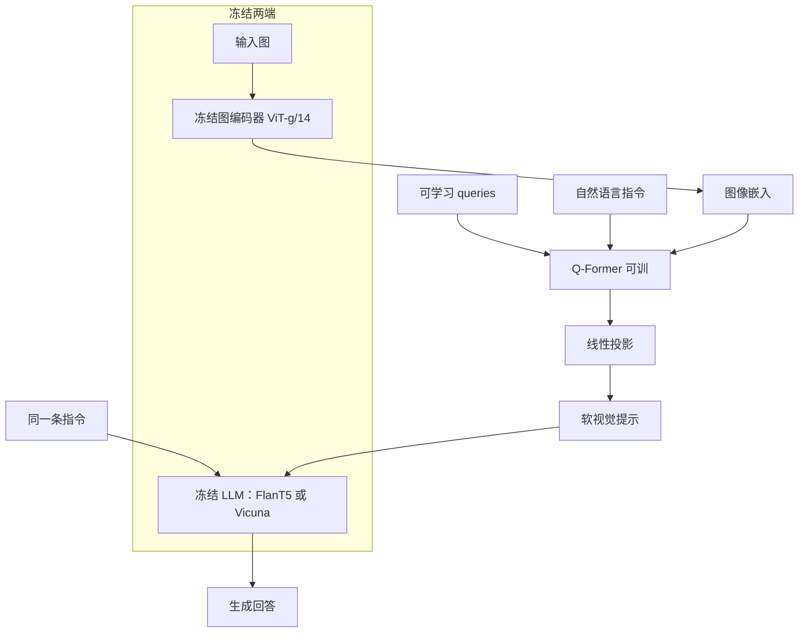

# InstructBLIP：在 BLIP-2 上做视觉–语言指令微调，让 Q-Former 按指令抽视觉

<!-- release-date: 2023-05-11 -->

**本文依据**：`InstructBLIP: Towards General-purpose Vision-Language Models with Instruction Tuning`，封面印 **Preprint. Under review.**，页眉 `arXiv:2305.06500v2 [cs.CV] 15 Jun 2023`，17 页。作者 Wenliang Dai（共同一作，实习于 Salesforce）、Junnan Li（共同一作、通讯）、Dongxu Li、Anthony Meng Huat Tiong、Junqi Zhao、Weisheng Wang、Boyang Li、Pascale Fung、Steven Hoi（通讯）。编号机构 **1 = Salesforce Research**，2 = HKUST，3 = NTU；第一作者标 $1,2$，机构按封面最低编号取 Salesforce。封面代码 `https://github.com/salesforce/LAVIS/tree/main/projects/instructblip`（PDF p. 1）。盘上 PDF 为 v2；`release-date` 按任务给定的 arXiv v1 日 **2023-05-11**。封面未写会议录用，本文不补会议名。文中数字均标 PDF 页码。BLIP / BLIP-2 只作为本 PDF 引用的前作出现，不重写那两篇本体。

## 一句话

语言侧已经证明：把很多任务写成自然语言指令再微调，模型能跟未见过的任务。视觉–语言这边更难——同一张图可以问描述、问答、读图中文字、多轮对话，任务分布更散。InstructBLIP 从预训练 **BLIP-2** 出发，冻住图编码器和 LLM，只训 **查询 Transformer（Query Transformer，Q-Former）**，并把指令同时送进 Q-Former 和 LLM，让视觉特征跟着任务变（PDF p. 1、p. 4）。数据是公开的 **26** 个数据集、**11** 类任务，转成指令格式；**13** 个 held-in 拿来训，**13** 个 held-out 做零样本，其中四类任务整类留出（视觉推理、视频问答、视觉对话问答、图像分类）（PDF p. 3）。FlanT5-XL 相对 BLIP-2 同骨干平均相对提升 **15.0%**；约 **4B** 的 InstructBLIP FlanT5-XL 在六个共享评测上相对 Flamingo-80B 平均相对提升 **24.8%**；ScienceQA 带图子集微调准确率 **90.7%**（PDF p. 1、p. 6–7、p. 9 表 3）。

它解决的不是「再做一个更强的 BLIP-2」，而是另一句：**只把多任务收成同一套输入输出、不加指令，held-out 几乎不涨；视觉特征若对指令无感，空间/时间推理会掉一截。通用视觉–语言模型要的是「指令进瓶颈」，不是「再堆几个 caption」。**

## 一、矛盾：NLP 指令微调已经能跟未见任务，图文这边还卡在 caption 和多任务

作者开篇写的长期目标很直白：一个模型按用户指定的任意任务做事（PDF p. 1）。NLP 里，指令微调（instruction tuning）把大语言模型（LLM）放到用自然语言写明的任务上微调，就能跟任意指令（PDF p. 1）。BLIP-2 已经把冻结的指令微调 LLM 接到视觉上，并表现出一点「看图按指令写字」的能力（PDF p. 1）。

图文任务比纯文本更散：视觉输入来自不同域，同一张图可以对应完全不同的目标（PDF p. 1）。当时两条常见路（PDF p. 1–3）：

- **多任务学习**：把各种图文任务收成同一套输入–输出。作者后文用表 4 / 图 4 说明：**没有指令的多任务，泛化到未见数据集和未见任务不好**（PDF p. 1、p. 8）。
- **给预训练 LLM 加视觉部件，用图像描述数据训视觉侧**：BLIP-2、Flamingo 一类。作者认为 caption 太窄，撑不起「比描述更重」的图文任务（PDF p. 3）。

InstructBLIP 的回答是：在 BLIP-2 的模块化骨架上做一次系统的视觉–语言指令微调研究——数据怎么切、指令进哪里、采样怎么平衡、零样本和下游微调各能涨多少（PDF p. 3）。

相关工作把对照写清楚（PDF p. 9）：MiniGPT-4 复用 BLIP-2 的视觉编码器和 Q-Former，换 Vicuna，用比 BLIP-2 更长的 ChatGPT 合成描述；LLaVA 把视觉编码器输出投影进 LLaMA/Vicuna，用 GPT-4 造的对话数据微调 LLM；mPLUG-owl 对 LLaMA 做 LoRA；MultiInstruct 做图文指令微调但**没有**预训练 LLM，作者认为竞争力较弱。InstructBLIP 自称数据更宽（模板转换 + LLM 生成），架构上多了指令感知的视觉抽取，并做了系统分析（PDF p. 9）。

## 二、全景：冻两端、只训 Q-Former，指令走两条路

图 3（PDF p. 5）把结构画成：输入图 → 冻结图编码器 → 图像嵌入；一排可学习 queries 和指令一起进 Q-Former（自注意力、交叉注意力、前馈）；Q-Former 输出经全连接投到冻结 LLM，和文本指令一起生成回答。示例指令是选择题「哪张图是烤箱里的披萨」，回答 `left one`。这是机制示意图，不是实测曲线。

上图根据 PDF p. 4–5 图 3 与第 2.3 节重画，是机制示意。

三个部件各管一件事（PDF p. 4–6）：

- **冻结图编码器**：实验统一 **ViT-g/14**（PDF p. 6）。下游微调时仍冻住，分辨率保持 **$224\times 224$**（PDF p. 8）。
- **Q-Former**：唯一在指令微调阶段更新的大块。$K$ 个可学习 query 与图编码器输出做交叉注意力，吐出 $K$ 个视觉向量，再线性投影进 LLM（PDF p. 4）。指令 token 也进 Q-Former，经自注意力和 query 交互（PDF p. 5）。
- **冻结 LLM**：四套检查点——FlanT5-XL（**3B**）、FlanT5-XXL（**11B**）、Vicuna-7B、Vicuna-13B（PDF p. 6）。FlanT5 是 T5 上的指令微调编解码器；Vicuna 是 LLaMA 上的解码器指令微调（PDF p. 6）。原 BLIP-2 没有 Vicuna 检查点，作者按 BLIP-2 同一流程先做预训练再指令微调（PDF p. 6）。

下游两种用法（PDF p. 3、p. 8–9）：

- **零样本**：held-out 上直接按指令生成或词汇表排序，不更新权重；
- **单任务微调**：仍冻图编码器和 LLM，只动 Q-Former，可训练参数从约 **1.2B** 降到 **188M**（PDF p. 8）。

## 三、指令感知的 Q-Former：同一张图，指令不同，该抽的视觉也不同

### 旧问题

BLIP-2 一类零样本图到文方法，抽视觉时**不看指令**：无论后面问的是「简述」还是「空间关系」，送进 LLM 的视觉向量是同一套（PDF p. 4）。同一张图、指令差很远时，静态视觉表示吃亏。

### 新设计

沿用 BLIP-2：Q-Former 先用图–描述数据做两阶段预训练——第一阶段对着冻结图编码器做表示学习，第二阶段把输出当软视觉提示接到冻结 LLM（PDF p. 4–5）。指令微调阶段，LLM 同时吃 Q-Former 的视觉编码和任务指令（PDF p. 5）。

InstructBLIP 的增量是 **instruction-aware Q-Former**：指令文本 token 作为 Q-Former 的额外输入，经自注意力和 query 交互，鼓励抽出与当前任务相关的图像特征（PDF p. 5）。于是 LLM 收到的视觉已经偏向「这条指令用得上的那一块」。

### 工作机制

指令走两条路，职责不同：

- 进 **Q-Former**：决定从冻结 ViT 里捞哪些区域、哪些属性；
- 进 **LLM**：决定怎么把已经捞到的视觉写成回答。

表 2 把这条拆开：去掉指令感知视觉特征后，所有列出的数据集都掉点，空间推理（ScienceQA）和时间推理（iVQA）掉得更狠——作者解释是指令能引导视觉去盯有信息的区域（PDF p. 7）。

### 收益

FlanT5-XL：held-in 平均从 **89.8** 到 **94.1**；ScienceQA 图像上下文从 **63.4** 到 **70.4**（$\downarrow 7.0$ 是去掉该模块后的跌幅）；VizWiz **25.1 → 32.7**；iVQA **47.5 → 53.1**（PDF p. 6–7 表 2）。Vicuna-7B 上 iVQA 从 **36.8** 到 **52.2**（$\downarrow 15.4$）（PDF p. 7）。

### 代价 / 边界

Q-Former 容量仍是那 $K$ 个 query。指令写得含糊，瓶颈就抽错。图编码器和 LLM 冻住，视觉分辨率和语言知识截止日期一起冻住。

### 可迁移

瓶颈模块不要只看图。用户意图如果变化大，应把意图送进「决定抽什么」的那一层，而不是只拼在生成器前面。BLIP-2 微调 VQA 时已经把问题 token 送进 Q-Former（本库 BLIP-2 文有记）；InstructBLIP 把这件事做成默认的指令通道。

## 四、数据：26 个公开集，13/13 切开，四类任务整类留出

图 2（PDF p. 4）用黄/白区分 held-in / held-out，覆盖 11 类（PDF p. 3）。附录表 4（PDF p. 16）是逐集说明。下面按封面分类整理，held-in 标训，held-out 标测。

**图像描述**：COCO Caption（Karpathy 82K/5K/5K）、Web CapFilt（网上 **14M** 图文对 + BLIP 合成描述，BLIP/BLIP-2 用过）为 held-in；NoCaps val（15,100 图 / 166,100 描述）、Flickr30K test（31K 图、每图 5 条，held-out **1K** 图）为 held-out（PDF p. 16）。

**带读字的描述**：TextCaps held-in（21K/3K/3K）（PDF p. 16）。

**视觉推理（整类 held-out）**：GQA balanced test-dev、Visual Spatial Reasoning（VSR，官方零样本划分，判断描述真/假）、IconQA 多选 test（PDF p. 3、p. 16）。

**图像问答**：VQAv2 held-in（82K/40K/81K）；VizWiz test-dev held-out（约 **8K** 图）（PDF p. 16）。

**知识型图像问答**：OKVQA（9K/5K）、A-OKVQA（17K/1K/6K）held-in；ScienceQA 只用带图部分（IMG）作 held-out test（PDF p. 16）。

**读字问答**：OCR-VQA held-in（800K/100K/100K）；TextVQA val held-out（PDF p. 16）。

**图像问题生成**：从问答集改编（PDF p. 3）。

**视频问答（整类 held-out）**：MSVD-QA test（**13K** 对）、MSRVTT-QA test（**72K** 对）、iVQA test（6K/2K/2K 划分里的 test）（PDF p. 16）。

**视觉对话问答（整类 held-out）**：Visual Dialog val，**2,064** 图、每图 **10** 轮（PDF p. 16）。

**图像分类（整类 held-out）**：HatefulMemes val，二分类是否仇恨梗图（PDF p. 16）。

**LLaVA-Instruct-150K** held-in：详细描述 **23K**、推理 **77K**、对话 **58K**，本身已是指令格式，不再套模板（PDF p. 3、p. 16）。

每个任务手写 **10–15** 条自然语言模板（PDF p. 3）。短答数据集的部分模板故意加 `short` / `briefly`，减轻「永远输出短句」的过拟合（PDF p. 3）。附录表 5（PDF p. 17）给出描述、VQA、VQG 三类模板；带 OCR 的集在图像 query 嵌入后追加 `OCR tokens:`（PDF p. 17）。零样本推理指令在附录 E（PDF p. 17），带选项时按字母序号排列。

防污染：跨数据集保证评测数据不出现在 held-in 训练集（PDF p. 4）。训练目标是标准语言建模损失：给定指令直接生成回答（PDF p. 4）。涉及场景文字的集，把 OCR token 写进指令当补充（PDF p. 4）。

**可迁移**：零样本要可信，先把「同任务不同分布」和「整类任务没见过」分开报。四类整类留出，比「同任务换一个 test 文件」硬得多。

## 五、平衡采样：不能按均匀混合，也不完全按数据集大小

### 旧问题

训练集又多又大小悬殊，均匀混合会让小集过拟合、大集吃不饱（PDF p. 5）。

### 新设计

按训练集大小的平方根成比例采样。设 $D$ 个数据集，大小 $S_1,\ldots,S_D$，从数据集 $d$ 抽到一条的概率为（PDF p. 5）

$$p_d=\frac{\sqrt{S_d}}{\sum_{i=1}^{D}\sqrt{S_i}}.$$

再手工调两处：降低 A-OKVQA（多选）权重，提高 OKVQA（开放生成）权重——作者认为同类大小并不等于该用同样训练强度（PDF p. 5）。

### 收益与代价

表 2：去掉平衡后，不同数据集在**差得很远的步数**上分别见顶，进度不同步，总体变差（PDF p. 7）。FlanT5-XL held-in 平均 **92.6 → 94.1**；ScienceQA **66.0 → 70.4**。Vicuna-7B 上去掉平衡后 IconQA 反而 **43.5 vs 43.1**（$\uparrow 0.4$），其他仍掉——作者报的是总体，不是每一格都单调（PDF p. 7）。手工调权没有公开具体系数。

### 可迁移

多数据源不要默认均匀。平方根比按大小正比更温和；若任务形式差很多（多选 vs 开放生成），再加一条人工先验，并在消融里承认它不是处处单调。

## 六、推理：多数直接生成，分类/多选用词汇表排序，视频拼四帧

多数描述和开放 VQA：按指令生成，再跟标注算指标（PDF p. 5）。

分类和多选 VQA：仍提示模型生成，但把词表限制在候选列表，对每个候选算对数似然，取最高（PDF p. 5）。用于 ScienceQA、IconQA、A-OKVQA 多选、HatefulMemes、Visual Dialog、MSVD、MSRVTT（PDF p. 5）。二分类把正负标签扩成一组 verbalizer，例如正类 `yes`/`true`，负类 `no`/`false`，吃自然语言里的词频（PDF p. 5–6）。

视频问答：每视频均匀采 **4** 帧，各帧单独过图编码器和 Q-Former，视觉特征拼接后再进 LLM（PDF p. 6）。模型没在时序视频上训过，这是零样本协议，不是视频编码器。

Visual Dialog 报 **MRR** 不报 NDCG：作者引用前人，认为 NDCG 偏爱含糊、泛化的回答，MRR 更偏向确定回答，更贴零样本设定（PDF p. 7）。

## 七、训练 recipe：最多 60K 步，16×A100，一天半

实现用 LAVIS（PDF p. 6）。指令微调最多 **60K** 步，每 **3K** 步验证；每个模型选**一个**最优检查点，所有数据集共用（PDF p. 6）。

batch：**3B** 用 **192**，**7B** 用 **128**，**11/13B** 用 **64**（PDF p. 6）。AdamW，$\beta_1=0.9$，$\beta_2=0.999$，weight decay **0.05**（PDF p. 6）。学习率：前 **1,000** 步从 $10^{-8}$ 线性升到 $10^{-5}$，再余弦降到最小 **0**（PDF p. 6）。**16** 张 Nvidia A100（40G），**1.5** 天内完成（PDF p. 6）。

论文没写并行策略、通信库、以及平方根采样的具体手工权重。Vicuna 的 BLIP-2 式预训练超参指向前作，本文不展开。

## 八、实验：held-out 零样本、消融、指令 vs 多任务、下游微调

### 零样本 held-out（表 1，PDF p. 6）

指标：NoCaps / Flickr30K 用 CIDEr；iVQA 用 iVQA accuracy；HatefulMemes 用 AUC；Visual Dialog 用 MRR；其余 top-1 准确率（%）（PDF p. 6）。ScienceQA 只评带图子集（PDF p. 6）。

| 模型 | NoCaps | Flickr30K | GQA | VSR | IconQA | TextVQA | VisDial | HM | VizWiz | SciQA | MSVD | MSRVTT | iVQA |
|---|---|---|---|---|---|---|---|---|---|---|---|---|---|
| Flamingo-3B | — | 60.6 | — | — | — | 30.1 | — | 53.7 | 28.9 | — | 27.5 | 11.0 | 32.7 |
| Flamingo-9B | — | 61.5 | — | — | — | 31.8 | — | 57.0 | 28.8 | — | 30.2 | 13.7 | 35.2 |
| Flamingo-80B | — | 67.2 | — | — | — | 35.0 | — | 46.4 | 31.6 | — | 35.6 | 17.4 | 40.7 |
| BLIP-2 FlanT5XL | 104.5 | 76.1 | 44.0 | 60.5 | 45.5 | 43.1 | 45.7 | 53.0 | 29.8 | 54.9 | 33.7 | 16.2 | 40.4 |
| BLIP-2 FlanT5XXL | 98.4 | 73.7 | 44.6 | 68.2 | 45.4 | 44.1 | 46.9 | 52.0 | 29.4 | 64.5 | 34.4 | 17.4 | 45.8 |
| BLIP-2 Vicuna-7B | 107.5 | 74.9 | 38.6 | 50.0 | 39.7 | 40.1 | 44.9 | 50.6 | 25.3 | 53.8 | 18.3 | 9.2 | 27.5 |
| BLIP-2 Vicuna-13B | 103.9 | 71.6 | 41.0 | 50.9 | 40.6 | 42.5 | 45.1 | 53.7 | 19.6 | 61.0 | 20.3 | 10.3 | 23.5 |
| InstructBLIP FlanT5XL | 119.9 | 84.5 | 48.4 | 64.8 | 50.0 | 46.6 | 46.6 | 56.6 | 32.7 | 70.4 | 43.4 | 25.0 | 53.1 |
| InstructBLIP FlanT5XXL | 120.0 | 83.5 | 47.9 | 65.6 | 51.2 | 46.6 | 48.5 | 54.1 | 30.9 | 70.6 | 44.3 | 25.6 | 53.8 |
| InstructBLIP Vicuna-7B | 123.1 | 82.4 | 49.2 | 54.3 | 43.1 | 50.1 | 45.2 | 59.6 | 34.5 | 60.5 | 41.8 | 22.1 | 52.2 |
| InstructBLIP Vicuna-13B | 121.9 | 82.8 | 49.5 | 52.1 | 44.8 | 50.7 | 45.4 | 57.5 | 33.4 | 63.1 | 41.2 | 24.8 | 51.0 |

作者三点（PDF p. 6–7）：

1. 所有 13 个 held-out 上新的零样本 SOTA（相对表内对照）；各 LLM 都明显超过自己的 BLIP-2 骨干。
2. InstructBLIP FlanT5XL 相对 BLIP-2 FlanT5XL 平均相对提升 **15.0%**。
3. 未见过时序视频数据，MSRVTT-QA 相对此前 SOTA 最高 **47.1%** 相对提升。约 **4B** 的 InstructBLIP FlanT5XL 在六个共享评测上超过 Flamingo-80B，平均相对提升 **24.8%**。

表内并非每一格都「更大 LLM 更好」：例如 VSR 上 BLIP-2 FlanT5XXL **68.2** 高于 InstructBLIP FlanT5XXL **65.6**；InstructBLIP Vicuna-13B 的 VSR **52.1** 低于 Vicuna-7B **54.3**。正文强调的是总体与相对提升，单格对照以本表为准。

### 消融（表 2，PDF p. 6–7）

held-in 平均是 COCO Caption、OKVQA、A-OKVQA、TextCaps 四分平均（PDF p. 7）。held-out 展示五集。数字见第三节、第五节，不重复整表。

### 定性（图 1 与附录 B）

图 1（PDF p. 2）是 InstructBLIP Vicuna 的精选例子：灾后场景推断飓风、维米尔《戴珍珠耳环的少女》、多轮从蔬菜拼出沙拉步骤、门洞看太空的隐喻、穿甲的狗。这是挑过的成功样例。

附录对照同期多模态模型（GPT-4、LLaVA、MiniGPT-4）（PDF p. 7、p. 13–15）：

- 图 5：出租车上熨衣。InstructBLIP 写「黄出租车后备箱上熨衣服、危险」；GPT-4 写车顶熨衣板；LLaVA 写成面包车；MiniGPT-4 几乎只描述站姿。作者称 InstructBLIP 比 GPT-4 更全、比 LLaVA 更贴图、比 MiniGPT-4 更合逻辑。GPT-4/LLaVA 回答取自其论文，MiniGPT-4 取官方 demo（PDF p. 13）。
- 图 6：问谁画的这幅画。InstructBLIP 只答 `Leonardo da Vinci.`；LLaVA/MiniGPT-4 长段介绍蒙娜丽莎。作者论点：**长回答不总是更好**，应能按用户意图调长度（PDF p. 7、p. 14）。
- 图 7：详细介绍画作。InstructBLIP 接到维米尔 1665 与珍珠耳环；LLaVA 猜伦勃朗风；MiniGPT-4 只描外观。作者归因 MiniGPT-4 可能只训了长 caption（PDF p. 15）。

定性不是指标。

### 指令微调 vs 多任务（图 4，PDF p. 8）

同一套 BLIP-2 FlanT5XL、同一套训练配置。多任务两条：① 纯输入–输出、评测时仍给指令（描述任务评测只给图，作者说这样分更高）；② 训练时在文本前加 `[Task:Dataset]`，例如 `[Visual question answering:VQAv2]`，评测试指令或该标识符；held-out 标识符只用任务名（PDF p. 8）。

图 4 读到的柱（PDF p. 8）：

| 设定 | Held-out 平均 | Held-in 平均 |
|---|---|---|
| BLIP-2 零样本 | 46.1 | 67.8 |
| 多任务：纯输入，评测用指令 | 46.3 | 92.5 |
| 多任务：训用数据集名，评测用指令 | 45.5 | 89.0 |
| 多任务：训/评都用数据集名 | 46.8 | 93.7 |
| InstructBLIP | 52.9 | 93.8 |

held-in 平均跨全部 held-in；held-out 平均跨 GQA、TextVQA、VSR、HatefulMemes、IconQA、ScienceQA、iVQA、VizWiz（PDF p. 8）。作者两条判断：held-in 上指令微调和多任务差不多，说明见过的格式都能拟合；held-out 上只有指令微调明显拉开，多任务仍和原 BLIP-2 持平——**零样本泛化的关键是指令，不是多任务本身**（PDF p. 8）。

### 下游微调（表 3，PDF p. 9）

相对 Flamingo/BLIP-2 常见做法（提高分辨率并微调视觉编码器），InstructBLIP 指令微调和下游微调都保持 **$224\times 224$**、冻视觉编码器，可训练从 **1.2B** 降到 **188M**（PDF p. 8）。

| 模型 | ScienceQA IMG | OCR-VQA | OKVQA | A-OKVQA DA Val | DA Test | MC Val | MC Test |
|---|---|---|---|---|---|---|---|
| 此前 SOTA | 89.0（LLaVA） | 70.3（GIT） | 66.1（PaLM-E 562B） | 56.3 | 61.6 | 73.2 | 73.6 |
| BLIP-2 FlanT5XXL | 89.5 | 72.7 | 54.7 | 57.6 | 53.7 | 80.2 | 76.2 |
| InstructBLIP FlanT5XXL | 90.7 | 73.3 | 55.5 | 57.1 | 54.8 | 81.0 | 76.7 |
| BLIP-2 Vicuna-7B | 77.3 | 69.1 | 59.3 | 60.0 | 58.7 | 72.1 | 69.0 |
| InstructBLIP Vicuna-7B | 79.5 | 72.8 | 62.1 | 64.0 | 62.1 | 75.7 | 73.4 |

作者：相对 BLIP-2，InstructBLIP 是更好的微调初始化；在 ScienceQA（IMG）、OCR-VQA、A-OKVQA 上新 SOTA；OKVQA 仍低于 562B 的 PaLM-E（PDF p. 9）。FlanT5 系更擅长多选，Vicuna 系更擅长开放生成——两边图编码器相同，差别主要来自冻结 LLM 的指令数据：FlanT5 多是 NLP 基准里的多选和分类，Vicuna 是开放指令跟随（PDF p. 9）。注意 A-OKVQA Direct Answer Val 上 FlanT5XXL 的 InstructBLIP **57.1** 略低于 BLIP-2 **57.6**，正文「all datasets」以作者叙述为准，单格以本表为准。

## 九、限制：冻结 LLM 的幻觉和偏见一起继承

附录 A（PDF p. 13）：InstructBLIP 用现成冻结 LLM，继承幻觉未落地文本、带偏见输出等缺点。缓解手段是加强视觉与指令上的 grounding，以及在多样、作者称为高质量的图文指令数据上微调。作者**不建议**不经针对该应用的安全与公平评估就把模型接到下游。没有给出毒性/偏见评测数字，也没有过滤流程。

论文没写：Q-Former 的 $K$ 在本文中的具体取值（指向 BLIP-2 默认）、并行与通信、平方根采样的手工系数、Vicuna 预训练的逐步数字。定性对照里 GPT-4/LLaVA 部分来自对方论文而非同一推理栈。封面印 Preprint. Under review.，本文不把它写成已录用。

## 十、可迁移启发（回到整条因果链）

1. **BLIP-2 已经把模态缝补上，下一步的矛盾是任务多样性。** 只加 caption 或只做无指令多任务，held-out 几乎不动。
2. **指令要进瓶颈，不只进解码器。** 空间/时间推理上，Q-Former 看不看指令差几个到十几个点。
3. **零样本协议要先切「同任务换分布」和「整类没见过」。** 视频 QA 用四帧拼接、从未训时序，仍然能相对涨，说明语言指令 + 帧级视觉已经能搬一部分能力；不要把它读成「已经有了视频模型」。
4. **多数据源先平方根，再对任务形式做先验。** 均匀混合会让进度错开；手工调权要在消融里承认非单调格子。
5. **评分类任务时，生成器和排序器不是同一回事。** 多选/二分类用候选对数似然，指标才能跟前人比。
6. **冻视觉编码器、锁 $224\times 224$，用 188M 微调，是在用初始化质量换分辨率。** 表 3 支持「指令微调后的 Q-Former 是更好起点」，不支持「永远不必解冻 ViT」。
7. **长回答不是能力证明。** 图 6 把「谁画的」答成一个名字，是指令跟随，不是生成长度竞赛。
8. **冻结 LLM 的安全账单不会自动结清。** 附录明确：先做应用侧评估。

依赖 16×A100、14M Web CapFilt、现成 FlanT5/Vicuna 的部分，不能直接搬到小规模实验里当同样数字。

## 十一、关键词回看

- **视觉–语言指令微调**：把图文任务写成自然语言指令，冻 ViT 与 LLM，只训 Q-Former。
- **指令感知 Q-Former**：指令 token 与 query 自注意力，按任务抽视觉。
- **held-in / held-out**：13 训 / 13 测；四类任务整类留出。
- **平方根采样**：$p_d\propto\sqrt{S_d}$，再调 OKVQA / A-OKVQA。
- **词汇表排序**：候选上算对数似然，用于多选和分类。
- **四帧拼接**：视频 QA 的零样本协议，不是时序编码器。
- **188M**：下游微调时相对解冻视觉编码器的 1.2B，可训练参数量。

## 参考资料

- 原论文 PDF：仓库 `readings/_src/多模态理解与 Omni/InstructBLIP.pdf`（v2，17 页）
- arXiv abs：[https://arxiv.org/abs/2305.06500](https://arxiv.org/abs/2305.06500)
- 封面代码：[https://github.com/salesforce/LAVIS/tree/main/projects/instructblip](https://github.com/salesforce/LAVIS/tree/main/projects/instructblip)
