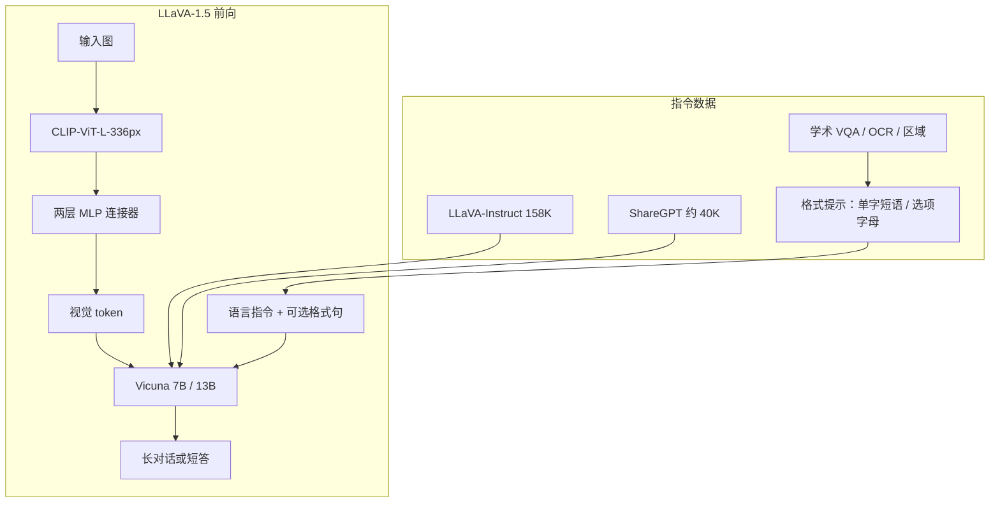

# LLaVA-1.5：MLP 投影加格式提示，把学术 VQA 焊进同一套视觉指令

<!-- release-date: 2023-10-05 -->

**本文依据**：`Improved Baselines with Visual Instruction Tuning`，正文模型名 **LLaVA-1.5**，arXiv 2310.03744v2（页眉 `[cs.CV] 15 May 2024`），15 页。作者 Haotian Liu、Chunyuan Li、Yuheng Li、Yong Jae Lee；封面机构为 **1 = University of Wisconsin–Madison**、**2 = Microsoft Research, Redmond**（PDF p. 1）。项目页封面写明 [https://llava-vl.github.io](https://llava-vl.github.io)。盘上是 v2。首发日按任务给定的 arXiv v1 日 **2023-10-05**。封面**没有**印会议名，本文依据不写会议。文中数字均标 PDF 页码；标「外部补充」的段落不来自本文。这是 LLaVA-1.5，不是原版 LLaVA。

## 一句话

原版 LLaVA 对话强、短答案弱；InstructBLIP 把学术 VQA 掺进去，短答案好了，长对话却容易塌成一个 `yes`。LLaVA-1.5 的做法是：不换 Q-former，不把预训练扩到上亿对；把线性投影换成两层 MLP，视觉编码器换成 CLIP-ViT-L-336px，并在学术题末尾加一句**回答格式提示**（`Answer the question using a single word or phrase.`）（PDF p. 1、p. 3）。最终 13B 只用公开数据约 1.2M（预训练 558K + 指令微调 665K），在单机 8×A100 上约一天训完，在作者报告的 11 项任务上整体达到当时开源最强一档（PDF p. 1、p. 5 表 3）。评测章节写的是 12 个基准的合集（PDF p. 5 第 4.1 节），摘要写 11；后文数字以表为准。

它解决的不是「再堆一个更重的视觉重采样器」，而是另一句：**短答和长对话抢的是格式信号，不是融合模块；全连接连接器已经够用，缺的是把格式写进提示、把公开学术数据按格式焊进去。**

## 一、矛盾：同一套 LMM，对话和选择题在抢出口

大语言模型已经能当通用助手。多模态这边，大家在往同一条路上收：预训练视觉骨干读图、预训练 LLM 听话、中间再加一层跨模态连接器（PDF p. 1–2）。LLaVA 把这件事做成最简单的那一档：线性投影 + 整颗 LLM 指令微调。对话式视觉推理上，它甚至能压过后来的 InstructBLIP；但传统 VQA 要单字、短短语，LLaVA 弱，而且 yes/no 题爱答 yes——训练分布里几乎没有这种短答（PDF p. 1、p. 3）。

InstructBLIP 反着做：Q-former 先在 129M 图文对上预训练，指令阶段只微调 Q-former，并把 VQA-v2 这类学术数据掺进 LLaVA-Instruct。VQA 分上去了，野外对话却不如 LLaVA。表 1a 的例子很直白：用户问「这不寻常吗？请详细解释」，InstructBLIP（Vicuna-13B）只回一个 `yes`（PDF p. 3）。

当时的猜测落在数据量和 Q-former 上（PDF p. 1）。作者要的是**受控对照**：固定在 LLaVA 框架里，从输入、模型、数据三边改，看哪一刀真正切开「长答 / 短答」的冲突。相关工作还指出：有人把 VQA 改写成对话再训，能缓解过拟合，但扩数据更麻烦；NLP 的 FLAN 则说明，学术任务加进指令微调可以抬泛化（PDF p. 2）。多模态这边缺的是把这两件事焊在一起、又不把出口焊死。

贯穿全文的主轴因此很清楚：**连接器可以继续简单；冲突出在「没告诉模型这次要多长」，以及「学术数据进来时没有格式约束」。** 后面所有设计都围着「格式提示 + MLP + 公开学术数据」转。

## 二、全景：还是两阶段，换投影、换分辨率、加格式句

系统仍是 LLaVA 那条前向：CLIP 出网格特征，连接器映到词嵌入空间，再和语言指令一起进 Vicuna。1.5 改了三处（PDF p. 1 图 1 右、p. 3–4）：

1. **连接器**：线性层 → 两层 MLP。
2. **视觉输入**：224 升到 CLIP 现成的最高档 336²；更高再走网格切块（LLaVA-1.5-HD）。
3. **数据**：LLaVA-Instruct 之外加入学术 VQA / OCR / 区域定位，以及 ShareGPT 纯文本对话；短答题末尾加格式提示。

图 1 我能从文本层读到：上半是 11 项雷达（VQAv2、GQA、VizWiz、SQA-IMG、TextVQA、POPE、MME、MMBench、MMBench-CN、SEED-Bench、LLaVA-Bench / MM-Vet），下左是训练样本效率（LLaVA-1.5 相对 InstructBLIP / Qwen-VL-Chat 的数据量小一个数量级），下右写两处改动：MLP connector 与 academic-task-oriented data with response formatting prompts。这是作者自己的总览图，不是实测曲线。

上图根据 PDF p. 1–4 第 1–3 节与图 1 重画，是机制示意。

两阶段仍在（PDF p. 2、p. 4、p. 10 表 9）：

1. **对齐预训练**：图文对上训连接器。原版 LLaVA 约 600K；1.5 表 3 写预训练 **558K**。
2. **视觉指令微调**：公开混合 **665K**，更新连接器和 LLM。

计算：分辨率升到 336² 后，1.5 的训练大约是原版 LLaVA 的 2 倍——预训练约 6 小时、指令微调约 20 小时，8×A100（PDF p. 4）。摘要写最终 13B 在单机 8-A100 上约 1 天训完（PDF p. 1）。

## 三、格式提示：短答不是换头，是把出口写进指令

### 旧问题

把自然语言长答和 VQA 短答直接混在一起，模型会行为性过拟合到短答，连该细讲的时候也只吐一个词（PDF p. 3）。作者把根因收成两条（PDF p. 3）：

1. **提示含糊**。`Q: {Question} A: {Answer}` 没有说这次要多长。
2. **LLM 不微调**。InstructBLIP 只训 Q-former，等于让容量更小的前缀去控制 LLM 的长短；Q-former 相对 LLaMA 级 LLM 扛不住。

### 新设计

短答题末尾加一句固定格式提示（PDF p. 3）：

> Answer the question using a single word or phrase.

选择题另用（PDF p. 4）：

> Answer with the option’s letter from the given choices directly.

表 1b 说明：同一张图、同一句「衬衫什么颜色」，普通提示和含糊的 `Q: … A:` 都给出整句 `The man is wearing a yellow shirt.`；加上格式句之后，**只经过第一阶段对齐、还没做第二阶段指令微调**，模型已经零样本吐 `Yellow.`（PDF p. 3）。也就是说，格式约束首先作用在已经对齐过的 LLM 上，不必先用 ChatGPT 把 VQA 改写成对话（PDF p. 3）。

### 工作机制

格式句把「这次要短」从数据分布里抽出来，变成指令的一部分。LLM 本身在指令微调里被更新，所以它能按用户这句话改出口，而不是靠视觉 token 去「前缀调控」长度。表 2 第 0–2 行：原版 LLaVA 7B、224，MME 809.6；只加 VQAv2 到 1197.0；再加格式提示到 **1323.8**，比 InstructBLIP 的 1212.8 高 111 分（PDF p. 3–4 表 2）。GQA 在这两步几乎不动（47.0 → 46.8），MM-Vet 还略降（27.7 → 26.3）——格式提示主要抬的是「会不会按 yes/no、短答出题」的 MME，不是对话基准。

### 收益

学术 VQA 可以直接进混合，不必先改写成聊天。数据源因此能扩到 OKVQA、OCRVQA、A-OKVQA、TextCaps、GQA、RefCOCO、Visual Genome（PDF p. 4、p. 9 表 7）。评测时同一套提示还能迁到没见过的格式：VizWiz 要求信息不足时答 `Unanswerable`，加上附录那句提示后，无法作答题从 11.1% 到 67.8%（PDF p. 6）。

### 代价 / 边界

格式句是训练和评测时显式加上的。用户若在野外不加这句，模型仍可能偏长。表 10 显示同一段对话里可以来回切换「一句话 / 详细解释」（PDF p. 10–11），这是指令泛化，不是默认永远短答。

### 可迁移

多任务抢出口时，先问：**冲突是不是格式没写清，而不是融合模块太简单。** 一句明确的长度/选项约束，往往比再训一个 Q-former 便宜。自己做时记住：这句提示既是训练信号，也是评测协议的一部分；对不上协议，分数会假摔。

## 四、MLP 连接器：线性层已经能用，加一层非线性更够用

### 旧问题

InstructBLIP / Qwen-VL 用专门设计的视觉重采样器，在上亿甚至十亿级图文对上预训练（PDF p. 1–2）。LLaVA 只用全连接投影、约 600K 对。当时不清楚：简单连接器是不是天花板，还是根本没被喂够。

### 新设计

受对比学习里「线性投影换成 MLP」的启发，作者把视觉–语言连接器改成**两层 MLP**（PDF p. 3）。表 2 第 3 行：7B、224，MLP 之后 GQA 47.3、MME 1355.2、MM-Vet 27.8，三项相对「格式提示那一行」都略升（PDF p. 4 表 2）。

预训练超参几乎沿用原版 LLaVA，只有预训练学习率减半：因为 MLP 比线性层更易不稳。表 9：预训练 batch 256、lr $1\times 10^{-3}$；微调 batch 128、lr $2\times 10^{-5}$；余弦衰减、warmup 0.03、weight decay 0、1 epoch、AdamW；DeepSpeed 预训练 stage 2、微调 stage 3（PDF p. 10 表 9）。评测用 greedy decoding，为了可复现（PDF p. 10）。

### 工作机制

网格特征仍一次映成视觉 token，没有 Q-former 那种可学习查询去压 patch 数。作者后来说：哪怕 7B，整体已经能打过带海量预训练的重采样路线，这让人重新问——指令跟随能力是不是真的需要「先对齐上亿对」（PDF p. 6）。CLIP 等视觉编码器本身已经在网页级图文对上预训练过。

### 收益

架构保持「可能是最简单的 LMM」（PDF p. 2）。最终模型公开数据、学术算力、可复现（PDF p. 6）。7B 已经超过 80B 的 IDEFICS（Flamingo 风格、交叉注意力参数以十亿计）（PDF p. 6）。

### 代价 / 边界

全 patch 进 LLM，每步迭代更长。附录承认：重采样器能减视觉 token，但同等数据量下目前还收敛不过 LLaVA 这条线，可能因为可训练参数更多（PDF p. 13）。高分辨率会把这个问题放大，这是后文 HD 和 Limitations 的同一条账。

### 可迁移

先把「编码器向量 → LLM 词空间」做成 MLP，用**公开、小混合**把指令能力挤出来，再决定要不要上重采样器。自己做时记住：简单连接器的前提是视觉编码器已经在图文对上预训练过；不是随便一个 CNN 头接一层 MLP 就能复现这篇。

## 五、数据缩放：学术任务按格式进混合，不是改写成聊天

### 旧问题

只靠 LLaVA-Instruct 三种 GPT-4 改写（对话 / 细描述 / 复杂推理），短答和 OCR、区域定位都缺。InstructBLIP 证明学术 VQA 有用，但 naive 合并会把模型训成「只会短答」（PDF p. 2–3）。

### 新设计

表 2 是一条受控加料路线（PDF p. 4）：

| 行 | 改动 | LLM | 分辨率 | GQA | MME | MM-Vet |
|---|---|---:|---:|---:|---:|---:|
| InstructBLIP | 对照 | 14B | 224 | 49.5 | 1212.8 | 25.6 |
| 0 | LLaVA | 7B | 224 | — | 809.6 | 25.5 |
| 1 | +VQA-v2 | 7B | 224 | 47.0 | 1197.0 | 27.7 |
| 2 | +格式提示 | 7B | 224 | 46.8 | 1323.8 | 26.3 |
| 3 | +MLP 连接器 | 7B | 224 | 47.3 | 1355.2 | 27.8 |
| 4 | +OKVQA/OCR | 7B | 224 | 50.0 | 1377.6 | 29.6 |
| 5 | +区域 VQA | 7B | 224 | 50.3 | 1426.5 | 30.8 |
| 6 | 分辨率 336 | 7B | 336 | 51.4 | 1450 | 30.3 |
| 7 | +GQA | 7B | 336 | 62.0\* | 1469.2 | 30.7 |
| 8 | +ShareGPT | 7B | 336 | 62.0\* | 1510.7 | 31.1 |
| 9 | LLM 13B | 13B | 336 | 63.3\* | 1531.3 | 36.1 |

\* GQA 训练图在训练中见过（PDF p. 4 表 2 注）。MM-Vet 在扩到 13B 时跳得最明显（31.1 → 36.1），作者据此说**基座 LLM 能力对视觉对话很重要**（PDF p. 4）。

第 4 行用的是 InstructBLIP 数据的一个子集：开放知识 VQA（OKVQA、A-OKVQA）和 OCR（OCRVQA、TextCaps）。A-OKVQA 改成选择题并配选项字母提示。只用子集，LLaVA 已在表 2 三项上超过 InstructBLIP（PDF p. 4）。再加 Visual Genome、RefCOCO，细粒度定位上去（第 5 行）。

最终指令混合见表 7，合计 **665K**（PDF p. 9）：

| 数据 | 规模 | 格式提示 |
|---|---:|---|
| LLaVA | 158K | 无 |
| ShareGPT | 40K | 无 |
| VQAv2 | 83K | 单字或短语 |
| GQA | 72K | 同上 |
| OKVQA | 9K | 同上 |
| OCRVQA | 80K | 同上 |
| A-OKVQA | 66K | 选项字母 |
| TextCaps | 22K | 一句话配文 |
| RefCOCO | 48K | 区域短描述 / 给框坐标（两种随机） |
| VG | 86K | 给框坐标 |
| **合计** | **665K** | — |

附录里的省算力手法（PDF p. 9–10）：同一张图的多条 VQA 并成一段对话；ShareGPT 滤无效对话，超 2048 token 截断而不是拆成多段，得到约 40K；A-OKVQA 按选项数 $k$ 扩增；OCRVQA 抽 80K；Visual Genome 每图最多 10 条标注；RefCOCO 切成每段少于 10 轮；**每个 batch 只抽单一模态**（纯语言或视觉），训练加速 25%，作者说不影响最终结果。各 split 拼接后等概率采样。

### 工作机制

格式提示让短答数据不再污染长对话的出口。ShareGPT 是纯文本，却把「按用户语言回答、写长文」的行为带进多模态——后文组合能力靠的就是这一刀（PDF p. 6–8）。

### 收益

公开数据、可复现。表 3 学术基准上，LLaVA-1.5-13B：VQAv2 80.0\*、GQA 63.3\*、VizWiz 53.6、SciQA-IMG 71.6、TextVQA 61.3；HD 再把 VQAv2 推到 81.8\*、GQA 64.7\*、VizWiz 57.5、TextVQA 62.5（SciQA-IMG 略降到 71.0）（PDF p. 5 表 3）。作者写 4/5 第一、其余第二。带 \* 的格子表示训练见过该集的图/标注。Qwen-VL 预训练 1.4B†、微调 50M†，含内部数据（PDF p. 5 表 3 注）。

表 4 指令跟随基准，13B：POPE rand/pop/adv 为 87.1 / 86.2 / 84.5，MME 1531.3，MMBench en/cn 67.7 / 63.6，SEED all/img/vid 61.6 / 68.2 / 42.7，LLaVA-Wild 72.5，MM-Vet 36.1。相对原版 LLaVA-7B 的 MME 809.6、MM-Vet 25.5，全面拉开（PDF p. 5 表 4）。HD 在 MM-Vet 到 39.4，MME 反而到 1500.1，略低于 336 的 13B。

### 代价 / 边界

GQA、VQAv2 等带 \* 的分数不能当成纯零样本。原版 LLaVA 很难在 VQA-v2 这种开放短答上评，因为不会按短答格式说话（PDF p. 5–6）。数据再砍 50% 仍能保住全量 98% 以上的表现（PDF p. 8）——混合有效，但不等于每条样本都不可少。

### 可迁移

学术任务进多模态指令，优先**加格式句并微调 LLM**，而不是先用 GPT 改写成聊天。batch 按模态齐长度，是很便宜的 25% 加速。自己做时对带 \* 的基准单独记账。

## 六、分辨率：336 直接换 CLIP；再高就切格子，不插值位置编码

### 旧问题

CLIP 开源视觉编码器最高 336²。再高，前人通常对 ViT 做位置编码插值，并在大规模图文对上适配新分辨率，推理分辨率还被焊死（PDF p. 4）。

### 新设计

**336**：直接换成 CLIP-ViT-L-336px（CLIP 现成最高档），让 LLM「看清」细节（PDF p. 4）。表 2 第 6 行 MME 1450、GQA 51.4。

**更高（LLaVA-1.5-HD）**：图 2 把图切成视觉编码器原训练分辨率的格子，**各自独立编码**，再拼成一张大特征图送进 LLM；另外把一张下采样全图的特征拼上去，给全局上下文，减轻切–编–并的伪影。这样不必对 ViT 做位置插值，理论上可接到任意分辨率，并保住 1.5 的数据效率（PDF p. 4 图 2）。表 3 把 HD 写成 448²、Vicuna-13B、同样 558K / 665K（PDF p. 5）。

附录 A.1 更细（PDF p. 9）：HD 用 CLIP-ViT-L-14（224²）做底编码器；目标分辨率从预定义网格里选，最多六格（1×1 到 1×6、2×2、2×3 及其转置），最大 672×448 或 448×672。两条准则：尽量保细节；不要为 224 输入强行选 448² 浪费像素和显存。后处理三步：丢掉纯 padding 的特征；每行末加特殊 token，让 LLM 知道这张图的形状（分辨率已变成可变）；再展平。因为仍在 224² 上算视觉特征，**不再做额外预训练，也不为高分辨率单独预训练投影**，直接在高分辨率图上指令微调（PDF p. 9）。

7B 上的全局上下文消融（PDF p. 6）：只有高分辨率 patch 时 GQA 62.9、MME 1425.8、MM-Vet 31.9；加上全局上下文后 63.8（+0.9）、1497.5（+71）、35.1（+3.2）。

### 工作机制

每个格子仍落在 CLIP 见过的分辨率上，所以小数据也能跟上。全局下采样图提供「整张图在哪」的索引，LLM 更容易在高分辨率特征里定位相关区域（PDF p. 6）。作者说这对 OCR（MM-Vet）和细描述（LLaVA-Bench-in-the-Wild）尤其有用。

### 收益

HD-13B 在表 3 多数学术项再涨一截；表 4 上 MM-Vet 39.4、SEED-img 70.1、POPE-adv 85.0。更高分辨率还被用来重新解释幻觉：见第八节。

### 代价 / 边界

全 patch、多格，训练迭代更长（PDF p. 8 Limitations、p. 13）。HD 的 MME 1500.1 低于 336-13B 的 1531.3，SciQA-IMG 71.0 低于 71.6——分辨率不是单调提升所有基准。多图理解这篇没有（上下文长度和数据都不够）（PDF p. 13）。

### 可迁移

编码器分辨率焊死了，优先**切成它认识的格子 + 一张全局缩略图**，而不是一上来插值位置编码并重训 ViT。行尾形状 token 是可变分辨率的配套零件，不要漏。

## 七、评测：12 个基准、两种题型，数字以表为准

学术向：VQAv2、GQA 测开放短答感知；VizWiz 8000 张图，视障用户问题、零样本；ScienceQA 的图像子集做科学选择题零样本；TextVQA 测读图上的字（PDF p. 5）。

指令跟随向：POPE 在 COCO 的 random / common / adversarial 三子集上测物体幻觉，报 F1；MME-Perception 用 yes/no 测感知；MMBench 对选择题选项做全方位打乱；MMBench-CN 是中文翻译；SEED-Bench 含图和视频，视频取中间帧；LLaVA-Bench-in-the-Wild 与 MM-Vet 用 GPT-4 评正确性和有用性（PDF p. 5–6）。评测格式提示集中在表 8（PDF p. 9）。

摘要写 11 项 SOTA、13B、约 1.2M 公开数据（PDF p. 1）；第 4.1 节写「合计 12 个基准」（PDF p. 5）；第 4.2 节写「12 个基准上 overall 最好」（PDF p. 5）。雷达图 1 能数出的任务名与表 3+表 4 的并集一致。本文不把 11 和 12 抹平。

相对原版 LLaVA，1.5 在所有指令跟随基准上显著更好（PDF p. 5）。相对 Qwen-VL-Chat：数据公开、算力小；MMBench-CN 上 13B 为 63.6，Qwen-VL-Chat 为 56.7，差 +7.3 个百分点——尽管 Qwen 在中文多模态指令上微调过，1.5 没有（PDF p. 6–7）。

## 八、涌现与开放问题：格式泛化、多语言、砍数据、幻觉、组合能力

**格式指令泛化。** 训练只用有限几种格式句，测试能迁到未见过的约束：VizWiz 的 `Unanswerable`、表 5 的「先检查问题有没有事实错误」、表 6 的驾照 JSON、表 12 的 Stable Diffusion 提示模板（PDF p. 6、p. 6 表 5–6、p. 12 表 12）。表 5：海滩夕阳图被问「沙漠里发生了什么」；GPT-4V 拒绝（没有沙漠上下文），原版 LLaVA 硬编沙漠，1.5 明确说图里没有沙漠（PDF p. 6）。表 6 的 JSON 相对 GPT-4V 仍有字段错误，作者写「能按格式抽信息，但有几处错」（PDF p. 6）。

**多语言多模态。** 视觉指令（含 VQA）全是英文，没有多语言视觉微调。ShareGPT 里的多语言纯文本让模型学会「用用户的语言回答」；这种行为迁到了看图对话（PDF p. 6）。图 5 西语、日语可用，韩语仍有标红错误（PDF p. 12）。定量上就是上面的 MMBench-CN。

**LLM 选择（图 3）。** 两族：LLaMA-1 上的 Vicuna-v1.1 / v1.3，LLaMA-2 上的 Vicuna-v1.5 / LLaMA-2-Chat。v1.3 与 v1.5 用同一份约 150K ShareGPT（v1.1 的 2 倍）。Vicuna-v1.5 总体最好；LLaMA-2 基座普遍好于 LLaMA-1。v1.3 与 v1.5 指令数据相同，中文 MMBench-CN 上 v1.3 明显更差——基座比 ShareGPT 份数更关键。LLaMA-2-Chat 与 Vicuna-v1.5 在 MMBench（英文）几乎打平，迁到中文时 Chat 更差，作者归因于其 SFT/RLHF 以英文为主、多语言不如 ShareGPT。TextVQA 还需要消化 OCR 噪声，这种噪声在野外 ShareGPT 里更常见（PDF p. 7）。

**数据效率（图 4、第 5.1 节）。** 相对 InstructBLIP，1.5 已经省数据；相对原版 LLaVA，训练时间仍大约翻倍。把 1.5 的混合随机下采样到 0.1–0.5：全量知识覆盖最好；**只要 50% 样本，仍保持全量 98% 以上的表现**。50% 时 MMBench、ScienceQA、POPE 不降，MMBench 甚至略升；再从 50% 砍到 30% 仍然稳。作者把它读成多模态也可能有 less-is-more（PDF p. 8）。引言还写：随机丢掉最多 75% 也不会显著掉点（PDF p. 2）——和 50%/30% 实验是同一条故事的两端，正文没有一张把 75% 逐点画完的表。

**幻觉（第 5.2 节）。** 常见归咎是 LLaVA-Instruct 细描述里混了少量幻觉。作者观察到：输入升到 448² 后，这类幻觉明显下降。解释是：LMM 对训练里少量错误可以鲁棒；但当分辨率不够看清标注里的粒度、而那种粒度的数据又足够多时，模型就学会「编」。所以标注加细节和模型能否处理该粒度，必须匹配（PDF p. 8）。这是观察，不是因果实验。

**组合能力（第 5.3 节）。** 分开训过的能力会组合成没显式联合训过的任务。ShareGPT 进来之后：视觉对话的语言质量更好、多语言、回答更长更细；学术视觉数据则抬了 MM-Vet 和 LLaVA-Wild 上的视觉落地（PDF p. 8 表 4）。表 11 同题「写一篇旅行博客」：原版 LLaVA 一段概括，1.5 按天写、景点更贴图（PDF p. 11–12）。仍有组合失败：VQA 能答对某物体属性，细描述里不一定写对；韩语等外语对话仍弱（PDF p. 8）。含义是：不必穷举所有任务组合，但机制还没被讲清。

## 九、限制：作者写了什么没写什么

Limitations（PDF p. 8）和附录 C（PDF p. 13）对齐：

- 高分辨率全 patch，训练迭代变长；更省样本的视觉重采样器仍是未来工作。
- 不会处理多图：缺这类指令数据，上下文长度也不够。
- 复杂指令能跟，某些领域解题仍弱；更强 LLM 和更准的专项视觉指令可能有用。
- 幻觉少了，但没消失，关键场景（如医疗）要谨慎。

没写的：Q-former 与 MLP 在同一数据、同一 LLM 上的严格头对头；75% 下采样的逐基准表；幻觉随分辨率变化的定量曲线（只有文字观察）；韩语错误率。表 3 的 Specialist SOTA PaLI-X-55B 是对照不是自己的模型。

## 十、可迁移启发

1. **出口冲突先查提示。** 长答和短答抢模型时，先加一句格式约束并微调 LLM，再考虑换融合模块。
2. **简单连接器配已经预训练过的视觉编码器。** MLP 比线性层稳一点、强一点；上亿对预训练不是指令跟随的必要条件——至少在这篇的 11/12 项公开基准上不是。
3. **学术数据按格式进混合，不要先改写成聊天。** 同一张图多 QA 并成一段对话，是便宜的密度提升。
4. **分辨率不够时先切格子，而不是插值 ViT。** 全局缩略图 + 行尾形状 token 是配套。
5. **纯文本 ShareGPT 会渗进看图。** 多语言和长文案来自语言侧；视觉落地来自学术 VQA。组合能力省数据，但不保证属性在两种题型上一致。
6. **幻觉不一定是脏标签。** 先问模型能不能在该分辨率下看见标注声称的细节。
7. **混合可以砍。** 50% 仍有 98% 以上，先做随机下采样摸底，再谈更精的压缩。

## 关键词回看

- **视觉指令微调（visual instruction tuning）**：用带图像的指令数据把 LMM 收成能听话的助手；LLaVA 是这条线的起点，1.5 是同一框架上的更强基线。
- **回答格式提示（response formatting prompt）**：写在问题末尾、明确要求单字短语或选项字母的那句话；用来平衡短答和长对话。
- **MLP 视觉–语言连接器**：两层感知机，把 CLIP 网格映到 LLM 词空间；替换原版线性层。
- **LLaVA-1.5-HD**：按 CLIP 原分辨率切格独立编码，再拼特征，并拼接一张下采样全图。
- **学术任务导向 VQA**：VQAv2、GQA、OKVQA、OCR、区域定位等短答/选择题，按格式提示进入 665K 混合。

## 参考资料

- 原件：`readings/_src/多模态理解与 Omni/LLaVA-1.5.pdf`（arXiv 2310.03744v2，15 页）
- 项目页（封面印刷）：[https://llava-vl.github.io](https://llava-vl.github.io)
- 前作 LLaVA 日常研读：`readings/多模态理解与 Omni/LLaVA.md`（文内引用，不是本文依据）
