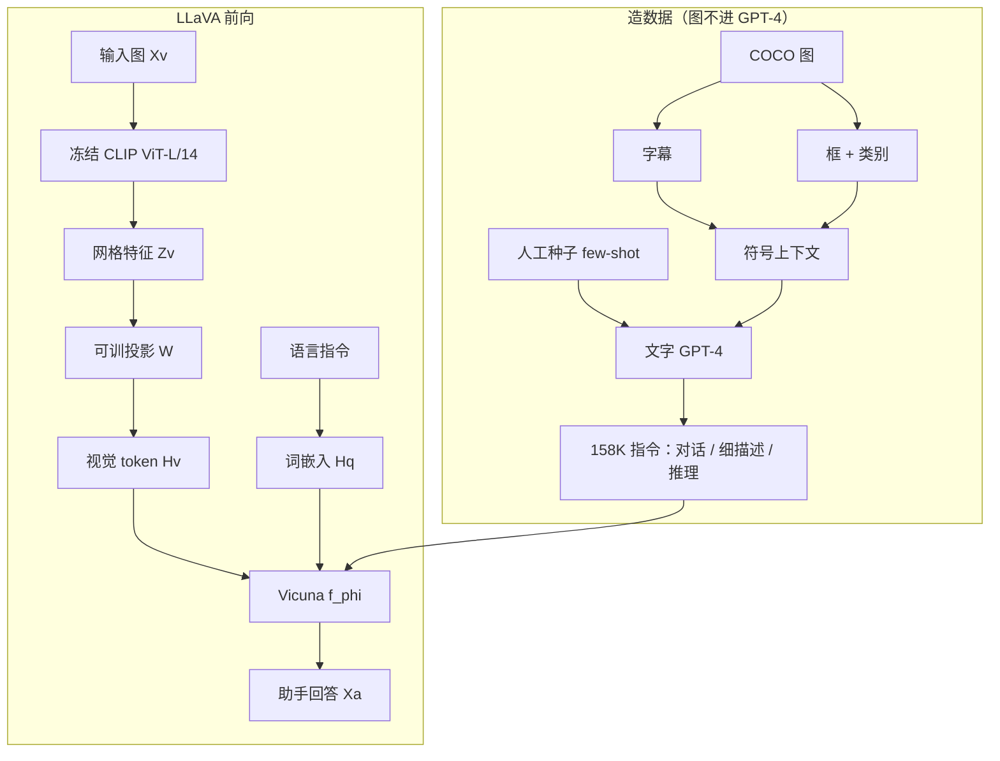

# LLaVA：用语言-only 的 GPT-4 造视觉指令，再拿一层投影把 CLIP 接到 Vicuna 上

<!-- release-date: 2023-04-17 -->

**本文依据**：`Visual Instruction Tuning`，正文模型名 **LLaVA: Large Language and Vision Assistant**，arXiv 2304.08485v2（页眉 `[cs.CV] 11 Dec 2023`），25 页。作者 Haotian Liu、Chunyuan Li、Qingyang Wu、Yong Jae Lee；封面机构为 University of Wisconsin–Madison / Microsoft Research / Columbia University（PDF p. 1）。项目页封面写明 [https://llava-vl.github.io](https://llava-vl.github.io)。盘上是 v2。首发日取 arXiv 页面 Submission history 的 `[v1] Mon, 17 Apr 2023 17:59:25 UTC`（[arxiv.org/abs/2304.08485](https://arxiv.org/abs/2304.08485) 的 Submitted on 17 Apr 2023），这是外部补充，不来自 PDF 正文。封面页脚印着 `37th Conference on Neural Information Processing Systems (NeurIPS 2023).`（PDF p. 1），本文只记封面已印的这一行，不另补录用细节。文中数字均标 PDF 页码；标「外部补充」的段落不来自本文。

## 一句话

语言这边已经会用指令微调把 LLM 收成通用助手，视觉这边还缺「图+指令」这种跟得上的数据。LLaVA 的做法是：不把图喂给 GPT-4，只用 COCO 的字幕和框把场景写成符号，让 **只吃文字的 GPT-4** 造出 158K 条视觉指令（对话 58K、细描述 23K、复杂推理 77K）（PDF p. 4）；再用一层可训练线性投影，把冻结的 CLIP ViT-L/14 网格特征接到 Vicuna 的词嵌入空间，两阶段训完一个端到端多模态助手（PDF p. 4–5）。在自建的合成指令评测上相对「看过真字幕和框的文字 GPT-4」打到 85.1%；在 Science QA 上单模型 90.92%，再让文字 GPT-4 当裁判，和 LLaVA 一起到 92.53%（PDF p. 1、p. 7–8）。

它解决的不是「再做一个更强的看图说话头」，而是另一句：**多模态缺的是指令格式的数据，不是又一个复杂融合模块；GPT-4 可以当老师造数据，投影层可以当适配器把现成视觉编码器和现成 LLM 焊在一起。**

## 一、矛盾：视觉模型接口是焊死的，语言已经把任务写成句子了

人同时用视觉和语言理解世界。作者想要的是一个通用助手：能跟着多模态指令走，对齐人的意图，去完成野外任务（PDF p. 1）。

当时视觉这边的主线是「语言增强的基础视觉模型」：分类、检测、分割、配文、生成和编辑，各有各的大模型（PDF p. 1）。任务指令被焊在模型设计里；语言主要用来描述图里有什么。结果是接口固定、交互弱，换一句用户指令就要换一个模型（PDF p. 1）。

语言那边相反。LLM 把语言收成通用接口：任务写成句子，端到端助手按句子切到对应任务。ChatGPT、GPT-4 证明对齐过的 LLM 能跟人指令对齐；开源这边 LLaMA、Alpaca、Vicuna、GPT-4-LLM 用机器造的指令数据把对齐能力抬上来——但这些工作全是纯文本（PDF p. 1–2）。

相关工作把现有视觉指令智能体分成两类（PDF p. 2）：一类是按课题端到端训的（视觉语言导航、InstructPix2Pix 这类按指令改图）；一类是 LangChain / LLM 调度一堆专家模型（Visual ChatGPT、MM-REACT、VisProg、ViperGPT）。作者要的是第三种：**一个端到端训出来的语言–视觉模型，同时干多件事**。NLP 的指令微调已经证明能抬零样本和少样本泛化；Flamingo、BLIP-2、FROMAGe、KOSMOS-1、PaLM-E、OpenFlamingo、LLaMA-Adapter 已经能让 LLM 吃图，但它们没有用视觉–语言指令数据显式微调，多模态表现往往弱于纯语言任务（PDF p. 2）。视觉指令微调也不是 visual prompt tuning：前者改的是「会不会听话」，后者改的是适配时省多少参数（PDF p. 2）。

贯穿全文的主轴因此很清楚：**接口已经在语言里打开了，缺的是把图也收进同一套指令格式，并且用得起的数据。** 后面所有设计都围着「GPT-4 造数据 + 投影层接编码器」转。

## 二、全景：符号把图交给文字老师，投影把视觉 token 塞进 LLM

系统可以看成两条并行的线，最后在 Vicuna 里会合。

**造数据这条线。** 图本身不进 GPT-4。COCO 图带字幕和框；字幕从不同角度写场景，框给出物体名和归一化坐标。这两样拼成一段 LLM 读得懂的符号，再配上人工写的少量种子例子做 in-context learning，让 GPT-4 吐出三类回答：多轮对话、细描述、复杂推理（PDF p. 3–4）。图 1 不是这条线，这条线画在表 1 / 附录表 14。

**训模型这条线。** CLIP 视觉编码器读图得到 $Z_v$，线性层 $W$ 把它映成和词嵌入同维的视觉 token 序列 $H_v$，再和语言指令的嵌入 $H_q$ 一起送进 Vicuna，自回归生成助手回答 $X_a$（PDF p. 4 图 1、式 (1)）。

图 1 我能看清：左侧一列是 Vision Encoder（浅蓝）叠 Projection $W$（浅橙），中间标 $Z_v$，箭头指向一串空心方块 $H_v$；右侧语言指令 $X_q$ 向上变成实心方块 $H_q$；上方一条浅绿长条是 Language Model $f_\phi$，再往上三颗绿棋子是 Language Response $X_a$。这是机制示意图，不是实测曲线。

上图根据 PDF p. 3–5 第 3–4 节与 p. 4 图 1 重画，是机制示意。

两阶段训练把这条前向拆开用（PDF p. 5）：

1. **特征对齐预训练**：视觉编码器和 LLM 都冻住，只训 $W$，在过滤后的 CC-595K 上用「随机一句简短描述指令 + 原字幕当答案」把视觉 token 对齐到词嵌入。
2. **端到端指令微调**：视觉编码器仍冻，更新 $W$ 和 Vicuna 参数 $\phi$。聊天走 158K 指令；Science QA 走该基准自己的问答。

损失只算助手要说的那些 token（表 2 里标绿的回答段），指令和停记不算（PDF p. 5）。

## 三、数据：图文对很多，指令几乎没有，所以让 GPT-4 当标注员

### 旧问题

公开图文对已经从 CC 涨到 LAION，但多模态指令跟随数据很少。人工众包又贵、规范也不清楚（PDF p. 2–3）。最便宜的扩法是：给人一句「请描述这张图」，答案直接用原字幕。格式对了，多样性和深度推理都没有（PDF p. 3）。

### 新设计

把「造指令」收成一次 **数据改写**：已有图文对改成指令格式，老师是 ChatGPT / GPT-4（PDF p. 2–3）。关键约束：这些老师 **只吃文字**。要把图编码成它们认得的序列，作者用两种符号（PDF p. 3）：

- **字幕**：从不同视角描述场景；
- **框**：物体概念加空间位置。

表 1 / 附录表 14 是同一张地下车库装箱的例子。我能从文本层读到：五句字幕写「一群人、黑色 SUV、行李、地下停车场」；框列出 person / backpack / suitcase / bicycle / car 和归一化坐标。GPT **看不到原图**，图只给人看当参考（PDF p. 3、p. 23）。三类输出：

- **对话**：假装助手在看图。问物体类型、计数、动作、位置、相对位置；只收有确定答案的问题（PDF p. 3）。
- **细描述**：先让 GPT-4 整理一份「请详细描述」的问句清单，每张图随机抽一句去生成长描述（PDF p. 3–4）。
- **复杂推理**：在前两类已经盯住视觉内容之后，再造需要逐步、严密逻辑的问题（PDF p. 4）。

人工标注几乎只用在种子：每类先手写几个例子，作为 in-context learning 的 few-shot（PDF p. 3）。附录表 13 给出对话类的系统提示：强调「你在看一张图」、答案要像看见了图、只问能确定的内容，并允许问背景知识和事件，但不要不确定的细节（PDF p. 22）。表 15、表 16 是雪中消防栓和滑雪者两条种子对话（PDF p. 24–25）。细描述和复杂推理的完整 prompt，正文让读者去代码仓看（PDF p. 22）。

规模：一共 **158K** 条不重复的语言–图像指令样本——对话 **58K**、细描述 **23K**、复杂推理 **77K**（PDF p. 4；正文这里复杂推理写作 `77k`）。早期消融过 ChatGPT 和 GPT-4，GPT-4 质量更稳，空间推理更明显（PDF p. 4）。没有给出两条老师的逐项分数表。

聊天微调时三类均匀抽样；对话是多轮，另外两类是单轮（PDF p. 5）。

### 工作机制

符号上下文让文字模型「看见」场景里有谁、在哪。种子例子把语气钉死成「视觉助手」。于是同一张 COCO 图可以长出：短问答、一整段细描述、以及「这些人面临什么挑战」这种要排行李、还要考虑驾驶视野的推理（PDF p. 23）。第一轮指令在序列里还允许随机把图放在问题前或后，后续轮次只放文本问题（PDF p. 4 式 (2)）。

### 收益

不必为「视觉指令」从零众包。用已有图文对就能扩出深度和多样性都比「字幕当答案」强的数据。后面聊天评测会显示：没有指令微调时相对分只有 21.5，三类数据齐了到 85.1（PDF p. 6–7 表 4）。

### 代价 / 边界

老师没看见像素。空间关系、细纹理、图上的字，全部经过字幕和框的信息瓶颈。框是 COCO 风格的检测框，不是像素级 mask。造出来的「看图」能力，上限是符号能编码的那一层。作者自己也把 GPT-4 质量更好写成早期观察，不是一张完整消融表。

### 可迁移

缺指令数据时，先问：**现成标注能不能改写成老师模型读得懂的符号，而不是一上来请人写对话。** 字幕加框是一种最小视觉语言。种子要少而精，多样性主要靠老师采样。自己做时要接受：老师没看见的细节，学生也学不会。

## 四、架构：不重做融合，只把视觉特征写成词

### 旧问题

Flamingo 用门控交叉注意力，BLIP-2 用 Q-former，都是相对重的图–文接口（PDF p. 4）。作者要在「数据为中心」的实验里快速迭代，融合模块太重会拖住数据实验（PDF p. 4）。

### 新设计

LLM 选公开指令能力最好的 Vicuna，记为 $f_\phi$（PDF p. 4）。视觉编码器选 CLIP 的 ViT-L/14，网格特征 $Z_v = g(X_v)$；实验里试了最后一层 Transformer **之前**和**之后**两种网格（PDF p. 4）。连接就是一个可训练矩阵：

$$H_v = W \cdot Z_v, \quad Z_v = g(X_v)$$

$H_v$ 和词嵌入同维，当作一串视觉 token 拼进语言模型（PDF p. 4 式 (1)）。更复杂的接口留作未来工作。

### 工作机制

图 → 冻结 CLIP → 网格 → 线性层 → 视觉 token；句子 → 词嵌入；两者在 Vicuna 里按自回归目标混在一起。图像对所有回答都是条件，式 (3) 里显式写出 $X_v$（PDF p. 4–5）：

$$p(X_a \mid X_v, X_{\mathrm{instruct}}) = \prod_{i=1}^{L} p_\theta(x_i \mid X_v, X_{\mathrm{instruct},<i}, X_{a,<i})$$

表 2 的训练串是 Vicuna-v0 风格：系统消息、`Human :` 指令、`Assistant:` 回答，停记 `<STOP> = ###`。损失只落在助手回答和该在哪停（PDF p. 5）。第一轮图和问题的左右顺序随机，避免模型死记「图总在左边」。

Science QA 上后来发现：用最后一层之前的特征比最后一层高 0.96 个点（90.92% 对 89.96%）。作者的假说是：CLIP 最后一层更偏全局、抽象，前一层更偏局部细节（PDF p. 9 表 8）。这是假说，不是特征可视化证据。

### 收益

投影轻，数据实验转得快。两阶段里第一阶段甚至只动 $W$，等于给冻住的 LLM 训一个兼容的视觉分词器（PDF p. 5）。

### 代价 / 边界

没有交叉注意力里那种反复看图。视觉信息进 LLM 之后，就是普通 token，不再有专门的「再看一眼」。作者在 In-the-Wild 冰箱例子里观察到：问有没有草莓味酸奶，模型说有——冰箱里其实是酸奶和草莓分开放。他们把这解释成有时把图当成 **bag of patches**，没抓住复杂语义（PDF p. 7）。高分辨率、细品牌字、需要上网查的配菜，这篇设定里都没有专门模块（PDF p. 7 表 6）。

### 可迁移

先把「编码器出的向量」线性映到「LLM 的词空间」，用数据去挤这个接口，再决定要不要上 Q-former。自己做时记住：轻接口换来的是迭代速度，也换来「空间结构可能被摊平成一袋 patch」。

## 五、两阶段训练：先对齐词空间，再放开 LLM 学听话

### 旧问题

直接在指令数据上把 LLM 和投影一起训，视觉特征和词嵌入还没对齐，容易把预训练语言知识冲掉。Science QA 上跳过预训练、从该基准从头训，精度掉到 85.81%，比最好变体低 5.11 个点（PDF p. 9）。

### 新设计

**阶段 1：特征对齐预训练。** 为了在概念覆盖和效率之间折中，把 CC3M 滤成 **595K** 图文对（PDF p. 5）。附录 E：用 spaCy 抽名词短语，频率小于 3 的跳过（多半是已经被别的字幕盖住的罕见组合）；从剩余低频短语开始往候选池加字幕；某个短语超过 100 次就随机留 100 条。滤完大约 595K 对（PDF p. 20–21）。图 7 图注写滤前独特名词短语 108182、滤后 31423；读图能看到横轴是按频率降序的短语、纵轴频率对数坐标，两条曲线都从高频往右掉。这是统计图，不是精度曲线。

这些对用第三节那种「朴素扩写」变成单轮指令：问题从「请简短描述」清单里随机抽（附录表 11 有 11 句同义问法），答案是原字幕（PDF p. 5、p. 20）。冻视觉编码器、冻 LLM，只训 $W$。

**阶段 2：端到端微调。** 视觉编码器始终冻。可训练参数 $\theta = \{W, \phi\}$。两条下游（PDF p. 5）：

- **多模态聊天**：158K 指令，三类均匀抽。
- **Science QA**：单轮；问题加上下文当指令，推理加选项答案当 $X_a$。ScienceQA 有 21k 多选题，3 个学科、26 个主题、127 个类、379 项技能；训练 / 验证 / 测试为 12726 / 4241 / 4241（PDF p. 8）。

### 工作机制 / recipe

聊天设定（PDF p. 5、附录 C p. 20）：8× A100；超参跟 Vicuna。预训练 CC-595K：**1** 个 epoch，学习率 $2\times 10^{-3}$，batch 128。指令微调 LLaVA-Instruct-158K：**3** 个 epoch，学习率 $2\times 10^{-5}$，batch 32。Adam，无 weight decay，cosine 学习率，warmup 比例 3%。微调用 FSDP 和 gradient checkpointing 省显存，不用 offload；开 BF16 和 TF32。预训练约 **4** 小时，Instruct-158K 约 **10** 小时，Science QA 约 **4** 小时（PDF p. 20）。

Science QA 默认：视觉特征用最后一层之前；先说理由再说答案；训 **12** 个 epoch，单模型 90.92%（PDF p. 8）。消融（PDF p. 9 表 8）：

- 先答后推理：12 epoch 最好到 89.77%；先推理能在 **6** epoch 就到 89.77%，再训不再涨。24 epoch 没帮助。作者结论：类 CoT 的「先推理」主要加速收敛，对最终点帮助不大。
- 7B 相对最好的 13B：89.84%，低 1.08 个点。

聊天和 Science QA 是两条分开的微调，不是同一个 checkpoint 同时报两个榜——正文把它们写成两个 use case。

### 收益

阶段 1 把视觉 token 塞进冻住的词空间，阶段 2 才让 LLM 改说话方式。跳过阶段 1 在 Science QA 上掉 5.11 个点，说明对齐阶段在保预训练知识（PDF p. 9）。

### 代价 / 边界

CLIP 始终冻，视觉编码器不会为「听话」改表示。预训练只用滤过的 595K，不是全量 CC3M 或 LAION。聊天 3 epoch、Science QA 12 epoch，两套 recipe 不能混着抄。附录说能量消耗目前不是主忧，是因为预训练数据相对小；把数据或模型扩到 LLaMA 65B 这一档才会成为问题（PDF p. 14）。

### 可迁移

多模态接 LLM 时，**先只训投影、冻住两边**，确认视觉 token 已经像词，再解冻语言侧。过滤图文对可以按名词短语做覆盖，而不是随机子采样——低频概念先保，高频封顶（这里是 100）。

## 六、聊天评测：用文字 GPT-4 当裁判，并自己造两套 bench

### 定性

表 3 用 GPT-4 论文里的「极限熨烫」图（PDF p. 6）。问「这张图有什么不寻常」。LLaVA 说有人在面包车后部熨衣服，场景不安全也不常规。同一图另开对话问「发生了什么」，它会讲黄 SUV、梯子、城市街道——细节和第一轮不完全同一套（车型、是否在车顶），但都在围着「车上熨衣服」转。引用的多模态 GPT-4 回答更短：人在行驶的出租车上、熨衣板焊在车顶。BLIP-2 只说有人坐在黄出租后部；OpenFlamingo 说有人在车盖上晾衣服。作者的判断：LLaVA 在跟指令，那两个基线在配文；LLaVA 甚至比 GPT-4 引用回答更铺陈。这是挑选例子，不是统计。

附录还有鸡块世界地图梗（表 9，PDF p. 15）：LLaVA 和 GPT-4 都解释了「把地球说成鸡块拼的地图」这个笑话，BLIP-2 几乎在读图上的字，OpenFlamingo 说成空间站上的鸡块。图 2：用户手绘笑话网站线框，LLaVA 吐 HTML/JS/CSS，修一处标红的小错之后按钮能工作；作者说还该把笑话和包袱拆成两行、点击才揭包袱（PDF p. 16）。图 3–6 展示：按冰箱内容给食谱、看湖上码头写旅行博文、把日落船头联想到泰坦尼克、认出蒙娜丽莎以及恶搞版、认出马斯克的头像和狗头梗——训练的对齐数据和指令数据里都没有马斯克，作者推测 CLIP 可能见过，LLM 再把这个视觉概念泛化出去（PDF p. 14、p. 18–19）。这些都是定性观察。

聊天模型大约在 **80K** 张不重复图上做指令微调（PDF p. 6）。这些图对 LLaVA 是域外时，仍能对场景给一个说得通的回答。

### 定量口径

受 Vicuna 启发，用 GPT-4 打生成质量（PDF p. 6–7）。三元组：图、真值文本描述、问题。候选模型看图+问题作答。参考上界：文字 GPT-4 只看问题和真值文本描述（不看像素）。裁判还是文字 GPT-4：看到问题、视觉信息（仍是文本描述）、两个助手的回答，打有用性、相关性、准确性、细节，1–10 分，并写解释。报道的是相对参考 GPT-4 的分数。

**LLaVA-Bench (COCO)。** COCO-Val-2014 随机 30 张图，每张用第三节流水线造三类问题，共 90 题。测的是同一套视觉输入上的对齐（PDF p. 7）。表 4（相对分，PDF p. 6–7）：

| 训练数据 | 对话 | 细描述 | 复杂推理 | 全部 |
| --- | --- | --- | --- | --- |
| 全数据 | 83.1 | 75.3 | 96.5 | 85.1 |
| 细描述 + 复杂推理 | 81.5（−1.6） | 73.3（−2.0） | 90.8（−5.7） | 81.9（−3.2） |
| 对话 + 5% 细描述 + 10% 复杂推理 | 81.0（−2.1） | 68.4（−7.1） | 91.5（−5.0） | 80.5（−4.4） |
| 仅对话 | 76.5（−6.6） | 59.8（−16.2） | 84.9（−12.4） | 73.8（−11.3） |
| 无指令微调 | 22.0（−61.1） | 24.0（−51.3） | 18.5（−78.0） | 21.5（−63.6） |

作者读表：指令微调相对无指令抬 **50** 分以上；加一点点细描述和复杂推理，总分大约再抬 **7** 分，对话本身也涨，说明推理能力会反哺闲聊；三类齐了最好，85.1%（PDF p. 7）。

**LLaVA-Bench (In-the-Wild)。** 24 张图、60 题：室内外、梗图、画、素描等；每张配人工写的极细描述和选过的问题，用来压模型短板（PDF p. 7）。表 5（均值 ± 标准差，PDF p. 7）：

| 模型 | 对话 | 细描述 | 复杂推理 | 全部 |
| --- | --- | --- | --- | --- |
| OpenFlamingo | 19.3 ± 0.5 | 19.0 ± 0.5 | 19.1 ± 0.7 | 19.1 ± 0.4 |
| BLIP-2 | 54.6 ± 1.4 | 29.1 ± 1.2 | 32.9 ± 0.7 | 38.1 ± 1.0 |
| LLaVA | 57.3 ± 1.9 | 52.5 ± 6.3 | 81.7 ± 1.8 | 67.3 ± 2.0 |
| LLaVA† | 58.8 ± 0.6 | 49.2 ± 0.8 | 81.4 ± 0.3 | 66.7 ± 0.3 |

前三行各做三次推理。† 是固定 LLaVA 解码、问三次 GPT-4 裁判，评分稳定。相对 BLIP-2 大约 +29%，相对 OpenFlamingo 大约 +48%；复杂推理相对「看过真值描述的文字 GPT-4」到 81.7%，总分 67.3%（PDF p. 7）。

表 6 两张难例（PDF p. 7–8）：一兰拉面要店名和配菜，需要多语和可能的外部知识；冰箱要读出 Fage 蓝莓酸奶品牌，还要回答「有没有草莓味酸奶」（没有，只有酸奶和草莓）。LLaVA 会在后一题上说 yes。作者希望这套 bench 当后续 LMM 的难底板。

### 代价 / 边界

裁判是文字 GPT-4，视觉输入对裁判仍是文本描述，不是像素。相对分依赖「真值描述有多细」。In-the-Wild 只有 24 图 / 60 题，方差在细描述上到 ±6.3。定性例子是挑选的。OCR、梗、名人识别被写成涌现，训练覆盖很少（PDF p. 14–15）。

### 可迁移

评「会不会听话」时，配文指标不够。用更强的文字模型当裁判可以，但要把图先写成文本，分数测的是 **相对于这段文本上界** 还有多远，不是绝对多模态智力。三类指令数据不要只堆闲聊。

## 七、Science QA：先自己接近 SoTA，再让 GPT-4 当裁判创 92.53%

表 7 按学科（NAT / SOC / LAN）、上下文模态（TXT / IMG / NO）、年级（G1-6 / G7-12）拆开报，最后一列是平均（PDF p. 8–9）。文献里的代表与当时 SoTA：Human 88.40；GPT-3.5 73.97；GPT-3.5 + CoT 75.17；LLaMA-Adapter 85.19；MM-CoT Base 84.91；MM-CoT Large 91.68。作者自己跑：文字 GPT-4、2-shot in-context 82.69（相对 GPT-3.5 的 75.17 绝对 +7.52）。很多题 GPT-4 直接说缺图或缺图。LLaVA 平均 90.92，已经接近 MM-CoT Large；它在 SOC 上 95.95，明显高于 MM-CoT Large 的 82.00，IMG 上下文 88.00 对 88.80，两边接近（PDF p. 8 表 7）。

把表 7 里作者自己跑的四行平均列和几个关键切片抄在下面，便于对照（数字均 PDF p. 8）：

| 方法 | NAT | SOC | LAN | TXT | IMG | NO | G1-6 | G7-12 | 平均 |
| --- | --- | --- | --- | --- | --- | --- | --- | --- | --- |
| GPT-4† | 84.06 | 73.45 | 87.36 | 81.87 | 70.75 | 90.73 | 84.69 | 79.10 | 82.69 |
| LLaVA | 90.36 | 95.95 | 88.00 | 89.49 | 88.00 | 90.66 | 90.93 | 90.90 | 90.92 |
| LLaVA+GPT-4†（补位） | 90.36 | 95.50 | 88.55 | 89.05 | 87.80 | 91.08 | 92.22 | 88.73 | 90.97 |
| LLaVA+GPT-4†（裁判） | 91.56 | 96.74 | 91.09 | 90.62 | 88.99 | 93.52 | 92.73 | 92.16 | 92.53 |

† 是文字 GPT-4，作者自己评。Human 平均 88.40 写在表的上半，不列入上表以免和「自己跑」混在一起。补位几乎不涨，说明 GPT-4 拒答的那些题，LLaVA 本来就会；裁判在每一列都涨，G7-12 从 90.90 到 92.16，IMG 从 88.00 到 88.99，涨幅不大但方向一致。

两种集成（PDF p. 8）：

1. **GPT-4 补位**：GPT-4 答不出时用 LLaVA。90.97，几乎等于 LLaVA 自己。
2. **GPT-4 当裁判**：两者答案不同时，再问一次 GPT-4，让它看问题和两个结果给最终答案。精神像 CoT，但外部知识来自另一个模型。各类都涨，平均 **92.53%**，作者称为新 SoTA。

有意思的是：不会看图的文字 GPT-4，也能抬「上下文是图」的那部分题——有些题其实不需要图。裁判能认出这种题，并改正 LLaVA 的错（PDF p. 8）。附录表 10 摇椅材料：选项木头 / 丝绸。LLaVA 看图后说椅腿木头、靠背和座丝绸，选丝绸；文字 GPT-4 凭常识选木头；裁判认为丝绸当结构材料不合理，最终选木头（PDF p. 19）。作者写这是他们所知第一次用 GPT-4 做模型集成（PDF p. 8–9）。

### 可迁移

两个强模型意见不一致时，把「再问一次更强的语言裁判」当成集成，而不是只在 GPT-4 拒答时补位。代价是：裁判会用世界常识覆盖视觉证据——摇椅例子里，如果图上真是丝绸座面，裁判仍可能判成木头。

## 八、论文自己划的风险、没写的东西、以及不要把后续代际读进来

附录 A（PDF p. 14）：LLaVA 建在 LLaMA、Vicuna、CLIP 上，继承 LLM 和视觉编码器的问题。发布侧用 OpenAI Filter API 挡有害文本指令、NSFW 过滤器挡图。幻觉、偏见（CLIP 和 LLaMA/Vicuna 两侧都会传）、评测复杂度（幻觉程度、细粒度理解还要另测）都点名了。能量目前不是主忧，扩数据或扩到 65B 才会是。作者认为对研究社区放模型的收益大于风险。

正文没写的：投影矩阵的具体形状和视觉 token 长度；CLIP 权重是 OpenAI 原版还是 OpenCLIP；Vicuna 7B / 13B 的具体 checkpoint 名（只在消融里出现 7B 对 13B）；GPT-4 / ChatGPT 的模型快照日期和造 158K 花了多少钱；指令数据的人工验收比例。结论把本篇定位成视觉指令微调的第一步，主战场是真实生活任务；学术基准上更完整的数字，指向另一篇「improved baselines with visual instruction tuning」[32]（PDF p. 9、p. 14）。**那是后作，不是本 PDF 的结果，本文不把后续模型名写进来。**

开源清单在附录 D：代码、prompt、LLaVA-Instruct-158K、两套 Bench；压缩后 checkpoint 25GB，超过当时 GitHub LFS 5GB 限制，正文写将公开或应审稿人请求提供（PDF p. 20）。封面项目页是 [https://llava-vl.github.io](https://llava-vl.github.io)。匿名仓名 `LLaVA-Annonymous/LLaVA` 是投稿资产说明，不应当成现在的官方地址。

附录表 11、表 12 把「简短描述」和「详细描述」各自写成十来句同义指令，训练时随机抽，避免模型只认一句固定 prompt（PDF p. 20–21）。这和阶段 1「朴素扩写」是同一件事：问题侧要有自然语言方差，答案侧阶段 1 仍是原字幕。复杂推理没有同样的问句清单印在附录里，只在第三节用文字定义。

并行、通信、算子优化本 PDF 几乎不写。能落到纸上的系统数字就是：8× A100、FSDP、gradient checkpointing、不开 offload、BF16+TF32、以及上面那三个「约 N 小时」（PDF p. 20）。没有吞吐、没有 MFU、没有序列长度。推理侧只有聊天 demo 和 Science QA 答题格式，没有延迟表。

## 九、读完可以带走的几条

1. **缺的是指令格式，不一定缺融合模块。** 一层 $W$ 加上冻住的 CLIP 和 Vicuna，已经能在聊天和 Science QA 上打出正文那些数字。
2. **老师可以不看像素。** 字幕加框是够 GPT-4 造对话、细描述和推理的最小视觉语言；信息瓶颈也原样传给学生。
3. **先对齐、再听话。** 只训投影的阶段 1 不是可选项：Science QA 上值 5.11 个点。
4. **评听话要用指令 bench，不要只用配文。** 无指令微调相对分 21.5，三类数据齐了 85.1。
5. **语言裁判能集成，也会用常识盖过视觉。** 92.53% 和摇椅选木头是同一套机制的两面。

CLIP 在本篇里只是被接上的开放词汇视觉编码器：提供 ViT-L/14 网格，自身对比预训练目标不再改。要追「图文配对判别怎么把视觉接到开放概念」，读本方向的 CLIP 一文，不要从本篇倒推 CLIP 的训练。

## 十、关键词怎么接回系统

**视觉指令微调（visual instruction tuning）** 是把 NLP 那套「用指令数据对齐 LLM」搬到图–文，目标是听话，不是省参数。**LLaVA** 是这篇里端到端训出来的助手：CLIP 视觉编码器 + 线性投影 + Vicuna。**符号视觉上下文** 是字幕和框，用来骗只吃文字的 GPT-4 当标注员。**投影层 $W$** 是视觉网格到词嵌入的适配器，阶段 1 只动它。**LLaVA-Instruct-158K** 是造出来的指令集；**CC-595K** 是按名词短语滤过的对齐预训练集。**LLaVA-Bench** 分 COCO 对齐板和 In-the-Wild 难板，分数是相对「看过真值文本的 GPT-4」。**Science QA 上的 GPT-4 judge** 是答案不一致时的二次语言集成。

## 参考资料

- 原件：`readings/_src/多模态理解与 Omni/LLaVA.pdf`（arXiv:2304.08485v2，25 页）
- arXiv 条目（v1 日期的外部补充）：[https://arxiv.org/abs/2304.08485](https://arxiv.org/abs/2304.08485)
- 封面项目页：[https://llava-vl.github.io](https://llava-vl.github.io)
- 本 PDF 用到的视觉编码器前作：Radford 等，`Learning Transferable Visual Models From Natural Language Supervision`（CLIP）
