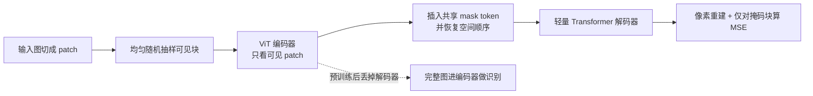

# MAE：把 75% 的图挡掉，用不对称编解码把视觉自监督做成可扩的预训练

<!-- release-date: 2021-11-11 -->

**本文依据**：`Masked Autoencoders Are Scalable Vision Learners`，arXiv 2111.06377v3（页眉 `[cs.CV] 19 Dec 2021`），14 页。作者 Kaiming He、Xinlei Chen、Saining Xie、Yanghao Li、Piotr Dollár、Ross Girshick，Facebook AI Research (FAIR)；Kaiming He 与 Xinlei Chen 为 equal technical contribution，Kaiming He 为 project lead（PDF p. 1）。盘上 PDF 为 v3；首发日取 arXiv 页面 Submission history 的 `[v1] Thu, 11 Nov 2021 18:46:40 UTC`（[arxiv.org/abs/2111.06377](https://arxiv.org/abs/2111.06377) 的 Submitted on 11 Nov 2021），这是外部补充，不来自 PDF 正文。封面未写会议录用，本文不补会议名。文中数字均标 PDF 页码；标「外部补充」的段落不来自本文。

## 一句话

视觉里随便挖掉一块，邻居像素就能补回来，预训练任务太容易。MAE 把随机 patch 挡掉大约 75%（PDF p. 1），编码器只看剩下那 25% 的可见块，mask token 全部推到一个很轻的解码器里，再在像素空间重建被挡掉的块。两件事叠在一起：任务变难，计算变少。vanilla ViT-Huge 只在 ImageNet-1K 上预训练再微调，224 分辨率 86.9%、448 分辨率 87.8%（PDF p. 7 表 3），当时在「只用 IN1K」这条线上最好。

它解决的不是「再发明一种对比学习」，而是另一句：**图像信息密度低，所以必须挡得更狠；解码器语义层级低，所以必须不对称**。挡得狠，编码器才有理由学整体结构；不对称，大模型才训得起。

## 一、矛盾：BERT 那套搬到图上为什么一直慢半拍

NLP 已经用自监督把模型扩到一千亿参数以上：GPT 做自回归，BERT 做掩码重建（PDF p. 1）。视觉这边，一百万张有标签的 ImageNet 已经不够吃，大模型开始向着几亿张、往往不公开的标注图要数据（PDF p. 1）。

掩码自编码器本身并不新。它是去噪自编码器的一种，视觉里更早的工作已经在挖像素、补大洞（PDF p. 1、p. 3）。BERT 火了之后，视觉也试过，但进度明显落后。作者从三处差异下手（PDF p. 1–2）：

1. **架构曾经不同**。卷积吃规则网格，mask token、位置嵌入不好焊进去。Vision Transformer 把图切成 patch 当 token，这条缝补上了。
2. **信息密度不同**。语言是人写出来的，语义密。一句话挖几个词，模型就得真正懂上下文。图像空间冗余极重：缺一块，常常靠邻居纹理就能补，不必理解物体和场景。
3. **解码器角色不同**。语言里解码器预测的是词，词本身就很语义，BERT 用一层 MLP 当解码器就够。视觉里解码器重建的是像素，语义层级比识别任务低一截。解码器怎么设计，会直接决定编码器潜表示停在哪一层。

对比学习当时是视觉自监督的主流，依赖强数据增强，建模的是多视图之间像不像（PDF p. 3）。自编码走另一条路：给定残缺观察，重建原信号。全文方法都围着「高掩码比 + 不对称编解码」转。

图 1（PDF p. 1）把流水线画成：输入图大量随机挖空 → 编码器只吃可见 patch → 编码后再插入 mask token → 轻量解码器吐出像素重建。读图能看清：左侧原图被切成格子，大部分格子是灰块；中间一串彩色 token 进 encoder；右侧 decoder 的输入里灰块（mask token）和彩色块混在一起，输出一张完整重建。预训练之后解码器扔掉，识别时编码器看完整、未损坏的图。这是机制示意图，不是实测曲线。

## 二、全景：可见块进大编码器，空洞进小解码器

图为机制示意，根据 PDF p. 1 图 1 与 p. 3–4 第 3 节重画，不是实测曲线。

四个部件各管一件事：

- **随机掩码**：不放回均匀抽样，默认挡 75%，任务不能靠邻域外推糊弄过去。
- **编码器**：标准 ViT，但输入里没有 mask token，序列长度只有可见那一截。
- **解码器**：只在预训练用，吃「可见编码 + mask token」全集，把像素补回来。
- **像素损失**：默认 MSE，只在被挡的 patch 上算，可见位置不算。

实现上不需要稀疏算子：先给每个 patch 做线性投影加位置嵌入，随机打乱 token 列表，按掩码比丢掉末尾一段，等价于不放回抽样；编码完再把 mask token 接回去、按打乱的逆操作 unshuffle，对齐重建目标（PDF p. 4）。打乱/还原开销可忽略。

## 三、高掩码比：把冗余先掐死

### 旧问题

低掩码比时，缺的那块往往能从旁边「画过去」。任务退化成低层统计，学不到物体和场景。BERT 典型掩码比是 15%；当时视觉相关工作大约 20%–50%（PDF p. 4）。

### 新设计

均匀随机、不放回地抽可见 patch，其余直接删掉，不是填一个特殊值再送进编码器（PDF p. 3）。均匀分布避免中心偏置（中心被挡得特别多）。默认 75%：196 个 $16\times 16$ patch 的 224 图大约只剩 49 个可见块。图 2 的演示用了 80%，只剩 39/196（PDF p. 2）。

### 工作机制

挡得够多，邻域外推失效，模型必须对 gestalt（物体和场景的整体结构）做推断。图 4（PDF p. 3）用 75% 训练的模型去推 85%、95% 的输入：读图能看到，75% 时主体轮廓大体对；85% 仍能认出场景类型；95% 时细节乱、但颜色块和大致布局仍说得通，和真图可以不一样。作者把它解释成「合理但不同」的预测，说明任务泛化了，不是死记像素。

图 2（PDF p. 2）是 ImageNet 验证集三元组：左掩码、中重建、右真图。作者故意不把可见块贴回输出——可见位置没算损失，输出质量更差，贴回去会好看，但会掩盖行为。图 3 用同一套 ImageNet 训练权重去重建 COCO 验证图：最右侧两例重建和真图不同，但语义上说得通（PDF p. 2）。附录图 10、图 11 是未挑选的随机样本，掩码 75%（PDF p. 13–14）：读图能看到动物、车辆、食物、室内外场景大体结构常能补上，文字、精细纹理、小部件经常糊或编错。这是定性观察，不是精度数字。

### 收益

图 5（PDF p. 4）：ViT-L 上 75% 对微调（约 84.9%）和线性探测都好。线性探测对掩码比更敏感，从低掩码的 54.6% 可以爬到 73.5%，差距约 20 个点（PDF p. 4–5）。微调在 40%–80% 一段都还行，且都高于从零训练的 82.5%（PDF p. 5）。

### 代价 / 边界

不是越高越好：图 5 上 90% 附近微调掉到 83.0%，线性探测掉到 66.1%（PDF p. 4 图 5）。块状掩码、网格掩码会改任务难度，见第七节。

### 可迁移

自己做生成式预训练时，先问信号冗余有多高。冗余高就该把损坏做狠，而不是把 BERT 的 15% 原样搬过来。掩码本身也是一种「每步一份新样本」的增强。

## 四、不对称：mask token 不准进大编码器

### 旧问题

若编码器也吃 mask token，预训练输入里大部分是空洞标记，部署时看的是完整图，分布不一致。更贵：75% 掩码时编码器仍要对全集做自注意力，二次复杂度白算（PDF p. 5）。

### 新设计

编码器只处理可见 patch，不放 mask token（PDF p. 3）。解码器才看到全集：可见块的编码，加上一个共享、可学习的 mask token 向量（表示「这里有待预测的洞」）。全集都要加位置嵌入，否则 mask token 不知道自己在哪（PDF p. 3–4）。

解码器深度、宽度可以和编码器解耦，因为部署时解码器扔掉（PDF p. 4）。默认 8 层、宽 512，相对 ViT-L（24 层、1024 维）每个 token 只有约 9% 的 FLOPs（PDF p. 5）。

### 工作机制

信息从可见 token 传到 mask token，最少要一层 Transformer（PDF p. 5）。更深的解码器把「像素重建」这种低层特化留在解码器末几层，编码器潜表示可以更抽象——这对线性探测很关键，对微调没那么关键，因为微调可以改编码器后几层（PDF p. 5）。

表 1c（PDF p. 5）：编码器带 `[M]` 时微调 84.2 / 线性 59.6，FLOPs 3.3×；不带 `[M]` 时 84.9 / 73.5，FLOPs 1×。线性探测差 14 个点。

表 2（PDF p. 5）是 128 个 TPU-v3、TensorFlow、800 epoch 的墙钟：

| 编码器 | 解码器深度 | 微调 | 小时 | 相对加速 |
|---|---|---|---|---|
| ViT-L，带 `[M]` | 8 | 84.2 | 42.4 | — |
| ViT-L | 8 | 84.9 | 15.4 | 2.8× |
| ViT-L | 1 | 84.8 | 11.6 | 3.7× |
| ViT-H，带 `[M]` | 8 | — | 119.6（估，只训 10 epoch） | — |
| ViT-H | 8 | 85.8 | 34.5 | 3.5× |
| ViT-H | 1 | 85.9 | 29.3 | 4.1× |

75% 掩码下加速可以超过 4×，因为自注意力是平方的；显存也降下来，才谈得上再放大模型或加大 batch（PDF p. 5）。摘要里写加速 3× 或更多（PDF p. 1）。

### 代价 / 边界

解码器太浅时线性探测差：1 层 65.5，8 层 73.5，12 层微调反而掉到 84.4（PDF p. 5 表 1a）。太宽也没好处：512 维默认最好，768/1024 微调略差（表 1b）。只关心微调时，1 层解码器已经 84.8，还能再省时间。

### 可迁移

预训练任务和部署输入不一致时，不要把「占位符 token」喂给要留下来的那个塔。特化到生成头的计算，尽量塞进可扔掉的轻模块。

## 五、重建什么：像素就够，不必先学一套视觉词表

### 旧问题

BEiT 预测离散 token，背后是 DALL·E 的 dVAE 分词器，还要多一段预训练，可能依赖额外 2.5 亿张图；dVAE 编码器本身是大卷积网，大约相当于 ViT-L 的 40% FLOPs（PDF p. 6）。ViT 论文里的掩码 patch 预测、iGPT 的像素序列，也是同一家族（PDF p. 3）。

### 新设计

解码器最后一层线性投影，通道数等于一个 patch 的像素数，reshape 成图（PDF p. 4）。损失是像素空间 MSE，**只在掩码 patch 上算**，和 BERT 一样、和经典 DAE 不同——经典 DAE 对所有像素算损失。脚注：对所有像素算会略掉点，大约 0.5%（PDF p. 4）。

变体：每个掩码 patch 先按自身像素算均值和标准差，做 per-patch 归一化再当目标，增强局部对比度（PDF p. 4）。也试过 patch 空间 PCA，留 96 个最大系数当目标（PDF p. 6）。

### 收益

表 1d（PDF p. 5）：未归一化像素 84.9 / 73.5；归一化像素 85.4 / 73.9；PCA 84.6 / 72.3；dVAE token 85.3 / 71.6。归一化像素微调最好；token 相对未归一化像素微调 +0.4，但线性探测更差。作者判断高频分量有用，PCA 把它们扔了所以掉点。

迁移上表 7（PDF p. 8）：归一化像素 vs dVAE token，IN1K / COCO / ADE20K 各档差值在 0.0 到 -0.2 之间，统计上分不出。像素路线更简单，不必多一段 tokenizer。

BEiT 自己报告 ViT-B 重建像素会掉 1.8%；作者用官方代码复现 ViT-L：token 85.2、像素 83.5（PDF p. 7）。MAE 走像素不掉这截。

### 代价 / 边界

像素目标语义低，所以才需要足够深的解码器把特化隔开。论文没有声称生成质量达到专用生成模型；可见位置输出故意很差。

### 可迁移

生成式预训练不必先有离散码本。码本若要额外数据、额外大网络，先用归一化像素对照，再决定值不值得。

## 六、增强很少：对比学习靠两视图，MAE 靠随机洞

表 1e（PDF p. 5）：无增强（只中心裁、不翻转）微调 84.0 / 线性 65.7；固定尺寸裁 84.7 / 73.1；随机尺寸裁（默认，含随机水平翻转）84.9 / 73.5；再加 color jitter 掉到 84.3 / 71.9。所以主实验不用 color jitter。

对比方法极依赖增强：BYOL 只用 crop 会掉 13 个点，SimCLR 掉 28 个点；两视图相同还会塌成平凡解（PDF p. 6）。MAE 每次迭代掩码都不同，等于不断造新样本，pretext 难度主要来自挖洞，不那么需要颜色扰动。

预训练默认也不用 drop path、gradient clip；Transformer 块用 xavier uniform，跟 ViT 官方代码（PDF p. 11）。

### 可迁移

先分清正则是任务本身提供的，还是外挂增强提供的。任务已经够损，再叠强增强可能是负的。

## 七、怎么挖洞：随机最好挖，块和网格都更差

表 1f 与图 6（PDF p. 5–6）：

- **随机 75%**（默认）：84.9 / 73.5。读图 6 左：洞碎、重建轮廓清楚。
- **块状 50%**（BEiT 那种挖大块）：83.9 / 72.3，还凑合；**块状 75%**：82.8 / 63.9，训练损失更高，重建更糊。
- **网格 75%**（每四个里留一个）：84.0 / 66.0。任务更易、训练损失更低、重建更锐，表示更差。

随机抽样能把掩码比拉高，同时吃到加速和精度（PDF p. 6）。

### 可迁移

挖洞模式就是 pretext 难度旋钮。更难不等于更好：块状 75% 难到表示崩了；网格太容易，模型投机。

## 八、训得久：800 epoch 不是终点

消融默认 800 epoch（PDF p. 5 表 1 注）。图 7（PDF p. 6）：ViT-L 微调 100/200/400/800/1600 epoch 大约 82.3 → 83.3 → 84.3 → 84.9 → 85.1；线性探测 57.3 → 64.4 → 69.7 → 73.5 → 75.1，1600 仍未饱和。每个点是完整日程，不是中途截断。

对照：MoCo v3 的 ViT-L 大约 300 epoch 就饱和（PDF p. 6）。口径不同：MAE 每个 epoch 编码器只看 25% 的 patch；对比方法每个 epoch 看 200%（两裁）甚至更多（多裁）。

表 3 的主结果用 1600 epoch + 归一化像素（PDF p. 7）。即便如此，同样 128 TPU-v3 上 ViT-L：MAE 1600 epoch 31 小时，MoCo v3 300 epoch 36 小时（PDF p. 7）。每 epoch 比 BEiT 快 3.5×，原因就是编码器不吃 mask token（PDF p. 7）。

## 九、ImageNet：大模型终于在 IN1K 上不崩

基线骨干是 ViT-L/16。从零训原论文 76.5%；作者自己的强正则配方 82.5%；同一套微调 50 epoch 接到 MAE 上 84.9（从零是 200 epoch）（PDF p. 4）。ViT-L 比 ResNet-50 大约高一个数量级，容易过拟合（PDF p. 4）。

表 3（PDF p. 7），端到端微调，单裁 224×224 top-1，除非注明 448：

| 方法 | 预训练数据 | ViT-B | ViT-L | ViT-H | ViT-H 448 |
|---|---|---|---|---|---|
| scratch，作者实现 | — | 82.3 | 82.6 | 83.1 | — |
| DINO | IN1K | 82.8 | — | — | — |
| MoCo v3 | IN1K | 83.2 | 84.1 | — | — |
| BEiT | IN1K+DALL·E | 83.2 | 85.2 | — | — |
| MAE | IN1K | 83.6 | 85.9 | 86.9 | 87.8 |

ViT 规格是 B/16、L/16、H/14（PDF p. 7）。B 档各方法接近；L 档差距拉开，作者认为大模型的课题是减过拟合。当时「只用 IN1K」的此前最好是 87.1%（512 分辨率、更花的网络）（PDF p. 7）。MAE 用 vanilla ViT、448 分辨率到 87.8%。作者预期更花的网络还会更高，但本文没做。

图 8（PDF p. 7）：横轴参数量，纵轴 IN1K 微调。MAE（只 IN1K）随容量上升，走势接近原 ViT 论文里 JFT-300M 有监督预训练；IN1K 有监督在大模型上饱和甚至变差。读图能看到 B/16、L/16、H/14 三个点标在 MAE 曲线上，监督 IN1K 明显更平。

### 部分微调：线性探测会冤枉生成式特征

线性探测和微调相关性很差（PDF p. 5、p. 7）。线性探测只奖励线性可分；深度学习的长处恰恰是非线性特征。部分微调：冻住前面，只训最后几块（PDF p. 7）。

图 9（PDF p. 7）ViT-L：0 块 = 线性探测 73.5%；只训 1 块到 81.0%；只训最后一块里的 MLP 子块（论文称为 half block）79.1%，已经远好于线性探测；4 或 6 块就接近全微调 84.9。MoCo v3 线性探测更高（文中写 77.6%，见附录 B / 图 9，PDF p. 12），但从训 1 块起全程低于 MAE，4 块时差 2.6%（PDF p. 7）。

作者的判断：线性可分不是表示质量的唯一尺子；NLP 预训练也很少用线性探测当主榜（PDF p. 7–8）。

附录 B 表 12（PDF p. 12）把掩码类方法的线性探测放在一起：iGPT-L 1362M → 69.0；iGPT-XL 6801M → 72.0；BEiT ViT-L 304M → 52.1（作者实现）；MAE ViT-B 86M → 68.0，ViT-L 304M → 75.8，ViT-H 632M → 76.6。仍低于 MoCo v3 的 77.6，但明显高于此前掩码方法。

## 十、迁移：检测、分割、细粒度分类都跟着容量涨

下游用的是表 3 那些预训练权重（PDF p. 8）。

**COCO**，ViT + FPN 的 Mask R-CNN，作者统一实现（PDF p. 8 表 4）：

| 方法 | 数据 | AP$^\mathrm{box}$ B / L | AP$^\mathrm{mask}$ B / L |
|---|---|---|---|
| 有监督 | IN1K 带标签 | 47.9 / 49.3 | 42.9 / 43.9 |
| MoCo v3 | IN1K | 47.9 / 49.3 | 42.7 / 44.0 |
| BEiT | IN1K+DALL·E | 49.8 / 53.3 | 44.4 / 47.1 |
| MAE | IN1K | 50.3 / 53.3 | 44.9 / 47.2 |

相对有监督：ViT-B 框 +2.4（50.3 vs 47.9），ViT-L 框 +4.0（53.3 vs 49.3）（PDF p. 8）。MoCo v3 和有监督持平；MAE 与 BEiT 接近，MAE 更简单更快。超参（lr、wd、drop path、epoch）对表 4 每一格都搜过，具体配置正文没列，指向当时「in preparation」的 [35]（PDF p. 12）。

ViT 接 FPN 的改法（附录 A.3，PDF p. 12）：ViT 全程 stride 16。把堆叠均分成 4 段，用卷积上/下采样得到 stride 4/8/16/32，再搭 FPN。

**ADE20K** UperNet mIoU（PDF p. 8 表 5）：有监督 B/L 47.4 / 49.9；MoCo v3 47.3 / 49.1；BEiT 47.1 / 53.3；MAE 48.1 / 53.6。ViT-L 相对有监督 +3.7。BEiT 用官方代码复现。微调 100 epoch、batch 16，每格搜 lr（PDF p. 12）。BEiT 代码用相对位置偏置；MAE 预训练不用，只在迁移时打开并零初始化，求公平（PDF p. 12）。

**iNat / Places** 表 6（PDF p. 8），IN1K 预训练再微调：

| 数据集 | B | L | H | H448 | 此前最好 |
|---|---|---|---|---|---|
| iNat 2017 | 70.5 | 75.7 | 79.3 | 83.4 | 75.4 |
| iNat 2018 | 75.4 | 80.1 | 83.0 | 86.8 | 81.2 |
| iNat 2019 | 80.5 | 83.4 | 85.7 | 88.3 | 84.1 |
| Places205 | 63.9 | 65.8 | 65.9 | 66.8 | 66.0（10 亿图预训练） |
| Places365 | 57.9 | 59.4 | 59.8 | 60.3 | 58.0（35 亿图预训练） |

iNat 上随容量涨得很陡，超过此前最好一截。Places 上用 IN1K 超过了用十亿、三十五亿图预训练的此前最好（PDF p. 8）。

## 十一、鲁棒性：同一套微调权重，换验证集硬测

附录 C 表 13（PDF p. 12）：表 3 的 MAE 模型，不专门微调，直接在 ImageNet 变体上测。IN-C 是 mean corruption error，越低越好；其余是 top-1。

MAE：IN-C 51.7 / 41.8 / 33.8 / 36.8（B/L/H/H448）；IN-A 35.9 / 57.1 / 68.2 / 76.7；IN-R 48.3 / 59.9 / 64.4 / 66.5；IN-Sketch 34.5 / 45.3 / 49.6 / 50.9。除 IN-C 外，加大分辨率都有帮助。作者称相对此前专门系统的最好结果优势很大。

有监督从零配方（表 13 下半，A.2 那些模型）差一截。ViT-H 的 IN-A：MAE 68.2 vs 有监督 33.1，文中写差 35 个点（PDF p. 12）。

## 十二、训练配方：预训练、微调、线性探测、从零，四套完全不同

数字均来自附录 A（PDF p. 11–12）。学习率按线性缩放：$\mathrm{lr}=\mathrm{base\ lr}\times\mathrm{batchsize}/256$（PDF p. 11）。

**预训练（表 8）**：AdamW；base lr $1.5\times 10^{-4}$；wd 0.05；$\beta=(0.9,0.95)$；batch 4096；cosine；warmup 40 epoch；增强 RandomResizedCrop。不用 color jitter、drop path、gradient clip。

**端到端微调（表 9）**：AdamW；base lr $1\times 10^{-3}$；wd 0.05；$\beta=(0.9,0.999)$；layer-wise lr decay 0.75；batch 1024；cosine；warmup 5；B 100 epoch，L/H 50 epoch；RandAug (9, 0.5)；label smoothing 0.1；mixup 0.8；cutmix 1.0；drop path B/L 0.1、H 0.2。部分微调用同一张表，但块越少 epoch 越长，在 {50, 100, 200} 里挑（PDF p. 11）。

**线性探测（表 10）**：LARS；base lr 0.1；wd 0；momentum 0.9；batch 16384；cosine；warmup 10；90 epoch；只有 RandomResizedCrop。SGD + 4096 batch 也差不多。正则普遍有害：不用 mixup / cutmix / drop path / color jitter。编码器特征后接无 affine 的 BatchNorm，再接线性头；不破坏线性，训完可折进分类器，用来对齐不同消融的特征尺度（PDF p. 11）。

**架构细节（A.1）**：标准 ViT，块内 MSA+MLP，都带 LN，编码器末尾再 LN。编码器、解码器宽度不同，中间加线性投影对齐。位置嵌入是正弦余弦，编码器和解码器输入都加；不用相对位置、不用 layer scaling（BEiT 代码有）。为了适配 ViT 的 class token，预训练时在编码器输入加一个辅助 dummy token，线性和微调时当 class token；不用这个 token、改平均池化也差不多（PDF p. 11）。

**从零训 ViT-L/H（表 11，A.2）**：大模型直接套小模型配方会 NaN。作者用 wd 0.3、batch 4096、warmup 20、$\beta_2=0.95$、EMA 0.9999 等稳住。ViT-L 82.6%（无 EMA 81.5%），ViT-H 83.1%（无 EMA 80.9%），不用 EMA 都过拟合。副产品：ViT-B 82.3%（无 EMA 82.1%），对照 [53] 的 81.8%（PDF p. 12）。表 3 的 scratch 列与这里的 82.6 / 83.1 一致；p. 4 消融里的 82.5 是同一实现口径下的 ViT-L 叙述。

iNat / Places 微调跟表 9，但每个数据集调 lr 和 epoch（PDF p. 12）。

论文说会放代码和 COCO 具体配置；完整检测细节指向 [35]（PDF p. 12）。本文不把仓库现状写成原文。

## 十三、作者自己划的边界

讨论（PDF p. 8）：NLP 里简单自监督能跟着模型指数扩；视觉实践里预训练仍以有监督为主。本文在 ImageNet 和迁移上看到，自编码器这种简单方法也能给出可扩展的好处，作者希望视觉自监督走上类似轨迹。

同时写明：图像不是已经切成「视觉词」的语义信号。MAE 并不试图按物体挖洞，而是随机挖，挖到的多半不是一个语义段；重建的是像素，也不是语义单元。尽管如此，图 4 那种整体、合理的补全，被解释成模型内部已经有丰富的隐表示、学到了不少视觉概念。这是作者的假说，不是下游精度本身。

Broader impacts（PDF p. 8）：模型按训练集统计补内容，会反映数据里的偏见，也可能生成不存在的内容；若拿它做生成，需要另议。

没写的：多模态、视频、卷积主干上的 MAE、以及后来各种变体。那些不是本 PDF 的内容。对比学习的 MoCo 只作为对照实验出现。ViT 是输入切 patch 的前作，不是本文贡献。

## 十四、关键词怎么接回系统

- **高掩码比**：对抗图像冗余，把 pretext 从「补纹理」抬到「补结构」。
- **不对称编解码**：大计算留给可见 token；空洞标记只进可扔掉的轻解码器，同时修预训练–部署缺口。
- **像素目标**：不去先训视觉词表；per-patch 归一化把高频对比度留住。
- **只在掩码上算损失**：可见位置不监督，所以可见位置重建可以很差。
- **线性探测 vs 微调**：生成式特征可以很强但不好线性分；看表示别只看线性探针。
- **增强极简**：随机掩码已经在造新样本。
- **容量友好**：IN1K 上就能把 ViT-H 训出随规模上升的迁移，而不必先有 JFT 级标签。

## 十五、可迁移的几条，收束到整张图

1. **损坏强度要匹配信号密度**。语言 15%、图像 75%，不是超参品味，是冗余不同。
2. **部署不用的模块，就不要占预训练主塔的序列长度**。MAE 的加速主要来自「编码器序列 ×0.25」，不是来自更巧的稀疏核。
3. **重建目标的语义层级，决定解码器该有多深**。像素低语义 → 解码器要深到能把特化隔开；否则线性探测吃亏。
4. **主榜协议会惩罚一类方法**。只用线性探测会系统性地看扁掩码自编码；部分微调或下游密集任务更公平。
5. **配方不能混用**。预训练、微调、线性探测、从零四套超参几乎反着来：线性探测最怕正则，从零最要稳住，微调才上 RandAug / mixup / drop path。

一条线串起来：挡得狠，任务才值得学；编码器不看洞，大模型才训得起；解码器可扔，像素头的低语义才不会污染要留下的表示。这就是 MAE 把「能跑的 ViT 自监督」做成「能扩的视觉学习者」的方式。
