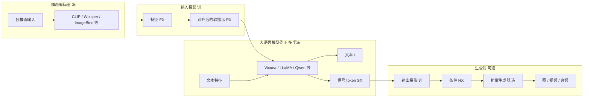

# MM-LLMs-Survey：用「五件套 + 输入输出模态」把 126 个多模态大模型摊成一张地图

<!-- release-date: 2024-01-24 -->

**本文依据**：`MM-LLMs: Recent Advances in MultiModal Large Language Models`，arXiv 2401.13601v5（页眉 `[cs.CL] 28 May 2024`），30 页。作者 Duzhen Zhang、Yahan Yu（并列一作）、Jiahua Dong、Chenxing Li、Dan Su、Chenhui Chu、Dong Yu；封面机构为 Tencent AI Lab, China / Tencent AI Lab, USA / Kyoto University, Japan / Mohamed bin Zayed University of Artificial Intelligence, United Arab Emirates（PDF p. 1）。通讯作者为 Jiahua Dong、Chenhui Chu；脚注写明 Zhang 当时在腾讯 AI Lab 北京实习（PDF p. 1）。盘上是 v5。首发日取 arXiv 页面 Submission history 的 `[v1] Wed, 24 Jan 2024 17:10:45 UTC`（[arxiv.org/abs/2401.13601](https://arxiv.org/abs/2401.13601) 的 Submitted on 24 Jan 2024），这是外部补充，不来自 PDF 正文。封面与页眉都没有印会议录用，本文不补。作者维护的实时跟踪站 [https://mm-llms.github.io](https://mm-llms.github.io) 在摘要与第 1 节脚注里给出（PDF p. 1–2）。文中数字均标 PDF 页码；标「外部补充」的段落不来自本文。

## 一句话

传统多模态预训练要把各模态模型从零一起训，规模一上来就贵。这篇综述把 2022 年 Flamingo 之后大约一年的工作收成 **MM-LLMs**：拿现成单模态基础模型，尤其是现成大语言模型，用便宜的对齐模块接进去，让系统能吃多模态输入、必要时再吐多模态输出（PDF p. 1–2）。他们给出一张通用骨架（五件套）、一条几乎人人都走的训练管线（多模态预训练 + 指令微调），再按「功能」和「设计」两把刀把 126 个模型摊开，并抽出 43 个主流模型对照架构与数据规模（PDF p. 2、p. 5–6）。评测只认真比 18 个视觉–语言基准里的一小撮；作者自己的判断集中在第 6 节：评测已经不够难、生成质量被扩散模型卡住、幻觉和偏见会反复出现（PDF p. 7–9）。

贯穿全文的轴不是「谁分数最高」，而是：**接缝做在哪、输入输出各走哪几路、训练冻住谁。**

## 一、这张地图切了几刀

### 旧图切不动的地方

多模态预训练这些年一直在把下游任务往上推，但模型和数据一放大，从零联合训练的账单就很难看（PDF p. 1）。作者的判断是：多模态本来就坐在各模态交界处，合理做法是用现成的单模态基础模型，尤其是已经很强的大语言模型，少付计算、多借能力（PDF p. 1）。于是出现一个新字段：MM-LLMs。

大语言模型贡献的是生成、零样本迁移和上下文学习；其他模态的基础模型贡献高质量表示。各模态模型本来是分开训的，核心难题变成：**怎么把大语言模型和其他模态模型接上，让它们能一起推理**（PDF p. 1–2）。当时主流答案是两条对齐：模态之间对齐，以及和人的意图对齐；做法收成「多模态预训练 + 多模态指令微调」（PDF p. 2）。

GPT-4(Vision) 和 Gemini 出来之后，这条线热起来。早期工作几乎全是「看懂再写字」：图文理解（BLIP-2、LLaVA、MiniGPT-4、OpenFlamingo）、视频–文本（VideoChat、Video-ChatGPT、LLaMA-VID）、音频–文本（Qwen-Audio）。随后出现「特定模态也能吐出来」：图文输出（GILL、Kosmos-2、Emu、MiniGPT-5），语音/音频输出（SpeechGPT、AudioPaLM）。再往后有人想模仿人的任意模态互转：一条路是大语言模型调度外部工具（Visual ChatGPT、HuggingGPT、AudioGPT），另一条路是端到端任意模态，用来减轻级联系统把误差一路传下去（NExT-GPT、CoDi-2、ModaVerse）（PDF p. 2）。图 1 把这条时间线画到 2024 年 2 月（PDF p. 1）。

### 第一刀：五件套，而不是「又一个融合模块」

第 2 节把通用架构拆成五块，对应图 2（PDF p. 2–4）。只做理解的模型通常只要前三块；要生成非文本内容才加上输出投影和模态生成器（PDF p. 2）。

训练时，模态编码器、大语言模型骨干、模态生成器一般冻住，主要训输入投影和输出投影。投影很轻，可训练参数相对总参数通常大约 2%；总参数量跟核心大语言模型走。作者据此说：MM-LLMs 可以相对便宜地训起来，去撑多种多模态任务（PDF p. 2）。

五块各自干什么：

1. **模态编码器**。把各模态输入 $I_X$ 编成特征 $F_X = \mathrm{ME}_X(I_X)$（PDF p. 2 式 (1)）。图像侧常见 NFNet-F6、ViT、CLIP ViT、Eva-CLIP ViT、BEiT-3、OpenCLIP、Grounding-DINO、DINOv2、InternViT 等；视频常均匀抽 5 帧，预处理跟图像一样。音频侧有 C-Former、HuBERT、BEATs、Whisper、CLAP。三维点云常用 ULIP-2 配 Point-BERT。任意模态模型常直接上 ImageBind，覆盖图像/视频、文本、音频、热图、惯性测量和深度（PDF p. 3）。
2. **输入投影**。把 $F_X$ 对齐到文本特征空间，得到软提示 $P_X$，再和大语言模型一起吃。目标是最小化「以 $X$ 为条件的文本生成损失」（PDF p. 3 式 (2)）。实现可以从线性层、多层感知机，到交叉注意力（Perceiver Resampler）、Q-Former、P-Former、MQ-Former。Q/P/MQ-Former 更细，但要额外预训练才能初始化（PDF p. 3）。
3. **大语言模型骨干**。吃各模态表示，做语义理解、推理和决策；输出直接文本 $t$，以及（如果有）其他模态的信号 token $S_X$，用来告诉生成器要不要出非文本、出什么（PDF p. 4 式 (3)）。$P_X$ 被看成对大语言模型的软提示微调。有人再叠参数高效微调：Prefix-tuning、LoRA、LayerNorm tuning；额外可训参数可以不到大语言模型总参数的 0.1%（PDF p. 4）。骨干名单包括 Flan-T5、ChatGLM、UL2、Qwen、Chinchilla、OPT、PaLM、LLaMA、LLaMA-2、Vicuna（PDF p. 4）。
4. **输出投影**。把 $S_X$ 映成生成器能懂的 $H_X$。对齐目标是让 $H_X$ 靠近生成器里的文本条件编码，损失是均方误差；优化可以只靠字幕，不必再用音频或视觉原件（PDF p. 4 式 (4)）。实现是带可学习解码特征的小 Transformer，或多层感知机（PDF p. 4）。
5. **模态生成器**。现成潜空间扩散模型：Stable Diffusion 出图、Zeroscope 出视频、AudioLDM-2 出音频。$H_X$ 当去噪条件。训练时真值先经预训练 VAE 变成 $z_0$，加噪得到 $z_t$，再用预训练 U-Net 算条件扩散损失（PDF p. 4 式 (5)）。

上图根据 PDF p. 2–4 第 2 节与 p. 3 图 2 重画，是机制示意，不是实测曲线。

### 第二刀：训练只承认两段

第 3 节把训练收成两段，不另开第三条「从零联合训」（PDF p. 4–5）。

**多模态预训练。** 用 X–文本数据训输入/输出投影，把模态对齐。只做理解时优化式 (2)；要生成时再加式 (4)(5)，此时式 (2) 还要带上真值信号 token 序列（PDF p. 4）。图文数据分两种：配对（一张图一句文）和交错语料（文图混排）。表 3 把预训练集摊开，从 MS-COCO 量级一直到 WebLI 的约 100 亿图 / 120 亿文，以及 M3W、MMC4、Obelics 这类交错语料（PDF p. 4、p. 29）。

**多模态指令微调。** 用指令格式数据再微调，让模型能跟新指令走、抬零样本（PDF p. 4–5）。它再拆成监督微调与人类反馈强化学习。监督微调把预训练数据改写成指令模板，例如同一道视觉问答可以写成「图 + 问题 + 短答」或「看图后简短回答」；数据可以是单轮问答或多轮对话（PDF p. 5）。之后用自然语言反馈做强化学习，把不可微的反馈接进训练（PDF p. 5）。表 4 统计了监督微调与强化学习数据集；现有模型用的都是这两张表的子集（PDF p. 5、p. 30）。例子：LLaVA 的指令集约 150K 条实例、InstructBLIP 约 1.6M、X-InstructBLIP 约 1.8M；强化学习侧 LLaVA-RLHF 约 10K、RLHF-V 约 1.4K、VLFeedback 约 80K（PDF p. 30）。

### 第三刀：功能 × 设计，126 个模型落在格子里

第 4 节和图 3 是这篇综述真正的分类贡献（PDF p. 5）。两把正交的刀：

**功能。** 先分「多模态理解」和「多模态生成」，再按输入输出模态写箭头。理解侧：`I+T→T`、`V+T→T`、`A+T→T`、`3D+T→T`、`Many→T`。生成侧：`I+T→I+T`、`V+T→V+T`、`A/S+T→A/S+T`、`Many→I+T`、`Many→Many`。脚注还标文档理解、出框、出分割、检索图（PDF p. 5）。

**设计。** 只有两类：工具使用，把大语言模型当黑盒，靠推理去调多模态专家系统；其余基本上都是端到端可训（PDF p. 5–6）。

为什么这么切：功能轴回答「这套系统到底能吃什么、吐什么」；设计轴回答「接缝是级联调度还是联合训练」。作者没有按机构、按年份或按分数切——那些会把同一条接缝故事拆散。表 1 再把 43 个主流模型按同一套配方对照：输入输出、编码器、输入投影、骨干、输出投影、生成器、预训练/指令数据规模（PDF p. 6）。

### 他们自己说这张图比前人多了什么

附录 A 把这张地图和更早的综述分开（PDF p. 25）。LLM 出现前的多模态预训练综述，对象是端到端大训、没有指令微调、也缺指令跟随 / 上下文学习 / 思维链。更新的多模态大模型综述里，有人只覆盖早期视觉–语言理解，有人只谈视觉指令微调或模态对齐，有人只谈自动驾驶。作者列的差别是：覆盖过去一年近 120 个以上、理解加生成、模态不止视觉语言；给出含任意模态转换的通骨架；总结发展趋势和训练配方（PDF p. 25）。「126」是正文分类数（PDF p. 2、p. 5）；附录写「约 120 或更多」，两处口径不完全同一句话。

## 二、每一区里有什么

### 理解区：线性投影已经够用，复杂 Q-Former 不再是默认

`I+T→T` 是最大一格，从 BLIP-2、LLaVA、MiniGPT-4 一直排到 LLaVA-1.5、CogVLM、VILA、LLaVA-NeXT（PDF p. 5）。附录 E 把代表工作的贡献收成一句话：Flamingo 处理交错视觉和文本、自由文本输出；BLIP-2 用轻量 Q-Former 接冻结编码器和冻结大语言模型；LLaVA 把指令微调搬进多模态，并用 ChatGPT/GPT-4 造开放指令数据；MiniGPT-4 声称只训一层线性就能对齐视觉编码器和大语言模型；InstructBLIP 在 BLIP-2 上只更新 Q-Former，做指令感知的视觉特征；LLaVA-1.5 把投影换成多层感知机，再加学术视觉问答和简单的回答格式提示（PDF p. 27–28）。

视频、音频、三维各是窄条：VideoChat / Video-ChatGPT；SALMONN / Qwen-Audio；3D-LLM / Chat-3D / PointLLM / 3DMIT（PDF p. 5）。`Many→T` 把 Flamingo、InstructBLIP、Video-LLaMA、AnyMAL、X-InstructBLIP、InternVL 放在一起——同一套骨干吃多种输入，输出仍是文本（PDF p. 5）。

这一区已经比较收敛的结论：

- 冻编码器、冻大语言模型、只训投影，是默认省钱法；可训参数大约 2%（PDF p. 2）。
- 输入投影从 BLIP-2 / DLP 的 Q-Former、P-Former，走到 VILA 那种更简单的线性投影，作者把它写成一条趋势（PDF p. 6）。
- 训练管线从预训练走到监督微调再走到人类反馈强化学习，例子是 BLIP-2 → InstructBLIP → DRESS（PDF p. 6）。
- 更高分辨率能喂更细的视觉细节：LLaVA-1.5 和 VILA 用 $336\times 336$，Qwen-VL 和 MiniGPT-v2 用 $448\times 448$；代价是 token 序列变长。MiniGPT-v2 把相邻 4 个视觉 token 在嵌入空间拼起来缩短；Monkey 声称不必重训高分辨率编码器，也能撑到 $1300\times 800$；DocPedia 把视觉编码器分辨率提到 $2560\times 2560$ 做富文本、表格和文档（PDF p. 7）。
- 高质量监督微调数据能抬指定任务：LLaVA-1.5 和 VILA-13B 加上 ShareGPT4V 后，表 2 上多列分数上升（PDF p. 7）。
- VILA 自己总结三条：对大语言模型做参数高效微调有利于深层对齐和上下文学习；交错图文比纯配对好；监督微调时把纯文本指令数据重新混进去，既能减轻纯文本任务退化，也能抬视觉–语言精度（PDF p. 7）。

还在打架或至少没有收口的：

- 投影该复杂还是该简单。趋势写「简单线性有效」，但表 1 里 BLIP-2、InstructBLIP、X-InstructBLIP 仍用 Q-Former；Lyrics 用 MQ-Former 接多个视觉专家（PDF p. 6）。
- 该不该在骨干里做深融合。CogVLM 在注意力和前馈里加可训视觉专家，声称不牺牲下游 NLP（PDF p. 28）；多数模型仍把视觉当软提示，不改骨干内部。
- 表 2 里带星号的分数表示训练图像在训练时见过，和没见过的零样本不能直接比（PDF p. 7）。VQAv2、GQA 上 VILA / LLaVA-1.5 高，但星号意味着污染风险作者自己标了。

表 2 里作者点名比较的四列（PDF p. 7）：

| 基准 | 作者怎么用它 | 他们点名的领先者 | 数字（PDF p. 7） |
|---|---|---|---|
| OKVQA | 要常识、世界知识和视觉知识一起推理 | MiniGPT-v2 56.9；MiniGPT-v2-Chat 55.9 | 对照 BLIP-2 45.9、LLaVA 54.4、Flamingo 44.7 |
| IconVQA | 抽象图示 + 整体认知推理 | MiniGPT-v2 47.7；MiniGPT-v2-Chat 49.4 | 对照 BLIP-2 40.6、LLaVA 43.0 |
| VQAv2 | 更均衡的视觉问答，测是否吃语言偏置 | VILA-13B 80.8（带星） | LLaVA-1.5-13B 80.0（带星）；Qwen-VL 78.8（带星） |
| GQA | 场景图上的组合问题 | LLaVA-1.5 与 VILA-7B | LLaVA-1.5-13B 63.3（带星）；VILA-7B 62.3（带星）；BLIP-2 44.7 |

同一张表上 VILA-13B 的 MME Perception 1570.1、MMBench 70.3；LLaVA-1.5-7B + ShareGPT4V 的 MME Perception 1567.4、LLaVA-Bench-in-the-Wild 72.6；VILA-13B + ShareGPT4V 的 MM-Vet 45.7、LLaVA-Bench-in-the-Wild 78.4（PDF p. 7）。红色最高、蓝色次高由原表着色，这里只抄数字。

### 生成区：信号 token 指挥冻结扩散，质量上限跟着扩散走

`I+T→I+T` 从 FROMAGe、GILL、Kosmos-2、Shikra、SEED、LISA、DreamLLM、MiniGPT-5、Emu-2 一路排下来（PDF p. 5）。视频生成只有 Video-LaVIT；语音/音频有 SpeechGPT、AudioPaLM；任意到任意有 GPT-4、HuggingGPT、NExT-GPT、CoDi-2、Gemini、ModaVerse（PDF p. 5）。

机制上已经比较像同一张图：大语言模型吐信号 token，输出投影把它变成扩散条件，生成器冻住（PDF p. 4）。NExT-GPT 用 ImageBind + 线性投影 + Vicuna-7B + 小 Transformer，生成器分别是 Stable Diffusion、Zeroscope、AudioLDM（PDF p. 6）。附录 E 说它编码阶段做以大语言模型为中心的对齐，解码阶段做指令跟随对齐（PDF p. 28）。MiniGPT-5 把「生成 vokens」和 Stable Diffusion 接在一起，训练时加 classifier-free guidance（PDF p. 28）。CoDi-2 强调交错模态指令、上下文生成和多轮交互，自回归出潜特征（PDF p. 28）。

没有收口的是生成质量。作者在第 6 节写：多数模型仍以理解为主；已经能生成的，质量可能被潜空间扩散模型的能力限制，检索式方法也许能补生成（PDF p. 8）。这是作者判断，不是表 2 能证明的——表 2 根本没有生成基准。

### 工具使用区：能接近任意模态，但级联会传错

图 3 把 Visual ChatGPT、ViperGPT、MM-REACT、HuggingGPT、AudioGPT、ControlLLM、LLaVA-Plus、CogAgent、CLOVA、α-UMi、MLLM-Tool、WebVoyager、Mobile-Agent 标成工具使用（PDF p. 5）。引言把动机说清楚：把大语言模型和外部工具拼起来，接近任意到任意；相对地，NExT-GPT 一类端到端是为了减轻级联误差（PDF p. 2）。两条路线并列，作者没有宣布谁赢。

### 作者归纳的五条趋势

正文第 4 节末尾五条（PDF p. 6）：

1. 从只理解，到特定模态生成，再到任意模态转换（MiniGPT-4 → MiniGPT-5 → NExT-GPT）。
2. 训练从预训练到监督微调再到人类反馈强化学习（BLIP-2 → InstructBLIP → DRESS）。
3. 模态越接越多（BLIP-2 → X-LLM；InstructBLIP → X-InstructBLIP）。
4. 更高质量训练数据（LLaVA → LLaVA-1.5）。
5. 更高效架构：复杂 Q/P-Former 走到简单线性投影（BLIP-2 / DLP → VILA）。

这五条是作者从 126 个模型里抽的叙事，不是单独一张消融表。

## 三、作者的判断（和他们综述到的事实分开）

第 5 节的表 2、表 1、数据集统计是「他们综述到的事实」。第 6 节、社会影响、局限性是「他们认为缺什么」。下面只写后一层。

**评测已经不够难，而且几乎全是视觉–语言。** 现有基准里很多数据在预训练或指令微调里或多或少出现过，模型可能只是在回忆训练任务；当前基准又主要盯着视觉–语言子领域。他们要更难、更大、含更多模态、统一评价口径的基准，并点名 GOAT-Bench、MM-Code、DecodingTrust、MathVista、GeoEval、MMMU / CMMMU、多面板视觉问答、BenchLMM、OCR 专项（PDF p. 8）。

**生成被扩散模型卡住。** 见上一节；补救设想是检索增强（PDF p. 8）。

**还要更通用。** 四条：扩模态（网页、热图、图表）；多样化大语言模型的类型和尺寸；提高指令数据质量、让指令种类更杂；加强生成（PDF p. 8）。

**端侧还薄。** MobileVLM 把 LLaMA 缩小，再加不到 2000 万参数的下采样投影；同类还有 TinyGPT-V、Vary-toy、Mobile-Agent、MoE-LLaVA、MobileVLM V2。作者说这条路还要继续探（PDF p. 8）。

**具身只接到机器人，自主性不够。** PaLM-E 既当具身决策者又能做一般视觉–语言任务；EmbodiedGPT 用思维链把高层规划和低层控制收成闭环。下一步是提高机器人自主性（PDF p. 8–9）。

**太贵，不能老重训，所以要持续学习。** 持续预训练和持续指令微调；挑战是灾难性遗忘，以及负向前向迁移（学新任务后，没见过的任务变差）（PDF p. 9）。

**幻觉会反复出现。** 无视觉线索却描述不存在的物体，来源包括训练数据偏差和标注错误；Skip `\n` 还指出段落分隔符会带来语义漂移。现有办法包括把自反馈当视觉线索；仍要更细地区分真输出和幻觉，以及更好的训练法（PDF p. 9）。

**偏见与伦理。** 训练数据里的刻板印象会被再生产，造成表征伤害。他们建议专门测偏见的基准，以及更细的对齐，例如人类反馈强化学习（PDF p. 9）。社会影响段另外写了无障碍、教育、媒体的正面，以及隐私、算法偏见、岗位替代（PDF p. 9）。

**他们承认这张图会过时。** 局限性写：领域在动，可能漏、可能没包住最新进展；所以做了众包跟踪站。页数限制下不能展开全部技术细节，主流模型只给核心贡献的简短概述，细节承诺放到网站上继续补（PDF p. 10）。附录 A 的「约 120」和正文「126」并排存在，说明分类边界本身也在动（PDF p. 2、p. 25）。

## 四、这张地图指向哪些值得单独读

下面几篇是轴上的锚点，不是排行榜前几名。标题以综述参考文献为准；arXiv 编号凡未印在本 PDF 里的，标成外部补充。

- **BLIP-2: Bootstrapping Language-Image Pre-training with Frozen Image Encoders and Large Language Models**（Li et al., 2023e；ICML 2023，PDF p. 16）。外部补充：arXiv 2301.12597。五件套里「Q-Former 接冻结两侧」的原型；后续 InstructBLIP、X-InstructBLIP 都从这里长出去。
- **Visual Instruction Tuning**（Liu et al., 2023e；NeurIPS 2023，PDF p. 17）。外部补充：arXiv 2304.08485。指令微调进多模态、用纯文本老师造视觉指令的原型；功能格 `I+T→T` 后来大半条线都认它当祖先。
- **InstructBLIP: Towards General-purpose Vision-Language Models with Instruction Tuning**（Dai et al., 2023；NeurIPS 2023，PDF p. 12）。外部补充：arXiv 2305.06500。把「预训练 → 指令微调」这条趋势写实：只更新 Q-Former，做指令感知特征；也是 `Many→T` 的代表。
- **NExT-GPT: Any-to-Any Multimodal LLM**（Wu et al., 2023d，PDF 参考文献给出 arXiv 2309.05519）。任意模态端到端、用轻量对齐对抗工具级联误差；生成区的通式（ImageBind + 投影 + 冻结扩散）在这里一次看全。
- **Improved Baselines with Visual Instruction Tuning**（Liu et al., 2023d；LLaVA-1.5，PDF p. 17）。外部补充：arXiv 2310.03744。证明「多层感知机 + 学术视觉问答 + 格式提示」这种小改就能抬理解；和「更高质量数据」那条趋势是同一件事。
- **VILA: On Pre-training for Visual Language Models**（Lin et al., 2023，PDF 给出 arXiv 2312.07533）。线性投影、交错图文、纯文本指令回混，三条配方都写进第 5 节；表 2 上多项最高或次高也落在它和它的 ShareGPT4V 变体上（PDF p. 7）。

读完这六篇，综述里的三把刀都可以落到具体系统上：接缝（Q-Former 还是线性）、功能箭头（只理解还是任意生成）、训练两段（预训练数据长什么样、指令数据从哪来）。

## 关键词回看

- **MM-LLMs**：不从零联合训多模态，而是把现成大语言模型和其他模态基础模型接起来。
- **输入投影 / 输出投影**：几乎唯一默认要训的轻模块；一边把编码器特征变成软提示，一边把信号 token 变成扩散条件。
- **信号 token**：大语言模型用来指挥生成器「出不出、出什么」的非文本指令。
- **工具使用 vs 端到端**：同一张任意模态目标，一条调度专家，一条联合训练以免级联传错。
- **交错图文 vs 配对**：VILA 认为前者对上下文学习更有用；预训练表里 M3W / MMC4 / Obelics 就是这个格式。

## 限制与本文没写的

综述没有给出统一的生成评测表，也没有把 126 个模型的每一格都写成可复现配方；表 1 只展开 43 个。封面未印会议，arXiv 摘要页 Comments 里的录用信息不写入本文。跟踪站会继续变，本文只解释 30 页 PDF 冻结下来的那张地图。
