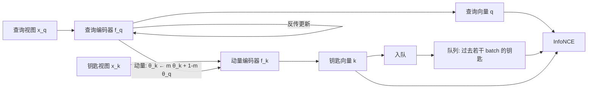

# MoCo：队列把字典做大，动量把字典做稳

<!-- release-date: 2019-11-13 -->

**本文依据**：`Momentum Contrast for Unsupervised Visual Representation Learning`，arXiv 1911.05722v3（页眉 2020-03-23），12 页。作者 Kaiming He、Haoqi Fan、Yuxin Wu、Saining Xie、Ross Girshick，Facebook AI Research (FAIR)。代码行写明 `https://github.com/facebookresearch/moco`。盘上 PDF 为 v3；首发日取 arXiv API 的 `<published>`（v1 提交）2019-11-13，不取 v3 日期。封面未写会议录用，本文不补会议名。文中数字均标 PDF 页码；标「外部补充」的段落不来自本文。

## 一句话

对比学习可以看成字典查找：查询向量要对上自己的那把钥匙，并远离其余钥匙。字典必须 **又大又一致** ，但端到端把负样本塞进当前 batch 会撞显存，记忆库把整份数据集的特征存下来又会让钥匙来自过时编码器。MoCo 用队列解耦字典规模与 batch 规模，再用动量更新的钥匙编码器保证队列里新旧钥匙还能互相比较。在这一机制上，标准 ResNet 的无监督预训练就能在多项检测与分割上赶上甚至超过 ImageNet 有监督预训练。

## 一、矛盾：视觉没有现成词典

语言预训练能直接建词表，因为信号是离散的。视觉信号落在连续高维空间，没有天然 token，所以无监督方法还得自己解决「词典怎么建」(PDF p. 1)。

当时对比损失已经开始被用来学视觉表示。动机各不相同，但都可以看成在建一本 **动态字典** ：钥匙从图像或图块里采样，由编码器写成向量；学习目标是让查询向量靠近匹配钥匙、远离其他钥匙(PDF p. 1)。

作者的假设只有两条(PDF p. 1)：

1. **大** 。视觉空间连续且高维，字典越大，负样本对真实分布的覆盖越好。
2. **一致** 。查询和钥匙必须由同一套或几乎同一套编码器写成，否则点积没有比较意义。

现有做法往往只能保一头。全文方法都围着这一个缺口转。

论文明确把自己定位成 **损失机制** ，不是新的 pretext 任务。正文采用简单的实例判别：同一张图的两个随机增强视图构成正对，其余视为负对(PDF p. 1–2、p. 4)。

## 二、全景：查询、钥匙、队列、动量

图为机制示意，根据 PDF p. 1 图 1 与 p. 3 图 2c 重画，不是实测曲线。

读图 1 能看到：左侧一张图进查询编码器得到 $q$，右侧另一张图进动量编码器得到钥匙；钥匙进入队列；对比损失比较 $q$ 与队列中的 $k_0,k_1,k_2,\ldots$(PDF p. 1 图 1)。

四个部件各管一件事：

- **查询编码器 $f_q$** ：唯一走反传的网络。
- **钥匙编码器 $f_k$** ：不接梯度，参数是 $f_q$ 的动量滑动平均。
- **队列** ：当前 batch 的钥匙入队，最旧的出队，字典大小与 batch 大小脱钩。
- **InfoNCE** ：把「找对那一把钥匙」写成 $(K+1)$ 类 softmax。

## 三、对比学习就是查字典

记查询为 $q$，字典钥匙为 $\{k_0,k_1,k_2,\ldots\}$，其中恰好一把 $k_+$ 与 $q$ 匹配。相似度用点积。本文采用 InfoNCE(PDF p. 2 式 1)：

$$
L_q = -\log \frac{\exp(q\cdot k_+/\tau)}{\sum_{i=0}^{K}\exp(q\cdot k_i/\tau)}
$$

$\tau$ 是温度。分母是 1 个正样本加 $K$ 个负样本。直观上，这就是把 $q$ 分到 $k_+$ 那一类的交叉熵(PDF p. 2)。

$q=f_q(x_q)$，$k=f_k(x_k)$。输入可以是整图、图块或上下文图块集合；$f_q$ 与 $f_k$ 可以相同、部分共享或完全不同——这些都取决于 pretext，不是 MoCo 机制本身(PDF p. 2)。

**旧问题** ：损失写得清楚，但字典从哪来、钥匙编码器怎么更新，才决定「大」和「一致」能否同时成立。

## 四、三种机制：端到端、记忆库、MoCo

图 2 把三种做法画成同一张查询–钥匙示意图，差别只在钥匙怎么维护、钥匙编码器怎么更新(PDF p. 3 图 2)。读图可见：(a) 查询与钥匙两条编码器都画了梯度箭头；(b) 钥匙从 memory bank 采样，没有动量编码器；(c) 钥匙编码器标了 momentum，钥匙不回传。

### 端到端

当前 mini-batch 既当查询也当字典。钥匙由同一组参数编码，一致性最好。但字典大小绑死在 batch 上，受 GPU 显存限制；大 batch 优化本身仍是开放问题。论文在 8 张 32GB Volta 上能撑到的最大 batch 是 1024。不做线性学习率缩放时，1024 batch 精度大约掉 2 个点(PDF p. 3、p. 5)。

有些方法靠局部位置把字典做大，但往往要切块或改感受野，给下游迁移添麻烦(PDF p. 3)。

### 记忆库

把整个训练集每个样本的表示存一份，每个 batch 从中随机抽负样本，不反传到记忆库，所以字典可以很大。问题是：某个样本的表示是它**上一次被看见**时写下的，钥匙来自过去整整一个 epoch 里许多不同时刻的编码器，一致性差(PDF p. 3–4)。

InstDisc 也对记忆库里的**同一条样本表示**做动量更新。那是表示级动量，与 MoCo 的**编码器级动量**不是一回事。MoCo 不追踪每个样本，显存更省，才有可能放到十亿图规模——记忆库在这个规模上不好做(PDF p. 4)。

### MoCo：队列加大，动量保稳

**队列** 。当前 batch 编码后的钥匙入队，最旧 batch 出队。字典永远是全体数据的一个滑动子集。多出来的维护成本可控。丢掉最旧钥匙还有一层好处：它们最过时，与最新查询最不一致(PDF p. 3)。

队列让字典变大，但也让钥匙编码器无法端到端反传——梯度要穿过队列里所有历史样本。朴素做法是把 $f_k$ 直接复制成 $f_q$ 的快照。实验里这条路很差。作者的判断：编码器变得太快，钥匙表示不再一致(PDF p. 3)。

**动量更新** 。记 $f_k$ 参数为 $\theta_k$，$f_q$ 为 $\theta_q$(PDF p. 3 式 2)：

$$
\theta_k \leftarrow m\theta_k + (1-m)\theta_q
$$

$m\in[0,1)$。只有 $\theta_q$ 走反传。$\theta_k$ 比 $\theta_q$ 平滑得多，于是队列里不同 batch、不同编码器写下的钥匙仍然可比。默认 $m=0.999$，明显好过 $m=0.9$——慢才是关键(PDF p. 3)。

**收益** 。字典大小变成独立超参；一致性由动量而不是由「必须同一 batch」来保证。

**代价 / 边界** 。钥匙无梯度，正对双方不能对称更新；队列里仍是过时表示，只是过时窗口从「整个 epoch」收成「最近若干 batch」；$m$ 过小会不收敛。

**可迁移** 。凡是「负样本想要很多、但又不能把历史样本的计算图留着」的对比或检索式训练，都可以把「缓存 + 慢编码器」当成一对配套旋钮。缓存解决规模，慢编码器解决分布漂移。

## 五、实例判别、算法与 Shuffling BN

### Pretext

查询与钥匙来自同一张图则为正对，否则为负。正对是同一张图的两份随机增强「视图」(PDF p. 4)。编码器可以是任意卷积网络。

技术细节沿用 InstDisc：ResNet 全局平均池化后接固定维全连接，输出 128 维，再 L2 归一化。温度 $\tau=0.07$。增强：随机缩放后裁 $224\times 224$，再随机颜色抖动、水平翻转、灰度，都来自 torchvision(PDF p. 4)。

### 伪代码在干什么

Algorithm 1 是 PyTorch 风格伪代码(PDF p. 4)。读图可见关键几步：

1. 同一 batch 做两份增强，分别过 $f_q$、$f_k$。
2. `k = k.detach()`：钥匙不进计算图。
3. 正 logit 是 $q$ 与对应 $k$ 的 batch 矩阵乘；负 logit 是 $q$ 与整条队列相乘。
4. 拼成 $N\times(1+K)$ 的 logit，标签全是 0（正样本在第 0 列），温度缩放后交叉熵。
5. SGD 只更新 $f_q$；再动量写 $f_k$；最后当前 $k$ 入队、最旧出队。

初始化时 $\theta_k=\theta_q$(PDF p. 4)。

### Shuffling BN：别让 BN 统计量当作弊码

标准 ResNet 带 BN。实验里 BN 会让模型「骗过」pretext：batch 内样本通过 BN 交换信息，轻易找到低损失解。这与 CPC v2 避开 BN 的观察同类(PDF p. 4)。

做法：多卡训练，每张卡对自己那一份做 BN。对钥匙编码器，把当前 batch 的样本顺序在分到各卡之前打乱（编码后再打回去）；查询编码器的顺序不动。于是一对正样本的 BN 统计来自两个不同子集(PDF p. 4)。

端到端消融也用 Shuffling BN。记忆库不受这个问题困扰，因为正钥匙来自过去的不同 batch(PDF p. 4–5)。

附录图 A.1 把这一点画死。读图：横轴约 0–80 epoch，纵轴 accuracy；虚线是 pretext 的 $(K+1)$ 类查找准确率，实线是 kNN 监控的 ImageNet 分类（不是线性分类器）。去掉 ShuffleBN 后，虚线很快冲到 $>99.9\%$，实线随后掉下去——对 pretext 过拟合。MoCo 与端到端都有这个现象。作者解释：子 batch 统计量可以当「签名」，让模型猜出正钥匙在哪个子 batch 里。ShuffleBN 拆掉这个签名(PDF p. 11 图 A.1)。

**可迁移** 。任何「正样本对必须在统计上隔离」的对比训练，都要检查归一化层有没有泄漏身份。打乱 BN 归属是一种不改网络结构的补丁。

## 六、训练 recipe：论文写到的就这些

优化器 SGD，weight decay $0.0001$，SGD momentum $0.9$(PDF p. 5)。

| 数据 | 规模 | batch | GPU | 学习率 | 日程 | 时长（R50） |
|---|---|---:|---:|---|---|---|
| ImageNet-1M（IN-1M） | 约 128 万张、1000 类；无监督不用类标 | 256 | 8 | 初始 0.03 | 200 epoch，120 与 160 epoch 乘 0.1 | 约 53 小时 |
| Instagram-1B（IG-1B） | 约 10 亿（940M）公开 Instagram 图，约 1500 个与 ImageNet 相关的 hashtag；长尾、相对未策展 | 1024 | 64 | 0.12，每 62.5k iter（64M 图）指数乘 0.9 | 1.25M iter（约 1.4 个 epoch） | 约 6 天 |

IN-1M 类分布均衡、物体多为标志性视角；IG-1B 混有物体与场景图(PDF p. 4–5)。

论文没写的：具体增强幅度、队列初始化、混合精度、通信实现。不补。

## 七、线性分类：先验证机制，再比别人

设定：在 IN-1M 上无监督预训练，冻住特征，只训一层带 softmax 的线性分类器，100 epoch，报告验证集 1-crop top-1。网格搜索得到该分类器最优初始学习率 30、weight decay 0。这组超参对这一小节所有消融都稳定。学习率大、衰减为零，暗示无监督特征的分布（例如幅度）与有监督 ImageNet 特征差得很远，后面微调要靠 BN 校准(PDF p. 5)。

### 三种机制只换字典，不换 pretext

图 3 在同一实例判别、同一 InfoNCE、同一 ResNet-50 下只换机制(PDF p. 5 图 3)。读图：横轴 $K$ 对数坐标 256–65536，纵轴约 50–61%。三条线都随 $K$ 上升。端到端在 $K=256$ 约 54.7，到 1024 约 57.3 后画不下去——字典绑死 batch。记忆库从 256 的 50.0 升到 65536 的 58.0。MoCo 从 256 的 54.9 升到 65536 的 60.6。记忆库比 MoCo 差 2.6 个点，符合「钥匙来自过去整个 epoch、不一致」的假设。记忆库 58.0% 已是作者加强过的复现：同一 InfoNCE、$K=65536$；若改回 NCE 且 $K=4096$，他们复现 54.3%，接近原文 54.0%(PDF p. 5)。

### 动量必须够慢

$K=4096$ 时 ResNet-50(PDF p. 5)：

| 动量 $m$ | 0 | 0.9 | 0.99 | 0.999 | 0.9999 |
|---|---|---|---|---|---|
| 准确率 (%) | 失败 | 55.2 | 57.8 | 59.0 | 58.9 |

$m$ 在 0.99–0.9999 合理；0.9 明显掉；$m=0$ 时损失振荡、不收敛。没有慢编码器，队列没有意义。

### 和先前无监督方法比参数量

公平起见按特征提取器参数量比，不算线性分类头。除 R50 外还有 2×、4× 加宽（对应文献里的 ×8、×16，因为标准 ResNet 在那边叫 ×4）。设定 $K=65536$，$m=0.999$(PDF p. 5–6 表 1)。

MoCo R50：24M 参数、60.6%，高于同规模竞争者。R50w4×：375M、68.6%。ResNeXt-50-32×8d（RX50）46M、63.9%；R50w2× 94M、65.4%(PDF p. 6 表 1)。

作者强调：用的是标准 ResNet，没有切块输入、特制感受野或双网络拼接，所以更容易迁到各种下游(PDF p. 6)。正文焦点是通用对比机制，不探索正交因素（例如换 pretext）。文中提到后续扩展「MoCo v2」给 R50 从 60.6% 提到 71.1%，那是另一份稿件的数字，不是本实验的结果，本文不把它当作本篇结论(PDF p. 6)。

线性分类不是最终目的。真正要看的是：冻住的特征能不能当下游微调的初始化。

## 八、迁移：有监督预训练还是不是默认答案

### 两个前提：归一化与日程

无监督特征分布不同，而下游系统的超参往往是为有监督预训练选的。微调时他们打开 BN 并跨 GPU 同步，而不是冻成仿射层；新初始化的层（例如 FPN）也加 BN，用来校准幅度。有监督与无监督微调都做归一化。MoCo **沿用** ImageNet 有监督那套超参，不再为 MoCo 单搜(PDF p. 6)。

日程必须受控。微调足够长时，COCO 上从随机初始化就能追上有监督预训练。本文要测的是特征可迁移性，所以用 1×（约 12 epoch）或 2×，而不是 6×–9×。VOC 这类小数据上，训再长也不一定能追上。随机初始化作为参照给出。同一套设定可能对 MoCo 不利，但换来的是多数据集、多任务可比较，不必额外搜超参(PDF p. 6–7)。

### VOC 检测

Faster R-CNN，骨干 R50-dilated-C5 或 R50-C4，BN 可训，Detectron2。所有层端到端微调。训练尺度 $[480, 800]$，推理 800。评测 test2007 的 AP50（VOC 默认）、COCO 风格 AP、AP75。所有条目同一设定，含有监督基线(PDF p. 7)。骨干细节在附录：dilated-C5 含 dilation 2、stride 1 的 conv5，再 3×3 降到 512，框头两层全连接；C4 骨干停在 conv4，框头是 conv5（含全局池化）再接 BN(PDF p. 10)。

表 2：在 trainval07+12（约 16.5k 图）上微调 24k iter（约 23 epoch），5 次平均(PDF p. 6 表 2)。

**R50-dilated-C5**

| 预训练 | AP50 | AP | AP75 |
|---|---:|---:|---:|
| 随机初始化 | 64.4 | 37.9 | 38.6 |
| 有监督 IN-1M | 81.4 | 54.0 | 59.1 |
| MoCo IN-1M | 81.1（−0.3） | 54.6（+0.6） | 59.9（+0.8） |
| MoCo IG-1B | 81.6（+0.2） | 55.5（+1.5） | 61.2（+2.1） |

**R50-C4**

| 预训练 | AP50 | AP | AP75 |
|---|---:|---:|---:|
| 随机初始化 | 60.2 | 33.8 | 33.1 |
| 有监督 IN-1M | 81.3 | 53.5 | 58.8 |
| MoCo IN-1M | 81.5（+0.2） | 55.9（+2.4） | 62.6（+3.8） |
| MoCo IG-1B | 82.2（+0.9） | 57.2（+3.7） | 63.7（+4.9） |

C4 上无监督优势更大。作者指出：预训练与检测器结构的关系过去被掩盖，应当作为因素考虑(PDF p. 7)。

表 3 把图 3 里最好的端到端与记忆库也拉到同一套 VOC 微调(PDF p. 6 表 3)。它们在 C4 的 AP、AP75 也能高过有监督，但其余指标更低，且全面低于 MoCo。另外，这两种机制如何在更大数据上训练仍是开放问题，未必吃得上 IG-1B(PDF p. 7)。

表 4 跟先前工作对齐：trainval2007（约 5k 图）、C4、9k iter、5 次平均。先前方法的 AP50 都追不上各自的有监督对照。MoCo 在 IN-1M、IN-14M（完整 ImageNet）、YFCC-100M、IG-1B 上都能超过有监督基线；更严的指标最大到 +5.2 AP、+9.0 AP75，增益大于 trainval07+12(PDF p. 7 表 4)。读表 4：MoCo 有监督对照 AP50 为 74.4、AP 42.4、AP75 42.7；MoCo IN-1M 为 74.9 / 46.6 / 50.1；IG-1B 为 75.6 / 47.6 / 51.7。

### COCO 检测与实例分割

Mask R-CNN，FPN 或 C4，BN 可训。训练尺度 $[640, 800]$，推理 800。train2017 约 118k，评 val2017。日程 1× 或 2×(PDF p. 7)。

表 5 数字多，只抓结构(PDF p. 8 表 5)：

- 1× 时所有模型（含有监督）都明显欠训，与 2× 大约差 2 个点。
- 2× 时，MoCo 在两种骨干的全部指标上优于有监督对照。
- C4、2×：有监督框 AP 40.0 / 掩码 AP 34.7；MoCo IN-1M 为 40.7 / 35.4；IG-1B 为 41.1 / 35.6。
- FPN、2×：有监督框 AP 40.6；MoCo IN-1M 40.8，IG-1B 41.1。FPN、1× 上 MoCo IN-1M 略低于有监督（框 AP 38.5 vs 38.9），短日程下无监督并不自动赢。

### 更多下游

表 6 同一架构、同一日程，括号是相对有监督 IN-1M 的差，绿字表示至少 +0.5(PDF p. 8 表 6)。

| 任务 | 有监督 IN-1M | MoCo IN-1M | MoCo IG-1B | 怎么读 |
|---|---|---|---|---|
| COCO 关键点 AP | 65.8 | 66.8（+1.0） | 66.9（+1.1） | 有监督相对随机初始化（65.9）几乎没优势，MoCo 全面更高 |
| COCO DensePose AP | 48.3 | 50.1（+1.8） | 50.6（+2.3） | 高定位任务；AP75 从 50.6 到 54.3（+3.7） |
| LVIS v0.5 掩码 AP | 24.4（冻 BN） | 24.1（−0.3） | 24.9（+0.5） | 约 1000 类长尾；有监督冻 BN 更好，故对照用更好的那一档 |
| Cityscapes 实例分割掩码 AP | 32.9 | 32.3（−0.6） | 32.9（+0.0） | IG-1B 持平，AP50 60.3（+0.7） |
| Cityscapes 语义 mIoU | 74.6 | 75.3（+0.7） | 75.5（+0.9） | 最高 +0.9 |
| VOC 语义 mIoU | 74.4 | 72.5（−1.9） | 73.6（−0.8） | 正文里明确的反例，至少差 0.8 |

作者点名 7 项检测 / 分割上 MoCo 超过 ImageNet 有监督预训练：VOC/COCO 目标检测、COCO/LVIS 实例分割、COCO 关键点、COCO DensePose、Cityscapes 语义分割(PDF p. 8–9)。Cityscapes 实例分割持平；VOC 语义分割落后。附录还有 iNaturalist 细粒度分类可比较的例子(PDF p. 8)。

所有任务上 IG-1B 预训练都稳定好于 IN-1M。机制能在相对未策展的十亿图上工作，作者把它看成更接近真实世界的无监督场景(PDF p. 8)。

LVIS 附录补充：有监督冻 BN、2× 为 24.4 掩码 AP；打开 BN 反而掉到 23.2 并过拟合（COCO/VOC 上打开 BN 通常更好或持平）。MoCo 在同样可训 BN 下 IN-1M 24.1、IG-1B 24.9，都超过同设定有监督；按各自最优设定仍是 24.9 vs 24.4(PDF p. 10)。

## 九、附录里多出来的证据

### 语义分割怎么训

FCN-16s：R50 卷积骨干，conv5 的 3×3 用 dilation 2、stride 1；再两层 256 通道 3×3+BN+ReLU，最后 1×1 逐像素分类。额外两层 3×3 的 dilation=6。随机缩放 $[0.5, 2.0]$、裁剪、水平翻转。VOC 裁 513，Cityscapes 裁 769。推理用原图尺寸。batch 16，weight decay 0.0001。VOC 学习率 0.003，Cityscapes 0.01，在训练进度 70% 与 90% 乘 0.1。VOC 在 train aug2012（10582 张）上 30k iter，评 val2012；Cityscapes 在 train fine（2975 张）上 90k iter，评 val。5 次平均(PDF p. 10)。

### iNaturalist

train 约 437k 张、8142 类，端到端微调 100 epoch，学习率 0.025（从零是 0.1），70% 与 90% 降 10 倍。R50：随机 61.8，有监督 66.1，MoCo IN-1M 65.6，IG-1B 65.8。比从零大约高 4 个点，与有监督接近(PDF p. 10)。

### 在 ImageNet 上端到端微调

线性探测是惯例，实践里更常见整网微调。从零 76.5；MoCo IG-1B 微调到 77.3（+0.8）。IN-1M 预训练再在 ImageNet 上微调不是真实迁移场景，仅作参考：77.0%。IG-1B 这种「在另一份未标注数据上预训练、再到 ImageNet」才是典型设定(PDF p. 10)。

### COCO 再加长到 6×

附录表 A.1 把 FPN 的 2× 与 6×（约 72 epoch）摆在一起(PDF p. 11 表 A.1)。读表：6× 时随机初始化框 AP 41.4，有监督 41.9，MoCo IN-1M 42.3（+0.4），IG-1B 42.8（+0.9）。观察三条：(i) 有监督微调仍有提升（41.9）；(ii) 从零基本追上（41.4）；(iii) MoCo 继续往上，与有监督的差距从 2× 的 +0.5 扩到 6× 的 +0.9。更长微调时，MoCo 特征的优势可以比有监督特征更大(PDF p. 11)。

关键点 / DensePose / LVIS 的实现：关键点是 Mask R-CNN 关键点版 R50-FPN、2×；DensePose 是 DensePose R-CNN R50-FPN、「s1×」日程；LVIS 跟该数据集论文 arXiv v3 附录 B 的基线(PDF p. 10)。

## 十、作者承认的缺口，以及不要过度解读的地方

讨论节很短，但有判断(PDF p. 9)：

- 从 IN-1M 到 IG-1B 的提升稳定但相对小，更大规模数据可能没有被吃透；作者希望更强的 pretext 来改善这一点。
- 实例判别只是载体。MoCo 可以接到别的对比式 pretext 上，例如语言里的掩码自编码、视觉里 CPC 那一类。
- VOC 语义分割是明确的失败案例，不是表格脚注。
- 线性分类协议上的 60.6% 不是「已经超过有监督分类」；有监督分类不在这条协议里对比。迁移任务才是作者真正用来宣布「差距被大幅缩小」的战场。
- 封面与正文都没有写会议录用；训练代码之外的系统细节（通信、混合精度、队列在分布式下如何同步）正文不写。

## 十一、可迁移的几条，不依赖 2019 年那套视觉配方

1. **先把目标写成「大且一致的字典」，再选实现** 。负样本数量和编码器版本是一对互相打架的约束。只加负样本、不管钥匙来自哪个时刻的模型，会得到记忆库那种「大而不一致」。
2. **解耦用队列，对齐用慢编码器** 。队列把 $K$ 从 batch 里解放出来；动量把历史钥匙的编码器漂移压住。两个旋钮要一起转：$m=0$ 时队列有害。
3. **不要把对比损失的作弊路径当成优化成功** 。BN 统计量、子 batch 身份、共享归一化，都可以让 pretext 准确率虚高。应用层要用真正冻结或下游任务来监控，而不是只看对比准确率。
4. **评预训练不要只看源域线性探测** 。本文最硬的主张发生在 VOC/COCO 微调，而且依赖「同一超参、受控日程」。换骨干（C4 vs dilated-C5 vs FPN）会改变无监督相对有监督的优势。
5. **机制与 pretext 分开** 。换增强、换投影头、换掩码任务，都可以接同一套队列+动量。本篇自己几乎没挖 pretext，这既是局限，也是接口。

## 十二、关键词回看

- **对比学习 / 字典查找** ：用当前表示动态定义正负钥匙，而不是拟合固定类别或像素。
- **InfoNCE** ：$(K+1)$ 类 softmax 形式的对比损失，温度 $\tau$ 控制分布尖锐程度。
- **队列字典** ：用近期 mini-batch 的钥匙构成负样本池，规模与当前 batch 无关。
- **动量编码器** ：$\theta_k$ 是 $\theta_q$ 的指数滑动平均，只前向、不反传。
- **实例判别** ：同一图像的不同视图为正，其余为负。
- **Shuffling BN** ：打乱钥匙分支的 BN 归属，切断 batch 统计泄漏。
- **线性探测 vs 微调** ：前者冻特征看可分性，后者才接近真实下游用法。

## 参考资料

- 原件 PDF：`readings/_src/多模态理解与 Omni/MoCo.pdf`（arXiv:1911.05722v3）
- 代码（封面）：https://github.com/facebookresearch/moco
- 首发日取证：https://export.arxiv.org/api/query?id_list=1911.05722 （`<published>2019-11-13T18:53:26Z</published>`）
