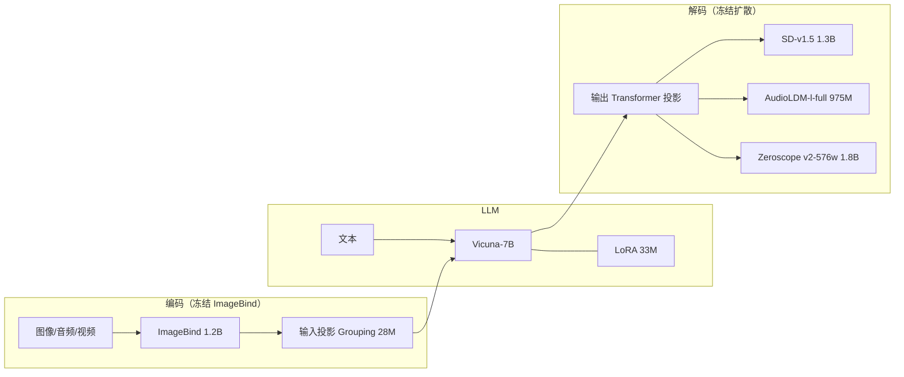

# NExT-GPT：冻住编解码器，只训约 1% 投影，把「只懂输入」的 MM-LLM 做成 any-to-any

<!-- release-date: 2023-09-11 -->

**本文依据**：`NExT-GPT: Any-to-Any Multimodal LLM`，Shengqiong Wu、Hao Fei、Leigang Qu、Wei Ji、Tat-Seng Chua，**NExT++ Research Center, National University of Singapore**（封面编号实验室 **1**，机构栏记 **NUS**；通讯 Hao Fei `<haofei37@nus.edu.sg>`）。封面印 `Proceedings of the 41st International Conference on Machine Learning, Vienna, Austria. PMLR 235, 2024`。页眉 `arXiv:2309.05519v3 [cs.AI] 25 Jun 2024`。盘上 PDF **32 页**。项目页封面写 `https://next-gpt.github.io/`（PDF p. 1）。首发日取 arXiv v1 **2023-09-11**（任务给定；外部补充，不来自 PDF 正文）。文中数字均标 PDF 页码；标「外部补充」的段落不来自本文。

## 一句话

当时多数多模态大语言模型（multimodal large language model，MM-LLM）只会在**输入侧**看图、看视频、听声音，输出仍是文字；少数能生成的，也基本停在交错图文。人说话却会随时换模态。NExT-GPT 用 Vicuna-7B 当核心，输入接 ImageBind + grouping 投影，输出接三套冻结的条件扩散模型，让文本、图像、视频、音频的任意组合都能进、也能出（PDF p. 1–2 图 1）。现成编码器、解码器冻住，只更新输入/输出投影和少量 LoRA，可训练量约 $155\mathrm{M} / (155\mathrm{M}+12.275\mathrm{B})$，论文写成 **1%**（PDF p. 4 表 1）。另做 **模态切换指令微调（modality-switching instruction tuning，MosIT）** 与人工筛过的 **5,000** 条对话（PDF p. 2、p. 6）。

它解决的不是「再接一个工具调用流水线」，而是：**用离散文本在模块之间传话会丢视觉计数、空间关系这类语言说不清的东西；要把 LLM 的信号 token 隐式接到扩散条件上，端到端对齐。**

## 一、矛盾：会看不等于会回，流水线又把噪声写进中间句

MM-LLM 当时已经很多：BLIP-2、Flamingo、MiniGPT-4、Video-LLaMA、LLaVA、PandaGPT、SpeechGPT，主线是把预训练编码器接到文本 LLM 上（PDF p. 1、p. 3）。生成侧更少：Emu、DreamLLM、GILL、SEED 基本停在交错图文（PDF p. 1）。

两条「看起来像 any-to-any」的路都不够（PDF p. 1–2）：

- **CoDi**：任意模态组合的并行生成，但没有 LLM 式推理与决策，只能做简单配对生成。
- **Visual-ChatGPT / HuggingGPT**：LLM 当调度器，调用现成工具。模块之间只传 LLM 吐出的离散文本。级联必加噪声；整系统只做推理、没有端到端训练，复杂隐式指令更吃力。

作者要的是第三种：端到端、四模态（文本、图像、视频、音频）任意进出，核心仍是 LLM（PDF p. 2）。

相关工作把跨模态生成的主力放到扩散（DALL-E、Stable Diffusion），把「只理解、不生成」和「工具流水线」并置；NExT-GPT 自称吃两边的好处：既用现成编解码器，又整网可训（PDF p. 3、附录 p. 16–17）。

## 二、全景：编码、LLM、解码三层，中间几乎只动投影

图 1（PDF p. 2）从左到右四条：文本直进 LLM；图像 / 音频 / 视频各走 Encoder → Input Projection → LLM → Output Projection → 对应 Diffusion。雪花标冻结，火焰标可训。底部四个阶段名：Multimodal Input Encoding、LLM-centric Alignment、LLM-based Semantic Understanding、Instruction-following Alignment、Multimodal Output Generation。这是机制示意，不是吞吐曲线。

上图根据 PDF p. 2 图 1 与 p. 4 表 1 重画，是机制示意。

三层各自干什么（PDF p. 3–4）：

1. **编码**：统一用 ImageBind（六模态编码器），避免为每种模态各管一个异构编码器。投影把特征变成 LLM 能读的语言式表示。
2. **LLM**：Vicuna **7B-v0**。输出两类东西：普通文本 token；各模态的 **信号 token**，告诉解码层「出不出、出什么」。
3. **生成**：信号经 Transformer 输出投影，再进条件潜扩散：图像 **SD-v1.5**，视频 **Zeroscope v2-576w**，音频 **AudioLDM l-full**。

表 1 把可训参数加总（PDF p. 4）：Grouping **28M** + LoRA **33M** + 三路输出投影 **31M + 31M + 32M** = **155M**。分母再加冻结的 ImageBind 1.2B、Vicuna 7B、SD 1.3B、Zeroscope 1.8B、AudioLDM 0.975B，得到 **12.275B**。比例写成 **1%**。编码器、扩散 U-Net 全程冻。

推理时（附录图 7，PDF p. 21）：任意组合进对应编码器；LLM 若判定某非文本模态该出，就吐该类特殊 token，否则该路扩散保持关闭（图里灰色模块）。文本输入不经 ImageBind，直接进 LLM。

## 三、输入投影：别把 patch 网格直接当成词

### 旧问题

常见做法：线性层把 patch 网格特征投进 LLM 词空间（PDF p. 4）。作者认为网格单元和「一个词一个概念」对不齐，感知会次优，并引用 RegionCLIP 一类观察（PDF p. 4）。

### 新设计

可学习的 **概念 token**，用 grouping 把网格特征分层聚成概念，再送 LLM（灵感来自 GroupViT，PDF p. 4）。附录 C.1（PDF p. 17）写清步骤：

记某模态 patch 为 $X=\{x_i\}$。共 $L$ 个 grouping 阶段；第 $l$ 阶段随机初始化 $M_l$ 个概念 token $C^l$。把 $C^l$ 与 $X$ 拼接进 Transformer，得到更新后的 $\hat C^l,\hat X^l$。相似度

$$A^l=\mathrm{Softmax}\bigl((\mathrm{Norm}(\hat C^l)\mathrm{Norm}(\hat X^l)^\top+G)/\tau\bigr)$$

其中 $G$ 是 Gumbel$(0,1)$ 噪声，$\tau$ 可学。赋值用直通估计：

$$\hat A^l=\mathrm{Onehot}(\mathrm{Argmax}(A^l))+A^l-\mathrm{Sg}(A^l)$$

再 $X^{l+1}=\hat C^l+\mathrm{MLP}(\hat A^l,\hat X^l)$。$L$ 阶段后得到 $M_L$ 个概念 token 进 LLM。

编码侧对齐任务是 **X-to-text**：冻 LLM，只训输入投影，让它根据 X 的表示生成对应描述（PDF p. 4 图 2(a)）。数据：WebVid-2M（视频）、CC3M（图像，超 300 万）、AudioCaps（约 46k 音频–文本）（PDF p. 4）。损失：交叉熵（附录 p. 17）。

### 收益 / 边界

表 5（PDF p. 8；正文误写成「Table 4」）换投影：

| 输入投影 | VQAv2 | VizWiz | MSVD-QA | MSRVTT-QA | AudioCaps |
|---|---|---|---|---|---|
| NExT-GPT（grouping） | 66.7 | 48.4 | 64.5 | 61.4 | 81.3 |
| 仅线性层 | 63.8 | 45.4 | 60.8 | 57.1 | 77.4 |
| Q-Former + 线性 | 65.1 | 46.9 | 63.4 | 58.1 | 79.7 |

线性最差；Q-Former 有一点视觉分组，仍低于 grouping。代价是实现比单线性重，Gumbel/直通也多一套超参。

### 可迁移

冻 LLM 当「多模态分词器」训中间模块时，先问网格特征和词概念是否同粒度。概念 token + 可微分组，比再抄一套 Q-Former 更贴「词是概念」这个假设。

## 四、输出投影：信号 token，不要把 caption 当中间件

### 旧问题

扩散模型的条件来自自己的文本编码器。LLM 若只吐一句 caption 再喂扩散，等于回到流水线：计数、空间关系等视觉属性很难用中间句说清（附录 D.3，PDF p. 22–25 图 9–11）。简单指令三家都能画对；复杂指令上 HuggingGPT、NExT-GPT-caption 会在数量和空间关系上偏，作者认为一部分也是 SD 自身的短板，但端到端的隐式信号可以少做额外特征工程。

### 新设计

三类特殊 token（写法跟 GILL，PDF p. 4–5）：

- 图像：`[IMG_i]`，$i=0,\ldots,4$
- 音频：`[AUD_i]`，$i=0,\ldots,8$
- 视频：`[VID_i]`，$i=0,\ldots,24`

LLM 要同时学文本 token 和这些信号。某模态要出，就激活对应特殊 token；否则不吐，该模态关闭。

输出投影是 Transformer：隐层 **512**、**4** 头、编码器 **4** 层、解码器 **4** 层、dropout **0.1**（附录 p. 17）。投影后的信号表示一方面作为去噪条件，另一方面与扩散文本编码器的条件表示拉近。

对齐阶段输入是 CC3M / WebVid / AudioCaps 的 caption，输出是 caption 拼上信号 token（PDF p. 5）。三项损失：

1. 信号 token 的负对数似然；
2. **caption alignment**：LLM 信号隐状态与扩散文本条件的 $L_2$；
3. 条件潜空间去噪损失（跟 Rombach 等）。

U-Net 冻住（PDF p. 5）。

### 信号个数

图 6（PDF p. 8）扫个数。正文结论：视频内容更复杂，需要最多信号；图像约 **4** 个、音频约 **8** 个就能满意生成。具体个数还取决于数据量和扩散骨干；数据更强时加 token 可能更好（PDF p. 8）。图是曲线，不是单点表。

### 可迁移

「LLM 调度扩散」不要默认 caption 总线。用固定个数的模态信号当软条件，把跨模态鸿沟留在连续表示里。条数按模态复杂度设，不要三模态共用一个数。

## 五、MosIT：对齐完仍不会「按人的方式换模态」

编码、解码都对齐之后，系统仍未必忠实跟指令、按需出多模态（PDF p. 5）。第三阶段用 LoRA 更新 LLM 一小撮参数，同时继续训两头投影（PDF p. 6 图 3）。对话样本进系统，LLM 重建文本并用信号 token 代表多模态内容；解码端再把输出投影后的信号与金标 caption 的扩散条件对齐。

现成指令数据不够（PDF p. 6）：

- LLaVA-150K、VideoChat 等是 **Text+X → Text**，输出仍是字。
- 作者用 X-caption 包模板、GPT-4 写指令，得到 **T2M（text-to-multimodal）**：**15k** 条，表 6 记图/视/音各 **5K**，单轮、非推理（PDF p. 19）。
- 这些仍缺「对话中输入输出模态轮流切换、多轮、隐式要求」。

**MosIT 数据**（PDF p. 6）：先写 Human–Machine 模板，再让 GPT-4 在 **100+** 主题下扩写。要求：直说与隐式都有；感知、推理、建议、规划；语义要接得上；每段 **3–7** 轮；两侧都出现多模态并交替切换。出现的图/音/视频从检索（YouTube 等）或 AIGC（Stable-XL、Midjourney）里配最相近的。人工检查后 **5K** 条。表 6：多轮均值 **4.8**，图/视/音约 **4K/4K/4K**，进出都是 T+I+A+V（PDF p. 19）。

还用了 Cleaned-Alpaca（纯文本指令）、LLaVA-150K、VideoChat（附录 C.3，PDF p. 18）。

图 3（PDF p. 6）是 IT 机制示意：输入指令经各路编码进带 LoRA 的 LLM，输出文本与 `` / `<VID>` / `<AUD>` 信号，再进三路扩散；优化对着金标。

## 六、训练配方（报告写到的）

三阶段（附录 C.2、表 7，PDF p. 17–19），优化器都是 Adam，weight decay **0.001**，warmup **0.1**，线性衰减，最大长度 **512**，各 **1** 个 epoch：

| | Stage-1 编码对齐 | Stage-2 解码对齐 | Stage-3 指令微调 |
|---|---|---|---|
| 学习率 | 0.0004 | 0.0004 | 0.0005 |
| 每 GPU batch | 18 | 8 | 4 |
| 可训 | 仅输入投影 | 仅输出投影 | LoRA + 两头投影 |
| 数据 | CC3M、WebVid、AudioCaps | 同左 | LLaVA-150K、VideoChat、cleaned-Alpaca、T2M、MosIT |
| 损失 | 描述 CE | 信号 CE + $L_2$ 对齐 + 去噪 | 回复 CE + 生成损失 |

Stage-1 被说成「给冻住的 LLM 训一个兼容的多模态分词器」（PDF p. 17）。总 GPU 数、墙钟、混合精度，正文没写。

## 七、实验：感知、生成、人评、附录里的编辑

### 图像理解（表 2，PDF p. 7，零样本）

CIDEr 做描述；另有 VQA 与 MMB / SEED。Vicuna-7B 的 NExT-GPT：

| | NoCaps | Flickr30K | COCO | VQAv2 | VizWiz | OKVQA | MMB | SEED |
|---|---|---|---|---|---|---|---|---|
| InstructBLIP Vicuna-7B | 123.1 | 82.4 | 102.2 | — | 33.4 | 33.9 | 36.0 | — |
| LLaVA LLaMA-2-7B-Chat | 120.7 | 82.7 | — | — | — | — | 36.2 | — |
| mPLUG-Owl LLaMA-7B | 117.0 | 80.3 | 119.3 | — | 39.0 | — | 46.6 | 34.0 |
| Emu LLaMA-7B | — | — | 117.7 | 40.0 | 35.4 | 34.7 | — | — |
| DreamLLM Vicuna-7B | — | — | 115.4 | 56.6 | 45.8 | 44.3 | 49.9 | — |
| Video-LLaVA Vicuna-7B | — | — | — | **74.7** | 48.1 | — | **60.9** | — |
| NExT-GPT Vicuna-7B | **123.7** | **84.5** | **124.9** | 66.7 | **48.4** | **52.1** | 58.0 | **57.5** |

描述三项与 OKVQA、SEED 是表内最高；VQAv2 和 MMB **低于** Video-LLaVA。空单元格保持空，不补外部数。

### 视频 / 音频理解（表 3，PDF p. 7）

带 $*$ 表示在该训练集上微调。

| | MSR-VTT 描述 | MSVD-QA | MSRVTT-QA | NExT-QA | AudioCaps |
|---|---|---|---|---|---|
| CoDi | 74.4* | — | — | — | 78.9* |
| UIO-2XXL 6.8B | 48.8* | 41.5 | 52.1 | — | 48.9* |
| Video-LLaMA LLaMA-7B | — | 51.6 | — | 29.6 | — |
| Video-LLaVA Vicuna-7B | — | **70.7** | 59.2 | — | — |
| Emu LLaMA-7B | — | 32.4 | 14.0 | 6.8 | — |
| NExT-GPT Vicuna-7B | **76.2*** | 64.5 | **61.4** | **50.7** | **81.3*** |

MSVD-QA 上 Video-LLaVA 更高。作者把相对 CoDi 的描述优势部分归因于「字直接从 LLM 出」（PDF p. 7）。

### 文生图 / 音 / 视频（表 4，PDF p. 7）

$\dagger$ 为零样本。

| | 图像 FID↓ | 音频 FAD↓ | 视频 CLIPSIM↑ |
|---|---|---|---|
| SD-1.5 | 11.21 | — | — |
| CoDi | 11.26 | 1.80 | 28.90 |
| AudioLDM-L | — | 1.96 | — |
| GILL-8B† | 12.20 | — | — |
| Emu-13B† | 11.66 | — | — |
| UIO-2XXL | 13.39 | 2.64 | — |
| NExT-GPT | **10.07** | **1.68** | **31.97** |
| NExT-GPT† | 11.18 | 1.74 | 30.96 |

附录表 8 把 COCO 上文生图 FID 写成 NExT-GPT **11.18**（PDF p. 20），与主表零样本行一致、与主表非零样本 **10.07** 不一致。以主文表 4 为准，附录按零样本读。附录表 9 零样本文生视频：FID **12.69**、CLIPSIM **31.97**（与主表非零样本 CLIPSIM 同数）；表 10 文生音 FD **23.25**、IS **8.67**，略差于 CoDi 的 22.90 / 8.77；表 11 音频描述 SPIDEr **0.534**、CIDEr **0.807**，高于 CoDi 0.480 / 0.789（PDF p. 20）。附录表 12–13：COCO 描述 B@4 **45.1** / METEOR **34.1** / CIDEr **158.3**；MSR-VTT 描述 B@4 **58.8** / METEOR **39.6**（PDF p. 22）。

### 人评：流水线 vs 端到端（图 5，PDF p. 8）

GPT-4 合成 **100** 条需要隐式推理才能出图的复杂指令；**五名**志愿者从指令跟随、合理性、质量三项打 **1–100**。对比 HuggingGPT、Visual-ChatGPT、NExT-GPT-caption（LLM 出 caption 再进扩散）、NExT-GPT。正文说 NExT-GPT 在跟复杂指令和出高质量图上更好；图是柱状示意，页上刻度 86 / 79 / 72 / 65，**没有印出各柱精确分**。附录 D.2 另有 1–10 分的跨模态转换人评（图 8，PDF p. 22）：出图强于出视频/音频；混合多模态略弱于单模态。图 8 的轴标签在文本抽取里是乱码，分数不以抽取数字为准。

图 4（PDF p. 8）定性：视频里狗滑板 → 解释 + 配乐 + 再找类似场景；心情差 → 主动出小狗视频；历史课演示 → 时间线可视化。附录图 12–19 是更多组合示例（PDF p. 26–32），机制上与图 7 一致。

### 编辑任务（附录，作者自己说没有全面超过专用方法）

表 14 文+图→图（COCO）：物体 CLIP **29.32** / FID **6.62**，背景 CLIP **27.31** / FID **14.27**，多项差于 DiffEdit、PFB-Diff（PDF p. 22）。表 15 文+视频→视频（DAVIS）：CLIP-T **0.2684**、CLIP-I **0.9647**，CLIP-T 低于 Pix2Video 的 0.2891。表 16 语音编辑 VCTK：MCD **0.300**，低于 AudioLDM-L 的 0.349（越低越好）。作者写：编辑上「没有展示出优越，但仍有竞争力」（PDF p. 20）。

## 八、限制、影响声明、没写的东西

附录 A（PDF p. 16）四条后续：模态扩到网页 / 3D / 热力图 / 表图，任务扩到检测、分割、grounding、跟踪；换更大或不同 LLM（当时只有 Vicuna-7B）；生成质量受扩散上限，考虑检索补生成；MosIT 还要加量。

Impact（PDF p. 9）：微调数据量和基模质量不够时会出低质或幻觉内容；**禁止商用**；社交数据按平台条款、必要时征得同意并匿名；收集时注意偏差。

没写：总训练 GPU 时、推理延迟、显存、信号 token 与 caption 的 $L_2$ 权重、grouping 的 $L$ 与每层 $M_l$ 具体数字、ImageBind 六模态里触觉等是否真正接入本系统。表 1 文本行编码器为空，文本不走 ImageBind。

## 九、可迁移：三条原则

1. **Any-to-any 不要默认工具总线。** 离散 caption 过不去的，用信号 token 的连续条件。对比实验应包含「自己的 caption 变体」，否则赢的是 SD 不是对齐。
2. **1% 可训的前提是编解码器已经够强。** 账单省在冻结 12B 级模块；编辑任务说明生成上限仍在扩散。扩模态优先加投影，而不是重训 U-Net。
3. **指令数据要写「切换」。** 只有 X→Text 或单轮 T2M，模型不会在多轮里主动换模态。5K 人工 MosIT 是质量换数量；配方第三阶段才把 LoRA 和两头投影放在一起。

## 关键词回看

- **Any-to-any MM-LLM**：任意模态组合进、任意合适模态出，核心仍是 LLM 推理。
- **ImageBind**：六模态统一编码器，本系统用它避免异构编码器集群。
- **Grouping / 概念 token**：把 patch 聚成与词同粒度的概念，再进 LLM。
- **Modality signal token**：LLM 输出的 `[IMG]` / `[AUD]` / `[VID]`，激活对应扩散。
- **解码侧 instruction-following 对齐**：冻 U-Net，训输出投影，三项损失对齐信号与扩散条件。
- **MosIT**：多轮、模态交替的指令微调与 5K 数据集。
- **NExT-GPT-caption**：消融/对照，用中间句代替信号，表现接近流水线系统。

## 参考资料

- 本文 PDF：`readings/_src/多模态理解与 Omni/NExT-GPT.pdf`（32 页，v3）
- 项目页（封面）：[https://next-gpt.github.io/](https://next-gpt.github.io/)
- arXiv：[https://arxiv.org/abs/2309.05519](https://arxiv.org/abs/2309.05519)
