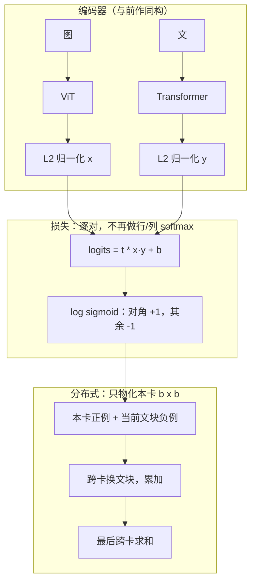

# SigLIP：把「认出哪句配哪张」从 softmax 改成逐对 sigmoid，小 batch 也能训、大 batch 不必再挤显存

<!-- release-date: 2023-03-27 -->

**本文依据**：`Sigmoid Loss for Language Image Pre-Training`，17 页。作者 Xiaohua Zhai、Basil Mustafa、Alexander Kolesnikov、Lucas Beyer（Zhai 与 Beyer 并列贡献），Google DeepMind, Zürich, Switzerland；通讯 `{xzhai, basilm, akolesnikov, lbeyer}@google.com`。封面代码 `https://github.com/google-research/big_vision`（PDF p. 1）。盘上 PDF 无 arXiv 页眉；`pdfinfo` 的 CreationDate 为 2023-09-27，与修订时间一致。标题检索 arXiv 得到 [2303.15343](https://arxiv.org/abs/2303.15343)：`Submitted on 27 Mar 2023 (v1), last revised 27 Sep 2023 (this version, v4)`。首发日取 v1 提交日 2023-03-27，这是外部补充，不来自 PDF 正文。封面未写会议录用，本文不补会议名。文中数字均标 PDF 页码；标「外部补充」的段落不来自本文。

## 一句话

图文对比预训练的默认损失是 softmax：每个图要在整个 batch 的所有文上归一化，每个文也要在所有图上再归一化一次。SigLIP 把这件事改成逐对二分类：真配对标 $+1$、假配对标 $-1$，用带温度和偏置的 sigmoid 独立打分，不必看全局分母（PDF p. 1、p. 3）。因此小 batch（小于 16k）比 softmax 明显更好，大 batch 也不必物化整张 $|B|\times|B|$ 相似度矩阵；SigLiT 能把 batch 推到一百万，但收益很快饱和，32k 已经够用（PDF p. 1–2）。四块 TPUv4、锁住图塔，两天训到 ImageNet 零样本 84.5%（PDF p. 1 表 1）。

它解决的不是「再做一个更大的 CLIP」，而是另一句：**对比任务的定义不该绑死在 batch 上；归一化一旦变成全局规约，小卡训不动、大卡也在为矩阵付账。**

读这篇可以按这条线走：先看 softmax 为什么要两次过全 batch，再看 sigmoid 如何把任务改成独立配对，然后看 chunked 实现如何用换文、不 all-gather 把显存压成一块 $b\times b$ 黄块，最后用 batch 扫描、负例比例和噪声实验确认「32k 够用、不平衡不可怕」。

## 一、矛盾：softmax 把「任务」和「这一批有多大」焊在一起

网上图文对已经把视觉骨干从封闭多类标注里解放出来。标准配方仍是 CLIP、ALIGN 那套：图向量和文向量对齐，batch 里用 softmax 对比损失，先对所有图归一、再对所有文归一（PDF p. 1）。朴素 softmax 数值不稳，通常先减掉全 batch 的最大值再做指数；这一步又要再扫一遍全 batch（PDF p. 1）。

两件事叠在一起：

- **任务定义依赖 batch。** 一张图的「正确配文」概率，分母是这一批里所有文的相似度。换一个 batch 大小，负例集合就变了，任务本身也变了。
- **实现依赖全局视野。** 数据并行时，每张卡要看见别人的嵌入才能算分母，典型做法是 all-gather，再物化一整张 $|B|\times|B|$ 矩阵（PDF p. 3）。batch 越大，这块矩阵越贵。

作者要的不是换编码器，而是换损失：只在图文对上操作，不要求对全部两两相似度做一次全局归一（PDF p. 1）。这样 batch 大小从损失定义里拆出去，才能同时问两件以前不好问的事：小卡能不能训；把 batch 拉到一百万，精度还会不会涨（PDF p. 1）。

贯穿全文的主轴因此很清楚：**softmax 把「认出真配对」做成了「在这一批里做 $N$ 类分类」；sigmoid 把它做成「给每一对独立打是/否」。** 后面所有实现和实验都在给这句让路。CLIP、ALIGN、LiT 在本文里只是被引用的前作与对照配方，架构细节不在这里展开。

## 二、全景：两个编码器不变，变的是相似度矩阵怎么变成损失

系统仍是图编码器 $f$、文编码器 $g$，嵌入 L2 归一化后做点积。SigLIP 是把 sigmoid 损失接到 CLIP 那种两端都训的设定上；SigLiT 是接到 Locked-image Tuning：图塔锁住（或预计算嵌入），只训文塔（PDF p. 1–2）。多语版本叫 mSigLIP，数据换成 WebLI 的全部语言（PDF p. 2、p. 5）。

上图根据 PDF p. 2 算法 1 与 PDF p. 3 图 1 重画，是机制示意，不是实测曲线。

表 1（PDF p. 1）把「小卡也能出活」写在封面旁。视觉读表：锁图标的 B/8 + 12 层 L 文塔、batch 32k、4 块 TPUv4、1 天，ImageNet 零样本 79.8（摘要写 79.7%，表内 79.8）；g/14 + L、batch 20k、4 卡、2 天，84.5%；解锁的 B/16 在 WebLI 上 16 卡 3 天到 71.0%；从随机初始化的 B/16，32 卡 2 天 72.1%、5 天 73.4%。脚注：L 文塔用了 12 层变体。

## 三、softmax：两次归一，任务就是「在这一批里做分类」

给定 mini-batch $B=\{(I_1,T_1),\ldots\}$，目标仍是：匹配对 $(I_i,T_i)$ 靠近，不匹配对 $(I_i,T_{j\neq i})$ 推开。实践上默认「别人的配文与我无关」，作者承认这条假设通常又吵又不完美（PDF p. 3）。

softmax 把目标写成对称的两项：图→文、文→图，各做一次 batch 内 softmax（PDF p. 3）：

$$
-\frac{1}{2|B|}\sum_{i=1}^{|B|}\Biggl(
\log\frac{e^{t\,\mathbf{x}_i\cdot\mathbf{y}_i}}{\sum_{j=1}^{|B|}e^{t\,\mathbf{x}_i\cdot\mathbf{y}_j}}
+\log\frac{e^{t\,\mathbf{x}_i\cdot\mathbf{y}_i}}{\sum_{j=1}^{|B|}e^{t\,\mathbf{x}_j\cdot\mathbf{y}_i}}
\Biggr)
$$

其中 $\mathbf{x}_i=f(I_i)/\|f(I_i)\|_2$，$\mathbf{y}_i=g(T_i)/\|g(T_i)\|_2$。温度 $t=\exp(t')$，$t'$ 是全局可学习标量。因为 softmax 不对称，归一化必须独立做两次：一次过所有图，一次过所有文（PDF p. 3）。图用 ViT，文用 Transformer（PDF p. 3）。

读公式时抓住分母：每一项都要看见这一批里全部 $j$。这就是「任务绑在 batch 上」的数学形式。

## 四、sigmoid：每一对独立做二分类，batch 只是采样器

sigmoid 不再算全局归一化因子。每一对图文单独处理，学习问题变成全体配对组合上的标准二分类：匹配对正标签，其余负标签（PDF p. 3）：

$$
-\frac{1}{|B|}\sum_{i=1}^{|B|}\sum_{j=1}^{|B|}
\log\frac{1}{1+e^{z_{ij}(-t\,\mathbf{x}_i\cdot\mathbf{y}_j+b)}}
$$

$z_{ij}$ 为 $+1$ 当 $(I_i,T_j)$ 是真配对，否则 $-1$（PDF p. 3）。损失对称，一遍就算完（PDF p. 2）。

负例远多于正例。初始化时这种不平衡会主导损失，优化器会迈出很大的步去纠偏。作者加一个可学习偏置 $b$，与温度同类；把 $t'$ 和 $b$ 分别初始化成 $\log 10$ 和 $-10$，让训练一开始就靠近先验，不必先狂纠（PDF p. 3）。算法 1（PDF p. 2）是伪代码：L2 归一化、$\mathrm{logits}=t\cdot z_{\mathrm{img}}z_{\mathrm{txt}}^\top+b$，标签矩阵为对角 $1$、其余 $-1$，再对 $\mathrm{log\_sigmoid}(\mathrm{labels}\cdot\mathrm{logits})$ 求和除以 $n$。

和 softmax 的差别可以收成三句：

1. softmax 的分母是「这一批里所有对手」；sigmoid 没有分母，只有这一对的 logit。
2. 因此小 batch 时，softmax 的「类别数」太少、负例质量差，sigmoid 不必等 batch 变大才像一个任务。
3. 因此大 batch 时，sigmoid 不必为归一化去 all-gather 整表，显存只跟当前块走。

可迁移的是原则：**对比损失若能写成独立配对之和，分布式就从「全局规约」变成「换块累加」。**

## 五、chunked 实现：不 all-gather，内存里永远只有一块 $b\times b$

数据并行时，softmax 通常要把所有嵌入 gather 齐，再物化 $|B|\times|B|$（PDF p. 3）。记每卡局部 batch 为 $b=|B|/D$。sigmoid 把损失拆成：本卡设备上的局部正例，加上从其他卡轮转过来的文块负例，每块独立可加（PDF p. 3）。因为每一对是独立项，这件事特别简单（PDF p. 3）。

图 1（PDF p. 3）用 3 卡、全局 batch 12 的玩具设置演示。视觉读图：四格都是 $12\times 12$ 的图–文网格，行是 $T_1$–$T_{12}$，列是 $I_1$–$I_{12}$，三卡各管 4 个图、4 个文。

- (a) 开始时每卡只握自己的 4 图 4 文；要算全损失本应看见别人的表示。
- (b) 各卡先算自己那块高亮 $4\times 4$（含对角正例），下方每列贡献约 33% 的损失。
- (c) 文在卡间交换：设备 1 现在拿 $I_{1:4}$ 和 $T_{5:8}$ 等，新损失与旧的累加；每列约 66%。
- (d) 转到每张图都和全部 12 条文交互过，例如设备 1 持有 $I_{1:4}$ 对 $T_{1:12}$ 的损失；最后一次跨卡求和。任何时刻内存里只有亮黄的 $4\times 4$，没有 all-gather。

这就是「能把 batch 拉很大」的系统原因：全局矩阵从未同时存在。作者感谢 big vision 代码库上对 chunked contrastive loss 的实现讨论（PDF p. 10）。

四块 TPUv4 上，Base SigLIP 能塞进 batch 4096，对应 CLIP 模型只能 2048（PDF p. 5）。BASIC、LAION 也曾把 batch 推到 16k 和 160k，但靠的是数百块芯片，前者还混了私有分类数据（PDF p. 2）。

## 六、数据、架构与训练 recipe：论文写到的那几条

**数据。** SigLIP / CLIP(WebLI) 对照用 WebLI 的英文图文对；mSigLIP 保留 WebLI 的 100 种语言（PDF p. 5）。SigLiT 用 LiT 的图文数据，图嵌入来自冻结的公开 ViT 检查点并预计算（PDF p. 1、p. 4、p. 6）。附录 F 的模型卡写：从零预训练用 WebLI；英文 SigLIP 滤成以英文为主的子集，mSigLIP 不按语言过滤（PDF p. 17）。WebLI 的原始规模、过滤规则正文没有展开，指向引用 [13]。

**架构。** 图 ViT、文 Transformer，两端尺寸对齐：ViT-B / L / SoViT-400M，嵌入维 768 / 1024 / 1152（PDF p. 17）。英文实验常用 32k sentencepiece（在英文 C4 上训），最长 16 个 text token，图 224×224（PDF p. 5）。放大实验改成 $(256/16)^2=256$ 个图 patch、64 个 text token；再在目标分辨率上多训 50 亿例、学习率缩小 100 倍、无权重衰减，以得到不同分辨率的 SigLIP（PDF p. 7）。模型卡还列了 224 / 256 / 384 / 512 输入边长（PDF p. 17）。

**多语词表。** 32k 多语词表对 250k 词表，B 模型看 9 亿例时，大词表大约高 1% 以上（PDF p. 5）。大词表的 $N\times W$ 查找表太贵，作者做成瓶颈：$N\times K$ 再乘 $K\times W$。Base 上 $W=768$、$K=96$，相对完整 250k 词表，ImageNet 零样本大约掉半个百分点，但能按小词表的效率往上扩（PDF p. 5）。

**优化。** 大 batch 时 Transformer 图文预训练更容易不稳，即便只是 Base：损失尖峰来自梯度范数尖峰，再变成过大的参数更新（PDF p. 7–8 图 5）。把 Adam / AdaFactor 的 $\beta_2$ 从默认 0.999 降到 0.95，就能稳住；偶发尖峰（图上约 20 亿例处）不再掀翻训练。全文实验取 $\beta_2=0.95$（PDF p. 8）。附录：sigmoid 不必按 batch 重调超参，SigLIP 与 SigLiT 在 512 到 1024k 上都用默认学习率 0.001、权重衰减 0.0001（PDF p. 14）。

**解锁图塔微调。** 用公开未锁的 ViT-AugReg-B/16 初始化图塔，学习率乘 0.1，在同一份英文 WebLI 上微调（PDF p. 6–7）。默认同衰减预训练权重会把视觉表示毁了：ImageNet 10-shot 几乎不比从零好（PDF p. 7 图 4）。只对随机初始化的文塔做权重衰减、预训练图权重不衰减，16 卡、batch 16k、24 亿例、三天到 ImageNet 零样本 71%（PDF p. 7；表 1 写 71.0）。图 4 上半：从零曲线爬得慢；微调且关掉编码器权重衰减才既稳又高。下半 10-shot：衰减预训练权重会把曲线压下去。

**四卡 SigLiT。** 冻结 ViT-AugReg-B/8，预计算嵌入；文塔是 12 层的 Large；LION，解耦权重衰减 $1\times 10^{-7}$，6.5k 步线性升到峰值 $1\times 10^{-4}$，再余弦到 0；65k 步、batch 32k，不到一天，零样本 79.7%（PDF p. 6；表 1 为 79.8）。换成 ViT-g/14 + Large 文塔，batch 20k、107k 步、两天，84.5%（PDF p. 6）。附录补充：不到一天的四卡 run 用 LION，6.5k warmup + 剩余 58.5k 余弦（PDF p. 14）。

从零的 SigLIP：32 卡两天 72.1%，对比 FLIP 文中引用的 CLIP 约 2500 TPUv3-天才到 72.6%（PDF p. 7）。引言还写：从零 SigLIP 五天 32 卡到 73.4%，相对 FLIP、CLIP 在 256 块 TPUv3 上大约 5 天和 10 天更便宜（PDF p. 2）。芯片代数不同，只能当作者自己的对照，不能折成同一计价。

## 七、实验：小 batch 赢在损失，大 batch 赢不到无限

### 7.1 SigLiT：小于 16k 时 sigmoid 明显更好，一百万也饱和在 32k

图 2 左（PDF p. 4）：看 180 亿例。横轴 batch（k），纵轴 ImageNet 零样本。sigmoid 在小 batch 显著高于 softmax，大了两边贴在一起。成功训到一百万 batch，但两边都在约 32k 饱和。附录表 8（PDF p. 15）把 450M / 900M / 3B / 18B 例 × batch 512 到 1M 摊开。读表：450M 例、batch 512 时 sigmoid 72.5 vs softmax 69.5；18B 例、32k 时 84.6 vs 84.4；18B、1024k 只有 sigmoid 84.7，softmax 该格为空。256k 在短日程（450M）上两边都掉到约 72.8 / 72.2，因为更新步太少。

最好的 B 级文塔 SigLiT 到 84.7%；原 LiT 论文用大十倍的 g 级文塔报 85.2%（PDF p. 4–5）。图 3（PDF p. 5）：同一套 SigLiT，横轴看过的例数。262k 大 batch 在够长的日程上明显超过 8k，但短日程时大 batch 步数少、爬升慢。

### 7.2 SigLIP：峰值来得更早

图 2 中（PDF p. 4）：90 亿例。小于 32k 时 SigLIP 超过同数据的 CLIP(WebLI) softmax。sigmoid 峰值在 32k；softmax 要 98k 才到最优，仍未超过 sigmoid。再拉到 307k，两种损失都受伤（PDF p. 5）。四卡上 Base 的 4096 vs 2048 已见第五节。

### 7.3 mSigLIP：100 种语言同样 32k 够用

作者原以为大 batch 能在同一 mini-batch 里凑到更多同语言难负例，结果 32k 以上没有清楚收益（PDF p. 6）。表 2（PDF p. 5）：30 亿例。ImageNet 零样本 16k→32k 为 71.6→73.2，再往上 64k / 128k / 240k 停在 73.2 / 73.2 / 73.1。XM3600 上 36 语平均文→图：34.8 / 34.9 / 34.4 / 33.6 / 32.7，32k 最好，再大变差。个别语言：de 54.7–55.4 一带；en 约 46.5；hi 从 9.1 掉到 7.3；zh 32k 时 32.5，240k 掉到 23.7。Base 的 34.9% 文→图超过先前 LiT + 四十亿参数 ViT-e 的 28.5%（PDF p. 6）。附录图 8、表 9 是 36 语细表，此处不逐行抄。

### 7.4 放大：So-400M 写在本 PDF 的表 3 里，不是后作

第 4.6 节按「过训练」把模型看 400 亿例、batch 32k（PDF p. 7）。表 3（PDF p. 8）与公开权重对照，零样本分类 + COCO R@1。视觉读表（节选）：

| 方法 | ViT | patches | IN val | IN-v2 | ReaL | ObjectNet | COCO I→T | T→I |
|---|---|---|---|---|---|---|---|---|
| CLIP | B | 196 | 68.3 | 61.9 | — | 55.3 | 52.4 | 33.1 |
| OpenCLIP | B | 196 | 70.2 | 62.3 | — | 56.0 | 59.4 | 42.3 |
| EVA-CLIP | B | 196 | 74.7 | 67.0 | — | 62.3 | 58.7 | 42.2 |
| SigLIP | B | 196 | 76.2 | 69.6 | 82.8 | 70.7 | 64.4 | 47.2 |
| SigLIP | B | 1024 | 79.2 | 73.0 | 84.9 | 74.7 | 67.6 | 50.4 |
| CLIP | L | 256 | 75.5 | 69.0 | — | 69.9 | 56.3 | 36.5 |
| SigLIP | L | 256 | 80.5 | 74.2 | 85.9 | 77.9 | 69.5 | 51.1 |
| SigLIP | L | 576 | 82.1 | 75.9 | 87.0 | 81.0 | 70.6 | 52.7 |
| OpenCLIP | G (2B) | 256 | 80.1 | 73.6 | — | 73.0 | 67.3 | 51.4 |
| EVA-CLIP | E (5B) | 256 | 82.0 | 75.7 | — | 79.6 | 68.8 | 51.1 |
| SigLIP | SO (400M) | 729 | 83.2 | 77.2 | 87.5 | 82.9 | 70.2 | 52.0 |

作者强调 Shape-Optimized 400M 的 ViT 超过显著更大的模型，权重仍放在 big_vision（PDF p. 8）。放大后的 mSigLIP ViT-B 在 XM3600 上图检索 R@1 42.6%、文检索 54.1%；Large 的 [48] 图检索 42.96% 略高（PDF p. 7）。这些数字属于本 PDF，不是后来的 SigLIP2 系列。

### 7.5 负例比例：不平衡不可怕，难负例才值钱

batch $|B|$ 里只有 $|B|$ 个正对、却有 $|B|^2-|B|$ 个负对。16k batch 意味着约 2.68 亿负对对 16k 正对（PDF p. 8）。sigmoid 是逐例损失之和，可以靠 mask 负例做受控实验。SigLiT、batch 16k、900M 步，把正:负收到目标比（PDF p. 8）：

- Random：随机丢掉负对；
- Hard：只留损失最高的难负例；
- Easy：只留最容易的；
- Hard + 对齐总对数：mask 后按比例加长步数，使见过的配对总数不变。

无 mask 时是 1:16k；最强 mask 到 1:1.6，几乎均衡（PDF p. 7 图 6）。图 6 三列：ImageNet 零样本、学到的 bias、正/负平均 logit。随机再平衡会掉点；只留 easy 完全不行；只留 hard 几乎保住质量；加长训练去对齐总对数还略好。负例变少时，bias 和 logit 整体更正；加更多 hard 时，正例平均 logit 大体走平（PDF p. 8–9）。结论：不平衡不是大问题；更有效地挖负例有希望，但不平凡（PDF p. 9）。

### 7.6 偏置消融与噪声

表 4（PDF p. 9）：Base、8k batch、9 亿例。无 bias、$t_0=\log 10$：INet-0 62.0 / Pet-0 81.8 / C100-0 59.9。$b=-10$、$t_0=\log 10$：63.0 / 82.4 / 61.0。$b=0$ 且 $t_0=\log 1$ 掉到 53.7 / 73.2 / 53.8。默认因此固定 $b=-10$、$t_0=\log 10$（即 $t=10$）（PDF p. 9）。

图 7（PDF p. 9）：M/16 图 + M 文、batch 16384、36 亿例。腐蚀包括：以概率 $p$ 把图换成均匀噪声；把 token 换成随机序列；打乱 $p\%$ 的 batch 对齐；以及它们的组合。横轴 $p$，纵轴 ImageNet 零样本；sigmoid 在各类噪声加重时都压过对应 softmax。作者把这与分类里 sigmoid 对标签噪声更稳的旧观察连起来，并指出大规模图文数据本来就吵（PDF p. 9）。

## 八、限制、未公开信息、不要从本篇外推的东西

论文明确承认：batch 内「别人的配文一定不相关」通常不成立（PDF p. 3）。大 batch 的收益迅速消失，32k 近乎够用，再大在多语检索上甚至变差（PDF p. 1、p. 6）。负例挖掘「有希望但不平凡」，本文没有给出可部署的挖负例算法（PDF p. 9）。微调预训练图塔必须关掉其权重衰减，否则视觉质量会坏（PDF p. 7）。

没写或没展开的：WebLI 的完整采集与过滤；chunked 实现的通信字节与墙钟对比表；softmax 在 1024k 上为何表 8 为空（只写成功训了 SigLiT 一百万，没写 softmax 同设置）（PDF p. 15）；训练数据版权与安全评估。模型卡写用途是多模态研究、零样本分类与检索（PDF p. 17）。

**不要把后作写进这篇。** 本 PDF 已经包含 So-400M 和 mSigLIP 放大；后续 SigLIP2、社区常说的 SigLIP-SO400M 检查点迭代，不属于本文事实源。

## 九、可迁移启发

1. **先问损失有没有不必要的全局规约。** 任务若能写成独立项之和，分布式就从 all-gather 整表变成换块累加。
2. **小 batch 不是对比学习的原罪，softmax 分母才是。** 资源少时优先换损失，而不是硬凑 32k。
3. **真把 batch 拉到极限之前，先做一条饱和曲线。** 本文的结论是 32k 已经够，一百万只证明「做得到」，不证明「值得」。
4. **类别极不平衡时，用偏置把优化起点放到先验上**（这里是 $b=-10$），比把学习率调到能扛过前几步更干净。
5. **微调已有编码器时，权重衰减不要默认打在预训练参数上。**
6. **大 batch 不稳，先降 $\beta_2$，再谈换优化器。**

## 十、关键词回看

**softmax 对比损失**：把真配对当成 batch 内 $N$ 类分类的正确类，行、列各归一一次。**sigmoid 对比损失（SigLIP）**：每一对独立二分类，带温度 $t$ 与偏置 $b$。**SigLiT**：同一损失接到锁图塔的 LiT。**chunked loss**：跨卡轮转文块，内存只留局部 $b\times b$。**负例比例**：正对数线性、负对数平方；难负例几乎能代替全体负例。**32k**：本文在英、多语、sigmoid、softmax 上反复出现的饱和点。

## 参考资料

- 原件 PDF：`readings/_src/多模态理解与 Omni/SigLIP.pdf`
- 代码（封面）：[google-research/big_vision](https://github.com/google-research/big_vision)
- arXiv 条目（外部补充，用于 v1 日期与编号）：[2303.15343](https://arxiv.org/abs/2303.15343)
- 前作在本 PDF 中的引用：CLIP [36]、ALIGN [23]、LiT [59]、WebLI [13]，细节以各篇原文为准
