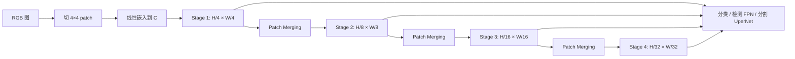

# Swin Transformer：用平移窗口把全局注意力做成线性复杂度的视觉骨干

<!-- release-date: 2021-03-25 -->

**本文依据**：`Swin Transformer: Hierarchical Vision Transformer using Shifted Windows`，arXiv 2103.14030v2（页眉 2021-08-17），14 页。作者 Ze Liu、Yutong Lin、Yue Cao、Han Hu 等，Microsoft Research Asia。代码行写明 `https://github.com/microsoft/Swin-Transformer`。盘上 PDF 为 v2；首发日取 arXiv abs 页 Submission history 的 v1 提交日 2021-03-25（[arxiv.org/abs/2103.14030](https://arxiv.org/abs/2103.14030)：`[v1] Thu, 25 Mar 2021 17:59:31 UTC`；这是外部补充，不来自 PDF 正文）。封面未写会议录用，本文不补会议名。文中数字均标 PDF 页码；标「外部补充」的段落不来自本文。

## 一句话

ViT 把整图当一条序列做全局自注意力：分辨率一高，复杂度按像素数平方涨，而且只有单一低分辨率特征图，接检测、分割这类密预测任务很别扭。Swin Transformer 把自注意力限制在不重叠的局部窗口里，复杂度对图像尺寸变成线性；相邻层再把窗口整体平移半格，让上一层互不相通的窗口在下一层交叉，跨窗信息就能流过去。特征图还按 2 倍逐步合并，长成和 ResNet 一样的金字塔。于是同一套骨干既能分类，也能直接塞进 FPN / U-Net。ImageNet-1K 上 Swin-L（ImageNet-22K 预训练、384 输入）到 87.3 top-1（PDF p. 1、p. 6）；COCO test-dev 上 58.7 box AP、51.1 mask AP；ADE20K val 上 53.5 mIoU（PDF p. 1）。

它解决的不是「注意力比卷积更懂图」，而是另一句：要把 Transformer 当成通用视觉骨干，必须同时拿到多尺度特征和相对图像尺寸线性的计算；平移窗口是同时满足这两条的那一刀。

## 一、矛盾：语言里的全局注意力，到图上会卡两处

视觉建模长期被 CNN 主导。从 AlexNet 到 ResNet、DenseNet、HRNet、EfficientNet，进步多半来自更深、更密的连接、更巧的卷积（PDF p. 1）。NLP 走的是另一条路：今天的默认骨架是 Transformer，靠注意力建模长程依赖（PDF p. 1）。

把 Transformer 接到视觉上，当时已经有两条成功线索：ViT 做图像分类，以及联合视觉–语言建模（PDF p. 1）。作者要的是更强的一件事：让 Transformer **像 CNN 在视觉里、像 Transformer 在 NLP 里那样，当通用骨干**（PDF p. 1–2）。

语言和视觉差两处，直接搬会失败（PDF p. 2）。

第一处是 **尺度**。语言里词是固定粒度的 token。图里目标可大可小，检测任务一直在为尺度操心。已有 Transformer（含 ViT）token 尺度固定，不适合这些任务（PDF p. 2）。

第二处是 **分辨率**。像素远比词密。语义分割要像素级预测。全局自注意力对 token 数平方，高分辨率图算不起（PDF p. 2）。

ViT 的特征图是单一低分辨率，复杂度对图像尺寸二次。作者把它画在图 1(b) 里，和自己的层次化、窗内注意力对照（PDF p. 1 图 1）。视觉读图：左侧 (a) 从灰框小 patch 起，越深越合并，红框是局部窗；右侧 (b) 一张低分辨率网格上做全局注意力。这是机制示意，不是实测曲线。

相关工作里还有两类对照，帮助定位这一刀切在哪（PDF p. 2–3）：

1. **用滑动窗口局部注意力替换 ResNet 里的空间卷积**。精度/FLOPs 略好，但每个 query 像素的 key 集合不同，硬件访存差，真实延迟明显高于卷积（PDF p. 3）。
2. **注意力当 CNN 插件，或 Transformer 当检测头**。作者做的是整条骨干替换，和这些互补，不是同一件事（PDF p. 3）。

同期也有改 ViT 做分类、或做多分辨率特征图的工作。作者点名：有的复杂度仍对图像尺寸二次；Swin 是线性，而且注意力在局部，符合视觉信号的局部高相关（PDF p. 3）。

## 二、全景：四阶段金字塔 + 成对的窗注意力

图为机制示意，根据 PDF p. 4 图 3(a) 重画，不是实测曲线。

读图 3(a)：输入经 Patch Partition 和 Linear Embedding 进 Stage 1，之后三次 Patch Merging 接到 Stage 2/3/4；Swin-T 各阶段块数标成 2、2、6、2。图 3(b) 把两个连续块画成：LN → W-MSA → 残差 → LN → MLP，下一块把 W-MSA 换成 SW-MSA（PDF p. 4 图 3）。这是机制示意。

四个阶段的分辨率和典型 CNN（VGG、ResNet）对齐，所以可以直接替换现有检测、分割框架里的骨干（PDF p. 3–4）。

Swin Transformer block 只改一件事：标准 MSA 换成基于平移窗口的注意力，其余保持 Transformer 习惯——MSA 后接两层 MLP（中间 GELU），MSA 和 MLP 前各一层 LayerNorm，模块后残差（PDF p. 4）。

## 三、输入与层次化：从小 patch 往上合并

**旧问题**：ViT 用中等大小、互不重叠的 patch 直接铺一层 Transformer，适合分类，不适合要多尺度特征的密预测（PDF p. 3）。

**新设计**：像 ViT 一样先切不重叠 patch，但 patch 很小：实现里 $4\times 4$，每个 token 的原始特征是 $4\times 4\times 3=48$ 维 RGB 拼接，再线性投到通道 $C$（PDF p. 3）。Stage 1 保持 token 数 $H/4\times W/4$（PDF p. 3）。

要层次化，就在网络变深时用 **patch merging** 减 token。第一次：每组 $2\times 2$ 邻域 patch 特征拼接成 $4C$ 维，再过线性层，token 数变成原来的 $1/4$（分辨率 2 倍下采样），输出通道设为 $2C$，后面再接若干 Swin 块，分辨率停在 $H/8\times W/8$。这是 Stage 2。同样手续再做两次，得到 Stage 3 的 $H/16\times W/16$ 和 Stage 4 的 $H/32\times W/32$（PDF p. 3）。

**收益**：特征金字塔分辨率和 CNN 骨干一致，FPN、U-Net 一类密预测组件可以开箱接上（PDF p. 2）。

**代价**：合并是固定 $2\times 2$ 拼接加线性，不是学出来的可变形采样；尺度变化仍靠层次堆出来。

**可迁移**：要让序列模型当检测/分割骨干，先问特征图有没有 CNN 那种 $1/4$、$1/8$、$1/16$、$1/32$ 金字塔，而不是先问注意力是不是全局。

## 四、窗内注意力：复杂度从二次变线性

**旧问题**：标准 Transformer 和 ViT 都做全局自注意力，一个 token 对所有其他 token。token 一多（密预测、高分辨率），平方项吃不消（PDF p. 4）。

**新设计**：图被不重叠窗口均匀切开，注意力只在每个窗口里算。设每窗 $M\times M$ 个 patch。全局 MSA 与窗内 W-MSA 的复杂度（省略 SoftMax）是（PDF p. 4 式 1–2）：

$$\Omega(\mathrm{MSA})=4hwC^{2}+2(hw)^{2}C$$

$$\Omega(\mathrm{W\text{-}MSA})=4hwC^{2}+2M^{2}hwC$$

$h\times w$ 是 patch 网格。第一式对 patch 数二次；第二式在 $M$ 固定时对图像尺寸线性。默认 $M=7$（PDF p. 4–5）。

**工作机制**：窗与窗不重叠，同一窗里所有 query 共享同一套 key。作者强调这点对硬件访存友好，对比滑动窗口「每个 query 像素 key 集合不同」（PDF p. 2）。

**收益**：高分辨率可算，骨干能进检测、分割。

**代价 / 边界**：纯窗内注意力没有跨窗连接，建模能力被切开（PDF p. 4）。$M$ 仍是超参：太大就回到二次，太小感受野碎。

**可迁移**：要线性注意力，不一定上核方法或低秩近似；把计算域收成固定大小、不重叠的块，复杂度公式里的平方项会变成常数。

## 五、平移窗口：线性复杂度还在，跨窗连通补上

这是全文的关键设计。图 2 画得很直白（PDF p. 2 图 2）。视觉读图：左图 layer $l$ 是规整切分，每个 $4\times 4$ 窗一种颜色，注意力不出窗；右图 layer $l+1$ 整套窗向右下挪了半窗，新窗压在旧边界上。论文用 $8\times 8$ 特征图、$M=4$ 举例：先切成 $2\times 2$ 个窗，下一层平移 $(\lfloor M/2\rfloor,\lfloor M/2\rfloor)$ 个像素（PDF p. 4）。

**旧问题**：不重叠窗高效，但窗与窗不通。

**新设计**：连续两层交替两种切法——一层 regular window（W-MSA），一层 shifted window（SW-MSA）（PDF p. 4）。连续块写成（PDF p. 4 式 3）：

$$\hat{z}^{l}=\mathrm{W\text{-}MSA}(\mathrm{LN}(z^{l-1}))+z^{l-1}$$

$$z^{l}=\mathrm{MLP}(\mathrm{LN}(\hat{z}^{l}))+\hat{z}^{l}$$

$$\hat{z}^{l+1}=\mathrm{SW\text{-}MSA}(\mathrm{LN}(z^{l}))+z^{l}$$

$$z^{l+1}=\mathrm{MLP}(\mathrm{LN}(\hat{z}^{l+1}))+\hat{z}^{l+1}$$

$\hat{z}^{l}$、$z^{l}$ 分别是第 $l$ 块里（S）W-MSA 和 MLP 的输出。

**工作机制，为什么两头都能拿到**：

1. **线性还在**。每一层注意力域仍是 $M\times M$ 的不重叠窗，式 2 的 $M$ 没变，复杂度仍线性。平移改的是窗怎么划，不是窗变大。
2. **跨窗连通来自「隔层交叉」**。第 $l$ 层窗 A、B 不相交，信息不直接换。第 $l+1$ 层的新窗同时盖住 A 的右下和 B 的左上，这一层的注意力就把两边拼起来。再下一层切回规整划分，信息可以继续往外传。不是一层之内全局，是 **相邻层用不同划分把局部图连成更大的图**。
3. **和滑动窗比**：滑动窗每个 query 一套邻域，建模力类似，但访存差。平移窗一层之内仍是「整窗共享 key」，延迟低很多（PDF p. 2；表 5、表 6 在 PDF p. 8–9）。

消融用 Swin-T：相对「每层都用同一套规整划分、不平移」，ImageNet-1K top-1 从 80.2 到 81.3（+1.1），COCO box/mask AP 从 47.7/41.5 到 50.5/43.7，ADE20K mIoU 从 43.3 到 46.1（PDF p. 8 表 4）。延迟开销很小（PDF p. 8）。

**可迁移**：局部计算要补感受野，不一定叠更大的核。 **同一套局部算子，隔层换划分/换相位**，就能在不涨渐进复杂度的前提下把邻域焊起来。卷积的 dilation、Transformer 的平移窗，是同一类想法。

## 六、循环移位：平移后窗数不要膨胀

**旧问题**：平移之后，窗数从 $\lceil h/M\rceil\times\lceil w/M\rceil$ 变成 $(\lceil h/M\rceil+1)\times(\lceil w/M\rceil+1)$，边上还会出现小于 $M\times M$ 的残窗（PDF p. 5）。朴素做法是 pad 到 $M\times M$ 再 mask。规整划分若只有 $2\times 2$ 窗，pad 会变成 $3\times 3$，计算约 2.25 倍（PDF p. 5）。特征图若不能被 $(M,M)$ 整除，右下也要 pad（PDF p. 5 脚注 4）。

**新设计**：把特征图向左上 **循环移位（cyclic shift）**，再按规整窗切 batch。一个 batch 窗里可能拼了原来不相邻的几块子窗，用 mask 把注意力限制在各子窗内部。循环移位后，batch 窗数量与规整划分相同（PDF p. 5）。

图 4 画的是：先 window partition 得到 A/B/C 等块，cyclic shift 把它们卷到规整网格，masked MSA，再 reverse cyclic shift 还原（PDF p. 5 图 4）。视觉读图能看到左上出现拼接块、mask 标在子窗边界上。这是实现示意，不是测速图。

表 5 在 V100 上比真实速度（PDF p. 8）。循环平移相对 naive padding，整体给 Swin-T / Swin-S / Swin-B 分别带来 13%、18%、18% 加速（PDF p. 8）。相对滑动窗，四个 stage 上平移窗注意力模块比 naive/kernel 实现快 $40.8\times$/$2.5\times$、$20.2\times$/$2.5\times$、$9.3\times$/$2.1\times$、$7.6\times$/$1.8\times$；整网相对滑动窗变体，Swin-T/S/B 分别约 $4.1$/$1.5$、$4.0$/$1.5$、$3.6$/$1.5$ 倍（PDF p. 8）。表 6：滑动窗与平移窗精度接近（Swin-T 上 ImageNet 81.4 vs 81.3，COCO 50.2/43.5 vs 50.5/43.7，ADE20K 45.8 vs 46.1）（PDF p. 9 表 6）。相对 Performer，平移窗略快，Swin-T 在 ImageNet-1K 上高 2.3 个点（79.0 vs 81.3）（PDF p. 8–9）。

**可迁移**：划分一变，batch 形状容易炸。先用循环移位把不规则划分卷回规则网格，再 mask，是把「逻辑上的错位」和「实现上的齐整」拆开的常用手法。

## 七、相对位置偏置

窗内注意力的相似度不是纯 $QK^{\top}$。每个头加相对位置偏置 $B\in\mathbb{R}^{M^{2}\times M^{2}}$（PDF p. 5 式 4）：

$$\mathrm{Attention}(Q,K,V)=\mathrm{SoftMax}(QK^{\top}/\sqrt{d}+B)V$$

$Q,K,V\in\mathbb{R}^{M^{2}\times d}$，$d$ 是 query/key 维，$M^{2}$ 是一窗里的 patch 数。每个轴上相对位置落在 $[-M+1,M-1]$，所以真正学的是更小的 $\hat{B}\in\mathbb{R}^{(2M-1)\times(2M-1)}$，$B$ 从 $\hat{B}$ 里取（PDF p. 5）。

表 4（PDF p. 8）：相对「无位置」和「绝对位置」，相对偏置在三套任务上都更好。相对无位置 / 绝对位置，ImageNet top-1 +1.2% / +0.8%，COCO box AP +1.3 / +1.5、mask AP +1.1 / +1.3，ADE20K +2.3 / +2.9 mIoU（PDF p. 8）。绝对位置对分类有 +0.4%，但检测掉 0.2 box/mask AP，分割掉 0.6 mIoU，所以主实现不加输入端绝对位置（PDF p. 5、p. 8）。再叠一层绝对位置还会略掉点，也不用（PDF p. 5）。去掉式 4 里第一项点积、只留相对偏置（`rel. pos. w/o app.`）分类掉到 79.3，明显更差（PDF p. 8 表 4）。

预训练学到的相对偏置，微调到不同窗大小时可以用双三次插值初始化（PDF p. 5）。

作者的判断：ViT/DeiT 在分类上放弃了平移不变，但 **鼓励一定平移不变的归纳偏置，对通用视觉建模、尤其密预测仍然更可取**（PDF p. 8）。这是观察，不是单独定理。

**可迁移**：局部窗已经把几何切小了，位置编码与其学绝对坐标，不如学窗内相对偏移；绝对位置对分类和对检测/分割的符号可以相反，不要只用分类指标选型。

## 八、变体规格

基准 Swin-B 的体量和计算量对齐 ViT-B / DeiT-B。Swin-T、Swin-S、Swin-L 大约是其 $0.25\times$、$0.5\times$、$2\times$（PDF p. 5）。Swin-T、Swin-S 的复杂度分别接近 ResNet-50（DeiT-S）和 ResNet-101（PDF p. 5）。默认 $M=7$，每头 query 维 $d=32$，MLP 扩张 $\alpha=4$（PDF p. 5）。

| 变体 | 第一段通道 $C$ | 四阶段层数 |
|---|---|---|
| Swin-T | 96 | {2, 2, 6, 2} |
| Swin-S | 96 | {2, 2, 18, 2} |
| Swin-B | 128 | {2, 2, 18, 2} |
| Swin-L | 192 | {2, 2, 18, 2} |

（PDF p. 5）

附录表 7 把 224 输入下的下采样、窗、通道、头数写全（PDF p. 10 表 7）。Stage 1 输出 $56\times 56$，之后 $28\times 28$、$14\times 14$、$7\times 7$。Swin-T 四阶段通道/头数为 96/3、192/6、384/12、768/24；Swin-B 为 128/4、256/8、512/16、1024/32；Swin-L 为 192/6、384/12、768/24、1536/48。Patch 进入 Stage 1 是 concat $4\times 4$ 再线性；之后每次 merging 是 concat $2\times 2$（PDF p. 10）。

本文出现的 Swin-L 是这篇论文自己的大号变体，不是后续代际。

## 九、分类：ImageNet-1K 与 22K 预训练

数据：ImageNet-1K 训练 128 万、验证 5 万、1000 类，报单裁 top-1（PDF p. 5）。

两条训练设定（PDF p. 5–6、附录 p. 9）：

**从 ImageNet-1K 训**：大体跟 DeiT。AdamW，300 epoch，cosine 衰减，20 epoch 线性 warm-up；batch 1024，初始学习率 0.001，weight decay 0.05；梯度裁剪 max norm 1（附录）。增强几乎照 DeiT，但 **不用 repeated augmentation 和 EMA**——这两项对 Swin 没增益；DeiT 里 repeated augmentation 对稳住 ViT 训练却很关键（PDF p. 6、p. 9）。更大模型用更强 stochastic depth：Swin-T/S/B 分别为 0.2、0.3、0.5（PDF p. 9）。默认输入 $224^{2}$；更大分辨率（如 $384^{2}$）从 $224^{2}$ 微调，不从头训，为了省 GPU（PDF p. 9）。分类头是最后一层特征图全局平均池化再接线性，作者发现和 ViT 那种额外 class token 一样准（PDF p. 9）。

**ImageNet-22K 预训练再微调 1K**：22K 有 1420 万图、2.2 万类。AdamW，90 epoch，线性衰减，5 epoch warm-up；batch 4096，初始学习率 0.001，weight decay 0.01。1K 微调 30 epoch，batch 1024，恒定学习率 $10^{-5}$，weight decay $10^{-8}$（PDF p. 6、p. 9）。大分辨率微调时 stochastic depth 收到 0.1（PDF p. 9）。

表 1(a) 1K 训练（PDF p. 6；吞吐在 V100 上按 DeiT 同款仓库测）：

| 模型 | 输入 | 参数 | FLOPs | 吞吐 (img/s) | top-1 |
|---|---|---|---|---|---|
| DeiT-S | $224^{2}$ | 22M | 4.6G | 940.4 | 79.8 |
| DeiT-B | $224^{2}$ | 86M | 17.5G | 292.3 | 81.8 |
| DeiT-B | $384^{2}$ | 86M | 55.4G | 85.9 | 83.1 |
| Swin-T | $224^{2}$ | 29M | 4.5G | 755.2 | 81.3 |
| Swin-S | $224^{2}$ | 50M | 8.7G | 436.9 | 83.0 |
| Swin-B | $224^{2}$ | 88M | 15.4G | 278.1 | 83.5 |
| Swin-B | $384^{2}$ | 88M | 47.0G | 84.7 | 84.5 |

正文对照 DeiT 时写 Swin-B（$224^{2}$/$384^{2}$）为 83.3%/84.5%，相对 DeiT-B 的 81.8%/83.1% 是 +1.5 / +1.4；Swin-T 相对 DeiT-S 为 +1.5（81.3 vs 79.8）（PDF p. 6）。表 1(a) 里 Swin-B $224^{2}$ 印的是 83.5，附录表 8 同一设定是 83.3（PDF p. 6、p. 10）。两处不一致，本文并列记下，不擅自改。

相对 RegNet、EfficientNet，作者说速度–精度略好，并强调那两家是搜出来的架构，Swin 从标准 Transformer 改来，还有改进空间（PDF p. 6）。

表 1(b) 22K 预训练（PDF p. 6）：

| 模型 | 输入 | 参数 | FLOPs | 吞吐 | top-1 |
|---|---|---|---|---|---|
| ViT-B/16 | $384^{2}$ | 86M | 55.4G | 85.9 | 84.0 |
| ViT-L/16 | $384^{2}$ | 307M | 190.7G | 27.3 | 85.2 |
| Swin-B | $224^{2}$ | 88M | 15.4G | 278.1 | 85.2 |
| Swin-B | $384^{2}$ | 88M | 47.0G | 84.7 | 86.4 |
| Swin-L | $384^{2}$ | 197M | 103.9G | 42.1 | 87.3 |

Swin-B 的 22K 预训练相对 1K 从头训涨 1.8–1.9 个点（PDF p. 6；原文用 `1.8%∼1.9%`）。Swin-B $384^{2}$ 比相近吞吐的 ViT-B 高 2.4 个点（86.4 vs 84.0），FLOPs 47.0G vs 55.4G。Swin-L 再高 0.9 到 87.3（PDF p. 6）。

附录表 8：输入从 $224^{2}$ 提到 $384^{2}$，Swin-T top-1 81.3→82.2，吞吐 755.2→219.5；Swin-S 83.0→83.9；Swin-B 83.3→84.5（PDF p. 10）。更大输入更准、更慢。

## 十、检测：COCO 上换骨干就能涨

COCO 2017：11.8 万训练、5 千验证、2 万 test-dev。消融走 val，系统级比 test-dev（PDF p. 6）。

消融框架四种：Cascade Mask R-CNN、ATSS、RepPoints v2、Sparse R-CNN，都在 mmdetection 里。设定对齐：多尺度训练（短边 480–800，长边至多 1333），AdamW（lr 0.0001，wd 0.05，batch 16），3x（36 epoch，27/33 epoch 学习率除 10）（PDF p. 6、p. 9）。系统级用改进 HTC（HTC++）：Instaboost、更强多尺度（短边 400–1400，长边至多 1600）、6x（72 epoch，63/69 epoch 乘 0.1）、soft-NMS、最后一层后再加一层全局自注意力、ImageNet-22K 初始化；Swin 的 stochastic depth 0.2（PDF p. 6、p. 9–10）。

Swin 和 ResNe(X)t 有层次特征图，四种框架都能直接换骨干。DeiT 只有单分辨率，公平起见按 SETR 的办法用反卷积造金字塔（PDF p. 7）。

表 2(a)：四个框架上 Swin-T 相对 R-50，box AP 稳定高 3.4–4.2（PDF p. 7）。例如 Cascade Mask R-CNN：R-50 46.3 / Swin-T 50.5；ATSS 43.5 / 47.2；RepPointsV2 46.5 / 50.0；Sparse R-CNN 44.5 / 47.9（PDF p. 7 表 2）。

表 2(b) Cascade Mask R-CNN 换骨干（PDF p. 7）：

| Backbone | box AP | mask AP | 参数 | FLOPs | FPS |
|---|---|---|---|---|---|
| DeiT-S† | 48.0 | 41.4 | 80M | 889G | 10.4 |
| R50 | 46.3 | 40.1 | 82M | 739G | 18.0 |
| Swin-T | 50.5 | 43.7 | 86M | 745G | 15.3 |
| X101-32 | 48.1 | 41.6 | 101M | 819G | 12.8 |
| Swin-S | 51.8 | 44.7 | 107M | 838G | 12.0 |
| X101-64 | 48.3 | 41.7 | 140M | 972G | 10.4 |
| Swin-B | 51.9 | 45.0 | 145M | 982G | 11.6 |

Swin-B 相对相近体量的 ResNeXt101-64x4d：+3.6 box AP、+3.3 mask AP（PDF p. 7）。Swin-T 相对 DeiT-S：+2.5 box、+2.3 mask，更快（15.3 vs 10.4 FPS）；DeiT 慢主要因为对输入尺寸二次（PDF p. 7）。

HTC++ 上更高基线 52.3 box / 46.0 mask（X101-64）时，Swin 仍有 +4.1 box、+3.1 mask（表 2(c) 的 Swin-B 56.4/49.1）（PDF p. 7）。带多尺度测试的 Swin-L (HTC++)*：mini-val 58.0/50.4，test-dev **58.7 box AP、51.1 mask AP**，相对此前 SOTA +2.7 box（Copy-paste，无外部数据）和 +2.6 mask（DetectoRS）（PDF p. 1、p. 7）。Swin-L (HTC++)* 参数 284M，FLOPs 表中为「-」（PDF p. 7 表 2(c)）。

延迟口径：ResNe(X)t 走高度优化的 cuDNN，Swin 用的是未充分优化的 PyTorch 内置算子；彻底核优化超出本文范围（PDF p. 7）。

附录表 9：ResNe(X)t 在 Cascade Mask R-CNN 上 AdamW 多数优于默认 SGD，尤其小骨干，所以和 Swin 比时 CNN 侧也用 AdamW（PDF p. 10）。

## 十一、分割：ADE20K

ADE20K：150 类，2.5 万图，2 万训练、2 千 val、3 千 test（PDF p. 8、p. 10）。框架 UperNet + mmseg。AdamW，初始 lr $6\times 10^{-5}$，wd 0.01，线性衰减，1500 iter 线性 warmup；8 GPU × 每卡 2 图，160K iter。增强：水平翻转、比例 $[0.5, 2.0]$ 随机缩放、光度扰动。stochastic depth 0.2。Swin-T/S 输入 $512\times 512$；标 ‡ 的 Swin-B/L 为 ImageNet-22K 预训练，输入 $640\times 640$。推理多尺度 $[0.5, 0.75, 1.0, 1.25, 1.5, 1.75]\times$ 训练分辨率。报 test 分时训练+验证一起训（PDF p. 10）。

表 3（PDF p. 7）：UperNet + Swin-T 46.1 mIoU（60M，945G，18.5 FPS）；Swin-S 49.3（81M，1038G，15.2 FPS）；Swin-B‡ 51.6（121M，1841G，8.7 FPS）；Swin-L‡ **53.5** val / 62.8 test（234M，3230G，6.2 FPS）。Swin-S 相对 DeiT-S†（44.0）高 5.3 mIoU，相对 ResNet-101 UperNet（44.9）高 4.4，相对 ResNeSt-101 DeepLab.v3+（46.9）高 2.4（PDF p. 8）。Swin-L 相对 SETR T-Large‡ 的 50.3 高 3.2，且 SETR 参数更大（308M）（PDF p. 8）。

## 十二、平移窗对 all-MLP 也成立

层次化加平移窗接到 MLP-Mixer 上，叫 Swin-Mixer（PDF p. 2、p. 10）。表 10（PDF p. 11）：MLP-Mixer-B/16 为 76.4 top-1（59M，12.7G）；Swin-Mixer-B/D24 为 81.3（61M，10.4G，409 img/s）。同一 Swin-Mixer-B/D24 去掉 shift 是 80.3。Swin-Mixer-T 系列在 $256^{2}$ 上 79.4–79.7，吞吐 766–807。作者的结论：这两招可以迁出 Transformer（PDF p. 11）。

## 十三、限制、未写清的，和可迁移的回收

论文希望视觉和语言用统一架构，便于联合建模；也提到平移窗注意力将来可以拿到 NLP 里试（PDF p. 2、p. 9）。这是愿望，没有 NLP 实验。

没写或只点到为止的：

- 核级算子优化明确超出范围，延迟数字不能直接当「理论下限」（PDF p. 7）。
- 没有公开训练墙钟、卡数（分割写了 8 GPU，分类没写）。
- ImageNet-22K 的数据过滤、采样没有展开。
- 表 1 与表 8 对 Swin-B $224^{2}$ top-1（83.5 vs 83.3）印法不一致。
- 封面与正文都不写会议名。

ViT 在本文里只是对照前作：全局注意力、单分辨率、二次复杂度（PDF p. 1–3）。本文自己报的变体（含 Swin-L）止于这一份 PDF。

回收三条能带走的：

1. **通用骨干的判据是金字塔 + 线性复杂度**，不是「是不是 Transformer」。
2. **不重叠局部窗给线性，隔层平移给连通**——复杂度公式不变，感受野靠划分相位补。
3. **实现要把逻辑错位卷回规则 batch**（cyclic shift + mask）；位置偏置用相对的，并用密预测、不只分类来选型。

## 关键词

**平移窗口（shifted window）**：相邻注意力层用两套错开半窗的不重叠划分，窗内算注意力（线性），跨层交叉得到跨窗连接。

**W-MSA / SW-MSA**：规整窗与平移窗上的多头自注意力。

**Patch merging**：$2\times 2$ 邻域拼接再线性，分辨率减半、通道加倍，堆出 $1/4$–$1/32$ 金字塔。

**相对位置偏置 $B$**：加在 $QK^{\top}/\sqrt{d}$ 上的窗内相对偏移表，从 $(2M-1)\times(2M-1)$ 的 $\hat{B}$ 取出。

**循环移位**：平移后把特征卷回与规整划分相同的窗数，再用 mask 禁止拼块之间互相看。
