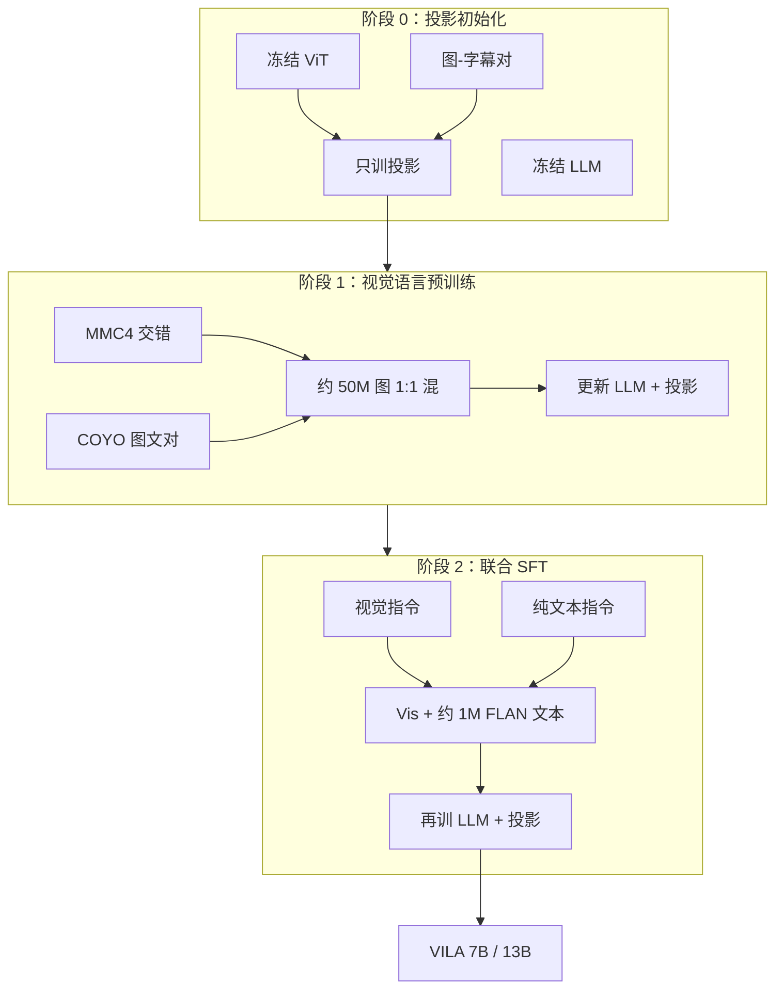

# VILA：把视觉语言预训练从「只对齐投影层」改成「解冻 LLM + 交错图文 + 纯文本指令混训」

<!-- release-date: 2023-12-12 -->

**本文依据**：`VILA: On Pre-training for Visual Language Models`，arXiv 2312.07533（页眉 `arXiv:2312.07533v4 [cs.CV] 16 May 2024`），16 页。第一作者 Ji Lin，封面编号机构 **1 = NVIDIA**、**2 = MIT**（共同一作 Hongxu Yin；Lin 脚注为 NVIDIA 实习）。封面仓库 [https://github.com/NVlabs/VILA](https://github.com/NVlabs/VILA)。盘上是 v4。首发日取 arXiv v1 的 2023-12-12，这是任务给定口径，不来自封面印刷日。封面**没有**印会议名，本文不补。文中数字均标 PDF 页码；标「外部补充」的段落不来自本文。

## 一句话

当时大家把力气花在视觉指令微调（SFT / RLHF）上，视觉语言预训练——在大规模图文上把 LLM 和视觉编码器焊在一起——几乎没人系统扫过（PDF p. 1）。VILA 用可控消融给出三条：**预训练阶段冻住 LLM 零样本还行，但少样本上下文学习（in-context learning，ICL）要解冻 LLM**；**交错图文（MMC4）比纯图文对好，拆成对会把 ICL 打掉**；**SFT 时把纯文本指令混回去，不但补回被冲掉的语言能力，视觉任务也一起涨**（PDF p. 1–2）。按这套配方训出的 VILA-7B / 13B（Llama-2 + CLIP-L 336、约 50M 图预训练、约 1M 指令），在 12 项视觉语言基准上对 LLaVA-1.5 头对头多数更好；附录里 16 节点 × 8 张 A100，7B 三阶段合计约 5.1k GPU 小时（PDF p. 6、p. 13）。

它解决的不是「再做一个更花的融合模块」，而是：**把现成 LLM 扩成 VLM 时，预训练配方比投影层形状更关键。**

## 一、矛盾：指令微调已经很热闹，预训练还是黑箱

LLM 已经会指令跟随、零样本和少样本 ICL。把视觉接进去，就能把这些能力带到看图任务上（PDF p. 1）。接法通常是：CLIP 一类视觉基础模型和 LLM 各自预训练完，再用视觉–语言联合训练对齐。作者认为当时主线几乎全在 **视觉指令微调**——SFT 或 RLHF——预训练（在大规模图文语料上做联合建模）贵、关键，却缺少可控对照（PDF p. 1）。

贯穿全文的问题因此是一句：**各种预训练设计，到底怎样改下游？** 他们固定「预训练 + SFT」管道，只改数据形态和训练协议（PDF p. 1–2）。三条发现对应后文三节：解冻 LLM、交错语料、联合 SFT。

相关工作把 VLM 分成交叉注意力（Flamingo 一类：冻 LLM，用交叉注意力灌视觉）和自回归（把图切成视觉 token，当外语拼进 LLM）（PDF p. 2、p. 9）。本文只做自回归：灵活、能吃任意交错图文，也更流行（PDF p. 2）。

## 二、全景：ViT + 线性投影 + LLM，三阶段焊上去

图 2 我能看清：左侧图被切成视觉 token 送进 LLM；作者在图注里写明三件事——更新 LLM 对 ICL 必要、交错语料帮预训练、联合 SFT 保住纯文本（PDF p. 2）。这是机制示意，不是测速曲线。

自回归 VLM 三件套：视觉编码器、LLM、中间的投影器。投影可以是一层线性，也可以是 Transformer 块（PDF p. 2）。

训练拆成三阶段（PDF p. 2）：

0. **投影初始化**：ViT 和 LLM 都冻，只在图–字幕对上训随机初始化的投影（跟 BLIP-2 / InstructBLIP / LLaVA 一类做法）。
1. **视觉语言预训练**：更新 LLM 和投影，语料是交错图文（MMC4）或图文对（COYO、LAION）。本文的主战场。
2. **视觉指令微调**：把现成视觉语言数据改成 FLAN 风格、带数据集专用提示；消融用附录 18 个数据集的内部混合，终版再混 LLaVA-1.5（PDF p. 2、p. 13）。

消融评测固定四项：OKVQA / TextVQA 报准确率，COCO / Flickr 报 CIDEr；同时看 0-shot 和 4-shot（PDF p. 2）。作者反复提醒：**这套消融协议和表 5 的公开基准协议不同，绝对数字偏低，不能拿去跟别人比**（PDF p. 3）。

上图根据 PDF p. 2 第 2 节与 p. 5–6 第 4.1 节重画，是机制示意。

## 三、要不要解冻 LLM：零样本能冻，ICL 冻不住

### 旧问题

两种接视觉的流行做法：把 LLM 在视觉 token 上微调，或冻住 LLM、只训投影当 prompt tuning。后者诱人，因为语言能力不容易被冲掉（PDF p. 2）。

### 新设计

表 1 四档（投影在 a–c 用 Transformer 块，给冻 LLM 留容量；语料 MMC4-core，因链接失效只下到 25M / 30M 图）（PDF p. 3）：

| 设置 | 预训练训 LLM | SFT 训 LLM | 投影 | 0-shot 均分 | 4-shot 均分 |
|---|---|---|---|---:|---:|
| (a) | 否 | 否 | Transformer | 13.4 | 37.5 |
| (b) | 否 | 是 | Transformer | 66.8 | 57.6 |
| (c) | 是 | 是 | Transformer | 66.8 | 68.8 |
| (d) | 是 | 是 | Linear | 68.7 | 70.9 |

（PDF p. 3 表 1）

### 工作机制

(a) 只动投影、SFT 也不动 LLM，再大容量也烂。(b) 对 (c)：预训练冻 LLM，**0-shot 均分同为 66.8，4-shot 从 68.8 掉到 57.6**；配文（COCO / Flickr）掉得更凶，因为指令数据偏 VQA，配文是分布外，冻 LLM 更不会泛化（PDF p. 3）。(d) 换成线性投影，0-shot 68.7、4-shot 70.9，略好于 Transformer 投影。作者假说：投影越简单，LLM 越被迫自己处理视觉，泛化更好（PDF p. 3）。这是假说，不是可视化证据。

**深层嵌入对齐假说。** 图 3 用视觉 / 文本嵌入的 Chamfer 距离（成对余弦，去掉模长影响）看各层对齐：(b)→(d) 深层相似度升高，表 1 的 4-shot 也升高（PDF p. 3）。作者把 ICL 解释成：深层把两种模态收进同一套表示，LLM 才能像对待外语一样对待图。

### 收益 / 边界 / 可迁移

后面实验默认：**预训练和指令微调都解冻 LLM，投影用一层线性**（PDF p. 3）。冻 LLM 省语言、零样本够用时可以冻；要 ICL 或配文这种分布外任务，必须解冻。自己做时不要只报 0-shot——表 1 里冻与不冻的 0-shot 可以一样，差别全在 4-shot。

## 四、交错语料：短字幕会把语言冲掉，拆对会把 ICL 冲掉

### 旧问题

多数 VLM 预训练用图文对（LAION、COYO），图多、花样多。Flamingo 一类则强调交错图文（MMC4、M3W）更接近纯文本语料分布（PDF p. 3–4）。作者还要 **「增强」LLM 而不是训一个只会看图的新模型**，所以纯文本能力必须保住（PDF p. 3）。

### 数据长什么样

表 2（各源抽到约 25M 张图，按 CLIP 相似度筛）（PDF p. 3）：

| 语料 | 类型 | 文本来源 | 每样本图数 | 每图 token 数 |
|---|---|---|---:|---:|
| MMC4 | 交错 | HTML | 4.0 | 122.5 |
| COYO | 图文对 | Alt-text | 1 | 22.7 |

COYO 字幕短，和 LLM 预训练文本分布差一截。图 4 是 MMC4 样例：图插在对应段之前；文本只是弱条件于图，彩色句才更依赖图（PDF p. 4）。

### 表 3：交错 vs 对

同一套预训练 + SFT，看四任务均分和 MMLU（PDF p. 4）：

| 预训练数据 | VLM 0-shot | VLM 4-shot | MMLU |
|---|---:|---:|---:|
| Llama-2（纯文本基线） | — | — | 46.0% |
| COYO | 51.1% | 50.3% | 28.8%（−17.2%） |
| MMC4-pairs | 46.4% | 44.5% | 32.4%（−13.6%） |
| MMC4 | 68.7% | 70.9% | 40.7%（−5.3%） |
| MMC4+COYO | 69.0% | 71.3% | 40.2%（−5.8%） |

COYO：灾难遗忘，MMLU 掉 17.2 个点；4-shot 甚至低于 0-shot——预训练从没见过一张以上的图，不会视觉 ICL（PDF p. 4）。MMC4：MMLU 只掉约 5.3 个点，4-shot 高于 0-shot。作者写更大基座 LLM 时掉得还会更小（引 PaLM-E，不是本表数字）（PDF p. 4）。

**是更长的文本，还是交错结构？** 把 MMC4 拆成「只留图和 CLIP 对上的那段」得到 MMC4-pairs：`<txt1><im1><txt2><txt3><im2><txt4>` 变成 `<im1><txt2>`、`<im2><txt4>`（PDF p. 4）。MMLU 掉得稍轻（更长文本），但 VLM 均分比 COYO 还差，也没有 ICL 增益。图 5：完整交错的训练损失明显低于拆对——整段文本对语言建模信息更多，模型可以「捡」和图有关的部分，而不被强迫用图去解释无关句子（PDF p. 4–5）。

混 MMC4+COYO：多样性上来，严重遗忘被按住，视觉均分再涨一点；联合 SFT 之后涨幅更大（表 4）（PDF p. 5）。

附录再改格式：把 MMC4 收成 `<im1><im2><txt1><txt2>` 而不是图文交错。按表 1 协议，0-shot 均分掉 4.4%，**4-shot 掉 37.5%**——顺序一乱，ICL 基本没了（PDF p. 8）。

### 可迁移

要 ICL，就让预训练见过「图和字在同一条序列里轮流出现」，不要只见短 alt-text。拆对、把图堆到前头再倒文字，看起来省事，表上会把少样本打穿。图文对仍有视觉多样性，和交错 **1:1 按图数混** 是终版配方（PDF p. 5）。

## 五、联合 SFT：语言能力是藏起来了，不是忘了

交错仍留下约 5 个点的 MMLU 缺口。理想补法是把 LLM 预训练用的纯文本语料加回去，但开源模型这块常不公开，也不知道怎么和视觉语料对齐规模（PDF p. 5）。

作者发现：**缺口是暂时藏住，不是忘光。** SFT 混入远小于万亿级预训练的纯文本指令就够（PDF p. 5）。具体是约 **1M** 条从 FLAN 抽的纯文本指令，叫 joint SFT（PDF p. 5）。

表 4（PDF p. 5）：

| 预训练 | SFT | VLM 0-shot | VLM 4-shot | MMLU |
|---|---|---:|---:|---:|
| Llama-2 | — | — | — | 46.0% |
| MMC4 | 仅视觉 | 68.7% | 70.9% | 40.7%（−5.3%） |
| MMC4+COYO | 仅视觉 | 69.0% | 71.3% | 40.2%（−5.8%） |
| Llama-2 | 仅文本 | — | — | 51.2% |
| MMC4 | 视觉+文本 | 71.0% | 72.1% | 51.4%（+0.2%） |
| MMC4+COYO | 视觉+文本 | 72.3% | 73.6% | 50.9%（−0.3%） |

混文本之后，MMLU 回到和「同一套文本指令微调的 Llama-2」同一档；视觉 0/4-shot 也涨。假说：文本指令抬的是通用「听话」，视觉任务也吃这一套（PDF p. 5）。COYO 的好处在联合 SFT 里更明显：短字幕造成的语言损伤被按住，视觉多样性才能满额兑现（PDF p. 5）。

**可迁移。** 多模态 SFT 不要丢掉文本指令。语言掉点先当「被视觉梯度暂时盖住」，用小规模指令数据试能不能捞回来，再决定要不要重跑预训练。

## 六、放大：336 分辨率、Llama-2 13B、50M 图、LLaVA-1.5 指令

消融默认 OpenAI CLIP-L、$224\times 224$、Llama-2 7B。终版改四件事（PDF p. 5）：

- 分辨率 $336\times 336$，给 TextVQA 这类细粒度任务更多细节。
- 骨干扩到 Llama-2 13B。
- 交错 + 图文对按图数约 1:1，合计约 **50M** 张图——小于十亿级配方，但下游已经有明显增益。
- SFT 换 LLaVA-1.5 混合（含基于指称的标注、更高质量提示）；消融附录是 18 个数据集的 FLAN 风内部混合，多数是 VQA（PDF p. 5、p. 13 表 10）。

限制写得很直：算力不够，预训练没扩到十亿图，留给以后（PDF p. 5）。

## 七、表 5：12 项基准，头对头多数超过 LLaVA-1.5

作者强调和 LLaVA-1.5 **同一套提示、同一族基座**（Vicuna-1.5 基于 Llama-2）（PDF p. 6）。带 $*$ 的格子表示训练图像在训练里见过（PDF p. 6）。下面只抄与叙事有关的格子，不是 12 列全表。

| 模型 | LLM | 分辨率 | 预训练图数 | 指令量 | VQAv2 | GQA | VizWiz | SQA-IMG | TextVQA | POPE | MME | MMBench | MMBench-CN | SEED | LLaVA-W | MM-Vet |
|---|---|---:|---|---|---:|---:|---:|---:|---:|---:|---:|---:|---:|---:|---:|---:|
| LLaVA-1.5 | Vicuna-1.5-7B | 336 | 0.6M | 0.7M | 78.5∗ | 62.0∗ | 50.0 | 66.8 | 58.2 | 85.9 | 1510.7 | 64.3 | 58.3 | 58.6 | 63.4 | 30.5 |
| LLaVA-1.5 | Vicuna-1.5-13B | 336 | 0.6M | 0.7M | 80.0∗ | 63.3∗ | 53.6 | 71.6 | 61.3 | 85.9 | 1531.3 | 67.7 | 63.6 | 61.6 | 70.7 | 35.4 |
| VILA-7B | Llama-2-7B | 336 | 50M | 1M | 79.9∗ | 62.3∗ | 57.8 | 68.2 | 64.4 | 85.5 | 1533.0 | 68.9 | 61.7 | 61.1 | 69.7 | 34.9 |
| VILA-13B | Llama-2-13B | 336 | 50M | 1M | 80.8∗ | 63.3∗ | 60.6 | 73.7 | 66.6 | 84.2 | 1570.1 | 70.3 | 64.3 | 62.8 | 73.0 | 38.8 |
| +ShareGPT4V | Llama-2-13B | 336 | 50M | 1M | 80.6∗ | 63.2∗ | 62.4 | 73.1 | 65.3 | 84.8 | 1556.5 | 70.8 | 65.4 | 61.4 | 78.4 | 45.7 |

（PDF p. 6 表 5）

要点：

- VILA-7B 在 VizWiz（57.8 vs 13B 的 53.6）和 TextVQA（64.4 vs 61.3）上超过 LLaVA-1.5-13B（PDF p. 6）。
- 视觉指令是英文，MMBench-CN 仍高于同规模 LLaVA-1.5（7B：61.7 vs 58.3；13B：64.3 vs 63.6）（PDF p. 6）。
- **不是全胜**：POPE 上 LLaVA-1.5 两档都是 85.9，VILA-7B 85.5、13B 84.2（PDF p. 6）。幻觉这列他们没有吹。
- 在 VILA-13B 的 SFT 里再加 ShareGPT4V，LLaVA-Bench 78.4、MM-Vet 45.7，表上标绿；若干 VQA 格略回落（PDF p. 6）。

图 1 雷达是同一张表的宣传画，和表 5 对得上的数字以表为准（PDF p. 1、p. 6）。

### 纯文本：7B 略亏，13B 反过来

表 6（PDF p. 6）：

| 规模 | 模型 | MMLU | BBH | DROP |
|---|---|---:|---:|---:|
| 7B | Llama-2 | 46.0% | 32.0% | 31.7% |
| 7B | Llama-2+SFT | 51.8% | 39.3% | 53.1% |
| 7B | Vicuna-1.5 | 49.8% | 36.9% | 29.2% |
| 7B | VILA | 50.8% | 38.5% | 52.7% |
| 13B | Llama-2 | 55.7% | 37.5% | 41.6% |
| 13B | Llama-2+SFT | 54.3% | 43.2% | 59.2% |
| 13B | Vicuna-1.5 | 55.8% | 38.4% | 43.6% |
| 13B | VILA | 56.0% | 44.2% | 63.6% |

没选 MT-Bench：文本指令微调不是本文重点（PDF p. 6）。7B 相对「同文本 SFT 的 Llama-2」略低，13B 三项都更高。作者怀疑小模型预训练时语言掉得更狠（再引 PaLM-E）（PDF p. 6）。注意表 4 的 Llama-2 文本 SFT MMLU 是 51.2%，表 6 是 51.8%，两套表数字不完全同一口径，分开引用，不合并。

## 八、预训练解锁的能力：多图、ICL、世界知识、视觉 CoT

SFT 仍是单图样本，预训练过交错之后，模型能跨多图推理（PDF p. 2、p. 6–7）。图 6：三张火烈鸟（3D / 卡通 / 真鸟），LLaVA-1.5 糊成「都在水里的粉鸟」，VILA 能分风格；两张粉裙女孩，LLaVA 抓表情，VILA 抓皇冠 vs 头饰（PDF p. 7）。这是个例，不是基准分。

图 7 少样本：两对图文 + 第三张图。LLaVA-1.5 第一题 OCR 不够（地铁站名），第三题把上一道的语义重复成「超现实主义」；VILA 走到印象派（PDF p. 7–8）。作者认为 LLaVA 的一点 ICL 是从纯文本 LLM 继承的，交错预训练把它做实（PDF p. 7）。

图 8：提示末尾加 「Think step-by-step」，啤酒桌按菜单算账、双份披萨价，能走出分步；作者把 CoT 归到**文本 SFT 遗传**，视觉指令里没有这类样本（PDF p. 8）。

世界知识：附录图 9 四张地标问城市，VILA 4/4，LLaVA-1.5 2/4，后者偏向东京 / 纽约（PDF p. 8、p. 13）。样本来自 GPT-4V 探路文，未经额外筛选（PDF p. 13）。

摘要还写 VILA 可部署在 Jetson Orin 做端侧 VLM（PDF p. 1）。正文没有 Orin 延迟表，只在视觉专家对比里说「参数翻倍对边缘不友好」（PDF p. 8）。

## 九、分辨率、视觉专家、LoRA：几张「别的路」

表 7（协议异于表 5，只表内比）（PDF p. 8）：

| 分辨率 | 投影 | 每图 token | OKVQA | TextVQA | COCO CIDEr |
|---|---|---:|---:|---:|---:|
| 224 | linear | 256 | 49.9% | 41.6% | 116.0 |
| 336 | linear | 576 | 49.7% | 49.8% | 117.7 |
| 336 | downsample | 144 | 49.3% | 45.6% | 115.7 |

$224\to 336$，TextVQA 41.6%→49.8%；OKVQA 几乎不动。downsample：每 $2\times 2$ token 拼成一个再线性融合，336 下只有 144 token，少于 224+linear 的 256，TextVQA 仍约 45.6% > 41.6%，但比 336+linear 低约 4 个点。作者结论：**原始分辨率比 token 数更重要**；图 token 冗余大。主结果没用压缩，留给以后（PDF p. 8）。代价：336 对应 576 token/图，算力涨，ICL 能塞的示范变少。

表 8：冻基座 LLM、另加视觉专家（CogVLM 一类，按 token 类型手写路由，不像 MoE 自动门控）。MMC4-core 上视觉专家 0-shot 67.0%、4-shot 64.8%、参数约 $1.9\times$；直接微调 71.0% / 72.1%、参数 $1\times$。专家保住纯文本前向，但 VLM 和 ICL 更差，边缘部署更肥，所以他们直接微调基座（PDF p. 8）。

表 9：7B、LoRA rank 64 vs 全参微调（PDF p. 8）：

| | VQAv2 | GQA | VizWiz | TextVQA | MMBench | LLaVA-W |
|---|---:|---:|---:|---:|---:|---:|
| LoRA ($r=64$) | 69.4 | 54.3 | 48.4 | 50.0 | 60.3 | 51.2 |
| Fine-tune | 79.9 | 62.3 | 57.8 | 64.4 | 68.9 | 69.7 |

全参全面高一截。

附录表 11：换 Vicuna-1.5-7B，预训练仍要更新 LLM（0-shot 62.6→69.1，4-shot 59.2→72.8）；终版 Llama-2-7B 与 Vicuna-7B 在 VQAv2 / GQA / VizWiz 上接近（79.9 / 62.3 / 57.8 vs 79.3 / 62.3 / 58.7）（PDF p. 13）。结论不绑死某一款聊天微调。

## 十、附录：SFT 清单、训练成本、COYO 子采样

表 10 消融 SFT：Captioning（Image Paragraph、MSR-VTT、TextCaps）、Reasoning（CLEVR、NLVR、VisualMRC）、Translation（Multi30k）、VQA（ActivityNet-QA、DocVQA、GQA、iVQA、MSRVTT-QA、MSVD-QA、OCR-VQA、ST-VQA、ViQuAE、VQAv2、Visual Dialog）共 18 个训练集，多数 VQA。终版再混 LLaVA-1.5（含 RefCOCO 一类指称）（PDF p. 13）。

训练：16 个 A100 节点、每节点 8 卡。7B 三阶段墙钟：投影初始化 4 小时、预训练 30 小时、指令微调 6 小时，合计约 **5.1k GPU 小时**，算力主要在预训练（PDF p. 13）。没有做 sample packing 或按长度聚类；作者估计优化后至少再砍 30%。$336\times 336$ 把时间拉长；若预训练用 224、后期再升分辨率（引 PaLI-X），估计还能再砍一半以上，未做（PDF p. 13）。

COYO：从 COYO-700M 按 CLIP 图文相似度排序，取最高的 25M，和 MMC4-core 实际下到的 25M 对齐（PDF p. 13）。

其余附录是定性：圈出的杯子里是水不是酒（图 10，LLaVA 答成酒）；Gemini 发布里的气动外形题（图 11）；用 「Describe the image in detail.」 给 LAION 脏字幕重写细描述，对比 BLIP-2（图 12）；公司知识 / 数动物 / 法文诗 ICL（图 13，VILA-13B）；梗图、多时段午饭、高尔夫摔倒、高速飞椅（图 14）（PDF p. 14–16）。这些是展示，不是表 5。

## 十一、相关工作与结论里他们认的边界

第 5 节把 LLM 能力主要归到大规模预训练、再用指令解锁；开源基座、对话变体、PEFT 都点到，本文从 Llama-2 基座出发（PDF p. 8–9）。VLM 两条结构、冻 vs 微调、图文对 / 交错 / 视频–文本 / 视觉定位标注，都被收成「别人做过，我们给预训练阶段一张整体消融」（PDF p. 9）。

结论三句话：吃满 LLM 学习、利用图文交错、小心把文本指令混回去；VILA 视觉任务超过当时对比的 SOTA，同时保住文本；多图、ICL、零/少样本推理看起来更强（PDF p. 9）。希望刺激预训练配方和跨模态语料收集。致谢 Bryan Catanzaro 等，以及数据准备（PDF p. 9）。

**报告没写的：** 没有十亿图缩放曲线；没有 Orin 上的延迟/功耗表；没有 RLHF；视觉编码器在预训练阶段是否解冻，正文没有单独消融（阶段 0 明确冻 ViT，阶段 1 写的是训 LLM 和投影）；超参、学习率、batch 正文几乎没有。

## 十二、可迁移启发

1. **报 VLM 不要只报 0-shot。** 冻 LLM 可以零样本持平、4-shot 崩。ICL 是预训练是否把模态焊进深层的探针。
2. **投影宁简勿繁，前提是解冻 LLM。** 线性层逼 LLM 自己消化视觉；容量全堆在投影上，深层对不齐。
3. **交错结构本身是监督，不是「更长的字幕」。** 拆对、乱序拼接都会打 ICL。
4. **图文对仍有用，但不要单独当预训练。** 短 alt-text 冲语言；和交错 1:1 混，再靠联合 SFT 把语言捞回来。
5. **多模态 SFT 留一条纯文本指令。** 语言掉点可能是藏住；百万级 FLAN 就能回到同文本 SFT 基线，视觉还涨。
6. **分辨率先于 token 数。** 高分辨率再下采样，往往好过低分辨率堆满 token。主模型为了分，可以先不压缩。
7. **边缘部署别靠「再挂一个视觉专家」凑合。** 参数近 $2\times$，VLM 和 ICL 还更差；LoRA rank 64 在他们 7B 表上远落后全参。
8. **50M 图已经能搬动 LLaVA-1.5 那档指令数据。** 作者没声称这是算力最优；明确承认没做到十亿。

## 关键词回看

- **自回归 VLM**：图 → 视觉 token → 当外语拼进 LLM，而不是交叉注意力灌中间层。
- **投影器（projector）**：ViT 嵌入到 LLM 词空间的桥；本文终版是线性层。
- **深层嵌入对齐**：越深的层里图/文表示越像，4-shot 越好。
- **交错语料（MMC4）**：HTML 文档里图和段落轮流出现，每样本约 4 图、每图约 122.5 token。
- **联合 SFT**：视觉指令 + 约 1M FLAN 文本指令一起微调。
- **ICL / 4-shot**：把示范图文放进上下文；预训练见没见过多图，这里最敏感。

## 参考资料

- 本文 PDF：`readings/_src/多模态理解与 Omni/VILA.pdf`（arXiv:2312.07533v4，16 页）
- 项目仓（封面印刷）：[https://github.com/NVlabs/VILA](https://github.com/NVlabs/VILA)
