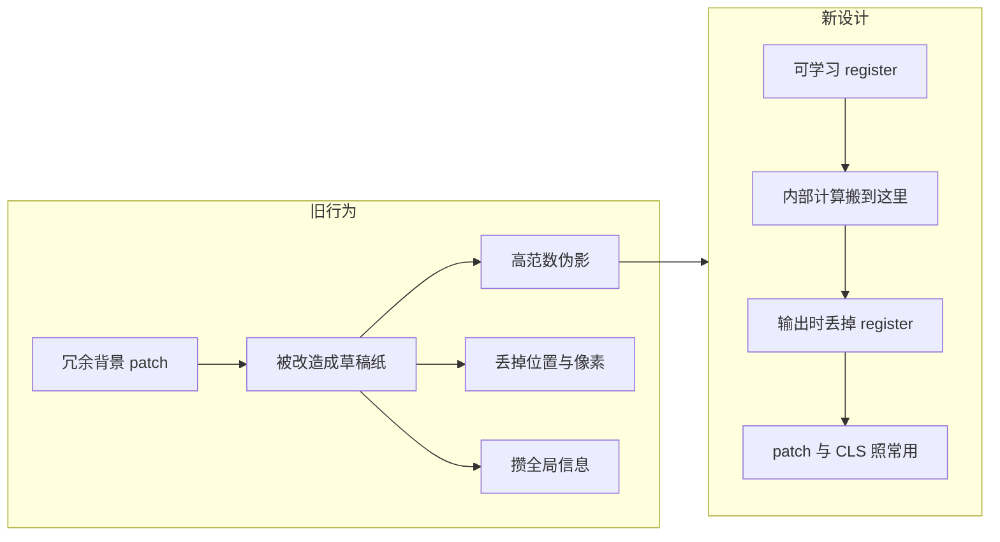

# ViT-Registers：高范数伪影是背景 token 被借去做内部计算，加 register 把这份工收走

<!-- release-date: 2023-09-28 -->

**本文依据**：`VISION TRANSFORMERS NEED REGISTERS`，arXiv 2309.16588v2（页眉 `[cs.CV] 12 Apr 2024`），21 页。作者 Timothée Darcet、Maxime Oquab、Julien Mairal、Piotr Bojanowski；封面写明 FAIR, Meta / Univ. Grenoble Alpes, Inria, CNRS, Grenoble INP, LJK（PDF p. 1）。同页写 Published as a conference paper at ICLR 2024。盘上 PDF 为 v2。首发日取 arXiv 页面 Submission history 的 `[v1] Thu, 28 Sep 2023 16:45:46 UTC`（[arxiv.org/abs/2309.16588](https://arxiv.org/abs/2309.16588) 的 Submitted on 28 Sep 2023），这是外部补充，不来自 PDF 正文。ICLR 2024 与 v2 日期不当首发日。文中数字均标 PDF 页码；标「外部补充」的段落不来自本文。DINOv2 只作为本 PDF 里被观察到伪影、又被修好的前作/对照，不把 DINOv2 本体重写成这篇。

## 一句话

现代 ViT（有监督 DeiT-III、图文 OpenCLIP、自监督 DINOv2）的注意力图上会冒出亮点：那不是物体，是一小撮 **高范数伪影 token**——大约 10 倍范数、约占序列 2%（PDF p. 2），多出现在信息少的背景。模型把这些位置从「这块像素」改造成「内部草稿纸」，丢掉局部信息、攒全局信息。作者的修法极简：在 patch 嵌入之后再塞若干与图像无关的可学习 token，叫 **register**；前向结束丢掉它们，只用 `[CLS]` 和 patch。伪影从 patch 序列里消失，稠密任务与无监督物体发现变好，注意力图重新干净（PDF p. 1、p. 9）。

## 一、矛盾：DINO 的注意力图干净，DINOv2 和有监督 ViT 却脏了

DINO 被夸的一点，是最后一层注意力会自然对准语义部件，图好看，还能喂给 LOST 这类无监督物体发现（PDF p. 2）。DINOv2 把冻结特征用到深度和分割上更强，却和 LOST 对不上：用来抽特征时，发现成绩只和有监督骨干差不多（PDF p. 2）。作者因此去看特征图，发现 **DINOv2 有伪影，DINO v1 没有**。更意外的是：把同样的观察套到 DeiT-III、OpenCLIP 上，伪影也在（PDF p. 2 图 2）。于是 DINO 反而是例外，DINOv2 更像「普通 ViT 的默认行为」。

图 2（PDF p. 2）并排 DeiT-III-B/L、OpenCLIP-B/L、DINO-B、DINOv2-g 的注意力图。读图：输入是一只坐着的狗；除 DINO-B 外，其余图在背景或狗身上散着孤立亮点。这是定性观察。全文要回答的不是「再发明一种自监督」，而是：**这些亮点是什么、何时出现、模型拿它们干什么、能不能把这份工从 patch 上搬走。**

分析主轴落在 DINOv2，修法却对三类训练都试（PDF p. 3）。

图为机制示意，根据 PDF p. 5 图 6、第 2.2 节重画，不是实测曲线。

## 二、伪影是什么：输出范数大约 10 倍、约占 2%、阈值 150 是手工切的

作者用输出 token 的 $L_2$ 范数当定量标记。图 3（PDF p. 3）左侧：同一张狗图，DINO ViT-B/16 的范数图几乎均匀深蓝；DINOv2 ViT-g/14 在背景上冒出亮斑。右侧直方图：DINO 单峰；DINOv2 双峰。正文写：多数 patch 范数在 0–100，一小部分很高；**范数大于 150 的比例测得 2.37%**（PDF p. 3）。后文把「高范数」和「outlier」当同义词。阈值 150 是对着这张分布手选的，**换模型要重选**（PDF p. 3）。引言里的「大约 10 倍、大约 2%」（PDF p. 2）是同一现象的粗口径，精确数字以图 3 为准。

图 3 直方图横轴大约到 600；读图能看到 DINOv2 在高范数一侧有第二座包，DINO 没有。这是图上的形状，不是另给的百分比。

## 三、何时出现：中层、训到约三分之一、从 ViT-L 起

对象是 40 层 DINOv2 ViT-g（PDF p. 3 图 4）。三件事：

1. **沿层**：高范数大约在第 15 层开始和其他 token 分开（PDF p. 3）。读图 4a：纵轴范数对数尺度，横轴从浅层到深层，高范数带从中段抬起。
2. **沿训练**：只在训练过了大约三分之一之后才出现（PDF p. 3）。读图 4b：横轴标了 112k、312k、512k 预训练迭代，高范数带在中段之后才明显。
3. **沿规模**：Tiny / Small / Base / Large / Huge / giant 里，**从 ViT-Large 起的三个最大模型才有 outlier**（PDF p. 3–4）。读图 4c：T、S、B 几乎没有高范数尾巴，L、H、g 有。

作者没能完全拆开「哪种训练一定出伪影」。预训练范式有关：OpenCLIP 和 DeiT-III 在 B 和 L 上都有（PDF p. 5 图 2）。规模和训练时长也有关，见图 4（PDF p. 5）。

## 四、出现在哪：和邻居太像的背景 patch

在 patch 嵌入之后、进 Transformer 之前，量高范数 token 与四邻的余弦相似。图 5a（PDF p. 4）：伪影 patch 的密度堆在相似接近 1 的一侧，普通 patch 更铺开。结论：它们落在和邻居几乎一样的格子上——信息冗余，丢掉也不太伤整图表示。这和注意力图上亮点常在均匀背景一致（PDF p. 4）。

附录图 10（PDF p. 12）还画了「某个空间位置上高范数占比」。官方 DINOv2（无抗锯齿）有竖条纹；作者自己的复现加了抗锯齿，条纹消失。某些位置超过 20% 的 token 高范数（PDF p. 12）。条纹来源：原实现把位置嵌入从 $16\times 16$ 双三次插到 $7\times 7$ 且无抗锯齿；单位梯度穿过这次插值，得到和图 10 左侧类似的条纹（PDF p. 12 图 11）。表 2a、表 3 的 DINOv2 结果一律开了抗锯齿（PDF p. 12）。第二点：outlier 更靠特征图边缘而非中心——人拍的图多是物体居中，边框常是背景（PDF p. 12）。这是作者解释，不是实验证明。

## 五、里面装了什么：局部变少，全局变多

两套线性探针，比较高范数 vs 普通 patch（PDF p. 4 图 5b）：

| 任务 | 普通 | outlier |
|---|---|---|
| 位置预测 top-1 acc | 41.7 | 22.8 |
| 位置平均距离 ↓ | 0.79 | 5.09 |
| 像素重建 L2 ↓ | 18.38 | 25.23 |

位置信息本来是绝对位置嵌入打进去的；高范数 token 几乎读不回来。像素也重建得更差。作者的话：模型在推理时丢掉了这些格子上的局部信息（PDF p. 2、p. 4）。

全局这边反过来。从 DINOv2-g 的 patch 里随机抽一个（高范数或普通），当整图表示，训逻辑回归分类。表 1（PDF p. 5）：outlier 全面高于普通 patch，不少集上接近 `[CLS]`。例如 ImageNet-1k：`[CLS]` 86.0，普通 65.8，outlier 69.0；Aircraft：87.3 / 17.1 / 79.1；Cars：91.5 / 10.8 / 85.2（PDF p. 5）。附录表 6（PDF p. 17）给了随机抽 token 的标准差，结论方向不变。

解释串起来（PDF p. 5）：**大且训够的模型会认出冗余 token，把它们当成存放、加工、取回全局信息的位置。** 行为本身不一定坏；坏在它发生在 patch 上——局部被丢掉，稠密任务可能吃亏（PDF p. 5）。

## 六、修法：给模型几张空白草稿纸

测试假设的方法：在序列末尾（相对图像）再拼若干与输入无关的 token，叫 **register**。加在 patch 嵌入之后，可学习初值，和 `[CLS]` 同类。Transformer 算完后 **丢掉 register**，训练和推理都只用 patch 与 `[CLS]`（PDF p. 5 图 6）。

这不是新发明的「输出头」。BERT 的 `[SEP]` 是送信息进去；`[CLS]`、DETR 的 object query、Perceiver 的 latent 是把输出读出来。Register **不提供新信息，输出值也不用**，只是前向过程中的寄存器（PDF p. 8–9）。最接近的前作是 NLP 的 Memory Transformer（Burtsev et al., 2020）；Sandler et al. 2022 在视觉微调里加过类似 token，但跨任务迁移不好。本篇的新观察是：**ViT 里这套机制已经自己长出来了；register 不是创造它，是把它从 patch 上隔离出来，避免误伤局部特征**（PDF p. 9）。

图 6（PDF p. 5）读图：输入 patch 进 Transformer，上方多了一排黄色 `[REG1]…[REGN]`，和 `[CLS]` 并列；输出侧只用 patch 与 `[CLS]`。机制示意。

## 七、实验：三类训练、同一处改架构

因为只改序列长度，三种配方都能套（PDF p. 6）：

- **DeiT-III**：ImageNet-22k、ViT-B、官方仓库设定（PDF p. 6）。
- **OpenCLIP**：仅含授权图文的 Shutterstock 语料、ViT-B/16；作者说明绝对精度偏低是因为数据源，不是 register 本身（PDF p. 6–7）。
- **DINOv2**：ImageNet-22k、ViT-L 配置、官方仓库（PDF p. 6）。分析用过 ViT-g，对照实验是 ViT-L，不要混。

仓库链接（PDF p. 6 脚注）：`facebookresearch/deit`、`mlfoundations/open_clip`、`facebookresearch/dinov2`。

### 范数尾巴被收走

图 7（PDF p. 6）：无 register 时三种模型输出范数都有高处散点；加了之后高范数点消失，只剩低范数一团。DINOv2 纵轴大约到 200，OpenCLIP 到 300，DeiT-III 到 1500——尺度不同，形状相同。附录图 15（PDF p. 14）更细：高范数完全落在 register 集合里，patch 不再有 outlier。Register 的范数看起来比从前的 outlier「更量子化」，作者没解释，留作未来工作（PDF p. 14）。

图 1（PDF p. 1）与附录图 19（PDF p. 19）：无 register 的注意力图有亮斑；有 register 后 DeiT-III / OpenCLIP / DINOv2 都变平滑，接近当年夸 DINO 的那种图。图 20（PDF p. 20）是特征图第一主成分（白化，色标 $[-3\sigma,+3\sigma]$）：无 register 时背景花、有 register 时物体轮廓清楚。图 21（PDF p. 21）直接画 token 范数图：无 register 时高范数斑点就是注意力上的伪影位置。

### 线性探针不掉，稠密任务略涨

表 2a，冻结特征线性评测（PDF p. 7）：

| 模型 | ImageNet Top-1 | ADE20k mIoU | NYUd rmse ↓ |
|---|---|---|---|
| DeiT-III | 84.7 | 38.9 | 0.511 |
| DeiT-III+reg | 84.7 | 39.1 | 0.512 |
| OpenCLIP | 78.2 | 26.6 | 0.702 |
| OpenCLIP+reg | 78.1 | 26.7 | 0.661 |
| DINOv2 | 84.3 | 46.6 | 0.378 |
| DINOv2+reg | 84.8 | 47.9 | 0.366 |

ImageNet 分类基本持平或略升；分割和深度在 DINOv2 上更明显（mIoU 46.6→47.9，rmse 0.378→0.366）。表 2b：OpenCLIP 零样本 ImageNet 59.9 vs 60.1（PDF p. 7）。

### 几个 register：一个就去掉亮点，四个是默认

DINOv2 ViT-L/14，register 数 0 / 1 / 2 / 4 / 8 / 16（PDF p. 7）。图 8 上排：至少 1 个，注意力亮点就消失。下排：稠密任务（分割、深度）有一个最优点，多数收益来自第一个；ImageNet 则随数量继续涨。**全文实验默认 4 个**（PDF p. 7）。

代价：多 token 会加参数和 FLOP。图 12（PDF p. 12–13）：16 个 register 时 FLOP 最多大约 +6%；**常用的 4 个低于 +2%**；参数增量可忽略（PDF p. 12）。读图是趋势，精确百分比以这段文字为准。

### 物体发现：DINOv2 的 LOST 被救回来

LOST 吃局部特征的平滑程度。现代骨干（DINOv2、有监督）上成绩差。作者在 PASCAL VOC 2007 / 2012 和 COCO 20k 上跑 corloc。DeiT 与 OpenCLIP 用 value，DINOv2 用 key；因输出特征条件不同，还手工给特征 Gram 加了 bias（PDF p. 8）。表 3（PDF p. 8）：

| 模型 | VOC 2007 | VOC 2012 | COCO 20k |
|---|---|---|---|
| DeiT-III | 11.7 | 13.1 | 10.7 |
| DeiT-III+reg | 27.1 | 32.7 | 25.1 |
| OpenCLIP | 38.8 | 44.3 | 31.0 |
| OpenCLIP+reg | 37.1 | 42.0 | 27.9 |
| DINOv2 | 35.3 | 40.2 | 26.9 |
| DINOv2+reg | 55.4 | 60.0 | 42.0 |

DINOv2+reg 在 VOC 2007 上 55.4 vs 35.3，+20.1 corloc，仍低于文献里 DINO 的 61.9（Simeoni et al.，PDF p. 8）。OpenCLIP 加 register 略差，附录 C 解释：OpenCLIP 的 outlier 对 LOST 更不敏感；value 投影似乎把 outlier 滤到了零空间，无 register 时 seed expansion 已经较平滑（PDF p. 13–14 图 13–14）。Keys/queries 上伪影仍可见，加 register 后三类都更干净。作者把 value 零空间留给未来工作。

### Register 自己在看什么

图 9（PDF p. 8）：同一张多物体图上，`[CLS]` 和若干 register 的注意力不同；有的盯不同物体，像 slot attention，但训练从未要求这种分工，是自己冒出来的（PDF p. 8）。附录图 16（PDF p. 15）：在 ImageNet-22k 随机子集上对最后一层注意力取平均。四个 register 不完全一样：有的偏边框，有的偏中心，有的略偏上。和 `[CLS]` 一样是大范围支撑，和典型 patch（很局部）不同。作者据此认为 register 也带全局信息（PDF p. 15）。Aircraft 线性探针表 4（PDF p. 14）：0 个 register 时 `[CLS]` 84.6、普通 patch 15.5、outlier 73.3；1 个 register 时 `[CLS]` 85.2、普通 14.5、register 71.1——outlier 的角色被吸进 register。表 5（PDF p. 15）：只看非 outlier 的局部探针，0 vs 4 个 register 的位置 acc 66.3 vs 65.8、重建 L2 15.9 vs 16.0，普通 patch 几乎没被改写。

## 八、对照与没写清的边界

**MAE**（附录 E，PDF p. 16）：ViT-Large MAE 的特征图前三个主成分看不到这类伪影。作者假设是因为损失只在 patch 上局部重建，没有「必须把全局聚到某处」的目标。但 MAE 线性探针 ImageNet 大约 75%（ViT-Large），不能当冻结骨干用，一般要微调（PDF p. 16）。这是对照，不是本篇方法。

**按注意力头**（附录 F，PDF p. 16 图 18）：DINOv2-L、无 register。伪影在所有头上都有，尽管各头盯物体的不同部位；有的头更爱伪影。

**没拆开的因果**：何种预训练、多长、多大，各自贡献多少，正文承认没完全确定（PDF p. 5）。OpenCLIP 的 value 零空间、register 范数量化、是否该正则 register 的分工，都标成未来工作（PDF p. 8、p. 13–14）。

## 九、可迁移启发

1. **先分清「内部计算」和「给下游的局部特征」。** ViT 的 patch 同时当像素和草稿纸时，稠密任务会中招。需要平滑特征图时，不要假设注意力亮点等于物体。
2. **Register 是隔离，不是新监督。** 空白、可学习、输出丢掉。代价是序列略长（4 个 token、FLOP +2% 量级，PDF p. 12）。能复用到任何仍走「整图 token 序列」的 ViT 预训练；不依赖某一家损失。
3. **用输出范数当探针很便宜。** 双峰、$10\times$、百分之几的高范数，比先看下游数字更能提前发现「token 被挪用」。阈值要按模型重画直方图，不要死抄 150。
4. **小模型、短训练、纯局部损失（MAE）可能根本不会长出这套机制。** 不要给 Tiny/S/B 或重建式预训练强加 register 当必选项；先看有没有高范数尾巴。
5. **物体发现、注意力可视化、把 patch 当像素用的任务，对伪影敏感；图像级分类往往不敏感。** 表 2 分类几乎不动，表 3 的 LOST 可以翻倍——选评测时要对准你真正在用的那一层特征。

## 十、关键词回看

- **高范数伪影 / outlier token**：输出 $L_2$ 远高于同伴的 patch；DINOv2-g 上用 150 切开，约占 2.37%（PDF p. 3）。
- **被回收的背景 token**：与四邻极相似、局部探针差、分类探针好——当内部寄存器用（PDF p. 4–5）。
- **Register token**：与图像无关的可学习额外 token；前向可读写，输出丢弃（PDF p. 5）。
- **LOST / corloc**：无监督物体发现；DINOv2+reg 在 VOC 2007 上 55.4 vs 35.3（PDF p. 8）。

## 参考资料

- 本文：Darcet et al., *Vision Transformers Need Registers*, arXiv:2309.16588v2, ICLR 2024。
- 前作对照（不在本篇展开）：Caron et al., DINO, ICCV 2021；Oquab et al., DINOv2, arXiv:2304.07193。
- Memory Transformer：Burtsev et al., arXiv:2006.11527, 2020。
- LOST：Siméoni et al., BMVC 2021。
