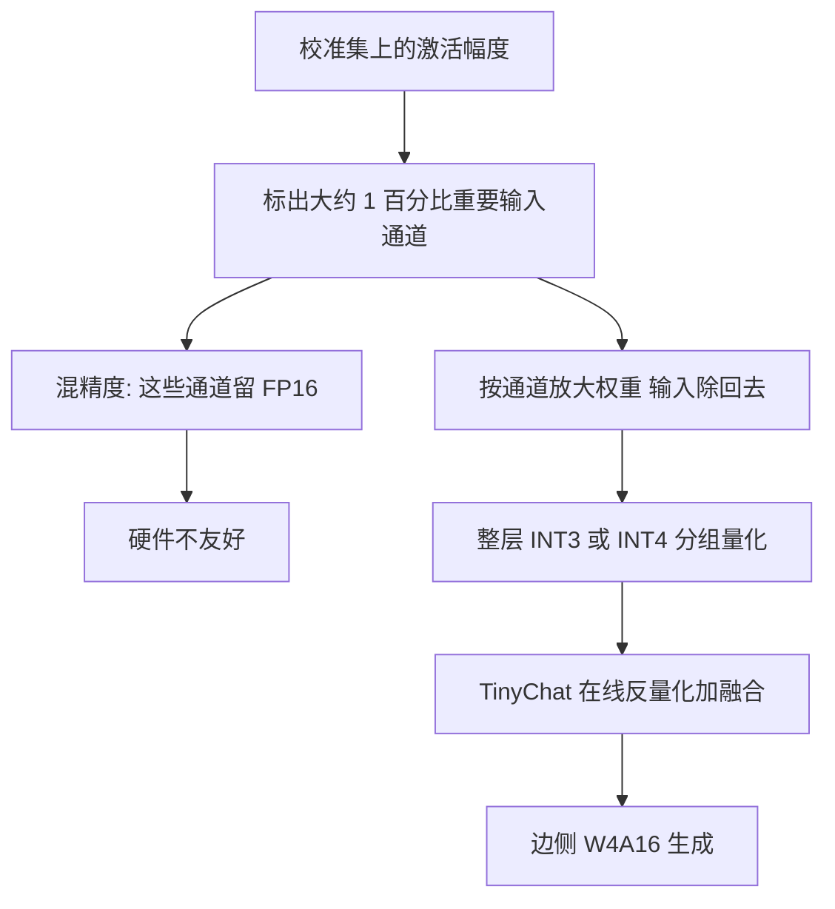

# 边侧推理不要混精度护 1% 通道，用激活统计把重要权重放大再整层量化

<!-- release-date: 2023-06-01 -->

**本文依据**：封面正式标题 **AWQ: Activation-aware Weight Quantization for LLM Compression and Acceleration**（封面另印 **On-Device**）；arXiv `2306.00978v6`（25 Apr 2026，15 页）；封面已印 MLSys 2024（*Proceedings of the 7th MLSys Conference*，Santa Clara，Best Paper Award）。作者 Ji Lin *、Jiaming Tang *、Haotian Tang †、Shang Yang †、Wei-Ming Chen、Wei-Chen Wang、Guangxuan Xiao、Xingyu Dang、Chuang Gan、Song Han；第一单位 MIT（通讯 Song Han），合作单位含上海交通大学、NVIDIA、清华大学、MIT-IBM Watson AI Lab、UMass Amherst。代码仓库 `mit-han-lab/llm-awq`。本地读的是 v6 PDF；`release-date` 取 arXiv v1 提交日 2023-06-01。文中数字紧跟 `(PDF p. N)`；标「外部补充」的段落不来自本文。

## 一句话

边侧跑大模型，卡的是显存和带宽，不是算力。低比特只压权重（**W4A16**）理论上能把权重大约压到四分之一，但朴素就近取整（**Round-to-Nearest，RTN**）会把少数「真正干活」的通道一起压坏。AWQ 的观察是：重要的不是权重大的通道，而是**输入激活幅度大**的通道；只护住大约 **0.1%–1%** 就能把量化损失压下来。混精度把这 1% 留成 FP16 硬件不友好，于是改成**等价变换**：把这些通道放大、输入对应缩小，再整层量化。校准只离线看激活统计，不做反传、不做 GPTQ 那种重建，所以不容易过拟合校准集。配套系统 **TinyChat** 把理论省下来的带宽变成实测加速：相对 Hugging Face FP16，桌面与移动 GPU 上平均大约 **3.2–3.3×**（摘要写 **3×** 以上）。

## 一、矛盾：边侧要 4 bit 权重，但不能靠混精度护那 1%

边侧部署要离线、要隐私、要少付云端账单。问题是模型太大：GPT-3 有 175B 参数，FP16 大约 **350GB**，当时最新的 B200 也只有 **192GB**，边侧更谈不上（PDF p.1）。

量化感知训练（QAT）对 LLM 太贵。训练后量化（PTQ）在低比特上掉精度。最接近的工作是 GPTQ：用二阶信息做误差补偿，但重建会贴校准集，出分布域上特征会变形（图 8，PDF p.2、p.10）。LLM 是通才模型，过拟合校准集特别伤。

另一条路是混精度：把少数重要权重留 FP16。图 2 在 OPT-6.7B、INT3-g128 上把困惑度从 RTN 的 43.2 拉到护 1% FP16 的 13.0（PDF p.3）；**同设定的表 1 是 RTN 23.54、按激活留 1% 为 11.39**（PDF p.4）。图是示意，以表为准。硬件却讨厌这种格式：访存不规则、kernel 难写。全文问题因此不是「再找一种重建」，而是：

> 能不能按激活找出重要通道，用缩放而不是混精度把它们护住，并且校准不过拟合？

图按 PDF p.3 图 2 重画，是机制示意。困惑度数字见该图与表 1，不是这张流程图里的实测时间。

## 二、为什么看激活不看权重：大激活对应的通道才是「干活的」

量化把浮点映到低比特整数。本文做**只压权重**（W4A16 一类），激活仍用 FP16。理由在第 4 节：边侧生成是访存瓶颈，权重量远大于激活量（PDF p.5）。

关键观察：权重并非同等重要。大约 **0.1%–1%** 的显著权重跳过量化，损失会小很多（表 1，PDF p.4）。怎么挑？

按权重幅度或 $L_2$ 范数挑，效果接近随机。按**激活幅度**挑，哪怕只留 0.1%–1% 通道为 FP16，WikiText 困惑度也会掉下来。作者的假设是：输入特征幅度大，通常更重要；对应权重留高精度，等于把这些特征保住（PDF p.3）。

表 1（INT3、组大小 128，WikiText 困惑度越低越好，PDF p.4）：

| 模型 | FP16 | RTN | 按激活留 0.1% / 1% / 3% | 按权重留 0.1% / 1% / 3% | 随机 0.1% / 1% / 3% |
|---|---:|---:|---:|---:|---:|
| OPT-1.3B | 14.62 | 119.00 | 25.03 / 16.91 / 16.68 | 108.71 / 98.55 / 98.08 | 119.76 / 109.38 / 61.49 |
| OPT-6.7B | 10.86 | 23.54 | 11.58 / 11.39 / 11.36 | 23.41 / 22.37 / 22.45 | 23.54 / 24.23 / 24.22 |
| OPT-13B | 10.13 | 46.04 | 10.51 / 10.43 / 10.42 | 46.07 / 48.96 / 54.49 | 44.87 / 42.00 / 39.71 |

OPT-6.7B 上，按激活留 1% 已经到 11.39，接近 FP16 的 10.86；按权重留 1% 还是 22.37，几乎等于 RTN。混精度的总比特几乎不涨，但实现难，所以下一节改缩放。

**可迁移**：只压权重时，通道重要性跟输入统计走，不跟权重大小走。剪枝文献里「大切权重要」这条，在 LLM 权重量化上直接套会选错通道。

## 三、等价变换：放大显著通道，相对量化误差变小

分组量化写成（PDF p.4 式 1）：

$$
Q(w)=\Delta\cdot\mathrm{Round}\Bigl(\frac{w}{\Delta}\Bigr),\qquad \Delta=\frac{\max(|w|)}{2^{N}-1}
$$

$N$ 是比特数，$\Delta$ 由该组绝对值最大值决定。对某个权重乘 $s>1$，输入除 $s$，得到 $Q(w\cdot s)(x/s)$（式 2，PDF p.4）。作者经验上三条：

1. 舍入误差期望差不多不变，大约在 $[0,0.5]$ 上均匀，均值约 0.25。
2. 只放大组里少数元素，通常不改组内最大值，于是新的 $\Delta'\approx\Delta$。
3. $\Delta$ 和 $x$ 仍是 FP16，本身没有量化误差。

于是相对误差大约变成原来的 $\frac{\Delta'}{\Delta}\cdot\frac{1}{s}$。只要 $\Delta'\approx\Delta$ 且 $s>1$，显著通道的相对误差就变小。

表 2 把 OPT-6.7B 的 1% 显著通道乘 $s$（PDF p.4）：

| $s$ | 1 | 1.25 | 1.5 | 2 | 4 |
|---|---:|---:|---:|---:|---:|
| $\Delta$ 改变的比例 | 0% | 2.8% | 4.4% | 8.2% | 21.2% |
| Wiki-2 PPL | 23.54 | 12.87 | 12.48 | 11.92 | 12.36 |

$s=2$ 时困惑度最好（11.92）。再大，$s=4$ 时 21.2% 的组 $\Delta$ 变了，非显著通道的误差被放大，整体反而变差。所以不能无脑把显著通道拉到最大。

搜索目标（式 4，PDF p.5）：找每输入通道的缩放 $s$，让量化后该层输出尽量接近原输出：

$$
s^{*}=\arg\min_{s}\bigl\|Q(W\cdot\mathrm{diag}(s))(\mathrm{diag}(s)^{-1}\cdot X)-WX\bigr\|
$$

$Q$ 是分组量化（例如 INT3/INT4、组 128），$X$ 来自很小的校准集。$s^{-1}\cdot X$ 通常能融进前一层（与 SmoothQuant / Outlier Suppression 同一类融合，PDF p.5）。量化不可微，反传不稳，于是把搜索空间压成（式 5）：

$$
s=s_{X}^{\alpha},\qquad \alpha^{*}=\arg\min_{\alpha} L(s_{X}^{\alpha})
$$

$s_X$ 是每通道激活平均幅度；$\alpha\in[0,1]$ 网格搜索（文中网格大小 **20**，PDF p.7）。$\alpha=0$ 不缩放，$\alpha=1$ 最猛。另外再做权重量化的 MSE 裁剪。

表 3（3-bit、组 128，PDF p.4）说明缩放能追上混精度、又不必混精度：

| 设置 | OPT-1.3B | 2.7B | 6.7B | 13B | 30B |
|---|---:|---:|---:|---:|---:|
| FP16 | 14.62 | 12.47 | 10.86 | 10.13 | 9.56 |
| RTN | 119.47 | 298.00 | 23.54 | 46.04 | 18.80 |
| 1% FP16 | 16.91 | 13.69 | 11.39 | 10.43 | 9.85 |
| $s=2$ | 18.63 | 14.94 | 11.92 | 10.80 | 10.32 |
| AWQ | 16.32 | 13.58 | 11.39 | 10.56 | 9.77 |

校准只统计每通道平均幅度，不回归、不反传，对校准集依赖小，不容易过拟合（图 8，PDF p.5、p.10）。

**可迁移**：护重要通道时，先问「硬件能不能混精度」。不能就做功能不变的缩放，并显式权衡非显著通道；$\alpha$ 用一层输出误差网格搜，不必上 STE。

## 四、为什么边侧该压权重不压激活：生成阶段被带宽卡住

第 4 节用 Llama-2-7B 在 RTX 4090、batch 1、FasterTransformer FP16 做剖析（图 3，PDF p.5）：

- 生成 20 个 token 大约 **310 ms**；读 200 token 的上下文只要大约 **10 ms**。交互场景里生成才是慢的那截。
- 4090 峰值大约 165 TFLOPS、带宽 1 TB/s，算术强度低于 165 就是访存瓶颈。边侧生成在 FP16 下算术强度大约 **1**。
- 权重量化到 4 bit，算术强度大约提到 **4 FLOPs/Byte**，屋顶线大约到 **4 TFLOPS**（W4A16）。
- 图 3(c)：权重量比激活量大几个数量级（文中标了大约 79×、1700× 量级的对比）。所以边侧优先压权重。

W8A8（如 SmoothQuant）存储和计算同精度，反量化可以放在 epilogue。W4A16 访存是 INT4、计算是 FP16，反量化必须进主循环，否则理论 4× 变不成墙上时钟。TinyChat 就是补这一截：PyTorch 前端 + CUDA/PTX、Neon、AVX 后端（PDF p.5）。

实现三件套（PDF p.6）：

1. **在线反量化并与 GEMM/GEMV 融合**，反量化后的权重不写回 DRAM。
2. **平台相关打包**：ARM 128-bit SIMD 上把 32 个 4-bit 排成 $w_0,w_{16},\ldots$，三条 SIMD 指令解开，而不是每个权重三条标量指令；文称最多大约 **1.2×**。GPU 上按 $w_{\{0,2,4,6,1,3,5,7\}}$ 打包。
3. **算子融合**：LayerNorm、QKV、位置编码、KV 更新。4090 上单个 FP16 kernel 大约 **0.01 ms** 量级，和 launch 开销同阶，少 launch 就是加速。CPU 上整图降到 C++。

**可迁移**：边侧 batch=1 生成是权重搬运戏。W4A16 的收益在 kernel 里把反量化吃掉；只改存储格式、计算仍走未融合路径，加速比会瘦一圈。

## 五、精度实验：语言、指令、多模态、代码和数学

设置（PDF p.7）：分组大小默认 **128**；主战场 INT4/INT3；校准从 Pile 抽一小份，避免贴下游；$\alpha$ 网格 20。主指标 WikiText-2 困惑度。基线是 RTN 和 GPTQ（含重排 GPTQ-R）。

### LLaMA / Llama-2（表 4，PDF p.7）

INT3-g128 上 AWQ 全面低于 RTN 和 GPTQ。摘几格：

| 模型 | FP16 | RTN | GPTQ | GPTQ-R | AWQ |
|---|---:|---:|---:|---:|---:|
| Llama-2-7B | 5.47 | 6.66 | 6.43 | 6.42 | 6.24 |
| Llama-2-13B | 4.88 | 5.52 | 5.48 | 5.41 | 5.32 |
| Llama-2-70B | 3.32 | 3.98 | 3.88 | 3.86 | 3.74 |
| LLaMA-7B | 5.68 | 7.01 | 8.81 | 6.53 | 6.35 |
| LLaMA-65B | 3.53 | 4.24 | 4.17 | 4.21 | 3.95 |

INT4-g128 上差距更小，AWQ 仍最好一档（Llama-2-7B：5.60 vs RTN 5.73、GPTQ 5.69）。LLaMA-7B 上 GPTQ 无重排会到 8.81，比 RTN 还差，文中也点过部分模型需要重排技巧（PDF p.2）。

### Mistral / Mixtral（表 5，PDF p.7）

WikiText：Mixtral-8x7B FP16 5.94、INT4-g128 6.05、INT3-g128 6.52；Mistral-7B-Instruct-v0.2 为 4.14 / 4.30 / 4.83。作者用这张表说明 GQA 和 MoE 也能压。注意表 5 只给了 AWQ 后的数，没有并排 RTN。

### 指令模型 Vicuna（图 5，PDF p.7）

INT3-g128，对 80 题用 GPT-4 相对 FP16 打分，两种顺序各跑以消位置偏差，共 160 次。AWQ 的胜场多于 RTN 和 GPTQ（7B 与 13B 都如此）。柱状图数字是示意图，正文没有把 win/tie/lose 收成一张精确表。

### 视觉语言模型

OpenFlamingo-9B，只量化语言部分（表 6，PDF p.8）。COCO CIDEr，32-shot：

| 设置 | FP16 | RTN | GPTQ | AWQ | 相对 FP16（32-shot） |
|---|---:|---:|---:|---:|---:|
| INT4-g128 | 81.70 | 77.13 | 74.98 | 80.53 | AWQ −1.17；RTN −4.57；GPTQ −6.72 |
| INT3-g128 | 81.70 | 64.79 | 64.77 | 74.47 | AWQ −7.23；RTN/GPTQ 约 −16.9 |

INT4 下 AWQ 把 32-shot 落差从 4.57 收到 1.17，模型体积大约 4× 缩小。GPTQ 在这条多模态、in-context 设定上比 RTN 还差，符合「重建过拟合校准集」的叙事。

VILA-7B/13B、INT4-g128、11 个视觉语言榜（表 7，PDF p.8）：作者称接近无损。例如 VILA-7B VQAv2 80.3 → 80.1，MME 1489.4 → 1486.3；VILA-13B VQAv2 80.5 → 80.4。VizWiz 上 7B 从 59.6 到 57.8，并非每一格都持平。

图 6、图 7 是定性例子：LLaVA-13B 解释梗图时 RTN 会认错食物/地球关系；OpenFlamingo 4-shot 字幕 RTN 会把玩具飞机写成天上的真飞机（PDF p.9）。

### 代码与数学（表 8，PDF p.8）

INT4-g128：CodeLlama-7B-Instruct 在 MBPP，pass@1 为 FP16 38.53、RTN 37.51、GPTQ 31.97、AWQ **40.64**（略高于 FP16）；pass@10 为 49.77 / 48.49 / 44.75 / 49.25。Llama-2 在 GSM8K：7B 13.87 → AWQ 13.57；13B 26.16 → 25.25；70B 56.41 → 56.40。GPTQ 在 MBPP 掉得明显。

### 极低比特与 GPTQ 正交（表 9，PDF p.9）

INT2-g64 上 RTN 崩溃（OPT-1.3B 困惑度上万）。GPTQ 能救一截；AWQ+GPTQ 再收：OPT-1.3B 46.67 → 35.71；6.7B 16.65 → 15.71；13B 16.74 → 13.25。作者明确说缩放和 GPTQ 的重建可以叠。

### 校准数据效率（图 8，PDF p.10）

OPT-6.7B、INT3-g128：AWQ 用大约 **10×** 更小的校准集就能好过 GPTQ（16 条 vs 192 条序列，每条 ×2048 token）。换分布：PubMed 校准、Enron 评估，GPTQ 困惑度差 **+4.89**，AWQ 只 **+0.50**；反过来 Enron→PubMed 为 GPTQ +2.33、AWQ +0.60。同分布校准仍最好，但 AWQ 换域掉得少。

## 六、TinyChat：理论 4× 带宽变成墙上的 3×

评测：batch 1，提示 4 token，生成 200 token，取中位延迟；协议对齐 exllama（PDF p.10–11）。

图 9 文字结论（PDF p.10）：

- 相对 Hugging Face FP16，4090 上 Llama-2 / MPT / Falcon 大约 **2.7–3.9×**；Orin 最高大约 **3.5×**。
- Llama-2-7B：FP16 融合把 52 token/s 提到 62；再加 4-bit 线性核大约再 **3.1×**。
- Falcon-7B 官方实现当时 KV cache 不正确，FP16 侧融合收益大约 **1.6×**。
- 8GB 的 4070 笔记本能跑 Llama-2-13B 大约 **33 token/s**；FP16 连 7B 都装不下。
- 正文另写：桌面/笔记本/移动 GPU 上相对 HF FP16 平均 **3.2–3.3×**；Jetson Orin 64GB 可跑 Llama-2-70B；笔记本 4070 上 13B 交互大约 **30 token/s**（PDF p.2）。摘要取「3× 以上」。结论再写 **3.2–3.3×**（PDF p.11）。

表 10（PDF p.10），吞吐 token/s：

| 模型 | 精度 | A100 | 4090 | Orin |
|---|---|---:|---:|---:|
| VILA-7B | FP16 | 81.6 | 58.5 | 11.5 |
| VILA-7B-AWQ | W4A16 | 155.3 | 168.1 | 35.6 |
| VILA-13B | FP16 | 48.5 | OOM | 6.1 |
| VILA-13B-AWQ | W4A16 | 102.1 | 99.0 | 17.5 |

Orin 上两档都大约 **3×**（35.6/11.5、17.5/6.1）；文称 VILA-7B 最高约 **3.1×**、13B 约 **2.9×**。4090 上 7B 从 58.5 到 168.1，加速比更大，因为 FP16 基线也吃带宽。

图 10（PDF p.11）：Orin 64G 上相对已有 4-bit 系统，Llama 系列大约 **1.2–3.0×**；相对同样能跑多模型的 AutoGPTQ 至少 **2.6×**；相对 llama.cpp 最高约 **1.7×**。Raspberry Pi 4B 上 7B 大约 **0.7 token/s**。llama.cpp / exllama 当时主要跟 LLaMA 家族；TinyChat 还跑 StarCoder、StableCode、Mistral、Falcon。

图 1 还写了一台 TinyChat 电脑：Jetson Orin Nano，**8GB** 内存、**15W**（PDF p.1）。工业采纳名单（HF Transformers、TensorRT-LLM、vLLM、LMDeploy 等，以及 Falcon-180B 单卡 H200）写在引言末尾（PDF p.2），是作者声称，不是本 PDF 的测速表。

## 七、局限、没写清的，以及可以带走的原则

作者自己划的边界和实验缺口：

- 主设定是**只压权重**的边侧生成，不是服务端大 batch 的 W8A8 或 W4A4KV4。图 3 的屋顶线按 batch 1 讲。
- 校准仍需要一份预训练域文本（Pile）；只是比 GPTQ 更省、更抗换域，不是零数据。
- INT2 要叠 GPTQ 才比较能看；单独缩放不是极低比特的完整解（表 9）。
- 表 5 的 Mistral/Mixtral 没有对照列；Vicuna 的 GPT-4 评判是 80 题小样本。
- OpenFlamingo 只量化语言模型部分；视觉塔仍 FP16。
- TinyChat 测速是短提示（4 token）加 200 个生成 token，不是长上下文预填。Falcon 的 FP16 基线被错误 KV 实现拖慢，加速比不要直接和其他模型比。
- 15 页正文没有附录配方：学习率、多卡服务、与 QAT 的联合训练都没写。

可迁移、不绑死 INT4 边侧：

1. **通道重要性跟激活走。** 按权重大小挑显著通道，表 1 里几乎等于随机。
2. **能缩放就不要混精度。** 放大显著通道降低相对误差；$\alpha$ 要管非显著通道，否则 $s$ 太大整体变差。
3. **校准只取统计量，少做重建。** 通才模型和跨模态最怕贴校准集；GPTQ 在 OpenFlamingo 32-shot 上掉得比 RTN 还多。
4. **边侧生成先压权重。** 算术强度大约 1 时，4-bit 权重直接抬屋顶线；收益要靠融合反量化才能从纸面走到 GPU。
5. **缩放和重建可以正交。** 极低比特把 AWQ 的尺度先定住，再交给 GPTQ。

## 关键词回看

- **W4A16**：4-bit 权重、16-bit 激活；边侧生成的主设定。
- **显著通道**：激活幅度大的输入通道，大约 0.1%–1%；不是权重大的通道。
- **AWQ**：用 $s=s_X^{\alpha}$ 做等价缩放后再分组量化，网格搜 $\alpha$，无反传。
- **RTN / GPTQ**：就近取整；二阶重建。后者更准但更易过拟合校准集。
- **TinyChat**：在线反量化、SIMD/GPU 打包、算子融合，把大约 4× 的权重访存下降变成大约 3× 的生成速度。
