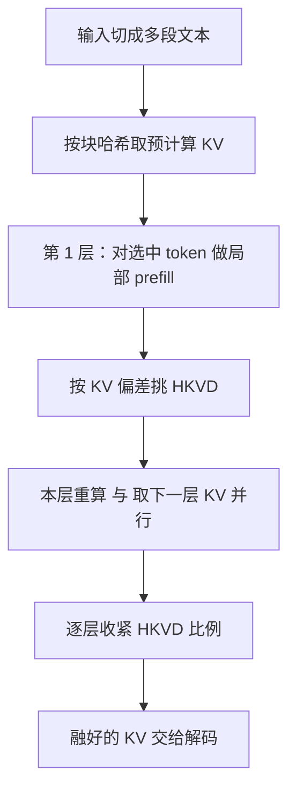

# CacheBlend：RAG 多段 KV 不能直接拼，只重算交叉注意里那一小撮

<!-- release-date: 2024-05-26 -->

**本文依据**：`CacheBlend: Fast Large Language Model Serving for RAG with Cached Knowledge Fusion`，arXiv 2405.16444v3（2025-04-03，16 页）。封面已印 *EuroSys ’25*（March 30–April 3, 2025, Rotterdam）。作者 Jiayi Yao 等；第一作者单位 University of Chicago / CUHK Shenzhen（其余作者含 University of Chicago、Stanford University、Microsoft Research / University of Chicago）。代码 `https://github.com/LMCache/LMCache`。首发日取 arXiv v1 提交日 2024-05-26；本地读的是 v3 / EuroSys 2025 印本。文中数字标 `(PDF p. N)`；标「外部补充」的段落不来自本文。

## 一句话

RAG 的输入是「多段检索文本 + 用户问题」，每段都可以单独预计算 KV，但拼起来时后面的段看不到前面的段，**交叉注意力（cross-attention）** 丢失。Prefix caching 只能复用第一段；整段复用（PromptCache 一类）快但答错。CacheBlend 把各段预计算 KV 拿回来，每层只重算一小撮 **高 KV 偏差 token（HKVD）**，再把重算与从磁盘取下一层 KV 流水线化。相对完整 prefill，TTFT 降 2.2–3.3 倍、吞吐升 2.8–5 倍，质量几乎不掉（PDF p.1、p.12）。相对 prefix caching，正文第 1 节也写同一组倍数（PDF p.2）；评测 takeaway 把吞吐写成相对完整重算最高 5 倍、相对 prefix 3.3 倍（PDF p.10），以图 14 与第 7.2 节 2.8–5 倍为准。

## 一、矛盾：能复用的 KV 常常不在前缀

LLM 先 **prefill**：整段输入走完，得到每层每个 token 的 key / value，拼成 KV cache，再自回归解码。Prefill 决定 **首 token 时延（TTFT）**。四千 token 的典型 RAG 上下文，Llama-34B / Llama-70B 在单卡 A40 上分别要约 3 秒 / 6 秒（PDF p.3）。去掉 prefill 甚至能让吞吐翻倍——这是 DistServe 一类工作已经说过的（PDF p.3）。

同一段知识文本会反复出现在不同问题前面，于是可以事先算好 KV、下次直接用。现有两条路都卡在 RAG 的形状上（PDF p.2 图 1）：

| 路子 | 做什么 | 卡在哪 |
|---|---|---|
| 完整重算 | 每次对整段输入 prefill | 正确，但超线性变慢（PDF p.2） |
| Prefix caching（vLLM、SGLang、RAGCache） | 只复用**前缀**的 KV | 前缀与后面无关，质量等于完整重算；RAG 往往拼多段，只有第一段是前缀，其余仍要算（PDF p.2–3） |
| 完整 KV 复用（PromptCache） | 各段独立预计算，靠位置缓冲拼起来 | 位置可以调，但 **段与段之间的交叉注意力从未算过**（PDF p.2、p.4） |

全文只攻一个问题：**输入里有多段可复用文本时，怎样很快把各自预计算的 KV 融成一份，质量接近完整 prefill。**（PDF p.2）

### 为什么必须多段

公司内部问答：「IT 部门谁在全员会上提议用 RAG 增强客服 X」要同时看员工名单、客服文档、会议纪要；Arxiv 摘要应用要同时读几篇相关论文。这些上下文平时不会写在同一段里，只在某个问题下才并排出现（PDF p.3）。

在 Musique、2WikiMQA 上按 Langchain 切 128 token 块、SentenceTransformers 取 top-k：F1 随相关块数明显上升，块太多又会掉进 **lost-in-the-middle**（PDF p.4 图 2）。Prefix caching 只能省第一块，块越多越接近「几乎没省」。

Langchain 的 MapReduce / Rerank 把每块单独当前缀，prefix caching 好用，但 MapReduce 要先摘要每一块再合成，慢；Rerank 各块独立打分，多块互补时质量差。正文默认用「全部塞进一次输入」（stuff 模式），并在第 7 节对照这两种（PDF p.3 脚注 1、p.12）。

### 为什么不能整段拼

图 3 的玩具：两段分别写梅西、C 罗世界杯进球，问谁多。完整 prefill 对；把两段 KV 拼上再生成会跑题（PDF p.4）。图 4 把注意力矩阵摊开：完整 prefill 的黄框是块间交叉注意；完整复用那里是空的，右侧 **前向注意力矩阵**（最后几个 token 对全文的注意，直接决定下一个词）跟着偏掉（PDF p.5）。

PromptCache 的主场景是提示模板，块间交叉本来就弱，拼起来没事。多跳问答里块越多、互相引用越多，图 2 里完整重算与完整复用的 F1 差距越大（PDF p.4）。

RoPE 下，把一段 KV 挪到新位置只需把 key 乘一次旋转矩阵，开销可忽略；正文把 $n$ 维情况写在附录 A（PDF p.6 脚注 3、p.16）。**位置能修，交叉注意修不了。**

## 二、选择重算：只更新偏差大的那一小撮

目标（非正式，PDF p.5）：尽快把预计算 KV 改成新 KV，使每层前向注意力相对完整 prefill 的偏差尽量小。

记号（表 1，PDF p.5）：

- $KV^{\mathrm{full}}$ / $KV^{\mathrm{pre}}$ / $KV^{\mathrm{new}}$：完整重算、预计算、CacheBlend 更新后的 cache。
- 层 $i$、token $j$ 上的 **KV 偏差** $\Delta_{\mathrm{kv}}(KV_i, KV_i^{\mathrm{full}})[j]$：该位置相对完整 prefill 的绝对差，用来点名该重算谁。
- **注意力偏差** $\Delta_{\mathrm{attn}}(A_i, A_i^{\mathrm{full}})$：前向注意力矩阵差的 L2，衡量「生成会不会跑偏」。

（机制示意，根据 PDF p.6 图 5、p.7 图 9、p.9 图 11。）

### 一层里怎么「跳过」token

默认 prefill 不能跳 token。CacheBlend 每层（PDF p.5–6 图 5）：

1. 用 mask 把本层输入收成选中的那一小撮 token。
2. 只对它们算 $Q$、$K$、$V$。
3. 把未选中位置的 $K$、$V$ 用预计算填回去，注意力矩阵仍覆盖「选中 token × 全部历史」。
4. 照常过注意力模块，得到下一层输入。

计算量大约正比于选中比例 $r\%$：重算 10% token，大约是完整 prefill 的 10%（PDF p.6）。不绑死某一家 Transformer，第 6 节接到 vLLM。

### 洞察 1：先重算 KV 偏差最大的

图 6 在 Musique 上对 Mistral-7B、Yi-34B、Llama-70B：按 KV 偏差从高到低重算 $r\%$ token，注意力偏差随 $r$ 下降，**最大跌幅出在最先那几个高偏差 token**（PDF p.6）。这些位置叫 **HKVD（High-KV-Deviation）**。

10%–20% 通常就够把注意力偏差和生成质量拉回来（PDF p.6）。解释是注意力稀疏：高交叉注意只发生在少数 token 之间。图 7 一层上的 KV 偏差分布：大约 10%–15% 的 token 明显高于其余（PDF p.6–7）。交叉注意本来就低的位置，预计算与完整 prefill 几乎一样，不必动。

### 洞察 2：邻层 HKVD 高度相关，可以逐层过滤

真要算 $\Delta_{\mathrm{kv}}$ 需要 $KV^{\mathrm{full}}$，等于没省。图 8 给出邻层 KV 偏差的 Spearman 秩相关：一直很高（PDF p.7）。直觉：Transformer 里 token 嵌入层间变得慢，KV 又是嵌入的线性变换，所以「谁偏得厉害」会传下去。注意矩阵本身层间仍可以差很多——相关的是 **排名**，不是矩阵长得像（PDF p.7 脚注 4）。

若只在第 1 层挑一次、后面 30 多层都只更新这批，统计上对深层不稳。于是 **逐渐收紧**（图 9，PDF p.7）：平均每层要 $r\%$ HKVD 时，第 1 层多挑一点 $r_1>r$，第 2 层只在这批里再算偏差、留下 $r_2<r_1$，依此类推。本层多出来的预计算 KV 进下一层立刻丢掉，HKVD 的显存开销可忽略（PDF p.7）。

## 三、系统：重算藏进「取 KV」的空隙

基本洞察（PDF p.7）：若一层的选择重算比把该层 KV 装进 GPU 还快，把两件事流水线化，TTFT 就不必为重算多付钱。一层的 HKVD 只依赖上一层偏差，所以 **上一层 KV 一到 GPU，本层重算就能开**；取下一层可以并行。

默认 $r=15\%$。Llama-7B、4K 上下文：一层重算约 3 ms，从 NVMe SSD 取一层约 16 ms，加载能盖住重算。Llama-70B：重算约 7 ms，取一层约 4 ms，盖不住，需要控制器把 $r$ 和存放介质一起选（PDF p.8）。

控制器两问（PDF p.8 图 10）：

1. **介质已定，选 $r$**：令 $T_{\mathrm{recompute}}(r\%,\mathrm{LLM},L)=r\%\times\mathrm{Prefill}(\mathrm{LLM},L)$（Prefill 离线 profile），$T_{\mathrm{load}}$ 等于每 token KV 体积乘 $L$ 再除介质吞吐。先取使两时延相等的 $r$，再与质量下限 $r^*$ 取 max。实践里从图 16 取 $r^*=15\%$：就算 KV 在 CPU RAM 里加载很快，也至少重算这么多，以免质量塌（PDF p.8）。
2. **$r$ 钉死（如 15%），选最便宜且 $T_{\mathrm{recompute}}\ge T_{\mathrm{load}}$ 的介质**，让加载仍能藏住重算（PDF p.8）。

KV 存储：按应用切块（RAG 里检索块 + 用户问题），块哈希对上 cache，和 vLLM 的 block hashing 同类；新块由融合器写出。满了 LRU。本文只讨论单层介质（CPU RAM 或 SSD），没做多级分层（PDF p.8）。

图 11：检索器给出文本 → 控制器问 KV 是否在、在哪 → 算出 $r$、把各层 KV 送进 GPU 队列 → 融合器按层重算 → 把融好的 cache 交给推理引擎（PDF p.9）。

实现约 3K 行 Python，基于 PyTorch 2.0，接在 vLLM 上（PDF p.9）。三个接口：`fetch_kv(text, layer_id)`、`prefill_layer`、`synchronize`。`input_dict` 里带原始层输入、是否本层选 HKVD 的 `check_flag`、以及 `HKVD_indices`。层 $i$ 的计算与层 $i{+}1$ 的加载用两线程流水线。未命中则运行时算完后 `torch.cpu()` 再后台 `torch.save()`。一百万块的哈希表约 16MB，放 CPU（PDF p.9）。

## 四、实验：质量几乎对齐完整 prefill，TTFT 和吞吐拉开

硬件：Runpod，128 GB RAM，2×A40，1TB NVMe 实测 4.8 GB/s。Mistral-7B、Yi-34B 单卡；Llama-70B 双卡。Yi-34B 与 Llama-70B 用 8-bit 权重量化（PDF p.10）。

数据：2WikiMQA 200 条、Musique 150 条（标准答案不足 5 词，prompt 追加 “Answer within 5 words.”，PDF p.10 脚注 7）；SAMSum 200 条对话摘要；MultiNews 60 条。上下文切 512 token（SAMSum 用原来的 200–400）。另造扩展集：各抽 1500 问、GPT-4 再生成 3 条相近问、共 6000 条，按 L2 取 top-6（Llama-70B 输入上限能塞下的最大块数），随机序；前 1K 因仓库空着不报（PDF p.11）。QA 用词重叠 F1，摘要用 Rouge-L。

对照：完整重算；prefix caching（SGLang 思路，RAM+SSD，**假设 RAM/SSD→GPU 零加载时延**，对 prefix 有利）；完整复用（PromptCache 的位置缓冲，不用要人手工挑块的 scaffolding）；Langchain MapReduce / MapRerank（PDF p.11）。

图 12（PDF p.10，读图）：每请求 top-6、每块 512 token。横轴 TTFT、纵轴 F1 或 Rouge-L；CacheBlend（方块）落在完整重算 / prefix（质量高、TTFT 大）的左上方，完整复用（叉）快但质量明显低。正文：相对完整重算与 prefix，F1 / Rouge-L 掉幅在 0.02 以内，TTFT 降 2.2–3.3 倍；相对完整复用更慢，质量常高出一倍以上（PDF p.12）。摘要写相对完整重算吞吐 2.8–5 倍（PDF p.1）；第 1 节把同一组倍数写在相对 prefix 上（PDF p.2）；第 7 节 takeaway 写相对完整重算最高 5 倍、相对 prefix 3.3 倍（PDF p.10）。第 7.2 节图 14 写相对所有相近质量基线吞吐 2.8–5 倍（PDF p.12）。**倍数口径不完全同一句话，以图 12 / 14 与 7.2 节为准。**

图 13，Yi-34B：相对 MapReduce，TTFT 低 2–5 倍且 F1 更高；MapRerank 有时更低 TTFT，但各块独立、质量差一截（PDF p.10、p.12）。

图 14 扩展 RAG 负载：横轴平均 QPS，纵轴 TTFT。CacheBlend 曲线低于完整重算与 prefix（含「RAM+SSD、加载时延当 0」那种）（PDF p.11–12）。Prefix 还要为同一块的不同前缀存多份 KV，总容量固定时 miss 更高（PDF p.12）。

敏感度（PDF p.11 图 15、p.12）：

- 块数、块长变化时，把 F1 损失压在 $\le 0.015$ 所需计算时间的下降比例差不多（2WikiMQA、Mistral-7B）。
- 图 16，Yi-34B：选择重算 5%–18% 时，相对完整重算 F1 / Rouge-L 损失最多 0.002；对应相对完整重算 TTFT 降 4.1–6.6 倍、相对 prefix 3.4–6.1 倍（PDF p.12）。这是质量几乎不掉时的加速，比图 12 的 2.2–3.3 倍更乐观， sweep 的 $r$ 不同。
- batch 变大时解码时延涨得比 prefill 慢，prefill 占比升高，CacheBlend 对端到端更显眼（PDF p.12）。
- 图 17：KV 在 CPU RAM 或更慢盘（图注 4 Gbps）时，TTFT 仍降、质量几乎不掉；盘越慢，CacheBlend 与完整复用的时延差越小，因为都被加载拖住（PDF p.12–13）。

第 1 节相对完整复用还写 QA 上绝对 F1 高 0.1–0.2、摘要 Rouge-L 高 0.03–0.25（PDF p.2）；评测 takeaway 写成 F1 / Rouge-L 改进 0.15 到 0.35、相对完整重算 / prefix 掉点不超过 0.01–0.03（PDF p.10）。图上没有逐点数值表，**不要把两组区间强行合成一张表**。

## 五、相关工作里它站哪

RAG 本身不解决「多块 prefill 贵」。跨请求 KV 复用大多是前缀专用；PromptCache 能换位置但交叉注意与位置编码都不稳。压缩 KV / 砍 prompt（H2O、Scissorhands、LLMLingua 等）与本文正交：块可以更短，或存更少 KV（PDF p.13）。Orca、vLLM、DistServe 是通用服务；CacheBlend 给它们加「多段上下文复用」，正文没接到 DistServe / StableGen（文中写作 StableGen，引用 [11] 实为 Sarathi），也没做跨节点共享 KV（PDF p.13）。

## 六、局限与可迁移

论文自己写的边界（PDF p.13）：

- 洞察与选 token 目前绑 **Transformer**；Mamba、Griffin 没测。
- 模型、数据、量化组合没铺开；Yi / Llama-70B 实验用了 8-bit。
- 没接到 prefill/decode 分离引擎，也没做多机 KV。
- Prefix 对照把加载时延当成 0，真实 prefix 只会更差，不是 CacheBlend 吃亏。
- 图 2 的「块越多越好」有上限（lost-in-the-middle），融合 KV 救不了检索本身塞太多。
- 默认 stuff 多块进一次前向；MapReduce 路线不是本文要加速的形状。

可迁移、不绑死 2025 年那份 vLLM 补丁的原则：

1. **多段知识的 KV 不是前缀 cache 的特例。** 能哈希复用的块经常落在中间；只加速「最长公共前缀」会把 RAG 的收益吃光。
2. **交叉注意丢了，位置编码对了也没用。** 先分清「RoPE 可乘回去」和「段间 QK 从未算过」。
3. **用 KV 偏差当在线探针，不要为融合再训一个网络。** 稀疏交叉注意意味着只重算 10%–20%（经验区间，PDF p.6）。
4. **邻层「谁偏」相关，可以逐层收名单**，不必每层对全部 token 算偏差。
5. **把重算塞进取 KV 的流水线**，才敢把 cache 放到 SSD / 更慢盘；省下来的是容量，不是幻想零时延 PCIe。
6. 实现上三接口（取层 KV、一层局部 prefill、层前同步）比「再发明一套引擎」更容易塞进现有 serving。

仓库后续把 KV 复用做成 LMCache（外部补充：项目仍在 `LMCache/LMCache`）。论文讲的是 2025 年印本里的融合算法与流水线，不代替今天引擎里的前缀缓存默认行为。
