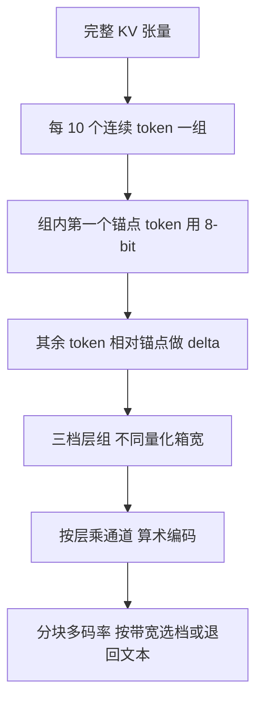

# CacheGen：KV 不必当张量传，当流式媒体压过去就行

<!-- release-date: 2023-10-11 -->

**本文依据**：`CacheGen: KV Cache Compression and Streaming for Fast Large Language Model Serving`，arXiv 2310.07240v6（2024-07-19，19 页）。封面已印 SIGCOMM ’24（August 4–August 8, 2024, Sydney）。作者 Yuhan Liu 等；第一单位 University of Chicago（封面另列 Microsoft†、Stanford*）。代码 `https://github.com/UChi-JCL/CacheGen`。首发日取 arXiv v1 提交日 2023-10-11；本地读的是 v6 / SIGCOMM 2024 印本。文中数字标 `(PDF p. N)`；标「外部补充」的段落不来自本文。ACM 引用块写 18 pages，本地 PDF 为 19 页（含未审附录），页码按本地文件。

## 一句话

长上下文要复用 KV cache，但 cache 经常不在本机 GPU 上：Llama-34B 吃一份约 8 万 token 的年报，KV 约 19 GB（PDF p.3）。跨机拉这份浮点张量，网络延迟可以从几百毫秒到十几秒。CacheGen 不把 KV 当「必须保持形状的 GPU 张量」传，而当成可编码的比特流：按相邻 token 做 delta、浅层少量化深层多量化、按层×通道做算术编码，再像视频一样分块、多码率、带宽不够就退回传文本让 GPU 重算。相对均匀量化基线，体积 3.5–4.3 倍、拉+处理延迟（TTFT）3.2–3.7 倍；相对传文本再 prefill，TTFT 3.1–4.7 倍。质量掉幅：准确率不超过 2 个点、F1 不到 0.1%、困惑度不到 0.1（PDF p.1、p.9）。

## 一、矛盾：算力墙拆了，网络墙还在

Transformer 生成分两段（PDF p.2）。**Prefill**：整段输入过一遍注意力，每层写出 key / value 张量，合称 **KV cache**。**Decoding**：用这份 cache 自回归往外吐 token。Prefill 算力随长度超线性涨；3K 上下文仍要约 2 秒（PDF p.1）。在吐出第一个输出 token 之前什么都给不了用户，这段时间叫 **Time-to-First-Token（TTFT，首 token 时延）**。本文只打 TTFT，不改解码过程（PDF p.2–3）。

复用同一段上下文（财报、法规、会话历史）时，把 KV 留下、下次跳过 prefill，这条路 Prompt Cache、vLLM 一类系统已经走通。前提是：**下次请求来时，这份 KV 还在本机 GPU 里**（PDF p.3）。实践里经常不在：

- GPU 显存装不下很多份长上下文 KV，会话隔几小时，cache 会被挤走。
- 更长窗口让「专门存 KV 的存储机」比堆在 CPU/GPU 上更现实。
- 两次请求不一定打到同一张卡，KV 要跨机搬。

NVLink 几百 Gbps 时，搬 KV 几乎免费。普通云机互联常是个位数 Gbps：传 KV 的时间可以赶上甚至超过「干脆从文本再 prefill 一遍」（PDF p.4 图 2）。于是出现图 2 的三角：

| 加载方式 | 网上传什么 | 算力侧 | 卡在哪 |
|---|---|---|---|
| 传文本 | 小 | 整段 prefill | 算得慢（PDF p.3 图 2a） |
| 传完整 KV 张量 | 极大 | 几乎不算 | 传得慢（图 2b） |
| CacheGen | 压缩比特流，带宽极差时退回文本 | 解码 + 必要时重算 | 要为「传」而不是「驻留 GPU」重新设计编码（图 2c） |

H2O、LLMLingua、KV 量化打的是 **运行时 GPU 里的 KV 体积**：形状必须还能直接喂进注意力。CacheGen 打的是 **传输时体积**：不必保持张量形状，可以编成更密的比特流；而且可以叠在那些方法之上（PDF p.2、p.4）。

**主矛盾不是「再做一个更稀疏的注意力」或「再量化一层」，而是：跨机复用 KV 时，网络延迟成了 TTFT 的隐藏瓶颈；怎样按 KV 自己的分布把张量编成可自适应码率的流。**

## 二、三件观察：相邻像视频、浅层怕损、按层×通道编码

设计编码器前，作者用 Llama-7B / 13B 加 LongChat 里随机 100 条 9.2K–9.6K 上下文做了经验观察（PDF p.4）。他们写明：很难证明对任意模型和任意上下文都成立，只在这份负载上展示普遍性。

（机制示意，根据 PDF p.5–7 图 6、图 7。）

### 观察 1：相邻 token 的 K/V 比原值好压

同一层、同一通道上，相邻 token 的 K/V 比离得远的更像。把「原值」和「相邻 token 的差（delta）」画成分布：delta 更挤在 0 附近，方差比原值低 2.4–2.9 倍（PDF p.4–5 图 3）。直觉来自自注意力：当前 token 的 KV 是从前面所有 token 推出来的，和上一个天然相关。所以编码差、不编码绝对值。

实现上不是「每对相邻都差分」（那样难以并行），而是每 10 个连续 token 一组：组内第一个叫 **锚点 token（anchor）**，其余都相对这个锚点做 delta。类比视频的 GOP，但参考帧固定，压缩和解压都能并行（PDF p.6 图 6）。

### 观察 2：浅层 KV 更怕量化

把 KV 按层分组、对某一组做 rounding 损失，看下游准确率：损浅层掉得狠，损深层几乎没事（PDF p.5 图 4）。论文的解释是：浅层更接近原始信息，误差会往后传，高层才抽抽象结构。所以编码器应对浅层更保守（更多 bit）、对深层更狠。

层分成三组：最早 1/3、中间 1/3、最后 1/3。量化箱宽从前到后变大。附录默认箱宽 0.5、1、1.5（PDF p.6、p.19）。锚点仍用 8-bit：锚点只占一小部分 token，但它们的精度决定整组 delta 的分布（PDF p.6）。量化本身用 vectorwise（LLM.int8 那一路，通常用来量化权重）。

### 观察 3：按层、按通道分组，熵掉得比按 token 位置多

KV 的每个数有三个下标：通道、层、token 位置。按通道或按层分组，每个元素的熵（bit）下降明显多于按 token 位置分组（PDF p.5 图 5）。可能的故事：不同通道/层抓不同特征（主谓、形容词、抽象语义）；同一层同一通道里，不同 token 的 KV 更像。于是算术编码（Arithmetic Coding，AC）离线为每个「层×通道」的 delta、以及锚点张量，各建一份符号分布，同一模型的所有 KV 共用。相对「全局一份分布」，码流最多再小 53%（PDF p.6）。

这三步看起来像视频编码（帧差 → 量化 → 熵编码），但现成视频编解码是为自然像素优化的，不能直接套；具体切法来自上面三条 KV 特有观察（PDF p.5）。

## 三、流式：分块、多档、带宽掉了就改档或改传文本

传一份 KV 可能几百毫秒到几秒，带宽会在传输中途变。固定码率可能打不进 **SLO（Service-Level Objective，服务等级目标）**——实践里 SLO 钉在 TTFT 上：KV 进 GPU 之后，再做一次前向的时间相对很小（PDF p.6 脚注）。图 7 的例子：开始 2 Gbps、1 GB 的流 4 秒能进 SLO；2 秒时掉到 0.2 Gbps，实际变成 7 秒（PDF p.6）。

离线：整段 prefill 一次，沿 token 维切成 **上下文块（chunk）**，每块用多种量化档独立编码。块与块互不引用——只要块长大于那 10-token 一组，压缩效率不受影响。默认块长 **1.5K token**：太大跟不上带宽变化，太小则退回文本重算时 GPU batch 吃不饱（PDF p.7）。Llama-7B 第一块若没有历史带宽，默认中档，约 140 MB / 块（PDF p.7）。

在线：按上一块测到的吞吐，假设后面不变，给每个配置算期望时延（体积 / 吞吐）。选 **压缩损失最小、期望时延仍进 SLO** 的那档：高码率比特流、低码率、或直接传该块文本让 LLM 接着已解码的前缀重算 KV。反应最多晚一块；一块只是整份 KV 的一小段，实验里够快（PDF p.7、§7.4）。带宽极低、多数块只能走低档时，质量仍会掉——作者承认这一点。

多请求：\(T\) 秒内到达的请求可 batch，上限 \(B\) 是 GPU 同时吃得下的条数。第 \(c\) 块有 \(N_c\) 条请求包含它，用上一块吞吐把单请求时延乘上 \(N_c\) 再选档。GPU 侧把各请求的 KV pad 到一起算（PDF p.7）。

## 四、接到推理框架上：两个接口，解码跟传输流水

约 2K 行 Python + 1K 行 CUDA kernel，PyTorch 2.0、CUDA 12.0（PDF p.7）。对模型只暴露：

- `calculate_kv(context) -> KVCache`：只算 KV、不生成（HuggingFace `max_length=0` + `return_dict_in_generate=True`）。
- `generate_with_kv(KVCache) -> text`：把 KV 当 `past_key_values` 塞进 `generate`，跳过这段上下文的 prefill。

LangChain 的 `BaseLLM._generate` 里：已有编码 KV 就 `generate_with_kv`，否则先 `calculate_kv`。存储侧 `store_kv` 切块编码落盘，`get_kv` 按 `chunk_id` 拉到推理机。算术编码每个 CUDA 线程负责一个 token 的编/解。第 \(i\) 块在传的同时，解第 \(i-1\) 块（PDF p.8）。

文中写也可接到 FastChat、llama.cpp、GGML，没有给出那些库的对照实验。

## 五、主实验：体积 3.5–4.3 倍，TTFT 3.2–3.7 倍

模型：能吃到 32K 的微调版 Mistral-7B、Llama-34B（图 8 标成 Llama-33B）、Llama-70B。没有测 OPT/BLOOM，因为当时没有公开的长上下文微调版（PDF p.8）。数据 662 条上下文（表 2，PDF p.8）：

| 数据集 | 条数 | 中位长度 | P95 | 指标 |
|---|---:|---:|---:|---|
| LongChat | 200 | 9.4K | 9.6K | 准确率（是否命中「第一个话题」） |
| TriviaQA | 200 | 9.3K | 15K | F1 |
| NarrativeQA | 200 | 14K | 15K | F1 |
| WikiText | 62 | 5.9K | 14.8K | 困惑度 |

硬件：A40 ×4、384 GB 内存、两颗 Xeon Gold 6130。带宽主曲线取 3 Gbps。对照：每层同一 bit 数的均匀量化（3/4/8-bit）；vLLM + xFormers 传文本再 prefill；LLMLingua 扔文本 token、H2O 扔 KV token（H2O 需要 prompt 的 query 才能打分，实验用了 **离线就能看见 query 的理想化 H2O**）（PDF p.8–9）。

表 1 预览，Mistral-7B + LongChat（PDF p.2）：

| 方法 | KV 体积 MB | 准确率 |
|---|---:|---:|
| 8-bit 量化 | 622 | 1.00 |
| CacheGen | 176 | 0.98 |
| H2O | 282 | 0.97 |
| CacheGen 叠 H2O | 71 | 0.97 |
| LLMLingua | 492 | 0.94 |
| CacheGen 叠 LLMLingua | 183 | 0.94 |

图 8 跨模型、跨数据集（PDF p.9）：相对传文本，TTFT **3.1–4.7 倍**；相对默认量化 **3.2–3.7 倍**。相对几乎无损的 8-bit 量化，TTFT 仍 **1.67–1.81 倍**——省的是传输。同等下游质量时，相对量化基线体积 **3.5–4.3 倍**。有损掉幅：准确率不超过 2%、F1 不到 0.1%、困惑度不到 0.1。

叠在理想化 H2O / LLMLingua 的量化 KV 上，再小 **3.5–4 倍 / 3.3–4.2 倍**，质量几乎不动（PDF p.9 图 10）。原因：那些方法在 token 级修剪，留下的仍是浮点张量；CacheGen 编的是张量内部的统计结构，两条路正交。

图 11：0.4–400 Gbps。几乎全带宽优于基线；超过约 20 Gbps 后相对量化的绝对差距变小，因为两边传都已经很快。图 12：并发变多时 prefill 更抢 GPU，CacheGen 优势更大；上下文短于约 1K 时系统会自动改传文本，因为那时重算比传压缩 KV 更划算（PDF p.10）。

自适应（图 13，Mistral-7B，每块带宽从 0.1–10 Gbps 抽样，20 条轨迹平均，PDF p.10–11）：TTFT SLO = 0.5 s 时，同等质量下违约率比量化低 60%；SLO = 1 s 时，量化违约 81%，CacheGen 降到 8%。带宽掉了可以降档或改算文本，固定量化做不到。

开销（图 14，Mistral-7B，PDF p.11）：解码跟传输流水之后，对端到端几乎看不见；解码算力远小于从文本生成 KV。离线编码约 200 ms，多档存储总量和量化基线同一量级。消融（图 15）：在均匀量化 + 默认 AC 上，依次加上「按层×通道的 AC」「delta 编码」「分层量化」，前两步对体积贡献最大——也就是 **丢掉「必须保持张量形状」这条约束** 才换来的空间。

附录 B 还和「换更小模型」「理想化 Scissorhands」「Gisting」比：那些要改模型或改上下文，CacheGen 不改；即便硬比，体积–质量曲线仍更好，而且可以叠（PDF p.17–18）。附录 A 的 LongChat 例子：同等压缩体积下，均匀量化把「艺术在社会中的角色」答成「社交媒体对心理健康的影响」，CacheGen 答对（PDF p.17）。MTurk 270 条评分：更短 TTFT 带来更高主观分（图 16，PDF p.11）。

附录 E 给了一笔粗账：Llama-13B 一份 8.5K 上下文的多档 CacheGen 约 5 GB，AWS 存一个月约 $0.05；从文本重算至少 $0.00085 / 次（只计输入）。每月复用超过约 150 次，存 KV 可能更便宜。作者标明这是粗估，不是完整成本系统（PDF p.19）。

## 六、局限：没改解码、没测 175B、实时搜索几乎复用不上

第 9 节自己列的边界（PDF p.12）：

- 和 KVQuant、KIVI、GEAR 一类智能量化互补：量化之后仍可做 delta + AC（图 10 已展示叠 H2O/LLMLingua）。
- 没有做成可扩展视频编码那样的「先低质再补差」增量流。
- 上下文跨请求复用，靠的是场景故事，几乎没有工业数据集支撑。
- 评测卡是 A40；算力极强而带宽相对很差时，相对「传文本」的优势可能缩小。显存不够，没测 OPT-175B。
- 没系统评自由文本生成（故事），因为质量指标不如问答清楚。
- 网络模型不含极高带宽。
- 不是所有应用都能 cache：搜索类把实时结果当上下文，除了极热门 query，KV 几乎不会再被点到。
- 存哪块盘、淘汰策略、如何快速定位 KV，交给同期 AttentionStore、RAGCache、CacheBlend，本文不覆盖。

附录未审（PDF p.17 声明）。编码器设计用的 LongChat 子集也在评测集里，作者用「洞察能泛化到另外三个数据集」来辩护（PDF p.8）。

## 七、可迁移

1. **先问瓶颈在算还是在传。** GPU 内驻留要保张量形状；跨机加载可以丢掉形状、换成编解码。同一份 KV，两种目标对应两套压缩。
2. **KV 有视频式局部性。** 相邻 token delta 方差小、浅层更怕损、层×通道比 token 位置更好分组——这三条不一定永远成立，但给「别对所有层、所有通道一视同仁」提供了可测假设。
3. **自适应的退路是「传文本重算」，不是硬扛低码率。** 短上下文、带宽崩溃时，重算可以赢；系统要允许块级回退。
4. **和 token 级修剪正交。** H2O/LLMLingua 扔的是位置，CacheGen 编的是剩下的浮点；先瘦再编。
5. **多档存储的代价可以和单档量化同量级。** 离线 200 ms 编码换在线选档，对「上下文先入库、query 后到」的 RAG / 会话历史是匹配的。

不该直接搬的：A40 + 3 Gbps 上的倍数；理想化 H2O（线上没有未来 query 的 Q）；默认 1.5K 块长和 0.5/1/1.5 箱宽——都是经验值。

## 关键词回看

- **TTFT**：第一个输出 token 出现前的等待，本文等于「拉上下文 + 处理上下文」。
- **KV cache streamer**：把 KV 当流媒体：离线多档编码、在线按带宽选档、收端解码流水。
- **锚点 + delta**：每 10 token 一组，只对组首精量化，其余编码相对差。
- **分层量化 + 层×通道 AC**：浅层多 bit、深层少 bit；熵编码按层和通道分分布，而不是一份全局码表。
- **块级回退到文本**：SLO 眼看要破时，该块不传 KV，让 GPU 接着已有前缀重算。
