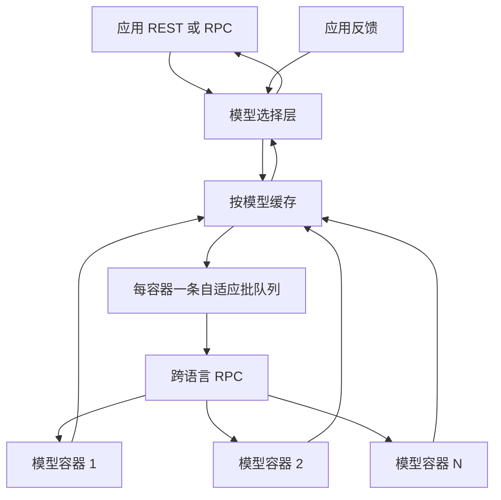

# Clipper：把训练框架留在原地，在上面加一层才做得动在线预测

<!-- release-date: 2016-12-09 -->

**本文依据**：`Clipper: A Low-Latency Online Prediction Serving System`，NSDI 2017（封面已印 *Proceedings of the 14th USENIX Symposium on Networked Systems Design and Implementation*，Boston，March 27–29, 2017），17 页。作者 Daniel Crankshaw、Xin Wang、Giulio Zhou 等；第一单位 UC Berkeley。首发日取 arXiv 1612.03079 v1 提交日 2016-12-09；本地读的是 NSDI 印本。文中数字标 `(PDF p. N)`；标「外部补充」的段落不来自本文。封面把第三作者印成 Guilio Zhou，内文作者块为 Giulio Zhou（PDF p.1–2）。

## 一句话

训练框架只为「离线、大批、慢慢算」优化；线上却要低延迟、高吞吐、还得跟着反馈换模型。Clipper 不改这些框架，而是插在应用和模型之间：下面用容器把异构模型收成同一套 RPC，再叠缓存和自适应批；上面用 bandit 在线选模型或做线性集成，迟到的模型直接丢掉。对照 TensorFlow Serving，C++ 容器吞吐几乎对齐，Python 容器大约慢 15–18%，换来的是跨框架组合和在线学习（PDF p.2–3、p.13）。

## 一、矛盾：训练被当成难事，推理被当成附赠

论文把机器学习生命周期画成两段：训练从数据里估出模型；推理拿模型对查询出预测（PDF p.3 图 2）。训练可以跑几小时到几天；推理必须实时，查询量往往比训练大几个数量级，还卡在用户路径上。新闻推荐那种服务还要交互延迟低于 100 ms、扛突发流量、兴趣一变就要换准的模型（PDF p.2）。

当时的系统注意力几乎全在训练：Spark、Parameter Server、PowerGraph、Adam 一类。框架按模型或领域分裂——TensorFlow 做深度学习、Caffe 做视觉、HTK 做语音——离线批量评估只为了验证训练算法。真正上线时，开发者得自己把多套框架、多份模型和 SLO 缝在一起（PDF p.3）。

三个具体卡点（PDF p.4–5）：

1. **部署复杂度**。没有一种框架通吃；同一应用里语音加视觉就要两套。PMML / PFA 这类交换格式没成主流，因为算法变得太快，训练与 serving 两套实现还会引入误差。
2. **延迟与吞吐打架**。线性模型快，SVM、随机森林、深度网络常见 50–100 ms。批处理能吃 BLAS、SIMD、GPU，但会把第一条查询拖住。负载高时，宁可略降精度也不要拖垮延迟或可用性。
3. **模型选不出来**。离线验证用的是过期数据，A/B 测试对候选数指数爆炸。最好的模型还可能随用户、地区变；特征坏了或概念漂了，静态选择会一直错下去。

Clipper 的答案是分层，而不是再写一个训练框架。

## 二、全景：两层夹在应用和框架中间



（机制示意，根据 PDF p.2 图 1、p.5–6 请求路径。）

请求先到**模型选择层**：按查询属性和近期反馈，派给一个或多个模型。再到**模型抽象层**：查缓存；未命中进入该模型的自适应批队列；一批经 RPC 进 Docker 容器，在原生框架里算完，写回缓存，交给选择层合成最终预测和置信度。反馈走同一套 API，选择层拿它更新以后怎么选、怎么合（PDF p.5–6）。

实现是 Rust。接上的框架：Spark MLLib、Scikit-Learn、Caffe、TensorFlow、HTK。每个框架接入少于 25 行（PDF p.3）。应用和框架都不用为缓存、批、选模型改代码。

实验机器默认单机：2 路 Intel Haswell-EP、256 GB、Ubuntu 14.04；TensorFlow 走 Nvidia Tesla K20c（5 GB、2496 核）。扩容实验用 10 Gbps 与 1 Gbps 两种交换机（PDF p.5）。四个数据集见表。

| 数据集 | 类型 | 规模 | 特征 | 标签 |
|---|---|---:|---|---:|
| MNIST | 图像 | 70K | 28×28 | 10 |
| CIFAR | 图像 | 60k | 32×32×3 | 10 |
| ImageNet | 图像 | 1.26M | 299×299×3 | 1000 |
| Speech（TIMIT） | 声音 | 6300 | 5 秒 | 39 |

（PDF p.5 表 1。CIFAR 规模原文写作 `60k`，MNIST 为 `70K`。）

语音任务用 HTK 学 HMM，输出音素序列。物体识别用多种模型；ImageNet 集成实验的深度模型见表 2（PDF p.10）。

## 三、模型抽象层：把异构框架收成窄腰

抽象层三块：预测缓存、自适应批、模型容器（PDF p.6）。目标是同一套缓存和批对所有框架生效，同时进程隔离、方便加新框架。

### 缓存：热查询别再进模型，反馈也要能 join

推荐一类应用会反复问热门物品。缓存按函数

$$\mathrm{Predict}(m, x) \to y$$

存「模型 id + 查询 → 预测」，LRU（CLOCK）淘汰。API 是非阻塞的 request / fetch：request 发现没有就触发计算，fetch 只取已有结果（PDF p.6）。

第二层用途是**模型选择**。反馈往往紧跟预测回来；要把反馈和当初那次预测对齐，缓存就是 join 表。四个模型的小集成（Scikit-Learn 的随机森林、逻辑回归、线性 SVM，再加 Spark 线性 SVM）上，缓存把反馈处理吞吐从大约 6K 提到 11K observations/s，约 1.6 倍（PDF p.6）。

选择层在缓存**上面**。换权重、换集成系数不会让缓存项失效——缓存的是某个底层模型对 $x$ 的输出，不是最终决策。

### 自适应批：用 SLO 换吞吐，不要人手调 batch size

机器学习框架按批量设计。批有两笔账：摊掉 RPC 和拷 GPU 的固定成本；让框架一次对很多输入做数据并行。代价是批内所有查询都得等最慢的那条。Clipper 显式要一个延迟 SLO，在不超过它的前提下把批做大（PDF p.6–7）。

例子：Scikit-Learn SVM 在 20 ms SLO 下，足够大的批可以把吞吐提到无批的最多约 26 倍（PDF p.7 图 4）。

每个模型容器一条队列、一个处理线程。一次从队列里尽量取到该容器的**最大批大小**，打成一次 RPC。最大批是硬上限，防止第一条查询被无限推迟（PDF p.7）。

延迟剖面差得很大。图 3 在 MNIST 上扫批大小：线性 SVM 几乎是向量乘，20 ms SLO 内能跑到近 30,000 qps；核 SVM 要做一串近邻，同一 SLO 大约 200 qps。最大可执行批相差约 241 倍。No-Op 容器量的是容器加 RPC 的系统开销（PDF p.7）。TensorFlow 一类还会把静态批写进图定义，不足就 padding，人手离线调完就不能动。

**动态批大小**定义为：吞吐最大，且批评估延迟仍低于 SLO。默认用 AIMD：批大小加法增大，一旦超 SLO 就乘性回退 10%。最优批不会剧烈抖动，所以回退常数比网络拥塞控制里常见的 AIMD 小得多（PDF p.8）。他们也试过用分位数回归估 P99 延迟再反解批大小。图 4 上两种策略都远好于不批，线性 SVM 那条能到 26 倍；两者几乎一样，但 AIMD 更简单，还能跟着 Spark GC 这类容量抖动走，所以默认 AIMD（PDF p.8）。

图 4 柱上的吞吐与 P99 微秒数 `pdftotext` 与渲染都挤成碎片，这里只采用正文写明的 26 倍，不从柱高猜绝对值。

**Delayed batching**：负载中等或突发时，队列里可能还没凑满最大批。对固定成本高的模型，略等一会更划算，动机类似 Nagle。图 5：Spark SVM 小批已经够快，延迟派发几乎不涨吞吐；Scikit-Learn SVM 固定成本高、BLAS 并行好，**2 ms** 等待带来约 **3.3 倍**吞吐，仍远低于交互需要的 10–20 ms（PDF p.8）。

### 容器与副本：隔离、复制、批按副本各自调

新模型只需实现

```text
List<List<Y>> pred_batch(List<X> inputs)
```

返回嵌套列表，因为一条输入可能多个输出。提供 C++、Java、Python 绑定；文中多数容器只有几行（PDF p.8 Listing 1）。

每个模型一个 Docker 容器，避免不成熟框架把整个 serving 拖死。初始化时注入参数，之后容器无状态，所以可以跨机器复制，也可以绑 GPU（PDF p.8）。

副本之间延迟剖面可以不同，**自适应批按副本独立调**（PDF p.8–9）。图 6：四机 GPU 集群、10 Gbps 交换机，单副本本地 GPU 约 19,500 qps，四副本约 77,000 qps，约 3.95 倍，近似线性。1 Gbps 时，第二台远程机就把网打满——输入从手工特征变成大图、音频、视频时，网络会先于 GPU 成为扩容墙（PDF p.9）。

## 四、模型选择层：同时挂很多模型，用反馈决定信谁

选择层让候选同时在线，靠反馈决定用哪个或怎么加权。模型坏了可以自动躲开；多模型可以抬精度并给出置信度（PDF p.9）。

策略接口四件事（PDF p.9 Listing 2）：`init` 给出状态 $S$；`select` 决定问哪些模型；`combine` 合成预测，也可以算置信度；`observe` 用反馈更新 $S$。状态隔离是为了给每个用户/会话各复制一份策略（§5.3）。

内置两条，都来自 Auer 等人的非随机 bandit（PDF p.9）：

| 策略 | 算法 | 每查询评估 | 精度上界 | 代价 |
|---|---|---|---|---|
| 单模型 | Exp3 | 1 个模型 | 不超过最好的那一个 | 轻 |
| 集成 | Exp4 | 全部模型 | 模型变多还可以再涨 | 算力按集成规模涨 |

用户可以换自己的策略，也可以随负载改选择。

### Exp3：每次只问一个，用损失更新权重

$k$ 个模型各有权重 $s_i$，一开始 $s_i=1$。抽到模型 $i$ 的概率

$$p_i = s_i \big/ \sum_{j=1}^{k} s_j$$

观察到损失 $L(y,\hat y)\in[0,1]$（例如语音里词对上的比例的补）后

$$s_i \leftarrow s_i \exp\bigl(-\eta L(y,\hat y)/p_i\bigr)$$

$\eta$ 控制对最近反馈有多敏感（PDF p.10）。相对手工试和 A/B：假设少、能扛很多模型、每次只评一个，理论保证能较快贴上最优臂。

### Exp4 线性集成：问所有人，加权平均

线性集成对基模型预测做加权平均。图 7 用表 2 的五个视觉模型：

| 框架 | 模型 | 规模 |
|---|---|---|
| Caffe | VGG | 13 卷积 + 3 全连接 |
| Caffe | GoogLeNet | 96 卷积 + 5 全连接 |
| Caffe | ResNet | 151 卷积 + 1 全连接 |
| Caffe | CaffeNet | 5 卷积 + 3 全连接 |
| TensorFlow | Inception | 6 卷积 + 1 全连接 + 3 Inception |

（PDF p.10 表 2。）

图上印出的误差（PDF p.10 图 7）：

| | 单模型 | 集成 | 4-agree 确信 / 不确信 | 5-agree 确信 / 不确信 |
|---|---:|---:|---|---|
| CIFAR-10 | 0.0915 | 0.0845 | 0.061 / 0.1807 | 0.0235 / 0.126 |
| ImageNet | 0.0618 | 0.0586 | 0.0469 / 0.3182 | 0.0327 / 0.1983 |

ImageNet 上集成相对误差下降约 5.2%。柱宽表示该置信档占多少样本。论文认为在这些很难的视觉任务上，这种量级的下降已经算显著（PDF p.10）。Exp4 按**每个基模型自己的误差**更新权重；精度能超过单模型最优，前提是基模型够准、预测不要太相关。代价是每次查询都要跑完全部模型。

### 模型坏了：5K 查询内换道

CIFAR 上五个精度不同的 Caffe 模型，20K 顺序查询、立即反馈。5K 后把最好的那个（model 5）严重打坏，10K 后恢复。图 8：Exp3 / Exp4 前 5K 都贴上 model 5；打坏后迅速把流量分到别的模型，累计误差低于任何静态选择；恢复后再慢慢加回（PDF p.11）。这是在线选择相对一次性上线的核心证据。

### 置信度：宁可不答，也不要高成本错答

许多应用有合理默认动作。集成的 `combine` 用「有多少模型同意最终预测」当置信度。只接受多模型同意的查询，图 7 上误差明显下降，同时拒绝一小部分查询（PDF p.11–12）。

### 掉队：晚到的预测不如不准的预测

集成一大，P99 会被掉队模型拉穿 20 ms SLO；再大，均值也会坏（PDF p.11 图 9a，MNIST 上 SK-Learn 随机森林）。策略是：到了延迟截止时刻，用**已经回来的子集**调用 `combine`。缺的预测用平均值填，置信度仍是同意比例（PDF p.12）。于是尾延迟变成「集成变小、精度略降」。图 9b：即使小集成尾延迟已经很难看，大多数预测仍能在截止前到达。图 9c：丢掉少量成员，精度只轻微下降（PDF p.12）。图 9 的纵轴刻度 `pdftotext` 抽得出坐标数字，但缺测点的精确百分比，这里只采用正文关系。

### 情境化：每个用户一份 bandit 状态

语音里，方言模型对一部分人好、对另一部分人差。选择层可以为用户、情境或会话各实例化一份状态，存在外部库；当时实现是 Redis（PDF p.12）。

TIMIT 上挂一批按方言训的模型。对照三条（PDF p.12 图 10）：全体数据训一个模型；用户自称的方言模型；Clipper 集成策略。方言模型优于不分方言的模型；集成还能用 serving 反馈超过用户指定的方言模型。图 10 纵轴误差约 0.25–0.35，精确点值未印在正文里。

## 五、对照 TensorFlow Serving：模块化贵不贵

TensorFlow Serving 与训练框架同进程、紧耦合，服务单个 TensorFlow 模型；批大小静态，靠超时防饿死，没有显式 SLO，也不做反馈、动态选择或组合（PDF p.12）。

三个 TensorFlow 网络（PDF p.13 图 11）：MNIST 上 4 层卷积；CIFAR-10 上 8 层 AlexNet；ImageNet 上 22 层 Inception-v3。每种模型两个 Clipper 容器：Python API 与更高效的 C++ API。批大小手调到 TF Serving 吞吐最大：MNIST 512、CIFAR 128、ImageNet 16。测的是最大可持续吞吐和对应延迟。

图 11 柱上印出的吞吐（qps）与平均延迟（ms；误差棒为 P99）（PDF p.13）：

| 模型 | TF Serving 吞吐 | Clipper C++ | Clipper Python | 延迟约（TF / C++ / Py） |
|---|---:|---:|---:|---|
| MNIST | 23138 | 22269 | 19537 | 43 / 45 / 52 |
| CIFAR-10 | 5519 | 5472 | 4571 | 47 / 46 / 55 |
| ImageNet | 56 | 52 | 47 | 561 / 608 / 667 |

Python 容器相对 TF Serving 吞吐低约 15–18%；C++ 几乎对齐。瓶颈是 GPU 推理。延迟拆成：`predict`（框架内推理）、`queue`（容器里等 GPU）、顶上剩余（序列化、网络拷贝）。RPC 在这些负载上很小；当前批交给 GPU 后下一批已经在排队。TF Serving 把队列推进同进程的框架代码里，所以能略省一点（PDF p.13）。

结论：容器加跨框架功能，在核心 serving 指标上没有变成数量级税。ImageNet 这条线吞吐只有几十 qps、延迟五百多毫秒，说明「Parity」说的是相对 TF Serving，不是交互 20 ms SLO。

## 六、局限、相关工作、可迁移

黑盒假设带来的边界（PDF p.13）：

- **不加速模型内部**。慢模型在 Clipper 里还是慢。TF Serving 能用编译和 GPU 路径改 TensorFlow 图。
- **不负责训练/重训基模型**。基模型全过时，集成也救不到离线精度以上。

相关系统（PDF p.13–14）：LinkedIn LASER（广告线性模型，有缓存和掉队，不讨论批，反馈不是实时）；Berkeley Velox（Spark 上的个性化 serving，当时原型功能很窄）；TF Serving（批+硬件加速，无缓存、无跨框架、无在线选择）。三者都是垂直集成。Clipper 把缓存、批、bandit 选择收到框架之上。参数服务器是训练时协调参数的 KV，不是预测 serving。通用 Web 服务（SEDA 等）分层像 Clipper，但那里贵的是 IO，这里贵的是计算，批和藏延迟的策略因此不同。

可迁移、不绑 2017 年那套容器实现的几条：

1. **推理优化先抬到框架外面**。缓存、组批、SLO 截止、掉队丢弃，对黑盒模型仍然成立；今天的连续批、分页 KV 是同一层思想的后代，对象从「整次预测」换成了「token」。
2. **用 SLO 当旋钮，不要人手锁死 batch size**。AIMD 比分位数回归笨，但跟得上 GC 和负载变化。
3. **选择发生在缓存之上**。换的是决策，不是底层 $f_m(x)$；否则每次在线学习都会把热缓存打穿。
4. **晚到不如不准**：截止时刻用子集合成，把尾延迟换成置信度下降。多模型路由、投机解码、级联小模型都可以借这张表。
5. **副本各自画像**。异构机器上不要共用一个全局批大小。
6. **网络会先于算力成为扩容墙**。大输入的远程预测，10 Gbps 才线性，1 Gbps 第二台就饱和——今天多模态请求体更大，这条更硬。

不要直接复用的：Exp3/Exp4 的损失要能在 $[0,1]$ 里定义；推荐/语音有点击或对错，开放生成就没有这么干净的即时奖励。TIMIT「按用户一份 Redis 状态」在用户数大时是另一套存储问题，论文只证明精度收益。

## 关键词回看

- **预测 serving**：训练之后、用户路径上的在线推理，约束是延迟、吞吐、精度，不是收敛速度。
- **模型抽象层 / 模型选择层**：前者统一接口、缓存、批、隔离；后者用反馈选模型和合成。
- **自适应批 / AIMD**：在 SLO 内把批加大；超了就回退 10%。
- **Exp3 / Exp4**：单臂选择 vs 加权集成的在线 bandit。
- **掉队缓解**：截止时刻用已返回的预测合成，而不是等最慢的那个。
- **情境化**：每用户一份选择状态，方言模型那种「同一查询不同人最优解不同」。
