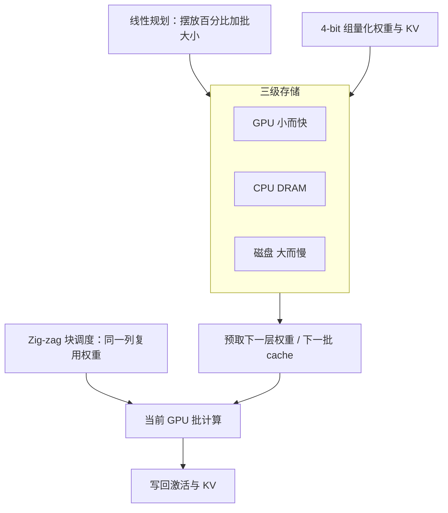

# FlexGen：一张消费级 GPU 也能把 175B 跑到「每秒一个 token」——前提是你不在乎交互延迟

<!-- release-date: 2023-03-13 -->

**本文依据**：`FlexGen: High-Throughput Generative Inference of Large Language Models with a Single GPU`，arXiv 2303.06865v2（2023-06-12，23 页）。封面已印 *Proceedings of the 40th International Conference on Machine Learning*（Honolulu，PMLR 202，2023）。作者 Ying Sheng、Lianmin Zheng、Binhang Yuan 等；通讯 Ying Sheng，第一单位 Stanford University。代码 `https://github.com/FMInference/FlexGen`。首发日取 arXiv v1 提交日 2023-03-13；本地读的是 v2 / ICML 2023 印本（封面注明作者名单比 ICML 存档更长）。文中数字标 `(PDF p. N)`；标「外部补充」的段落不来自本文。

## 一句话

聊天机器人要低延迟；benchmark、信息抽取、表格 wrangling 这类后台任务要的是**单位时间吐出多少 token**。后一类可以故意把延迟拉长、把批做大，用 CPU 内存和磁盘把一张 16GB T4 垫成「能装下 OPT-175B」的机器。FlexGen 的做法不是沿用训练时的 offload，而是把「算哪一层、张量放哪一级存储、注意力算在 GPU 还是 CPU」写成线性规划去搜；再加 4-bit 组量化。结果：单卡 T4 + 208GB DRAM + 1.5TB SSD、输入 512、输出 32 时，压缩版有效批 144，生成吞吐约 **1.12 token/s**（摘要写成「首次达到 1 token/s」），相对 DeepSpeed Zero-Inference / Hugging Face Accelerate 的最大吞吐约 **100×**（正文表 2 对 OPT-175B、512 是 1.12 / 0.01 = 112×）。它不是交互式服务引擎。(PDF p.1–3、p.8)

## 一、矛盾：训练那套 offload 搬到生成推理上会把 I/O 打满

GPT-175B 量级的权重大约 **325GB**（OPT-175B 同量级）。塞进 GPU 至少要五张 A100 80GB，再配复杂并行。(PDF p.1)

三条已有降资源路线各自卡在不同地方 (PDF p.2)：

| 方向 | 代表 | 卡在哪 |
|---|---|---|
| 压缩 | GPTQ、SmoothQuant、LLM.int8 等 | 多数假设模型还能塞进 GPU，单卡很难扛 175B |
| 去中心化协作 | Petals | 用网络摊计算，吞吐受带宽和流水线延迟限制 |
| Offload | DeepSpeed Zero-Inference、HF Accelerate | 能跑，但 I/O 调度和张量摆放从**训练**继承，批常常只有 1–2 |

生成推理和训练不一样。一次任务分 **prefill**（整段 prompt 算出每层 KV cache）和 **decode**（逐步吐 token，每步依赖已有 cache）。三种张量要同时管：权重、激活、KV cache。(PDF p.3)

内存账更狠。OPT-175B（$l=96$，$h_1=12288$，$h_2=49152$）权重约 325GB。若 $b=512$、$s=512$、$n=32$，KV cache 峰值约 **1.2TB**，是权重的 **3.8×**。大吞吐场景里 cache 才是新瓶颈，不是权重本身。(PDF p.4)

吞吐定义：有效批 $b$、输入长 $s$、输出长 $n$，总延迟 $t$ 秒内生成 $bn$ 个 token，生成吞吐是 $bn/t$。(PDF p.4)

所以全文的设计选择是：**面向吞吐、不面向交互**。用大批把昂贵的层级 I/O 摊薄，并和计算重叠。机器上三级存储典型数字（文中示意图）：GPU 16GB / 约 12GB/s，CPU 208GB / 约 2GB/s，Disk 1.5TB。(PDF p.2)

## 二、全景：计算图上的路径搜索，不是「把层丢到 CPU」

把无限条 prompt 画成网格：一行是一个 GPU 批，一列是一层在某一个生成步。格子必须从左往右算；算之前权重、激活、cache 都要在同一设备上；激活要留到右边邻居算完，KV 要留到这一行最右一格。(PDF p.4 图 2)

（机制示意，根据 PDF p.2 存储层级、p.4–5 图 2–3、p.6 式 (1)。）

三块贡献 (PDF p.2)：

1. 把调度、摆放、计算委托写成可搜空间；证明实现用的 zig-zag 块调度 I/O 复杂度相对最优解不超过 **2×**；用线性规划在给定硬件上最大化吞吐。
2. 权重和 KV cache 一起压到 4-bit，**不重训、不校准**，精度损失可忽略。
3. 单卡 T4 上相对当时两条主流 offload 系统，批可以大几个数量级。

## 三、调度：别按行扫，按列复用权重

现有系统按**行**扫：尽快结束一条批、立刻释放 KV。相邻格子不共享权重，权重被反复加载。(PDF p.4–5 图 3(a))

按**列**扫：一列共享权重，权重可以留在 GPU。但激活和 KV 会涨到塞满 CPU 和磁盘，列不能一扫到底。折中是 **zig-zag 块调度**（图 3(b)）：先对一块样本把当前列算完，再进下一列。(PDF p.5)

块里再套重叠：下一层权重加载、上一批 cache/激活写回、下一批 cache/激活读入、当前批计算，六路逻辑线程并行，最后同步。搜索空间因此多两个量：**GPU batch size** 与 **一块里有几个 GPU 批**；两者之积是 **block size / 有效批**。(PDF p.5 算法 1)

附录还给出 I/O 更优的**对角块调度**：warmup 之后沿对角线推进，峰值 KV 更省，当 $n\gg s$ 时同样内存能把块大约放大到 2 倍，平均完成延迟也可减半。实现难点是 KV 缓冲区要动态、非连续；正文只实现 zig-zag，并证明其 I/O 不超过最优的 2 倍（定理 4.1）。(PDF p.13–15)

### 张量摆放：权重按层切，激活和 KV 按张量切

九个百分比：$w_g,w_c,w_d$（权重在 GPU/CPU/磁盘），$h_g,h_c,h_d$（激活），$c_g,c_c,c_d$（KV）。粒度：权重按层，激活和 KV 按张量——太粗不灵活、太细运行时开销大。(PDF p.5)

### 计算委托：KV 在 CPU 上时，注意力分数也在 CPU 上算

Decode 的注意力分数是 I/O 界。KV 在 CPU 却搬到 GPU 去算，等于搬 $b\times s\times h_1\times 4$ 字节；在 CPU 上算只搬激活 $b\times h_1\times 4$ 字节，I/O 少 **$s$ 倍**。长序列（如 $s\ge 512$）且 KV 不在 GPU 时，CPU 算注意力划得来。(PDF p.5)

开启 4-bit 后，细粒度编解码在 CPU 上开销大到让委托失效，量化时关掉 CPU 委托。(PDF p.7)

## 四、线性规划：11 个变量里先枚举批，再解摆放

一块的延迟估成

$$
T = T_{\mathrm{pre}}\cdot l + T_{\mathrm{gen}}\cdot (n-1)\cdot l
$$

假定完美重叠，$T_{\mathrm{pre}}$、$T_{\mathrm{gen}}$ 都是「CPU↔GPU、磁盘↔CPU、计算」五路里的 **max**。(PDF p.5–6)

一层 FP16 权重 $8h_1^2+4h_1 h_2$ 字节；一块激活 $2\cdot b_{ls}\cdot h_1$；一层平均 KV $4\cdot b_{ls}\cdot(s+n/2)\cdot h_1$。(PDF p.6)

策略共 11 个变量：块大小 $b_{ls}$、GPU 批 $gbs$、九个百分比。百分比在模型里放松成 $[0,1]$ 连续量。两层优化：先枚举少量 $(b_{ls},gbs)$（$gbs$ 常为 4 的倍数，$b_{ls}$ 通常小于 20），再对摆放 $p$ 解 LP（式 (1)）：最小化 $T/b_{ls}$，约束三级峰值内存，三组百分比各自和为 1。只有 9 个连续变量，解得很快。峰值内存有碎片，搜出来的策略可能 OOM，作者会手调；也承认手调常能更好。(PDF p.6)

多卡：吞吐导向所以做**流水线并行**，把 $l$ 层均分到 $m$ 卡，问题退化成单卡跑 $n/m$ 层（此处 $n$ 是层数语境下的切分，原文写 $n/m$-layer）。算法 1 再套一层微批流水线循环。(PDF p.6)

## 五、近似：4-bit 是为了少搬，不是为了 INT 矩阵乘

目标是压缩和减 I/O，所以用细粒度**组非对称量化**，计算前反量化回 FP16。组大小 64；权重组在输出通道维，KV 组在隐层维。OPT-175B 上权重和 KV 都压 4-bit，不重训不校准。(PDF p.6–7)

稀疏注意力：算完注意力矩阵后，每个 query 只从 K cache 取 Top-K，只加载约 **10%** 的 V cache。(PDF p.7)

精度（表 5，PDF p.9）：

| 模型 | Lambada acc FP16 / 4-bit / 4-bit-S | WikiText ppl FP16 / 4-bit / 4-bit-S |
|---|---|---|
| OPT-30B | 0.725 / 0.724 / 0.718 | 12.72 / 12.90 / 12.90 |
| OPT-175B | 0.758 / 0.756 / 0.756 | 10.82 / 10.94 / 10.94 |

3-bit 保不住精度。(PDF p.9)

## 六、实验：批做大之后，吞吐才离开 0.01 token/s

硬件：GCP 上 NVIDIA T4 16GB、Intel Xeon 2.00GHz、208GB DRAM、云默认 NVMe SSD 1.5TB；读约 2GB/s、写约 1GB/s（图注写 1.5TB）。(PDF p.7 表 1、p.1 图 1)

工作负载：合成等长 prompt，每条生成 32 token；prompt 512 与 1024。吞吐过慢的系统会少生成再外推。吞吐基准用 dummy 权重，精度用真权重。(PDF p.7)

基线：DeepSpeed ZeRO-Inference、HF Accelerate（当时能 offload 的系统）。两者都是行调度，cache/激活只能放 GPU。Accelerate 量化与 offload 不兼容；DeepSpeed 量化到 175B 保不住精度，故基线不开量化。Petals 作去中心化对照，默认 INT8。(PDF p.7)

### 最大吞吐：表 2（PDF p.8）

单卡，生成吞吐 token/s：

| 系统 | 512：6.7B / 30B / 175B | 1024：6.7B / 30B / 175B |
|---|---|---|
| Accelerate | 25.12 / 0.62 / 0.01 | 13.01 / 0.31 / 0.01 |
| DeepSpeed | 9.28 / 0.60 / 0.01 | 4.59 / 0.29 / OOM |
| Petals（好网，延迟小于 10ms、1Gbps，按卡均） | 8.25 / 2.84 / 0.08 | 6.56 / 1.51 / 0.06 |
| FlexGen | 25.26 / 7.32 / 0.69 | 13.72 / 3.50 / 0.35 |
| FlexGen (c) | 29.12 / 8.70 / **1.12** | 13.18 / 3.98 / 0.42 |

读表：

- 6.7B：Accelerate 与 FlexGen 都能整模进 GPU；DeepSpeed 内存开销大，只好 CPU offload，所以更慢。
- 30B：基线把 KV 放 GPU，批做不大；FlexGen 把大部分权重和全部 KV 放到 CPU，再用块调度复用权重。
- 175B：大家都开始把权重丢磁盘。基线最大批 2；FlexGen GPU 批 32、块 $32\times 8$，吞吐 **69×**（0.69 vs 0.01）。压缩后有效批 144，权重和 KV 都塞进 CPU、躲开磁盘，相对 0.01 是 **112×**（引言写 100×，是摘要级取整）。(PDF p.2–3、p.8)

对应策略（表 15，512 长度，PDF p.20）：FlexGen 175B 为 $(32\times 8,\ 0,\ 50,\ 0,\ 0,\ 0,\ 100)$，即权重一半 CPU 一半磁盘、KV 全在磁盘；压缩版 $(48\times 3,\ 0,\ 100,\ 0,\ 100,\ 0,\ 100)$，权重和 KV 全在 CPU。

引言三条对照（同一套 512+32、T4+208GB+1.5TB）(PDF p.2–3)：

- 延迟都约 5000s：FlexGen 有效批 64（共 2048 个生成 token），相对 DeepSpeed 批 1（32 token）吞吐 **大于 40×**；Accelerate 完不成一批。
- 允许约 12000s：有效批 256（8192 token），最大吞吐 **69×**；基线批不能大于 2，否则 OOM。
- 4-bit：有效批 144（4608 token）、延迟约 4000s，最大吞吐 **100×**，权重全在 CPU、不用磁盘。

Pareto 表 19（PDF p.21）把图 1 的点写死。OPT-175B 压缩版最高吞吐 **1.122 token/s / 4072s / 有效批 144**；无压缩最高 **0.687 / 11916s / 批 256**。Accelerate 最好也只有 0.008 / 7633s / 批 2；DeepSpeed 0.006 / 5024s / 批 1。

### 四卡流水线：表 3（PDF p.8）

prompt 512。生成吞吐含 prefill；解码吞吐假定 prefill 已做完。

| 指标 | 生成：6.7B / 30B / 175B | 解码：6.7B / 30B / 175B |
|---|---|---|
| FlexGen (1) | 25.26 / 7.32 / 0.69 | 38.28 / 11.52 / 0.83 |
| FlexGen (4) | 201.12 / 23.61 / 2.33 | 764.65 / 48.94 / 3.86 |
| DeepSpeed (4) | 50.00 / 6.40 / 0.05 | 50.20 / 6.40 / 0.05 |

生成吞吐没有线性（prefill 有 pipeline bubble，且只生成 32 token）。解码吞吐超线性：每机内存压力下降，可以从磁盘 offload 切回 CPU-only、或把批做大。token 更长时解码会占主导，流水线才划算。(PDF p.8)

### 消融：表 4 / 表 23（PDF p.8–9、p.23）

prompt 512，单卡，token/s：

| 配置 | 30B | 175B |
|---|---:|---:|
| 全部优化 | 7.32 $(48\times 3,\ 20,\ 80)$ | 0.69 $(32\times 8,\ 0,\ 50)$ |
| 无策略搜索 | 7.26 $(48\times 3,\ 0,\ 100)$ | 0.27 $(32\times 1,\ 0,\ 50)$ |
| 无重叠 | 5.86 | 0.59 |
| 无 CPU 计算 | 4.03 | 0.62 |
| 无磁盘 | 7.32 | OOM |
| 套 DeepSpeed 策略 | 1.57 | 0.01 |

30B 上 CPU 计算和重叠都很值钱；175B 瓶颈在磁盘，关 CPU 计算只从 0.69 掉到 0.62。无搜索时 175B 把一块里的 GPU 批从 8 改成 1，吞吐腰斩还多。没有磁盘就跑不了 175B。(PDF p.8–9、p.18)

运行拆解表 8（无重叠剖析，OPT-175B，prompt 512，秒）(PDF p.18)：

| 阶段 | 总计 | 计算 | 权重读 | Cache 读 | Cache 写 |
|---|---:|---:|---:|---:|---:|
| Prefill | 2711 | 2220 | 768 | 0 | 261 |
| Decoding | 11315 | 1498 | 3047 | 7046 | 124 |

GPU 计算利用率：prefill **82%**，decode **13%**。(PDF p.8)

### HELM 与数据 wrangling

OPT-IML-30B 接入 HELM，7 个代表子场景（含下载、初始化、生成、指标）**21 小时**跑完，硬件即表 1。(PDF p.1、p.9)

表 9 分钟数（PDF p.19）：wikifact plaintiff 10、instance of 55；mmlu abstract algebra 31、us foreign policy 33；synthetic reasoning pattern match 118、easy 100；xsum（prompt 1984、gen 64、1568 条）**902 分钟**。

变长序列只做 **pad 到最长 prompt**。表 25：MMLU abstract algebra padded/actual 吞吐 251.5 / 188.6，效率 75.0%；xsum 60.5 / 47.6，78.7%。作者指向 Orca 一类补技术。(PDF p.18、p.23)

数据 wrangling 因输出极短，改用「prompt token + 生成 token」/ 总延迟。OPT-30B 总吞吐约 161–256 token/s；OPT-175B 约 14–35 token/s（表 10–11，PDF p.19）。

### 对 Petals：offload 更吃吞吐，协作更吃延迟敏感

4 节点各一张 T4 的私有 Petals 集群，Linux tc 限速。OPT-30B、512+32；每请求批 2、6 个并行客户端。图 4：单卡 FlexGen 的卡均吞吐在所有测试网络下高于 Petals 集群卡均。Petals 不用 offload，批做不大。慢网 + 短生成时 FlexGen 延迟甚至更低——prefill 激活比 decode 大 $s$ 倍，流水线每跳通信被放大。(PDF p.9)

表 13 补充更差网络（PDF p.20）。例如 512、175B：Petals 100ms / 100Mb/s 为 0.01，FlexGen 0.69、压缩 1.12。

### 换硬件、换长度、换盘速

RTX 3090 24GB + 125GB CPU + 1TB SSD（表 12，PDF p.19）：175B 上 FlexGen 0.384、压缩 1.114；Accelerate 0.026、DeepSpeed 0.019。30B/175B 比主文 T4 设定更差，因为 **CPU 内存更小**，offload 时 CPU 容量是关键。

盘速（表 24，PDF p.23）：30B 不用 SSD，吞吐恒 7.32。175B 本地 SSD 1.6/1.3 GB/s 为 0.69；持久盘 0.5/0.5 掉到 0.30；关 OS 磁盘缓存后分别 0.49 与 0.292。

128+128 时 175B 压缩吞吐 4.264；512+8 时只有 0.559——吞吐定义里 prefill 占比随输出变短而变大。(PDF p.21 表 17–18)

## 七、局限、没写的东西、可迁移

论文自己划的边界：

- **不是聊天系统。** 面向延迟不敏感的批处理；图 1 横轴是数千秒级块延迟。(PDF p.1、p.9)
- zig-zag 不是 I/O 最优；对角调度因非连续 KV 没实现。(PDF p.5、p.14)
- LP 会 OOM，要手调；成本模型常「还行」而不是最优。(PDF p.6)
- 量化开则关 CPU 委托。(PDF p.7)
- 变长靠 padding，长短混杂会算大量 pad token。(PDF p.18)
- 3-bit 失败；稀疏注意力只是「可插」的初步结果。(PDF p.7、p.9)
- 评测模型是 OPT 家族结构；声称可迁 GPT-3 / PaLM / BLOOM，但没测。(PDF p.7)
- 封面注明本版作者名单长于 ICML 存档版。(PDF p.1)

可迁移、且不绑死 175B 的几条：

1. **先问工作负载是吞吐还是延迟。** 训练 offload（行扫描、KV 钉在 GPU）对后台批处理是错的局部最优。
2. **KV 与权重统一进搜索空间。** 大批时 cache 比权重大；只 offload 权重、把 cache 留 GPU，批永远做不大。
3. **I/O 按列摊权重、按 $s$ 决定注意力算在哪。** KV 在 CPU 就不要为算分数把 cache 搬进 GPU。
4. **压缩在 offload 里首先是少搬字节。** 组量化 + 反量化回 FP16，和「用 INT 矩阵乘加速」不是同一目标。
5. **流水线在 offload 世界可以超线性**，因为它在减每卡内存压力、切换存储层级，而不只是加算力。
6. **CPU DRAM 容量经常比 GPU 型号更决定 30B/175B 的曲线**（3090 vs T4 对照）。

今天的 vLLM / PagedAttention / 连续批是交互式低延迟路线，和 FlexGen 的「牺牲延迟换批」不是同一题。论文之后的服务系统把分页 KV、迭代级调度做成了默认；FlexGen 留下来的是：在内存层级上把权重、激活、KV 一起建模，并用 LP 在约束下找 Pareto 点。这条建模方式仍可搬到「单机内存墙 + 磁盘」的离线评测、合成数据、夜间批跑。
