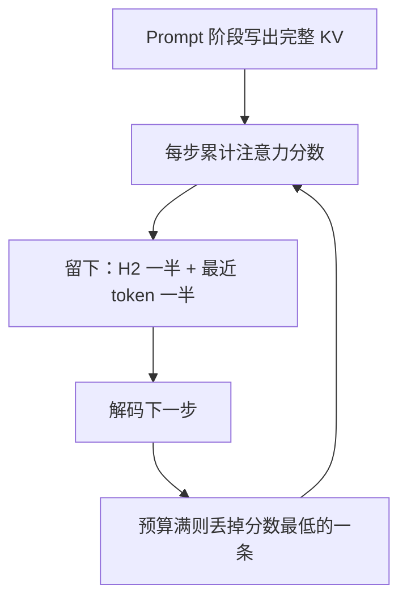

# H2O：KV 不必全留，留住「重锤」和最近几步就够生成

<!-- release-date: 2023-06-24 -->

**本文依据**：`H2O: Heavy-Hitter Oracle for Efficient Generative Inference of Large Language Models`，arXiv 2306.14048v3（2023-12-18，49 页）。封面已印 *37th Conference on Neural Information Processing Systems*（NeurIPS 2023）。作者 Zhenyu Zhang 等；第一单位 University of Texas at Austin（另有 Stanford、UC San Diego、UC Berkeley、Adobe Research、Meta AI (FAIR)、Carnegie Mellon）。代码 `https://github.com/FMInference/H2O`。首发日取 arXiv v1 提交日 2023-06-24；本地读的是 v3 / NeurIPS 2023 印本。文中数字标 `(PDF p. N)`；标「外部补充」的段落不来自本文。

## 一句话

生成式推理里，KV cache 随序列长度和 batch 线性涨，一份 30B、batch 128、长度 1024 就要约 180GB（PDF p.1）。论文发现注意力矩阵在推理时超过 95% 稀疏：真正撑住注意力分数的是一小撮 **重锤 token（Heavy Hitters，H2）**，再配上最近若干步。H2O 按累计注意力分数动态淘汰其余 KV。20% 预算下，表 4 的 XSUM、OPT-30B 相对 Accelerate 为 6.70 / 0.23 ≈ **29 倍**；相对 DeepSpeed 为 6.70 / 0.31 ≈ **22 倍**。表 3 合成负载上相对 FlexGen 最高 52.1 / 16.9 ≈ **3 倍**（6.7B，512+1024）。摘要把 DeepSpeed 也写成 29 倍，以表为准。同 batch 延迟最高约 1.9 倍（PDF p.1、p.8–9）。

## 一、矛盾：KV 是第三堵墙，静态稀疏又打不进预训练模型

模型参数大、注意力二次成本高，这两条大家已经很熟。第三堵墙是 **KV cache**：prompt 阶段把每层每个 token 的 key / value 留下，解码时只追加，避免重算。它和参数一起占 GPU，体积跟序列长度、batch 成正比（PDF p.1、p.3）。

理想缓存要同时满足三件事（PDF p.2）：体积小、miss 低（生成质量别塌）、淘汰策略本身便宜。三条一起很难：

| 已有路子 | 对 KV 体积 | 卡在哪 |
|---|---|---|
| Reformer、FlashAttention | 仍要大 cache | 它们打的是训练/前向的二次内存，不是「生成时能丢掉哪些 KV」（PDF p.2） |
| Sparse Transformer、低秩、多查询注意力 | 能缩小 cache | 直接套到**已经训好**的模型上，miss 高、精度掉（PDF p.2 图 1） |
| Gisting tokens 一类压缩 | 能压文档 KV | 淘汰策略太贵，生成过程里不好现算（PDF p.2） |

淘汰策略还是组合问题。经典 Belady 算法对普通 cache 离线最优，对 KV **不一定**最优：一旦丢掉后面还要用的 key/value，自回归依赖会把后面整段 generaton 毁掉（PDF p.2 脚注）。

所以全文的主矛盾不是「再做一个更稀疏的注意力训练配方」，而是：**预训练模型已经训密了，推理时注意力却极稀；怎样用便宜的在线规则，只留下那一小撮真正被反复点名的 KV。**

## 二、三件观察：稀疏、重锤、局部统计就够

（机制示意，根据 PDF p.2 图 1、p.6 图 3 与附录 A 实现。）

### 稀疏：理论上每步都可能要看全部历史，实测不必

在 Wiki-Text-103 上对预训练 OPT 做零样本，把每行 softmax 注意力低于该行最大值 1% 的位置算稀疏。几乎所有层稀疏度超过 95%（PDF p.4 图 2(a)）。于是「每步只动约 5% 的 KV」在经验上说得通，对应大约 20 倍体积空间——当然这是上界想象，后面实验用的是 20% 预算、约 5 倍压缩。

### 重锤：累计分数服从幂律，和词共现对齐

把注意力块里所有 token 的累计分数画出来，是幂律：少数位置贡献大部分质量，论文叫它们 Heavy Hitters。两件验证（PDF p.4–5 图 2）：

1. 把这些位置遮掉，下游精度崩。
2. 红点（按词的累计注意力）和灰线（语料里的共现次数）高度相关——重锤不是神秘硬件现象，更像「文本里经常一起出现的词，模型也反复去看」。

于是不必穷举淘汰策略：留下 H2，再留下**最近**的 KV（当前词通常和近邻相关），OPT-30B 上六项下游任务就能在大幅减 cache 后贴近满 cache（PDF p.5 图 2(d)）。

### 局部统计 ≈ 看见未来

真正的 H2 要用「后面还会生成哪些 token」的注意力，生成时没有未来。论文发现：每一步只用**已经出现的** query 对现存 key 的注意力做累计，效果和用全局（含未来）统计几乎一样（PDF p.2、p.5 图 2(d)）。这才让在线贪心变得可部署。

若注意力图式可看成次模函数，无 cache 上限时贪心构造 $S_i$ 有次模意义下的近优（引理 3.1，非正式；细节在附录 D，PDF p.5）。

## 三、算法：预算固定，每次最多扔一条

记号（定义 2.1–2.2，非正式，PDF p.4）：cache 预算 $k < n$。第 $i$ 个 token 预测时，手里只有集合 $S_i$ 里的 KV。淘汰规则 $g$ 保证 $|S_i|=k$，且相对上一步最多换进 1 个、扔掉 1 个。被扔掉的位置在归一化里按 0 处理，要从分母里减掉。目标是让这条受限生成过程的输出接近满 cache。

H2O 的分数函数取注意力矩阵里该集合的累计和（定义 4.3、算法 1，PDF p.5–6）。预算未满就一直追加；满了则在 $S_{i-1}\cup\{i\}$ 里扔掉使剩余集合分数最大的那一个——等价于丢掉当前累计分数最差的槽。

图 3 的玩具例子：预算 3，第 4 步解码结束后第 3 个 token 的 KV 因累计分最低被扔，之后再也看不见（PDF p.6）。

定理 4.4（非正式）：温和假设下，每步按 top-$k$ 贪心，得到的 $\tilde S_i$ 满足

$$
f(\tilde S_i) \ge (1-\alpha)\bigl(1-\tfrac{1}{e}\bigr)\max_{|S|=k} f(S) - \beta
$$

其中 $\alpha,\beta>0$（PDF p.6）。这是「为什么贪心还像样」的解释，不是实测精度公式。

实现上搭在 FlexGen 白盒 OPT 上（PDF p.6、附录 A p.20）：给定参数 $K$，cache 里前 $K$ 条是 H2、后 $K$ 条是最近 token（所以正文「20% heavy hitters」常对应 **H2 与最近各占一半** 的总预算）。内存预分配，淘汰时不 swap，新 KV 直接填坑；最近 $K$ 用环形队列。Prefill 若 prompt 长度 $\ge 2K$，先选出 $K$ 个 H2 和 $K$ 个最近；解码时若存量不足 $2K$ 则不淘汰。每步：最近窗口里最老的一条滚出保留区、每个头淘汰一个 H2、最新 token 进最近窗口（PDF p.20–21）。

## 四、质量：20% 预算对齐满 cache，还能救静态稀疏

实验在单卡 A100 80GB 上跑 OPT、LLaMA、GPT-NeoX-20B；任务来自 lm-eval-harness 与 HELM：COPA、MathQA、OpenBookQA、PiQA、RTE、Winogrande、XSUM、CNN/Daily Mail（PDF p.7）。HELM 两项用 1000 条测试、零样本；harness 六项默认五样本（PDF p.20）。预算扫 4%、10%、20%、60% 的 **prompt 长度**（PDF p.20）。对照：满 KV、「只留最近」的 Local、Sparse Transformer 的 strided / fixed，以及更短 prompt 的 0/1-shot 满 cache（用来对齐「5-shot + 20% cache」的序列长度，PDF p.7–8）。

图 4 的读法（PDF p.7–8）：

1. 各预算下 H2O 相对 Local 稳定更好，跨模型大小与任务。
2. **不到 20% 预算（约 5 倍以上内存下降）** 时，多数任务已对齐满 cache。
3. 20% 预算大约相当于每条输入 1.2 条样本的信息量，仍优于 0-shot / 1-shot 满模型。
4. 长生成 XSUM、CNN/Daily Mail 同样成立。

表 1 定量对照（PDF p.8；列是 PiQA / COPA / OpenBookQA / Winogrande）：

| 方法 | PiQA | COPA | OpenBookQA | Winogrande |
|---|---:|---:|---:|---:|
| Full | 80.09 | 81.00 | 44.80 | 71.51 |
| 0-shot Full | 78.89 | 76.00 | 41.40 | 70.00 |
| 1-shot Full | 79.11 | 76.00 | 43.60 | 70.24 |
| Local | 57.94 | 56.00 | 28.40 | 51.30 |
| H2O | 79.22 | 85.00 | 43.80 | 71.67 |

Local 会功能性塌掉：LLaMA-13B+XSUM、LLaMA-7B+CNN/Daily Mail 在 60% 预算就崩，H2O 20% 仍对齐满 cache（PDF p.8）。个别任务 20% 时还略超满 cache：OPT-66B+RTE +0.73%、OPT-30B+MathQA +0.64%、GPT-NeoX-20B+XSUM +0.18，论文称之为正则化效应（PDF p.8）。

表 2：OPT-30B、20% 预算，给静态稀疏补上 H2（PDF p.8）：

| 方法 | COPA | OpenBookQA | PiQA | Winogrande |
|---|---:|---:|---:|---:|
| Full | 85.00 | 43.20 | 78.51 | 70.24 |
| Local 无 H2 | 48.00 | 25.20 | 55.82 | 49.17 |
| Local 有 H2 | 84.00 | 43.00 | 78.45 | 69.06 |
| Sparse strided 无 H2 | 50.00 | 24.60 | 56.20 | 47.59 |
| Sparse strided 有 H2 | 83.00 | 42.60 | 78.24 | 69.61 |
| Sparse fixed 无 H2 | 61.00 | 23.80 | 58.60 | 49.88 |
| Sparse fixed 有 H2 | 76.00 | 41.40 | 77.80 | 64.96 |

无 H2 时最多掉约 35 个点；加上 H2 就回到满 cache 附近。H2 不是只能自己当策略，也能给别人垫底。

## 五、系统：省显存变成更大 batch，或从必须 offload 变成不用

H2O 与 FlexGen 已有的 offload、量化正交（PDF p.9）。吞吐定义：生成 token 数 /（prompt 时间 + 解码时间），含构造 H2O cache 的时间；端到端含 prefill 与 generation（PDF p.9）。

表 3，T4 16GB，合成等长 prompt（PDF p.8）。括号里是有效 batch 与 offload 层次（G=GPU，C=CPU）：

| 序列 | 模型 | Accelerate | DeepSpeed | FlexGen | H2O 20% |
|---|---|---|---|---|---|
| 512+32 | 6.7B | 20.4 (2, G) | 10.2 (16, C) | 20.2 (2, G) | 35.1 (4, G) |
| 512+32 | 30B | 0.6 (8, C) | 0.6 (4, C) | 8.1 (144, C) | 12.7 (728, C) |
| 512+512 | 6.7B | 15.5 (1, G) | 9.6 (16, C) | 16.8 (1, G) | 51.7 (4, G) |
| 512+512 | 30B | 0.6 (8, C) | 0.6 (4, C) | 8.5 (80, C) | 18.83 (416, C) |
| 512+1024 | 6.7B | 5.6 (16, C) | 10.1 (16, C) | 16.9 (1, G) | 52.1 (4, G) |
| 512+1024 | 30B | 0.6 (8, C) | 0.6 (4, C) | 7.1 (48, C) | 13.82 (264, C) |

表 4，真实 XSUM（PDF p.8）：6.7B 上 H2O 30.40 vs Accelerate 11.98 / DeepSpeed 3.52 / FlexGen 10.80；30B 上 6.70 vs 0.23 / 0.31 / 3.29。**29 倍**对的是 30B 相对 Accelerate（6.70 / 0.23）；相对 DeepSpeed 是 6.70 / 0.31 ≈ 22 倍。正文第 5.2 节写「相对 FlexGen / DeepSpeed / Accelerate 最高 3× / 29× / 29×」（PDF p.9），DeepSpeed 那格 29× 对不上表，以表为准。相对 FlexGen 的 3 倍出在表 3 的 6.7B、512+1024（52.1 / 16.9）。

表 5，A100，更长序列（PDF p.9）。OPT 只在 2K 上训过，这里的 4K–10K 是吞吐/延迟压力测试，不是质量声明：

| 序列 | 模型 | batch | 指标 | FlexGen | H2O 20% |
|---|---|---:|---|---:|---:|
| 7000+1024 | 30B | 1 | 延迟 s | 57.0 | 50.4 |
| 5000+5000 | 13B | 4 | 延迟 s | 214.2 | 155.4 |
| 2048+2048 | 6.7B | 24 | 延迟 s | 99.5 | 53.5 |
| 2048+2048 | 6.7B | 24 | token/s | 494.1 | 918.9 |
| 2048+2048 | 6.7B | 64 | token/s | OOM | 1161.0 |

同 batch 延迟约 1.1–1.9 倍；OPT-6.7B 因能开到 64 的 batch，吞吐约 2.3 倍（PDF p.9）。

## 六、消融：两半缺一不可，量化可叠，无限流要靠 H2 而不是只钉句首

**只有 H2 或只有最近都不行。** 表 9（PDF p.27）：OPT-13B/30B 上 PiQA、OpenBookQA、MathQA、Winogrande，单独 Local 或单独 H2 掉 2.85–22.75 个点；两半合在一起才回到满 cache。多数任务上「只有 H2」仍优于「只有最近」。

**样本数。** 0-shot 到 10-shot，H2O 与满模型差距小于 1.00%；Local 最多掉约 37%（PDF p.10、表 10 p.27）。0/1-shot 序列更短（约 100–300），有的任务要 30–40% 预算才稳（PDF p.25）。

**量化。** 表 6，OPT-30B（PDF p.24）：满 cache COPA/OpenBookQA/PiQA 为 85.00 / 43.20 / 78.51；H2O 84.00 / 43.00 / 78.45；4-bit 量化 84.00 / 43.28 / 78.67；H2O+4-bit 84.00 / 43.20 / 78.80。稀疏加量化直觉会叠误差，这里几乎总是不差于单用。表 7 在 T4 上叠 FlexGen 的权重量化：OPT-6.7B、512+512 从 51.7 token/s（batch 4）到 72.5（batch 52）；batch 可放大约 20 倍，吞吐却不到 2 倍——论文承认 FlexGen 量化实现不高效、算力开销大（PDF p.24）。

**「无限长」。** 受 StreamingLLM / LM-Infinite「钉住句首 + 局部窗口 + 位置滚动」启发，把 H2O 接到同一设定。图 5：可流到约四百万 token，PG-19 首条上困惑度低于原 StreamLLM（PDF p.9–10）。附录 C.4 指出句首+局部会丢掉**中间**关键文档：多文档 QA 把关键文档换位置后 StreamLLM 类策略会垮；摘要任务信息分散时同样差。图 9 上 StreamLLM 随预算掉点，H2O-256-256（256 个 H2 + 256 个最近）明显更好（PDF p.26）。

**多样性。** 附录图 6–7：Local 20% 会退化成重复标点；满 cache 有时车轱辘话；H2O 更少重复。XSUM 抽 100 条 prompt、LLaMA-7B 等长生成，Self-BLEU：满模型 0.0057，H2O 0.0051，Local 0.0436（越低越多样，PDF p.23）。这是观察，不是主指标。

**和 SpAtten。** SpAtten 也用累计注意力挑 token，但跨头、跨层累加；H2O 允许每头每层独立留/扔，并显式保留最近 KV，且给出动态次模表述。表 11，OPT-30B：SpAtten COPA/OpenBookQA/PiQA 为 82.00 / 41.90 / 77.06，H2O 为 84.00 / 43.00 / 78.45（PDF p.27）。Top-K 基线加上 H2 最多再抬约 2 个点（表 8，PDF p.26）。

相关工作里最近的还有「可学习哪些 token 必要」但要额外微调，论文认为不实用（PDF p.3）。CoLT5、剪枝、量化与本文正交，可叠加（PDF p.3）。

## 七、局限、实现偏见、可迁移的东西

论文自己写的限制与讨论（PDF p.21–22）：

- **累计分数偏爱更早的 token**：出现次数多，累加就高，更容易留下。改用**平均**注意力决定去留，质量反而掉。
- **句首很容易成为 H2**，和 StreamingLLM 钉句首的经验同方向，但 H2O 不把句首写死。
- 吞吐再高，参数量仍在，大头在 MLP。附录观察到 MLP 里也有 H2，作者把「按 H2 做 offload」留给未来，本文没做完（PDF p.22、p.27）。
- 动态次模是分析框架，假设要温和；定理不替代表 1–5。
- A100 上超 2K 的测的是系统，不是 OPT 的长上下文质量。
- 表 3 的 29 倍很大一块来自「别人必须 CPU offload、H2O 能开更大 batch」，不是同配置算子快 29 倍。

可迁移、不绑死在 2023 年那套 OPT 上的原则：

1. **淘汰 KV 时同时守两头**：全局被反复点名的位置，加上局部语法窗口。只守最近（滑动窗口）或只钉句首，中间事实会丢。
2. **用已经发生的注意力当在线 oracle**，不要等未来，也不要为淘汰再训一个网络。
3. **显存省下来要换成 batch 或去掉 offload**，吞吐故事才成立；只减 cache 而不改调度，墙钟不一定动。
4. **静态稀疏模板可以直接叠 H2**，比重新训练稀疏注意力便宜。
5. 实现细节：预分配、环形队列、淘汰填坑不搬内存，比「聪明分数」更容易被下一套引擎抄走（PDF p.6、p.20）。

AlpacaEval、MT-bench 正文说放在附录（PDF p.7），本地 v3 目录未单列这两张表的完整数字，质量结论以图 4 与表 1–2 为准。
