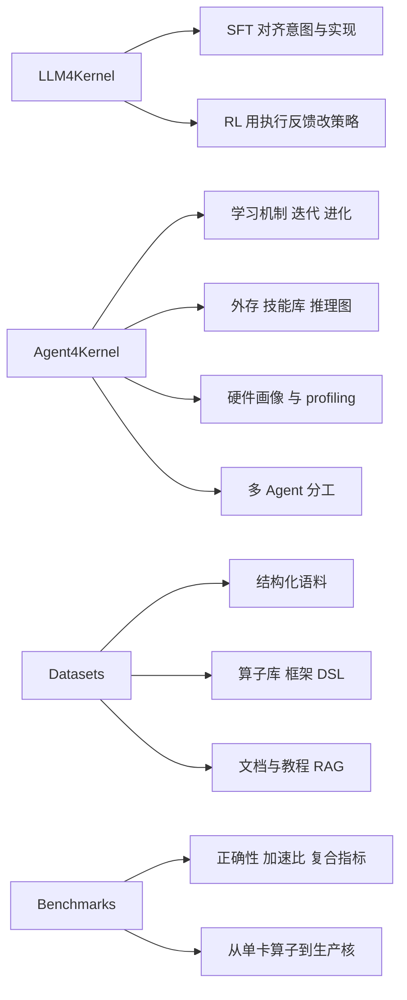

# LLM 写 Kernel：先切「模型怎么专」再切「Agent 怎么转」，不是先切 CUDA / Triton

<!-- release-date: 2026-01-22 -->

**本文依据**：封面正式标题 **Towards Automated Kernel Generation in the Era of LLMs**（文件名 `KDA` 只是 slug，不是文中框架名），arXiv 2601.15727v3（2026-06-06），9 页。Yang Yu 等；第一单位 Beijing Academy of Artificial Intelligence（BAAI）。封面还列北京师范大学、北京大学、北京理工大学、Cornell、北京交通大学、中国人民大学、香港科技大学（广州）等，本文不把它们写成第一作者机构。首发日取 arXiv v1 提交日 2026-01-22；本地读的是 v3，数字与页码均对应该 PDF。文献跟踪仓 [flagos-ai/awesome-LLM-driven-kernel-generation](https://github.com/flagos-ai/awesome-LLM-driven-kernel-generation)。标「外部补充」的段落不来自本文。

## 一句话

AI 系统吞吐经常被底层 GPU / NPU kernel 卡住，而专家手写和编译器自动调参都扩不出去：前者绑死某一代硬件与某一类负载，后者被人手划定的搜索空间、调度原语和优化先验包住（PDF p.1）。这篇 9 页综述不发明一个叫 KDA 的框架，而是把 2025–2026 的碎片工作收成一张图：左边是 **LLM4Kernel**（把模型本身训成会写 kernel），右边是 **Agent4Kernel**（把写 kernel 做成带反馈的闭环），底下再铺 **数据集** 和 **基准**（图 1，PDF p.2）。作者自己的判断集中在第 7 节：评测会被刷分、数据缺轨迹、Agent 缺长程训练、沙箱跟不上 rollout、人和 Agent 还没形成双向回路（PDF p.6–7）。

## 一、这张地图切了几刀

### 为什么旧刀钝了

背景里先摆两代旧范式（PDF p.2）：

1. **专家核 + DSL**：CUDA、CUTLASS、TileLang 一类，能抠硬件，但要架构级手艺，换一代卡或换一家厂就重写。
2. **编译器调度 + autotune**：Halide、TVM 一类，可编程性好，但仍困在预先划好的搜索空间、调度原语和手工规则里。

LLM 被拿来填这个缺口，是因为大规模代码与文档里压着很难形式化的硬件编程经验；Agent 再往前一步，把「生成 → 编译运行 → 看反馈 → 再改」做成可扩展的开环搜索（PDF p.1）。综述强调：kernel 生成和普通代码补全不是一类任务——除了功能正确，还要卡性能、卡硬件执行特征，更接近面向性能的程序综合和编译优化（PDF p.2）。

### 四栏时间轴，不是一张方法表

图 1 按时间把工作排进四列（PDF p.2）：

图是机制示意，对应 PDF p.2 图 1 与第 3–6 节。时间跨度大约从 2025-02 的 KernelBench / AI CUDA Engineer，拉到 2026-03 一带的 InCoder、Kernel-Smith、SOL-ExecBench。

**轴本身是这篇综述的主贡献**。它没有按 CUDA / Triton / HIP 语言切第一刀，也没有按 NVIDIA / AMD / 昇腾切第一刀——那些是第 4 节里的后端差异、第 6 节里的硬件覆盖。第一刀是：**你改的是模型权重，还是改的是带工具的优化环**。第二刀才是支撑学习与评测的数据基础设施。

判据：

- LLM4Kernel 看 **后训练家族**：SFT 还是 RL（第 3 节，PDF p.3）。
- Agent4Kernel 看 **闭环里补了哪一块结构**：怎么学、外存、profiling、多角色（第 4 节，PDF p.3–4）。作者明确写：单靠基础 LLM 会把 kernel 开发压成一次性推理；Agent 才引入规划、工具和中间结果评估（PDF p.3）。
- 数据看 **能不能拿来训 / 能不能拿来 RAG**，不是看仓库星数（第 5 节，PDF p.4–6）。
- 基准看 **测正确、测快，还是测刷分扛不扛**（第 6 节，PDF p.6–7）。

作者自称的另一项贡献是「巩固的资源基础设施」：把可训练的 kernel 数据集结构化，再配一份面向 RAG 的文献收集（PDF p.2）。9 页篇幅里，方法综述和图 1 是地图，表 1 / 表 2 是这张地图的底座。

## 二、每一区里有什么

### LLM4Kernel：SFT 对齐，RL 用反馈抠性能

**SFT**（PDF p.3）靠成对数据：高层计算意图 ↔ 底层 kernel 写法。

| 工作 | 做法 | 综述记下的数字 |
|---|---|---|
| KernelLLM | Triton 编译器造对齐的 PyTorch–Triton 样本，结构化指令微调 | 未给 KernelBench 分数 |
| ConCuR → KernelCoder | 生成并筛选带推理轨迹的核数据；作者观察是推理结构会影响正确性与性能 | KernelBench Level 1 的 fast1 = 17% |
| InCoder-32B | 预训练 / 中训 / 后训三阶段数据策展，面向工业软件 | KernelBench Level 1 的 fast1 = 22.2% |

共识在形成：**配对语料和推理轨迹是 SFT 的主杠杆**。还在打的是：17% 和 22.2% 都远谈不上能替专家核，SFT 更像把「能编译、能对上形状」教进去，峰值性能仍薄。

**RL**（PDF p.3）把生成做成多轮优化。

- Kevin：多轮优化 + 跨轮奖励归属，处理长程 credit assignment。
- CUDA-L1：对比 RL，用 LLM-as-a-judge 给稠密反馈；CUDA-L2 声称在其评测负载上超过 cuBLAS（PDF p.3）。综述没有转写具体倍速表。
- SparseRL：稀疏矩阵 CUDA。
- CUDA Agent：大规模 agentic RL，技能增强的 CUDA 环境 + 自动验证与 profiling 当奖励；综述写 KernelBench 上 SOTA，KernelBench Level-1 相对 PyTorch Eager「99% faster rate」（PDF p.3）。这是作者转述，不是本文复现。
- Triton 线：AutoTriton 用结构评估 + 运行时奖励缓解奖励稀疏；TritonRL 再做层次奖励分解，并显式校验代码与中间推理；QiMeng-Kernel 把 RL 打在宏观思考策略而不是底层实现；Dr. Kernel 强调 Triton 生成要有稳健的分布式 GPU 环境，并处理有偏策略梯度与「懒优化」。
- Kernel-Smith：面向稳定演化的后训练配方，综述写其 Triton kernel 在 KernelBench Level 1 上 fast1 = 70%（PDF p.3）。
- AscendKernelGen：把对齐学习扩到昇腾 NPU，生成 AscendC，CoT-SFT + DPO。

共识：**执行反馈进训练，比再堆一对 SFT 样本更能抠速度**。还在打的是奖励设计（稀疏、刷分、跨轮归属）和后端（CUDA 论文堆、Triton / Ascend 刚铺开）。同一张 KernelBench Level 1 上，SFT 的 17%–22.2% 和 Kernel-Smith 的 70% fast1 被放在相邻段落，但训练设定、是否 Triton、是否同模型族都没有对齐——**不能当同一张排行榜读**。

### Agent4Kernel：四块结构，不是四个产品名

第 4 节把 Agent 工作切成四维（PDF p.3–4）。多数系统会叠用，不是互斥分区。

**1. 学习机制。** 起步是迭代改写：KernelBench 里的 Caesar 反馈环；Inference-Time Scaling 显示加测试时计算和反思能抬质量；PEAK 模块化逐步精炼；AutoKernel 先给整模做 profile 找瓶颈再迭代；MaxCode 把已有迭代搜索收进 max-reward RL，并用自然语言批判模型把原始执行日志译成诊断。K-Search 把 LLM 当世界模型，高层算法规划与底层程序实例化解耦（PDF p.3–4）。

同一套「迭代精炼」被搬到不同后端：DiffAgent 加速扩散模型；TritonX 用状态机覆盖完整 PyTorch ATen；KernelGen（BAAI 自己的仓）用测试时缩放和反思做多芯片后端。综述还点名 Claude Code / OpenCode 这类通用 CLI Agent 也能做迭代；AKO 给它们加 harness，并声称在困难基准上 SOTA（PDF p.4）。

为跳出局部最优，另一支走种群演化：Lange 等对 CUDA 做变异交叉；FM Agent 强调多样性保持、自适应演化、多种群；EvoEngineer 把遍历技术与种群管理解耦；GPU Kernel Scientist 多阶段演化 HIP / AMD；cuPilot 用高层语义策略引导演化（PDF p.4）。

共识：**单次生成不够，闭环和演化是默认形态**。还在打的是：迭代改写、测试时缩放、进化搜索、max-reward RL 到底谁在刷同一张表。

**2. 外存。** 标准 LLM 会编造或忘掉 CUDA API 与指令集。KernelEvolve 给异构加速器接硬件专用知识库（Meta，PDF p.4）；ReGraphT 把优化状态之间的逻辑转移外化成静态可导航的推理图，供小模型检索；KernelBlaster 把经验累进可检索的 CUDA 知识库；EvoKernel 做价值驱动记忆，按优先级取历史轨迹；KernelSkill 双层记忆，长期库存可复用专家技能（PDF p.4）。

共识：**核优化的领域知识不该只活在权重里**。还在打的是外存形态——非结构化文档、推理图、技能条目、带价值的轨迹——没有统一协议。

**3. 硬件画像与 profiling。** 标准 LLM 硬件无关。一边是把规格塞进提示：QiMeng-TensorOp 从文档蒸馏硬件原语；QiMeng-GEMM 用元提示提供通用优化模板和平台细节；QiMeng-Attention 按目标 GPU 架构和指令集，把「思考语言」落到 CUDA，并在不同 GPU 上实现高性能 FlashAttention；SwizzlePerf 把搜索空间收成 swizzle 模式，目标只拉 L2 hit rate（PDF p.4）。另一边是动态反馈：CUDA-LLM 把 warp / cache 等规格和编译日志、运行指标一起送进 Agent；TritonForge 剖析引导的瓶颈循环；PRAGMA 把底层定量指标译成自然语言建议；KernelBand 按运行行为聚类缩小探索空间，并用 profile 当上下文选策略（PDF p.4）。

共识：**不会看硬件的 Agent 只能写出「能跑」的核**。静态规格注入和动态 profile 闭环经常一起出现，不是两条路线。

**4. 多 Agent。** 规划、写码、调试不是同一种能力。STARK 做成 Plan–Code–Debug 以模仿人类团队；AKG 用类似模块化做跨平台综合；Astra 把多 Agent 专化到生产级 SGLang kernel；CudaForge 是 Coder–Judge，硬件级反馈驱动；KForge 声称单次示例监督就能迁到新平台；KernelFalcon 用 manager / worker 分解整网 GPU kernel；GEAK 面向 AMD，在 Triton 工作流里接 generator / reflector / evaluator / optimizer（PDF p.4）。

共识：**角色拆开比把一个巨型提示撑满更像真实写核流程**。还在打的是角色清单（三人组还是生成–反思–评估–优化）以及「生产级」有没有端到端服务数字——综述基本只点名，不附表。

### 数据集：能训的语料，和给 RAG 的知识

第 5 节把资源分成训练语料和知识库（PDF p.4–6）。表 1 的日期是**各资源首次发布**，库本身还在长（PDF p.5）。

结构化数据集很少：The Stack v2（2024-02，无监督 CUDA/Triton）、HPC-Instruct（2024-06，CUDA/MPI/OpenMP 指令）、KernelBook（2025-05，Torch–Triton 对齐）、KernelBench samples（2025-02，代码快照和 profiling）（PDF p.5）。

代码中心语料按三层堆：

1. **高性能算子库**：CUTLASS、FlashAttention、FlagAttention、AoTriton、xFormers、Liger-Kernel、FlagGems、bitsandbytes、Gemlite、FlashInfer、FBGEMM、Transformer Engine、DeepGEMM、Tile Kernels（PDF p.5）。
2. **框架与系统**：PyTorch ATen、vLLM、SGLang、llama.cpp、TensorRT-LLM、DeepSpeed。
3. **DSL**：Triton、TileLang、NVIDIA cuTile（2025-12）。

知识库是 CUDA Guide / PTX ISA / Tuning Guides、GPU-MODE、Triton Index、Awesome-CUDA、LeetCUDA、Triton-Puzzles、Nsight Compute、Colfax 等，给预训练或运行时 RAG（PDF p.5–6）。

共识：**专家核散落在 GitHub 里，对齐的「意图–实现」对极少**。表 1 看起来很满，但第 7 节会说这些库多半只有最终实现，没有优化轨迹（PDF p.6）。两层不要混：表 1 是「有什么代码可以学」，第 7 节是「缺什么信号才能学优化」。

### 基准：指标先定，数据集在变宽

**指标**（PDF p.6）三块：正确性（对参考 CUDA/PyTorch，容差随 FP16 / BF16 / FP8 变，协议细节指向 FlashInfer-Bench）；性能（墙钟加速比，有的对比 Speed-of-Light）；复合质量。另外点到 Efficiency（算力利用率）和 Compatibility（跨硬件 / 语言）。`fast_p` 是正确且加速比大于 $p$ 的比例：

$$\mathrm{fast}_p=\frac{1}{N}\sum_{i=1}^{N}\mathbf{1}(\mathrm{correct}_i\land\{\mathrm{speedup}_i>p\})$$

（PDF p.6 公式 (1)）。Similarity 用词法 / 句法 / 数据流比代码像不像。因为生成随机，评测常多样本、多种子。

**数据集**（表 2，PDF p.7）作者认为在三条上变宽：指标、硬件、负载。

| 名称 | 时间 | 综述记下的规模 / 口径 | 硬件栏 |
|---|---|---|---|
| ParEval | 2024-01 | 420 个专家任务，12 个算法域；一般并行代码，不只 DL kernel | NVIDIA、AMD |
| KernelBench | 2025-02 | 250 个 PyTorch→CUDA 任务 | NVIDIA |
| TritonBench | 2025-02 | TritonBench-G 184、TritonBench-T 166 融合任务；效率定义为测得吞吐 / 理论峰值 | NVIDIA |
| MultiKernel-Bench | 2025-07 | 285 任务、14 类算子 | 华为 NPU、NVIDIA、Google TPU |
| TritonBench-revised 与 ROCm Benchmark | 2025-07 | 30 个专家验证的 ROCm 核 + 改编的 TritonBench-G | AMD |
| Robust-kbench | 2025-09 | 9 类 DL 任务，从 KernelBench 加硬 | NVIDIA |
| BackendBench | 2025-09 | 按 PyTorch 官方核心库标准压边角；现多用 CUDA/Triton，架构自称 backend-agnostic | NVIDIA |
| CUDAEval | 2025-10 | Stack v2 上 313 个任务，测 CUDA 优化里的推理迁移 | NVIDIA |
| FlashInfer-Bench | 2026-01 | 统一 schema：定义、负载、实现、评测；LLM 推理里 8 类代表核 | NVIDIA |
| SOL-ExecBench | 2026-03 | 对着硬件 Speed-of-Light 打分 | NVIDIA |

共识：**KernelBench 的 fast_p 已经是领域口语**。还在打的是：NVIDIA 单卡算子分数能不能代表 AMD / 昇腾 / TPU，以及生产系统里的核（FlashInfer-Bench、SOL-ExecBench、BackendBench）会不会把「benchmark 英雄」打回原形。图 1 时间轴上还有 ISO-Bench 一名，表 2 正文未展开——9 页里这是一个空洞。

## 三、作者的判断（与事实分开）

以下是第 7 节的立场，不是第 3–6 节的文献清点（PDF p.6–7）。结论段（第 8 节，PDF p.7）只收束，不另开新主张。

**评测不可靠，泛化更可疑。** 现有系统容易 reward hacking：基准分好看，部署不见得快。基准覆盖的负载、硬件、执行设置都窄。kernel 级变快对端到端 AI 系统的影响「仍不足够被理解」。他们要的未来评测是：抗刷分、跨负载 / 平台泛化、系统级评估（PDF p.6）。

**数据缺的是轨迹，不是又一个 CUTLASS。** 高性能核在语料里稀疏；现有文本几乎只有最终实现，优化轨迹和硬件意识被拿掉了。方向是大规模建库、合成数据、收集执行驱动的优化痕迹——既给模型训练也给 Agent 学习（PDF p.6）。这与表 1「仓库很多」不矛盾：仓库多的是成品，少的是「为什么这样改」的过程。

**Agent 训练和 harness 工程要一起做。** 写核是长程任务：生成、执行、profiling、再改。基础模型没为这种轨迹训过；现有 Agent 多半是手工工作流，探索效率、上下文管理、长程归属都弱。他们同时看好另一条：不必从零做任务专用 Agent，把 Claude Code / OpenCode 一类基础 Agent 用领域环境、工具和反馈做成 harness（PDF p.6–7）。AKO 在第 4 节已经被当作这条路的例子。

**合成与训练的基础设施是瓶颈。** 要分布式、隔离的执行沙箱；Agent rollout 与编译 / 验证的时延对不齐；还要容错的多设备服务。没有这些，kernel 合成只能停留在低吞吐的一次性实验，变不成数据驱动的演化（PDF p.7）。

**人机协作，不要只赌全自动。** 一边是 human-in-the-loop：人给高层目标和约束。一边是 human-from-the-loop：Agent 发现的知识回流给开发者。因为 kernel 优化可验证，他们设想这能做成人和 Agent 共同把性能工程边界往外推的循环（PDF p.7）。

第 8 节把赌注压在三件事上：更可靠的评测协议、数据基础设施、面向 Agent 写核的 harness（PDF p.7）。「减轻手工写核负担、给快速膨胀的 AI 基础设施解锁生产力」是展望，不是第 3–6 节已经证明的事。

## 四、这张地图指向哪几篇值得单读

正文不排队；下面几篇是轴上的锚点。arXiv 编号均来自本综述参考文献，不另查改题。

1. **Kevin: Multi-turn RL for generating CUDA kernels**（arXiv 2507.11948）——LLM4Kernel 里把写核做成多轮 RL、并认真做跨轮奖励归属的可读入口；后面 CUDA-L2 / CUDA Agent / Kernel-Smith 都在这条信用分配问题上加码。
2. **CUDA-L2: Surpassing cuBLAS performance for matrix multiplication through reinforcement learning**（arXiv 2512.02551）——综述里少数把「超过 cuBLAS」写进正文的工作；读它是为了对质评测负载和刷分，而不是为了背一句 SOTA。
3. **Astra: A multi-agent system for GPU kernel performance optimization**（arXiv 2509.07506）——多 Agent 维里明确对准生产级 SGLang kernel，用来对照 STARK / AKG 的角色分工有没有碰到真实服务栈。
4. **KernelEvolve: Scaling agentic kernel coding for heterogeneous AI accelerators at Meta**（arXiv 2512.23236）——外存维的硬件专用知识库，以及「不止 NVIDIA」这条工程压力；和第 7 节的数据 / harness 判断对得上。
5. **AutoTriton: Automatic Triton programming with reinforcement learning in LLMs**（arXiv 2507.05687）——Triton 线上用结构评估补执行奖励稀疏；要看语言从 CUDA 换成 Triton 之后 RL 信号怎么变，从这篇进比从 CUDA 论文转译更直接。
6. **FlashInfer-Bench: Building the virtuous cycle for AI-driven LLM systems**（arXiv 2601.00227）——基准从「250 个 PyTorch 算子」转到 LLM 推理生产核和统一 schema；第 7 节批评的端到端与抗刷分，都要经过这类基准才有牙。

KernelBench（ICML 2025，本综述参考文献未列 arXiv）是几乎所有分数的口头语，单读价值在任务定义和 fast_p，不必和上面六篇抢「方法锚点」的位置。GEAK（arXiv 2507.23194）是 AMD / Triton Agent 的对照，需要看跨厂时再下钻。

## 读完带走

先问两句：你是在微调一个会写核的模型，还是在搭一个会编译、会 profile、会改写的 Agent？数据这边你要的是对齐的意图–实现对，还是文档 / 轨迹给 RAG？语言（CUDA 或 Triton）和厂家（NVIDIA 或 AMD 或昇腾）是实现细节，不要当分类法。若只能做一件工程，综述的文献分布和第 7 节一起暗示：先把可验证的执行环和抗刷分评测做硬——SFT 分数停在 KernelBench Level 1 的 20% 上下不是意外，缺的是轨迹、长程信用和系统级测量，不是又一篇「提示词里塞了 warp size」的论文。
