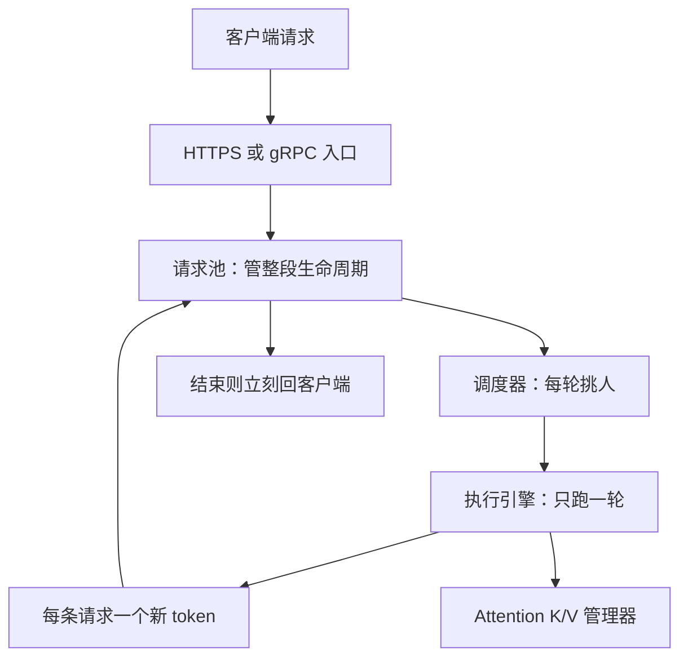

# Orca：别等整批请求都生成完，按「一轮迭代」调度 Transformer 生成

<!-- release-date: 2022-07-11 -->

**本文依据**：`Orca: A Distributed Serving System for Transformer-Based Generative Models`，OSDI ’22（*Proceedings of the 16th USENIX Symposium on Operating Systems Design and Implementation*，July 11–13, 2022，Carlsbad），19 页。作者 Gyeong-In Yu、Joo Seong Jeong 等；第一单位 Seoul National University，部分作者同时署名 FriendliAI。封面没有 arXiv 号。首发日取会议正式发布日 2022-07-11。文中数字标 `(PDF p. N)`，页码是这份 PDF 文件页。标「外部补充」的段落不来自本文。

## 一句话

生成式 Transformer 不是「跑一遍模型就结束」。每条请求要自回归地跑很多轮，每轮只吐一个 token。当时的推理服务按**整条请求**把一批人锁死：先结束的不能回、后到的进不去。Orca 改成**迭代级调度**：引擎每次只跑一轮，调度器每轮都能换人；注意力按请求拆开算，其余算子按 token 拼成一张大表一起算（selective batching）。在 GPT-3 175B、相近延迟下，吞吐相对 NVIDIA FasterTransformer 高 36.9 倍（PDF p.2、p.13）。

## 一、矛盾：服务层以为「一次请求 = 一次前向」，生成模型不是

ResNet、BERT 一类模型，一条请求跑一遍图就完。GPT 一类自回归生成模型不是：输入先一次性吃完（initiation / prefill），之后每吐一个 token 就要把整层栈再跑一遍（increment / decode），直到 `<EOS>` 或长度上限（PDF p.3–4）。

当时常见部署是 Triton Inference Server 组批，FasterTransformer 当执行引擎。调度器和引擎只在两处说话：引擎空闲时塞进下一批；引擎把**这一批所有请求全部生成完**才交回结果（PDF p.2、p.5 图 2）。一批里有人早停、有人后到，系统都假装没看见：

- 早结束的请求还得陪跑，引擎继续给「已经没活」的请求做额外计算（PDF p.5 图 3 里的 `-`）。
- 结果要等最慢的那条一起返回，延迟被拖长。
- 批发出去之后新到的请求只能排队，排队时间可以非常长。

训练里这个问题不明显：teacher forcing 让整批在一次前向里处理完（PDF p.5）。线上生成没有这条捷径。

所以全文要改的不是某一个算子，而是**调度粒度**：从请求级改成迭代级。

## 二、全景：每轮迭代换一批人，注意力单独算

（机制示意，根据 PDF p.6 图 4。）

调度器每轮三件事（PDF p.6）：从池里选出下一批；让引擎对这批只跑一轮模型；收回每个请求的一个输出 token，写回池子。新请求最多等**当前这一轮**就能上车；结束检测也在每一轮之后做，不用等整批散场。

引擎可以铺到多机多卡。大模型用层内切分（intra-layer）和层间切分（inter-layer），规模评到 341B 参数（PDF p.3、p.10 表 1）。

只改调度还不够。同一轮里的请求可能处在完全不同的位置：有的还在 prefill、输入长度不同；有的已经在 decode、当前 token 下标不同；有的一个 prefill、一个 decode。常规组批要求每条请求的算子相同、张量形状相同，这三类情况都组不上（PDF p.6）。硬等「形状碰巧一样」的人凑齐，大批次几乎没机会。于是有第二节技术：selective batching。

## 三、迭代级调度：请求级锁死，是生成负载对不上接口

现有服务层把引擎当成黑盒：塞进去一批请求，等整批结束。这对「一次前向」的模型没问题，对多轮生成会同时伤害延迟和吞吐（PDF p.5，挑战 C1）。

Orca 的接口反过来：引擎一次只承诺「这几条请求、这一轮」。调度器因此拥有每轮的人选权：多少条、哪几条（PDF p.6）。图 4 的例子里，同一轮可以同时跑已经生成过两步的 $x_1$、$x_2$，和还没开跑、输入长度分别为 2 和 3 的 $x_3$、$x_4$；引擎各吐一个 token 就交回（PDF p.6）。

排队时间从「等当前整批全部生成完」变成「等当前这一轮」。早停的请求立刻出池、回客户端，不必陪跑。

## 四、Selective batching：注意力要认「这条是谁」，别的算子认 token 就行

常规 Transformer 一层吃的是三维张量 $[B, L, H]$：$B$ 是请求数，$L$ 是这一轮一起处理的 token 数，$H$ 是隐层宽度。图 3 那种整齐批可以写成 initiation 的 $[2,2,H]$、increment 的 $[2,1,H]$。图 4 那种混批里，$x_3$ 是 $[2,H]$、$x_4$ 是 $[3,H]$，拼不成同一个 $[B,L,H]$（PDF p.7）。

观察是：不是所有算子都需要「请求」这个维度。

- Linear、LayerNorm、Add、GeLU 只在 token 上算，不需要知道哪些 token 属于同一条请求。可以把不规则输入压成二维 $[\sum L, H]$。图 4 那四条一共 7 个 token，就喂 $[7,H]$（PDF p.7）。
- Attention 必须只在同一条请求的 token 之间算，通常靠带 batch 维的 batched GEMM。这一步把张量按请求切开，各自算完再 Merge 回 $[7,H]$（PDF p.7 图 5）。

Attention 本身**不带模型参数**。组批的一大好处是同一份权重从显存读一次、给多条请求用；Attention 没有这份红利，不组批对效率影响小——后面微基准会验证（PDF p.3、p.11）。

Decode 还要看历史 K/V。Orca 用 Attention K/V manager 按请求保存，直到调度器明确说这条结束了才释放。Decode 的 Attention 从管理器取出历史，再拼上本轮 Split 出来的 Q/K/V（PDF p.7）。这是 fairseq 式 incremental decoding 的服务端版本（PDF p.4）。

原则可以记成一句话：每读一轮大参数，把当前所有「就绪 token」尽量算完——能组批的组（非 Attention），不能组的就按请求拆（Attention）（PDF p.14）。

## 五、分布式：层内切、层间切，控制面不要走 NCCL

大模型放不进一张卡，就切参数和计算（PDF p.8）。Orca 用训练系统里已经有的两刀，FasterTransformer 也用：

- **层内并行**：把 Linear 和 Attention 的矩阵乘及对应参数切到多卡。
- **层间并行**：把 Transformer 层均分到多卡。

图 6：4 层 GPT 切成 2 个层间分区，每区再切 3 路层内，一共 6 张 GPU（PDF p.8）。每个 worker 负责一个层间分区，可以不在同一台机器上；层内并行度决定这个 worker 里有几条控 GPU 的 CPU 线程（PDF p.8）。

一轮怎么跑：引擎 master 把本轮 token 和控制信息交给第一个 worker；控制信息包括请求 id、decode 的当前下标、prefill 的输入长度。Worker1 的线程发 kernel，同时把控制消息转给下一个 worker，**不等**本机 GPU 算完。最后一个 worker 才同步、取出新 token、交回 master（PDF p.8 图 7）。

和 FasterTransformer、Megatron-LM 的差别在通信通道。那些系统把控制消息也走 NCCL（GPU 到 GPU），每个进程每轮都要 CPU–GPU 同步一次，开销不小。Orca 把通道拆开：NCCL **只**传 GPU 上的中间张量；控制消息和 token 走 gRPC 这类 CPU 通道（PDF p.8）。175B 关掉流水线的引擎微基准里，作者把最多 47% 的优势归到这次拆分（PDF p.12）。

## 六、调度算法：迭代级 FCFS，加上 KV 槽位预约和流水线

Selective batching 让「任意集合」都能进引擎，调度器还要决定每轮选谁。Orca 选了简单规则：**不打乱到达顺序**，保证迭代级先来先服务（FCFS）。定义：池里若 $x_i$ 比 $x_j$ 先到，则 $x_i$ 已经跑过的迭代数不少于 $x_j$。晚到但需要更少迭代的请求，仍可能更早返回客户端（PDF p.9）。

另外两件事：

1. **max batch size（max_bs）**。批越大吞吐越高、延迟也越高，而且边际收益递减。和别的服务系统一样，这是运维旋钮，用来在延迟预算下换吞吐（PDF p.9）。
2. **显存**。中间激活的缓冲可以立刻复用；K/V 不能，要等到这条请求结束。若调度器还往池里塞新请求、槽位却不够写下一条 token 的 K/V，会卡死。所以第一次调度一条还在 initiation 的请求时，按它的 `max_tokens` **提前预约**槽位；预约后 `n_rsrv` 超了 `n_slots` 就不再收这条（PDF p.9 Algorithm 1）。`n_slots` 按模型规格和并行度尽量开满即可，不必像 `max_bs` 那样扫延迟–吞吐曲线（PDF p.9–10）。

层间流水线：调度器不是每发一批就等它跑完。`n_scheduled` 不到 `n_workers` 就继续发，让每个 worker 手上都有一批、没空转（PDF p.10 Algorithm 1 第 9–10 行）。图 8a：3 个 worker、max_bs=2，先发 AB，再塞 CD、EF，AB 回来后再按到达顺序把 A、B 再排进去（PDF p.10）。

对比 FasterTransformer：请求级接口不允许当前批没结束就再灌下一批。层间流水只能把一批拆成 microbatch（GPipe 那套）。microbatch 变小，组批收益变差；microbatch 太大、个数少于分区数，流水线会进气泡。Orca 用迭代级调度躲开了「组批效率 vs 流水线效率」这道权衡，不必为流水线再切 microbatch（PDF p.10 图 8）。

## 七、实现

约 13K 行 C++，CUDA 生态。控制面 gRPC，数据面（层间和层内）NCCL。提供原版 encoder–decoder Transformer、GPT，以及 Raffel 等讨论过的变体作为积木（PDF p.10）。

和常见训练/推理系统一样，融合了 LayerNorm、Attention、GeLU。Attention 里 QK 点积、Softmax、对 V 加权平均合成一个 kernel。再往前一步：把按请求拆开的 Attention kernel 的 thread block 直接拼进同一个 launch，形状和生命周期可以不同——CUDA 教材不鼓励这种做法，作者认为能提高占用、减少 launch 开销（PDF p.10）。

## 八、实验：引擎本身差不多，端到端差在调度

### 环境与模型

Azure ND96asr A100 v4：每台 8 张 40GB A100、NVLink；最多 4 台。每台 8 个 200Gbps HDR InfiniBand，机间合计 1.6 Tb/s（PDF p.11）。fp16 权重和激活。最大序列长度 2048，跟 GPT-3 原文设定（PDF p.11）。

表 1（PDF p.10）：

| 参数量 | 层数 | Hidden | 层间分区 | 层内分区 |
|---:|---:|---:|---:|---:|
| 13B | 40 | 5120 | 1 | 1 |
| 101B | 80 | 10240 | 1 | 8 |
| 175B | 96 | 12288 | 2 | 8 |
| 341B | 120 | 15360 | 4 | 8 |

13B、175B 配置来自 GPT-3 论文；101B、341B 是改层数和 hidden 得到的。13B 单卡能放下，不加模型并行。175B 用 16 卡：2 个层间分区 × 每区 8 路层内，同一台 VM 的 8 卡属于同一个层间分区（PDF p.11）。

基线是 FasterTransformer。Megatron-LM、DeepSpeed 也能分布式跑，但主要为训练优化，推理不如专用引擎（PDF p.11）。没有公开的生成式语言模型请求轨迹，流量是合成的（PDF p.11）。

### 微基准：关掉调度，引擎和 FasterTransformer 打平

所有请求输入长度相同（32 或 128）、都生成 32 个 token，同时开始同时结束。测试脚本反复把同一批灌进 Orca 引擎直到结束，模仿请求级调度，**不跑** Orca 调度器（PDF p.11）。

图 9（PDF p.12）：13B 单卡上 Orca 引擎与 FasterTransformer 相近或略差——Orca 不对 Attention 组批。作者认为差距相对小，因为 Attention 没有参数可复用。101B（8 卡同机）结论类似，说明 kernel 和层内通信实现效率相当。FasterTransformer 按模型最大序列 2048 **固定**预分配每条请求的 K/V，13B 上 batch≥8、101B 上 batch≥16 会 OOM（图上缺柱）；Orca 按每条请求的 `max_tokens` 单独定缓冲，少浪费（PDF p.11–12）。

175B 用两段层间分区。为公平对比，两边都关流水线；FasterTransformer 把 microbatch 设成等于 batch。图 9c 上 Orca 引擎最多快 47%，作者归到控制面/数据面分离。341B 与 175B 类似，文中省略图（PDF p.12）。柱高 pdftotext 抽不出精确毫秒，这里只用正文写明的比较。

### 端到端：合成轨迹，36.9× 出在 175B、相近延迟处

输入长度从 $U(32,512)$ 均匀采样；`max_gen_tokens` 从 $U(1,128)$ 采样。没有真实 checkpoint 和真实文本，无法猜 `<EOS>` 何时出现，所以假设一直生成到 `max_gen_tokens`，模型永不吐 `<EOS>`。到达服从泊松过程，扫到达率。延迟按每条请求生成 token 数归一化后取中位数（PDF p.11–12）。

FasterTransformer 没有自己的调度器，作者写了一个：从队列最多取 max_bs 条组成一批再注入，这是 Triton / TensorFlow Serving 一类的常见做法；再扫 microbatch 大小（PDF p.12）。

图 10（PDF p.12）：多数设置下 Orca 吞吐更高、延迟更低。例外是 101B 低负载——两边都凑不齐批，延迟主要由引擎决定，回到图 9b。负载升高后，Orca 让后到请求搭上正在跑的批，吞吐上去、延迟增加相对小。FasterTransformer 处理不好「到达时刻不同 / 迭代数不同 / 输入长度不同」，101B 峰值吞吐 0.49 req/s，延迟高得多（PDF p.13）。

175B、341B 用多于一个层间分区时，所有负载下 Orca 的延迟和吞吐都更好；相近延迟处吞吐差一个数量级。**摘要里的 36.9×** 对应这一处：175B，中位归一化延迟 190 ms（约为图 9c 中 `orca(128)` 按生成 token 数归一化后执行时间的两倍），FasterTransformer 0.185 req/s，Orca 6.81 req/s，即 36.9 倍（PDF p.13）。

加大 Orca 的 max_bs，图 10 上吞吐升、延迟几乎不动——迭代级调度消掉了早停和后到。作者提醒：换硬件、模型、负载，批变大仍可能伤延迟，max_bs 要按延迟和吞吐一起调（PDF p.13）。

FasterTransformer 加大 max_bs **不一定**提高吞吐。扫过所有 `(max_bs, mbs)` 后，最好的是 $(1,1)$ 或 $(8,8)$。microbatch 流水线里真正组批的规模被 mbs 卡住，所以 mbs 取到和 max_bs 一样往往更好。max_bs 变大还会把输入长度、生成长度差很多的请求打进同一批：第一轮会按最短输入来处理；早停的人也不能立刻返回（PDF p.13）。

### 齐整轨迹：没有早停，FasterTransformer 才吃得上大批

若一条轨迹里所有请求输入长度和 `max_gen_tokens` 都相同，早停问题消失。图 11 上加大 max_bs 对 FasterTransformer 开始有明显好处。Orca 仍然胜过 `max_bs=8` 的 FasterTransformer；唯一例外是 max_bs=1，这时 Orca 退化成不做组批的 worker 流水线（PDF p.13）。175B；子图 (a) 为 (输入, 生成)=(32, 32)，(b) 为 (256, 256)；齐整轨迹不归一化延迟（PDF p.13 图 11）。

## 九、相关工作：BatchMaker 对 RNN 有效，对 Transformer 对不上

BatchMaker 按 RNN cell 调度和组批，新请求可以中途加入、结束的可以中途离开（PDF p.13–14）。Transformer 的「cell」随 token 下标 $t$ 变，因为每一步用的 Attention K/V 集合不同。图里 cell 种类数等于 $L$（输入加已生成长度）；图 10 的轨迹里 $L$ 从 $33=32+1$ 到 $640=512+128$，同一时刻很难凑齐相同 cell，BatchMaker 会退回几乎不组批。它也不支持需要模型并行和流水线的大模型（PDF p.14）。

FasterTransformer、LightSeq、TurboTransformers、EET 都是 Transformer 专用引擎，挂在 Triton / TensorFlow Serving 下面，调度仍是请求级。其中只有 FasterTransformer 支持分布式。Megatron-LM、DeepSpeed 能分布式跑，但主优化目标是训练（PDF p.14）。

Orca 把调度器和引擎绑紧，才用得上迭代级调度和 selective batching。作者承认没有给出「既保住两层抽象、又支持这两招」的通用接口，留给未来（PDF p.14）。

## 十、局限、没写什么、可迁移

实验只跑语言模型。作者认为只要是 Transformer 架构加自回归生成，别的模态也可以用同一套（PDF p.3）。没有真实线上轨迹，到达是泊松，长度是均匀分布，并且**强制生成到 `max_gen_tokens`、永不 `<EOS>`**（PDF p.11）。没有公开真实 175B checkpoint 上的质量数字——这是系统论文，测的是延迟和吞吐。K/V 仍按请求连续存放、按 `max_tokens` 预留，还不是后来 vLLM 那种分页块（外部补充：分页是后续工作，本文没有）。

可直接搬走的判断：

1. **生成服务的调度单位应是「一轮迭代」**，不是「一条请求跑完」。请求级接口会同时制造陪跑、迟返回和排队。
2. **组批不必全图整齐。** 带权重的算子按 token 拼大矩阵；Attention 按请求拆。不要因为 Attention 形状不规则就放弃整层组批。
3. **KV 是调度问题，不只是内核问题。** 不预约会卡死；按最大序列全局预分配会 OOM。把 `max_tokens` 暴露给调度器。
4. **层间流水线不要靠把批切碎来填气泡。** 若调度粒度已经是迭代，可以直接多批在飞。
5. **控制面别走 GPU 集合通信。** 每轮都有的元数据走 CPU 通道，NCCL 留给张量。

后续推理系统里的 continuous batching / iteration-level scheduling，源头就是这篇的调度粒度。S-LoRA 等后续工作会点名用 Orca 的迭代级调度（外部补充，见同目录 S-LoRA 解读）。

## 关键词回看

- **请求级调度（request-level scheduling）**：引擎一次吃进一批请求，整批全部生成完才交回。
- **迭代级调度（iteration-level scheduling）**：引擎一次只跑一轮；调度器每轮可换人。
- **Selective batching**：非 Attention 按 token 组批，Attention 按请求分开。
- **Initiation / increment**：prefill 一次吃完输入；decode 每轮一个 token。
- **Attention K/V manager**：跨迭代保存每条请求的键值，结束再释放。
- **层内 / 层间并行**：切矩阵乘；切层。Orca 用迭代级调度做层间流水，不必再切 microbatch。

