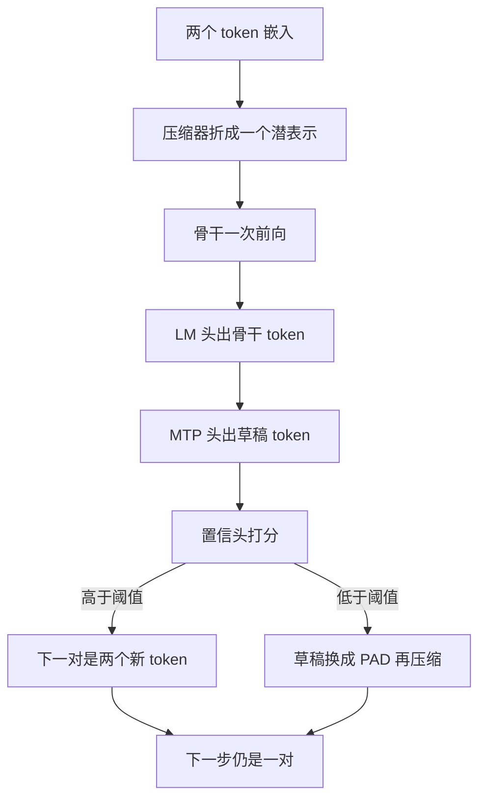

# Pair-In, Pair-Out：把压缩进和多 token 出做成镜像，用置信头换掉验证器

<!-- release-date: 2026-05-26 -->

**本文依据**：`Pair-In, Pair-Out: Latent Multi-Token Prediction for Efficient LLMs`，arXiv `2605.27255v2`（29 May 2026，15 页）。作者 Wenhui Tan、Minghao Li、Xiaoqian Ma、Siqi Fan、Xiusheng Huang、Liujie Zhang、Ruihua Song、Weihang Chen；第一单位 Gaoling School of Artificial Intelligence, Renmin University of China（封面还列 Xiaohongshu Inc.、University of Electronic Science and Technology of China、Institute of Automation, Chinese Academy of Sciences）。通讯为 Ruihua Song 与 Weihang Chen。项目页 GitHub.com/RedAI-Infra/PIPO。首发日取 arXiv v1 提交日 2026-05-26。封面没有印会议名。文中数字标 `(PDF p. N)`，页码是这份 PDF 文件页。标「外部补充」的段落不来自本文。

## 一句话

长思维链让自回归一步一个 token 变成推理的主成本。输入侧做潜空间压缩、输出侧做推测解码或多 token 预测（MTP），两条线一直分开走；输出侧还要为不可靠草稿付一次昂贵的验证前向。这篇把压缩器与 MTP 头当成镜像：两个输入 token 折成一个潜表示，一个隐状态再展开出一个草稿 token。验证器换成轻量置信头；训练标签直接用在策略蒸馏（OPD）里已经算过的拒绝采样接受率。在 Qwen3.5-4B / 9B 上，相对常规解码，pass@4 最高 **+7.15**，首 token 延迟最高 **2.64×**、每 token 延迟最高 **2.07×**（PDF p.1–2）。

## 一、矛盾：加速被拆成两半，验证器还卡着上限

现代推理模型先吐很长的中间链再给答案。标准自回归每步只出一个 token，且这一步依赖前面所有已生成 token，链一长，延迟就线性堆上去（PDF p.1）。

当时的架构解法分两边（PDF p.1）：

- **输出侧**：一步多吐。推测解码用小草稿模型猜、大模型用拒绝采样验（Leviathan 等）；EAGLE 把草稿做到隐特征上，一次并行验一棵候选树。新骨干还把 MTP 头直接训进模型，当同框架里的共训草稿器。
- **输入侧**：压缩器把多个输入 token 合成一个潜表示，缩短有效序列，也就是潜空间推理。

两边各自推进。输出侧再快，每收下的 token 仍要过一遍完整骨干，验证前向把加速钉死（PDF p.1）。MTP 头若没有接受规则，错草稿会写进序列，下游精度掉（PDF p.3）。输入侧改的是「模型在看什么」，不改「每步吐几个」（PDF p.3）。

作者给两条观察（PDF p.1–2）：

1. **压缩器与 MTP 头是镜像。** 进侧把两个嵌入折成一个潜表示；出侧把一个隐状态展开成多一个输出 token。合在一起就是对称的 pair-in / pair-out。
2. **OPD 的教师就是推测解码的验证器。** 推测解码接受草稿 $x$ 的概率是 $\min(p_v(x)/p_d(x), 1)$。OPD 用反向 KL $D=\mathrm{KL}(p_s\parallel p_t)$ 把学生拉向教师。两边都在问：学生/草稿和更强的教师/验证器是否一致。于是可以把 $\min(p_t/p_s, 1)$ 当置信头的标签，监督几乎免费。

最接近的输入侧工作是同一作者线的 CoLaR：在潜空间压缩推理链，并直接预测压缩潜嵌入。但它用单峰高斯去拟合多 token 续写的多峰分布。PIPO 把生成留在离散词表，潜变量只出现在输入侧，才能接现成 MTP 头和基于置信的接受规则（PDF p.3）。

## 二、全景：解码单元从「一个 token」换成「一对」

记 $x_j$ 为位置 $j$ 的嵌入。第 $i$ 个 pair 步：压缩潜输入 $z^i$ 代表连续两个 token $(x_{2i}, x_{2i+1})$，骨干给出下一骨干 token 分布 $p_b^{2i+2}$，MTP 给出草稿分布 $p_d^{2i+3}$，再出一个标量置信 $c_i\in(0,1)$。若 $c_i\ge\tau_c$，草稿收下，下一输入对是两个新 token；否则草稿换成 padding，再压缩，接口始终是 pair 级（PDF p.3）。

（机制示意，根据 PDF p.3–4 图 3。）

相对常规解码：有效输入长度大约减半，每步输出大约加倍。现代强模型已经带 MTP 头，PIPO 新加的主要是小 MLP 压缩器和置信头（PDF p.2、p.4）。

图 1 把三条线摆在一起：多输入（CoLaR 一类）、多输出（EAGLE 一类，还要过 LLM 验证器）、以及中间这条 PIPO——压缩与 MTP 绕骨干成镜像，轻量置信头替换验证器（PDF p.2）。

## 三、Pair-In / Pair-Out：折进去，再展开出来

**Pair-in。** 每两个连续嵌入拼起来，过一个 MLP：

$$z^i = f_\theta\bigl([x_{2i}; x_{2i+1}]\bigr)$$

初始化成 $f_\theta([a;b])\approx a+b$，让骨干输入一开始仍接近预训练分布（PDF p.3–4）。附录 E.1 后文会看到：训完后仍保加性几何，但学到非对称、带槽位身份的投影。

**Pair-out。** 骨干在压缩前缀上出隐状态和骨干 token 分布：

$$h_i^b = \mathrm{Backbone}(z^{\le i}),\qquad p_b^{2i+2} = \mathrm{LMHead}(h_i^b)$$

草稿再由 MTP 头以骨干隐状态和刚解出的骨干 token 嵌入为条件：

$$h_i^d = \mathrm{MTPHead}(h_i^b, x_{2i+2}),\qquad p_d^{2i+3} = \mathrm{LMHead}(h_i^d)$$

（PDF p.4 式 (2)–(5)）

一边把两个嵌入折成一个潜输入，一边把一个隐状态展开成多一个输出 token。这就是镜像（PDF p.4）。

**置信引导的接受。** 推测解码要用大验证器。这里用小 MLP：

$$c_i = g_\phi\bigl([h_i^b; h_i^d]\bigr)$$

$c_i\ge\tau_c$ 则下一对是 $(x_{2i+2}, x_{2i+3})$，否则是 $(x_{2i+2}, x_{\mathrm{pad}})$。不确定时退回单 token 解码，每对只多一次 MLP，不是整次骨干（PDF p.4）。附录 E.2 验证：压缩器把带 PAD 的对几乎当成「活下来的那一个 token」，不会把隐藏状态弄脏。

附录 B 给实现规格（PDF p.11–12）：

- 压缩器两种同接口变体：线性 $W[x_{2i};x_{2i+1}]+b$，以及默认 MLP $W_2\,\mathrm{SiLU}(W_1[\cdot])$。残差支路一开始置零，使 $f_\theta([a;b])\approx a+b$。
- MTP 头是骨干最后一层后的一整层全注意力解码器：把 $h_i^b$ 与刚解出的骨干 token 嵌入各自 RMSNorm 后拼接，过可学投影 $W_{\mathrm{fc}}:\mathbb{R}^{2H}\to\mathbb{R}^H$，再进一层与骨干同超参的 Qwen3.5 decoder block，LM 头冻结共用。现成 MTP 骨干上，PIPO 只 LoRA 适配注意力与 MLP 投影，小的 norm/投影全训。
- 置信头：$c_i=\sigma\bigl(W_2\,\mathrm{SiLU}(W_1\,\mathrm{RMSNorm}([h_i^b;h_i^d]))\bigr)$，$W_1:\mathbb{R}^{2H}\to\mathbb{R}^H$，$W_2:\mathbb{R}^H\to\mathbb{R}$，无偏置。4B 骨干大约多 **6.6M** 参数（约模型的 **0.16%**），一次前向比完整验证器便宜几个数量级。

## 四、SFT：先学会「下一对」，置信头用金标概率热身

SFT 是下一对预测。每对步对骨干 token 和草稿 token 各算交叉熵：

$$L_{\mathrm{tok}}=\mathrm{CE}(p_b^{2i+2}, x_{2i+2})+\mathrm{CE}(p_d^{2i+3}, x_{2i+3})$$

置信头用 BCE 去对齐金标草稿上学生自己的概率 $p_d^{2i+3}(x_{2i+3})$，让 $c_i$ 在 OPD 给出更尖监督之前就和草稿可靠性相关。总目标 $L_{\mathrm{SFT}}=L_{\mathrm{tok}}+\lambda_{\mathrm{conf}}L_{\mathrm{conf}}^{\mathrm{SFT}}$。为了对齐推理，随机把一部分草稿位输入换成 $x_{\mathrm{pad}}$（PDF p.4）。

附录把 SFT 阶段的标签说死了：教师在金标上是 one-hot，拒绝采样接受率塌成学生在金标草稿上的概率 $p_s(y_t)$，与 OPD 在确定性教师极限下同一量，头从 SFT 迁到 OPD 不用重置参数（PDF p.12）。

## 五、OPD：教师即验证器，置信监督几乎白给

SFT 从没让模型见到自己的解码分布。OPD 补这个训推差：PIPO 按当前策略 rollout，记下收下的草稿、拒绝位上的 PAD、学生分布 $p_s$ 和置信。去掉 PAD，把干净文本喂给未压缩教师，得到 $p_t$。反向 KL：

$$L_{\mathrm{distill}}=\mathrm{KL}(p_s\parallel p_t)$$

（PDF p.5 式 (9)）

推测解码接受概率是 $\min(p_t(x)/p_s(x),1)$。OPD 每个位置已经有 $(p_t,p_s)$。置信头的标签就是这个接受率，再 BCE。$(p_t,p_s)$ 蒸馏已经算过，不增加前向、不加标签。推理时置信头整段换掉验证器。总目标 $L_{\mathrm{OPD}}=L_{\mathrm{distill}}+\lambda_{\mathrm{conf}}L_{\mathrm{conf}}^{\mathrm{OPD}}$（PDF p.5）。

附录 C.3 把微批拆成三步（PDF p.12–13）：

1. **Rollout**：SFT 学生用自己的 pair 级解码器，经 SGLang colocate 引擎；关掉 radix cache，保证 PAD 增强可复现。
2. **教师前向（PAD 压实）**：未压缩的 Qwen3.5-9B 教师没见过序列中间的 PAD，先剥掉 PAD 再跑，再用前缀和把 log-prob 映回原位置；每个 PAD 位继承「紧挨着的非 PAD 前缀」上的教师分布。
3. **学生再前向**：在压缩（pair 级）模式上对同一轨迹回传，压缩器、MTP、LoRA、置信头都吃到梯度。

默认损失是在策略采样 token 上的蒙特卡洛反向 KL，偶位走骨干头、奇位走 MTP 头。置信目标 $\alpha_i=\min(p_t(y)/p_s(y),1)$ 正是采样 KL 已经算过的逐位量；对 $\alpha_i$ 做 detach，避免头通过自己的目标把梯度漏回学生 logits（PDF p.13）。

## 六、实验设定：同一骨干、同一 32K slot 预算

训练数据：DAPO-Math **17.4k** 道数学题、Codeforces **16.1k** 道编程题，SFT/OPD 按 **90/10** 切。SFT 轨迹：Qwen3.5-9B 教师每题采 4 条，留下全部正确轨迹，正文写约 **90k** 条、均长 **24.4K** token、上限 64K（PDF p.5）。附录 C.1 更细：共 **95,969** 条，均值 **24.9K**、中位 **21.6K**、标准差 **14.9K**，tokenize 硬顶 64K；长尾是评测和所有基线共用 32K-slot 预算的原因（PDF p.12）。OPD 另用教师每题 4 条 rollout 估难度、做 4.4 节的数据过滤（PDF p.5）。

两阶段：SFT **2** 个 epoch，草稿位 **25%** 随机 PAD；再对 SFT 学生的 rollout 做 **1** 个 epoch OPD。两边都是 LoRA + AdamW，学习率 $1\times 10^{-4}$，5% warmup、余弦退火，$\lambda_{\mathrm{conf}}=1.0$（PDF p.5）。附录：ms-swift，LoRA rank 64、$\alpha=128$、dropout 0.05，打在骨干 $\{q,k,v,o,\mathrm{gate},\mathrm{up},\mathrm{down}\}$ 以及 MTP 层同名投影；压缩器 MLP、MTP 的 $W_{\mathrm{fc}}$、MTP 前后 norm、置信头全训；LM 头与输入嵌入绑定并冻结。8 张 H20-141G，ZeRO-2，单卡 batch 1，SFT 梯度累积 16，OPD 累积 4，最长 64K，flash-attention 2；MTP 损失权重与置信 BCE 权重都是 1。PAD 注入：每步抽 $\rho\sim\mathrm{Uniform}(0,\rho_{\max})$，$\rho_{\max}=0.25$，再独立标记响应区里 $\rho$ 比例的对拆成 $\{(x_{2p},x_{\mathrm{pad}}),(x_{2p+1},x_{\mathrm{pad}})\}$；PAD 始终落在 pair 的奇位，总长保持偶数（PDF p.12–13）。

评测：AIME 2025（30 题）、GPQA-Diamond（198 题）、LiveCodeBench v6（131 题）、LongBench v2 短子集（178 题，因模型上下文限制，输入 $>10\mathrm{K}$）（PDF p.5）。采样跟 Qwen3.5：温度 1.0、top-p 0.95、top-k 20、重复惩罚 1.5，**32K-slot** 响应预算。每题 4 条，报 avg@4 与 pass@4（PDF p.5）。附录 D：SGLang + LatentMTP 扩展，8×H20，DP=8、TP=1，每卡最多 64 并发。答案从 `\boxed{}` 抽最后一处；AIME 用 math-verify，选择题精确匹配选项字母，LiveCodeBench 跑隐藏测试全过才算对（PDF p.13）。

基线同一 Qwen3.5-4B / 9B：**Regular** 自回归；**MTP** 用预训练 MTP 头每步出草稿、无验证；**EAGLE-2** 用 MTP 头打草稿、一次骨干前向验草稿树（SGLang NEXTN：3 步推测、每层 top-k=1、每次验证 4 个草稿 token）。PIPO 报 PIPO-SFT 与 PIPO + OPD；推理时置信头开着，$\tau_c=0.95$（PDF p.5、p.13）。

脚注 1 很关键：EAGLE-2 的接受规则只在精确（贪心或只调温度）的推测采样下保分布；本文用的 top-p / top-k / 重复惩罚落在保证之外，实践上只是近似无损，逐 token 漂移会在数千 token 的推理链上累积（PDF p.6）。

## 七、主结果：pass@4 涨，未验证 MTP 会砸精度

表 1 全表如下（PDF p.6）。Overall 是四任务汇总。

| 骨干 | 方法 | AIME avg / pass | GPQA avg / pass | LCB avg / pass | LB avg / pass | Overall avg / pass |
|---|---|---:|---:|---:|---:|---:|
| 4B | Regular | 49.17 / 63.33 | 59.72 / 72.73 | 40.08 / 44.27 | 59.69 / 73.60 | 52.16 / 63.48 |
| 4B | Eagle-2 | 40.83 / 60.00 | 53.66 / 66.16 | 32.06 / 43.51 | 58.29 / 71.35 | 46.21 / 60.26 |
| 4B | MTP | 34.17 / 43.33 | 52.27 / 69.19 | 14.89 / 27.48 | 52.67 / 69.10 | 38.50 / 52.28 |
| 4B | PIPO-SFT | 42.50 / 60.00 | 59.47 / 79.29 | 30.15 / 48.85 | 49.02 / 71.91 | 45.28 / 65.01 |
| 4B | + OPD | 50.00 / 76.67 | 54.17 / 72.73 | 32.06 / 49.62 | 49.86 / 70.22 | 46.52 / 67.31 |
| 9B | Regular | 53.33 / 66.67 | 68.56 / 78.79 | 47.14 / 54.20 | 61.66 / 72.47 | 57.67 / 68.03 |
| 9B | Eagle-2 | 49.17 / 63.33 | 62.63 / 73.23 | 39.31 / 45.80 | 61.24 / 71.35 | 53.09 / 63.43 |
| 9B | MTP | 40.00 / 50.00 | 55.30 / 71.21 | 18.32 / 31.30 | 52.81 / 71.91 | 41.61 / 56.10 |
| 9B | PIPO-SFT | 51.67 / 76.67 | 63.76 / 81.31 | 34.92 / 54.20 | 54.35 / 74.16 | 51.18 / 71.58 |
| 9B | + OPD | 59.17 / 83.33 | 67.17 / 82.32 | 46.56 / 62.60 | 56.46 / 72.47 | 57.34 / 75.18 |

三条观察（PDF p.6）：

1. **PIPO 是两边骨干上最强的 pass@4。** 不加 OPD，PIPO-SFT 已超过所有基线：相对最好基线 Regular，4B **+1.53**、9B **+3.55**。加上 OPD 变成 4B **+3.83**、9B **+7.15**；除 4B 的 LongBench 外，逐任务 pass@4 都是最好。作者归因于固定 32K-slot 预算下，每步输出加倍，同样预算里能塞进更完整的推理链。AIME 上 PIPO + OPD 的 pass@4 相对 Regular 分别 **+13.34**（4B：63.33→76.67）和 **+16.66**（9B：66.67→83.33）。
2. **OPD 把 avg@4 捞回来，同时保住 pass@4。** PIPO-SFT 用更高 pass@4 换掉一部分 avg@4，因为草稿位多了不确定性。OPD 相对 SFT：4B **+1.24** avg / **+2.30** pass，9B **+6.16** avg / **+3.60** pass。9B 上 avg@4 几乎贴 Regular（**57.34** vs **57.67**），pass@4 仍 **+7.15**。SFT→OPD 的增益随模型变大，作者认为更大骨干更能吃 OPD。
3. **现成加速器仍在拿精度换速度。** 无验证 MTP 两边骨干 pass@4 都掉 **超过 11 点**（4B 63.48→52.28，9B 68.03→56.10）。EAGLE-2 有验证器，仍比 Regular 差 **3–5** 点 pass@4。PIPO 用每对一次 MLP 换掉验证器，pass@4 和后面的效率一起拿。

图 2：四基准 overall pass@4 随响应上下文预算从 2K 到 32K 变化；PIPO 相对 Regular / MTP / EAGLE-2 的优势随预算变大而拉开，因为每步吐两倍 token（PDF p.2）。

## 八、效率：slot 更省，长上下文 TTFT 拉开

**Slot。** slot 是该方法原生粒度的一个输出单元：Regular / EAGLE-2 / MTP 每个解出的 token 占 1 slot；PIPO 一步出骨干 token + 草稿，再压回一个输入潜表示，tokens-per-slot 在 1× 与 2× 之间，取决于置信头接受率。共享 32K-slot 预算下，PIPO + OPD 仍比基线少用 slot：相对 Regular 约少 **3%**，相对 EAGLE-2 约 **10%**，相对 MTP 约 **13%**；PIPO-SFT 再砍到 4B **−10%**、9B **−9%**，而每个 slot 的推理内容仍严格多于基线 slot。OPD 多用一点 slot，换 4.2 节更高的 pass@4（PDF p.7）。

表 2 平均输出 slot 数（PDF p.7）：

| 骨干 | Regular | EAGLE-2 | MTP | PIPO-SFT | PIPO + OPD |
|---|---:|---:|---:|---:|---:|
| 4B | 20,160 | 21,667 | 22,072 | 18,082 | 19,431 |
| 9B | 19,140 | 20,584 | 21,857 | 17,494 | 18,590 |

墙钟在 HuggingFace 后端、输入长度 $\{2,4,8,16,32,64,128\}\mathrm{K}$，图 4；TTFT 与 TPOT（对前 16 个生成 token 平均）各 16 次试验平均（PDF p.6–7）。

**TTFT。** Regular 预填充整段 prompt，从 2K 的 **0.139s** 到 128K 的 **20.3s**。MTP 多一次 MTP 头，每档都略慢于 Regular。PIPO 把每两个输入 token 压成一个，有效预填充长度减半：2K 相对 Regular **1.65×**，128K **2.64×**（20.3s → **7.69s**）。相对收益随输入变长而增大，正是推理负载所在（PDF p.7）。

**TPOT。** 每 token 成本由一次骨干前向主导；MTP 与 PIPO 都一次出两个 token，TPOT 大约是 Regular 的一半。PIPO 在 2K 达 **2.07×**（**12.7** vs **26.3**），128K 为 **1.98×**（**14.1** vs **27.9**），且因压缩前缀缩小 KV cache，始终最快。和上面的 2.64× TTFT 合在一起，加速集中在长上下文（PDF p.7）。

## 九、消融：非线性、加性初始化、多样轨迹、教师过滤、置信阈值

表 3，Qwen3.5-4B，四基准 overall（PDF p.7）：

| 设定 | Avg@4 | Pass@4 |
|---|---:|---:|
| PIPO-SFT（默认） | 45.28 | 65.01 |
| 线性压缩器 | 43.86 | 60.38 |
| 每题只留最短正确回答 | 42.88 | 59.87 |
| 压缩器随机初始化 | 38.74 | 57.73 |

- MLP 换成单线性层，pass@4 **−4.63**（65.01→60.38）：两个异质嵌入需要非线性才能融进骨干吃得下的一个潜输入。
- 随机初始化是表里最大跌幅（avg **−6.54**、pass **−7.28**）：一开始就把分布外输入喂给骨干，早期 SFT 不稳。$a+b$ 初始化就是为了贴预训练分布。
- 每题只留最短正确轨迹，pass@4 **−5.14**：多条正确轨迹即使答案相同，也对下一对目标有用。

**OPD 数据过滤。** 只保留教师四条 rollout 正确率至少 $\rho\in\{0\%,25\%,50\%,75\%,100\%\}$ 的题。Avg@4 随 $\rho$ 单调升；pass@4 在 **$\rho=50\%$** 见顶然后掉——滤太狠会丢掉最难、对覆盖最重要的题。表 1 用 $\rho=50\%$（PDF p.7–8，图 5）。

**置信头不是接受率旋钮。** 扫 $\tau_c\in\{0,0.5,0.8,0.9,0.95,0.98,1.0\}$（pad 比从 0 到 1），对照按同样平均 pad 比无条件抛硬币的 Random（图 6，PDF p.8）：

- 每个中间 pad 比上 Confidence 都压过 Random，例如 pad 约 0.6 时 pass@4 **61.93** vs **59.64**。头不是在调接受率，而是在同样预算下丢掉该丢的草稿。
- pass@4 在 $\tau_c=0.95$（pad **0.665**）到顶 **65.01**，再收到 $\tau_c\to 1$ 的单 token 解码 **64.55**。这个峰超过 pad=1 基线，说明调好的头收下的草稿不只是保住常规质量，还每步多贡献有用推理。Avg@4 随 pad 比单调升。主表默认 $\tau_c=0.95$。

## 十、压缩器与 PAD 学到了什么

附录 E 用 Qwen3.5-4B 的 PIPO + OPD，12 条 prompt（AIME / GPQA / LiveCodeBench 各 4），共 **1,372** 对（PDF p.14）。

**位置不偏。** 第一输入的雅可比范数份额 $\|\partial f_\theta/\partial x_{2i}\|/(\|\partial f_\theta/\partial x_{2i}\|+\|\partial f_\theta/\partial x_{2i+1}\|)$ 紧贴 **0.49**，和对称值 0.5 分不清（图 8）。

**位置有身份。** 交换两个输入后的余弦均值 **0.68**，远低于完全交换不变的 1.0，也远高于原始嵌入对余弦 **0.16**（图 9）。压缩器编码了「谁在哪个槽」。

**不只是求和。** 输出与 $x_{2i}+x_{2i+1}$ 的余弦均值 **0.65**，高于单独每个输入（**0.49** / **0.51**），但离 1.0 很远；幅度 $\|\ f_\theta(\cdot)\|/\|x_{2i}+x_{2i+1}\|\approx 0.50$（图 10）。加性几何还在，投影更尖、带槽位（PDF p.14）。

**PAD 几乎被忽略。** 第二槽换成 PAD 后，输出与存活 token 的余弦 **0.70**，高于未改对的 **0.49**；PAD 放第一槽则与 $b$ 的余弦升到 **0.60**（图 11）。全 PAD 输出范数 **0.39**，比其他曲线低一个数量级，接近对骨干的空操作 KV 项，从而在激进拒绝时能退回单 token 解码（图 12，PDF p.15）。

## 十一、相关工作里还补了什么

附录 A（PDF p.11）：CoT 与 DeepThink 的 `<think>` 标签；GRPO / DAPO / GSPO 一类组内按正确性重加权。OPD 是 SFT 与蒸馏的杂交：学生按自己策略 rollout，再逐位置反向 KL 对齐冻结教师；相对 SFT 去掉训推差，相对整轨 RL 用稠密逐 token 信号、不做昂贵奖励模型。PIPO 用 OPD 既补 pair 接口带来的训推差，又给置信头白嫖监督。缩短/压缩/自适应终止推理链的工作与 PIPO 互补：PIPO 不决定「想多少」，只降低「还在想的那些 token」的单价。

伦理一节（PDF p.9）：本身不引入新数据源或新用户能力；更快解码降成本与能耗，也可能降低有害用途成本。建议沿用原骨干的安全过滤与访问控制；上线前在目标域评估精度与安全。

## 十二、局限与可迁移

作者自己列四条（PDF p.8）：

1. 只做了 pair-in / pair-out。更大压缩比可能更快，但更难建模。
2. 算力只做到 4B–9B。9B 增益更大，作者猜测对更大模型可能更有效——这是观察，不是已测事实。
3. 只评可验证答案任务，没评对话、创意写作等开放生成。
4. 只做纯文本；多模态可能要模态专用压缩器。

可直接搬走的：

- 骨干已经带 MTP 头时，不必再训一套草稿模型；缺的是输入侧压缩和接受规则，不是第三套解码器。
- 验证器不必每步再跑一遍大模型：若训练里已经在算教师/学生分布（OPD、反向 KL），拒绝采样接受率可以当置信头的免费标签，把反复的推理成本摊成一次训练信号。
- 无验证的 MTP 会把错草稿写进序列；接受规则不能省。PIPO 用 PAD 保同一 pair 接口，比「拒了就改图结构」更容易接现有服务。
- 压缩器不要随机初始化，先让 $f_\theta([a;b])\approx a+b$；非线性比单线性层值钱。
- 固定 slot/上下文预算时，「一步两 token」本身就能在同样预算里放下更完整的链，pass@k 可能先于 avg 上涨。
- 没有空算力、也没有 MTP 头的老骨干，不要指望这篇的现成模块能直接插上。
- 分布保证：PIPO **没有** 声称与原模型逐 token 同分布；它用置信阈值近似接受。需要严格同分布时，仍应回到推测采样那套 $p/q$ 与修正分布（对照本目录 `Speculative-Decoding.md`）。

## 关键词回看

- **Pair-In, Pair-Out（PIPO）**：两个输入 token 折成一个潜表示，一步再展开出骨干 token + 草稿 token。
- **潜压缩器**：MLP 把 $[x_{2i};x_{2i+1}]$ 映到 $z^i$，默认从 $a+b$ 出发。
- **MTP 头**：以骨干隐状态和刚解出的骨干 token 为条件，出下一个草稿分布。
- **置信头**：用 $[h^b;h^d]$ 预测草稿该不该收；推理时替换大验证器。
- **OPD**：学生按自己策略 rollout，反向 KL 对齐教师；$(p_t,p_s)$ 同时是置信标签。
- **PAD 回退**：草稿被拒时第二槽填 padding，接口仍是 pair，压缩器近似忽略 PAD。
- **Slot**：方法原生的一步输出单位；PIPO 一步对应一对，预算按 slot 而不是按原始 token 对齐。
