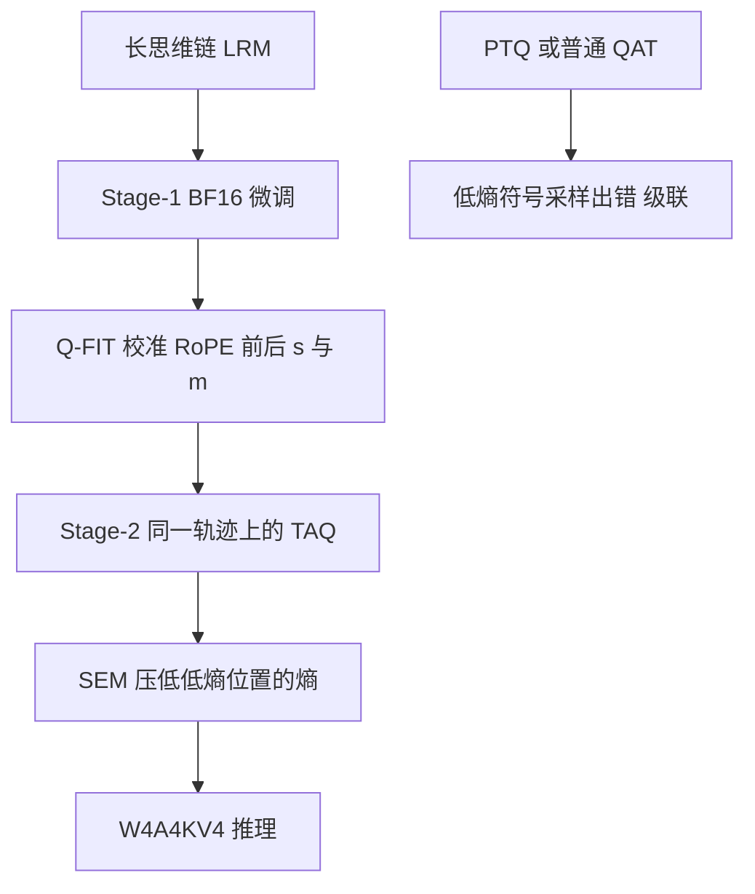

# 推理服务把 KV 也压到 4 bit 时，先护住低熵符号，不要先堆 QAT 步数

<!-- release-date: 2026-06-14 -->

**本文依据**：封面正式标题 **ReQAT: Achieving Full-Precision Reasoning Accuracy with 4-bit Floating-Point Quantization-Aware Training**；arXiv `2606.15682v1`（2026-06-14，22 页）。作者 Janghwan Lee、Sihwa Lee、Jinseok Kim、Yongjik Kim、Jieun Lim、Jinwook Oh、Jungwook Choi；第一单位 Hanyang University（Jungwook Choi 通讯），合作单位 Rebellions Inc.。封面印有 ICML 2026（PMLR 306，Seoul）。代码仓库 `aiha-lab/ReQAT`。本地读的是 v1 PDF；`release-date` 取 arXiv v1 提交日 2026-06-14。文中数字紧跟 `(PDF p. N)`；标「外部补充」的段落不来自本文。

## 一句话

长思维链模型一旦把权重、激活和 **KV 缓存（Key-Value Cache，键值缓存）** 全部压成 4-bit 浮点（**W4A4KV4**），PTQ 和常规 QAT 都救不回推理精度。失败并不均匀：噪声主要打在 **低熵 token**——数字、运算符这类「必须写对」的符号承诺上；连接词再花哨，答案往往还能对。ReQAT 用三件事对着这个点下手：**轨迹对齐的量化感知训练（Trace-Aligned QAT，TAQ）**、**选择性熵最小化（Selective Entropy Minimization，SEM）**、以及校准 RoPE 前后变换的 **量化友好初始化（Q-FIT）**。同样训练预算下，AIME 可以赶上甚至超过 BF16 全量微调，端到端吞吐相对 BF16 最高约 **3.9×**（DGX Spark）和 **3.1×**（B200）。

## 一、矛盾：硬件已经能跑 FP4，推理链却在符号上断掉

大推理模型（Large Reasoning Models，LRMs）靠很长的思维链解题。服务端要扛并发，成本沿着三条轴一起涨（PDF p.1）：

- 自回归每步都要反复搬权重，带宽吃紧。
- FLOPs 随生成长度涨。
- KV 缓存随序列线性涨；长程推理经常超过 16K token。

工业界因此转向 **微缩放 4-bit 浮点（microscaled FP4）**：MXFP4、NVIDIA NVFP4 都是 **E2M1**（2 bit 指数、1 bit 尾数），靠块级缩放保住动态范围（附录表 8，PDF p.15）。Blackwell 上 B200 Tensor Core 的 FP4 推理约 **9 PFLOPS**，约为 FP16 的 **4×**，并原生支持把 KV 也压成 NVFP4 的 W4A4KV4（PDF p.2）。边侧机器如 DGX Spark 也走同一条路。

问题是：格式能跑，精度不行。

图 1(a) 显示，DeepSeek-R1 蒸馏系列上，NVFP4 W4A4KV4 的 **训练后量化（Post-Training Quantization，PTQ）** 在 GSM8K、MATH-500、AIME-120 上掉得很狠（PDF p.1）。**量化感知训练（Quantization-Aware Training，QAT）** 和 **量化感知蒸馏（Quantization-Aware Distillation，QAD）** 能比 PTQ 好，但 MXFP4 W4A16 上仍明显低于 BF16 全量微调（图 1(b)，PDF p.1–2）。KV 一旦也量化，通道离群值和 **旋转位置编码（Rotary Positional Embeddings，RoPE）** 的旋转结构会让统计随 token 振荡，固定平滑/平移跟不上（PDF p.2）。

主结果先放在桌上（R1-Qwen-14B，NVFP4 W4A4KV4，AIME；PDF p.2、表 1 p.7）：

| 设置 | AIME |
|---|---:|
| BF16 基线 | 56.83% |
| BF16 全量微调 | 65.46% |
| ReQAT（表 1 中 TAQ+Q-FIT 在 280M token 预算） | 65.94% |

吞吐：相对 BF16，真实 TensorRT-LLM 部署最高 **3.1×**（B200）和 **3.9×**（DGX Spark）（摘要，PDF p.1；第 5.3 节细化为图 6 的 3.05× / 3.90× 量级，PDF p.8）。

全文问题因此不是「再多训几个 epoch」，而是：

> 4-bit 噪声究竟打在思维链的哪一类 token 上？训练信号能不能对准那里？

图按 PDF p.5 图 3 重画，是机制示意。吞吐数字见第 5.3 节，不是这张流程图里的实测时间。

## 二、为什么 W4A4KV4 特别伤推理：低熵 token 的尾质量被吹大

先把熵说成人话。下一步词的分布若很尖，熵就低：模型几乎认定下一个是 `4` 或 `+`。分布若很平，熵就高：`Then` / `Hmm` / `Maybe` 都可以。作者统计 **超过 150 万** 个生成 token：多数是低熵；大约 **20%** 是高熵，对应推理转折（PDF p.3）。词云上，低熵侧是数字和运算符，高熵侧是话语标记和连接短语（图 2(a)，PDF p.3）。

量化会把分布拍扁：top-1 概率下降、备选上升、熵升高（图 2(b)，PDF p.3）。两条失败假说因此对打：

1. 低熵处：本来很自信，量化后更容易抽到非 top-1，写出错数字。
2. 高熵处：本来就犹豫，量化会改 top-1，推理路径跑偏。

### 混合精度路由：把低熵交给 BF16 才回血

解码每步用 BF16 的熵做路由，把下一步交给 BF16 或 FP4（图 2(c–d)，PDF p.4）。低熵预测走 BF16，能收回很大一块量化掉的 AIME；只把高熵走 BF16，提升很小。附录图 8 同趋势（PDF p.4）。这条路径要双前向，贵，所以后面改成往 logits 里加噪声当代理。

### 往 logits 加噪：打低熵就崩，打高熵往往答案还对

对选中位置做逐元素乘性高斯噪声 $\sigma Z \odot \eta$（PDF p.4）。每个 batched 步只打最高熵 **25%** 或最低熵 **25%**。图 2(e) 跨 R1-Qwen-7B/14B、Qwen3-4B/8B：打低熵，AIME 大掉；打高熵，影响小得多（PDF p.4）。附录图 9 的几何题：高熵噪声把措辞改花，答案仍是 `104`；低熵噪声把 $38^2$ 算成 144，最后 `boxed{70}` 错（PDF p.17）。

### 机制：argmax 还在，尾巴变厚

定义尾质量 $M=1-P(x_{\mathrm{top1}})$，再看比值 $\rho=(M_{\mathrm{FP4}}+\epsilon)/(M_{\mathrm{BF16}}+\epsilon)$。$\rho>1$ 表示 top-1 名次没变，但抽到别人的概率变大。图 2(f)：低熵区 top-1 错配接近 0，尾质量却明显变大（PDF p.4）。这就是「看起来还选对，采样时却写错一位数字」。

所以常规 PTQ/QAT 若不管低熵处的非 top-1 采样膨胀，W4A4KV4 上很难把推理精度补满（PDF p.4）。

## 三、TAQ：同一条思维链再走一遍，把梯度赶到低熵位置

ReQAT 三件套里，第一件是两阶段（PDF p.4–5）：

1. **Stage-1**：BF16 微调，得到全精度推理 checkpoint。
2. **Stage-2**：在 **同一批思维链** $D_{\mathrm{TAQ}}\subseteq D_{\mathrm{FT}}$ 上做 QAT，让量化感知更新反复打在同一批低熵符号上。

实践上 Stage-2 大约 **70M token** 就够贴近 BF16 微调，且总预算与对照方法对齐（PDF p.5）。

熵动态说明「为什么必须同一条轨迹」（图 4，PDF p.5）：

- 单阶段 FT 或单阶段 QAT（都是 280M）：熵变化主要发生在高熵桶，低熵桶几乎不动。
- FT 后再 QAT，且 QAT 复用同一 token：随着 Stage-2 从 35M 加到 280M，低熵桶开始动。
- 若 Stage-2 换不同轨迹，这个效应消失。

表 4（MXFP4 W4A16，R1-Qwen-14B，PDF p.8）把对齐写成数字：

| 方法 | 轨迹对齐 | 140M | 210M | 280M | 350M |
|---|---|---:|---:|---:|---:|
| QAT | — | 59.88 | 61.35 | 61.09 | 62.29 |
| FT+QAT | 否 | 60.10 | 59.89 | 62.19 | 62.60 |
| FT+QAT | 是 | 61.15 | 63.65 | 65.00 | 67.29 |

不对齐的两阶段提升大约 $\le 1$ 个百分点；对齐后大约再抬 **5** 个百分点（PDF p.8）。

第 6 节用嵌入梯度解释：令 $s_t=\|G_{t,:}\|_2^2$，低熵位置的梯度贡献比 $C_{\mathrm{low}}$。图 7：对齐轨迹的 QAT 会把 $C_{\mathrm{low}}$ 抬上去；错位轨迹则稀释（PDF p.9）。Stage-1 已经把推理结构学会了，Stage-2 的算力才轮得到「量化下会写错的那些符号」。

**可迁移**：QAT 数据不必更花哨，但必须和全精度微调看过的轨迹对齐。换一套新 CoT 再量化，等于把学习信号重新洒回高熵叙事。

## 四、SEM：对齐还不够，要把低熵位置的自信再拧紧

图 1(c) 显示，只做轨迹对齐仍填不满 W4A4KV4 相对 BF16 FT 的坑（PDF p.5）。SEM 在标准 SFT 损失上加一项，只在「本来就该确定」的位置压熵（PDF p.6）：

$$
\mathcal{L}_{\mathrm{SEM}}=\mathcal{L}_{\mathrm{SFT}}+\lambda\cdot\frac{1}{T}\sum_{t=1}^{T} w_t H_t
$$

权重不用硬掩码，而用相对阈值 $\tau$ 的软权重，避免卡在阈值附近的 token 被过度惩罚：

$$
w_t=\max\left(0,\;1-\frac{H_t-H_{\min}}{\tau-H_{\min}+\epsilon}\right)
$$

实现上 $\tau$ 取 minibatch 熵的 **75 分位**，也就是对最低熵的 **75%** token 施压，最高熵 **25%** 不动；默认 $\lambda=0.1$（PDF p.6、p.20）。表 12：软权重大于硬掩码（140M：61.81 vs 60.14；210M：65.14 vs 63.19，MXFP4 W4A4 + Q-FIT，AIME-90，PDF p.21）。

表 2 说明 SEM 在难任务上更值钱（R1-Llama-8B，NVFP4 W4A4KV4，总预算 350M，PDF p.7）：

| 方法 | GSM8K | MATH-500 | AIME-120 |
|---|---:|---:|---:|
| BF16 基线 | 88.49 | 90.00 | 36.67 |
| BF16 FT | 91.15 | 92.18 | 48.75 |
| Direct PTQ | 86.45 | 84.62 | 23.13 |
| FT+PTQ | 88.42 | 88.53 | 34.06 |
| TAQ | 89.38 | 89.80 | 38.34 |
| TAQ+Q-FIT | 89.86 | 90.72 | 40.32 |
| 完整 ReQAT | 89.85 | 90.53 | 41.85 |

GSM8K / MATH-500 上 SEM 几乎不动；AIME 从 40.32% 到 41.85%。表 16：$\lambda\in\{0.03,0.1,0.5\}$ 都比无 SEM 好，0.1 平均最好（PDF p.22）。

**不要只加 epoch。** 表 9：FT 后再 PTQ，epoch 从 1 加到 5，AIME 相对 FT 的落差仍约 11–15 点，4 epoch 时最大 **15.42**；从 FT4-ep 再 QAT，落差仍约 12–13 点（PDF p.17–18）。表 13：多 epoch TAQ 到 350M 仍约 37.71–39.48，单 epoch ReQAT（70M QAT）到 **41.85**（PDF p.22）。

**可迁移**：熵正则不要均匀洒。高熵处需要探索，压死会伤叙事；低熵处需要尖，不压则 4-bit 采样会写错符号。

## 五、Q-FIT：KV4 的坑在 RoPE 两侧，缩放和平移要一起搜

W4A4 上，TAQ 几乎就能把精度捞回来；一上 W4A4KV4 就陡降。SEM 大约再给 **1.3%**，坑还在（图 5(a)，PDF p.6）。

KV 量化常用「功能不变」的变换：RoPE 前按通道缩放、RoPE 后平移。单独用都不稳：同一 RoPE 对里的两个通道离群模式可以不对称，共享一个 $s$ 压不住；RoPE 后又会让 key 幅度随 token 振荡，固定偏置在长解码上会偏（图 5(b–e)，PDF p.6）。

Q-FIT 在 Stage-2 之前联合校准（PDF p.6）：

$$
\tilde Q=R(Q^{\mathrm{pre}}\odot s),\qquad \tilde K=R(K^{\mathrm{pre}}\oslash s)-m
$$

$s$ 折进投影权重，推理无额外开销；$m$ 校准后固定，推理时减一次。用两个标量 $(\alpha_s,\alpha_m)\in[0,1]$ 在网格上最小化 BF16 与 KV4 注意力输出距离。某层若成对离群且 token 波动小，就关掉缩放（$\alpha_s=0$）只平移；若 token 振荡大，就关掉平移、用成对缩放（PDF p.6）。附录算法 1 写了 GQA 复制、半维配对、以及在 $G_s\times G_m$ 网格上扫 MSE（PDF p.18）。校准数据：Wikitext-2，长度 512、256 条；R1-Llama-8B 在单卡 H200 大约 **7 分钟**（PDF p.20）。

KV 训练时用 **E1M2** 而不是默认 E2M1，训练损失更低（图 10(b)，PDF p.19）。MXFP4 激活离群严重，Q-FIT 里额外做块级 Hadamard 旋转；NVFP4 块更细（16 vs 32），不必旋转（PDF p.6、p.19；表 8 p.15）。表 17：NVFP4 上 Q-FIT 优于随机 Hadamard（280M：65.94 vs 63.02，PDF p.22）。

表 5（W4A4KV4，R1-Qwen-14B，PDF p.8）：

| 变体 | E1M2 KV | Pre-RoPE 缩放 | Post-RoPE 平移 | Final Loss | AIME |
|---|---|---|---|---:|---:|
| 仅 TAQ | — | — | — | 0.7666 | 63.13 |
| | ✓ | ✓ | — | 0.7648 | 63.44 |
| | ✓ | — | ✓ | 0.7634 | 62.71 |
| | — | ✓ | ✓ | 0.7643 | 62.40 |
| 完整 Q-FIT | ✓ | ✓ | ✓ | 0.7633 | 65.94 |

缺任何一块都会掉。图 6 里 Q-FIT 相对原生 NVFP4 大约 **4–5%** 吞吐开销（PDF p.8）；实现上关掉 RoPE fusion、在 RoPE 后做 shift（附录 D.3，PDF p.21）。

**可迁移**：KV4 不要赌「一种变换打天下」。按层看是成对离群还是 token 振荡，缩放和平移联合搜；MXFP4 才需要旋转，NVFP4 往往不需要。

## 六、主实验：同样预算追上 BF16 FT，吞吐来自更小 KV 和 4-bit GEMM

设置（PDF p.7、p.20）：MXFP4 W4A16 / W4A4，NVFP4 W4A4KV4；主模型 R1-Qwen-14B，迁移 R1-Llama-8B；主指标 AIME-120（2022–2025，8 个随机种子平均）；数据为 OpenThoughts-3 的 Math 子集。TAQ 把总预算拆成 BF16 FT + 固定 70M 的 $D_{\mathrm{TAQ}}$。表中 T / TQ / TQS 分别是仅 TAQ、TAQ+Q-FIT、完整方法。

表 1 摘 NVFP4 W4A4KV4 一行（R1-Qwen-14B，PDF p.7）：

| 方法 | 140M | 210M | 280M | 350M |
|---|---:|---:|---:|---:|
| BF16 FT | 63.70 | 64.17 | 65.46 | 64.79 |
| Direct PTQ | 50.13 |  |  |  |
| FT+PTQ | 55.00 | 55.83 | 55.21 | 55.73 |
| QAT | 57.09 | 57.60 | 58.86 | 58.23 |
| ReQAT$_T$ | 60.32 | 60.42 | 63.13 | 63.12 |
| ReQAT$_{TQ}$ | 59.79 | 63.44 | **65.94** | 65.21 |
| ReQAT$_{TQS}$ | 59.79 | 64.28 | 64.37 | 65.63 |

BF16 FT 大约 280M 饱和。普通 QAT 一直低于 FT。完整方法在多数格子单调变好；**280M 上 TQ 的 65.94 高于同预算 BF16 FT 的 65.46**，也高于基线 56.83。表 3 里完整 ReQAT 在 NVFP4 W4A4KV4 报 **65.63**（取各预算最好，PDF p.7），与表 1 的 TQS@350M 一致；摘要强调的「超过 FT」对应表 1 的 TQ@280M。MXFP4 W4A16 上完整方法 350M 到 **68.02**，W4A4 到 **65.94**（PDF p.7）。

对照 PTQ（表 3，PDF p.7）：AWQ / QuaRot / FlatQuant 能捞回一块，仍低于 BF16 FT；QAT/QAD 也只略强于强 PTQ。ReQAT 在 W4A16 与 W4A4KV4 都是表内最高。

### 吞吐：摘要 3.9× / 3.1×，图 6 把 ReQAT 与原生 NVFP4 拆开

`trtllm-bench`，TensorRT-LLM v1.2.0rc8；1K 请求、512 token 提示、最大 batch 256；DGX Spark 最长生成 8K，B200 16K（PDF p.7–8、p.20–21）。DGX Spark 当时没有原生 NVFP4 KV 路径，用的是 **W4A4KV8（FP8 KV）**；B200 才是真 W4A4KV4（PDF p.21）。

图 6 文字给出的峰值（PDF p.8）：

- 原生 NVFP4 相对 BF16：最高 **3.93×**（Spark）、**3.13×**（B200）。
- ReQAT（含 Q-FIT）：最高 **3.90×**、**3.05×**。
- 摘要取整为 Spark **3.9×**、B200 **3.1×**（PDF p.1）。图 1(d) 标注 Speedup **3.1×**、Accuracy **+9.1%**、Storage **-65%**（PDF p.1）。

增益两来源（PDF p.8）：KV/权重量化后能撑更大 batch；激活量化带来 4-bit GEMM。B200 上 2K 输出时两边都装得下，没有 batch 优势，只剩大约 **1.8–1.9×** 的计算收益。16K 时 NVFP4 也会被容量卡住，加速比饱和。Spark 即使 1K 输出也有约 **3.3×**，更像算力收益。

### 长答案与代码

表 6（AIME-120，W4A4KV4，单元格为 acc/#samples，PDF p.9）：PTQ 在 24–32K 只剩 **6.3/96**；ReQAT **19.3/249**，该桶里 FP4 方法最好，也略高于 BF16 FT 的 17.5/246。短答案（0–8K）大家都很强，差距主要在长链。

表 7 LiveCodeBench（PDF p.9）：数学轨迹上训出的 ReQAT$_{TQS}$，MXFP4 W4A16 为 **54.52**（BF16 FT 53.68），NVFP4 W4A4KV4 为 **53.59**（FT 53.68）。能迁到代码，但 W4A4KV4 上只是持平附近，不是大胜。

表 14：MMLU 上 PTQ 掉得少，ReQAT 相对 PTQ 几乎没额外故事（NVFP4：AIME 65.63 vs 基线 56.83，MMLU 73.14 vs 74.96，PDF p.22）。这是推理任务上的方法，不是通用小模型压缩神药。

表 15：贪心解码能缩小 FT 与 FT+PTQ 的落差（例如 1 epoch：11.05 → 7.50），但绝对精度更低，解码策略单独救不回推理（PDF p.22）。

训练超参（表 11，PDF p.21）：最大序列 **25K**，RoPE $\theta=10^6$，completion-only NLL，AdamW，学习率 $1\times 10^{-5}$，cosine，warmup 0.03，有效 batch 2/设备。

## 七、局限、没写清的，以及可以带走的原则

作者自己划的边界（PDF p.9）：

- TAQ 建在 SFT 上，轨迹质量差则增益有限。
- 机制——在量化噪声下强化敏感的低熵承诺——或许能接到蒸馏等别的监督，文中没做。
- 主战场是数学推理；代码有正迁移，非推理榜（MMLU）不是卖点。
- Spark 吞吐实验的 KV 是 FP8 不是 NVFP4 KV4，和 B200 的 3.1× 不是同一条部署配方（PDF p.21）。
- 表 1 里「超过 BF16 FT」最干净的格子是 NVFP4 上 TQ@280M 的 65.94 vs 65.46；完整 TQS 在 350M 是 65.63，不要把摘要、表 1、表 3 三个数混成同一个 checkpoint。

原件没写：更大稠密/MoE 基模、生产级多机并行、与强化学习后训练的联合配方、以及 TAQ 接到蒸馏的实验。

可迁移的几条，不绑死 NVFP4：

1. **先定位失败 token，再决定 QAT 看什么数据。** 低熵符号的尾质量膨胀，比高熵连接词更致命。
2. **量化阶段复用全精度阶段的轨迹。** 不对齐的两阶段几乎白做。
3. **熵正则只打低熵。** 多训几个 epoch 填不平 W4A4KV4。
4. **KV4 要按层联合校准 RoPE 前缩放和 RoPE 后平移。** 单变换不够；MX 与 NV 的旋转需求不同。
5. **服务端加速比来自 KV 变小（更大 batch）加上 4-bit GEMM。** 短输出、两边都装得下时，只剩计算那一截。

## 关键词回看

- **W4A4KV4**：权重、激活、KV 全 4-bit。
- **低熵 token**：数字、运算符等自信预测；量化后 argmax 常在，采样却更容易写错。
- **TAQ**：BF16 FT 之后，在同一思维链上做 QAT，把梯度赶到低熵位置。
- **SEM**：只对低熵位置加熵最小化，默认 75 分位软权重，$\lambda=0.1$。
- **Q-FIT**：校准 $s$、$m$（及 MXFP4 的块旋转、KV 的 E1M2），稳住 KV4 再进入 Stage-2。
