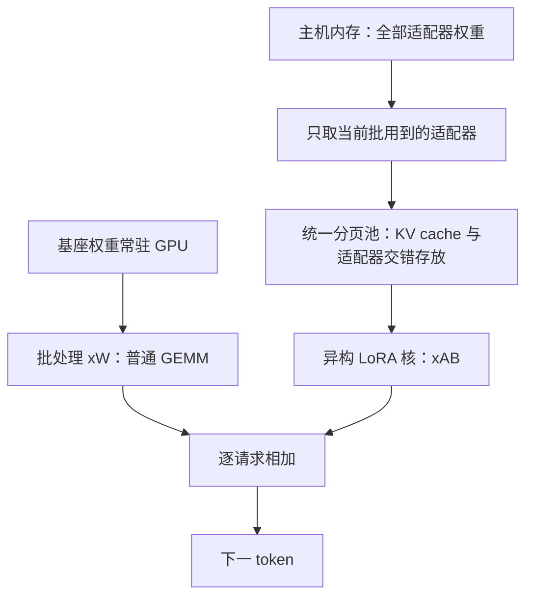

# S-LoRA：一张卡上同时伺候几千个 LoRA，别把基座复制几千遍

<!-- release-date: 2023-11-06 -->

**本文依据**：`S-LoRA: Serving Thousands of Concurrent LoRA Adapters`，arXiv 2311.03285v3（2024-06-05，16 页）。封面已印 *Proceedings of the 5th MLSys Conference*（Santa Clara，2024）。作者 Ying Sheng、Shiyi Cao（共同一作）等；Ying 部分工作在访问 UC Berkeley 期间完成，单位标注 UC Berkeley / Stanford / 上海交通大学。代码 `https://github.com/S-LoRA/S-LoRA`。首发日取 arXiv v1 提交日 2023-11-06；本地读的是 v3 / MLSys 2024 印本。文中数字标 `(PDF p. N)`；标「外部补充」的段落不来自本文。

## 一句话

LoRA 论文教你把适配器**熔进**基座，单模型推理零额外延迟。一旦同一台机器上要同时伺候很多任务专用适配器，熔进去等于复制很多份完整权重，批处理机会全没了。S-LoRA 反过来：**基座算一次批，适配器另算一次批**；权重全放主机内存，当前批次用到的才搬上 GPU；KV cache 和不同秩的适配器权重挤进同一套分页池。代价是多做一次便宜的 $xAB$，收益是单卡或单机多卡上同时伺候上千个适配器，相对 HuggingFace PEFT 吞吐最高约 30 倍、相对「朴素多副本 vLLM」最高约 4 倍（PDF p.1–2、p.8）。

## 一、矛盾：熔进去对单适配器是优点，对多租户是灾难

「先预训练、再微调」把一份基座拆成大量任务变体。LoRA 只在冻结的 $W$ 上加低秩修正 $AB$，可训参数往往比全量微调少几个数量级（论文举例可到 $10000\times$），精度仍能对齐（PDF p.2）。

原 LoRA 论文对**推理**的建议是把 $AB$ 熔进 $W$，得到

$$
h = xW' = x(W + AB) = xW + xAB
$$

熔完之后参数量和基座一样，**单适配器没有额外延迟**（PDF p.2）。多模型时它还建议现场加减 LoRA 权重来换适配器。两条路一起看：

| 做法 | 单适配器延迟 | 多适配器并发 | 卡在哪 |
|---|---|---|---|
| 熔进基座，每适配器一份完整模型 | 低 | 几乎没有 | GPU 里堆很多份 $W$，显存立刻炸 |
| 现场加减权重串行切换 | 单次还行 | 没有真正并发 | 吞吐掉、总延迟升；也没用主机内存放大适配器数量（PDF p.1） |

论文要服务的场景是个性化助手一类：**同一基座、几千甚至上百万用户各有一份适配器**（PDF p.1）。这时真正值钱的是「所有请求共享 $xW$」这一次大矩阵乘。熔进去等于把这次大矩阵乘拆成互不相干的很多份。

所以全文的设计选择是：**不要熔。** 在线把 $xAB$ 算出来加回去。$xAB$ 比 $xW$ 便宜得多，省下来的批处理收益远大于多出来的 LoRA 计算（PDF p.4）。

## 二、全景：三块拼在一起才叫 S-LoRA

系统搭在 LightLLM 上（PyTorch + Triton 的单模型服务框架，PDF p.6–7）。请求按 Orca 的**迭代级调度**：以 token 而不是整条请求组批，有空位就塞进正在跑的批，生成结束或触达停止条件再退出（PDF p.4）。

（机制示意，根据 PDF p.3 图 1、图 2。）

三块贡献对应后面三节（PDF p.2）：

1. **Unified Paging**：KV cache 和不同秩的适配器权重共用一块分页内存。
2. **异构批处理核**：不等长、不等秩、非连续内存上直接做 $xAB$，不靠大面积 padding 的 batched GEMM。
3. **S-LoRA TP**：多卡切分对齐 Megatron-LM 的基座切法，LoRA 的通信落在很小的中间张量上，大通信和基座的 all-reduce 熔在一起。

调度上还有两件可选的事：按适配器聚类、以及过载时的准入/早中止。它们不是吞吐曲线的主因，附录里有数。

## 三、批处理：基座一批、LoRA 一批

图 1 把计算画成两层（PDF p.3）：上面一条是所有请求共享的 $xW$（GEMM）；下面按适配器拆开 $x_i A_i B_i$，再用定制 CUDA 核批起来。

现成 BLAS 的 batch GEMM 要求整齐形状。真实在线流量里序列长度不同、适配器秩也不同（论文实验里同一设置可混 `{8}`、`{64,32,16,8}` 等，PDF p.7 表 1），硬 padding 会把利用率打穿。所以 LoRA 那一层不用「填齐再调库」，而用自己的核（细节在第五节）。

适配器总数可以很大，因为它们住在**主机内存**；当前批真正用到的份数受 GPU 显存和 batch size 限制，是管得住的。于是上界变成「主机内存能塞多少份 LoRA」，而不是「GPU 能复制多少份基座」（PDF p.4）。

### 适配器聚类：少几种活跃适配器，把显存让给 KV

解码阶段 GPU 常常算力吃不饱，batch 越大吞吐越高。若一个批里活跃适配器较少，就能把更多显存留给 KV cache。论文把「优先把同一适配器的请求打进同一批」叫做 adapter clustering（PDF p.4）。

代价是平均延迟和公平性。附录 A.2 在 $n=32$ 上扫聚类个数 $d$：吞吐和 SLO 达成率有可见但不大的波动；$\alpha$ 和到达过程的变异系数 $cv$ 较大时更明显；总体倾向是**较小的 $d$ 更好**（PDF p.15 图 11、图 12）。正文主实验默认仍是先来先服务（FCFS），没有把聚类当成默认必开项。

### 准入：SLO 保不住时主动丢掉已经没救的请求

SLO 定义为**首 token 在 6 秒内返回**的请求占比（PDF p.7）。系统容量固定、到达持续超过容量时，若不丢请求，队列会无限变长，SLO 必然全军覆没。S-LoRA 用 early abort 模拟准入：估计「还能在 SLO 内救下来的最近一批请求」，再按到达顺序服务（PDF p.4；数学在附录 B）。

附录把用户满意度写成首 token 延迟到 $[0,1]$ 的奖励 $r$，并证明：若 $r'\le 0$，在服务恰好 $l$ 条的约束下，最优是按到达顺序服务**最近的 $l$ 条**（PDF p.16 定理 B.1）。实现上用滑动平均估计到达率 $R_1$ 和每周期能吸入运行批的请求数 $R_2$，再结合历史最大 prefill 延迟：已经注定错过 SLO 的先 abort；过载时取最新的，队列在缩短时取最早的（PDF p.16）。图 10 上 Abort 优于 FCFS 和 LCFS，$cv$ 变大时差距更明显；FCFS 最差，因为它还在处理已经错过 SLO 的请求（PDF p.10）。

## 四、Unified Paging：把适配器当成另一种 KV

多适配器服务的新麻烦有两件（PDF p.4–5）：

1. **碎片**。不同秩的权重动态装上、卸下，再叠上不同长度请求的 KV 分配/释放。
2. **I/O**。从主机搬适配器到 GPU 的延迟。

论文的观察是：动态适配器权重和动态 KV cache 很像。

- 尺寸都变：KV 随序列长度 $S$ 变；适配器随秩 $R$ 变。生命周期都跟请求绑定。
- 形状都有一条公共边 $H$（隐层宽度）：一层里一条请求的 KV 是 $(S,H)$，一份 LoRA 权重是 $(R,H)$（PDF p.5）。

于是把 PagedAttention 从「只管 KV」扩成 **Unified Paging**：先静态划一大块缓冲（扣掉基座权重和临时激活），页大小是 $H$ 个元素。长度 $S$ 的 KV 占 $S$ 页，秩 $R$ 的 LoRA 占 $R$ 页；两者交错、非连续地躺在同一池里（PDF p.5 图 3）。碎片下来，batch 才能做大。

正文和目录里论文把这个词写成 Unfied / Unified 混用（PDF p.3、p.5），指的是同一件事。

### 预取：用等待队列猜下一批要哪些适配器

分页消碎片，搬权重的时间还在。解码当前批时，根据等待队列预测下一批需要的适配器，能塞进空页就先预取。多数时候下一批开跑前权重已经在 GPU 上，换适配器的 I/O 被计算盖住（PDF p.5）。

## 五、异构 LoRA 核：非连续、多秩、prefill 和 decode 两套

统一池意味着权重**不是连续的**。核必须自己 gather。

- **Prefill**：一次处理一串 token，从池里按不同秩 gather。核名叫 MBGMM（Multi-size Batched Gather Matrix-Matrix Multiplication），Triton 里做 tiling（PDF p.5）。
- **Decode**：一次一个 token，矩阵–向量。核名叫 MBGMV。他们写了 Triton 版，又改过一版更早的 Punica kernel，加上非连续内存、一批里多种秩、更细的 gather；实验里后者更快，主结果用后者（PDF p.5）。

Punica 是同期工作，也做「基座与适配器分解计算」。S-LoRA 声明：核性能分析不是本文重点（Punica 文里有），本文新的是内存管理与张量并行（PDF p.10）。CUTLASS 的 grouped GEMM 也可以做异构批，论文点到为止（PDF p.5）。

消融把完整 S-LoRA 和两个残缺版比（PDF p.7）：

- `S-LoRA-no-unify-mem`：去掉统一内存管理。
- `S-LoRA-bmm`：既无统一内存也无定制核，把权重拷回连续区、padding 后做 batched matmul。

图 5 上完整版吞吐更高、延迟更低；适配器数量增大时吞吐先因 LoRA 开销略降，过大约 100 个之后不再降——因为**当前批激活的适配器数被 GPU 批大小卡住，与仓库里总共有多少份无关**。再往后只受主机内存限制（PDF p.8）。

## 六、张量并行：LoRA 的通信要藏进基座的通信里

基座走 Megatron-LM：第一层权重按列切、第二层按行切，一次 all-reduce 把分片上的部分和加起来（PDF p.6 图 4）。LoRA 的切法故意对齐输入输出的切分，避免额外大通信。

用两层 MLP 讲清楚（自注意力把 QKV 投影看成 $W_1$、输出投影看成 $W_2$，按头维切，同一套，PDF p.6）：

- 第一层适配器 $A_1,B_1$ 都按列切，中间结果 all-gather。
- 第二层 $A_2$ 按行切、$B_2$ 按列切，中间 all-reduce。
- LoRA 结果加到基座的 `add_2` 上；**一次 all-reduce 就够攒出最终结果**——相当于把 `matmul_4` 需要的 all-gather 熔进最后的 all-reduce。论文说这套切法此前没见过（PDF p.6）。

通信账（PDF p.6）：

- 基座：一次 all-reduce，体积 $2(N-1)Bh/N$。
- 多出来的 LoRA：Q/K/V 三次 all-gather，输出一次 all-reduce，合计 $5(N-1)Br/N$。

因为 $r \ll h$，多出来的通信相对基座可以忽略。权重矩阵全部切分、没有整份复制，论文称内存意义上最优（PDF p.6）。

图 8：Llama-30B 在 2/4 张 A100 40GB、10 或 100 个适配器；Llama-70B 在 2/4 张 A100 80GB、10 个适配器。「带 LoRA 通信」和「去掉 LoRA 通信」差距很小；LoRA 的通信开销小于它带来的计算开销。2 卡换 4 卡时吞吐**超过 2 倍**——此时系统主要是显存墙，加卡是在松内存约束，所以超线性（PDF p.9）。图上的柱高 pdftotext 抽不出精确 req/s，这里只采用正文写明的比较关系。

脚注：Llama-70B 实验用的架构超参与官方模型不同，且**没有**用 grouped-query attention（PDF p.7）。不要把这组 70B 数直接当成 Llama-2-70B 官方结构的结果。

## 七、实验：能伺候多少份，以及快多少

### 配置

五组模型–秩组合（PDF p.7 表 1；编号跳过 S3，原文如此）：

| 设置 | 基座 | Hidden | 适配器秩 |
|---|---|---:|---|
| S1 | Llama-7B | 4096 | $\{8\}$ |
| S2 | Llama-7B | 4096 | $\{64,32,16,8\}$ |
| S4 | Llama-13B | 5120 | $\{64,32,16\}$ |
| S5 | Llama-30B | 7168 | $\{32\}$ |
| S6 | Llama-70B | 8192 | $\{64\}$ |

硬件：单卡 A10G 24GB、A100 40GB、A100 80GB，以及多卡 A100。主机内存随 GPU 配置从 64GB 到 670GB（PDF p.7）。合成流量用 Gamma 到达，各适配器均值 $\lambda_i$ 服从指数 $\alpha$ 的幂律，总到达率 $R$，变异系数 $cv$；输入/输出长度各自均匀采样。默认轨迹 5 分钟；默认 $(n,\alpha,R,cv,[I_l,I_u],[O_l,O_u])$ 见表 2（PDF p.7）。

基线（PDF p.7）：

- **HuggingFace PEFT**：按单适配器组批，批与批之间切换权重；没有高级批处理和内存管理。
- **vLLM m-packed**：vLLM 当时没有 LoRA，把权重熔进基座，每个适配器一份完整模型、一个 worker；多进程靠 NVIDIA MPS，显存按平均请求率比例切。

指标：吞吐、平均请求延迟、平均首 token 延迟、SLO 达成率，以及附录里更细的 user satisfaction（PDF p.7）。

### 和 PEFT、vLLM-packed：表 3

单卡 A100 80GB 吞吐（req/s）（PDF p.8 表 3）：

| 设置 | $n$ | S-LoRA | vLLM-packed | PEFT |
|---|---:|---:|---:|---:|
| S1 | 5 | 8.05 | 2.04 | 0.88 |
| S1 | 100 | 7.99 | OOM | 0.25 |
| S1 | 1000 | 7.64 | OOM | — |
| S1 | 2000 | 7.61 | OOM | — |
| S2 | 5 | 7.48 | 2.04 | 0.74 |
| S2 | 100 | 7.29 | OOM | 0.24 |
| S2 | 1000 | 6.69 | OOM | — |
| S2 | 2000 | 6.71 | OOM | — |
| S4 | 2 | 4.49 | 3.83 | 0.54 |
| S4 | 100 | 4.28 | OOM | 0.13 |
| S4 | 1000 | 3.96 | OOM | — |

读表：

- S-LoRA 在 $n=2000$（S1/S2）仍接近 $n=5$ 的吞吐，LoRA 额外开销很小。
- vLLM-packed 因多份完整权重，**少于 5 个适配器**就撞显存；且错过跨适配器批处理，同样 $n=5$ 时 S1 上 2.04 vs 8.05，大约 4 倍（摘要「up to 4 times」对的是这条线，PDF p.1、p.8）。
- PEFT 能靠换权重撑很多适配器，但没有连续批和 KV 分页。附录 A.1：A10G S1 上 S-LoRA 最大 batch 约 30，PEFT 约 6；再加不能跨适配器组批，200 个适配器时吞吐 0.17 req/s、平均延迟 1609.50 s、达成率 0.0（PDF p.15 表 4）。正文「相对 PEFT 最高约 30 倍」与表 3 的 8.05/0.88 以及 7.48/0.74 同量级；PEFT 在 $n\ge 1000$ 未测，因为小 $n$ 已经极慢（PDF p.8）。

图 6：扫到达率时吞吐、首 token 延迟、SLO 达成率的形状与上面一致；S-LoRA-bmm 的首 token 延迟超出图范围（PDF p.9）。

### 真实轨迹

从 LMSYS Chatbot Arena 日志降采样：Arena 本身是不同**基座**的流量，论文把它当成「同一基座上不同适配器」的分布来用（PDF p.8–9）。时长固定 5 分钟，平均输入 85 token、平均输出 165 token、适配器大约 26 个。图 7（S2，A10G 24GB）形状与合成流量类似（PDF p.9）。

### 熔权重 vs 当场算：图 9

对照设计：每批开始前把当前适配器熔进基座 $x(W+AB)$，等待队列太长再切到另一个适配器。这和 PEFT 不同——它仍有连续批和 PagedAttention（PDF p.9 脚注）。S2、A10G 24GB，$R=2$，$cv=1$，长度 $[8,512]$：

- **只有 1 个适配器**时，熔一次的做法更快（LoRA 计算省掉了）。
- **超过 2 个适配器**后当场计算反超，因为切换适配器让 GPU 空转。
- $\alpha$ 更小（请求更集中在少数适配器）会让熔权重那条线更差，因为批更碎（PDF p.10 图 9）。

一句话：LoRA 原论文的「熔进去」在单适配器世界是对的；多租户世界从第二个适配器起就不该再熔。

## 八、和谁有关、论文自己划的边界

相关工作里和本文最近的是 PetS：参数高效 Transformer 的统一服务，但只覆盖小的 encoder-only BERT，没有生成式推理、没有「超多适配器」、也没有单卡放不下的大模型（PDF p.10）。量化、稀疏、改结构可以和本文叠加（PDF p.10）。Prefix-tuning、P-Tuning、Prompt tuning、AdaLoRA、$(IA)^3$ 等 PEFT 方法，论文说多数技术可以迁过去，但实验只做了 LoRA（PDF p.10）。

结论里的后续：更多适配器方法、更好的融合核、用多 CUDA stream 让基座计算和 LoRA 计算重叠（PDF p.11）。**没写**的包括：跨机器调度、适配器热度感知的分层存储策略细节、与官方 Llama-2-70B GQA 结构对齐的多卡数、以及核级微秒对比（留给 Punica）。

## 九、可迁移的几条

1. **共享主干一旦存在，就不要为租户复制主干。** 熔权重是单租户延迟优化；多租户优化的是「主干批处理次数」。
2. **动态小张量和 KV 往往可以共用一套分页。** 公共维度 $H$ 让页大小有定义；秩和序列长度都变成「占几页」。
3. **异构批的第一反应不该是 padding。** 非连续 gather 核比「拷回连续区再调 batched GEMM」更贴这套内存布局。
4. **给基座加旁路时，先对齐已有并行切分。** 通信放在 $r$ 维中间结果上，大通信和主干熔在一起，$r\ll h$ 时旁路几乎免费。
5. **仓库规模 ≠ 运行批规模。** 适配器可以堆在主机内存里；GPU 只看见当前批。过了激活数饱和点，再加适配器不应再掉吞吐——直到主机内存顶住。
6. **过载时继续 FCFS 是在服务已经违约的请求。** 若奖励随等待递减，数学上该保最近还能救的那一截。

## 关键词回看

- **LoRA（Low-Rank Adaptation）**：冻结 $W$，只训 $A,B$，前向 $xW+xAB$。
- **Unified Paging**：KV 与适配器权重同一分页池，页宽 $H$。
- **MBGMM / MBGMV**：prefill / decode 上、多尺寸 gather 的 LoRA 核。
- **S-LoRA TP**：对齐 Megatron 的 LoRA 切分；额外通信 $5(N-1)Br/N$。
- **Adapter clustering / early abort**：少活跃适配器换更大 KV；过载时丢掉注定错过 SLO 的请求。

## 参考

- 论文 PDF：仓库 `readings/_src/推理服务与架构探索/S-LoRA.pdf`（arXiv 2311.03285v3）
- 代码：`https://github.com/S-LoRA/S-LoRA`
- 同期：Punica（Chen et al., 2023）；PagedAttention / vLLM；Orca；Megatron-LM；HuggingFace PEFT
