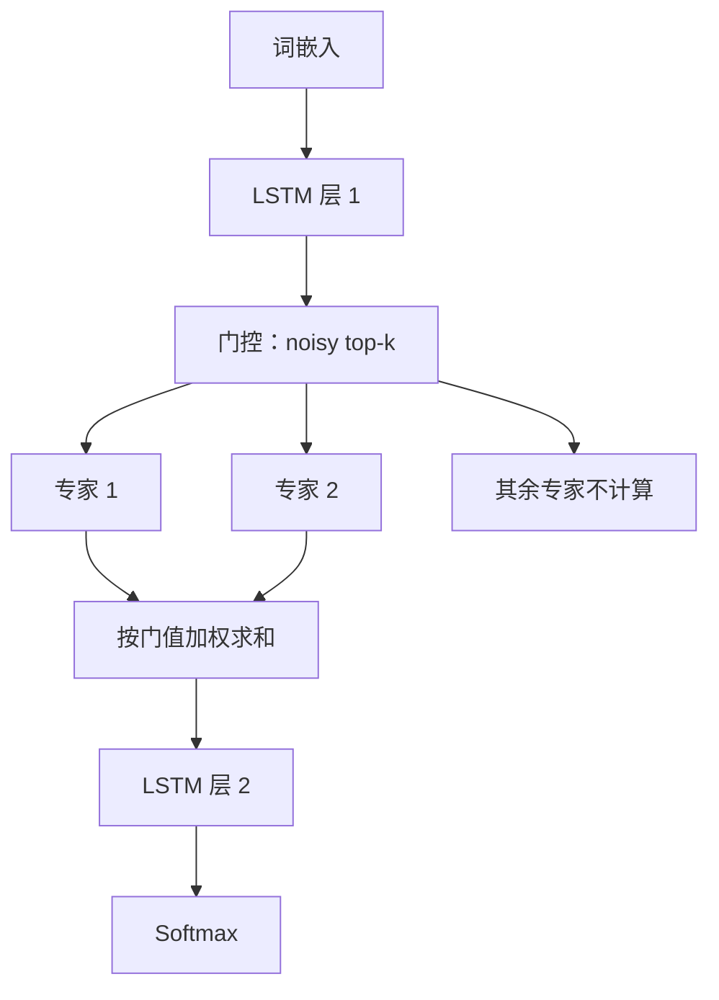

# Sparsely-Gated MoE：容量可以涨一千倍，算力却不必跟着涨

<!-- release-date: 2017-01-23 -->

**本文依据**：`Outrageously Large Neural Networks: The Sparsely-Gated Mixture-of-Experts Layer`，arXiv 1701.06538v1（2017-01-23，19 页）。作者 Noam Shazeer、Azalia Mirhoseini、Krzysztof Maziarz、Andy Davis、Quoc Le、Geoffrey Hinton、Jeff Dean；第一单位 Google Brain（Maziarz 署 Jagiellonian University）。封面印 *Under review as a conference paper at ICLR 2017*。文中数字标 `(PDF p. N)`。

## 一句话

整网每个样本都跑一遍时，数据变大、模型变大，训练成本大约按二次方涨。这篇把「条件计算」做成一层可插拔的稀疏门控混合专家：每个位置只叫醒少数几个前馈专家，参数可以堆到一千亿级，算力几乎不跟着涨。语言建模上，计算预算只有先前最优模型约 6% 时，10 个 epoch 的困惑度已经打过对方；机器翻译上，在更浅的 GNMT 骨架里塞进约 80 亿 MoE 参数，WMT’14 En→Fr 测到 40.56 BLEU（PDF p.1、p.7）。

## 一、矛盾：容量值钱，但「每例激活全网」付不起

深度学习的经验是：数据够大时，参数越多越准。文本、图像、语音都走过这条路。麻烦在于，典型网络对每个样本激活全部参数，于是**训练代价大约随「模型规模 × 样本数」二次膨胀**。算力和分布式系统跟不上（PDF p.1）。

理论上的出路叫**条件计算（conditional computation）**：网络的大部分按样本开关，容量涨、算力不按比例涨。门可以是二值或稀疏连续，随机或确定，训练可以用强化学习或反向传播（PDF p.1）。

论文说，此前没有人真正把容量、训练时间或质量推到「大规模赢」的程度，因为五件事叠在一起（PDF p.2）：

1. **GPU 擅长算术，不擅长分支。** 所以门控必须一次开关一大块，而不是细到单个神经元。
2. **大批次才能摊掉参数搬运和更新。** 条件计算会把「真正干活的那一块」的批次变小。
3. **设备间带宽可能是瓶颈。** GPU 集群的算力可以比合计互联带宽高几个数量级。嵌入层也是一种条件计算，但嵌入往往要过网，于是「样本 × 参数」的交互被带宽卡住，而不是被算力卡住。
4. **稀疏度和负载往往要额外损失项。** Bengio 等人（2015）用了三项；这会同时伤质量和负载均衡。
5. **容量真正值钱的地方是超大数据。** 先前条件计算文献多在最多约 60 万张图的识别集上；标签信号很难养活百万、更别说十亿参数。

全文要做的，就是把这五件事一次拆开，并在语言建模和机器翻译上给出「容量涨一千倍以上、算力损失不大」的实证（PDF p.1–2）。

## 二、全景：一层专家，夹在两层 LSTM 中间

做法不是把整网改成「顶层混合专家」，而是引入一种通用组件：**稀疏门控混合专家层（Sparsely-Gated Mixture-of-Experts Layer，MoE）**。里面是一批专家（每个都是简单前馈网），外加一个可训练的门控网，为每个输入挑一个稀疏组合。整网用反向传播一起训（PDF p.2）。

语言任务上，他们把 MoE **按位置卷积式地**插在堆叠 LSTM 之间：文本每个位置调一次 MoE，每次可以挑不同专家。附录里能看到专家按句法、语义高度分化（PDF p.3；附录 E 表 9）。

（机制示意，根据 PDF p.2 图 1、第 2 节。）

和二十多年前 Jacobs / Jordan 的混合专家传统比，旧工作多半把 MoE 当成**整个模型**。Eigen 等人（2013）把多层 MoE 嵌进深度网，并在结论里提到稀疏化。本文沿这条线往前走：卷积式应用让**每个位置各自做门控**，并且把稀疏门做成能真正放大容量的工程手段（PDF p.3）。

## 三、层怎么算：稀疏门值直接省掉专家前向

设有 $n$ 个专家 $E_1,\ldots,E_n$，门控输出 $G(x)$ 是稀疏的 $n$ 维向量。MoE 输出是（PDF p.3 式 1）

$$
y = \sum_{i=1}^{n} G(x)_i E_i(x)
$$

$G(x)_i=0$ 时不必算 $E_i(x)$。实验里专家可以到上千，每个样本只评少数几个。专家再多，可以用两层层次 MoE：一级门控挑若干「专家」，每个「专家」自己又是一个带门控的 MoE（PDF p.3；细节在附录 B）。

原则上专家只需输入输出尺寸一致。本文先限定为**结构相同、参数分开的前馈网**（PDF p.3）。

专家若只是权重矩阵，接近 Cho 与 Bengio（2014）的参数化权重；若有一层隐层，接近 Bengio 等人（2015）夹在全激活层之间的分块 dropout（PDF p.3）。

## 四、门控：Softmax 不够，要噪声加 top-k

### 稠密 Softmax

最简单的非稀疏门是输入乘可训矩阵 $W_g$，再 Softmax（PDF p.4 式 2）：

$$
G_\sigma(x) = \mathrm{Softmax}(x \cdot W_g)
$$

这会叫醒所有专家，省不了算。

### Noisy Top-K

在 Softmax 之前做两件事：**加可调高斯噪声，只留最大的 $k$ 个，其余置为 $-\infty$**（对应门值为 0）。稀疏用来省算。这种截断会在门函数上制造「理论上吓人的不连续」，作者说实践里还没看成问题。噪声用来帮负载均衡（附录 A）。每个分量的噪声幅度由第二张可训矩阵 $W_{\mathrm{noise}}$ 控制（PDF p.4）：

$$
G(x) = \mathrm{Softmax}(\mathrm{KeepTopK}(H(x), k))
$$

$$
H(x)_i = (x \cdot W_g)_i + \mathrm{StandardNormal()} \cdot \mathrm{Softplus}((x \cdot W_{\mathrm{noise}})_i)
$$

$\mathrm{KeepTopK}$：若 $v_i$ 在 $v$ 的前 $k$ 大里则保留，否则 $-\infty$（PDF p.4 式 3–5）。

### 怎么训门

门和其余部分一起反向传播。若 $k>1$，前 $k$ 个专家的门值对门权重有非零导数；梯度也会穿过门控回到它的输入。这和 Bengio 等人（2013）对带噪声整流器的「偶尔敏感」类似，但不同于 Bengio 等人（2015）用布尔门加 REINFORCE（PDF p.4）。

**可迁移**：想稀疏，就不要把 $k=1$ 当成默认——$k>1$ 才让门有可导的竞争。噪声不是装饰，是后面负载估计可微的前提。

## 五、性能：批次在缩、带宽在卡

### 缩小批次

现代 CPU/GPU 需要大批次摊参数加载。若每例从 $n$ 个专家里挑 $k$ 个，大小为 $b$ 的批里，每个专家大约只拿到 $kb/n$ 例，远小于 $b$。专家一多，朴素实现会立刻变慢。批次又受「前向激活要存到反向」的显存限制（PDF p.4）。

论文给出三条放大批次的路：

**1. 数据并行和模型并行混用。** 常规分布式是多份模型异步跑不同批、靠参数服务器同步。这里让这些批**同步**，好在 MoE 层合并。普通层和门控按数据并行；每个专家只保留一份共享副本。每个专家收到来自所有数据并行批的相关样本。同一组设备既当数据并行副本，又当模型并行分片（各托管一部分专家）。若分布在 $d$ 台设备、每台批大小 $b$，每个专家大约拿到 $kbd/n$ 例，专家批次放大 $d$ 倍（PDF p.4）。

层次 MoE 里，一级门数据并行，二级 MoE 模型并行，每个二级 MoE 住在一台设备上（PDF p.4）。

加设备就能加专家、加参数：总批次涨，**每专家批次保持不变**；每设备的内存和带宽需求、步时、以及「处理与参数量相当的训练样本」所需时间都保持不变。作者的目标是万亿参数、万亿词；写这篇时还没扩到那一步，但认为加硬件应当可行（PDF p.5）。

**2. 利用卷积性。** 语言模型对上一层每个时间步用同一个 MoE。等上一层算完，可以把所有时间步合成一个大批，MoE 输入批次放大「展开步数」倍（PDF p.5）。

**3. 若 MoE 要循环用。** 例如把 LSTM 的权重矩阵换成 MoE，则下一步输入依赖上一步 MoE 输出，卷积技巧失效。作者提到 Gruslys 等人（2016）用重计算大幅减少展开 RNN 里存储的激活，从而允许更大批次——这是设想，不是本文主实验（PDF p.5）。

### 网络带宽

专家是驻留的，门参数很少，通信主要是专家输入输出过网。要保持算力效率，**专家计算量 / 输入输出体积** 必须超过设备的「算力 / 网络容量」比；对 GPU 这可能是几千比一。实验里每个专家一层、数千 ReLU 隐单元。权重形状是 $\mathrm{input}\times\mathrm{hidden}$ 和 $\mathrm{hidden}\times\mathrm{output}$，计算相对输入输出的比就等于隐层大小。把隐层做大或加层，就能直接提高计算效率（PDF p.5）。

**可迁移**：稀疏 MoE 不是「专家越多越省」。专家变多，单专家批次变小、过网的是激活不是权重。工程上要同时保（同步合并批次、专家够深够宽、专家驻留）。

## 六、负载：门会塌到少数专家，平方变异系数是软约束

作者观察到：门控容易收敛到**总是给同一小撮专家很大的权重**。这会自我加强——受宠的专家训得更快，门更爱选它们。Eigen 等人（2013）用训练初期硬约束躲开这个局部极小；Bengio 等人（2015）对每个门的批平均加软约束（PDF p.5）。

本文走软约束。相对一批样本，专家 $i$ 的**重要性（importance）**是该批上门值之和。再加一项损失 $L_{\mathrm{importance}}$：重要性向量的**变异系数（coefficient of variation，CV）的平方**，乘上手调系数 $w_{\mathrm{importance}}$。它鼓励所有专家重要性相等（PDF p.5 式 6–7）：

$$
\mathrm{Importance}(X) = \sum_{x \in X} G(x)
$$

$$
L_{\mathrm{importance}}(X) = w_{\mathrm{importance}} \cdot \mathrm{CV}(\mathrm{Importance}(X))^2
$$

脚注：Bengio 等人还有两项——逐例稀疏（本文用固定 $k$ 硬保证，不需要）和门值多样性。作者发现专家分化后门值会自然多样化，不必再强迫多样性（PDF p.5）。

重要性相等仍可能**收到的例数差很多**：一个专家拿少数大权重，另一个拿许多小权重。分布式上这会爆内存、打歪性能。于是再引入 $L_{\mathrm{load}}$（PDF p.6；定义在附录 A）。

### 附录 A：可微的负载，以及「危险的平方常数」

例数是离散的，不能直接反传。用噪声把门「是否被选中」变成平滑概率：固定其他分量已采的噪声，只对第 $i$ 个分量重新采噪声时，$G(x)_i$ 非零的概率记为 $P(x,i)$。$G(x)_i$ 非零当且仅当 $H(x)_i$ 大于 $H(x)$ 里除掉自己后的第 $k$ 大。于是（PDF p.13 式 8–10）

$$
P(x,i) = \Phi\left(\frac{(x\cdot W_g)_i - \mathrm{kth\_excluding}(H(x),k,i)}{\mathrm{Softplus}((x\cdot W_{\mathrm{noise}})_i)}\right)
$$

$\Phi$ 是标准正态 CDF。$\mathrm{Load}(X)_i=\sum_{x\in X}P(x,i)$，再

$$
L_{\mathrm{load}}(X) = w_{\mathrm{load}} \cdot \mathrm{CV}(\mathrm{Load}(X))^2
$$

CV 是标准差除以均值。对它**再平方**，损失对「已经很不均衡」极度敏感：稍有偏斜就被二次放大。这就是后文常说的「危险的平方常数」——它不是魔法超参，而是故意用 $CV^2$ 把负载塌缩打得很疼。手调的只是前面的 $w$。

初始化：软约束要过一会儿才生效，为免一上来 OOM，把 $W_g$ 和 $W_{\mathrm{noise}}$ **全置零**——没有信号、只有噪声，初始负载大致均匀（PDF p.13）。

消融（同一套 MoE-256，训 10 epoch，表 6，PDF p.13）：

| $w_{\mathrm{importance}}$ | $w_{\mathrm{load}}$ | 测试困惑度 | $\max(\mathrm{Load})/\mathrm{mean}(\mathrm{Load})$ |
|---:|---:|---:|---:|
| 0.0 | 0.0 | 39.8 | 17.80 |
| 0.2 | 0.0 | 35.6 | 1.47 |
| 0.0 | 0.2 | 35.7 | 1.15 |
| 0.1 | 0.1 | 35.6 | 1.14 |
| 0.01 | 0.01 | 35.7 | 1.37 |
| 1.0 | 1.0 | 35.7 | 1.07 |

两条损失至少留一条，质量就从 39.8 掉到约 35.6–35.7；没有损失时最忙专家负载是均值的 17.8 倍。$w_{\mathrm{load}}$ 越大，最忙专家越接近均值（PDF p.14）。

**可迁移**：负载均衡至少要两件独立的事——门值总和（重要性）和实际例数（负载）。只做前者，硬件仍可能被「多例小权重」打穿。$CV^2$ 很猛，权重可以从 0.01 扫到 1，质量在这张表上几乎不动，变的是峰值负载。

## 七、语言建模：算力钉死，容量还能换困惑度

### 十亿词基准

数据：Chelba 等人（2013）新闻句，约 8.29 亿词，词表 793,471（PDF p.6）。先前最优是 Jozefowicz 等人（2016）的堆叠 LSTM，LSTM 层参数从 2M 到 151M，质量和算力都随参数涨（PDF p.6）。

本文结构：两层 LSTM，中间夹 MoE（图 1）。细节、基线和完整数字在附录 C。

**低算力、变容量。** 前向（不含 softmax）约 **800 万乘加 / 样本 / 时间步**，记为 ops/timestep。平坦 MoE：4 / 32 / 256 专家；层次 MoE：256 / 1024 / 4096 专家。每专家约 100 万参数；每次输入激活 4 个专家。4 个专家始终全开的模型与算力匹配基线差不多；最大模型（4096 专家）测试困惑度低 **24%**（PDF p.6）。

**高容量、变算力。** 再训两个约 **40 亿参数**、算力更高的 MoE：更大 LSTM、更少但更大的专家（附录 C.2）。三者构成图 2 右下沿（PDF p.6–7）。

表 1（PDF p.7；相对 Jozefowicz 等人）：

| 模型 | 测试困惑度 10 epoch | 测试困惑度 100 epoch | 参数（不含嵌入与 softmax） | ops/timestep | 训练（10 epoch） | TFLOPS/GPU |
|---|---:|---:|---:|---:|---|---:|
| 先前最优 | 34.7 | 30.6 | 151M | 151M | 59 小时，32×K40 | 1.09 |
| 低预算 MoE | 34.1 | — | 4303M | 8.9M | 15 小时，16×K40 | 0.74 |
| 中预算 MoE | 31.3 | — | 4313M | 33.8M | 17 小时，32×K40 | 1.22 |
| 高预算 MoE | 28.0 | — | 4371M | 142.7M | 47 小时，32×K40 | 1.56 |

控制训练 epoch 时，最快的 MoE 已经超过先前最优，算力只要约 **6%**（PDF p.7）。高预算 MoE 10 epoch 困惑度 28.0，相对先前最优同 epoch 的 34.7 低 **18%**（附录 C.2，PDF p.16）。

效率：TensorFlow，16–32 块 Tesla K40。TFLOPS/GPU = 一批的浮点运算 /（步时 × GPU 数）。这里的运算包含反向、softmax 的重要性采样，且一次乘加算两次操作。MoE 模型里专家相关浮点占总量 **37%–46%**。无 MoE 基线 1.07–1.29 TFLOPS/GPU；低算力 MoE 0.74–0.90（4 专家没用满并行）；最高算力 MoE 1.56，作者归因于更大矩阵。NVIDIA 标称峰值 4.29 TFLOPS/GPU（PDF p.7；细表见附录 C 表 7）。

附录 C 结构（PDF p.14–15）：嵌入、LSTM、MoE、LSTM、softmax；嵌入维、LSTM 单元、MoE 输入输出都是 512。除 softmax 外对输出 dropout，再残差加回。每专家隐层 1024 ReLU、输出 512，参数 $[512\times1024]+[1024\times 512]=1\mathrm{M}$。MoE 输出过 sigmoid 再 dropout。层次 MoE 第一层分支因子 16，对应 16 块 GPU。平坦 $k=4$，层次每层 $k=2$，故每例恰好 4 专家、4M ops；两层 LSTM 各 2M，合计 8M。

算力匹配稠密基线：MoE-1-Wide（一个隐层 4096）、MoE-1-Deep（四个隐层 1024）、4×LSTM-512、LSTM-2048-512（复现 Jozefowicz，结果接近发表值）。训练：16×K40 同步，每批约 30 万词，限 10 epoch（27,000 步），多数 12–16 小时，MoE-4 因专家只在 4/16 卡上而 18 小时。Adam；学习率先线性升 1000 步，再按步数平方根倒数降。$w_{\mathrm{importance}}=w_{\mathrm{load}}=0.1$（PDF p.15）。

表 7 摘关键行（10 epoch 测试困惑度，PDF p.15）：LSTM-2048-512 复现 44.7；MoE-4 为 45.0；MoE-32 为 39.7；MoE-256 为 35.7；MoE-4096-h 为 34.1。无稀疏的「加宽/加深一个专家」几乎帮不上（46.1 / 45.7），真正拉开的是**专家数量带来的容量**。

### 一千亿词 Google News

十亿词上，MoE 参数过约 10 亿后增益变钝（图 2 左）。作者假设训练集更大时，更高容量仍有用（PDF p.7）。内部新闻语料约 1000 亿词。算力仍约 8M ops/timestep。专家数：32、256、1024、4096、16384、65536、131072，MoE 层最多 **1370 亿参数**（PDF p.8）。

图 3：训 100 亿词与 1000 亿词两条曲线。全量 1000 亿词时，困惑度显著改善直到 **65536 专家（680 亿参数）**，比算力匹配基线低 **39%**；**131072 专家反而变差**，作者怀疑稀疏过度。两条曲线缺口拉大，说明大数据集上容量更值钱。65536 专家时层稀疏度 99.994%，效率仍有 0.72 TFLOPS/GPU（PDF p.8）。

附录 D（PDF p.16–17）：32 专家用平坦 MoE，其余层次化；一级分支因子分别为 32、32、64、128、256、256。32×K40，最后两个模型用 64 和 128 卡以装下参数。批约 250 万词，一遍扫过约 1000 亿词。为在每卡装到约 10 亿参数：专家隐层激活反向时重算；Adam 对专家参数 $\beta_1=0$ 去掉一阶矩；二阶矩用行列均值的外积除以其中一者的均值做分解近似，也可用于 Adagrad。

表 8（1 epoch 测试困惑度，PDF p.16）：4×LSTM-512 为 47.0；MoE-65536-h 为 28.9（排除嵌入与 softmax 后 68791M 参数，总 68.9B，0.72 TFLOPS）；MoE-131072-h 为 29.2（137577.6M，总 137.7B，**0.30 TFLOPS**）。最大模型效率很低，作者说是为了和其他模型对比，**没有按 GPU 数同比加大训练批次**（PDF p.17）。Kneser-Ney 5-gram 分别在 130 亿 / 1300 亿词上训，比神经模型的最多 1000 亿词略占便宜（PDF p.17 脚注）。

## 八、机器翻译：更浅的 GNMT，塞进约 80 亿 MoE

骨架改自 Wu 等人（2016）的 GNMT：编码器 LSTM 从 9 层减到 3，解码器从 8 减到 2，以省算力。编码器第 2–3 层之间、解码器第 1–2 层之间各插一层 MoE。每层最多 2048 专家、每专家约 200 万参数，一共约 **80 亿**额外参数（PDF p.8）。细节在附录 E。

数据：WMT’14 En→Fr 3600 万句对、En→De 500 万句对；newstest2014 作测试，newstest2012+2013 作开发集。另测 Google 生产英→法（PDF p.8）。

表 2 WMT’14 En→Fr newstest2014（PDF p.8）：

| 模型 | 测试困惑度 | 测试 BLEU | ops/timestep | 总参数 | 训练 |
|---|---:|---:|---:|---:|---|
| MoE 2048 | 2.69 | 40.35 | 85M | 8.7B | 3 天 / 64×K40 |
| MoE 2048（更长） | 2.63 | **40.56** | 85M | 8.7B | 6 天 / 64×K40 |
| GNMT | 2.79 | 39.22 | 214M | 278M | 6 天 / 96×K80 |
| GNMT+RL | 2.96 | 39.92 | 214M | 278M | 6 天 / 96×K80 |

表 3 En→De（PDF p.8）：MoE 2048 困惑度 4.64、BLEU **26.03**（1 天 / 64×K40）；GNMT 5.25 / 24.91；GNMT+RL 8.08 / 24.66。

表 4 生产英→法（PDF p.8）：MoE 测试 BLEU **36.57** vs GNMT 35.56；训练 1 天 / 64×K40 vs 6 天 / 96×K80。

作者强调模型**没有** RL 精炼，相对 Wu 等人（2016）的强基线，En→Fr / En→De 分别高 **1.34 / 1.12 BLEU**，困惑度也更好（相对同一套分词）。生产数据上，只训六分之一时间，测试 BLEU 仍高 1.01（PDF p.9）。

图 4：En→Fr 与生产数据上，专家数增到 2048，测试困惑度继续降。训练初期模型差距大，因为批次不同；除「0 专家」外算力预算同为 85M ops/timestep（PDF p.18）。

### 多语种：一份 MoE 打十二对

Johnson 等人（2016）用单个 GNMT 训十二个语言对，比十二个分对 GNMT 差——十二份模型有十二倍容量和十二倍合计训练。本文用**一个** MoE 增强模型，同一数据、同样约 **30 亿句对**，因算力预算更低，墙钟更短（PDF p.9）。

表 5（PDF p.9）：MoE-Multi 开发集困惑度 3.35 vs 多语 GNMT 4.14（**-19%**）。12 对里 **11 对** BLEU 显著超过多语 GNMT（最多 +5.84，韩→英），**8 对**超过单语 GNMT。英→韩差：16.62 vs 多语 18.41、单语 19.75，作者归为严重过训——稀有语言对在语料里被高度过采样。规格：单语 GNMT 每模型 278M / 212M ops；多语 GNMT 278M / 212M，21 天 96×K20；MoE-Multi 8.7B / 102M ops，12 天 64×K40。

附录 E 架构（PDF p.17）：层输入输出 512；LSTM 2048 隐单元、512 维输出投影；LSTM 与 MoE 都加残差；wordpiece，共享 32K 词表；束搜索同 GNMT。单语：另训无 MoE 基线、32 平坦、512 / 2048 层次；平坦 $k=4$，层次每层 $k=2$；每专家隐层 2048，$[512\times2048]+[2048\times512]=2\mathrm{M}$；MoE 输出过 sigmoid；单语用附录 F 的严格均衡门。多语：改回 2.1 节 noisy top-k，非层次 $n=512$、$k=2$，隐层 8192，MoE 计算加倍，整模从 85M 升到 102M ops/timestep。Adam；学习率 2000 步线性升、再持平 8000、再按平方根倒数降。单语 dropout 0.4。最多 64 GPU 同步，每卡每批约 16000 词。$w_{\mathrm{importance}}=w_{\mathrm{load}}=0.01$。BLEU 用 Moses `multi-bleu.pl` 的分词 BLEU。

表 9：WMT En→Fr 编码器 2048 专家里，按 $G(x)_i$ 排序看上下文。例如某专家专管不定冠词 “a” 引出「重要性/领导」类动词短语的直接宾语（PDF p.18）。

### 附录 F：严格均衡门（单语 MT 的基础设施补丁）

当时基础设施在「每专家批次完全相等」时更快（后来已修），于是换了一套门：先 Softmax，再乘稀疏掩码并归一化（PDF p.18–19 式 15–16）。Top-k 掩码按例保留前 $k$。**Batchwise 掩码**改为对每个专家在整批上保留前 $m$ 个，$m=k|X|/n$，于是平均每例仍进 $k$ 个专家，且每专家例数严格相同（PDF p.19 式 18）。

推理时往往没有大批，不能用 batchwise。做法是训一个每专家阈值向量 $T$，推理用 $x_i>T_i$（PDF p.19 式 19）。训练再加 $L_{\mathrm{batchwise}}$，在两种掩码不一致时把 $X_{j,i}-T_i$ 往一致方向推（式 20）。作者引用 Ioffe 与 Szegedy（2015）：训练用批统计，推理必须另找替代。

### 附录 G：注意力为了矩阵乘改了一下

GNMT 的注意力是 $V^\top\tanh(x_i U + y_j W)$。本文改成两个 tanh 相乘再点 $V$，以便多个源步、目标步用优化过的矩阵乘一起算；作者说质量差别很小（PDF p.19 式 21–22）。这是实现细节，不是主贡献。

## 九、层次 MoE：分支因子太大时拆两层

附录 B（PDF p.14）：一级门 $G_{\mathrm{primary}}$ 挑若干二级 MoE，每个二级再有自己的门。$a$ 组、每组 $b$ 个专家时（式 12）

$$
y_H = \sum_{i=1}^{a}\sum_{j=1}^{b} G_{\mathrm{primary}}(x)_i \cdot G_i(x)_j \cdot E_{i,j}(x)
$$

重要性变成两级门值乘积再按批求和。负载要把一级 Load 和二级 Load 乘起来再按「一级选中的子集」归一，否则对一级门没有梯度。作者说没发现需要更深的层次。

## 十、局限、没写的，以及能带走的

**实验支持的：**

- 条件计算可以在 GPU 集群上做到「容量 ≫ 1000×、效率只小幅掉」，前提是稀疏大块专家、同步合并批次、专家够宽、负载软约束（PDF p.1–2、p.7）。
- 算力钉死时空洞容量仍能换语言建模质量；数据从 10 亿词到 1000 亿词，容量的边际收益变大（图 2、图 3）。
- 翻译上，更浅循环骨架 + 大 MoE，用更少 ops、更弱的卡（K40 vs K80），BLEU 超过当时 GNMT；多语一份模型在 11/12 对上超过多语 GNMT（PDF p.8–9）。

**作者观察、不是定理：**

- top-k 的不连续「实践中还没事」（PDF p.4）。
- 131072 专家变差「可能是太稀疏」（PDF p.8）。
- 英→韩变差归过采样过训（PDF p.9）。
- 专家会按句法/语义分化（表 9 是例子，不是全面语言学分析）。

**没做成或没公开的：**

- 万亿参数 / 万亿词只是目标，本文没扩到（PDF p.5）。
- 循环 MoE（替换 LSTM 权重）只是猜想，主实验是「LSTM 之间卷积式 MoE」（PDF p.5）。
- 图像等其他模态：结论只说「数据够大时可能有用」，没有实验（PDF p.9）。
- 单语翻译用过后来废弃的严格均衡门，和正文 noisy top-k 不是同一套（附录 F）。
- 最大 News 模型 0.30 TFLOPS 被批次没同比放大污染，不能直接当「专家越多效率必然崩」的证据（PDF p.17）。

**可迁移（不依赖 2017 年的 K40 集群）：**

1. **把容量和算力拆开**：服务/训练预算应用激活专家数和隐层宽度来花，用专家总数来堆知识。
2. **门必须可导且 $k>1$**，再用噪声让负载估计可微。
3. **重要性 ≠ 负载**：门值和例数要分开约束；$CV^2$ 很猛，先保别塌缩，再调 $w$。
4. **稀疏会缩小单专家批次**：要用同步合并、卷积拼时间步、或重计算换批次；专家要够深够宽，让计算/通信比压过 GPU 的带宽墙。
5. **稀疏不是越大越好**：News 上 13 万专家已经走回头。先看每专家是否还能拿到稳定批次。
6. **多任务/多语种**是 MoE 的自然场景：一份共享骨架、专家按位置分化，往往比「一个小模型扛所有任务」更划算——但也要防稀有任务过采样过训。

结论原文把自己定位为「深度网里条件计算第一次拿到大胜」；文本只是他们选的战场（PDF p.9）。今天的 Switch Transformer、GShard、DeepSeek-MoE 走的仍是这一层的因果链：稀疏门、负载、专家并行、容量与算力解耦。那些是后话，不在这 19 页里。
