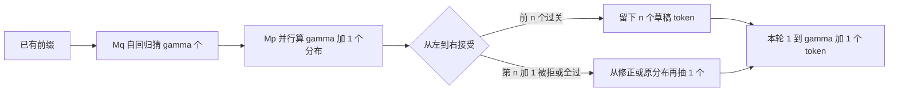

# Speculative Decoding：小模型先猜，大模型一次验一串，分布不变

<!-- release-date: 2022-11-30 -->

**本文依据**：`Fast Inference from Transformers via Speculative Decoding`，arXiv `2211.17192v2`（18 May 2023，13 页）；封面已印 ICML 2023（*Proceedings of the 40th International Conference on Machine Learning*，PMLR 202，Honolulu）。作者 Yaniv Leviathan、Matan Kalman、Yossi Matias；第一单位 Google Research。首发日取 arXiv v1 提交日 2022-11-30。文中数字标 `(PDF p. N)`，页码是这份 PDF 文件页。标「外部补充」的段落不来自本文。

## 一句话

自回归解码每吐一个 token 就要把大模型再跑一遍，步与步串行。这篇把 CPU 里的**推测执行**搬到随机采样：用更便宜的近似模型 $M_q$ 先猜 $\gamma$ 个 token，目标模型 $M_p$ 一次并行验完整串；用 **speculative sampling** 决定接受还是从修正分布里补一个。最坏仍至少出一个 token，最好一次出 $\gamma+1$ 个。对现成 T5-XXL，相对标准 T5X 实现，墙钟延迟 **2X–3X**，输出分布与只跑 $M_p$ 相同（PDF p.1）。

## 一、矛盾：大模型慢，不只是因为算力不够

大 Transformer 一步就比小模型慢，更糟的是 $K$ 个 token 要串行跑 $K$ 次（PDF p.1）。加速路线当时大致两类：

- 对**所有**输入一律降成本：蒸馏、稀疏、量化、改结构（PDF p.1）。
- **自适应计算**：难的步用大模型，容易的步用小模型或早停（PDF p.1）。

后一类抓住了「不是每一步一样难」，但通常要改结构、改训练、重训，而且**不保证输出和原模型一样**（PDF p.1）。

作者再加一条观察：大模型推理经常**不是卡在算术量**，而是卡在显存带宽和通信。机器上往往还有空算力。于是他们不走「少算」，而走「多并发」：在空算力上把好几步一起验掉（PDF p.1）。

约束写死三条：不改架构、不改训练、不改输出分布。手段是推测执行（speculative execution）：先干一件「多半用得上」的活，再核对它是不是真需要（PDF p.1）。经典例子是分支预测。这里要把同一思想推广到**随机**设定——一件事只以某个概率被需要（PDF p.1–2）。

## 二、全景：猜 $\gamma$ 个，验 $\gamma+1$ 个分布，至少收下 1 个 token

记 $M_p$ 为目标模型，条件分布 $p(x_t \mid x_{<t})$；$M_q$ 为更便宜的近似模型，分布 $q(x_t \mid x_{<t})$（PDF p.2）。一步：

1. $M_q$ 自回归地猜 $\gamma$ 个补全。
2. $M_p$ **并行**评估这 $\gamma$ 个猜测以及再往后一步，一共 $\gamma+1$ 个位置上的分布。
3. 按 speculative sampling 从左到右接受能保持分布的猜测；第一个被拒的位置从修正分布再抽一个；若全部接受，再从 $M_p$ 抽一个额外 token（PDF p.2）。

因此 $M_p$ 的一次并行前向**至少**产 1 个新 token（最坏不差于普通自回归），最多 $\gamma+1$ 个（PDF p.2）。

图 1 的无条件语言模型例子：38 个 token 的句子，大模型（97M）只串行跑了 9 次，靠小模型（6M）当草稿；生成该句的概率不变。第一行里目标模型只跑一次，就收下 5 个 token（PDF p.2）。

（机制示意，根据 PDF p.2–3 Algorithm 1。）

argmax、top-k、nucleus、温度，都可以先把 logits 改成一个调整后的概率分布，再当成「标准采样」。后文的 $p$、$q$ 都是调整之后的分布（PDF p.2–3）。

## 三、Speculative sampling：小模型抽的样本，大模型按比值决定留不留

目标是抽 $x \sim p(x)$。做法不是直接从 $p$ 抽，而是先从 $q$ 抽一个 $x$：

- 若 $q(x) \le p(x)$，留下。
- 若 $q(x) > p(x)$，以概率 $1 - p(x)/q(x)$ 拒绝，再从修正分布

$$p'(x) = \mathrm{norm}\bigl(\max(0, p(x) - q(x))\bigr)$$

抽一次（PDF p.3）。附录 A.1 证明：对任意 $p$、$q$，这样得到的 $x$ 仍服从 $p$（PDF p.11）。

直觉：小模型在某个 token 上「过于自信」时，不能无条件收下，否则会把 $p$ 里较稀的质量抬高；拒绝后用 $p-q$ 的正部补回去，正好把多出来的质量抠掉。

单步可以想成：用 $M_q$ 抽 $x_1$，同时让 $M_p$ 在 `prefix` 和 `prefix+[x1]` 上并行算分布。$x_1$ 被拒就丢掉对 $x_2$ 的那次计算，从修正分布重抽 $x_1$；$x_1$ 被接受则两个都留（PDF p.3）。Algorithm 1 把这件事扩到一次处理 $\gamma$ 个猜测（PDF p.3）：

1. 对 $i=1\ldots\gamma$，用 $M_q$ 在当前前缀上得到 $q_i$，抽 $x_i$。
2. 一次并行：$M_p$ 在 `prefix`、`prefix+[x1]`、…、`prefix+[x1…xγ]` 上得到 $p_1,\ldots,p_{\gamma+1}$。
3. 抽 $r_i \sim U(0,1)$，取第一个满足 $r_i > p_i(x_i)/q_i(x_i)$ 的位置之前的长度 $n$（若全过则 $n=\gamma$）。
4. 若 $n<\gamma$，把 $p_{n+1}$ 改成 $\mathrm{norm}(\max(0, p_{n+1}-q_{n+1}))$；否则用未改的 $p_{\gamma+1}$。从该分布抽一个 $t$。
5. 返回前缀加上 $[x_1,\ldots,x_n,t]$（PDF p.3）。

和经典拒绝采样不同。经典拒绝采样要用 $M=\max_x p(x)/q(x)$ 做上界，接受率被这个全局最大值拖得很低。非迭代版拒绝采样在失败时退回从原 $p$ 抽样，期望接受率不超过本文的 $\alpha$，通常低得多（PDF p.11 Appendix A.2）。

## 四、分析：接受率 $\alpha$ 决定一次能吐多少

**接受率** $\beta$：给定前缀，从 $q$ 抽的 $x_t$ 被 speculative sampling 接受的概率（PDF p.3）。若假设各步 $\beta$ 独立同分布，记 $\alpha=\mathbb{E}(\beta)$，则一次 Algorithm 1 产出的 token 数是**封顶几何分布**：成功概率 $1-\alpha$（「这一步被拒」），上限 $\gamma+1$。期望为

$$\mathbb{E}(\text{本轮 token 数}) = \frac{1-\alpha^{\gamma+1}}{1-\alpha}$$

（PDF p.3 式 (1)、图 2）。$\alpha$ 越高、$\gamma$ 越大，一次并行前向换来的 token 越多，但 $\gamma$ 太大时边际收益被「猜错就整段作废」吃掉。

作者用对称散度 $D_{LK}(p,q)=\sum_x |p(x)-M(x)|$，其中 $M=(p+q)/2$。它等于 $1-\sum_x \min(p,q)$，取值 $[0,1]$，$p=q$ 时为 0，支撑集不相交时为 1（PDF p.3–4）。定理：$\beta=1-D_{LK}(p,q)$，从而 $\alpha=\mathbb{E}(\min(p,q))$（PDF p.4）。$\alpha$ 是「两个分布逐点取小再求期望」，不是随便一个距离的倒数。

**墙钟加速**还要算上 $M_q$ 自己的时间。成本系数 $c$：跑一次 $M_q$ 的时间除以跑一次 $M_p$ 的时间。$c$ 依赖硬件和实现，不是模型内禀量；实验里 $M_q$ 通常比 $M_p$ 小两三个数量级，$c$ 总小于 0.05，常常接近 0（PDF p.4）。在「$\gamma+1$ 路 $M_p$ 并行不拉长墙钟」的假设下，期望加速比为

$$\frac{1-\alpha^{\gamma+1}}{(1-\alpha)(\gamma c+1)}$$

（PDF p.4 Theorem 3.8）。推论：只要 $\alpha>c$，就存在某个 $\gamma$ 能加速，且加速至少 $(1+\alpha)/(1+c)$（PDF p.4）。生成必须够长，否则「至少跑一次 $M_p$」会把倍数卡住（PDF p.4）。

**算术量**会涨。一次并行是 $\gamma+1$ 路 $M_p$，接受时多出来的并发几乎「白嫖」（忽略 $M_q$）；拒绝时那几路作废。记 $\hat{c}$ 为 $M_q$ 与 $M_p$ 每 token 算术量之比，总运算量相对基线的期望倍数是 $(1-\alpha)(\gamma\hat{c}+\gamma+1)/(1-\alpha^{\gamma+1})$（PDF p.4）。$\alpha$ 低则浪费大。对 Transformer decoder，不算 $M_q$ 的算术量上界，大约相当于同等规模 encoder 跑一次（PDF p.4）。

**访存可以降**：目标模型的权重和 KV cache 按 Algorithm 1 的一次执行读一遍，读次数按式 (1) 缩小（PDF p.4）。这才是「带宽瓶颈时值得做」的定量说法。

最优 $\gamma$ 对 Theorem 3.8 做整数搜索即可（PDF p.5 图 3）。表 1 在 $c=\hat{c}=0$ 时给了几组对照（PDF p.5）：

| $\alpha$ | $\gamma$ | 运算量 | 速度 |
|---:|---:|---:|---:|
| 0.6 | 2 | 1.53X | 1.96X |
| 0.7 | 3 | 1.58X | 2.53X |
| 0.8 | 2 | 1.23X | 2.44X |
| 0.8 | 5 | 1.63X | 3.69X |
| 0.9 | 2 | 1.11X | 2.71X |
| 0.9 | 10 | 1.60X | 6.86X |

$\beta$ 并非常数。若能逐步预测 $\beta$ 并改 $\gamma$，相对固定 $\gamma$ 的加速上界大约再高约 60%（有神谕、仍用 $M_p$ 校验的设定）；作者留给后续（PDF p.5）。

图 5：encoder–decoder 时间线。$\gamma=7$ 时每次紫块（$M_p$ decoder）前面排 7 个蓝块（$M_q$ decoder）；还有 $M_p$/$M_q$ 各自的 encoder。中间行 $\gamma=3$，底行是普通解码（PDF p.6）。

## 五、近似模型：现成小 Transformer 就够，连 bigram 都不是零

分布保证对**任意** $M_q$ 成立，没有结构限制（PDF p.5、p.11）。实验主要用现成、同架构、同一套概率标准化的更小 Transformer。大约小两个数量级时，$\alpha$ 与 $c$ 的权衡最好（PDF p.5）。

$c\approx 0$ 的「可忽略成本」模型：加速变成 $(1-\alpha^{\gamma+1})/(1-\alpha)$，上限 $1/(1-\alpha)$。n-gram 就是查表。英德翻译上，T5-XXL 对 bigram 的 $\alpha\approx 0.2$，$\gamma=3$ 时约 **1.25X**（PDF p.5）。摘要、对话里长串容易重复时，从上下文拷贝匹配前缀这种无参启发式也可能给出高 $\alpha$，部署更简单（PDF p.5–6）。还可以换非自回归草稿模型，Algorithm 1 里的 $M_q$ 循环改成一次调用（PDF p.6）。极端地，均匀随机猜也保证有一点点加速，只是很小（PDF p.6）。

## 六、实验：T5X 墙上 2X–3X，分布不变

实现对照 T5X 代码库里的 T5-XXL 加速（PDF p.6）。T5 v1.1 encoder–decoder；$M_p$ 为 T5-XXL 11B。两个任务来自 T5 论文：WMT EnDe 英德翻译、CNN/DM 摘要。$M_q$ 用现成 T5-large 800M、T5-base 250M、T5-small 77M。batch size 1，单张 TPU-v4；argmax（温度 0）与标准采样（温度 1）（PDF p.6）。

表 2 墙钟（PDF p.6；表中 `T5-SMALL F` 是 PDF 抽取出的标注，正文写的是 T5-small 77M）：

| 任务 | $M_q$ | 温度 | $\gamma$ | $\alpha$ | 速度 |
|---|---|---:|---:|---:|---:|
| EnDe | T5-small | 0 | 7 | 0.75 | 3.4X |
| EnDe | T5-base | 0 | 7 | 0.80 | 2.8X |
| EnDe | T5-large | 0 | 7 | 0.82 | 1.7X |
| EnDe | T5-small | 1 | 7 | 0.62 | 2.6X |
| EnDe | T5-base | 1 | 5 | 0.68 | 2.4X |
| EnDe | T5-large | 1 | 3 | 0.71 | 1.4X |
| CNNDM | T5-small | 0 | 5 | 0.65 | 3.1X |
| CNNDM | T5-base | 0 | 5 | 0.73 | 3.0X |
| CNNDM | T5-large | 0 | 3 | 0.74 | 2.2X |
| CNNDM | T5-small | 1 | 5 | 0.53 | 2.3X |
| CNNDM | T5-base | 1 | 3 | 0.55 | 2.2X |
| CNNDM | T5-large | 1 | 3 | 0.56 | 1.7X |

T5-small 在 $c$ 与 $\alpha$ 之间最均衡，加速最高。温度 0 的 $\alpha$ 和加速都高于温度 1。翻译 2.6X（温度 1）/ 3.4X（温度 0）；摘要略低，2.3X / 3.1X（PDF p.6）。摘要里的 **2X–3X** 就是这一段相对 T5X 的实测，不是理论表 1。更大的 $M_q$ 提高 $\alpha$，但 $c$ 也涨，净加速反而掉——T5-large 在 EnDe 温度 1 只剩 1.4X（PDF p.6）。

只实现了 T5 的墙钟；$\alpha$ 还在 GPT-like 与 LaMDA 上测了，每个设定用 $M_p$ 生成的 10K token 估 Corollary 3.6（PDF p.6–7）。GPT-like：$M_p$ 97M（dim 768，FF 3072，12 层，12 头），$M_q$ 6M（dim 256，FF 1024，2 层，4 头），lm1b，BERT 分词 8k（PDF p.6–7）。LaMDA：$M_p$ 137B 对话，$M_q$ 为 8B / 2B / 100M 现成 checkpoint（PDF p.7）。LaMDA 输出始终过 Top-40 过滤，对 argmax 无影响，对标准采样有一点影响（PDF p.8 脚注 6）。

表 3 摘几条（PDF p.7）：

| $M_p$ | $M_q$ | 采样 | $\alpha$ |
|---|---|---|---:|
| GPT-like 97M | unigram | T=0 / T=1 | 0.03 / 0.03 |
| GPT-like 97M | bigram | T=0 / T=1 | 0.05 / 0.05 |
| GPT-like 97M | GPT-like 6M | T=0 / T=1 | 0.88 / 0.89 |
| T5-XXL EnDe | bigram | T=0 / T=1 | 0.20 / 0.19 |
| T5-XXL EnDe | T5-small | T=0 / T=1 | 0.75 / 0.62 |
| T5-XXL CNNDM | T5-small | T=0 / T=1 | 0.65 / 0.53 |
| LaMDA 137B | LaMDA 100M | T=0 / T=1 | 0.61 / 0.57 |
| LaMDA 137B | LaMDA 8B | T=0 / T=1 | 0.75 / 0.74 |

小两三个数量级的近似模型，$\alpha$ 多落在 0.5–0.9。分布越尖 $\alpha$ 越高。平凡 n-gram 也不是零：EnDe 上 bigram $\alpha=0.2$，$c=0$ 时约 1.25X，仍低于 T5-small（PDF p.7）。

附录表 4 用 profiler 估 $c$，把 Theorem 3.8 和表 2 对照。大体吻合；偏差来自实现优化差异，以及「$\beta$ i.i.d.」只是近似（PDF p.11–12）。例如 EnDe、T5-small、温度 0：$\gamma=7$，$\alpha=0.75$，$c=0.02$，理论 3.2，实测 3.4；同任务 T5-large 理论 2.5、实测 1.7（PDF p.12）。

初稿公开后，独立实现（Chen et al., 2023）在 Chinchilla 70B 上看到类似 2X–2.5X。这是论文自己写的后续对照，不是本文实验（PDF p.8）。

## 七、和谁不一样

蒸馏、稀疏、量化、改结构：对所有 token 降成本，通常改模型或训练，也改输出（PDF p.7）。自适应计算（只看一部分输入、早停、Wisdom of Committees）：省时间和算术，但靠启发式决定何时抄近路，**失去与目标模型输出相同的保证**；Wisdom of Committees 虽也用现成小模型，仍属自适应计算（PDF p.7）。这些方法若仍让「访存 / 算术」偏高，可以和推测解码叠用（PDF p.7）。

更近的两篇也用推测执行做解码：

- **Blockwise Parallel Decoding**（Stern et al., 2018）：并行多 token，但只支持贪心（温度 0），要训定制头，优化的是下游质量而非分布相同（PDF p.7）。
- **Shallow Aggressive Decoding**（Sun et al., 2021）：并行多 token，但草稿只能从输入拷到输出，适合输入输出很像的任务（如语法纠错），同样不支持一般随机采样（PDF p.7–8）。

## 八、局限、宽松版、可迁移

硬限制：加速靠并发换延迟，**算术量上升**。没有空算力时没用。有空算力（带宽瓶颈）时，好处是：结构不变、不用重训、分布保证不变、现成小模型就能上（PDF p.8）。

未做完的：与 beam search 的完整分析（附录 A.4 给了一个带性能惩罚的做法：近似模型用更宽的束 $u\ge w$ 走 $\gamma$ 步，再让 $M_p$ 并行核，接受条件是 $M_p$ 的 top-$w$ 含于 $M_q$ 的 top-$u$；算力预算约 $(w+u\gamma)$ 次 $M_p$）（PDF p.12）；定制 $M_q$（结构、非自回归、针对 $\alpha$ 的蒸馏）；层次化（近似模型自己再被更快的模型加速）；推理中途改 $M_q$ 或 $\gamma$；草稿与目标用不同的分布标准化；文本以外的模态（PDF p.8）。随机推测执行还可以用在「$f$ 出分布、$g$ 吃样本」的一般慢函数对上，例如物理模拟或 RL 里的世界模型（PDF p.8）。

正文除附录 A.5 外**不允许任何宽松**。若接受分布可微变：把 $q$ 乘上 $l\in[0,1]$ 再和 $p$ 比，仍保证没有任何 token 的采样概率超过 $p(x)/l$。例如 $l=1/10$ 时，没有任何 token 能高于真值概率的 10 倍；没有下限保证，多样性可能受伤（PDF p.12）。T5-XXL 对 T5-small、EnDe、标准采样，$c=0.015$ 时，$l=1,0.5,0.3,0.1$ 对应加速 2.5X、3.1X、3.6X、5X（PDF p.12 表 5）。温度 0 不能这么乘，改成在标准化之前：若 $p(x)\le l\cdot\max(p)$ 就接受草稿；EnDe 上 $l=1,0.5,0.3,0.1$ 的 $\alpha$ 为 0.75、0.75、0.8、0.87，$c=0.015$、$\gamma=8$ 时约 3.3X、3.3X、3.9X、4.9X；$l=0.5$ 在贪心设定下并不额外加速（PDF p.13）。

可直接搬走的：

- 解码服务若已是显存带宽受限、GPU 算力有空档，用现成小模型当草稿、大模型一次验一串，是默认值得试的加速，不必先上蒸馏或改结构。
- 验收标准应是**分布相同**，不是「下游分数差不多」。接受规则要用 $p/q$ 比值和修正分布，不要退化成「草稿 argmax 对了就留」。
- $\gamma$ 不是越大越好，要同时看 $\alpha$ 和 $c$；更大的草稿模型可能更准但更慢，净收益更差。
- 没有小模型时，n-gram 或「从上下文拷贝重复前缀」也能买到一点加速。
- 没有空算力就不要上：这是用 FLOPs 换延迟的方法。

## 关键词回看

- **推测执行**：先做多半用得上的活，再验证；这里推广到随机需要。
- **Speculative sampling**：从 $q$ 抽，按 $p/q$ 接受或从 $p-q$ 正部重抽，边际仍是 $p$。
- **Speculative decoding**：用上述采样，把 $M_q$ 的 $\gamma$ 个猜测交给 $M_p$ 一次并行校验。
- **$\alpha$**：草稿 token 被接受的期望概率，等于 $\mathbb{E}(\min(p,q))$。
- **$c$**：一次 $M_q$ 墙钟相对一次 $M_p$ 的比。
- **$\gamma$**：每轮草稿长度；一次最多产出 $\gamma+1$ 个 token。
