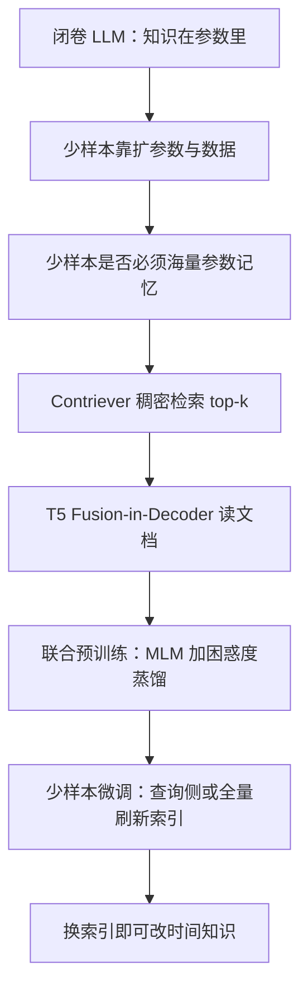

# Atlas：少样本知识任务不必把知识全塞进参数，检索增强语言模型就能在远小于 PaLM 的规模上学会

<!-- release-date: 2022-08-05 -->

**本文依据**：`Atlas: Few-shot Learning with Retrieval Augmented Language Models`，arXiv:2208.03299v3 [cs.CL] 16 Nov 2022，Letter，33 页。共同一作 Gautier Izacard、Patrick Lewis，其余作者 Maria Lomeli、Lucas Hosseini、Fabio Petroni、Timo Schick、Jane Dwivedi-Yu、Armand Joulin、Sebastian Riedel、Edouard Grave。封面机构行 **Meta AI Research**（♦）在前，其后为 ENS / PSL University（♣）、Inria（♥）、University College London（♠）。页眉印 `arXiv:2208.03299v3`，封面未印会议名。文中数字均标 PDF 页码；标「外部补充」的段落不来自本文。代码与检查点发布于 `https://github.com/facebookresearch/atlas`（PDF p. 2）。

## 一句话

大语言模型的少样本能力常被归因于「参数既要会推理、又要记住下游知识」。这篇把记忆外包给可更新的非参数索引，用 Contriever 双编码器检索、T5 Fusion-in-Decoder 读文档，再**联合预训练检索器与语言模型**。11B 的 Atlas 用 64 条样本在 Natural Questions 上达到 42.4%（仅维基索引 45.1%），比 540B 的 PaLM 高近 3 点、参数约少 50 倍；全量维基索引上 NQ 64.0%，相对当时开域问答再抬 8 点（PDF p. 1–2）。

它解决的不是「再做一个更大的闭卷 T5」，而是 **2022 年那条已经能检索增强、却几乎没有少样本证据的路：REALM / RAG / RETRO 证明检索能减参数，却不清楚少样本是否还要靠海量参数记知识。**

## 一、封面矛盾：少样本到底要记多少知识

大模型能靠极少样本甚至指令学会新任务。规模定律同时放大两件事：算力带来的推理，以及从更大语料里塞进参数的记忆（PDF p. 1）。推理变强会推高泛化，直觉上说得通；**参数里的记忆是不是少样本的必要条件，并不清楚。**

本文把记忆换成外部、可非静态的知识源：神经检索器在大语料上找文档，再增强参数语言模型。检索增强已有适应性、可解释性、效率上的好处（REALM、RAG、RETRO 等），但当时还没有有说服力的少样本结果（PDF p. 1–2）。Atlas 要填这个缺口：参数比当时最强少样本模型小，却能在知识任务上少样本学习。

检索器用 Contriever 双编码器；读文档用 Fusion-in-Decoder 的序列到序列模型。联合预训练各部件对少样本至关重要。11B 参数、64 条训练：NQ 42.4%（维基索引 45.1%），几乎比 PaLM 高 3 点；全量加维基索引 64.0%，相对当时 SOTA 高 8 点（PDF p. 2）。

贡献清单（PDF p. 2）：

- 如何设计、训练检索增强语言模型，重点在少样本与样本效率。
- 少样本能力在比标准 LLM 更小的规模上出现。
- 微调时如何同时适配检索器与语言模型。
- 少样本：NQ +2.8%、TriviaQA +3.3%、FEVER +5.1%；MMLU 与约 15 倍参数的模型持平或更强。
- 全量：NQ +8.1%、TriviaQA +9.3%，以及 5 项 KILT 任务新高。
- 可更新、可解释。
- 乘积量化压缩索引约 5 倍显存、精度相当。

把因果链摊开（机制示意，根据 PDF 图 1 与 p. 2–3 重画，不是实测时间轴）：

## 二、任务形态：一切都是文本到文本

沿 T5：系统吃一段查询，生成一段文本。问答里查询是问题、输出是答案；分类里输出是标签的词面。图 2 给了 KILT 上的事实核查、问答、实体链接例子（PDF p. 3 图 2）。许多 NLP 任务要知识，所以要给标准 text-to-text 接上检索——引言的假设是：**这可能是少样本的关键。**

## 三、架构：先检索，再在解码器里融合

两个子模型。做任务时先从大语料取 top-$k$，再把文档与查询一起交给语言模型生成（PDF p. 3）。

**检索器。** Contriever：查询与文档各自过 Transformer 编码器，末层平均池化成向量，相似度是内积。预训练用 MoCo 对比损失，只需无标注数据。稠密检索的好处是查询编码器、文档编码器都能用梯度与蒸馏继续训，不必文档级标注（PDF p. 3）。

**语言模型。** T5 序列到序列，Fusion-in-Decoder：编码器对每篇文档独立编码（查询拼到每篇文档前），再把各文档编码器输出拼成一条序列，解码器做交叉注意力。若把查询和全部文档拼成超长输入，编码器自注意力对文档数二次，扩 $k$ 不划算（PDF p. 3）。

**旧问题 → 新设计 → 机制 → 收益 → 代价。** 交叉注意力读多文档强，但不能预计算文档表示；双编码器可建索引。FiD 把交互留给解码器。代价是：检索阶段查询与文档不交叉，细匹配靠阅读器；索引要随检索器更新，否则会过期。

可迁移：少样本知识任务先问「记忆能不能放索引」，再决定要不要把检索器与 LM 一起预训练。

## 四、检索器损失：用语言模型当老师，不要文档标注

四种损失都让「LM 觉得有用的文档」排得更高。只要有查询–输出对即可，事实核查不必证据句标注；自监督预训练同样能用。实验里预训练对少样本是关键（PDF p. 4）。

检索器在 top-$K$ 上的分布（PDF p. 4 式 1）：

$$
p_{\mathrm{retr}}(d\mid q)=\frac{\exp(s(d,q)/\theta)}{\sum_{k=1}^{K}\exp(s(d_k,q)/\theta)}
$$

其中 $s$ 是查询与文档向量的点积，$\theta$ 是温度。

**注意力蒸馏（ADist）。** 交叉注意力当文档重要性的代理。原文用解码器交叉注意力的 softmax 前分数，对头、层、token 平均。这里改成 $\alpha_n\|v_n\|_2$：贡献不只看注意力权重，还看 value 的范数。再对头、层、token 平均，Softmax 得到 $p_{\mathrm{attn}}$，最小化 $KL(p_{\mathrm{attn}}\|p_{\mathrm{retr}})$。只更新检索器，$p_{\mathrm{attn}}$ 上 StopGradient（PDF p. 4）。

**EMDR$^2$。** 把检索文档当隐变量，EM 风格。损失是

$$
\log\sum_{k=1}^{K} p_{\mathrm{lm}}(a\mid q,d_k)\,p_{\mathrm{retr}}(d_k\mid q)
$$

只更新检索器。最大化该损失的文档分布，会把质量集中到让 LM 输出概率最高的那一篇。实践中按 token 而不是整句（PDF p. 4–5）。

**困惑度蒸馏（PDist）。** 更简单：让检索器预测「conditioning 这篇会把输出困惑度改善多少」。目标是均匀先验下 LM 的文档后验 $p_k\propto p_{\mathrm{LM}}(a\mid d_k,q)$，再 KL 到 $p_{\mathrm{retr}}$（PDF p. 5）。

**留一困惑度蒸馏（LOOP）。** 从 top-$k$ 里拿掉一篇，看 LM 变差多少。对每个 $k-1$ 子集算输出对数概率，取负当作相关分，Softmax 后 KL。比 PDist / EMDR 贵，但更接近真实用法（条件在一组文档上，而不是单篇）（PDF p. 5）。

PDist 与 LOOP 上长输出的困惑度可能几乎不变，温度用来控制分布尖峰（PDF p. 5）。

## 五、预训练任务：无标注也能联合训

三种 pretext（PDF p. 5）：

- **前缀语言建模：** $N$ 词切成两半，前半当查询、后半当输出。
- **掩码语言建模：** 按 T5，平均长度 3 的 span、掩码率 15%，生成被掩 span；检索时把特殊 mask 换成检索器词表支持的 mask。
- **标题到章节：** 维基文章标题加章节标题生成正文；去掉 See also、References 等节。

## 六、微调检索器：索引刷新很贵，少样本可以只训查询侧

联合训练时文档嵌入会过时，必须定期重算整库。少样本时训练条数远小于文档数，刷新开销可能压过普通 LM 微调（PDF p. 6）。

复杂度假设：一篇文档前向 $\mathcal{O}(P)$，文档切成词数相近的段落。每步训练约 $4\times B\times K\times P_{\mathrm{lm}}$（含反向与激活重计算）。全量刷新 $N\times P_{\mathrm{retr}}$，每 $R$ 步一次，开销约 $N P_{\mathrm{retr}}/(4 B K P_{\mathrm{lm}} R)$。BERT-base 检索器对 T5-XL，$P_{\mathrm{retr}}/P_{\mathrm{lm}}\approx 1/25$，开销约 $N/(100 B K R)$。维基索引 3700 万篇、$B=64$、$K=20$、$R=1000$，大约 30%（PDF p. 6）。

**重排序：** 先取 $L$ 篇，用最新检索器重嵌、重排，再把 top-$K$ 给 LM。每步开销约 $L/(100K)$；$L=10K$ 时约 10%。检索器改多了，真 top-$k$ 可能不在过期索引的 top-$L$ 里，仍要全量刷新；可盯重排后 top-$K$ 在 top-$L$ 里的位置估何时刷新（PDF p. 6–7）。

**查询侧微调：** 冻文档编码器，只训查询编码器，索引不用刷新。大数据上影响因任务而异；多数少样本设定几乎不掉，有时还略升（PDF p. 7）。

## 七、相关工作：检索 NLP、检索增强 LM、少样本

检索长期服务问答、事实核查、对话、引用推荐；从 TF-IDF / BM25 到 DPR / ANCE 稠密双编码器。阅读器从抽跨度走到以检索文档为条件的 seq2seq（FiD、RAG）（PDF p. 7）。

检索器训练可绕开查询–文档标注：REALM / RAG 把文档当隐变量；REALM 用 MLM 端到端但阅读器是抽取式 BERT；查询侧微调也出现在短语检索。FiD-KD 用交叉注意力蒸馏；Sachan 等用阅读器困惑度；逆完形填空、显著 span 掩码、Hindsight 知情检索器等（PDF p. 7–8）。

连续缓存、kNN-LM、RETRO 把近邻记忆做到十亿乃至万亿 token。另一路让 LM 生成搜索查询再读回文档（WebGPT 等）；Lazaridou 等把 Google 检索结果塞进超大模型的 in-context 提示（PDF p. 8）。

少样本：GPT-3 式 in-context，以及 prompt 微调 / soft-prompt。本文做法简单：简单模板或直接喂输入，**全模型微调**，接近 Le Scao & Rush（PDF p. 8）。

## 八、实验设置：KILT、MMLU、开域问答与时间敏感性

KILT：11 个数据集、5 类任务，知识应能在维基里找到。本文评 NQ、TriviaQA、HotpotQA、Zero Shot RE、T-REx、AIDA CoNLL-YAGO、Wizard of Wikipedia、FEVER。KILT 版去掉了 2019 年 8 月维基里没有对应知识的实例（PDF p. 9）。

MMLU：57 个多选域，建议每域 5 条。另加零样本；多任务少样本（57 域合计 285 条）；迁移学习（MCTest、RACE、ARC、OBQA，约 9.5 万条）（PDF p. 9）。

还评原始开域 NQ、TriviaQA、三分类 FEVER，以及从 TempLAMA 构造的时间敏感填空：答案在 2017 与 2020 之间会变，用来测换索引算不算持续学习（PDF p. 9）。

消融预训练：检索器从无监督 Contriever（BERT-base）初始化，LM 用 T5 v1.1 的 T5-lm-adapt（原版 T5 训练含监督数据）。消融用 T5-XL（3B），1 万步，AdamW，$B=64$，LM 学习率 $10^{-4}$、检索器 $10^{-5}$，线性衰减，1000 warmup；每 1000 步刷新索引（约 10 次、开销约 30%）；$k=20$（PDF p. 9）。

少样本 KILT 消融：固定步数，64-shot 50 步、1024-shot 200 步，$B=32$，学习率 $4\times 10^{-5}$，线性衰减，5 warmup（PDF p. 10）。

无标数据：2021-12-20 维基，保留列表与信息框（分号线性化），按节切、长节再切成少于 200 词的等长段，**3700 万段、平均 78 词**。另加 2020-10 Common Crawl（CCNet，再按 Gopher 风格过滤长度、平均词长、字母数字比、重复 token），**3.5 亿段**。索引与预训练用同一批段落；预训练时把当前正在去噪/生成的那段从检索结果里滤掉，防止 trivial copy（PDF p. 10）。

## 九、消融：必须联合预训练，PDist + MLM 足够稳

表 1：MLM pretext，索引与预训练都是 2021 年 12 月维基；微调查询侧，损失与预训练相同（PDF p. 10 表 1）。64-shot / 1024-shot 平均：

| 设定 | MLM | 64-NQ | 64-WoW | 64-FEVER | 64-Avg | 1024-NQ | 1024-WoW | 1024-FEVER | 1024-Avg |
|---|---:|---:|---:|---:|---:|---:|---:|---:|---:|
| 闭卷 | 1.083 | 6.5 | 14.1 | 59.0 | 26.5 | 10.7 | 16.5 | 75.3 | 34.2 |
| 无联合预训练 | — | 9.0 | 14.1 | 67.0 | 30.0 | 9.9 | 16.6 | 78.3 | 34.9 |
| 固定检索器 | 0.823 | 39.9 | 14.3 | 72.4 | 42.2 | 45.3 | 17.9 | 90.0 | 51.1 |
| ADist | 0.780 | 40.9 | 14.4 | 73.8 | 43.0 | 46.2 | 17.2 | 90.9 | 51.4 |
| EMDR$^2$ | 0.783 | 43.3 | 14.6 | 72.1 | 43.3 | 44.9 | 18.3 | 85.7 | 49.6 |
| PDist | 0.783 | 45.0 | 15.0 | 77.0 | 45.7 | 44.9 | 17.9 | 90.2 | 51.0 |
| LOOP | 0.766 | 41.8 | 15.0 | 74.4 | 43.7 | 47.1 | 17.9 | 87.5 | 50.8 |

闭卷很差。检索进预训练就大幅超过无联合预训练。联合训检索器在 MLM 验证上明显更好；64-shot 下游差一些，1024-shot 几乎看不出。作者判断：**预训练最大头在让 LM 学会使用、聚合检索文档。** 各检索损失没有系统性差距，后续用 PDist：比 EMDR$^2$ / ADist 稳，比 LOOP 便宜（PDF p. 10–11）。

表 2 pretext（PDF p. 11）：MLM 64-shot 平均 42.4，略好于前缀 LM 的 40.1 与标题生成的 40.8。后续用 MLM。

表 3 索引与预训练数据交叉。少样本微调时索引一律换回 2021 维基（PDF p. 11 表 3）：

| 索引 | 训练数据 | 64-Avg | 1024-Avg |
|---|---|---:|---:|
| Wiki | Wiki | 42.4 | 50.6 |
| Wiki | CC | 41.2 | 50.4 |
| CC | Wiki | 39.8 | 46.9 |
| CC | CC | 41.1 | 49.4 |

维基索引更好：可能是下游也用维基，也可能维基知识更密。CC 索引上，用维基预训练反而差——域不匹配，检索质量差，LM 也学不到用文档。后续索引与预训练都混合两域（PDF p. 11）。

表 4 少样本微调检索器（PDF p. 12）：

| 策略 | 64-Avg | 1024-Avg |
|---|---:|---:|
| 标准微调（全量刷新） | 44.1 | 51.7 |
| Top-100 重排 | 44.7 | 51.6 |
| 查询侧 | 45.7 | 51.0 |
| 固定检索器 | 41.1 | 48.3 |

固定检索器两边都掉。重排几乎等于全量刷新但更便宜。64-shot 查询侧略强（更不易过拟合）；1024-shot 全量更好，尤其 NQ。后续：**样本少走查询侧，数据多走标准微调**（PDF p. 12）。

## 十、正式 Atlas：770M 到 11B

PDist + MLM；维基与 CC 混合作数据与索引；$k=20$；每 2500 步刷新索引并重排 top-100；1 万步，AdamW，$B=128$（PDF p. 12）。

### MMLU

四种设定：零样本；每域 5-shot 各自微调；5-shot 多任务一个模型；辅助数据 95K。生成选项字母 A/B/C/D，测试取四字母里最可能的。细节附录 A.1（PDF p. 12）。

表 5 规模（PDF p. 12）：

| 模型 | 5-shot 770M / 3B / 11B | 多任务 770M / 3B / 11B | 全量 770M / 3B / 11B |
|---|---|---|---|
| 闭卷 T5 | 29.2 / 35.7 / 36.1 | 26.5 / 40.0 / 43.5 | 42.4 / 50.4 / 54.0 |
| Atlas | 38.9 / 42.3 / 43.4 | 42.1 / 48.7 / 56.4 | 56.3 / 59.9 / 65.8 |
| $\Delta$ | +9.8 / +6.6 / +7.3 | +15.6 / +8.7 / +12.9 | +13.9 / +9.5 / +11.8 |

检索在 57 域上稳定有用。770M 闭卷少样本几乎贴随机 25%，同规模 Atlas 约 40%。770M 吃不多任务（闭卷还掉 3 点）；大模型吃得动，Atlas-11B 多任务从 43.4 到 56.4（+13），闭卷只从 36.1 到 43.5（+7）（PDF p. 12–13）。

去偏：微调时打乱选项与字母对应。少样本仍可能偏爱某字母。第二种推理对选项做 4 次循环置换，概率相加，推理成本 $\times 4$。24 种全置换再大约 +1%，不算进主表（PDF p. 13）。表 6 Atlas-11B（PDF p. 13）：

| 推理 | 零样本 | 5-shot | 多任务 | 全量 |
|---|---:|---:|---:|---:|
| 标准 | 36.8 | 43.4 | 56.4 | 65.8 |
| 去偏 | 47.1 | 47.9 | 56.6 | 66.0 |

零样本 +10.3、5-shot +4.5；数据多了几乎不必去偏。

表 7 与 GPT-3 / Gopher / Chinchilla 比。脚注：Atlas 的 5-shot 是微调，前人是 in-context；Train FLOPS 含预训练与微调。Atlas 预训练算力主要由 T5 预训练主导，检索增强那一段低一个数量级（PDF p. 13–14 表 7）：

| 设定 | 模型 | 参数 | FLOPS | All | Hum. | Soc. | STEM | Other |
|---|---|---:|---|---:|---:|---:|---:|---:|
| 零样本 | Atlas | 11B | $3.5\times 10^{22}$ | 47.1 | 43.6 | 54.1 | 38.0 | 54.4 |
| 5-shot | GPT-3 | 175B | $3.1\times 10^{23}$ | 43.9 | 40.8 | 50.4 | 36.7 | 48.8 |
| 5-shot | Gopher | 280B | $5.0\times 10^{23}$ | 60.0 | 56.2 | 71.9 | 47.4 | 66.1 |
| 5-shot | Chinchilla | 70B | $5.0\times 10^{23}$ | 67.5 | 63.6 | 79.3 | 55.0 | 73.9 |
| 5-shot | Atlas | 11B | $3.5\times 10^{22}$ | 47.9 | 46.1 | 54.6 | 38.8 | 52.8 |
| 多任务 5-shot | Atlas | 11B | $3.5\times 10^{22}$ | 56.6 | 50.1 | 66.4 | 46.4 | 66.2 |
| 全量 | UnifiedQA | 11B | $3.3\times 10^{22}$ | 48.9 | 45.6 | 56.6 | 40.2 | 54.6 |
| 全量 | GPT-3 | 175B | $3.1\times 10^{23}$ | 53.9 | 52.5 | 63.9 | 41.4 | 57.9 |
| 全量 | Atlas | 11B | $3.5\times 10^{22}$ | 66.0 | 61.1 | 77.2 | 53.2 | 74.4 |

去偏零样本 47.1 已超过文献里 GPT-3 的 5-shot 43.9。5-shot Atlas 比 GPT-3 高 4 点，参数约 1/15、预训练算力约 1/10。多任务 56.6 接近 Gopher 5-shot 的 60.0。全量 65.6%–66.0% 接近当时 SOTA；此设定下明显超过 GPT-3，而 5-shot 两者接近（PDF p. 13）。正文写 65.6，表 7 全量格是 66.0，以表为准。

附录：MMLU 索引是维基段落 + 信息框 + CC，共 **3.87 亿段**。去掉 CC，多任务 5-shot 从 56.4 掉到 52.8（-3.6）（PDF p. 28）。5-shot 超参用 RACE 上 5 组 5-shot 选，不假设有 MMLU 域内开发集；多任务与全量用每域 5 条共 285 条验证做早停。5-shot 与多任务查询侧微调，全量 top-128 重排；一律检索 30 篇（PDF p. 28）。主文报第一次 run。另一索引上 5 次 5-shot：单域方差可到 20%，57 域聚合标准差 0.5（表 15 平均 $45.0\pm 0.5$）（PDF p. 28–29）。闭卷基线从同一 T5 初始化，同样 10K MLM、同一预训练数据（PDF p. 28）。附录表 16–18 列出 57 域分项，此处不抄。

### 开域问答

表 8。64-shot Atlas 微调，对比模型多为 prompting。TriviaQA 分 filtered 开域集与 unfiltered 隐藏集（PDF p. 14 表 8）：

| 模型 | NQ 64 / 全量 | TQA-f 64 / 全量 | TQA-u 64 / 全量 |
|---|---|---|---|
| GPT-3 | 29.9 / — | — / — | 71.2 / — |
| Gopher | 28.2 / — | 57.2 / — | 61.3 / — |
| Chinchilla | 35.5 / — | 64.6 / — | 72.3 / — |
| PaLM | 39.6 / — | — / — | 81.4 / — |
| RETRO | — / 45.5 | — / — | — / — |
| FiD | — / 51.4 | — / 67.6 | — / 80.1 |
| FiD-KD | — / 54.7 | — / 73.3 | — / — |
| R2-D2 | — / 55.9 | — / 69.9 | — / — |
| Atlas | 42.4 / 60.4 | 74.5 / 79.8 | 84.7 / 89.4 |

64-shot 超过更大的 PaLM / Chinchilla。全量 NQ 从 55.9 到 60.4，默认索引是 CCNet + 2021-12 维基。第 5.2 节时间对齐索引再 +3.6 到 64 EM（PDF p. 14）。

对比 Lazaridou 等：15-shot Gopher + Google 50 段，每题 50 或 450 次 280B 前向，EM 32.7（RAG 分）/ 38.4（集成）。Atlas 同样 15 条、50 段得到 38.7 EM，参数约 1/25（PDF p. 14）。

附录 A.2：模板 `question: {q} answer: [MASK_0]`，生成 mask 加答案；贪心解码；训练测试都检索 40 段，查询+段落截到 384 token。64-shot：30 步、查询侧、$B=32$、学习率 $4\times 10^{-5}$。全量：5k 步，前 1000 步每 500 刷新索引、之后每 2k；$B=64$，每 500 步按验证 EM 选模型（PDF p. 29）。

表 19 阅读器规模，索引为 2018-12 维基（PDF p. 33）：NQ 64-shot 220M/770M/3B/11B 为 27.0 / 35.4 / 41.3 / 45.1；全量 54.1 / 60.8 / 63.4 / 64.0。TriviaQA 64-shot 55.3 / 65.0 / 70.2 / 71.4；全量 71.8 / 74.9 / 77.5 / 78.0。全量 3B→11B 只 +0.6 / +0.5；64-shot 则 +3.7 / +1.2（PDF p. 29）。

### FEVER 原版三分类

训练集比开发/测试更不平衡，少样本更难。表 9（PDF p. 15）：15-shot Atlas 56.2 对 Gopher 51.1（+5.1）；64-shot（文中表头写 65-shot）64.3；全量 78.0，距 ProoFVer 的 79.5 约 1.5 点——对方用专门架构、句级标注检索器、FEVER 官方维基。换 FEVER 维基索引则 80.1，新高（PDF p. 15）。

### KILT 隐藏测试

各任务单独训。表 10（PDF p. 15）：

| 模型 | AIDA | FEV | T-REx | zsRE | NQ | HoPo | TQA | WoW |
|---|---:|---:|---:|---:|---:|---:|---:|---:|
| GENRE | 89.9 | — | — | — | — | — | — | — |
| Sphere | — | 89.0 | 81.7 | 74.2 | 51.6 | 38.3 | 72.7 | 15.5 |
| SEAL | — | 89.5 | 83.6 | 74.6 | 53.7 | 40.5 | 70.9 | 18.3 |
| Re2G | — | 89.6 | 87.7 | — | 51.7 | — | 76.3 | 18.9 |
| FID+RS | — | 92.2 | 85.2 | 83.7 | 61.2 | 39.1 | 84.6 | 20.6 |
| Atlas 64-shot | 66.5 | 87.1 | 58.9 | 74.9 | 43.6 | 34.7 | 76.4 | 15.5 |
| Atlas 全量 | 90.6 | 93.5 | 85.1 | 80.8 | 61.3 | 50.6 | 84.0 | 21.6 |

64-shot 已远超随机；FEVER 只落后 Sphere / SEAL / Re2G 约 2–2.5 点，zsRE 超过 Sphere / SEAL。全量：3 个数据集距 SOTA 3 点内，其余五个新高。KILT 过滤版与原文 NQ / FEVER / TQA 不可直接比（PDF p. 15）。

附录：KILT 检索 20 段；FEVER 在 KILT 是二分类，SUPPORTS / REFUTES 词面化为 true / false。64-shot 30 步、每 5 步看开发集；全量 5k 步、warmup 500（与问答全量的 5 步 warmup 不同）（PDF p. 33）。开发集表 20：64-shot / 全量 AIDA 69.0 / 92.7，FEV 88.1 / 94.4，T-REx 58.5 / 84.8，zsRE 60.2 / 80.9，NQ 44.2 / 63.4，HoPo 34.1 / 51.4，TQA 77.1 / 84.4，WoW 15.4 / 21.0（PDF p. 33）。

## 十一、分析：能看检索、能换时间、能压索引

### 可解释与泄漏

多任务少样本 MMLU：图 3 左，top-30 里 CCNet 平均 85%，维基约 15%（维基只占索引约 10%）。STEM 更爱维基，社科最少；abstract algebra 73%，moral scenarios 3%。几乎不用信息框（PDF p. 16 图 3）。

中图：top-25 里至少一次出现正确选项文本的题目约占 30%。脚注：MMLU 不必检索到选项原文才算有用，hits@k=30% 不等于 70% 检索失败。右图：选项从未出现时准确率 55%，出现超过 15 次则 77%（PDF p. 16）。

人工看 50 道答对的题：44% 至少有部分有用背景；26% 含直接可答信息；28% 看不出明显帮助；2% 段落里有原题加答案（PDF p. 16）。

MMLU 来自现成考试，网页可能泄漏。超大 LM 有时过滤下游实例，文献对 MMLU 没做。最长 n-gram 重叠至少为问题长度（不含选项）的 75% 时人工检查，估计 CC-Net 泄漏 **2.8%**。滤掉可疑段再跑，分数从 56.4 到 55.8（-0.5）。Chinchilla 预训练最多 1.4 万亿 token，约是本索引的 35 倍，泄漏可能更多，但非检索模型更难看出来（PDF p. 16–17）。

### 时间敏感与可更新

TempLAMA 子集：2017 与 2020 答案不同，例如 Theo Walcott 从 Arsenal 到 Everton。248 / 112 / 806 训练、开发、测试（PDF p. 17）。表 11 Atlas-11B 对闭卷 T5-11B（PDF p. 18）：

| 训练答案 | 测试索引 | 2017 闭卷 / Atlas | 2020 闭卷 / Atlas |
|---|---|---|---|
| 2017 | 2017 | 12.1 / 57.7 | 2.9 / 1.5 |
| 2017 | 2020 | 12.1 / 10.2 | 2.9 / 53.1 |
| 2020 | 2017 | 4.8 / 50.1 | 3.6 / 4.2 |
| 2020 | 2020 | 4.8 / 3.5 | 3.6 / 60.5 |

Atlas 远强于 T5；用 2017 答案训练时几乎不答 2020（1.5%）。**不重训、只换 2020 索引，2020 准确率升到 53.1%。** 反向从 2020 训、换 2017 索引也能到 50.1%。T5 即使用 2020 答案也只有 3.6%——预训练数据早于 2020（PDF p. 17）。

NQ 有强时间偏置（大量 2018 世界杯），有的题离开时间会歧义。表 12 不同维基转储（PDF p. 18）：

| | 2017-12 | 2018-12 | 2019-08 | 2020-12 | 2021-12 |
|---|---:|---:|---:|---:|---:|
| 64-shot | 44.7 | 45.1 | 44.1 | 44.0 | 41.3 |
| 全量 | 63.2 | 64.0 | 62.4 | 61.1 | 59.6 |

2018-12（接近采集时间）最好；全量 **64 EM** 新高（PDF p. 17–18）。

### 索引压缩

两处显存：段落本身与嵌入索引。分词后二进制段落：维基 11GB、混合 130GB，不必放 GPU，可 mmap / 分片。嵌入要 GPU 才能快搜。精确检索、fp16、分片到各 GPU：维基 **49GB**、混合 **587GB**（PDF p. 18）。

乘积量化（PQ）。Atlas-3B、64-shot NQ。维基 49GB→4GB，检索精度与 EM 几乎不掉；混合 587GB→50GB，可装进单张 80GB GPU。图 4 最右点是未压缩（PDF p. 18–19 图 4）。贡献里写 5 倍压缩，与 49→4、587→50 同量级（PDF p. 2、18）。

## 十二、讨论与边界

联合预训练检索器与 LM 之后，Atlas 在 NQ、TriviaQA、FEVER、8 项 KILT、57 项 MMLU 上有强少样本。Atlas-11B、64 条：NQ 超过 42%，TriviaQA unfiltered 84.7%，相对 PaLM 近 +3 点、预训练算力约 1/50。全量在 NQ、TriviaQA、FEVER 与 5 项 KILT 上刷新当时数字（PDF p. 19）。

论文明确支持的：少样本知识任务可以少记参数、多靠索引；联合预训练主要是教会 LM 用文档；少样本微调检索器时查询侧往往够用；换索引能改时间知识；PQ 能把索引塞进少得多的 GPU。

只是作者观察、或实验没钉死的：四种检索损失没有系统性赢家；闭卷 T5 在 2020 题上失败，多少来自预训练截止日期，多少来自容量，没有单独拆开。

没写清的：检索器始终 BERT-base，没有与 11B 阅读器对称放大；没有系统比较 in-context 少样本（不更新参数）与本文的全量微调；MMLU 去偏与 57 域分项主要在附录；训练墙钟、GPU 型号、精确检索的实现栈正文几乎不写。

可迁移：

- 知识密集少样本，先检索增强再扩参数。
- 预训练预算有限时，把钱花在「LM 如何读多文档」，检索损失用稳的 PDist 即可。
- 样本极少时冻文档编码器，避免为刷新索引付 30% 税。
- 时效事实优先换索引，而不是终身预训练。
- 部署前用 PQ 把精确索引压到单卡；段落文本不必占 GPU。

## 关键词回看

**Fusion-in-Decoder（FiD）**：每篇文档单独编码，解码器再交叉注意全部编码器输出，复杂度随文档数近似线性而不是二次。

**Perplexity Distillation（PDist）**：用「conditioning 该文档后的输出概率」当教师分布，蒸馏给双编码器检索器。

**查询侧微调（query-side fine-tuning）**：只更新查询编码器，文档嵌入与 FAISS 式索引保持不变。

**非参数记忆**：知识放在可替换的文档索引里，而不是只写进 Transformer 权重。

## 参考资料

- 原件：`readings/_src/检索与 RAG/Atlas.pdf`（arXiv:2208.03299v3，33 页）
- 代码：`https://github.com/facebookresearch/atlas`
- 文内方法前作：Contriever、T5、Fusion-in-Decoder、REALM、RAG、RETRO、DPR（均见 PDF 参考文献，不另开外部补充）
