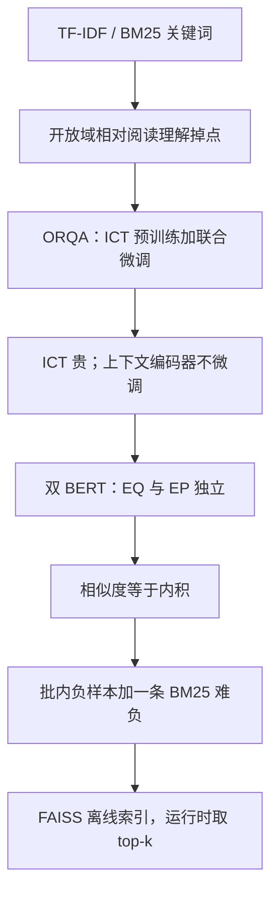

# DPR：不必再做 ICT 预训练，双编码器内积就能把开放域检索从稀疏关键词换成稠密向量

<!-- release-date: 2020-04-10 -->

**本文依据**：`Dense Passage Retrieval for Open-Domain Question Answering`，arXiv:2004.04906v3 [cs.CL] 30 Sep 2020，A4，13 页。共同一作 Vladimir Karpukhin、Barlas Oğuz，其余作者 Sewon Min、Patrick Lewis、Ledell Wu、Sergey Edunov、Danqi Chen、Wen-tau Yih。封面机构行 **Facebook AI** 在前，其后为 University of Washington、Princeton University。页眉印 `arXiv:2004.04906v3`，封面未印会议名。文中数字均标 PDF 页码；标「外部补充」的段落不来自本文。代码与模型发布于 `https://github.com/facebookresearch/DPR`（PDF p. 1 脚注 1）。

## 一句话

开放域问答先检索、再阅读。检索长期默认 TF-IDF / BM25：倒排索引上做关键词匹配。这篇证明：**只用问题–段落对、两个独立 BERT 编码器、批内负样本上的内积，就能把段落编成稠密向量，检索精度超过强 Lucene-BM25。** 摘要写 top-20 检索绝对提升 9%–19%；引言把 Top-5 写成 65.2% 对 42.9%，开放 Natural Questions 端到端 41.5% 对 ORQA 的 33.3%（PDF p. 1–2）。语料是 2018-12-20 英文维基，切成约 2100 万条 100 词段落（PDF p. 4）。

它解决的不是「再做一个更复杂的阅读器」，而是 **2019 年那条已经能用稠密检索、却还要 ICT 预训练和联合微调的路：上下文编码器训不充分、预训练贵、句子当问题代理也不干净。**

## 一、封面矛盾：开放域掉点，多半掉在检索

开放域问答要用一大堆文档答事实题。早期系统组件多。阅读理解起来以后，框架收成两段：（1）检索器先挑一小撮可能含答案的段落；（2）阅读器再从里面抽答案（PDF p. 1，Chen et al. 2017）。把开放域压成阅读理解合理，但实践里精度常崩：脚注举 SQuAD v1.1，精确匹配从 80% 以上掉到 40% 以下（PDF p. 1）。

稀疏检索把问题和段落写成高维稀疏向量，关键词对得上就行。稠密编码按设计是互补的：同义、改写、词面完全不同，向量仍可以靠近。封面例子：「Who is the bad guy in lord of the rings?」对上「Sala Baker is best known for portraying the villain Sauron…」——BM25 难把 `bad guy` 对上 `villain`，稠密检索可以（PDF p. 1）。编码函数可学，检索可用最大内积搜索（MIPS）（PDF p. 1）。

当时的共识是：学好稠密向量要大量标注对，所以稠密检索从未在开放域问答上超过 TF-IDF / BM25，直到 ORQA。ORQA 用逆完形填空（ICT）预训练，再联合微调问题编码器与阅读器。它证明稠密能赢 BM25，但有两处弱：ICT 算力重，普通句子当问题代理也不干净；上下文编码器不拿问答对微调，表示可能次优（PDF p. 1–2）。

本文问：**能不能只用问题与段落（或答案）对，不再额外预训练，训出更好的稠密嵌入？** 答案出奇简单：BERT 双编码器，最大化问题向量与相关段落向量的内积，目标在一个 batch 里比较所有问题–段落对。Dense Passage Retriever（DPR）因此比 BM25 强一截，也把端到端问答相对 ORQA 抬上去（PDF p. 2）。

两条贡献：合适的训练设置下，在现成问答对上微调问题和段落编码器就够超过 BM25，额外预训练未必需要；开放域里检索更准，端到端也会更准。把现代阅读器接到 top 检索段上，多个开放检索设定达到可比或更好的结果，系统比当时一堆更复杂的方案更简单（PDF p. 2）。

把因果链摊开（机制示意，根据 PDF p. 1–3 重画，不是实测时间轴）：

## 二、任务：从维基里抽出一段跨度

事实题如「Who first voiced Meg on Family Guy?」。设定是抽取式：答案必须是语料某段里的一段连续跨度。文档先切成等长段落，得到 $M$ 段语料 $C=\{p_1,\ldots,p_M\}$。检索器 $R:(q,C)\to C_F$ 返回 $|C_F|=k\ll|C|$ 的过滤集。固定 $k$ 时，单独评 top-$k$ 检索准确率：过滤集里是否含有能答该题的跨度（PDF p. 2）。语料可以从百万级维基到十亿级网页，所以必须先检索再阅读（PDF p. 2）。例外是直接检索短语或直接生成答案的路线，本文不走（PDF p. 2 脚注 4）。

初步试验用自然段落，发现固定长度段落在检索和最终问答上都更好，与 Wang et al. 2019 一致（PDF p. 2 脚注 3）。

## 三、DPR：两个编码器，相似度就是内积

目标：把 $M$ 段编进低维连续空间，运行时给阅读器取 top-$k$。实验里 $M$ 约 2100 万，$k$ 通常 20–100（PDF p. 3）。

段落编码器 $E_P(\cdot)$ 把任意段落映到 $d$ 维实向量并建索引。运行时问题编码器 $E_Q(\cdot)$ 把问题映到同维，取向量最近的 $k$ 段。相似度定义为内积（PDF p. 3 式 1）

$$
\operatorname{sim}(q,p)=E_Q(q)^{\top} E_P(p)
$$

多层交叉注意力更强，但相似度必须可分解，段落表示才能预先算完。多数可分解相似度是欧氏距离的变换：单位向量上余弦等于内积，马氏距离等于变换空间里的 $L_2$。消融里别的相似度差不多（第 5.2 节、附录 B），所以选更简单的内积，把力气放在编码器上（PDF p. 3）。

编码器原则上可以是任意网络。本文用两个独立的 BERT-base uncased，取 `[CLS]`，$d=768$（PDF p. 3）。

推理：对全部段落跑 $E_P$，用 FAISS 离线建索引。问题来了算 $v_q=E_Q(q)$，取嵌入最近的 $k$ 段（PDF p. 3）。

**旧问题 → 新设计 → 机制 → 收益 → 代价。** 交叉注意力检索不准预计算；内积可预计算、可 MIPS。代价是：问题和段落不能在编码阶段交互，细匹配留给后面的阅读器。

可迁移：先问「表示能不能离线」，再决定要不要上交叉注意力。

## 四、训练：度量学习，负样本比正样本难选

训练让式 1 成为好的排序函数，本质是度量学习：相关对距离更小、内积更大（PDF p. 3）。

训练数据每条含一个问题 $q_i$、一段正例 $p_i^+$、以及 $n$ 段负例。损失是正例的负对数似然（PDF p. 3 式 2）：分子是 $\mathrm{e}^{\operatorname{sim}(q_i,p_i^+)}$，分母是正例与全部负例的同类项之和。

正例往往现成，负例要从极大池子里挑。三类负例：（1）Random：语料随机段；（2）BM25：BM25 高分但不含答案、却匹配多数问题词；（3）Gold：训练集里其他问题的正例段。最好的模型用同一 mini-batch 里的 gold 段，再加一条 BM25 负例（PDF p. 3–4）。

批内负样本：batch 大小 $B$，各带一段相关段落。$Q$、$P$ 是 $B\times d$ 的问题和段落嵌入，$S=QP^{\top}$ 是 $B\times B$ 相似度。对角是正例，其余是负例。一次前向等于 $B^2$ 对，每题有 $B-1$ 个负例。这招来自全 batch（Yih et al. 2011）和后来的 mini-batch 工作，用来抬训练对数量（PDF p. 4）。

## 五、数据：2100 万段维基，五套问答

跟 Lee et al. 2019：2018-12-20 英文维基。DrQA 预处理去掉表格、信息框、列表、消歧义页。每篇切成互不重叠的 100 词块，共 21,015,324 段。Wang et al. 还试过重叠切分，本文觉得没有优势。每段前面加维基标题和 `[SEP]`（PDF p. 4）。

五套数据与划分同前作。表 1 左列是原始训练集题数，右列是过滤后实际用来训 DPR 的题数（PDF p. 4 表 1）：

| 数据集 | 原始训练 | 实际训练 | Dev | Test |
|---|---:|---:|---:|---:|
| Natural Questions | 79,168 | 58,880 | 8,757 | 3,610 |
| TriviaQA | 78,785 | 60,413 | 8,837 | 11,313 |
| WebQuestions | 3,417 | 2,474 | 361 | 2,032 |
| CuratedTREC | 1,353 | 1,125 | 133 | 694 |
| SQuAD | 78,713 | 70,096 | 8,886 | 10,570 |

NQ：真实搜索问，答案是维基里标注跨度。TriviaQA：网上挖的 trivia，本文用未过滤版并丢掉 Bing 挖来的嘈杂证据。WebQuestions：Google Suggest，答案是 Freebase 实体。CuratedTREC：TREC QA。SQuAD v1.1：先看段落再出题，离开段落很多问题缺上下文，但仍纳入以便对照（PDF p. 4）。

正例怎么选。TREC、WebQuestions、TriviaQA 只有问答对：用含答案的 BM25 最高段当正例；top 100 都没有答案就丢题。SQuAD 与 NQ 的原始金段落切法不同，要对回候选池；维基版本或预处理对不上就丢题。用金上下文相对「含答案即可」的提升很小，见第 5.2 节与附录 A（PDF p. 4）。

## 六、主检索实验：除了 SQuAD，DPR 全面压 BM25

主实验：批内负样本，batch 128，每题再加一条 BM25 负例。大集（NQ、TriviaQA、SQuAD）最多 40 epoch，小集（TREC、WQ）100 epoch；Adam，学习率 $10^{-5}$，线性 warmup，dropout 0.1（PDF p. 5）。

还训了一个多数据编码器：合并除 SQuAD 外的全部训练数据（SQuAD 只覆盖 500 多篇维基，会引入偏差）。BM25+DPR：各自先取 top-2000，再对并集用 $\mathrm{BM25}(q,p)+\lambda\cdot\operatorname{sim}(q,p)$ 重排，$\lambda=1.1$ 按开发集检索准度定。BM25 是 Lucene，$b=0.4$，$k_1=0.9$，开发集调过（PDF p. 5）。

表 2 是测试集 top-20 / top-100，定义为返回段中是否含答案（PDF p. 5 表 2）：

| 训练 | 检索器 | NQ-20 | Trivia-20 | WQ-20 | TREC-20 | SQuAD-20 | NQ-100 | Trivia-100 | WQ-100 | TREC-100 | SQuAD-100 |
|---|---|---:|---:|---:|---:|---:|---:|---:|---:|---:|---:|
| 无 | BM25 | 59.1 | 66.9 | 55.0 | 70.9 | 68.8 | 73.7 | 76.7 | 71.1 | 84.1 | 80.0 |
| Single | DPR | 78.4 | 79.4 | 73.2 | 79.8 | 63.2 | 85.4 | 85.0 | 81.4 | 89.1 | 77.2 |
| Single | BM25+DPR | 76.6 | 79.8 | 71.0 | 85.2 | 71.5 | 83.8 | 84.5 | 80.5 | 92.7 | 81.3 |
| Multi | DPR | 79.4 | 78.8 | 75.0 | 89.1 | 51.6 | 86.0 | 84.7 | 82.9 | 93.9 | 67.6 |
| Multi | BM25+DPR | 78.0 | 79.9 | 74.7 | 88.5 | 66.2 | 83.9 | 84.4 | 82.3 | 94.1 | 78.6 |

除 SQuAD 外 DPR 稳定优于 BM25。$k$ 小时缺口更大：NQ top-20 是 78.4% 对 59.1%。多数据训练对最小的 TREC 帮助最大；NQ、WQ 温和提升，TriviaQA 略降。有时再线性融合 BM25 还能再抬一点（PDF p. 5）。

SQuAD 差，作者给两条原因：出题人先看段落，词面重叠高，BM25 占便宜；数据只来自 500 多篇维基，训练分布极偏（PDF p. 5）。

图 1 在 NQ 开发集上扫训练题数：用 1000 条已经超过 BM25；从 1k 加到全部约 59k，top-$k$ 继续升（PDF p. 5 图 1）。有通用预训练语言模型时，少量问答对就够训出高质量稠密检索器。

## 七、消融：批内负样本和一条 BM25 难负

表 3 在 NQ 开发集上比训练方案。`#N` 是负例数，IB 表示是否批内（PDF p. 6 表 3）：

| 类型 | #N | IB | Top-5 | Top-20 | Top-100 |
|---|---|---|---:|---:|---:|
| Random | 7 | 否 | 47.0 | 64.3 | 77.8 |
| BM25 | 7 | 否 | 50.0 | 63.3 | 74.8 |
| Gold | 7 | 否 | 42.6 | 63.1 | 78.3 |
| Gold | 7 | 是 | 51.1 | 69.1 | 80.8 |
| Gold | 31 | 是 | 52.1 | 70.8 | 82.1 |
| Gold | 127 | 是 | 55.8 | 73.0 | 83.1 |
| G.+BM25(1) | 31+32 | 是 | 65.0 | 77.3 | 84.4 |
| G.+BM25(2) | 31+64 | 是 | 64.5 | 76.4 | 84.0 |
| G.+BM25(1) | 127+128 | 是 | 65.8 | 78.0 | 84.9 |

标准 1-of-N（每题自带 $n$ 个负例）里，Random / BM25 / Gold 在 $k\ge 20$ 时差不大。同样 7 个 gold 负例，改成批内就明显升：关键差别是负例来自本 batch 还是整个训练集。批内是省内存的复用，对数变多，batch 越大越好（PDF p. 6）。

再给全 batch 加「难」负例：BM25 高分但不含答案。加一条提升很大，加两条不再涨（PDF p. 6）。

金段落：能对上原始金上下文时当正例。改成远监督（含答案的 BM25 最高段），NQ 上 top-$k$ 只低约 1 点（PDF p. 6）。附录 A 表 5 开发集：Gold Top-1/5/20/100 为 44.9 / 66.8 / 78.1 / 85.0，远监督为 43.9 / 65.3 / 77.1 / 84.4（PDF p. 12）。

相似度与损失。$L_2$ 与点积相当，两者都优于余弦。三元组损失相对负对数似然影响不大（PDF p. 6）。附录 B 表 6（NQ 开发集）：点积+NLL 为 44.9 / 66.8 / 78.1 / 85.0；点积+Triplet 为 41.6 / 65.0 / 77.2 / 84.5；$L_2$+NLL 为 43.5 / 64.7 / 76.1 / 83.1；$L_2$+Triplet 为 42.2 / 66.0 / 78.1 / 84.9。三元组边距取 1；$L_2$ 进 softmax 前取负（PDF p. 12）。表 5、表 6 的「基线」略好于表 3，因为分析实验超参更好，代码仓有记录（PDF p. 12）。

跨数据集：只在 NQ 上训，直接测 WQ 与 TREC。相对各自微调最好模型，top-20 掉 3–5 点（69.9 / 86.3 对 75.0 / 89.1），仍远超 BM25 的 55.0 / 70.9（PDF p. 6）。

定性：BM25 对高区分关键词敏感；DPR 更吃词变体和语义关系，附录 C 有例子（PDF p. 6）。表 7：问英格兰与爱尔兰之间的水体，BM25 抓到 British Cycling，DPR 抓到 Irish Sea；问《权力的游戏》里谁演 Thoros of Myr，BM25 靠稀有专名对上，DPR 跑偏（PDF p. 12–13）。作者的判断：DPR 语义强，对罕见突显短语容量可能不够（PDF p. 12）。

## 八、运行时：问得快，建索引慢

检索是为了让阅读器少看段，才能实时答。剖析机器：Intel Xeon E5-2698 v4 @ 2.20GHz，512GB。FAISS 内存索引后，DPR 每秒 995.0 题，每题返回 top 100。BM25/Lucene（Java，文件倒排）每 CPU 线程每秒 23.7 题（PDF p. 6）。FAISS 配置：CPU 上 HNSW，每节点邻居 512，构建搜索深度 200，查询深度 128（PDF p. 7 脚注 10）。

建稠密索引更贵：2100 万段嵌入大约 8 GPU 上 8.8 小时，可并行；单机给 2100 万向量建 FAISS 要 8.5 小时。Lucene 倒排大约总共 30 分钟（PDF p. 6–7）。

**代价边界：** 在线延迟换的是离线嵌入与索引成本。语料常更新时，重算 $E_P$ 不是免费的。

## 九、端到端：检索更准，答案也更准

阅读器给每段一个选择分数，再从每段抽跨度打分；选段分最高的那段上的最佳跨度当最终答案。段选择靠问题与段落的交叉注意力。交叉注意力不可分解，不能用来在全库检索，但容量大于双编码器内积；在少量候选上选段已被证明有效（PDF p. 7）。

第 $i$ 段 BERT 表示为 $P_i\in\mathbb{R}^{L\times h}$。起始、结束、选段概率是对 $P_i w_{\mathrm{start}}$、$P_i w_{\mathrm{end}}$、以及各段 `[CLS]` 拼成的 $\hat{P}$ 再乘 $w_{\mathrm{selected}}$ 做 softmax（PDF p. 7 式 3–5）。跨度分是起止概率之积，选段分是 $P_{\mathrm{selected}}(i)$。

训练：从检索系统（BM25 或 DPR）的 top 100 里采 1 正、$m̃-1$ 负，$m̃=24$。目标是正例段内所有正确答案跨度的边际对数似然，加上选中正例段的对数似然。大集 batch 16，小集 4；$k$ 在开发集上调。Multi 设定下的小集：把 NQ 上训好的阅读器再微调到目标集。实验在八张 32GB GPU 上做（PDF p. 7）。

表 4 是精确匹配（经 Chen et al. / Lee et al. 那套轻度规范化）（PDF p. 7 表 4）：

| 训练 | 模型 | NQ | TriviaQA | WQ | TREC | SQuAD |
|---|---|---:|---:|---:|---:|---:|
| Single | BM25+BERT（Lee et al.） | 26.5 | 47.1 | 17.7 | 21.3 | 33.2 |
| Single | ORQA | 33.3 | 45.0 | 36.4 | 30.1 | 20.2 |
| Single | HardEM | 28.1 | 50.9 | — | — | — |
| Single | GraphRetriever | 34.5 | 56.0 | 36.4 | — | — |
| Single | PathRetriever | 32.6 | — | — | — | 56.5 |
| Single | REALMWiki | 39.2 | — | 40.2 | 46.8 | — |
| Single | REALMNews | 40.4 | — | 40.7 | 42.9 | — |
| Single | BM25（本文阅读器） | 32.6 | 52.4 | 29.9 | 24.9 | 38.1 |
| Single | DPR | 41.5 | 56.8 | 34.6 | 25.9 | 29.8 |
| Single | BM25+DPR | 39.0 | 57.0 | 35.2 | 28.0 | 36.7 |
| Multi | DPR | 41.5 | 56.8 | 42.4 | 49.4 | 24.1 |
| Multi | BM25+DPR | 38.8 | 57.9 | 41.1 | 50.6 | 35.8 |

前一块数字从被引论文抄来。REALMWiki / REALMNews 是同一模型，分别在维基和 CC-News 上预训练（PDF p. 7）。除 SQuAD 外，DPR 段上抽出的答案更可能对。大集上 Multi 与 Single 相当；小集 Multi 优势明显。DPR 系在五套里的四套超过当时 SOTA，精确匹配绝对差 1% 到 12%。对比 ORQA 与并行的 REALM：后两者有额外预训练和昂贵端到端训练；DPR 只靠问答对学强检索，就在 NQ 和 TriviaQA 上超过它们。额外预训练更可能在目标训练集很小时有用。WQ、TREC 的 Single 不够好看，多加问答对后才创新高（PDF p. 7–8）。

流水线对联合训练：NQ 上把检索器与阅读器联合训，得 39.8 EM，低于隔离训练的强检索加阅读，设计也更简单（PDF p. 8，附录 D）。附录 D：联合时固定段落编码器，只让问题编码器吃检索+阅读联合损失，从而继续用 HNSW、训练中不重索引。损失跟 ORQA：检索选正段、阅读选对跨度与对段。因 $E_P$ 冻结，检索损失可用更多段——batch 16，每题 top 100，类似批内负样本，每题有效 1600 段；阅读器仍每题 24 段，从同题 top 100 里的 top 5 正、top 30 负里采。问题编码器从已在 NQ 上训过的 DPR 初始化，阅读器从 BERT-base 初始化。联合并不优于常规流水线，NQ 开发集同样 39.8（PDF p. 13）。正文写 39.8 是这篇联合消融的数；主表 Single DPR 的 41.5 是测试集流水线结果，两套设定不要混成一句「联合等于主结果」（PDF p. 7–8、p. 13）。

阅读器看的段比 ORQA 多，推理时延却几乎一样：DPR 每题最多 100 段，阅读器能在单张 32GB GPU 上一整个 batch 吃完，延迟大约仍 20ms，接近单段。吞吐不好直接比：ORQA 段更长（288 word pieces 对本文 100 token），计算对长度超线性。NQ 上 $k=50$ 最优；$k=10$ 只边际损失（40.8 对 41.5 EM），大致可比 ORQA 的 5 段设置（PDF p. 8）。

## 十、相关工作里作者自己画的边界

段落检索一直是开放域问答组件。稀疏向量是当时标准；也有人用知识图、维基超链接增强（PDF p. 8）。稠密检索从 LSA 算起；用标注查询–文档对判别训练编码器后来变常见，用在跨语言文档、广告、网页搜索、实体检索。稠密通常补稀疏，单用往往不如稀疏。预训练加交叉注意力在重排序上有效。并行工作 ColBERT 用 BERT 上的晚交互做全库稠密检索，不是双编码器（PDF p. 8）。Das et al. 迭代改写问题向量；Seo et al. 直接检索答案短语。ORQA / REALM 走额外预训练与联合或异步重索引。相对这些，DPR 的主张是：简单方案经验更强，不必额外预训练，也不必复杂联合（PDF p. 8–9）。

文末还点到后作：硬负迭代（Xiong et al. 2020a）、DPR 接 BART / T5 做生成式开放域（Izacard & Grave；Lewis et al. 2020b）（PDF p. 9）。这些是本文打印时的引用，不是本实验。

## 十一、结论、限制、没写什么

结论：稠密检索可以超过、并有潜力替换开放域问答里的传统稀疏检索。双编码器可以出奇地好，但训练有关键配方；更复杂的模型框架或相似度函数不一定加分。检索提升之后，多套开放域基准刷新（PDF p. 9）。

实验支持的：除 SQuAD 外 top-20 / top-100 与多数端到端 EM；1000 条已超 BM25；批内负样本加一条 BM25 难负；点积够用；跨集仍超 BM25；流水线优于他们试过的联合方案。

作者观察、不是定理的：SQuAD 差是因为先看段落出题加文档偏斜；额外预训练只在小目标集更有用；DPR 可能吃不准罕见专名。

报告没写、不要补的：索引更新策略、多语言、长于 100 词的段、生成式阅读器的完整配方、FAISS 之外的 ANN 变体对比。BERT 之外的编码器只作为原则可能，没有实验。

可迁移：

- 能离线编码就用双编码器内积，交叉注意力留给小候选集。
- 负样本先复用 batch 里的 gold，再加少量检索器难负，不要一上来堆随机负例。
- 先把检索单独做到可评，再接阅读器；联合训练不是默认更强。
- 出题协议（先看段落还是真实提问）会决定稀疏是否占便宜，换数据集前先看词面重叠。
- 在线 QPS 好看时，把离线嵌入和建索引的小时数一起写进预算。

## 关键词回看

开放域问答、BM25、稠密段落检索、双编码器、内积 / MIPS、批内负样本、BM25 难负、FAISS HNSW、抽取式阅读器、ORQA / ICT、REALM。贯穿全文的主矛盾仍是：**关键词匹配补不到的语义，能不能用可预计算的稠密内积单独扛起来——答案是能，前提是训练配方对。**
