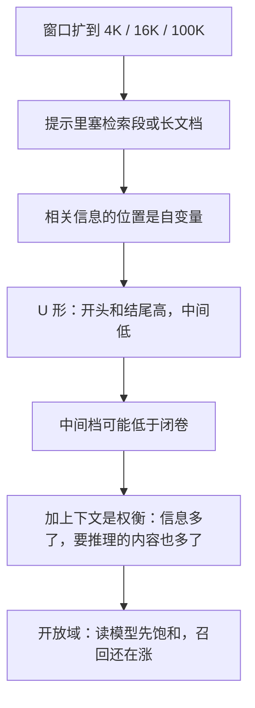

# Lost in the Middle：上下文再长，中间那段也经常用不上

<!-- release-date: 2023-07-06 -->

**本文依据**：`Lost in the Middle: How Language Models Use Long Contexts`，arXiv:2307.03172v3 [cs.CL] 20 Nov 2023，A4，18 页。第一作者 Nelson F. Liu，其余作者 Kevin Lin、John Hewitt、Ashwin Paranjape、Michele Bevilacqua、Fabio Petroni、Percy Liang。封面编号机构 **Stanford University** 为 1，University of California, Berkeley 为 2，Samaya AI 为 3。页眉印 `arXiv:2307.03172v3`，封面未印会议名。脚注写第一作者部分工作在 Samaya AI 实习完成。文中数字均标 PDF 页码；标「外部补充」的段落不来自本文。代码与评测数据见 `nelsonliu.me/papers/lost-in-the-middle`（PDF p. 2 脚注 1）。

## 一句话

语言模型已经能吃几千到十万 token 的输入，但**会不会用**和**塞得进**不是一回事。这篇把相关信息在上下文里的位置当成自变量：多文档问答和合成键值检索上都看到 **U 形曲线**——相关段落放在开头（首因偏差）或结尾（近因偏差）最好，放在中间明显变差，连标榜长上下文的模型也一样（PDF p. 1 图 1、摘要）。开放域问答里，读模型精度在检索召回还在涨的时候就已经饱和：50 段相对 20 段，GPT-3.5-Turbo 大约只多 1.5 个点，Claude-1.3 大约只多 1 个点（PDF p. 2、p. 8）。

它解决的不是「再做一个更长窗口的 Transformer」，而是 **2023 年那条已经把窗口扩到 4K / 16K / 100K、却还用困惑度当长上下文代理指标的路：窗口变大，不保证中间那段真被读到。**

## 一、封面矛盾：能塞进去，不等于会用

下游几乎全靠提示：任务说明和要处理的数据都写进输入上下文，模型再生成补全。法律文书、科学长文、对话历史、检索增强生成（RAG）都会把上下文撑到几千 token（PDF p. 1）。Transformer 的显存和算力随长度平方涨，早期训练窗口常常只有 512–2048 token。硬件和算法（Transformer-XL、FlashAttention、Hyena 等）把窗口推到 4096、32K 甚至 100K，但**扩展窗口的模型到底怎么用这段输入**，当时几乎没人用可控实验回答（PDF p. 1）。

本文的判据很硬：如果模型能稳健使用长上下文，**相关信息放在哪一段，精度就不该大起大落**。作者改两件事：上下文有多长、相关信息在哪一档位置。开源模型是 MPT-30B-Instruct（8192）和 LongChat-13B（16K）；闭源是 OpenAI 的 GPT-3.5-Turbo / GPT-3.5-Turbo（16K）和 Anthropic 的 Claude-1.3 / Claude-1.3（100K）（PDF p. 1–2）。生成一律贪心解码（PDF p. 3）。

两条任务：

1. **多文档问答**：模仿 Bing Chat 一类检索增强问答。上下文里恰好一段含答案，其余是干扰段。改文档数等于改长度，改含答案段的次序等于改位置（PDF p. 2）。
2. **键值检索**：极简探针。一串 JSON 的 UUID 键值对，给定键，吐出对应值。只要从输入里把匹配 token 捞出来，几乎不需要自然语言语义（PDF p. 2、p. 5）。

封面图 1 已经把故事画完：20 段、大约 4K token 时，GPT-3.5-Turbo 的精度随含答案文档位置走出 U 形；中间档甚至可以掉到闭卷基线（56.1%）以下（PDF p. 1 图 1、p. 2）。

把因果链摊开（机制示意，根据 PDF p. 1–2、p. 8 重画，不是实测时间轴）：

## 二、Changing the location of relevant information：多文档问答里的 U 形

（本节对应 PDF p. 3 图 5 的实验：*The effect of changing the position of relevant information (document containing the answer) on multi-document question answering performance.* 封面图 1 是同一现象在 20 段上的预告。）

### 任务怎么搭

输入是一个问题和 $k$ 段维基段落，**恰好一段含答案**，其余 $k-1$ 段不含。模型必须在上下文里找到那一段并用它答题。图 2 的例子：问谁拿了第一座诺贝尔物理学奖，金答案是 Wilhelm Conrad Röntgen（PDF p. 3 图 2）。

数据来自 NaturalQuestions-Open。取 **2655** 条标注长答案是段落（不是列表或表格）的查询。段落是最多 100 token 的维基块。含答案段用 NaturalQuestions 标注里那一段维基。干扰段用 Contriever（在 MS-MARCO 上微调）检索「与问题最相关、但不含任一标注答案」的 $k-1$ 块；上下文里干扰段按相关度降序排（PDF p. 2）。指标是准确率：预测里是否出现任一标注答案（PDF p. 2）。

两个旋钮：把含答案段挪到第 1、中间或最后（图 3）；增减不含答案的检索段来改长度（图 4）。10 / 20 / 30 段大约对应 2K / 4K / 6K token（PDF p. 4 图 5）。

提示固定成：「只用提供的搜索结果写高质量答案（其中一些可能无关）」，然后列出 `Document [i](Title: …)`，最后是问题和 `Answer:`（PDF p. 3 图 2）。

和 Ivgi 等人的「针在草堆里」比：他们只比「放开头」和「随机位置」。本文把位置切得更细（PDF p. 3）。

### 模型

- **MPT-30B-Instruct**：最大 8192。先在 1T token、2048 序列上预训练，再 500 亿 token、8192 序列做长度适应；位置用 ALiBi（PDF p. 3）。
- **LongChat-13B（16K）**：把 LLaMA-13B 的窗口从 2048 扩到 16384，用压缩旋转位置编码，再在 16384 序列上微调（PDF p. 3）。
- **GPT-3.5-Turbo / 16K**：0613 版本，窗口 4K 与 16K（PDF p. 4）。
- **Claude-1.3 / 100K**：窗口 8K 与 100K（PDF p. 4）。

GPT-4（8K）只在附录 D 的 500 条子集上跑，全文多文档加键值检索估计要 6000 美元以上（PDF p. 4 脚注 6）。

对照两档（PDF p. 4 表 1）：

| 模型 | 闭卷 | 神谕（只给含答案的那一段） |
|---|---:|---:|
| LongChat-13B（16K） | 35.0% | 83.4% |
| MPT-30B-Instruct | 31.5% | 81.9% |
| GPT-3.5-Turbo | 56.1% | 88.3% |
| GPT-3.5-Turbo（16K） | 56.0% | 88.6% |
| Claude-1.3 | 48.3% | 76.1% |
| Claude-1.3（100K） | 48.2% | 76.4% |

闭卷：一个文档都不给，只靠参数记忆。神谕：只给含答案的那一段。两条曲线几乎重合的扩展版与原版，说明**拉长窗口本身不等于更会用上下文**（PDF p. 4）。

### 图 5：位置一变，精度就塌

图 5 把 10 / 20 / 30 段画成三张 U。相关信息在开头或结尾最高，中间迅速掉（PDF p. 4）。GPT-3.5-Turbo 可以掉超过 20 个点；20 段和 30 段的最差档可以低于闭卷 56.1%（PDF p. 4）。

附录 G 把图 5 收成表。Index $n$ 表示含答案文档在第 $n+1$ 位，0 是最开头（PDF p. 17）。

**10 段**（PDF p. 17 表 5）：

| 模型 | Index 0 | Index 4 | Index 9 |
|---|---:|---:|---:|
| Claude-1.3 | 62.9% | 58.3% | 59.7% |
| Claude-1.3（100K） | 63.1% | 58.3% | 59.7% |
| GPT-3.5-Turbo | 76.8% | 61.2% | 62.4% |
| GPT-3.5-Turbo（16K） | 76.9% | 61.0% | 62.5% |
| MPT-30B-Instruct | 60.2% | 56.2% | 59.7% |
| LongChat-13B（16K） | 72.1% | 58.9% | 58.5% |

**20 段**（PDF p. 17 表 6；封面图 1 同一设定）：

| 模型 | Index 0 | Index 4 | Index 9 | Index 14 | Index 19 |
|---|---:|---:|---:|---:|---:|
| Claude-1.3 | 59.9% | 55.9% | 56.8% | 57.2% | 60.1% |
| Claude-1.3（100K） | 59.8% | 55.9% | 57.0% | 57.4% | 60.0% |
| GPT-3.5-Turbo | 75.8% | 57.2% | 53.8% | 55.4% | 63.2% |
| GPT-3.5-Turbo（16K） | 75.7% | 57.3% | 54.1% | 55.4% | 63.1% |
| MPT-30B-Instruct | 53.7% | 51.8% | 52.2% | 52.7% | 56.3% |
| LongChat-13B（16K） | 68.6% | 57.4% | 55.3% | 52.5% | 55.0% |

GPT-3.5-Turbo 20 段：开头 75.8%，中间 Index 9 落到 53.8%，已经低于闭卷 56.1%。扩展 16K 版几乎叠在原版上（75.7% / 54.1% / 63.1%）（PDF p. 4、p. 17）。

**30 段**（PDF p. 18 表 7）。GPT-3.5-Turbo 原版窗口只有 4K，大约 6K 的 30 段设定只报了 16K 版：

| 模型 | Index 0 | Index 4 | Index 9 | Index 14 | Index 19 | Index 24 | Index 29 |
|---|---:|---:|---:|---:|---:|---:|---:|
| Claude-1.3 | 59.1% | 55.1% | 54.8% | 55.7% | 56.4% | 56.2% | 59.9% |
| Claude-1.3（100K） | 59.1% | 55.1% | 54.9% | 55.7% | 56.6% | 56.1% | 60.0% |
| GPT-3.5-Turbo（16K） | 73.4% | 55.1% | 50.5% | 50.9% | 51.8% | 54.9% | 63.7% |
| MPT-30B-Instruct | 51.6% | 51.3% | 51.2% | 49.0% | 49.6% | 51.3% | 54.1% |
| LongChat-13B（16K） | 66.9% | 54.8% | 52.5% | 52.9% | 52.2% | 51.3% | 55.1% |

10 段和 20 段都进得了 GPT-3.5-Turbo 与 16K 版的窗口，两条位置曲线几乎重合。作者的判断：**扩展上下文模型不一定更会用输入**（PDF p. 4）。

**旧问题 → 新设计 → 机制 → 收益 → 代价。** 旧问题是「窗口数字变大就被当成长上下文能力」。新设计是把位置当自变量。机制是 primacy / recency。收益是一套可复现的协议：最好档和最差档差距要小，才能声称稳健使用长上下文（PDF p. 2）。代价是：这是受控实验，上下文里永远恰好一段含答案，和真实开放域不同。

可迁移：RAG 提示里不要默认「多塞几段总更好」；先看中间档会不会掉到闭卷以下。

## 三、键值检索：连精确匹配都会在中间丢掉

多文档问答还要「找到段、再用来答题」。键值检索把语义尽量剥掉：键和值都是随机 128-bit UUID，目标是返回指定键对应的值（PDF p. 5 图 6）。$k$ 对里一对相关，$k-1$ 对干扰。改键在 JSON 里的位置等于改相关信息位置；加减随机键等于改长度（PDF p. 5）。

和 Papailiopoulos 等人的 Little Retrieval Test、Li 等人的细粒度行检索目标相近，但这里刻意去掉自然语言，避免语言模型对某些语言特征更敏感（PDF p. 5）。

设定：75 / 140 / 300 对（各 500 条），大约 4K / 8K / 16K token（PDF p. 5 图 7）。

图 7：Claude-1.3 和 100K 版在所有长度上几乎满分。其余模型在 140 和 300 对上开始挣扎——任务只要求精确匹配，仍不是人人满分。GPT-3.5-Turbo、16K 版和 MPT-30B-Instruct 仍然是中间最差。LongChat-13B 在 140 对上走势不同：相关信息放开头时，模型常去生成「用代码取键」而不是直接吐值（PDF p. 5–6）。

附录 F 表 4 给出平均 token：GPT-3.5 / Claude 上 75 对约 3768.7，140 对约 6992.8，300 对约 14929.4；LongChat 因为分词更碎，300 对平均 21467.3，已经超过不少 16K 窗口（PDF p. 17 表 4）。

## 四、为什么位置一变就不稳

### 架构：编码器–解码器在训练长度内更平

已评的开源模型全是仅解码器：每一步只能看前面的 token（PDF p. 6）。对照 Flan-T5-XXL（训练 512）和 Flan-UL2（先 512，再额外 10 万步 1024，指令微调时编码器 2048、解码器 512）。相对位置编码原则上能外推；Shaham 等人发现两者在 8K 上仍可能表现不错（PDF p. 6）。

图 8：Flan-UL2 在训练期内的 2048 窗口内（左图，10 段约 2K），对位置相对稳健，最好档与最差档只差 **1.9 个绝对点**。超过训练长度（中、右图，20 / 30 段）就重新变成 U 形。Flan-T5-XXL 同类：上下文越长，中间掉得越狠（PDF p. 7 图 8）。作者猜想：双向编码器能在「后面那些文档」的上下文里处理当前文档，相对重要性估计更好（PDF p. 6）。

### 查询感知上下文：键值满分，问答几乎不动

主实验把问题或键放在文档 / JSON **后面**。仅解码器编码文档时看不到查询。编码器–解码器有双向编码器。于是试：**查询在数据前再抄一遍、后面再放一遍**，让文档编码时就能看到查询（PDF p. 6–7）。

键值任务上，查询感知让所有模型在 75 / 140 / 300 对上都接近满分。例如 GPT-3.5-Turbo（16K）在 300 对上满分；不加查询感知时最差档只有 45.6%（图 7）（PDF p. 7）。

多文档问答上几乎帮不上忙（图 9）：相关信息在最开头时略升，其余位置略降（PDF p. 7 图 9）。精确匹配可以被「查询夹心」救回来；真正要理解并答题时，夹心不够。

### 指令微调不是 U 形的唯一原因

主模型都经过指令微调，指令又常放在上下文开头，可能让模型更看重开头。对照 MPT-30B 基座和 MPT-30B-Instruct（图 10）：**两条都是 U 形**。Instruct 绝对精度全面更高，但走势相似。指令微调把最好–最差差距从基座的将近 10 个点收到大约 4 个点，没有取消 U 形（PDF p. 7–8 图 10）。

这补上更早的观察：未经指令微调的模型偏爱近因（上下文末尾）。那些工作多半测连续文本的下一个词，长程信息本来就没多少用。这里用指令格式提示后，模型**也会用开头**（首因）。作者猜想：互联网预训练里本来就有 StackOverflow 问答这类「说明在前、材料在后」的格式（PDF p. 8）。

Llama-2 附录 E：7B / 13B / 70B，带或不带 SFT+RLHF（chat）。20 段设定。Llama 分词更长，2655 条里丢掉 20 条超出 4096 窗口的例子（PDF p. 16）。**U 形只在够大的模型上出现**：7B 几乎只有近因；13B 和 70B 才同时有首因和近因。SFT+RLHF 在 13B 上略微缓解位置偏差（最好–最差从 20 个点收到 10 个点），70B 上几乎不改走势（PDF p. 8、p. 16 图 16）。作者据此猜想：Khandelwal、Sun 那些工作没看到首因，是因为当时模型小于 1B（PDF p. 16）。

## 五、更多上下文不一定更好：开放域问答个案

受控多文档设定里永远恰好一段含答案。开放域里，top-$k$ 可能零段或多段含答案（PDF p. 2）。标准检索–阅读：Contriever 取维基上分数最高的 $k$ 段，直接写进提示。仍用长答案是段落的那一子集。同时画检索召回和阅读准确率对 $k$ 的曲线（PDF p. 8）。

图 11：阅读精度饱和远早于 Contriever 召回。超过 20 段以后，GPT-3.5-Turbo 大约只再涨 1.5 个点，Claude-1.3 大约只再涨 1 个点，上下文长度（因而延迟和费用）却明显上去（PDF p. 2、p. 8）。结合「开头和结尾更好用」，作者建议两条工程方向：把相关段重排到开头，或做排序列表截断、少取几段（PDF p. 8）。

标题写成 *Is More Context Is Always Better?*——原文如此（PDF p. 8）。

## 六、相关工作要记住的对照

长上下文模型：递推、稀疏 / 低秩近似、FlashAttention 的精确加速，以及 RWKV、S4、Hyena 这类去掉二次注意力的路线。很多工作用网页语料困惑度代理「会处理长上下文」。本文指出：**长上下文上的精确知识访问是额外的难题**（PDF p. 8–9）。

怎么用上下文：小 LSTM 对更远期用得更粗；对话模型类似；带注意力的 LSTM 也主要用近史。Petroni 等人很早就把检索上下文和预训练 LM 拼起来做无监督问答。O’Connor 与 Andreas 发现很多「毁掉信息」的操作对 Transformer 预测影响不大。Qin 等人发现高效 Transformer 偏近因、用不好地长程（PDF p. 9）。

序列位置效应：心理学里自由回忆时，人最记得列表的第一项和最后一项（Ebbinghaus；Murdock）。Transformer 的自注意力在技术上能同等取出任意位置的 token，却走出类似曲线，作者觉得这本身就值得停一下（PDF p. 9）。

## 七、附录里还核过什么

**A. 歧义。** 检索语料是 2018 年末维基，和 NaturalQuestions 标注有少量时间错位（例：Robert Griffin III 在标注里是自由球员，维基转储里还在 Ravens）。用 AmbigQA 的歧义标注切无歧义子集，图 12 走势与全集同类（PDF p. 15）。

**B. 随机干扰。** 干扰段改成随机维基，含答案段常常靠词面重叠就能找。绝对精度更高，但模型仍用不完整段上下文——掉点不只是「认不出相关文档」（PDF p. 15 图 13）。

**C. 打乱干扰次序。** 提示改成「搜索结果随机排序」，并打乱 $k-1$ 段干扰。仍是 U 形。相对主实验：相关信息在最开头时略降，在中间和结尾时略升（PDF p. 15–16 图 14）。

**D. GPT-4。** 500 条、20 段。绝对精度最高，仍是 U 形（PDF p. 16 图 15）。

**F. token 统计。** 闭卷 / 神谕见表 2；10 / 20 / 30 段见表 3。例如 GPT-3.5 上 20 段平均 2946.2 token（最大 3920），30 段平均 4419.2（最大 6101）。LongChat 同样 20 段平均 3464.6（最大 4955）（PDF p. 17）。

## 八、作者自己划的能力边界

要声称「能稳健使用长输入里的信息」，必须证明**相关信息的位置几乎不影响精度**（最好档与最差档差距要小）（PDF p. 2）。更长提示是权衡：信息可能有用，要推理的内容也更多（PDF p. 2）。编码器–解码器只在训练长度内更平；查询夹心救得了 UUID 匹配，救不了多文档问答；指令微调不是 U 形的充分原因（PDF p. 2、p. 6–8）。

没写的：没有提出新架构或新训练目标来「修好」中间丢失；解码只试了贪心；GPT-4 没有全量数字；开放域个案不能外推到所有下游。

## 九、可迁移启发

1. **评长上下文不要只报窗口大小和困惑度。** 把相关信息扫过开头 / 中间 / 结尾，看最好–最差差多少。
2. **RAG 默认把最相关段放到提示最前或最后**，不要堆在中间；$k$ 从 20 加到 50 之前先看读模型还涨不涨。
3. **查询夹心**对「从上下文里抄一段精确匹配」很有效，对「读懂再答题」几乎无效——按任务选，不要当万能提示术。
4. **窗口扩展版和原版在两者都放得下的长度上可能完全一样。** 买 16K / 100K 之前，用这篇的协议测一遍中间档。

## 十、关键词回看

- **Lost in the Middle**：相关信息在长上下文中间时，使用能力明显下降。
- **U-shaped performance curve（U 形精度曲线）**：开头和结尾高、中间低。
- **Primacy bias / recency bias（首因 / 近因偏差）**：更会用开头或结尾。
- **Multi-document QA**：恰好一段含答案的受控检索增强问答。
- **Key-value retrieval**：UUID JSON 上的精确匹配探针。
- **Query-aware contextualization（查询感知上下文）**：查询在数据前后各放一次。
- **Closed-book / oracle**：不给文档 vs 只给含答案的那一段。

## 参考资料

- 原件：`readings/_src/检索与 RAG/Lost-in-the-Middle.pdf`
- 项目页：`https://nelsonliu.me/papers/lost-in-the-middle`（PDF p. 2 脚注 1）
