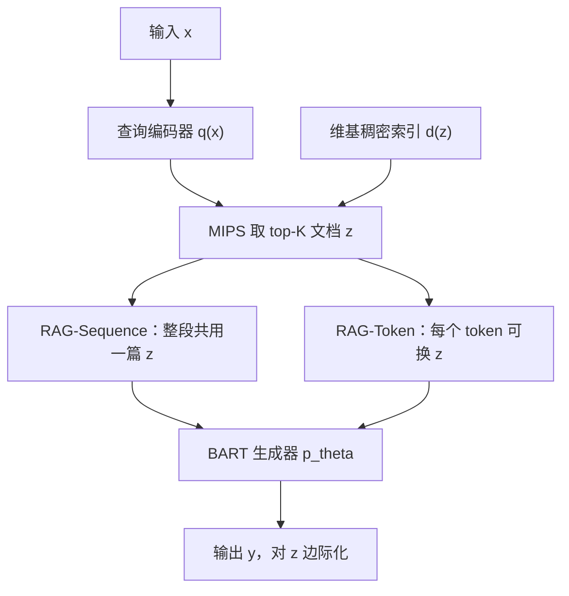

# RAG：参数记忆负责生成，非参数记忆负责检索，端到端边际化就能把 seq2seq 接到维基上

<!-- release-date: 2020-05-22 -->

**本文依据**：`Retrieval-Augmented Generation for Knowledge-Intensive NLP Tasks`，arXiv:2005.11401v4 [cs.CL] 12 Apr 2021，Letter，19 页。第一作者 Patrick Lewis（共同一作 Ethan Perez），其余作者 Aleksandra Piktus、Fabio Petroni、Vladimir Karpukhin、Naman Goyal、Heinrich Küttler、Mike Lewis、Wen-tau Yih、Tim Rocktäschel、Sebastian Riedel、Douwe Kiela。封面机构行 **Facebook AI Research** 在前，其后为 University College London、New York University。页眉印 `arXiv:2005.11401v4`，封面未印会议名。文中数字均标 PDF 页码；标「外部补充」的段落不来自本文。实验代码后收入 Hugging Face Transformers 的 `examples/rag/`（PDF p. 2 脚注 1）。

## 一句话

大模型把事实压进参数里，知识密集型任务上仍不如专用架构：改不了记忆、说不清出处、还会编。这篇给出通用微调配方 **RAG（Retrieval-Augmented Generation）**：**参数记忆**是预训练 seq2seq（BART），**非参数记忆**是维基的稠密向量索引，用预训练神经检索器访问。两种边际化：整段生成共用同一批文档（RAG-Sequence），或每个 token 可以换文档（RAG-Token）。开放域问答三套数据上当时 SOTA，超过纯参数 seq2seq 和 retrieve-and-extract；生成任务上比纯 BART 更具体、更多样、更贴事实（PDF p. 1）。

它解决的不是「再做一个抽取阅读器」，而是 **可微检索此前只接到抽取式下游**：把混合记忆接到 NLP 的主力形态 seq2seq 上（PDF p. 2）。

## 一、封面矛盾：参数里有知识，却改不了、看不着、会幻觉

预训练语言模型能从数据里学到不少深层知识，不必外接记忆，相当于参数化的隐式知识库。坏处也很硬：记忆不好扩、不好改；预测不好解释；还可能幻觉（PDF p. 1）。

混合模型把 **参数记忆** 和 **非参数（检索）记忆** 拼在一起：知识可以直接改、可以扩，用过的段落也能打开看。REALM 与 ORQA 把掩码语言模型接到可微检索器上，结果不错，但只做了开放域抽取问答（PDF p. 1–2）。

本文把混合记忆接到 seq2seq 上，并给一个通用微调做法，称为 RAG。参数记忆是预训练 seq2seq Transformer；非参数记忆是维基稠密索引，用预训练神经检索器访问。两端端到端训练（PDF p. 2 图 1）。检索器是 Dense Passage Retriever（DPR）：按输入给出潜在文档；生成器是 BART：文档加输入一起生成。对潜在文档做 top-$K$ 近似边际化：要么整段输出共用一篇文档，要么每个 token 可以对应不同文档。和 T5、BART 一样，RAG 可以微调到任意 seq2seq 任务，生成器与检索器一起学（PDF p. 2）。

和从零训 memory network、stack-augmented net、memory layer 不同：这里两端都预训练、都预先装了大量知识。用预训练访问机制，不额外训也能取知识（PDF p. 2）。

知识密集型任务：人没有外部知识源就做不了。RAG 在开放 Natural Questions、WebQuestions、CuratedTrec 上当时 SOTA；TriviaQA 上明显超过带专用预训练目标的近期方法。这些本是抽取任务，无约束生成仍超过当时抽取系统。知识密集生成用 MS-MARCO 和 Jeopardy 出题：比 BART 基线更贴事实、更具体、更多样。FEVER 事实验证距强检索监督的流水线 SOTA 4.3 个百分点。非参数记忆可以整库替换，世界变了不必重训生成器（PDF p. 2）。

把因果链摊开（机制示意，根据 PDF p. 2 图 1 重画，不是实测时间轴）：

## 二、两个模型：文档是潜变量，边际化方式不同

输入 $x$ 检索文档 $z$，再当额外上下文生成目标 $y$。两块：（i）检索器 $p_\eta(z|x)$，按查询给出（截断 top-$K$ 的）段落分布；（ii）生成器 $p_\theta(y_i\mid x,z,y_{1:i-1})$，看前 $i-1$ 个 token、原输入和一篇 $z$，写当前 token（PDF p. 2–3）。

训练时把检索到的文档当潜变量。两种边际化给出 $p(y|x)$。

**RAG-Sequence**：整段生成共用同一篇检索文档。把文档当成一个潜变量，用 top-$K$ 近似得到 seq2seq 概率。先检索 top $K$ 篇，每篇各算一遍生成概率，再按检索先验加权求和（PDF p. 3）：

$$
p_{\mathrm{RAG\text{-}Sequence}}(y|x)\approx\sum_{z\in\mathrm{top-}k(p(\cdot|x))} p_\eta(z|x)\,p_\theta(y|x,z)
$$

右边再把 $p_\theta(y|x,z)$ 拆成逐 token 乘积。

**RAG-Token**：每个目标 token 可以抽一篇不同的潜在文档，生成器写答案时能从多篇里拼内容。对每个位置，先对每篇文档算下一 token 分布，边际化后再写下一位（PDF p. 3）：

$$
p_{\mathrm{RAG\text{-}Token}}(y|x)\approx\prod_{i}\sum_{z\in\mathrm{top-}k(p(\cdot|x))} p_\eta(z|x)\,p_\theta(y_i\mid x,z,y_{1:i-1})
$$

序列分类把类别当成长度 1 的目标序列，此时两种 RAG 等价（PDF p. 3）。

**旧问题 → 新设计 → 机制 → 收益 → 代价。** 抽取阅读器只能从段里剪跨度；seq2seq 可以综合、改写、甚至在检索没命中时靠参数记忆补一刀。代价是：解码时要对多篇文档边际化，RAG-Sequence 不能直接当成普通逐 token 束搜索。

可迁移：先问「答案必须从段里剪出来吗」；若要生成，再选整段共用文档还是逐 token 换文档。

## 三、检索器用 DPR，生成器用 BART

检索 $p_\eta(z|x)$ 基于 DPR 双编码器（PDF p. 3）：

$$
p_\eta(z|x)\propto\exp\bigl(d(z)^{\top} q(x)\bigr),\quad d(z)=\mathrm{BERT}_d(z),\; q(x)=\mathrm{BERT}_q(x)
$$

$d(z)$、$q(x)$ 都是 BERT-base。取 top-$k$ 是最大内积搜索（MIPS），可近似亚线性求解。用 DPR 预训练双编码器初始化检索器并建文档索引。该检索器当时为 TriviaQA 与 Natural Questions 训过「含答案的段落」。文档索引就是非参数记忆（PDF p. 3）。

生成器原则上任意编码器–解码器。本文用 **BART-large**，约 400M 参数（附录写成 406M，PDF p. 3、p. 18）。把 $x$ 与检索到的 $z$ 直接拼接再送进 BART。后文把 BART 参数 $\theta$ 称作参数记忆（PDF p. 3）。

## 四、训练：不监督该取哪篇，只冻文档编码器

联合训检索器与生成器，**不对「该取哪篇」做直接监督**。微调语料是输入–输出对 $(x_j,y_j)$，最小化目标的负边际对数似然，Adam（PDF p. 3–4）。训练中更新文档编码器 $\mathrm{BERT}_d$ 很贵：索引要像 REALM 预训练那样定期重建。本文发现这一步对强结果不是必须的，**文档编码器和索引固定，只微调查询编码器 $\mathrm{BERT}_q$ 和 BART**（PDF p. 4）。

**代价边界：** 语料常更新时，可以热替换索引（见第九节），但文档编码器本身不跟着任务梯度走。

## 五、解码：Token 能塞进束搜索，Sequence 要「彻底」或「快」

测试时两种模型近似 $\arg\max_y p(y|x)$ 的办法不同（PDF p. 4）。

RAG-Token 可看成普通自回归 seq2seq，转移概率是对 top-$K$ 文档的加权和，直接塞进标准束解码。

RAG-Sequence 的 $p(y|x)$ 拆不成常规逐 token 似然，不能一次束搜索。做法：对每篇 $z$ 各跑一遍束搜索，用 $p_\theta(y_i\mid x,z,y_{1:i-1})$ 打分，得到候选集 $Y$。有的假说没出现在所有文档的束里。要估 $p(y|x)$，对那些没在束里出现过该 $y$ 的文档再跑一次前向，乘上 $p_\eta(z|x)$，再对文档求和。作者称 **Thorough Decoding**。输出一长，$|Y|$ 会很大。更快的近似：若某 $y$ 没从 $(x,z_i)$ 的束里生成过，就当 $p_\theta(y|x,z_i)\approx 0$，候选集生成完就不再补前向。称 **Fast Decoding**（PDF p. 4）。

附录 A：开放域问答里 RAG-Token 测 15 篇，RAG-Sequence 测 50 篇并用 Thorough Decoding（答案短）；问答用贪心，束搜索没帮助。Open-MSMarco 与 Jeopardy 两边都用 10 篇，束宽 4，RAG-Sequence 用 Fast Decoding（Thorough 不再涨）（PDF p. 17）。

## 六、实验设定：一份 2018-12 维基，切成 2100 万段

全部实验共用一份非参数知识源：与 Lee et al.、Karpukhin et al. 相同的 **2018 年 12 月** 维基转储。每篇切成互不重叠的 100 词块，共 **2100 万** 文档。文档编码器算嵌入，FAISS 建单一 MIPS 索引，HNSW 近似（PDF p. 4）。训练时每条查询取 top $k$，$k\in\{5,10\}$，测试 $k$ 用开发集定（PDF p. 4）。

开放域问答：问题–答案当 $(x,y)$，直接最小化答案的负对数似然。对照抽取式（主要靠非参数）和 Closed-Book 生成（只靠参数）。四套：NQ、TriviaQA、WebQuestions、CuratedTrec。CT 与 WQ 小，跟 DPR：用 NQ 上的 RAG 初始化。划分同前作，报 Exact Match。TriviaQA 为了对照 T5，另评 TQA Wiki 测试集（PDF p. 4）。

抽象问答：MSMARCO NLG v2.1。题、十段搜索金段落、整句答案。本文 **不用提供的段落**，只用问答对，当成开放域抽象问答。有的题没有金段落就对不上参考答案（例如天气）；有的单靠维基也答不了，这时 RAG 可以靠参数记忆硬写（PDF p. 4–5）。

Jeopardy 出题：条件是答案实体，生成 Jeopardy 式事实题。划分来自 SearchQA：训练 100K、开发 14K、测试 27K。对照 BART。指标是 SQuAD 调过的 Q-BLEU-1。另做事实性与具体性的成对人工评：452 对 BART 与 RAG-Token（PDF p. 5）。

FEVER：判断声称被维基支持、反驳，还是信息不足。标签映成单 token，直接用声称–类别对训练。**不用检索证据的监督**。三分类与 Thorne and Vlachos 的二分类都报标签准确率（PDF p. 5）。

附录表 7 规模（PDF p. 19）：

| 任务 | 训练 | 开发 | 测试 |
|---|---:|---:|---:|
| Natural Questions | 79,169 | 8,758 | 3,611 |
| TriviaQA | 78,786 | 8,838 | 11,314 |
| WebQuestions | 3,418 | 362 | 2,033 |
| CuratedTrec | 635 | 134 | 635 |
| Jeopardy 出题 | 97,392 | 13,714 | 26,849 |
| MS-MARCO | 153,726 | 12,468 | 101,093（隐藏子集评测） |
| FEVER-3 | 145,450 | 10,000 | 10,000 |
| FEVER-2 | 96,966 | 6,666 | 6,666 |

## 七、开放域问答：生成超过抽取，也不要 SSM 预训练

表 1 测试集（PDF p. 6）。TriviaQA 左列是开放域常用测试集，右列是 TQA-Wiki。

| 设定 | 模型 | NQ | TQA | WQ | CT |
|---|---|---:|---|---:|---:|
| Closed-Book | T5-11B | 34.5 | — / 50.1 | 37.4 | — |
| Closed-Book | T5-11B+SSM | 36.6 | — / 60.5 | 44.7 | — |
| Open-Book | REALM | 40.4 | — / — | 40.7 | 46.8 |
| Open-Book | DPR | 41.5 | 57.9 / — | 41.1 | 50.6 |
| 本文 | RAG-Token | 44.1 | 55.2 / 66.1 | 45.5 | 50.0 |
| 本文 | RAG-Sequence | 44.5 | 56.8 / 68.0 | 45.2 | 52.2 |

四套开放域问答上 RAG 当时都是新 SOTA（TriviaQA 只在与 T5 可比的那一列宣称）。它同时有 Closed-Book 的生成灵活性和 Open-Book 的检索成绩。相对 REALM 与 T5+SSM，不必昂贵的 salient span masking 预训练。检索器虽用 DPR 初始化（NQ、TriviaQA 上有检索监督），但相对 DPR 问答系统——BERT cross-encoder 重排再抽取阅读——RAG 说明 **重排器和抽取阅读器都不是当时 SOTA 的必要条件**（PDF p. 5–6）。

生成相对抽取的好处：段里只有线索、没有逐字答案，仍能贡献正确生成；抽取做不到，边际化更有效。检索文档里完全没有正确答案时，NQ 上 RAG 仍有 **11.8%** 准确率，抽取模型在这种情况下是 0（PDF p. 6）。

附录 D：NQ、WQ 把多条答案标注拆成多对 $(q,a)$ 分别训，准确率小幅升。TriviaQA 过滤不出现在该查询 top 1000 文档里的候选（表情、拼写变体等）。CuratedTrec 答案是正则：先在 top 1000 里找最常匹配的串当监督，否则用启发式把正则展开成空白替换（PDF p. 18）。

附录 G：可训参数约 **626M**（DPR 的 BERT-base 查询与文档编码器各 110M，文档编码器本文不训；BART-large 406M）。最接近的 T5-large 770M 在 NQ 上 28.9 EM，低于 RAG-Sequence 的 44.5。非参数索引不是可训参数：2100 万条 **728 维** 向量，约 15.3B 个数，可存 8-bit（PDF p. 18–19）。正文 2.3 节写 BART-large 400M，与附录 406M 差 6M，以附录点名「trainable parameters」为准。

## 八、生成与分类：少幻觉，FEVER 不用证据监督

表 2（PDF p. 6）。MS-MARCO 的 SotA 用金上下文（表注 `*`）；无金上下文最好模型表中以下划线标出，正文数字如下。FEVER-3 SotA 76.8，FEVER-2 SotA 92.2（金证据）。分类任务两种 RAG 等价，表里 FEVER 分数只出现一次。

| 模型 | Jeopardy B-1 | Jeopardy Q-BLEU-1 | MS-MARCO R-L | MS-MARCO B-1 | FVR-3 | FVR-2 |
|---|---:|---:|---:|---:|---:|---:|
| SotA | — | — | 49.8（金） | 49.9（金） | 76.8 | 92.2（金） |
| BART | 15.1 | 19.7 | 38.2 | 41.6 | 64.0 | 81.1 |
| RAG-Token | 17.3 | 22.2 | 40.1 | 41.5 | 72.5 | 89.5 |
| RAG-Sequence | 14.7 | 21.4 | 40.8 | 44.2 | （同 Token） | （同 Token） |

Open MS-MARCO 上 RAG-Sequence 相对 BART：**Bleu +2.6、Rouge-L +2.6**。接近用金段落的 SOTA。作者定性：RAG 更少幻觉、更常写出事实正确的句子（PDF p. 6）。表 3 例子：BART 把中耳定义成「耳朵里中耳和鼻子之间」；RAG-Sequence 写出鼓室和三块听小骨（PDF p. 7）。

Jeopardy：RAG-Token 好于 RAG-Sequence，两者 Q-BLEU-1 都超过 BART。452 对人工评（PDF p. 6 表 4）：BART 更贴事实仅 **7.1%**，RAG 更贴 **42.7%**，两者都好 11.7%，两者都差 17.7%，无多数 20.8%；具体性上 RAG 更好 37.4%，BART 更好 16.8%。Jeopardy 题常含两截独立信息，RAG-Token 能从多篇拼。图 2：输入 Hemingway，生成 「Sun」 时文档 2（The Sun Also Rises）后验高，生成 「A Farewell to Arms」 时文档 1 高；书名第一个 token 之后后验变平——生成器能靠参数记忆把标题补完。把半截解码喂给纯 BART 也能补出书名。作者的判断：**非参数记忆把生成拽到对的事实上，参数记忆把专名补完**（PDF p. 6–7）。

FEVER 三分类距当时流水线 SOTA **4.3** 个百分点（72.5 对 76.8），那些系统有领域架构、工程和中间检索监督。二分类距给定金证据句的 RoBERTa **2.7** 个百分点（89.5 对 92.2），RAG 只看到声称、自己检索。top-1 文档标题与金证据文章重叠 **71%**，top-10 里出现金文章 **90%**（PDF p. 7）。附录 E：分类前先按 BART 习惯重生声称，用最后隐状态分类，再对文档边际化。FEVER 另有抽证据句子任务，用的维基转储不同，本文没做（PDF p. 18）。

## 九、消融、多样性、热替换索引

表 5：distinct trigram 比例。MS-MARCO：Gold 89.6%，BART 70.7%，RAG-Token 77.8%，RAG-Sequence 83.5%。Jeopardy：Gold 90.0%，BART 32.4%，RAG-Token 46.8%，RAG-Sequence 53.8%。不必多样性解码，RAG 已比 BART 散（PDF p. 8）。

表 6 开发集消融（PDF p. 8）。冻检索器全面变差；把稠密检索换成固定 BM25（检索分当 $p(z|x)$ 的 logit）时，**FEVER 上 BM25 最好**（声称偏实体、适合词面重叠），其余任务尤其开放域问答稠密检索关键。

| 模型 | NQ | TQA | WQ | CT | Jeopardy B-1 | QB-1 | MS R-L | MS B-1 | FVR-3 | FVR-2 |
|---|---:|---:|---:|---:|---:|---:|---:|---:|---:|---:|
| RAG-Token-BM25 | 29.7 | 41.5 | 32.1 | 33.1 | 17.5 | 22.3 | 55.5 | 48.4 | 75.1 | 91.6 |
| RAG-Sequence-BM25 | 31.8 | 44.1 | 36.6 | 33.8 | 11.1 | 19.5 | 56.5 | 46.9 | （同左分类） | |
| RAG-Token-Frozen | 37.8 | 50.1 | 37.1 | 51.1 | 16.7 | 21.7 | 55.9 | 49.4 | 72.9 | 89.4 |
| RAG-Sequence-Frozen | 41.2 | 52.1 | 41.8 | 52.6 | 11.8 | 19.6 | 56.7 | 47.3 | （同左分类） | |
| RAG-Token | 43.5 | 54.8 | 46.5 | 51.9 | 17.9 | 22.6 | 56.2 | 49.4 | 74.5 | 90.6 |
| RAG-Sequence | 44.0 | 55.8 | 44.9 | 53.4 | 15.3 | 21.5 | 57.2 | 47.5 | （同左分类） | |

开发集 FEVER 上 BM25 变体（75.1 / 91.6）高于学到的稠密检索（74.5 / 90.6）；测试集表 2 报的是学到的 RAG。不要把开发消融和测试主表混成一张排序。

**索引热替换。** 参数模型要改世界知识得再训。作者用 DrQA 的 2016-12 维基另建索引，对照主实验的 2018-12。82 位在两份转储之间换过的领导人，模板「Who is {position}?」问 NQ RAG：对上年代的索引分别 **70%**（2016）和 **68%**（2018）；错配只有 **12%**（2018 索引答 2016 人）和 **4%**（2016 索引答 2018 人）。换非参数记忆就能更新世界知识（PDF p. 7–8）。

训练用 5 或 10 篇潜在文档，差别不大。测试时可改 $K$。图 3：开放域问答上 RAG-Sequence 随 $K$ 单调升，RAG-Token 在 10 篇附近见顶；MS-MARCO 上 RAG-Token 多取文档抬 Rouge-L、压 Bleu-1，RAG-Sequence 没那么敏感（PDF p. 8）。

## 十、相关工作、讨论、附录里的失败

相关工作收成几条：单任务检索早已有效，本文用同一套检索增强架构覆盖多任务；BART/T5 证明通用编码器–解码器，本文再加可学检索；学检索可用搜索、强化学习或潜变量，本文走潜变量且跨任务微调；记忆网络类比外部记忆，但本文记的是 **原文** 而不是分布式向量——人能读、人能改索引；retrieve-and-edit 改的是训练对，RAG 聚合多篇证据、潜变量检索（PDF p. 8–9）。

讨论：开放域问答 SOTA；人更喜欢 RAG 而不是纯 BART；检索组件消融有效；索引可热替换。未来可考虑两端从零联合预训练（BART 式去噪或其他目标）。参数记忆与非参数记忆如何互动，仍是开放方向（PDF p. 9）。

Broader Impact：更贴维基，幻觉少、可解释；也可能被用来写假新闻、钓鱼。维基本身并非无偏（PDF p. 10）。

附录 F：试过 REALM 式空文档机制（学一个空文档嵌入、静态偏置、或网络预测空文档 logit），没有提升，正文不用。Open MS-MARCO 上模型会学会对「检索帮不上」的题总去取某一固定文档集合，作者认为空文档机制对 RAG 未必必要（PDF p. 18）。

附录 H：**检索崩溃**。故事生成等任务上，检索器会学会不论输入都取同一批文档，生成器随后忽略文档，RAG 退化成 BART。可能因为这些任务对事实知识不够显式，或目标序列太长、检索器梯度弱（PDF p. 19）。

附录 C：Fairseq，混合精度，8×32GB V100，单卡也能跑。FAISS MIPS 在 CPU 上够快，维基向量约占 **100GB** CPU 内存；投稿后迁到 Transformers，并用 FAISS 压缩把内存降到 **36GB**（PDF p. 17）。

## 十一、可迁移启发

1. **先分清两块记忆。** 会变的事实放非参数索引；语感、补全、改写放参数生成器。换世界知识优先换索引，而不是先想着再训 400M 生成器。
2. **抽取不是生成的上限。** 段里没有逐字答案时，边际化生成仍可能对；NQ 上「检索全空」仍有 11.8%。下游若允许自由文本，不要默认必须 span。
3. **监督可以很弱。** 不对「该取哪篇」标注，只对最终 $y$ 做边际似然；FEVER 距强监督流水线只差几个点。真缺证据标注时，这条路比先搭 IR 流水线更省。
4. **整段共用 vs 逐 token 换文档。** 短答案、要边际化多篇线索：RAG-Sequence 加 Thorough Decoding。一句话里两截事实（Jeopardy）：RAG-Token。分类：两者一回事。
5. **冻文档编码器是工程判断。** REALM 式重建索引贵；本文证明微调查询编码器 + 生成器往往够。代价是文档侧表示不随任务动。
6. **检索会塌。** 任务不太吃事实、目标很长时，先盯检索器是否塌成常数；塌了就等于没检索。
7. **词面任务别迷信稠密。** FEVER 开发集上 BM25 更好。实体对对、声称短，先留一个稀疏对照。

## 十二、关键词回看

- **参数记忆 / 非参数记忆**：BART 权重 vs 维基向量索引。RAG 的定义就是两者一起做生成。
- **RAG-Sequence / RAG-Token**：潜在文档按整段边际化，还是按 token 边际化。
- **DPR 双编码器 + MIPS**：查询与文档独立编码，内积检索，FAISS/HNSW。
- **Thorough / Fast Decoding**：RAG-Sequence 对未进束的 $(y,z)$ 是否补前向。
- **索引热替换**：换 2016/2018 维基就能换领导人答案，不必重训。

## 参考资料

- 原件：`readings/_src/检索与 RAG/RAG.pdf`（arXiv:2005.11401v4，19 页）
- Hugging Face 示例与演示：脚注 1 与附录 C 给出的 `transformers/examples/rag/`、`https://huggingface.co/rag/`
- 检索器前作 DPR、生成器前作 BART、对照 REALM / ORQA / T5 Closed-Book，均见 PDF 参考文献，不在本文展开
