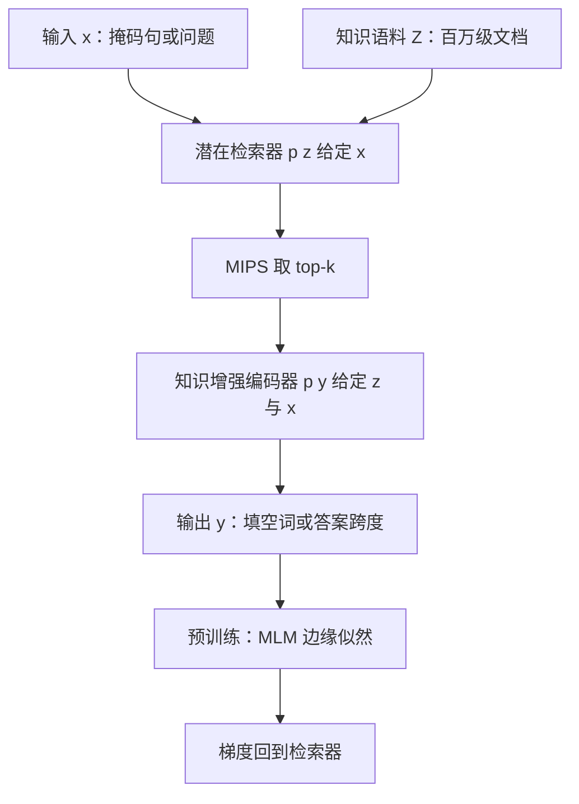

# REALM：用无监督 MLM 把潜在检索器训进预训练，再把知识从参数里拆出来

<!-- release-date: 2020-02-10 -->

**本文依据**：`REALM: Retrieval-Augmented Language Model Pre-Training`，arXiv:2002.08909v1 [cs.CL] 10 Feb 2020，letter，12 页。Kelvin Guu、Kenton Lee 共同一作，Zora Tung、Panupong Pasupat、Ming-Wei Chang，均署 **Google Research**。封面页眉印该 arXiv 行，未印会议名。`pdfinfo` 的 Subject 写有 ICML 2020，那是元数据，封面没有印，不写入本稿身份。文中数字均标 PDF 页码；标「外部补充」的段落不来自本文。

## 一句话

BERT、RoBERTa、T5 一类预训练会把世界知识压进参数：要记住更多事实，就只能把网络做得更大。REALM 在预训练里加进一个**潜在知识检索器**（latent knowledge retriever）：每做一次预测，先从 Wikipedia 一类语料 $Z$ 里取文档，再让编码器对着这些文档做交叉注意力。检索器没有人工标注「该取哪篇」，学习信号就是**掩码语言模型**（Masked Language Model，MLM）：能降低困惑度的检索给奖励，没用的检索给惩罚。梯度穿过「在百万级文档里挑几篇」这一步。微调到开放域问答（Open-QA）后，三个基准上比当时最好系统绝对准确率高 4–16 个百分点（PDF p. 1）。

它解决的不是「问答时再挂一个 BM25」，而是 **2020 年那条已经能把知识塞进参数、却既难解释又难扩容的路：检索要能端到端学，而且要从无监督预训练开始学。**

## 一、封面矛盾：知识在参数里，还是在可检索的文本里

封面例子是填空：「The         is the currency of the United Kingdom」，答案是 pound。BERT 能做对，说明预训练确实吃进了世界知识（PDF p. 1）。

问题有两层。第一，知识藏在权重里，很难指出「哪条事实存在哪」。第二，存储上限跟着参数走：要覆盖更多事实，就得训更大的网，又慢又贵（PDF p. 1）。

REALM 的主张是：预测前先用检索器从 $Z$（例如整部 Wikipedia）取文档，再 attend 这些文档。预训练、微调、推理都走同一条检索。第一次把这种知识检索器做成**无监督预训练**：用 MLM 当信号，反向传播穿过考虑百万级文档的检索步（PDF p. 1 图 1）。

关键直觉：检索好坏用语言模型表现说话。图 1 的例子是填「the        at the top of the pyramid」。若检索器拿到含「The pyramidion on top allows for less material higher up the pyramid」的文档，就该被奖励。实现上，把 retrieve-then-predict 写成**潜在变量语言模型**，优化边缘似然（PDF p. 2）。

计算挑战是：每一步预训练都要面对百万候选，还要把梯度送回去。做法是把每篇文档的计算缓存起来、异步更新，选文档做成**最大内积搜索**（Maximum Inner Product Search，MIPS）（PDF p. 2）。

和前作的差别写得很硬。加离散检索步的神经网络早有（Miller 等 2016；Chen 等 2017），但没有接到语言模型预训练，大规模文档时检索器也不是学出来的。kNN-LM（Khandelwal 等 2019）用近邻语言模型例子帮记忆，但没有为下游微调，因为微调时 kNN 只能用带任务标签的例子，世界知识所在的 LM 例子用不上。REALM 的检索器设计成可迁移：取回来的是**文本**，不是带标签的例子（PDF p. 2）。

下游钉在 Open-QA：NATURAL QUESTIONS-OPEN、WEBQUESTIONS、CURATEDTREC。对照既有隐式知识（T5 这类大模型）也有显式检索（Lee 等 2019 等启发式检索）。三个基准都新高，绝对准确率高 4–16 个百分点，并带来可解释与模块化（PDF p. 2）。

把因果链摊开（机制示意，根据 PDF p. 1 图 1 与 p. 3 图 2 重画，不是实测时间轴）：

**旧问题 → 新设计 → 机制 → 收益 → 代价。** 知识挤在参数里，不可拆、不可扩。改成潜在检索后，知识是文档，检索器被 MLM 塑造。代价是：每步要对整库做近似检索，索引会过期，必须异步刷新。

可迁移：先问「这件事该记在权重里，还是该放进可替换的文本库」，再决定要不要在预训练里就把检索当成潜变量。

## 二、背景：MLM 在测什么，Open-QA 在逼什么

预训练目标是从无标注语料学有用的语言表示，再微调到下游。本文盯 BERT 那套 MLM。无标注语料记为 $X$。一个训练例 $(x,y)$ 由随机掩码生成，例如 $x=$「The [MASK] is the currency [MASK] the UK」，$y=$（pound，of）。好的 MLM 既要句法（of），也要世界知识（pound）（PDF p. 2）。脚注说 MLM 严格说不是标准语言模型，因为它并不给整段 token 定义分布；文中偶尔滥用「语言模型」只为缩短说法（PDF p. 2）。

Open-QA：给定问题 $x$（What is the currency of the UK?），输出答案串 $y$（pound）。「开放」指模型**没有**预先拿到已知含答案的那一篇，这和 SQuAD 一类阅读理解不同。阅读理解读一篇；Open-QA 要从百万文档里留住知识，因为问题可能关于其中任何一篇（PDF p. 2–3）。

本文只讨论以文本库 $Z$ 为知识源的系统。一类是检索再抽取（Brill 等 2002；Chen 等 2017；Lee 等 2019）。REALM 把这套范式接到预训练。另一类是生成：seq2seq 直接逐 token 出 $y$（Lewis 等 2019；Raffel 等 2019）。实验两边都比（PDF p. 3）。

「document」在文中是语料里的一段，不一定是整篇文章（PDF p. 2 脚注）。

## 三、生成过程：检索是潜变量，预测对 $z$ 与 $x$ 条件化

预训练与微调都学 $p(y\mid x)$。预训练里 $x$ 是带掩码的句子，$y$ 是被盖住的 token；微调里 $x$ 是问题，$y$ 是答案（PDF p. 3）。

分解成两步：先从 $p(z\mid x)$ 抽可能有用的 $z$，再由 $p(y\mid z,x)$ 生成。$z$ 是潜变量，对全部文档边缘化（PDF p. 3 式 1）：

$$
p(y\mid x)=\sum_{z\in Z}p(y\mid z,x)\,p(z\mid x)
$$

整体框架见图 2：左是无监督预训练，检索器与知识增强编码器在 LM 任务上联合训；右是有监督微调，预训练好的 $\theta$（检索器）与 $\phi$（编码器）接到主任务（PDF p. 4 图 2）。

## 四、检索器：稠密内积；编码器：交叉注意力后再预测

### 4.1 知识检索器

稠密内积模型（PDF p. 3）：

$$
p(z\mid x)=\frac{\exp f(x,z)}{\sum_{z'}\exp f(x,z')},\qquad f(x,z)=\mathrm{Embed}_{\mathrm{input}}(x)^{\top}\mathrm{Embed}_{\mathrm{doc}}(z)
$$

两个嵌入都把输入映到 $d$ 维。相关分是内积，检索分布是全体相关分上的 softmax。

嵌入用 BERT 风格 Transformer。wordpiece 之后加 `[CLS]`、`[SEP]`：

$$
\mathrm{joinBERT}(x)=[\mathrm{CLS}]\,x\,[\mathrm{SEP}]
$$

$$
\mathrm{joinBERT}(x_1,x_2)=[\mathrm{CLS}]\,x_1\,[\mathrm{SEP}]\,x_2\,[\mathrm{SEP}]
$$

Transformer 后取 `[CLS]` 的池化向量 $\mathrm{BERT}_{\mathrm{CLS}}$，再线性投影降维（PDF p. 3）：

$$
\mathrm{Embed}_{\mathrm{input}}(x)=W_{\mathrm{input}}\,\mathrm{BERT}_{\mathrm{CLS}}(\mathrm{joinBERT}(x))
$$

$$
\mathrm{Embed}_{\mathrm{doc}}(z)=W_{\mathrm{doc}}\,\mathrm{BERT}_{\mathrm{CLS}}(\mathrm{joinBERT}(z_{\mathrm{title}},z_{\mathrm{body}}))
$$

文档嵌入吃标题加正文。$\theta$ 包括检索用的 Transformer 与投影矩阵（PDF p. 3）。

### 4.2 知识增强编码器

给定 $x$ 与取回的 $z$，把二者拼成一条序列送进**另一座** Transformer，做交叉注意力后再预测 $y$（PDF p. 3–4）。

预训练（MLM）要对每个 `[MASK]` 还原原词，损失与 BERT 相同（PDF p. 4）：

$$
p(y\mid z,x)=\prod_{j=1}^{J_x}p(y_j\mid z,x)
$$

$$
p(y_j\mid z,x)\propto\exp\bigl(w_j^{\top}\mathrm{BERT}_{\mathrm{MASK}(j)}(\mathrm{joinBERT}(x,z_{\mathrm{body}}))\bigr)
$$

$J_x$ 是掩码个数，$w_j$ 是词 $y_j$ 的词嵌入。

微调（Open-QA）假定答案 $y$ 是某篇 $z$ 里的连续跨度。$S(z,y)$ 是 $z$ 里匹配 $y$ 的跨度集合（PDF p. 4）：

$$
p(y\mid z,x)\propto\sum_{s\in S(z,y)}\exp\bigl(\mathrm{MLP}[h_{\mathrm{START}(s)};h_{\mathrm{END}(s)}]\bigr)
$$

起点、终点向量来自同一座 join 后的 Transformer。$\phi$ 是编码器全部参数（PDF p. 4）。

**旧问题 → 新设计。** 检索若只做词袋匹配，学不到「对降低困惑度真正有用」的文档。内积检索可微；编码器再做跨文档注意力。代价是两座 Transformer，以及边缘化要对整库近似。

## 五、训练：边缘似然、MIPS，以及会过期的索引

预训练与微调都最大化 $\log p(y\mid x)$。检索器与编码器都可微，对 $\theta$、$\phi$ 做 SGD（PDF p. 4）。

计算瓶颈是式 1 对 $Z$ 求和。近似：只对 $p(z\mid x)$ 最高的 $k$ 篇求和——若大多数文档概率近零，这合理（PDF p. 4）。

排序与相关分 $f(x,z)$ 一致，于是可用 MIPS 近似 top-$k$，时间与存储对文档数次线性（PDF p. 4）。

MIPS 要求预先算好每篇的 $\mathrm{Embed}_{\mathrm{doc}}(z)$ 并建索引。$\theta$ 一更新，索引就和当前 $p(z\mid x)$ 不一致，每步梯度后都会「过期」（stale）（PDF p. 4）。

解决办法：每隔几百步异步重嵌入、重建索引。刷新之间索引略旧，但只用来挑 top-$k$；挑出来之后用**新鲜** $\theta$ 重算这 $k$ 篇的 $p(z\mid x)$ 与梯度（PDF p. 4）。第 4.5 节显示刷新够勤时优化仍稳。

实现是两个并行任务：主 trainer 做梯度；副 index builder 嵌入并建索引。trainer 把参数快照 $\theta'$ 发给 builder，自己继续训；builder 用 $\theta'$ 在后台建新索引，建完送回，循环。见图 3（PDF p. 5）。

实验里异步刷新**只用于预训练**。微调为简单起见，用预训练好的 $\theta$ 建一次索引，不再更新 $\mathrm{Embed}_{\mathrm{doc}}$。脚注说预训练已经给出不错的文档嵌入，刷新索引或许还能再涨，他们没做。查询侧仍微调 $\mathrm{Embed}_{\mathrm{input}}$，检索函数仍会从问句侧更新（PDF p. 5）。

### 检索器到底在学什么

检索是潜在的，目标为何会奖励「有意义」的取回？看对 $\theta$ 的梯度（PDF p. 5）：

$$
\nabla\log p(y\mid x)=\sum_{z\in Z}r(z)\,\nabla f(x,z),\qquad r(z)=\Bigl(\frac{p(y\mid z,x)}{p(y\mid x)}-1\Bigr)p(z\mid x)
$$

$r(z)>0$ 当且仅当 $p(y\mid z,x)>p(y\mid x)$。后者是按 $p(z\mid x)$ 随机抽文档时 $p(y\mid x,z)$ 的期望。于是：**比期望更会预测正确答案的文档，相关分被推高。**

附录 A 把这条梯度展开成（PDF p. 10）：

$$
\nabla\log p(y\mid x)=\sum_z\Bigl(\frac{p(y\mid z,x)}{p(y\mid x)}-1\Bigr)p(z\mid x)\,\nabla f(x,z)
$$

附录 B 给一个对照：若存在唯一 $z^*$ 使预测完美（$p(y\mid z^*,x)=1$），其余文档准确率为零，则 REALM 的梯度下降等价于对 $\log p(z^*\mid x)$ 做有监督最大似然，$z^*$ 就是「金文档」（PDF p. 10）。

可迁移：潜在检索能学，是因为边缘化把「这篇是否比平均更有用」写成了 $r(z)$；索引可以旧，但 top-$k$ 上的分数必须新。

## 六、预训练里的归纳偏置：显著跨度、空文档、禁止平凡检索、ICT 热身

### 显著跨度掩码（salient span masking）

希望 $x$ 真的需要世界知识。有些 MLM 跨度只靠局部上下文。于是掩「United Kingdom」「July 1969」这类显著跨度：用在 CoNLL-2003 上训的 BERT 标注器找命名实体，用正则找日期，每句选一个显著跨度做 MLM。第 4.5 节显示这明显强于其他掩码（PDF p. 5）。

### 空文档（null document）

即便掩了显著跨度，也不是每个掩码都需要世界知识。把空文档 $\emptyset$ 加进 top-$k$，没有检索必要时，信用可以稳定地分给这个槽（PDF p. 5）。

### 禁止平凡检索

若 $X$ 与 $Z$ 是同一库，存在过于知情的平凡候选：掩码句 $x$ 来自文档 $z$，编码器可以直接看 $z$ 里未掩的原文。这会对 $p(z\mid x)$ 产生很大正梯度，检索器会退化成找 $x$ 与 $z$ 的精确字符串匹配。预训练时排除这个平凡候选（PDF p. 5）。

### 初始化

训练初期若嵌入差，取回的 $z$ 会与 $x$ 无关，编码器学会忽略检索；检索器随后收不到有意义梯度，恶性循环。热身：$\mathrm{Embed}_{\mathrm{input}}$ 与 $\mathrm{Embed}_{\mathrm{doc}}$ 用 **Inverse Cloze Task（ICT，逆完形填空）**——给定一句，去取这句话来自的那篇文档，细节见 Lee 等 2019（ORQA）。知识增强编码器热身用 BERT 预训练，具体是 uncased BERT-base：12 层、768 隐单元、12 头（PDF p. 5）。

**旧问题 → 新设计。** 潜变量学习极度依赖「检索是否有用」的稳定信号；随机掩码信号太噪。显著跨度、空文档、禁自匹配、ICT，都是在给这条信号清场。代价是：掩码方案绑在 NER 与日期正则上；微调阶段他们选择不再刷新文档索引。

## 七、实验设置：三个 Open-QA，对照稀疏检索、稠密 ORQA 与 T5 生成

问题作者事先不知道答案，更接近真实求知，也避开「带着答案造问题」的伪迹。更深理由见 Lee 等 2019。预测用与任一参考答案的精确匹配，沿 Chen 等 2017（PDF p. 6）。

**NaturalQuestions-Open**：自然发生的 Google 查询。只保留「短答案」且至多五 token 的题。数据集提供建议 Wikipedia 文档，对照系统都不喂给模型，本文也不喂（PDF p. 6）。

**WebQuestions**：Google Suggest API，一种子问题扩相关问题。设定跟 Chen 等 2017（PDF p. 6）。

**CuratedTrec**：MSNSearch、AskJeeves 一类真实查询。答案是能匹配所有正确写法的正则。生成式模型不好用这种监督训，本文不在该集上评生成基线（PDF p. 6）。

检索式 Open-QA：先取可能相关文档，再阅读理解抽取。许多系统用 TF-IDF / BM25 或实体链接做启发式初检，再学一个重排，覆盖受初检限制。表 1 里 DrQA、HardEM、GraphRetriever、PathRetriever 属这类（PDF p. 6）。

可学习检索加 MIPS：ORQA（Lee 等 2019）也用类似潜变量、最大化边缘似然，但没有 REALM 这种语言模型预训练步，也不把梯度打进 MIPS 索引（索引固定）。REALM 预训练与 ORQA 的检索器都用 ICT 初始化（PDF p. 6）。

生成式：GPT-2 暗示可以不给上下文直接生成，但未微调、不强。T5 表明可不从给定上下文抽取、直接生成，但原实验是阅读理解（有上下文）。最强可对比生成基线是同期把 T5 微调到 Open-QA 的 Roberts 等 2020，比 Base / Large / 110 亿参数，看规模效应（PDF p. 6）。脚注：作者先用 T5 官方 colab 自跑，后改报 Roberts 等改进微调后的数字（PDF p. 6）。

### 实现细节

微调超参全部复用 Lee 等 2019，便于直接比。知识语料来自 **2018 年 12 月 20 日**英文 Wikipedia 快照。文档贪心切成至多 288 个 BERT wordpiece 的块，得到略多于 **1300 万**检索候选。微调推理看 top-5。整模型可在单机 12GB GPU 上跑（PDF p. 6–7）。

预训练：200k 步，64 块 Google Cloud TPU，batch 512，学习率 $3\times 10^{-5}$，BERT 默认优化器。文档嵌入并行在 16 块 TPU。每例检索并边缘化 **8** 个候选，含空文档 $\emptyset$。预训练语料 $X$ 试两种：（1）Wikipedia，与 $Z$ 相同；（2）CC-News，作者复现 Liu 等 2019 的英文新闻库（PDF p. 7）。

## 八、主结果：表 1 三个测试集

表 1 是测试集精确匹配。括号内为训练/测试规模。稀疏检索指 TF-IDF、BM25 一类（PDF p. 7 表 1）。

| 名称 | 架构 | 预训练 | NQ（79k/4k） | WQ（3k/2k） | CT（1k/1k） | 参数 |
|---|---|---|---:|---:|---:|---:|
| BERT-Baseline | 稀疏检索 + Transformer | BERT | 26.5 | 17.7 | 21.3 | 110m |
| T5（base） | Transformer Seq2Seq | T5（多任务） | 27.0 | 29.1 | — | 223m |
| T5（large） | Transformer Seq2Seq | T5（多任务） | 29.8 | 32.2 | — | 738m |
| T5（11b） | Transformer Seq2Seq | T5（多任务） | 34.5 | 37.4 | — | 11318m |
| DrQA | 稀疏检索 + DocReader | 无 | — | 20.7 | 25.7 | 34m |
| HardEM | 稀疏检索 + Transformer | BERT | 28.1 | — | — | 110m |
| GraphRetriever | GraphRetriever + Transformer | BERT | 31.8 | 31.6 | — | 110m |
| PathRetriever | PathRetriever + Transformer | MLM | 32.6 | — | — | 110m |
| ORQA | 稠密检索 + Transformer | ICT+BERT | 33.3 | 36.4 | 30.1 | 330m |
| REALM（$X$=Wiki，$Z$=Wiki） | 稠密检索 + Transformer | REALM | 39.2 | 40.2 | 46.8 | 330m |
| REALM（$X$=CC-News，$Z$=Wiki） | 稠密检索 + Transformer | REALM | 40.4 | 40.7 | 42.9 | 330m |

（PDF p. 7 表 1）

T5-11B 已超过此前最好 Open-QA；从 Base 到 11B，模型大约大 50 倍，准确率大约涨 5 个点。REALM 超过最大的 T5-11B，体积大约是其 **1/30**。T5 预训练还用了 SQuAD 阅读理解（十万级例子）；REALM 实验没用这些数据（PDF p. 7）。

与 ORQA 最直接：微调设定、超参、训练数据相同。差距纯粹来自更好的预训练。单库（$X=Z=$ Wikipedia）与分库（$X$=CC-News，$Z$=Wikipedia）都涨。其他检索系统常常取 20 到 80 篇；REALM 只取 **5** 篇仍整体最好（PDF p. 7）。

NQ 上 Wiki/Wiki 是 39.2，CC-News 是 40.4；CuratedTrec 上反过来，Wiki/Wiki 46.8 高于 CC-News 的 42.9。摘要写的 4–16% 是相对此前系统的绝对点差，不是两行 REALM 互比（PDF p. 1、p. 7）。

## 九、消融：检索器、编码器、掩码、过期索引

表 2 在 NQ 开发集。除精确匹配外，还报**微调前** top-5 检索里出现金答案的比例（zero-shot Retrieval Recall@5），用来单独看预训练对检索器的贡献（PDF p. 7–8 表 2）。

| 消融 | Exact Match | Zero-shot Retrieval Recall@5 |
|---|---:|---:|
| REALM | 38.2 | 38.5 |
| REALM 检索器 + 基线编码器 | 37.4 | 38.5 |
| 基线检索器 + REALM 编码器 | 35.3 | 13.9 |
| 基线（ORQA） | 31.3 | 13.9 |
| REALM + 均匀随机掩码 | 32.3 | 24.2 |
| REALM + 随机跨度掩码 | 35.3 | 26.1 |
| 30× 过期 MIPS | 28.7 | 15.1 |

编码器与检索器分开重置到 REALM 预训练前，两者单独都有收益，最好仍是一起工作。显著跨度掩码在标准 BERT 训练里未必关键（Joshi 等 2019），对 REALM 却关键：潜变量学习绑在检索效用上，更吃稳定信号。预训练大约每 **500** 步刷新一次索引；改成大约 30 倍更慢的刷新，Exact Match 掉到 28.7，甚至低于 ORQA 基线 31.3，说明过期索引会伤训练（PDF p. 8）。

表 3：填「3 is a     prime」，正确答案 Fermat（对应 3 个 BERT wordpiece）。BERT 的 $p(y=\mathrm{Fermat}\mid x)=1.1\times 10^{-14}$（无检索）。条件于一篇讲 257 是 Fermat 素数、正 257 边形可尺规作图的文档时，$p=1.0$。对 top-8 边缘化后边际概率 $0.129$（PDF p. 8 表 3）。说明仅用无监督文本，检索已能帮填世界知识词。

## 十、讨论：语料当上下文、可学习 retrieve-and-edit、有根据的记忆

第 5 节把 REALM 接到更宽的想法，不只 Open-QA（PDF p. 8–9）。

语言表示的条件范围从词（Mikolov）、句（Skip-thought、ELMo）到段（GPT、BERT）。REALM 把范围推到**整座文本库**。

retrieve-and-edit（Guu 等 2018；Hashimoto 等 2018）条件于词汇重叠高的文本。REALM 自己学哪些文本最能降困惑度，可以越过词汇重叠。

文档索引可看成记忆，键是文档嵌入。这与 product key memory（Lample 等 2019）等次线性访问记忆层动机相近。差别是记忆**有根据**（grounded）：每条记忆绑一篇文档，不是匿名值向量。Open-QA 需要答案出处时，这一点关键（PDF p. 8）。

seq2seq 注意力给出目标与源 token 的无监督对齐。REALM 用潜在选文档，副产品是预训练语料 $X$ 与知识库 $Z$ 之间一套模型中心的无监督对齐（PDF p. 8–9）。

## 十一、未来工作、换库适应、检索效用

第 6 节称本文是「推理时对大知识库做即时推理」这一族方法的最小实例。作者看好三个推广：（1）结构化知识，推广 Peters 等 2019，并学习哪些实体有信息；（2）多语言，用高资源语言知识表示低资源文本；（3）多模态，取图像或视频里文本少见的知识（PDF p. 9）。

附录 C：显式检索允许预训练结束后换更新的 Wikipedia。两个库对同一事实不一致时，REALM 可以改预测。表 4：句为「Jennifer                         formed the production company Excellent Cadaver。」BERT 倾向 also / then / later。2018-12-20 库上 REALM 是 smith / brown / jones（各约 0.01）。2020-01-20 库上变成 lawrence（0.13）。Excellent Cadaver 词条 2019 年才进 Wikipedia；同一套在 2018 库上预训练的模型，换新库后能取到文档并生成 Lawrence。限制也写明：编码器仍会记住一些世界知识，换库后不一定更新。例子：「        is the prime minister of United Kingdom」在两个库上都预测 Thatcher，作者猜测与她在 Wikipedia 中出现频率有关（PDF p. 10–11 表 4）。

附录 D 定义检索效用（retrieval utility，RU）（PDF p. 10 式 2）：

$$
\mathrm{RU}(z\mid x)=\log p(y\mid z,x)-\log p(y\mid\emptyset,x)
$$

负 RU 表示 $z$ 不如空文档有用：可能无关，也可能掩码根本不需要世界知识，或知识已烤进参数。实践中 RU 随预训练稳步上升，比总体对数似然更能预测下游 Open-QA。图 4 画 RU 对预训练步数（横轴到 200k）：显著跨度掩码的曲线明显高于随机跨度与均匀随机掩码（PDF p. 10–12 图 4）。

## 十二、这篇没写什么

12 页正文加附录到此为止。没有开源仓库路径、没有推理延迟或吞吐、没有把 REALM 接到生成式解码器的实验、微调阶段没有刷新文档索引的对照数字。CuratedTrec 上没有 T5 数字，因为正则答案不好当生成监督。换库实验只给了定性表 4，没有全基准准确率。ICT 细节指向 ORQA，不在本稿展开。

## 可迁移启发

- **预训练阶段就训检索**，不要等有监督问答才学「该取哪篇」。信号可以是 MLM 边缘似然。
- **索引允许旧，分数必须新**：MIPS 只负责候选；top-$k$ 上用当前参数重算。刷新太慢会比不训检索更差（表 2 的 30× stale）。
- **给潜变量清场**：显著跨度、空文档、禁止从同一篇抄未掩原文、ICT 热身，都是在防止编码器学会忽略 $z$。
- **知识库可替换**是模块化的真义；编码器仍会背事实，换库不是万能更新。
- 可直接复用的是：内积检索 + 边缘化 + 异步 MIPS + 显著跨度掩码。绑在 64 TPU、1300 万块、288 wordpiece 切块上的规模数字，换硬件要重测。

## 关键词回看

- **潜在知识检索器**：文档 $z$ 不观测，由 $p(z\mid x)$ 描述，用对 $y$ 的预测质量塑造。
- **知识增强编码器**：对 $(x,z)$ 做交叉注意力后预测掩码或答案跨度。
- **MIPS**：用内积检索近似 top-$k$，使对百万文档的边缘化可算。
- **显著跨度掩码**：掩命名实体与日期，逼检索器去取世界知识。
- **空文档与 RU**：$\emptyset$ 吸收「不必检索」；RU 衡量一篇 $z$ 相对 $\emptyset$ 的对数似然增益。
- **ICT**：逆完形填空，给检索嵌入冷启动。

## 参考资料

- 原件：`readings/_src/检索与 RAG/REALM.pdf`（arXiv:2002.08909v1，12 页）
- 文内对照的前作：ORQA（Lee 等 2019，ACL）；BERT（Devlin 等 2018）；T5 Open-QA 同期（Roberts 等 2020）
