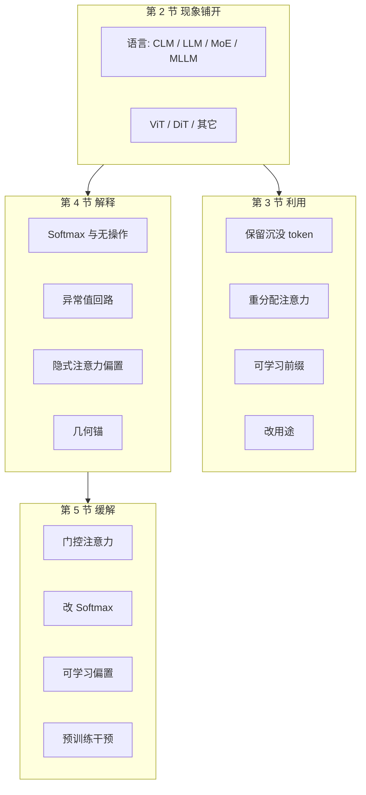

# Attention-Sink-Survey：注意力沉没是 bug 还是锚，这张地图切在利用、解释、缓解三刀上

<!-- release-date: 2026-04-11 -->

**本文依据**：`Attention Sink in Transformers: A Survey on Utilization, Interpretation, and Mitigation`，arXiv 2604.10098**v2**（页眉 `[cs.LG] 5 Jun 2026`），**103 页**。封面**没有会议名**。作者 Zunhai Su 等；封面第一单位 **Tsinghua University**，另有 Meituan LongCat Team、The University of Hong Kong、University of Michigan、Xiamen University、The Ohio State University、Columbia University、Shanghai Artificial Intelligence Laboratory、The Hong Kong Polytechnic University（PDF p. 1）。通讯作者 Zunhai Su、Ngai Wong。清单仓 `https://github.com/ZunhaiSu/Awesome-Attention-Sink` 印在封面（PDF p. 1）。盘上已是 v2。首发日取 arXiv v1 **2026-04-11**（Submitted on 11 Apr 2026）；v2 不回写。解读依据 v2。文中数字均标 PDF 页码；标「外部补充」的段落不来自本文。

## 一句话

Transformer 里总有一小撮**语义几乎为空**的 token，却吸走不成比例的注意力。作者把这叫 **注意力沉没**（Attention Sink，AS）：不是「注意力高」就够，关键是**注意力质量与信息量不匹配**（PDF p. 1、p. 10）。它同时搅训练、搅推理、搅可解释性，还和幻觉、量化崩盘绑在一起（PDF p. 1、p. 4）。

这张综述自称领域第一篇 AS 综述。主矛盾不是再列一遍 StreamingLLM，而是：**同一团现象，有人当锚来保、有人当病来治，解释层还在用五套语言说话**。作者把文献切成三刀——**基本利用、机制解释、策略缓解**——对应三个开放问题：现有模型怎么用 AS、它从哪来、下一代能不能不再依赖它（PDF p. 1、p. 4、p. 6–7）。结论段写：他们综了 **180 余篇**；引言与贡献段又写 **210 余 / 200 余**（PDF p. 6–7、p. 73）。这是作者自己的计数口径，不是统一排行榜。

贯穿全文的轴不是「谁分数最高」，而是：**softmax 必须加到 1、头有时想什么都不加，于是模型自己造了一个数值水库。** 水库可以当锚，也可以当后门。

## 一、这张地图切了几刀

### 旧图切不动的地方

先前工作把 AS 散落在 KV 压缩、稀疏注意力、量化、幻觉、ViT 伪影里。作者说缺一张统一地图（PDF p. 4）。图 3 把时间线画成三段（PDF p. 6）：

1. **2023 起 · 基本利用**：把 AS 当可剥削的经验现象（StreamingLLM、H2O、ACT 等）。
2. **2024 起 · 机制解释**：追成因与功能角色。
3. **2025 起 · 策略缓解**：从结构上切断或替换隐式沉没，服务稳定训练与低比特部署。

图 1 是目录总图：第 2 节按架构铺现象，第 3–5 节是三刀，第 6 节九个应用场景，第 7 节挑战（PDF p. 1）。**轴本身是这篇综述的主贡献**；收了多少篇是副产品。

图是机制示意，对应 PDF p. 1 图 1 与 p. 5 图 2。

### 第一刀：什么才算沉没 token

第 2.2 节给判据。高注意力不够；必须是 **注意力质量高、任务信息低**（PDF p. 10）。两条稳定特征：分数极端高；内容本身弱语义（LLM 的 `[BOS]`、ViT 的背景块）。LLaMA 系里，首 token 在 **98%** 的头上拿到最大注意力（综述转述，PDF p. 10）。识别可用阈值：累计注意力远超全局均值，松弛阈值 $\tau$ 可取很大，例如文献里的 **1000**（PDF p. 10 式 (5)）。

架构差异只改落点，不改原则（PDF p. 9–10）：

| 家族 | 沉没常落在哪 |
|---|---|
| 经典编码器（BERT / RoBERTa） | `[CLS]`、`[SEP]`、句点逗号 |
| 因果 LLM（稠密与 MoE） | 首 token、强分隔符、弱语义 token |
| ViT | 低信息背景块 |
| 多模态 LLM | 文本侧 `[BOS]` + 视觉侧低信息块 |

因果掩码让**只有开头对整段可见**，所以首 token 是最稳的卸载位（PDF p. 12）。BERT 更早被诊断过：浅层盯 `[CLS]`、中层盯 `[SEP]`、深层盯标点，一个头往往一半以上注意力砸在这些特殊 token 上（PDF p. 11 图 5）。Llama-2-7B：第 0–1 层偏局部，更深几乎所有头都钉在首 token（PDF p. 12 图 6）。AS 还被写成预训练收敛后才长出来的性质：大学习率、大权重衰减更明显（PDF p. 13）。

MoE 多一刀：AS 和极稀疏的 **Super Experts** 绑死。Qwen3-30B-A3B 里 **6144** 个专家只剪 **3** 个，前向就崩；sink token 在 Super Experts 上路由分特别高（PDF p. 14 图 9）。DiT 又不一样：中层高范数 token 当场景级载体；消融有时几乎不影响生成质量，但因果干预里压 AS 不伤 CLIP-T 对齐，却造成大约 **6 倍于随机掩码** 的感知偏移（PDF p. 18）。扩散语言模型的 sink **会在生成中移动**，去掉后性能只轻微掉（PDF p. 19）。

### 第二刀：利用四范式（被动 → 主动 → 可控 → 改用途）

第 3 节按「怎么管这团质量」切，不是按任务切（PDF p. 21）：

1. **保留**：不改分布，永远把自然 sink 留在可见集里。
2. **重分配**：从 sink 抽质量，补给语义目标，尽量保住总质量。
3. **可学习前缀**：训练专用 token，当显式水库。
4. **改用途**：不改分布、不加 token，把 sink 的几何 / 数值当原语去做攻防与压缩。

### 第三刀：解释五层，缓解两原则

第 4 节把解释摊成五层分析（PDF p. 51–52）：数学起源、训练动力学、数值机制、几何结构、功能角色。第 5 节把缓解收成两条原则（PDF p. 53、p. 67）：**给显式替代**（门控、可学习偏置、残差门控缩放、架构隔离），或 **切断因果链**（改 Softmax、预训练干预、改归一化、改 Value 反传、辅助损失）。

第 6 节再横切九个场景：预训练、微调、高效推理、可解释、降幻觉、安全、通用能力、长上下文、多模态（PDF p. 68–70）。这是应用索引，不是第三套分类轴。

## 二、每一区里有什么

下面按第 3–6 节走。**Key Takeaways 框是作者写在各小节开头的收敛句**；框外点名的工作是地图上的钉子。还在打架的放到第三节。

### 3.1 保留：StreamingLLM 那一刀已经收敛成默认启发式

Takeaway：自然吸走多余注意力的 token，可以永久留下，好在狠压缩上下文时稳住注意力（PDF p. 21）。图 13 转述 StreamingLLM：稠密注意 PPL **5641**；只留窗口、丢掉开头 **5158**；窗口加每步重算 **5.43**；保留 sink + 近窗口 **5.40**，复杂度 $O(TL)$（PDF p. 21）。H2O 把「累计注意力高」的 heavy hitter 当锚（PDF p. 22）。MInference 三种稀疏图案都强制 sink 可见，预填充可加速至 **10 倍**、声称不掉点（PDF p. 22–23）。DuoAttention 分检索头（满 KV）与流式头（只留 sink+窗口）（PDF p. 23）。量化侧 IntactKV / SKVQ / KVQuant / RotateKV / KVSink 对 sink **保满精度**，其余狠量化，支撑 2-bit KV（PDF p. 23）。视频侧 Rolling Forcing、Deep Sink（滑动窗一半留给持久 sink）、MotionStream（恒定代价无限长视频）（PDF p. 18、p. 23）。

已收敛：长上下文推理里「别把开头扔了」几乎成默认。还在打架：sink 位置并不总是静态；非首位置、ViT / MLLM 背景块要动态认，又和 FlashAttention 类核冲突（PDF p. 24）。

### 3.2 重分配：多模态幻觉这条线最密

显式公式用 $\alpha$ 留 sink、$\beta$ 补给目标，且 $\alpha+\beta=1$（PDF p. 25 式 (20)）。全 redistributing（$\alpha=0,\beta=1$）：VAR 把视觉背景 sink 补给前景；AttnReal、GasEraser 打幻觉与对抗（PDF p. 26）。只降 sink（$\beta=0$）：VASparse（PDF p. 27）。头级广播：EVAS 把浅层最密 sink 头的图案拷到同层其它头（PDF p. 27）。自适应：ACT 按输入调 $\alpha,\beta$；ZeroTuning 只调首 token logit 偏置 $b$，靠 softmax 零和把质量挤出去；A2SF 用遗忘因子 $\gamma$ 衰减历史累计分，防首 token 囤 KV（PDF p. 27）。Pos2Distill 用开头优势位的注意力教中间劣势位（PDF p. 28）。T-SAM 在文生图里用文本自注意当监督去对齐交叉注意（PDF p. 28）。

已收敛：视觉 sink 吸走质量、补给前景能减幻觉，是多模态侧反复出现的配方。还在打架：识别 sink 的开销、softmax 之后改分与高性能核不兼容（PDF p. 28）。

### 3.3 可学习前缀：ViT 的 register 已经产品化

前缀 $P$ 插在序列头，推理期固定（PDF p. 29 式 (28)）。StreamingLLM 另有可训练占位符常驻 KV（PDF p. 30 图 17）。CushionCache 用前缀收异常激活，好做粗粒度激活量化（PDF p. 30 图 18）。Vision Transformers Need Registers：背景伪影被 register 吸走，稠密预测更干净（PDF p. 30–31 图 19）。VGGT 每帧加 camera / register；DINOv3 把 **四个** register 写成标配（PDF p. 31）。FOCUS 只训一个 `[SINK]`，参数开销 **小于 1%**（PDF p. 31）。CTR-Sink、EARN 双边界 register 做推荐；UniGist、SinkLoRA 做长上下文压缩；RetoVLA 把本来丢掉的 register 打进动作规划，真机操作 **+17.1%**（PDF p. 20、p. 32）。作者也写：register **并不消灭 AS**，只是把沉没从背景块搬到可控前缀（PDF p. 17）。

### 3.4 改用途：同一锚既是后门也是压缩信号

进攻：遗忘后门把触发器放在 sink 位更顽固；Mirage 用 sink 打 MLLM 幻觉攻击（PDF p. 33–35 图 21）。防守：Surgery 正则化 sink 散度；register 嵌入平均进 `[CLS]` 做 OOD（PDF p. 34）。效率：KeyDiff 用「与平均 key 余弦近 0」认锚；OmniSparse、StreamingDialogue 当记忆锚（PDF p. 34）。

### 第 4 节 解释：五层不是互相淘汰

**Softmax 与无操作（4.1）。** 没有「空操作」选项时，权重必须加到 1，质量就卸到弱信息 token；sink 的 value 范数被学到接近 0（PDF p. 36–37 式 (40)–(41)）。因果证据：门控、Softpick（340M 上 sink 率 **63.41% → 0%**，激活峰度 **33510 → 340**）、Softmax-1（首 token 注意力 **65% → 3.3%**）、Sigmoid 注意（PDF p. 38–39、p. 58）。VGA 还指出注意力与 value 抽干互相加强（PDF p. 37）。

**异常值回路（4.2）。** 权重异常（如 Super Weight）、激活异常（Activation Spikes / Massive Activations）、注意力异常（就是 AS）沿特征维与位置对齐（PDF p. 41）。因果链：早期 up/gate 放大 → down-proj 列异常经残差传到层输出 → QK 点积爆炸、value 仍小（PDF p. 42）。KVSink：异常值在 Llama-2-7B 上 **第 1 层冒头、2–29 稳定、30 消散、31 终态**（PDF p. 43 图 29）。剪 Super Experts 会让 AS 塌、输出变重复废话（PDF p. 43）。

**隐式注意力偏置（4.3）。** sink 对每个 query 的 value 更新几乎一样，等于给所有位置加常数偏置（PDF p. 45 式 (42)）。接上显式 $k',v'$ 后，GPT-2 上 Massive Activations 与 AS 一起消失（PDF p. 45–46）。

**几何锚（4.4）。** 位置向量分解、OrthoRank（与 sink 越正交越有信息）、KeyDiff（$ \cos(k_s,\bar k)\approx 0 $，Spearman 约 **0.94**）（PDF p. 47–49）。超训练窗后位置向量 OOD，AS 消失、PPL 陡升（PDF p. 49）。作者承认：证据多为相关，因果干预少（PDF p. 50）。

**其它（4.5）。** 因果掩码 / RoPE 结构偏置；反过混合（首 token 防表示塌缩）；谱能量「暗信号」；主动–休眠头；Mix-Compress-Refine 中段压缩谷；异常值当隐式缩放（PDF p. 50–52）。

### 第 5 节 缓解：能消 sink，但几乎都要从头训

**门控（5.1）。** Quantizable Transformers 用 $\sigma(G(x))$ 逐元乘注意力输出，把无操作从极端 logit 上解耦（PDF p. 53 式 (47)）。Qiu 等扫 15B MoE 与 1.7B 稠密、**3.5T** token：SDPA 之后做 query 相关标量门最好；基线对首 token 平均 **46.7%** 注意力，门控后 **4.8%**；第 21 层头均 **83% → 4%**（PDF p. 54–55 图 37–38）。Qwen3-Next、Qwen3.5 采用该设计（PDF p. 55）。VGA 改在 value 上先门（PDF p. 55–56）。限制：要从头训、参数开销、缺统一评测（PDF p. 56）。

**改 Softmax（5.2）。** clipped softmax 可让有限输入打出精确 0/1（PDF p. 57）。Softmax-1 分母加 1；峰度 **1657 → 3.1**，支撑 4-bit（PDF p. 58）。Elastic-Softmax 报 **59.58%** 注意力稀疏（PDF p. 58）。Softpick 非归一化；SWAT 用 sigmoid 注意，按构造不可能 AS（PDF p. 59）。限制：分布过平会伤需要尖注意力的任务；与现成核不兼容（PDF p. 60）。

**可学习偏置（5.3）。** 四家：拼接 $k',v'$；只加 $K_{\mathrm{bias}}$；上下文相关缩放 $S_c(x)$；分母标量 $b$（MiMo-V2-Flash、GPT-OSS 的虚沉没位）（PDF p. 61–62）。

**预训练干预（5.4）。** TWEO 把异常从 **超过 10000 压到 20 以下**，FP8 训可对齐 BF16，吞吐 **+36%**（PDF p. 63）。去相关损失打 AVSR 中间 sink（PDF p. 64）。OrthoAdam：峰度 **1657 → 3.1**，4-bit 权重量化的 PPL 惩罚 **3565 → 0.3**（PDF p. 65）。OSP：Muon + 单标量 RMSNorm + 嵌入后可学习投影，**1.4B / 1T token**，作者称为首个生产规模无极端激活异常的 LLM（PDF p. 65）。LongCat-Flash 用辅助损失在预训练里压 AS 与 Massive Activations（PDF p. 14）。

### 第 6 节 应用：处方清单，不是新实验

九块都是「场景 → 选哪一刀」的指南（PDF p. 68–70）。共同模式：**要流式 / 压缩就保留或加前缀；要幻觉 / 量化 / 稳训就改门控、Softmax 或优化器；同一 sink 在安全论文里既是触发器也是监测信号。** 长上下文块写：无限流式输入优先保 KV 里的初始 sink；视频生成留深层 sink 当全局锚；要外推可上门控（PDF p. 69）。其它架构速记：Hymba 前置 meta token；FLEX 推理期 sink 做 **6×** 外推（30 秒），**12×** 对齐长视频微调基线；LongStream 丢掉首帧锚，公里级重建 **18 FPS**；OutRo 解码开销 **1.1×**（PDF p. 20）。

## 三、作者的判断（和他们综述到的事实分开）

第 2 节现象、第 3–5 节分类、各论文数字，是「他们综述到的事实」。下面只写后一层：他们认为缺什么、什么在打架。

**利用与缓解不是同一目标。** 保留派把 AS 当结构锚；缓解派把同一团质量当容量浪费与量化毒药。作者没有宣布一派胜利，而是按场景开药（第 6 节）。这是编辑判断，不是新实验。

**解释层尚未统一。** Softmax 无操作解释「为什么不可避免」；异常值回路解释「哪条数值通路在养它」；隐式偏置解释「功能上在干什么」；几何锚解释「表示空间里像什么」。第 4.5 节的总表是作者的阅读框架（PDF p. 51–52）。他们自己写：异常值回路的因果仍不完整、训练动力学几乎没形式化；几何锚多为相关（PDF p. 44、p. 50）。

**缓解的共同短板。** 第 7.1 节三条挑战（PDF p. 71）：动态识别与核兼容的开销；门控 / 改 Softmax / 可学习偏置几乎都要**从头训**；无操作与异常值对齐的训练动力学不清楚。第 7.2 节八条方向同样是开放题，不是结论：轻量处理、对已训模型做适配（adapter / LoRA / 持续预训练）、形式化训练动力学、新兴架构（混合线性注意、3D Transformer）、统一理论、标准化基准、跨模态迁移、多技术协同（PDF p. 71–72）。

**DiT / DLM 可能改写「AS 必需」叙事。** 语言侧剪 Super Experts 会灾难；DiT 上消融有时几乎不伤生成；DLM 的移动 sink 去掉只轻微掉点（PDF p. 18–19）。作者把这些写成现象差异，没有收成「AS 可有可无」。

**局限（第 9 节，作者自白）。** 主视野停在 CLM / LLM / MLLM / MoE / ViT；混合线性注意、VGGT 等因 AS 文献少，覆盖不全（PDF p. 73）。Awesome 清单会继续变；本文只解释 103 页 PDF 冻结下来的那张地图。

## 四、这张地图指向哪些值得单独读

下面几篇是轴上的锚点，不是排行榜。标题出自本 PDF 参考文献。正文不写待办。综述对会议论文往往只印会议名、不印 arXiv 号；下列 **arXiv 号仅收录参考文献里印了的**。

1. **Efficient Streaming Language Models with Attention Sinks**（综述 [25]，ICLR 2024）——利用刀的时间零点：保首 token + 近窗口，无限流式。参考文献未印 arXiv。
2. **Quantizable Transformers: Removing Outliers by Helping Attention Heads Do Nothing**（综述 [30]，NeurIPS 2023）——无操作理论与门控 / clipped softmax 的共同源头。参考文献未印 arXiv。
3. **Gated Attention for Large Language Models: Non-linearity, Sparsity, and Attention-Sink-Free**（综述 [27]，NeurIPS 2025）——生产级门控：15B MoE / 1.7B、3.5T token，首 token 注意力 46.7% → 4.8%。参考文献未印 arXiv。
4. **When Attention Sink Emerges in Language Models: An Empirical View**（综述 [26]，ICLR 2025）——训练动态与可学习 key 偏置的因果实验。参考文献未印 arXiv。
5. **Value-State Gated Attention for Mitigating Extreme-Token Phenomena in Transformers**（arXiv **2510.09017**）——在 value 上先门，打断注意力–value 抽干循环。
6. **Unveiling Super Experts in Mixture-of-Experts Large Language Models**（综述 [43]，ICLR 2026）——MoE 上 3/6144 专家与 AS 的因果。参考文献未印 arXiv。

读完这六篇，三刀（利用 / 解释 / 缓解）都能落到具体系统上。Massive Activations、Vision Transformers Need Registers、H2O 同属钉子，但不是必须先读才能走路的入口。

## 限制与本文没写的

综述没有自己跑一张统一排行榜；StreamingLLM 的 PPL、门控百分比、Softpick 峰度等均为各论文自称、综述转述。引言「210 余篇」与结论「180 余篇」并存，不要合成一个数。封面未印会议，不补。GitHub 清单会变，本文只解释 v2 PDF。作者把「不依赖 AS 的下一代 Transformer」写成志向；证据止于各家缓解配方在各自设定上的消 sink / 量化数字。
