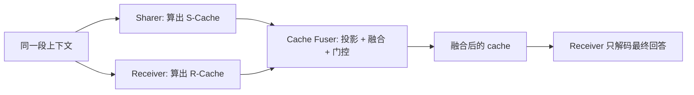

# Cache-to-Cache：把 KV Cache 当成模型之间的语义通道

<!-- release-date: 2025-10-03 -->

**本文依据**：`CACHE-TO-CACHE: DIRECT SEMANTIC COMMUNICATION BETWEEN LARGE LANGUAGE MODELS`，ICLR 2026，arXiv 2510.03215v2（[cs.CL] 2 Mar 2026），29 页。第一作者 Tianyu Fu（共同一作另有 Zihan Min、Hanling Zhang），封面编号 **1 = Tsinghua University**；其余为 Infinigence AI、The Chinese University of Hong Kong、Shanghai Jiao Tong University、SLAI、Shanghai AI Laboratory。通讯 Yu Wang。代码 `github.com/thu-nics/C2C`。首发日取 arXiv v1 提交日 2025-10-03。文中数字都标 PDF 页码；标「外部补充」的段落不来自本文。

## 一句话

多模型系统今天几乎都靠**把内部状态压成一段话**再交给下一个模型。本文问：能不能直接传 KV Cache？Oracle 说明：同样长度的 cache 只要语义更富就能涨分，而且跨模型可投影。于是提出 **Cache-to-Cache（C2C）**：用可学习 fuser 把 Sharer 的 cache 投影、融合进 Receiver，再用逐层门控决定哪些层该接。摘要写：相对单模型平均准确率高 **6.4–14.2** 个百分点，相对文本通信高约 **3.1–5.4** 个百分点，延迟平均 **2.5×**（PDF p. 1）。主表 Receiver 固定 Qwen3-0.6B 时，相对三个 Sharer 的平均涨幅是 **11.00 / 9.64 / 11.88** 个百分点，相对 T2T 是 **5.36 / 4.15 / 3.06** 个百分点（PDF p. 7–8）。

## 一、矛盾：协作已经发生了，通道还是「说话」

LLM 各有专长：代码、数学、视觉、端侧。多模型系统想把这些专长拼起来，现有两条路（PDF p. 1–2）：

- **协作式**：角色分工，主动互发文本（Chain-of-Agents、MetaGPT、Mixture-of-Agents、辩论）。
- **路由式**：按查询或 token 选模型；下游往往只继承对话文本，并不继承上游已经算过的内部表示。

图 2 用 Coder–Writer 讲清文本通道的三处漏（PDF p. 2）：

1. **带宽低**。高维内部表示被压成线性字符串，接收端再解压。Coder 心里知道 `
` 是段落起点，写出来的指令却含糊，Writer 把自我介绍塞错位置。
2. **自然语言含糊**。MCP / A2A 一类协议能把格式钉死，钉不死开放域里的语义。
3. **延迟是逐 token 的**。每次交换都要把「解释」完整解码一遍。

作者因此把问题写成一句：LLMs 能不能在文本之外通信？（PDF p. 2）

KV Cache 本来就是 prefill 留下的按 token 中间结果，比文本稠，而且可以一次投影、不必顺序生成。本文把它从「同一模型加速用的缓存」改成「跨模型语义介质」。

上图根据 PDF 图 1 / 图 5 重画，是机制示意，不是实测曲线。对照：T2T 要先让 Sharer 把分析文本逐词吐完，再拼进 Receiver 的输入（PDF p. 1）。

## 二、和「cache 复用」不是同一件事

第 2 节把邻居划开（PDF p. 2–3）：

- **层间共享**（YOCO、CLA、KVSharer 等）：同一模型浅层 cache 给深层，为了省算。
- **查询间复用**（GPTCache、CacheBlend、Mooncake、KVLink）：同一模型、公共前缀或文档。
- **DroidSpeak**：同一基座微调出来的模型之间复用。

C2C 要的是**语义搬家**：跨家族、跨尺寸。路由系统若完全丢掉上游上下文、或只靠自己读同一段历史，小模型就用不上大模型已经算过的表示（PDF p. 3）。

## 三、记号：谁给理解，谁用理解

自回归推理分 prefill 与 decode。输入 $X_{[0:n]}=[x_0,\ldots,x_{n-1}]$，prefill 得到每 token 的 cache $C(X_{[0:n]})=[c_0,\ldots,c_{n-1}]\in\mathbb{R}^{n\times d}$；$d$ 把各层 KV 展平（PDF p. 3）。解码：

$$
y_{i+1}=P\bigl(y_i \mid C(X)\oplus C(Y_{[0:i]})\bigr)
$$

$\oplus$ 是序列维拼接。提供上下文理解的叫 **Sharer**，使用它的叫 **Receiver**（PDF p. 3）。

## 四、两个 Oracle：值不值得传、传不传得过去

### 4.1 富化：同样长的 cache，语义可以更值钱

Few-shot 涨分，到底是因为多看了 exemplar token，还是因为问题 $X$ 自己的嵌入被 exemplars $E$ 养肥了？三种设置（PDF p. 4，表 1）：

| 方法 | Cache 长度 | 是否富化 | Acc.（%） |
|---|---|---|---:|
| Direct | $\|X\|$ | 否 | 58.42 |
| Few-shot | $\|E\|+\|X\|$ | 是 | 63.39 |
| Oracle | $\|X\|$ | 是 | 62.34 |

Oracle 在 $E\oplus X$ 上 prefill，再丢掉 exemplar 那段，只留问题对齐的切片 $C^*(X)=C_{[|E|:|E|+|X|]}(E\oplus X)$。Direct 对 Oracle：长度一样，Oracle 仍高 **3.92** 个百分点——增益来自更富的问题嵌入，不是更长的可注意力序列（PDF p. 4）。

层间差异很大。附录表 10：基线 58.42%；只富化第 4 层到 **58.52**、第 16 层到 **58.45**，多数单层反而掉（第 6 层 54.56）（PDF p. 16）。图 4：挑最好的若干层一起富化，比全层略好；挑最差的层会掉（PDF p. 4）。这直接导出后面的**逐层门控**。

### 4.2 可转换：空间离得远，MLP 能推进去

用 3 层 MLP 把 Qwen3-4B 的 KV 映到 Qwen3-0.6B（附录 A.3.2：MMLU-Redux、MSE、最后一层，PDF p. 19）。图 3 的 t-SNE：原始两团分开，变换后落入目标空间，但只占目标的一个子集——更大的 Sharer 也覆盖不了 Receiver 的全部编码方式（PDF p. 5）。图 7 的正确题集合重叠有限，互补是真的（PDF p. 17）。

## 五、C2C：投影、融合、残差、门控

目标：从 Sharer 抽出有用的上下文理解，融进 Receiver，且**不要把 Receiver 自己的 cache 覆盖掉**（PDF p. 5）。

有一组 key/value fuser $F$ 和层映射 $G$。prefill 时第 $n$ 层：

$$
C^F_n = C_n(X) + F_n\bigl(C_n(X),\, C^S_{G(n)}(X)\bigr)
$$

解码只用融合后的上下文 cache，生成前缀仍用 Receiver 自己的 decode cache（公式 4，PDF p. 5）。

Fuser 三块（图 5，PDF p. 5–6）：

1. **投影**：拼接双方 cache，过投影层和特征融合层。
2. **动态加权**：输入相关的 head 调制，按查询重加权。
3. **可学习门**：每层一个门；训练用 Gumbel-sigmoid，温度从 **1.0** 退火到 **0.001**，推理变二元（PDF p. 6、p. 20）。

两个对齐（PDF p. 6，附录 A.1）：

- **Token**：把 Receiver 的每个 token 解码成字符串，再用 Sharer tokenizer 重编码；一对多时取**字符串覆盖最长**的那个（两种策略超过 80% 序列对齐结果相同）。Chat 模板段没有语义，用 `<pad>` 把两边垫齐。
- **层**：采用 **terminal alignment**——先对齐最后一层，再倒数第二……直到浅模型的第一层。相对按深度归一化的均匀对齐，实验略好、实现更简单。

训练：两个 LLM **冻结**，只训 C2C。损失是 Receiver 在融合 cache 上的 next-token 预测，像 SFT，但条件是融合 cache 而不是自己的 cache。三步：双方前向出 cache → 融合替换 Receiver cache → Receiver 对回答 prefill，梯度只回 C2C（PDF p. 6）。

更复杂的 **C2C-C** 先用 3 层 MLP 把 Sharer 投到 Receiver 维再融合。表 9（回答最长 8、通信最长 256）：Qwen3-4B → Qwen3-0.6B 时，C2C-C 在 C-Eval / ARC-C / MMLU-Redux / OpenBook 上 Acc **60.63 / 80.96 / 62.78 / 70.40**，PGR **79 / 86 / 76 / 78%**；默认 C2C 是 **44.40 / 60.17 / 45.92 / 55.20**，PGR **34 / 41 / 29 / 40%**。作者仍把主文 fuser 保持简单，复杂结构留给后续（PDF p. 16）。

## 六、实验怎么摆

模型覆盖 Qwen2.5 / Qwen3 / Llama3.2 / Gemma3：跨代、跨家族、0.6B–14B、通用/代码/数学、基座与指令（PDF p. 6）。消融与尺度分析默认锁在 Qwen3，避免对齐混杂。

基线：T2T（Sharer 先写一句解题所需背景、禁止直接给答案，再拼给 Receiver）；查询级路由（RouteLLM 式矩阵分解，按难度对半分给更强/更弱模型）；以及单模型下界（PDF p. 6–7、p. 19）。

基准：OpenBookQA、MMLU-Redux、ARC-C、C-Eval。主实验 fuser 用 OpenHermes2.5 前 **50 万** 条；尺度与行为分析改用 MMLU  auxiliary train，省钱（PDF p. 7）。评测：零样本、温度 0、选择题最长生成 **64**、T2T 通信最长 **256**（除非另注）；效率是单卡 A100、batch 1 的平均墙钟（PDF p. 7、p. 20）。

主实验训练：序列 **2048**，macro batch **256**，**1929** 步、1 epoch；学习率 $1\times 10^{-4}$，线性、10% warmup，weight decay 0.01，梯度范数 1，seed 42（PDF p. 20）。

## 七、主结果：涨分，而且少解码

表 4，Receiver 一律 Qwen3-0.6B（PDF p. 8）：

| Sharer | 任务 | Receiver Acc | Sharer Acc | Routing | T2T Acc / 时间(s) | C2C Acc / 时间(s) |
|---|---|---:|---:|---:|---|---|
| Qwen2.5-0.5B | MMLU-Redux | 35.53 | 38.42 | 35.58 | 41.03 / 1.52 | 42.92 / 0.40 |
| | OpenBook | 39.20 | 45.60 | 40.80 | 44.00 / 0.81 | 52.60 / 0.30 |
| | ARC-C | 41.04 | 42.09 | 40.70 | 49.48 / 1.00 | 54.52 / 0.36 |
| | C-Eval | 32.04 | 40.21 | 34.61 | 35.88 / 1.51 | 41.77 / 0.34 |
| Llama3.2-1B | MMLU-Redux | 35.53 | 32.30 | 33.38 | 43.32 / 0.75 | 44.42 / 0.50 |
| | OpenBook | 39.20 | 32.60 | 36.40 | 41.20 / 0.70 | 47.80 / 0.43 |
| | ARC-C | 41.04 | 33.57 | 37.22 | 50.00 / 0.70 | 53.39 / 0.47 |
| | C-Eval | 32.04 | 31.31 | 31.92 | 35.27 / 0.71 | 40.77 / 0.49 |
| Qwen3-4B-Base | MMLU-Redux | 35.53 | 1.03 | 16.39 | 43.87 / 7.54 | 43.95 / 0.45 |
| | OpenBook | 39.20 | 2.20 | 22.20 | 46.40 / 5.08 | 53.20 / 0.34 |
| | ARC-C | 41.04 | 1.48 | 19.65 | 53.91 / 6.56 | 55.39 / 0.40 |
| | C-Eval | 32.04 | 5.65 | 15.10 | 38.92 / 3.59 | 42.79 / 0.39 |

三点读法：

- 相对三个 Sharer，C2C 平均准确率分别高 **11.00 / 9.64 / 11.88** 个百分点；相对 T2T 高 **5.36 / 4.15 / 3.06** 个百分点（PDF p. 7）。
- 路由把准确率卡在「两个原模型里较好的那个」附近，甚至更差。
- **Qwen3-4B-Base 经常不听指令**：单独 Acc 掉到 1% 量级，T2T 通信时间爆炸（7.54 s）。C2C 绕过「必须先把话说明白」：指令微调的弱 Receiver 仍能抽基座的知识（PDF p. 7）。

相对 T2T 的加速：**3.46× / 1.51× / 14.41×**（PDF p. 7）。表 3（MMLU-Redux，Qwen2.5-0.5B-Instruct → Qwen3-0.6B）：T2T 的 Sharer 要解 **80** 个通信 token、decode **1312** ms；C2C 的 Sharer 输出 token 为 **0**，融合 **90** ms，总时间 **445** ms 对 T2T 的 **1596** ms（PDF p. 7）。Llama3.2 特别快，附录归因于实现更快、且 Non-CoT 下常只吐一个选项字母（PDF p. 23）。

## 八、尺度、组合、消融

**序列长度**（LongBenchV1，Qwen3-0.6B ← Qwen2.5-0.5B，表 5，PDF p. 9）：

| 长度 | Receiver | Sharer | T2T | C2C |
|---|---:|---:|---:|---:|
| 0–4k | 30.52 | 24.94 | 33.46 | 37.31 |
| 4–8k | 26.03 | 23.18 | 29.70 | 34.01 |
| 8k+ | 25.99 | 16.44 | 25.64 | 30.72 |

三段都赢 T2T。强到弱（Qwen3-4B → 0.6B，表 11）平均 C2C **37.97**，T2T **36.18**，弱到强缺口的 PGR **51.01%**（PDF p. 16–17）。

**模型尺寸**（图 6）：横轴 Qwen2.5-Instruct Sharer 尺寸，纵轴相对 Receiver-only 的 $\Delta$Acc，曲线是 Qwen3 Receiver。C2C 的增益一般比 T2T 涨得更快；更大 Receiver 因基线高、与 Sharer 知识重叠多，相对增益变小（PDF p. 7–8）。

**异质与对调**（表 7，MMLU-Redux，PDF p. 9）：五组平均 C2C 比 T2T 高 **8.59** 个百分点。Qwen2.5-Math 当 Sharer 时文本极长（附录把通信/回答上限拉到 **1024**）。对调角色：C2C 仍 **+5.05**，T2T 反而 **-6.30**（PDF p. 8–9）。

**增益从哪来**（表 6，PDF p. 9）：

| 设置 | #Param | OpenBook | ARC-C | MMLU | C-Eval |
|---|---:|---:|---:|---:|---:|
| Single（只微调 Receiver） | 596M | 45.80 | 47.65 | 36.81 | 35.81 |
| Identical（同一 LLM 自通） | 529M | 50.60 | 52.52 | 42.17 | 40.34 |
| C2C（异质 Sharer） | 478M | 52.60 | 54.52 | 42.92 | 41.77 |

不是多出来的可训容量，也不是过拟合训练集。Identical 仍高于 Single，作者把它和潜空间推理、looped Transformer 放在一起理解（PDF p. 9）。

**Fuser 组件**（表 8，PDF p. 10）：只投影、丢掉 Receiver cache，平均 Acc **20.70**；残差融合到 **44.88**（+24.18）；再加门到 **47.95**（+3.07）。

## 九、行为：秩、门、渐进、失败

表 2：融合后 K 的平均有效秩 **388 → 395**，V **532 → 560**（PDF p. 4、p. 10）。图 12：V 在浅层升得明显，K 在深层可比并升高（PDF p. 22–23）。有效秩按 Roy & Vetterli：奇异值归一成 $p_i$ 后 $\mathrm{erank}(W)=\exp(H(p))$（PDF p. 22）。

正确题 Venn（图 7，用的是 C2C-C）：能力接近时，C2C 会做出两边都没单独做对的题；能力悬殊时更吃强 Sharer——Qwen3-4B 做对的题里 C2C 也对 **72.11%**，Qwen2.5-Math 那组只有 **50.97%**（PDF p. 17）。子类：Qwen2.5-0.5B 配对 17 类里 12 类赢 T2T，历史 / 法律 / 化学额外 **7 / 7.6 / 7.5**；Qwen3-4B 配对 17 类全赢，工程上 T2T **-1%**、C2C **+24%**（PDF p. 17–18）。

渐进替换（图 11）：替换比例先降后升，超过 **50%** 再加就持续涨；从后往前替换（更靠近最终回答）影响更大。训练只用全量 Receiver cache，部分替换有训测差（PDF p. 18）。

门控（附录 A.4.2，PDF p. 23）：

- OpenHermes 通训：三组表 4 组合平均门开比例 **>98.21%**，靠动态权重细调，有的层平均 key 权重 **<0.1**。
- MMLU 任务训：表 7 组合平均门开 **52.67%**，打开的层权重多 **>0.4**。

通训「门几乎全开、权重微调」；专训「少开几层、开了就用重」。

训练成本（表 12）：约 **300** 步（不到 **9** GPU 小时）已接近终检点。Qwen2.5-0.5B+Qwen3-0.6B：300 步 MMLU-Redux **44.30**，1929 步反而是 **42.92**；墙钟终局 **5.59** h / **44.72** GPU 小时（PDF p. 25）。损失约 250 步收敛，验证损失约 1000 步走平；跨家族并不更贵（图 13，PDF p. 25）。

失败例子（附录 A.4.6）：会计应计题，Receiver 单独选对 A（$2{,}500$），Sharer 算错，T2T 与 C2C 都被带去 B（$3{,}700$）（PDF p. 26–27）。弱 Sharer 喂强 Receiver 时，T2T 和 C2C 都会被噪声拖下水——这是第 5 节写明的限制（PDF p. 10）。

定性例子（A.4.4，CoT 提示）：Hill 环境伦理题，两边单模型与 T2T 都选错，C2C 选对 B（PDF p. 24–25）。这是个例，不是统计。

## 十、多对多与 Agent：附录里的探路，不是主文承诺

一对多 Sharer（表 13，MMLU）：Qwen3-0.6B 单独 **35.53**；4B-Base → Receiver **60.71**；Math → Receiver **46.13**；两个 Sharer 一起、**不再额外训练** **64.60**（PDF p. 25–28）。

多 Receiver 多 Sharer想把 $O(N^2)$ 降到 $O(N)$：Sharer 先投影到统一 latent，再各 Receiver 融合（$M$ 个投影 + $N$ 个 fuser）。表 14 数字与正文「Coder + Math」的叙述不完全同一组模型，以表格为准：无 Sharer 时两 Receiver **34.78 / 38.44**；两 Sharer 一起 **51.08 / 59.81**（PDF p. 28）。作者写这是初步套用成对超参。

Agent 流（Cognify 的解释器 + 求解器，GSM8K，表 15，PDF p. 28–29）：

| 方法 | Acc |
|---|---:|
| 单模型 Qwen3-0.6B | 41.17 |
| T2T 多 Agent | 61.18 |
| C2C | 62.55 |
| T-C2C（文本解释 + cache 融合） | 78.01 |

相对单模型，多 Agent T2T **+20.01**；C2C 再比 T2T **+1.37**；解释文本和 cache 一起用到 **78.01**。

讨论里还点了跨模态 VLM/VLA、投机解码与 token 路由、以及「只传 cache 不传明文」的隐私方向——都是展望（PDF p. 10）。限制除弱 Sharer 噪声外：成对可行，**$O(N)$ 训多个互通 LLM 仍开放**（PDF p. 10）。

## 十一、可迁移的几条，以及本文没写的

可直接带走的设计原则：

- 协作瓶颈常常在**通道**，不在有没有第二个模型。能避开「先生成一段解释」就同时省语义损失和 decode。
- Cache 当介质的前提是 **Oracle 两问**：同样长度能否因语义更富而涨分；空间能否被一个小网络推进去。
- **残差 + 门** 不是装饰：丢掉 Receiver cache 会崩到 20.70；门再捡回 3 个百分点。不是每层都该被富化。
- 指令很差的基座仍可能当 Sharer——C2C 不要求它把知识写成合规句子。
- 300 步附近就接近可用，不必默认跑满 1929 步（至少在他们的 MMLU-Redux 曲线上）。

不能假装已经解决的：

- 没有公开如何在生产推理引擎里做跨模型 KV 布局、分页、量化对齐。
- 主评测是零样本短答案选择题；长 CoT、工具、多轮 Agent 只有 GSM8K 附录。
- C2C-C、多对多、T-C2C 的数字不能直接当成默认 fuser 的数字。
- 有效秩升高是「更富」的代理，不是因果证明。

## 关键词回看

- **Sharer / Receiver**：给理解的模型 / 用理解来答题的模型。
- **T2T**：文本当唯一接口；要付信息瓶颈和逐 token 延迟。
- **C2C**：投影并融合 KV Cache，解码阶段不再生成中间文本。
- **Cache enrichment oracle**：同样 cache 长度，只改变问题段的语义含量。
- **Terminal alignment**：从最后一层往前对齐不同深度。
- **Gumbel 门**：训练可微、推理变开关，决定哪一层该听 Sharer。

## 参考资料

- 论文 PDF：`readings/_src/注意力与长上下文/Cache-to-Cache.pdf`
- 代码：https://github.com/thu-nics/C2C
