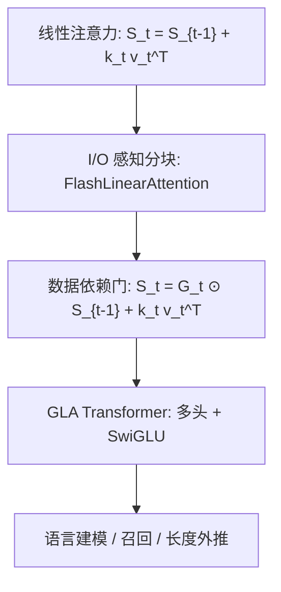

# GLA：给线性注意力加上数据依赖门，再做成能跑满 Tensor Core 的分块算法

<!-- release-date: 2023-12-11 -->

**本文依据**：`Gated Linear Attention Transformers with Hardware-Efficient Training`，arXiv 2312.06635v6（[cs.LG] 27 Aug 2024），23 页。作者 Songlin Yang、Bailin Wang、Yikang Shen、Rameswar Panda、Yoon Kim；封面标共同一作。封面第一单位 **Massachusetts Institute of Technology**；另有 MIT-IBM Watson AI Lab。封面印了 Proceedings of the 41st International Conference on Machine Learning, Vienna, Austria. PMLR 235, 2024。代码脚注 `https://github.com/sustcsonglin/flash-linear-attention`。首发日取 arXiv v1 提交日 2023-12-11。文中数字都标 PDF 页码；标「外部补充」的段落不来自本文。

## 一句话

普通线性注意力能写成矩阵隐状态 RNN，训练却既慢又弱：实现不感知 I/O，质量也落后 Softmax。本文先给出 **FlashLinearAttention**——按块在 SRAM 里复用 $Q,K,V$，可选是否把块级隐状态物化到 HBM。再把隐状态更新改成数据依赖门 $G_t=\alpha_t^\top\mathbf{1}$，得到 **GLA**。340M / 15B token 与 1.3B / 100B token 上，表 2 的准确率均值分别是 **41.5** 与 **51.0**，与同数据同 tokenizer 的 Transformer++（41.2 / 50.9）和 Mamba（41.8 / 50.0）同一档（PDF p. 7）。摘要写「2K 训完能泛化到长于 20K」，正文图 5 在 SlimPajama 测试集上写的是 GLA / RetNet 能泛化到 **18K**，以图为准（PDF p. 8）。

## 一、矛盾：线性复杂度写在纸上，墙钟时间和质量都输给 Softmax

Softmax 注意力训练好并行，序列长度却是二次代价。线性注意力把指数相似度换成（可能经过特征映射的）点积，既能并行训练，又能写成二维隐状态 RNN，推理线性（PDF p. 1）。分块并行形式再把序列切成不重叠块：块间递推、块内并行，训练次二次（Hua et al.；Sun et al.；Lingle，PDF p. 1）。

纸上漂亮，实践两处掉链：

1. **实现不感知 I/O**。中等长度上，现有线性注意力算法比 FlashAttention / FlashAttention-2 还慢（PDF p. 1）。
2. **质量落后**。语言模型上线性注意力常明显弱于 Softmax（Kasai et al.，PDF p. 1）。RetNet、TransNormerLLM 给隐状态乘一个全局、与数据无关的衰减 $\gamma$，有帮助，但仍弱于从零预训练的最强 Transformer；一维 RNN 里数据依赖门控才是关键，这些工作没用上（PDF p. 1）。

本文要同时做两件事（PDF p. 1–2）：

- 给普通线性注意力一套硬件感知算法，短序列（例如 1K）上作为独立层也要比 FlashAttention-2 快；
- 把门做成数据依赖，并证明分块形式仍然能高效训练。

上图根据 PDF p. 2–6 的第 2–4 节重画，是机制示意，不是实测曲线。

## 二、线性注意力的三种写法

记号跟 2.1 节（PDF p. 2）。输入 $X\in\mathbb{R}^{L\times d}$。Softmax 并行形式是 $O=\mathrm{softmax}((QK^\top)\odot M)V$，推理则要维护不断增长的 KV cache。

线性注意力把 $\exp(q_t k_i^\top)$ 换成核特征 $\langle\phi(q_t),\phi(k_i)\rangle$，输出变成对累加和 $S_t=\sum_{i=1}^t\phi(k_i)v_i^\top$、$z_t=\sum_{i=1}^t\phi(k_i)$ 的一次点积。近期工作发现：**恒等映射、不要归一化**就够用（Sun et al.，PDF p. 2）。于是更新是公式 1（PDF p. 2）：

$$
S_t=S_{t-1}+k_t v_t^\top,\qquad o_t=q_t S_t
$$

这就是带矩阵隐状态的线性 RNN，也常被叫作 fast weights（PDF p. 2 脚注 1）。带因果掩码 $M$ 的并行形式仍是二次，没法用结合律降到线性（PDF p. 2）。

### 分块：在并行和递推之间插一档

把序列切成长度 $C$ 的块。$S_{[i]}:=S_{iC}$ 是处理完第 $i$ 块后的隐状态。块间递推是公式 2（PDF p. 2）：

$$
S_{[i+1]}=S_{[i]}+K_{[i]}^\top V_{[i]}
$$

块内输出拆成「上一块隐状态贡献」加「本块因果注意力」（PDF p. 3）：

$$
O_{[i+1]}=Q_{[i+1]}S_{[i]}+\bigl((Q_{[i+1]}K_{[i+1]}^\top)\odot M\bigr)V_{[i+1]}
$$

训练复杂度 $O(LCd+Ld^2)$，当 $L>d$ 时小于 $O(L^2 d)$。$C=L$ 退回并行，$C=1$ 退回逐步 RNN（PDF p. 3）。

三种形式在硬件上的代价不一样（PDF p. 3）：

| 形式 | 硬件问题 |
|---|---|
| 递推 | 逐步物化 $d\times d$ 隐状态，HBM I/O 大；元素级更新用不上 Tensor Core；并行扫描还要逐步物化，墙钟并不快 |
| 并行 | 可以做成类似 FlashAttention 的 I/O 优化，但 FLOPs 仍二次，长序列贵 |
| 分块 | 多数运算是 matmul；若 $C$ 是 16 的倍数就能上 Tensor Core。文献里的分块实现多数不感知 I/O，中等长度（例如 2K–4K）仍慢于 FlashAttention |

## 三、FlashLinearAttention：分块还要管 HBM 和 occupancy

第 3.1 节把硬件原则压成三条（PDF p. 3）：GPU occupancy（线程块要喂满 SM；大批次、长序列时 batch 变小，必须在时间维并行）、专用计算单元（A100 上半精度 matmul，Tensor Core 大约比 CUDA Core 快 **16 倍**）、内存层次（HBM 大而慢，SRAM 小而快，少搬 HBM）。

Algorithm 1 给出前向两种版本（PDF p. 3；图 1 在 PDF p. 4）：

- **不物化**：块间顺序更新 SRAM 里的 $S$，每块在片上算 $O'=Q_{[n]}S+(Q_{[n]}K_{[n]}^\top\odot M)V_{[n]}$，再 $S\leftarrow S+K_{[n]}^\top V_{[n]}$。省内存。并行维是 batch、头数、头维，**没有序列维并行**。batch 大时 occupancy 够；长序列、大规模训练 batch 小时 SM 吃不满。
- **物化**：先做块间递推，把每个 $S_{[n]}$ 写进 HBM，再对所有块并行算 $O$。并行更好，内存大约多 **10%–20%**。默认在反向时重算隐状态：前向丢掉 $S$，反向再算一遍，运行时略增、显存明显下降（PDF p. 4）。

实现技巧是 tiling：例如 $Q_{[n]}$ 进 SRAM 一次，同时算 $Q_{[n]}S$ 和块内项，避免二次加载（PDF p. 4）。反向见附录 Algorithm 2（PDF p. 16）。

图 2 的设定：单卡 H100，batch 32，16 头，头维 64，块长 64；横纵轴都是对数（PDF p. 4）。两条 FlashLinearAttention（Triton，物化 / 不物化）都明显快于 FlashAttention-2（CUDA）和纯 PyTorch 分块线性注意力。图里没有印出具体毫秒数，正文只给定性比较。

附录还写：Lightning Attention-2（Qin et al.，与本文同时）接近**不物化**版本；本文额外给出物化版本，用序列级并行换吞吐，代价是内存略增（PDF p. 15–16）。

## 四、GLA：门不能只是一个全局 $\gamma$

公式 1 没有衰减。RNN 文献认为遗忘门关键；没有衰减就难忘记，也被猜想是线性注意力在长上下文上不稳的原因之一（PDF p. 4）。RetNet 一类做法是 $S_t=\gamma S_{t-1}+k_t v_t^\top$，单个 $\gamma$ 是为了保住注意力式并行训练（PDF p. 4）。

GLA 用随时间变的二维门 $G_t\in(0,1)^{d_k\times d_v}$（PDF p. 4）：

$$
S_t=G_t\odot S_{t-1}+k_t^\top v_t
$$

表 1 把近年带二维隐状态的 RNN 都写成这种 Hadamard 更新，差别只在 $G_t$ 怎么参数化（PDF p. 5）。完全把 $x_t$ 映成 $G_t$ 要 $d\cdot d_k\cdot d_v$ 个参数，太贵。Mamba 的 $G_t$ 可以满秩，但写不成 matmul，必须逐步物化；SRAM 装不下更大状态，召回任务吃亏（PDF p. 5）。Mamba-2 把 $G_t$ 收成标量 $\gamma_t\mathbf{1}^\top\mathbf{1}$，能 matmul、能上 Tensor Core、能把状态做大（PDF p. 5）。

本文取中间档：$G_t=\alpha_t^\top\mathbf{1}$，即公式 3（PDF p. 5）：

$$
S_t=\mathrm{Diag}(\alpha_t)S_{t-1}+k_t^\top v_t
$$

$\alpha_t$ 用低秩线性层加 sigmoid。脚注 5：初步实验里 $G_t=\alpha_t^\top\beta_t$ 相对 $\alpha_t^\top\mathbf{1}$ 只有边际提升（PDF p. 5）。这个形式覆盖 GateLoop、HGRN-2、RWKV-6 等，所以 GLA 的高效实现可以借给这些模型（PDF p. 5）。

### 并行形式要在 log 空间算

令 $b_t=\prod_{j=1}^t\alpha_j$。展开后 $o_t$ 可以写成对 $(q_t\odot b_t)$ 与 $k_i/b_i$ 的加权和。堆成矩阵 $B$ 后，注意力式并行里会出现 $K/B$。$b_t$ 是一串 $(0,1)$ 的连乘， $t$ 大时极小，$K/B$ 爆炸（PDF p. 5）。公式 4 改在 log 空间（PDF p. 5）：

$$
P_{ij}=\sum_{k=1}^{d}Q_{ik}K_{jk}\exp(\log B_{ik}-\log B_{jk}),\qquad i\ge j
$$

这不是标准 matmul，半精度 Tensor Core 用不上。

### 分块 + 二级切块

块间用累积衰减 $\Lambda$、$\Gamma$、$\gamma$ 把上一块 $S_{[i]}$ 传进来、把本块贡献累进下一块（PDF p. 6）。块内仍是上述并行形式。

二级切块（图 3，PDF p. 6）：块再切成子块。子块之间（图中橙色）用半精度 matmul；子块内部（粉色）仍按公式 4 全精度 log 空间算。非半精度 FLOPs 因此大幅下降。伪代码在附录 Listing 1（PDF p. 17–18）。

门的梯度不必把 $L\times d\times d$ 隐状态写进 HBM。第 4.3 节给出（PDF p. 6）

$$
\mathrm{d}\log b_t=q_t\odot\mathrm{d}q_t-k_t\odot\mathrm{d}k_t,\qquad \mathrm{d}\log\alpha_t=\sum_{t\le i\le L}\mathrm{d}\log b_i
$$

附录 A.3 展开推导；文中另一处把 $q$ 与 $k$ 符号写反，以第 4.3 节与推导末尾的 $q\odot\mathrm{d}q-k\odot\mathrm{d}k$ 为准（PDF p. 6, p. 20）。

完整前向 / 反向是附录 Algorithm 3–6（PDF p. 18–20）。附录 C 还把 $\beta_t$ 可学习的一般形式写成并行和分块，并称实验上可学习 $\beta$ **没有**带来性能增益（PDF p. 21）。

## 五、GLA Transformer：参数量和 Softmax 层对齐

第 4.4 节把 GLA 做成多头（PDF p. 6）。每头：

$$
S^h_t=(\alpha^h_t{}^\top\mathbf{1})\odot S^h_{t-1}+k^{h\top}_t v^h_t,\qquad o^h_t=q^h_t S^h_t
$$

头输出先各自 LayerNorm，再拼接；输出门 $r_t=\mathrm{Swish}(x_t W_r+b_r)$，最后 $y_t=(r_t\odot o'_t)W_O$。层间是 Pre-LN 残差：先 GLA，再 SwiGLU FFN（与 LLaMA 同类，PDF p. 6）。

$\alpha_t$ 低秩（PDF p. 6）：

$$
\alpha_t=\sigma\bigl((x_t W_{\alpha1}W_{\alpha2}+b_\alpha)\bigr)^{1/\tau},\quad W_{\alpha1}\in\mathbb{R}^{d\times 16},\; W_{\alpha2}\in\mathbb{R}^{16\times d_k},\;\tau=16
$$

温度 $\tau=16$ 是为了遗忘更慢。再设 $d_k=d/2$、$d_v=d$，$(W_Q,W_K,W_V,W_O,W_r)$ 全秩。一层 GLA 合计大约 **$4d^2$** 参数，与常规 Softmax 注意力层同量级（PDF p. 6）。

## 六、实验：同数据、同 token 数，和 Transformer++ / RetNet / Mamba 比

数据：SlimPajama，原文 627B token，本文用 **100B** 子集；Mistral tokenizer（PDF p. 7）。基线：Transformer++（LLaMA：RoPE、SwiGLU、RMSNorm）、RetNet（FFN 也改成 SwiGLU 以求公平）、Mamba（开源代码）。全部从零训、同样 token、同一数据集（PDF p. 7）。

训练：AdamW，最大学习率 $3\times 10^{-4}$，余弦，初始 / 终了学习率 $3\times 10^{-5}$，weight decay 0.01，梯度裁剪 1.0（PDF p. 7）。

| 规模 | token | batch | warmup |
|---|---|---|---|
| 340M | 15B | 0.5M token | 0.5B |
| 1.3B | 100B | 2M token | 1B |

评测用 LM Evaluation Harness，零样本。主表任务集与 Gu & Dao (2023) 一致：WikiText / LAMBADA 困惑度，PIQA、HellaSwag、WinoGrande、ARC-e / ARC-c 等（PDF p. 7）。表 2 最后一列是这些 **准确率** 任务的平均，不含困惑度。

表 2 主结果（PDF p. 7）：

| 规模 | 模型 | Wiki ppl↓ | LMB ppl↓ | LMB acc↑ | PIQA | Hella | Wino | ARC-e | ARC-c | Acc 均值↑ |
|---|---|---|---|---|---|---|---|---|---|---|
| 340M / 15B | Transformer++ | 28.39 | 42.69 | 31.0 | 63.3 | 34.0 | 50.4 | 44.5 | 24.2 | 41.2 |
| | RetNet | 32.33 | 49.19 | 28.6 | 63.5 | 33.5 | 52.5 | 44.5 | 23.4 | 41.0 |
| | Mamba | 28.39 | 39.66 | 30.6 | 65.0 | 35.4 | 50.1 | 46.3 | 23.6 | 41.8 |
| | GLA | 28.65 | 43.35 | 30.3 | 64.8 | 34.5 | 51.4 | 45.1 | 22.7 | 41.5 |
| 1.3B / 100B | Transformer++ | 16.85 | 13.44 | 48.9 | 70.8 | 49.6 | 53.6 | 56.0 | 26.5 | 50.9 |
| | RetNet | 18.64 | 17.27 | 43.3 | 70.0 | 47.3 | 52.5 | 54.8 | 25.6 | 48.9 |
| | Mamba | 17.06 | 13.89 | 46.2 | 72.2 | 40.1 | 54.1 | 59.0 | 28.2 | 50.0 |
| | GLA | 17.22 | 14.47 | 46.9 | 71.8 | 49.8 | 53.9 | 57.2 | 26.6 | 51.0 |

正文结论：相对数据无关衰减的 RetNet，GLA 在表 2 全部任务上更好；GLA 与 Mamba 都和 Transformer++ 可比（PDF p. 7）。1.3B 上 GLA 的准确率均值 **51.0** 略高于 Transformer++ 的 **50.9**，WikiText 困惑度仍略差（17.22 vs 16.85）。

附录表 5 把 COPA、OpenbookQA、SciQA、BoolQ 加进来，并给 1.3B 的 5-shot（PDF p. 23）。0-shot 全任务准确率均值：340M 上 GLA **48.0**、Transformer++ / Mamba **47.7**；1.3B 上 GLA **55.5**、Mamba **54.9**、Transformer++ **54.6**。1.3B 5-shot 均值 GLA **56.4**、Mamba **55.4**、Transformer++ **55.2**。表 5 与表 2 的「Avg」分母不同，不要混用。

### 召回：合成 MQAR 和真实抽取

Arora et al. 指出次二次模型在召回密集型任务上落后 Softmax。MQAR 是多查询版 induction head（PDF p. 7）。图 4：序列长 256 / 512，KV 对数 16 / 64；RetNet 与 GLA 头数设为 2。二次注意力满分故省略。矩阵隐状态模型（Mamba / RetNet / GLA）强于 Hyena / RWKV-4；GLA 强于 RetNet（PDF p. 8）。图是曲线，正文没有印出逐点准确率。

表 3 真实召回（越高越好，PDF p. 8）：

| 规模 | 模型 | FDA | SWDE | SQuAD |
|---|---|---|---|---|
| 340M / 15B | Transformer++ | 21.4 | 42.2 | 22.1 |
| | RetNet | 2.9 | 13.3 | 27.6 |
| | Mamba | 2.1 | 12.4 | 23.0 |
| | GLA | 8.1 | 18.6 | 27.2 |
| 1.3B / 100B | Transformer++ | 27.4 | 66.6 | 31.5 |
| | RetNet | 14.3 | 42.8 | 34.7 |
| | Mamba | 6.2 | 41.4 | 35.2 |
| | GLA | 19.9 | 50.6 | 42.6 |

次二次模型在 FDA / SWDE 上明显落后 Transformer。GLA 在次二次里最好：作者归因于比 Mamba 更大的循环状态、比 RetNet 多了选择机制（PDF p. 8）。SQuAD 上 1.3B GLA **42.6** 甚至高于 Transformer++ 的 **31.5**。

### 长度：8K 直训 vs 24K 截断 BPTT

两个设定（PDF p. 8）：直接 8K；以及把 24K 切成 **12** 段、每段 2K 的截断 BPTT（梯度不跨段，开销接近标准 2K，初态用上一段终态）。1.3B、SlimPajama 100B token，测试 SlimPajama 与 PG19。

图 5 按位置桶看困惑度（PDF p. 8）。2K 训练：PG19 上多数桶 GLA 外推好于 Mamba / RetNet；Mamba 难超出 4K；SlimPajama 上 GLA / RetNet 能到 **18K**。Transformer 不能外推超过训练长度。拉长预训练长度对三家都降困惑度。GLA 在 8K 直训与 12×2K TBPTT 之间困惑度差很小，作者认为 TBPTT 可能更省。Mamba 从 8K 训练获益很大，同设定下与 GLA 相近。

摘要「2K → 长于 20K、困惑度不明显变差」与图 5 的 18K 不完全同句，以图为准。

### 消融：门的粒度和头维

340M 变体、7B token；指标是最后 200 个训练 step 的平均困惑度（表 4，PDF p. 9）：

| 变体 | 训练 ppl |
|---|---|
| GLA（4 头，默认） | 14.77 |
| 无门（普通线性注意力） | 23.21 |
| 数据无关标量衰减（即 RetNet） | 16.55 |
| 数据依赖标量门 | 15.56 |
| 小头维（8 头） | 15.29 |
| 大头维（1 头） | 14.61 |

数据依赖标量门已经明显好于 RetNet，更细的门仍有必要。默认 4 头；8 头困惑度明显变差；1 头最好（14.61）但提升有限、显存高得多，所以主实验用 4 头（PDF p. 8）。

### 训练效率

图 6：单卡 H100，1.3B，吞吐与显存相对「训练长度 / batch」（PDF p. 9）。GLA 用物化版 FlashLinearAttention 加隐状态重算。空间复杂度都是线性，显存差很小。吞吐上 Mamba 落后 Transformer++ 与 GLA；长度超过 **4096** 时 GLA 优势更大。横轴印了 `16284/1`，应是设定标签，正文未改写成 16384。

脚注 11：Mamba 不是多头，不太适合张量并行；作者预期 **>7B** 时 GLA 因 Tensor Core 与张量并行会更有利——这是预期，不是实测（PDF p. 9）。

## 七、相关工作里要带走的几刀

附录 A.1（PDF p. 15）：本文 $\phi$ 取恒等；注意力稀释、局部注意力、多项式核、delta rule 等只作文献对照，没有做进 GLA。带矩阵门的 Mao / Katsch 训练要逐步物化且上不了 Tensor Core。分块线性注意力本身不新，多数实现不感知 I/O。

附录 A.2：分块像两阶段 parallel scan；与 Transformer 序列并行的差别是线性复杂度只需一遍，Softmax 每个 query 块还要扫 KV 块 $L/C$ 遍。分块线性注意力还能降低分布式训练的设备间通信量（PDF p. 16）。

第 6 节：线性 RNN / SSM 去掉非线性依赖后才能沿时间并行。遗忘门若只依赖当前输入，才能并行训（Martin & Cundy）。SSM 用 SISO 扩状态；数据依赖之后不能 FFT，Mamba 用 parallel scan，SRAM 装得下的扩张率大约到 **16**。本文算法把隐状态扩得更开，并在召回任务上用到了这一点（PDF p. 9）。

## 八、限制、影响与论文没写的

第 5.4 节：规模算「像样」，但算力不够做更大实验；GLA 在更大模型 / 数据上如何缩放 **不清楚**。作者预期更大时相对 Mamba 的训练效率会更好，并想把 GLA 用到其他长程模态——都是展望（PDF p. 9）。

Impact：训练更省可能降低语言模型门槛；新架构会不会改变偏见与有害输出，文中称为未探索（PDF p. 10）。资助：MIT-IBM Watson AI Lab。FlashLinearAttention 库特别感谢 Yu Zhang（PDF p. 10）。

论文没有：超过 1.3B 的从零预训练、推理逐步延迟表、多机序列并行实测、把 $\phi$ 换成多项式核的 GLA 实验。

## 九、可迁移启发

1. **复杂度降下来不等于墙钟快。** 递推 FLOPs 最低，但元素级更新和逐步物化会输掉 Tensor Core 与 HBM。先问运算能不能写成块 matmul。
2. **分块是可调旋钮，不是第三种理论。** $C$ 在并行与递推之间插值；再加「物化换序列并行 / 不物化省内存」和反向重算。
3. **门的粒度是表达力、参数、matmul 能否对齐的三角。** 全局 $\gamma$、标量 $\gamma_t$、对角 $\alpha_t$、外积 $\alpha^\top\beta$、满秩 $G_t$ 不是同一条实现路径。
4. **数值稳定要单独设计。** 门的前缀积会下溢；log 空间救稳定性，再靠二级切块把大部分计算送回半精度。
5. **语言建模平均分看不出召回缺口。** 表 2 里 GLA 已和 Transformer++ 持平，表 3 的 FDA / SWDE 仍差一截。状态容量和选择机制要单独测。
6. **长序列不一定要端到端反传整条。** GLA 上 12×2K TBPTT 与 8K 直训困惑度接近，这是论文观察，换模型要自己验证。

## 十、关键词回看

线性注意力把 Softmax 换成可结合的点积，隐状态是 $d\times d$ 的 $S_t$。FlashLinearAttention 是这块更新的 I/O 感知分块实现。GLA 在 $S_t$ 上乘数据依赖对角门，并用二级切块保住 Tensor Core。GLA Transformer 用多头 GLA 替换注意力、SwiGLU 做 FFN，一层参数大约 $4d^2$。对照对象是 Transformer++、RetNet、Mamba；证据在表 2、表 3、图 5、图 6。

## 参考资料

- 原论文 PDF：`readings/_src/注意力与长上下文/GLA.pdf`
- 实现仓库（封面摘要脚注）：https://github.com/sustcsonglin/flash-linear-attention
