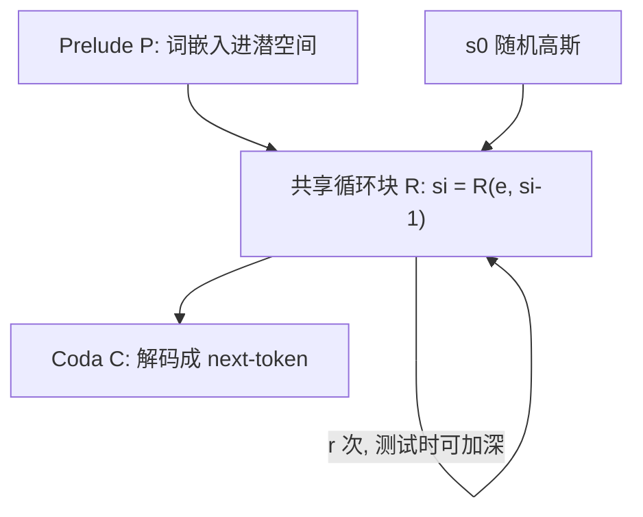

# Huginn：测试时加深循环，在潜空间里把算力花完

<!-- release-date: 2025-02-07 -->

**本文依据**：`Scaling up Test-Time Compute with Latent Reasoning: A Recurrent Depth Approach`，arXiv 2502.05171v2（[cs.LG] 17 Feb 2025），37 页。第一作者 Jonas Geiping，封面脚注 **1 = ELLIS Institute Tübingen**（同一上标还写 Max-Planck Institute for Intelligent Systems、Tübingen AI Center）；其余为 University of Maryland, College Park 与 Lawrence Livermore National Laboratory。通讯 Jonas Geiping、Tom Goldstein。封面**没有会议名**。权重 `huggingface.co/tomg-group-umd/huginn-0125`，代码与数据 `github.com/seal-rg/recurrent-pretraining`。首发日取 arXiv v1 提交日 2025-02-07。文中数字都标 PDF 页码；标「外部补充」的段落不来自本文。

## 一句话

主流推理模型把测试时算力花在**多吐 token**（长 CoT）上；本文把同一份 **3.5B** 参数的循环块在测试时 unroll 到任意深度，在**连续潜空间**里迭代，不需要专用 CoT 数据、也不需要超长上下文。摘要写预训练 **800B** token，测试时加深循环可把推理基准推到等价 **50B** 固定深度 Transformer 的算力负载（PDF p. 1）。图 1 把横轴标成 Test-Time Compute Recurrence，纵轴 Accuracy；OpenBookQA 很快饱和，GSM8K CoT 继续吃更深循环（PDF p. 1）。主模型叫 **Huginn-0125**（PDF p. 6）。

## 一、矛盾：测试时加算力，为什么一定要「说出来」

人解题会在开口前先在脑子里转几圈。语言模型近年也开始「想久一点」，但主流做法是把中间步骤**写成词**再塞回上下文：o1 一类长 CoT、后训练要 demonstrative 轨迹，上下文窗口和 KV cache 一起涨（PDF p. 1–2）。

作者认为把昂贵的内部计算**每次都投影成一个离散 next-token** 是浪费。更干净的第三条轴是：在宽度（参数）和长度（token）之外，加**深度循环**——同一组权重在隐状态上打转，直到该吐词（PDF p. 2）。这不是新发明：RNN、扩散、Universal / looped Transformer 每隔十年都会重现；本文要证明它能训到数十亿参数、半个万亿 token，并且测试时加深循环真的涨分。

相对长上下文推理，潜空间循环有几条具体好处（PDF p. 2）：

- 不需要领域里特制的长演示数据；标准预训练语料上就能变测试时算力。
- 训练和推理都不必为超长 CoT 开巨大窗口。
- 每参数 FLOPs 更高，互联慢的集群上设备利用率更好。
- 先验偏向「学会想」而不是「把事实背进参数」。

它和口头 CoT、预训练扩参**不互斥**，只是第三条轴（PDF p. 2）。

上图根据 PDF 图 2 / 第 3 节重画，是机制示意，不是实测曲线。

## 二、宏观：前奏、副歌、尾声，副歌可以无限加遍

记序列长 $n$、隐维 $h$、词表 $V$。解码器 Transformer 块分成三组（PDF p. 2–3）：

- **Prelude $P$**：若干层，把 token $x$ 嵌成 $e$。
- **Core $R$**：共享循环块，改状态 $s\in\mathbb{R}^{n\times h}$。
- **Coda $C$**：若干层加预测头，从最后状态解出 $p$。

给定循环次数 $r$：

$$
e=P(x),\quad s_0\sim\mathcal{N}(0,\sigma^2 I),\quad s_i=R(e,s_{i-1}),\quad p=C(s_r)
$$

每一步都把 $e$ **再注进去**，并且 $s_0$ 随机。Deep thinking 文献里这两条用来稳定迭代、推向与初值无关的稳态（path independence）（PDF p. 3）。若 $e$ 只在开头给一次，$R$ 甚至不能当单调算子，也就模拟不了对数据相关凸函数的梯度下降。

中间层可互换、头尾层不可换，是固定深度 LLM 的经验；所以头尾拆开、只循环中间（PDF p. 3）。

**Remark 3.1**：这看起来像潜扩散。他们试过每步加噪 $s_i=R(e,s_{i-1})+n$，小实验里没帮助；也试过把步数 $i$ 喂进 $R_i$，和路径无关外推冲突（PDF p. 3）。本文**不是**按扩散目标训的。

## 三、微观：三明治 RMSNorm、拼接适配器、截断反传

层内是因果自注意力 + 门控 SiLU MLP，RoPE base **50000**，RMSNorm；可学习 bias 只在 Q/K（PDF p. 3）。为稳住循环，层序做成 sandwich（PDF p. 3）：

$$
\hat x_l = n_2\bigl(x_{l-1}+\mathrm{Attn}(n_1(x_{l-1}))\bigr),\qquad x_l = n_4\bigl(\hat x_l+\mathrm{MLP}(n_3(\hat x_l))\bigr)
$$

小规模时 pre-norm / post-norm 差不多；**上规模后必须用这套**（PDF p. 3–4）。作者注明 $n_3$ 理论上多余，但终模型就是这么训的。

Prelude：$\gamma E(x)$ 再走 $l_P$ 层。Core：适配器 $A:\mathbb{R}^{2h}\to\mathbb{R}^{h}$ 把 $s_i$ 与 $e$ **拼接**再映射（小模型加法也行，大规模拼接更好），然后 $l_R$ 层，出口再乘 RMSNorm $n_c$。Coda：$l_C$ 层、$n_c$、绑定词表 $E^\top$（PDF p. 4）。

形状写成三元组 $(l_P,l_R,l_C)$。小模型 $(1,4,1)$、$h=1024$；主模型 **$(2,4,2)$**、$h=5280$。只有 8 层「真参数层」，$r=32$ 时有效深度 $2+4r+2=132$（PDF p. 4）。

训练目标对数据 $x$ 和随机深度 $r\sim\Lambda$ 求期望 next-token 损失。$\Lambda$ 是 **log-normal Poisson**：先抽 $\tau\sim\mathcal{N}(\log(\bar r)-\sigma^2/2,\sigma)$，$\sigma=1/2$，再 $r\sim\mathrm{Poisson}(e^\tau)+1$（公式 1–2，PDF p. 4）。图 3：均值约 33、中位 29、众数 24，尾巴偶尔很深。

**截断反传**：只反传最后 **$k=8$** 次循环，激活内存与 $r$ 无关，才能扛住 Poisson 长尾。Prelude 每步都收梯度，因为 $e$ 每步都注入。这是深度上的 TBTT，不是时间上的 RNN（PDF p. 4）。

## 四、把循环训到 3.5B：数据、形状、Frontier

算力只够**一轮**中等规模，所以混合物偏代码与数学，希望挤出涌现推理，而不是刷常识榜（PDF p. 4）。图 4：generic-text **28.71%**、code **25.36%**、scientific-text **18.73%**、synthetic **8.14%**、longform **7.50%**、math **6.14%**，指令类合计几个百分点。全部公开源；指令数据直接混进预训练（Allen-Zhu & Li），**没有做混合物消融**（PDF p. 4–5）。词表 BPE **65536**，在指令子集上训 tokenizer；序列 **4096**；为减轻 grounding，打包时丢掉缺上文的文档尾，数学长文整篇保留（PDF p. 5）。

主模型：$\bar r=32$，$(2,4,2)$，$h=5280$，**55** 头、头维 **96**，MLP 内维 **17920**，RMSNorm $\varepsilon=10^{-6}$。非循环 prelude+head 约 **1.5B**，循环核 **1.5B**，绑定嵌入 **0.5B**（PDF p. 5）。初始化用 Takase 等：$\sigma_h^2=2/(5h)$，截断正态 $3\sigma$；out-projection 方差再除有效层数 $l=132$；嵌入输出乘 $\sqrt{h}$；$s_0$ 方差按封面附近公式排版读作 $\sigma_s^2=2/5$（PDF p. 5；抽取文本写成 `25`）。

并行工人必须锁步抽同一个 $r$，否则最长 $r$ 拖死别人（PDF p. 5）。优化：AdamW，$\beta_1=0.9$、$\beta_2=0.95$，文中先写峰值 $\eta=5\times 10^{-4}$，梯度 clip 1，warmup **4096** 步后恒定学习率（PDF p. 5）；**真正跑通的主实验把峰值降到 $4\times 10^{-5}$**（见下一节，PDF p. 6）。

硬件：ORNL Frontier，AMD MI250X，bf16。单卡矩阵乘实测最高 **125** TFLOP/s；单节点因 $h=5280$ 与编译达到 **108.75** TFLOP/s（**87%** AFU）。只做数据并行 + optimizer sharding + 按迭代粒度的 gradient checkpointing，每卡 batch 1，全局 **16M** token/step（PDF p. 5–6）。**4096** GPU 时每卡 **52–64** TFLOP/s（**41%–51%** AFU），约 **1–1.2M** token/s。手写 DDP 绕过 AMD 互联问题（附录 A.2）。作者称当时可能是 AMD 集群上并行设备数最大的一次训完的语言模型（PDF p. 6）。

时间线：最多 12 小时一段、共 **21** 段，多在 2024 年 12 月初。固定深度对照：同一架构但核只过 1 次，**180B** token、256 节点、每卡 batch 2。主模型最终排到 **795B**，文中常写 **800B**；恒定学习率所以能「有空档就再加一段」（PDF p. 6）。

## 五、规模上，Norm 和初始化会把循环「训没」

小规模几乎怎么初始化都行。大规模第一跑：sandwich、无参 RMSNorm、无 $\gamma$、适配器 $A(s,e)=s+e$、峰值 $4\times 10^{-4}$。图 5 橙线：token 维隐状态相关很快到 **1.0**（表征坍缩），损失停（PDF p. 6）。

第二跑：加嵌入缩放、改回常规 pre-norm、可学习适配器。相关先冲到 1 再在约 **150** 步恢复，但验证 PPL 在 $r=1$ 与 $r=32$ 上一样——模型学会**忽略** $s$（PDF p. 6）。

第三跑（Main）：回到 sandwich，峰值学习率 **$4\times 10^{-5}$**。相关从不贴 1，循环开始干活。之后约 **750B** token 无大尖峰。终检点 **Huginn-0125**（北欧神话里的思想之鸦；脚注还开玩笑：鸟能在测试时展开翅膀）（PDF p. 6）。图 6：800B 上各 $r\in\{1,4,8,16,32,64\}$ 的验证 PPL 都在降。

## 六、Figure 1 与 5. Benchmark Results：加深循环涨的是难任务

先对照封面图 1（PDF p. 1）：同一 3.5B 模型，横轴循环次数（还标了 materialized 参数 3.6B 一直到 103B 那一档），ARC challenge / GSM8K CoT / OpenBookQA 三条曲线。少推理的 OpenBookQA 先平，GSM8K 继续吃深度。这是全文第一张实验结果图。

然后第 5 节正式评测（PDF p. 7）。对照 Amber、Pythia、OLMo 1/2 等**公开数据**开源模型；lm-eval + bigcode-bench。作者自己划边界：3.5B 参数、互联需求小，但预训练 FLOPs 接近 **32B** 固定深度，测试时还能加到等价 **50B**；主检点只 **47000** 步、学习率没 cooldown、800B 对现代开源仍小（PDF p. 7）。

### 表 1 零样本常识（PDF p. 7，$r$ 加深）

| 设置 | ARC-E | ARC-C | HellaSwag | MMLU | OBQA | PiQA | SciQ | WinoGrande |
|---|---:|---:|---:|---:|---:|---:|---:|---:|
| Ours $r=4$ | 49.07 | 27.99 | 43.46 | 23.39 | 28.20 | 64.96 | 80.00 | 55.24 |
| Ours $r=8$ | 65.11 | 35.15 | 58.54 | 25.29 | 35.40 | 73.45 | 92.10 | 55.64 |
| Ours $r=16$ | 69.49 | 37.71 | 64.67 | 31.25 | 37.60 | 75.79 | 93.90 | 57.77 |
| Ours $r=32$ | 69.91 | 38.23 | 65.21 | 31.38 | 38.80 | 76.22 | 93.50 | 59.43 |
| Pythia-6.9B（0.3T） | 60.48 | 34.64 | 63.32 | 25.74 | 37.20 | 75.79 | 82.90 | 61.40 |
| OLMo-7B（2.5T） | 68.81 | 40.27 | 75.52 | 28.39 | 42.20 | 80.03 | 88.50 | 67.09 |
| OLMo-2-1124-7B（4T） | 82.79 | 57.42 | 80.50 | 60.56 | 46.20 | 81.18 | 96.40 | 74.74 |

作者判断：超过老 Pythia，大致可比第一代 OLMo-7B，明显落后后来仔细配数据的 OLMo（PDF p. 7）。SciQ 在 $r=16$ 的 **93.90** 略高于 $r=32$ 的 **93.50**，以表格为准，不要把「越深越好」写死到每一格。

### 表 2–3 数学与代码（PDF p. 8，$r=32$）

GSM8K 报 flexible / strict；Minerva MATH 是 extract match；MathQA 是 acc norm。

| 设置 | GSM8K | GSM8K CoT | Minerva MATH | MathQA |
|---|---|---|---:|---:|
| 无系统提示 | 28.05 / 28.20 | 32.60 / 34.57 | 12.58 | 26.60 |
| 有系统提示 | 24.87 / 38.13 | 34.80 / 42.08 | 11.24 | 27.97 |

代码 pass@1：MBPP **24.80**、HumanEval **23.17**，超过表中一般开源基座，低于 StarCoder2-3B 的 43.00 / 31.09（3.3T 代码数据）（PDF p. 8）。数学上除最新 OLMo-2 外显著更好；语言建模已减速，代码和数学在训练中仍几乎线性涨——**前提是测试时给够循环**（图 8，PDF p. 9）。

### 表 4：循环Twin 对固定深度 Twin（PDF p. 9）

同一数据与设置，180B token：

| 模型 | ARC-E | ARC-C | HellaSwag | GSM8K CoT |
|---|---:|---:|---:|---|
| 固定深度基线 | 46.42 | 26.96 | 37.34 | 1.82 / 2.20 |
| 循环 $r=32$ | 53.62 | 29.18 | 48.80 | 9.02 / 10.24 |
| 循环 $r=1$ | 34.01 | 23.72 | 29.19 | 0.00 / 0.15 |

GSM8K 上 180B 循环模型已是基线约 **5 倍**。800B 后 $r=1$ 几乎停在原地（ARC-E 34.89，GSM8K 0），增益写在循环块里，不在 prelude/coda（PDF p. 8–9）。图 7：HellaSwag 约 **8** 次循环近峰值，GSM8K / HumanEval 继续吃到 32–64。

图 9：ARC-C 饱和点随 few-shot 变。0-shot 大约 **8–12** 次就平；1-shot 约 **20**；25–50-shot 约 **32**——上下文越多，模型越愿意多转几圈（PDF p. 9）。

表 5 OpenBookQA：闭卷 **38.2**，给相关事实开卷 **49.2**（$\Delta=+11.0$），缩小与 OLMo-2（46.2 / 53.4）的差距。解读：循环模型**记事实的容量更小、用上下文推理的容量更大**（PDF p. 9）。这是作者的判断，不是单独的记忆探针实验。

### 5.4 权值平均

恒定学习率可用 EMA 模拟 cooldown：$\beta=0.9$，从最后检点纳入 **75** 个、dilation **7**。EMA 在 $r=64$ 把 GSM8K 推到 flexible **47.23%**、strict **38.59%**（PDF p. 9；原文拼写 GMS8k）。

## 七、循环深度让若干「要专门训」的技巧变成零样本

第 6 节声称：对普通 Transformer 很费劲的功能，这里几乎是架构附赠（PDF p. 9–11）。

**按 token 自适应退出。** 训练时整段共用一个 $r$（公式 1），测试时可用相邻步 KL。阈值 **$5\times 10^{-4}$** 就停、采样、进入下一 token。图 10：MMLU 各类题的退出步数分布；高中数学比逻辑谬误、道德情景更快；哲学在 continuous CoT 下一部分 token 更早停。MTBench：标准 **5.63**，早退 **5.56**（附录表 6，正文 PDF p. 10）。

早退会让某些位置缺 KV。他们不重算缺失层，而是让当前步去注意**已有的最深层 KV**——同一套 K/V 投影从相继隐状态出来，对得上（PDF p. 10）。

**KV cache 共享。** 预算 $k$，第 $i$ 步读写 $i \bmod k$。MTBench、预算 4：**5.86**（附录表 6，PDF p. 10）。可与早退叠用。

**连续 CoT。** 下一 token 的 $s_0$ 不用新噪声，而用上一 token 的 $s_r$。图 10 平均少 **1–2** 步。和 Hao 等把固定深度模型微调成吃自己隐状态不同：这里是从头为循环预训练，不依赖 CoT 数据（PDF p. 10–11）。

**自投机解码。** 少循环草稿、多循环验证；草稿状态可复用。不需要外挂草稿模型或 Medusa（PDF p. 11）。

## 八、规模涌现：轨道、滑块、路径无关

第 7 节问：循环时到底在干什么。目标里**没有**「必须收敛到不动点」的先验，只有截断 unroll（PDF p. 12）。

图 11：对 $s^*$（$r=128$）的距离，行是 token、列是迭代。关键短语和回答开头「商量」更久；三个相同的点号行为不同；`school` 等 token 距离**非单调**——在绕圈。图注里的不安全问题最后拒绝回答，图里没画出来（PDF p. 11）。

图 12 把整段轨迹做 PCA，看前 6 个方向：多数 token 收敛；GSM8K 里 omelette 的 `"3"` 在三对 PC 上都进轨道；`"wrong"` 沿一个方向滑，作者猜测可当「已经转了多少步」的计数器（PDF p. 12–13）。口头 CoT 是一条离散词链；这里是高维几何：轨道、收敛、漂移。

**路径无关**：换多个 $s_0$，仍走相似轨迹（Anil 等的意义；附录图 22）（PDF p. 13）。

## 九、相关工作、未来、结论——以及本文没写的

相关工作把循环从 RNN / 自适应计算（Graves）接到 Universal Transformer、ALBERT 固定循环、looped Transformer、深度均衡模型、扩散、能量模型、Kuramoto。与均衡/扩散的差别主要在**目标**：均衡解「直接问题」，扩散用代理目标，本文用**可扩展的截断 unroll**（PDF p. 13）。Hao / Cheng / Liu 是在固定深度上微调出潜推理，方向相反（PDF p. 13）。

未来：压缩循环的微调、按难度 RL、把 CoT 内化进循环；线性注意力等弱混合器可靠循环补比较次数；多段循环；以及 **MoE + 循环**——MoE 擅存、循环擅想，循环 MoE 甚至可以对同一专家多访再换专家（PDF p. 13–14）。

结论自己降调：仍是 **proof-of-concept**，一轮训练、学习率与数据都未优化。观察到的是：测试时潜推理能大幅拉推理任务、收敛速度随上下文变、路径无关、以及若干零样本系统技巧（PDF p. 14）。

报告没写的：没有工业级 cooldown 与数据消融；没有和长 CoT RL 模型的直接同算力对比；图 1 的「50B 等价」是 FLOP 负载示意，不是训了一个 50B 对照；附录数据清单与 AMD 互联细节正文只指向 Appendix A/C，解读未逐源复述。

## 可迁移启发

- 测试时算力不必等于「多说话」。权值共享的深度循环是第三条轴，数据仍可以是普通 next-token。
- 大规模循环会先死在初始化：表征相关→1，或学会忽略 $s$。sandwich norm、拼接适配器、每步注入 $e$、随机 $s_0$、峰值学习率往下调，是这篇用两次失败买来的配方，换硬件仍要重探。
- 截断反传最后 $k$ 步，才能把训练时 $r$ 的分布尾巴拉长；prelude 靠反复注入继续更新。
- 难任务、长上下文、开卷事实，更吃深度；闭卷背诵更吃参数。别用循环模型硬刚「谁背得多」。
- 早退、KV 共享、自投机如果「对得上」，往往是因为循环块共用投影。普通逐层 Transformer 不能直接抄阈值。

## 关键词回看

- **Latent recurrent depth / Huginn**：共享核 $R$ 在潜状态上迭代，测试时加深 $r$。
- **Prelude / Core / Coda**：$(2,4,2)$ 头尾特异、中间可循环。
- **Input injection**：每步把 $e$ 拼进 $R$，迭代才像在优化依赖数据的目标。
- **Truncated unrolling**：只反传最后 $k=8$ 次。
- **Path independence**：不同 $s_0$ 走到同类几何。
- **Materialized parameters**：unroll 后的等效深度/算力，不是多出来的独立权重。
