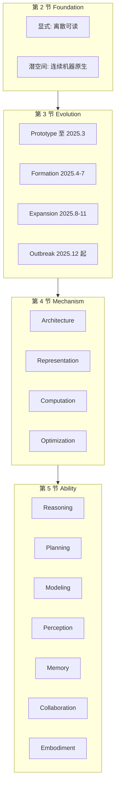

# Latent-Space-Survey：显式 token 撑不住内部计算之后，潜空间被当成原生工作台

<!-- release-date: 2026-04-02 -->

**本文依据**：`The Latent Space: Foundation, Evolution, Mechanism, Ability, and Outlook`，arXiv **2604.02029v1**（页眉 `[cs.AI] 2 Apr 2026`），**68 页**。封面**没有会议名**。作者 Xinlei Yu 等（封面标 Core Contributors / Core Supervisors / Organizer）；封面机构段第一个是 **National University of Singapore**，其后还有 Fudan、Tsinghua、Zhejiang、Shanghai AI Laboratory 等一长串（PDF p. 1）。清单仓 `YU-deep/Awesome-Latent-Space` 印在封面。首发日取 arXiv v1 **2026-04-02**（Submitted on 2 Apr 2026）。文中数字均标 PDF 页码；标「外部补充」的段落不来自本文。

## 一句话

语言系模型（LLM / VLM / VLA 以及以语言骨干搭的 agent）对外仍像在吐 token，内部真正干活的却是连续激活。作者把这块连续、学出来的表示叫 **latent space**（潜空间），并把它从「隐层实现细节」抬成 **machine-native substrate**（机器原生计算底盘）：推理、规划、感知、记忆、协作、具身动作都可以先在这里做，不必每一步都翻成人类可读的话（PDF p. 1、p. 3）。

这张综述的主矛盾不是「再列一遍连续思维链」，而是：**显式空间（explicit / verbal space）有语言冗余、离散瓶颈、逐步解码成本和语义损失；潜空间更连续、更紧、更保真，但文献按任务、机制、场景切碎了。** 先前综述多停在 latent reasoning / implicit reasoning；本文要一张跨模态、跨机制、跨能力的统一地图（PDF p. 3–4）。下一阶段他们点名：把潜空间做成可评估、可控、可解释的内部工作台，语言只当指令、生成和核对外接口（PDF p. 46–48）。

贯穿全文的轴不是「谁分数最高」，而是：**潜空间怎么定义、怎么长出来、怎么嵌进模型、它解锁什么能力、下一步卡在哪。**

## 一、这张地图切了几刀

### 旧图切不动的地方

现代系统仍常被理解成 token 级生成：输入、输出、中间推理都是人能读的符号（PDF p. 3）。作者认为这套框已经不够：计算本来就走连续激活，潜空间不该只当隐藏实现（PDF p. 3）。显式空间的结构性限制被写成四条：冗余、离散瓶颈、顺序解码成本、细粒度信息损失——复杂、多模态、长视野时更明显（PDF p. 1、p. 3）。

研究已经从「把 CoT 内化成连续状态」扩到规划、建模、感知、记忆、协作、具身（PDF p. 1）。碎裂至少三处：应用对象（推理 / 视觉 / 动作）、机制（架构 / 表示 / 计算 / 优化）、场景（文本 / 视觉 / 多智能体 / 具身）（PDF p. 4）。缺的是把潜空间当成更广的计算与系统范式的统一视角（PDF p. 4）。

### 第一刀：五个顺序问题，而不是「问题 → 方案 → 实验」

图 2 把整篇钉成五问，顺序即叙事（PDF p. 4 图 2）：

1. **Foundation**（第 2 节）：潜空间是什么，和显式空间、生成视觉模型的潜空间差在哪。
2. **Evolution**（第 3 节）：从原型到爆发怎么走。
3. **Mechanism**（第 4 节）：怎么实例化、怎么运转。
4. **Ability**（第 5 节）：解锁哪些下游能力。
5. **Outlook**（第 6 节）：挑战与下一步。

贡献清单四条：划范围；把演化收成多模态 / 系统范式；提出 **Mechanism × Ability** 二维分类；配图、表、链接和仓库（PDF p. 5）。**轴本身是这篇综述的主贡献**；收了多少篇是副产品。

### 第二刀：机制四线 × 能力七域

图 1 是总分类图（PDF p. 3）。一篇方法可以挂多条机制、多种能力；图上只画「最合适」的那一格（PDF p. 3 图注）。

- **Mechanism**（第 4 节）：Architecture、Representation、Computation、Optimization。
- **Ability**（第 5 节）：Reasoning、Planning、Modeling、Perception、Memory、Collaboration、Embodiment。

图是机制示意，对应 PDF p. 3 图 1、p. 4 图 2。时间切分见第 3 节（PDF p. 9 图 4）。

### 形式化这一刀：生成条件上多一个 $z$

表 1 给符号：$\mathcal{V}$ 是离散 token 空间，$\mathcal{H}$ 是连续隐空间 $\mathbb{R}^d$，$h$ / $H$ / $z$ 分别是单 token 隐状态、序列隐状态、潜表示（PDF p. 13 表 1）。标准自回归是 $y\sim\Phi_\theta(\cdot\mid x)$，接口仍是 token 到 token（PDF p. 14 式 (1)）。潜空间方法写成（PDF p. 14 式 (2)）：

$$
y\sim\Phi_\theta(\cdot\mid x,z),\qquad z\in\mathcal{H}.
$$

$z$ 用来扛不好直接写进 token 的东西：全局语义、多模态特征、中间推理、结构约束（PDF p. 14）。中心问题不是「有没有潜变量」，而是它怎么嵌进生成（PDF p. 14–15）。

## 二、每一区里有什么

下面按第 2–5 节走。各节开头的 **Mechanism:** 框是作者自己的分类句；框外点名的工作是地图钉子。哪些还在打架，放到第三节。

### 第 2 节 Foundation：先把「不是什么」划清

**概念。** 显式 / 言语空间是词汇表上的离散符号，训练目标通常就写在这里：给前缀、预测下一个 token（PDF p. 5）。模型并不只在符号上算：token 先映成连续表示，再多层非线性变换。作者把潜空间说成：连续、学出来的表示空间，编码没有在 token 级说出来的信息；更精确地说是一族隐状态空间，上下文、语义、句法、关系挤在一起。显式序列映成潜空间里的一条轨迹，再投回言语空间得到下一 token 分布；还可以扩成跨模态的统一连续内部表示（PDF p. 5–6）。形式化放到第 4 节。

**和显式空间比：表示四对、功能四加三。** 图 3 是对照图（PDF p. 6）。表示侧：人可读 vs 机器原生；离散符号 vs 连续灵活；低效 vs 高效；语义损失 vs 高保真（PDF p. 6–7）。功能侧潜空间占 Operability、Expressiveness、Scalability、Generalization；Evaluability / Controllability / Interpretability 则是显式空间更强——潜空间难做细粒度直接评估、控制和解释，挑战放到 6.2（PDF p. 7–8）。

三条低效被写死：语言冗余；每步都要从窄显式通道挤过去的表示转换；离散 tokenization 锁死逐步前向和整表 softmax（PDF p. 7）。语义损失来自量化瓶颈：有限词表加语言组合约束，细粒度不确定性、中间痕迹、跨模态对齐可能被压扁或丢掉（PDF p. 7）。

**和生成视觉模型的潜空间比。** 视觉侧从 VAE 式重建、VQ-VAE 离散码、latent diffusion 的感知压缩空间走来，视频再加时空轴（PDF p. 8）。共同点是学出来的连续表示；差别在几何、组织、条件机制（PDF p. 8）：

- **目标**：视觉潜空间被重建目标塑形，插值常有感知意义；语言模型隐状态由下一 token 预测组织，**没有对几何的显式约束**（PDF p. 8）。
- **结构**：视觉保持时空网格；语言侧重语义，没有空间拓扑或物理动力学（PDF p. 8）。
- **可控**：视觉常用姿态、深度、分割、参考图等建筑内通路；这是对照，不是说语言模型已经有同等通路（PDF p. 8）。

### 第 3 节 Evolution：四段，瓶颈推动下一段

图 4 横轴月份、纵轴潜空间相关工作数量，切成四段（PDF p. 9）：

| 阶段 | 时间（文内） | 作者给的主题 |
|---|---|---|
| Prototype | Previous – 2025.3 | 理论验证 + 早期探索 |
| Formation | 2025.4 – 2025.7 | 理论系统化 + 技术成形，仍以文本潜推理为主 |
| Expansion | 2025.8 – 2025.11 | 技术成熟 + 范式 / 场景扩张 |
| Outbreak | 2025.12 – Present | 全面爆发 |

（PDF p. 9）

**Prototype。** 先问：是不是每一步中间推理都必须说成自然语言。理论验证侧：HCoT 用对比语义对齐把整段 CoT 压成紧的特殊 token；Zhang and Viteri 从激活抽 steering vector，推理时注入就能引出类 CoT，不必微调或显式提示；Hu 等给 Hopfield 式解读；Latent Space Chain-of-Embedding 用潜嵌入做自评（PDF p. 9）。早期系统： **COCONUT** 把最后隐状态喂回当下一步输入嵌入，形成绕过词表瓶颈的连续 thought 环，并报告连续向量能叠多种下一步、出现广度优先搜索；CCoT 用 contemplation token 压显式链；Liu 等用离线 coprocessor 给 KV cache 加潜嵌入、解码器冻结；Huginn 用共享 transformer 块可变次迭代做隐式推理；SoftCoT 把实例相关 soft thought 投进冻结骨干，避免灾难遗忘（PDF p. 9–10）。本阶段瓶颈：还缺「为什么有效、何时优于显式 CoT、怎么比」的系统账（PDF p. 10）。

**Formation。** Zhu 等 *Reasoning by Superposition* 给连续 thought 作叠加态的复杂度分析，用来解释 COCONUT；CoT2 量化并行与嵌入维关系，并引入连续监督与强化学习；Saunshi 等证明带潜迭代的 looped transformer 能表达比标准 transformer **严格更复杂** 的计算（PDF p. 10）。方法侧：Assorted 混离散潜 token 与文本；CODI 自蒸馏、同一模型当教师 / 学生分别走显式与潜空间；BoLT 把网页文本当思想过程的压缩结果做预训练。优化侧点名 HRPO、System-1.5、CoLaR。多模态初探：Mirage 把隐状态重铸为与文本交错的视觉潜 token；UniVLA 从互联网视频学任务中心的潜动作（PDF p. 10–11）。瓶颈：仍窄、文本中心、下游多样性弱，记忆 / 规划 / 通信 / 动作还没拧在一起（PDF p. 11）。

**Expansion。** 文本侧：MemGen 做 agent 潜记忆；LTPO 把潜 thought 当可优化参数；Ouro 把优化搬进预训练的 looped LM；You 等用潜奖励模型做并行测试时缩放；SofT-GRPO 用 Gumbel 重参数把 RL 接到连续潜推理。交错：SpiralThinker、CLaRa。视觉：LVR、Monet 在视觉嵌入空间自回归；3DThinker 对齐 3D 基础模型；VisMem / CoMEM 做视觉记忆；Latent Sketchpad、LaCoT。协作：C2C 用 KV-cache 投影与融合做模型间直接语义通信；另有 mind-to-mind 理论框架与 LatentMAS 共享潜工作记忆。具身：LAPA、LAWM 从无标视频做潜动作预训练；OccVLA、SRPO、ATE（PDF p. 11–12）。瓶颈改成 **碎**：架构假设、优化目标、评测、潜接口对不齐（PDF p. 12）。

**Outbreak。** 架构专用化：Dreamer、LoopFormer 的深度循环与弹性 loop；MLRA 低秩注意力；DLCM 从 token 粒度改到概念级。优化独立成轴：ReLaX、Active Latent Planning；Özeren and Aßenmacher 系统分析称 RL 仍对设计选择敏感；LED 用循环深度上的熵变化打后训练探索坍缩；Latent Thinking Optimization 称潜 thought 本身能编码奖励相关信息。视觉交错：ILVR、CrystaL、LIVR、Mull-Tokens、VL-JEPA、DMLR。多智能体：K-V cache 对齐适配器、L2-VMAS、Wormhole、LatentMem。VLA：Motus、VLA-JEPA、Villa-X、JALA、CoWVLA、WholeBodyVLA、SwiftVLA、LoLA（PDF p. 12–13）。下一阶瓶颈是 **consolidation**：接口标准化、跨模态原则性评测、效率与可解释对齐、接到更广的 agent 系统（PDF p. 13）。

### 第 4 节 Mechanism：四条怎么造、怎么用

图 5 是机制总图（PDF p. 14）。四条互补，不是互斥排行榜（PDF p. 13–14）。

**4.1 Architecture：潜空间嵌在哪。** 框：Backbone 用循环 / loop / 递归让主模型自带潜能力；Component 用生成、投影、对齐、控制、存储等头，骨架不动；Auxiliary Model 另挂一个模型给监督或中间特征（PDF p. 15）。骨干形式（PDF p. 15 式 (3)）：

$$
h_{t+1}=\Phi_{\mathrm{back}}(h_{1:t},x,y_{1:t}).
$$

表 2 列骨干规格（节选，PDF p. 15）：

| 表内日期 | Backbone | 隐维 | 层数 | 规模 | 特征（表内） |
|---|---|---:|---:|---|---|
| 01/25 | Heima | 4096 | 72 | 19B | encoder-decoder / 渐进 / 自适应解码 |
| 02/25 | Huginn | 5280 | 8 | 3.5B | decoder-only / 循环深度 / 共享块 / 测试时 |
| 02/25 | Looped Trans. | 5120 | 24 | 1.5B | decoder-only / loop / loop 正则 |
| 10/25 | Ouro | 2048 | 24/48 | 1.4B/2.6B | decoder-only / 递归推理 / 参数共享 loop |
| 12/25 | DLCM | 1536 | 32 | 2.3B | encoder-decoder / 大概念模型 / 层次异构 |
| 01/26 | Dreamer | 1024 | 16/32 | 1B/2B | 深度循环 / 序列–深度稀疏注意力混合 |

表内「-」表示综述未填，不要补。正文还把骨干分成参数共享、迭代精炼、增强三类（PDF p. 16）。组件与辅助模型各有总表（目录标 Table 3 等，PDF p. 15），此处不逐行复述。

**4.2 Representation：内部 / 外部 / 可学习 / 混合。** 图 6（PDF p. 21）。Internal：前向里的嵌入、中间隐状态、KV cache，不再加参数，读出 $z=g(\{H_l\}_{l\in S})$（PDF p. 21 式 (6)–(7)）。External：独立辅助系统（如冻结编码器）注入条件或监督。Learnable：连续虚 token、轻量 adapter，端到端训。Hybrid：先可学习模块造表示，再当外源信号打进骨干（PDF p. 21）。表 4 按模态、骨干、subject、scenario 列方法（PDF p. 22 起）。钉子：COCONUT 用最后隐状态；Soft Thinking / CoT2 用加权嵌入；SALS 压 KV cache；LatentMAS 用隐状态 / KV cache 做多智能体；CODI 用教师隐状态；SoftCoT 用 assistant 隐状态（PDF p. 22 表 4）。

**4.3 Computation：压、扩、自适应、交错。** Compressed 分 traces / states / features：HCoT、SoftCoT、CCoT、CODI、CoLaR 压轨迹；KaVa 把 KV 压缩当蒸馏，SALS 训练无关低秩主空间，DeltaKV 存残差；视觉 / 具身有 RoT、OneLatent、LatentVLA、Future-VLA（PDF p. 28–29）。Expanded 分深度 / 宽度 / 结构：Huginn、Loop、LoopFormer、Ouro、ETD 加深；SoftCoT++、LatentTTS、PCCoT、CoT2 加宽并行假设（PDF p. 29–30）。Adaptive 与 Interleaved 处理预算分配和文本–潜 / 视觉–文本交错（目录 4.3.3–4.3.4，PDF p. 2）。作者收束：有效推理不必全程 token 化、全程物化（PDF p. 29）。

**4.4 Optimization：预训练 / 后训练 / 推理时。** 推理时三条：缩放（随机搜轨迹）、对潜变量做梯度（LTPO、$\nabla$-Reasoner、LatentEvolve）、引导 / 对比干预压幻觉（REVIS、STIR、VTI、Control++）（PDF p. 36–37）。和参数级优化的差别：权固定，把潜状态本身当优化变量（PDF p. 37）。

### 第 5 节 Ability：七域是「潜空间能干什么」

图 8 把每域再切能力词（PDF p. 38）。共同叙事：这些结构用自然语言外化都贵、损或根本说不清（PDF p. 45）。

- **Reasoning**：从显式 CoT 改到连续流形上想。六块：Implicit Inference、Compact Trace、Continuous Refinement、Branching Path、Modal Generalization（文内列六项，第五项名称在图 8 侧为 branching path）（PDF p. 37–38）。COCONUT 仍是「先在内部推、再承诺语言」的标本（PDF p. 38）。
- **Planning**：可控探索、高效搜索、自适应预算、序列决策（PDF p. 38 图 8）。
- **Modeling**：对潜表示自身的刻画、自检、稳健控制、可缩放计算（PDF p. 38）。
- **Perception**：多模态推理、启发式想象、忠实 grounding；少把视觉先翻成离散文本（PDF p. 37、p. 41 附近）。
- **Memory**：工作保持、持久 mind、多模态召回；MemGen / VisMem / CoMEM 是演化段钉子（PDF p. 11、p. 38）。
- **Collaboration**：语义保真、共享认知、异构互操作；C2C、LatentMAS 把通信从文本改成连续通道（PDF p. 11–12、p. 38）。
- **Embodiment**：无监督 grounding、隐式思考、预测前瞻、空间认知、跨身体迁移；潜动作成为 VLA 预训练与部署的中心接口（PDF p. 13、p. 38）。

## 三、作者的判断（和他们综述到的事实分开）

第 2 节对照、第 3 节时间线、第 4 节表 1–4 与式 (1)–(2)、第 5 节能力清单，是「他们综述到的事实」。下面是「他们认为缺什么、场往哪走」——主要落在各阶段瓶颈句和第 6 节。

**阶段叙事是瓶颈驱动，不是年表装饰。** Prototype 缺解释与可比评测；Formation 缺跨场景用处；Expansion 缺统一；Outbreak 缺 consolidation（PDF p. 10–13）。这是作者的阅读框架。

**机制趋势四句话。** 从启发式使用到系统原则；从外部接入到内部使能；从静态固定到动态自适应；从常规设计到多种范式。未来与其「给现有模型加一层潜空间」，不如设计 **核心就是潜的模型**（PDF p. 45）。

**能力上的最大后果。** 不只增强推理，而是给规划、建模、感知、记忆、通信、具身一块共同底盘。长期含义：潜空间可能成为通用模型的主介质；不是取代显式 token，而是在共享连续空间里协调异构信息（PDF p. 45）。

**构成性张力。** 效率、表达力的收益，换来评估、控制、解释变差（PDF p. 8、p. 45–46）。6.2 把障碍收成三条（PDF p. 46）：

1. **Evaluability**：潜轨迹人看不了，难区分「真有结构的中间推理」和「只是和正确答案相关」；现在仍主要靠最终答案或事后言语化。开始有 latent-space reasoning 基准，但协议不成熟、任务 / 数据 / 度量碎，公平比较难（PDF p. 46）。
2. **Controllability**：原则上可操作，实践上细粒度干预可控性低；难处不只是在哪干预，而是高层语义意图如何写成既机器可执行、又够精确、人还能懂的目标（PDF p. 46）。
3. **Interpretability**：高维、分布式、纠缠，维和轨迹对不上稳定概念；更强同时更难审计、诊断、问责（PDF p. 46）。

**第 6.3 节未来四块，都是开放方向不是已收敛结论**（PDF p. 46–48）：

1. **Theory**：从「实践上能用」到统一的潜表示 / 潜计算理论；显式与潜空间是互补体制——语言当外交互，潜空间当内部工作台；还要可信潜空间的原则性理论（PDF p. 47）。
2. **Multimodal**：从文本中介的多模态转到模态原生的潜计算；从孤立多模态模型转到用共同潜底盘协调感知、世界模型、记忆、通信、动作（PDF p. 47–48）。
3. **Downstream**：中间态最吃显式离散痕迹的任务——搜索密集推理、序列规划、视觉感知、长视野记忆、多智能体协调、具身控制；多数内部推断在潜空间，只外化最终输出或战略检查点（PDF p. 48）。
4. **Governable**：基准要测轨迹忠实与稳健；监督要有过程信号；可控接口对齐目标、预算、安全；可解释框架找语义结构、因果路径和失败源（PDF p. 48）。

结论段再钉一次：潜空间可能成为语言系模型的基础原则；机制在变、能力边界在推；同时必须把理论、基准、透明可控补上（PDF p. 48）。这是作者的自我定位，不是新实验。

## 四、这张地图指向哪些值得单独读

下面几篇是轴上的锚点，不是排行榜。标题与 arXiv 号均出自本 PDF 参考文献。正文不写待办。

1. **Training Large Language Models to Reason in a Continuous Latent Space**（arXiv 2412.06769）——COCONUT：连续 thought 环、叠加态、潜推理时间零点。
2. **Scaling Up Test-Time Compute with Latent Reasoning: A Recurrent Depth Approach**（arXiv 2502.05171）——Huginn：共享块循环深度，测试时算力与参数量解耦。
3. **Reasoning by Superposition: A Theoretical Perspective on Chain of Continuous Thought**（arXiv 2505.12514）——给 COCONUT 经验现象的形式复杂度解释；Formation 阶段理论钉。
4. **Cache-to-Cache: Direct Semantic Communication Between Large Language Models**（arXiv 2510.03215）——C2C：KV-cache 投影融合，协作从文本信道改到潜信道。
5. **Latent Collaboration in Multi-Agent Systems**（arXiv 2511.20639）——LatentMAS：共享潜工作记忆；Expansion 协作钉。
6. **SoftCoT++: Test-Time Scaling with Soft Chain-of-Thought Reasoning**（arXiv 2505.11484）——宽度扩展：连续嵌入里多条并行路径，测试时缩放标本。

读完这六篇，综述里的「显式 vs 连续 thought」、循环深度、以及多智能体潜通信都能落到具体系统上。第 2.3 节拿来对照的 VAE / 潜扩散不是本地图的下一站主线。先前停在 latent reasoning 的综述（参考文献 [297] *A Survey on Latent Reasoning*，arXiv 2507.06203）是作者声明要覆盖的前图，不是本二维分类的替代实验。

## 限制与本文没写的

综述没有自己跑一张统一排行榜；表 2 / 表 4 规格与场景是各论文报告值的转述。封面未印会议，不补。Awesome 清单会继续变，本文只解释 68 页 PDF 冻结下来的那张地图。作者把「下一代通用智能的主工作台」写成志向；他们同时写明评估、控制、解释仍弱，过程级证据往往间接。
